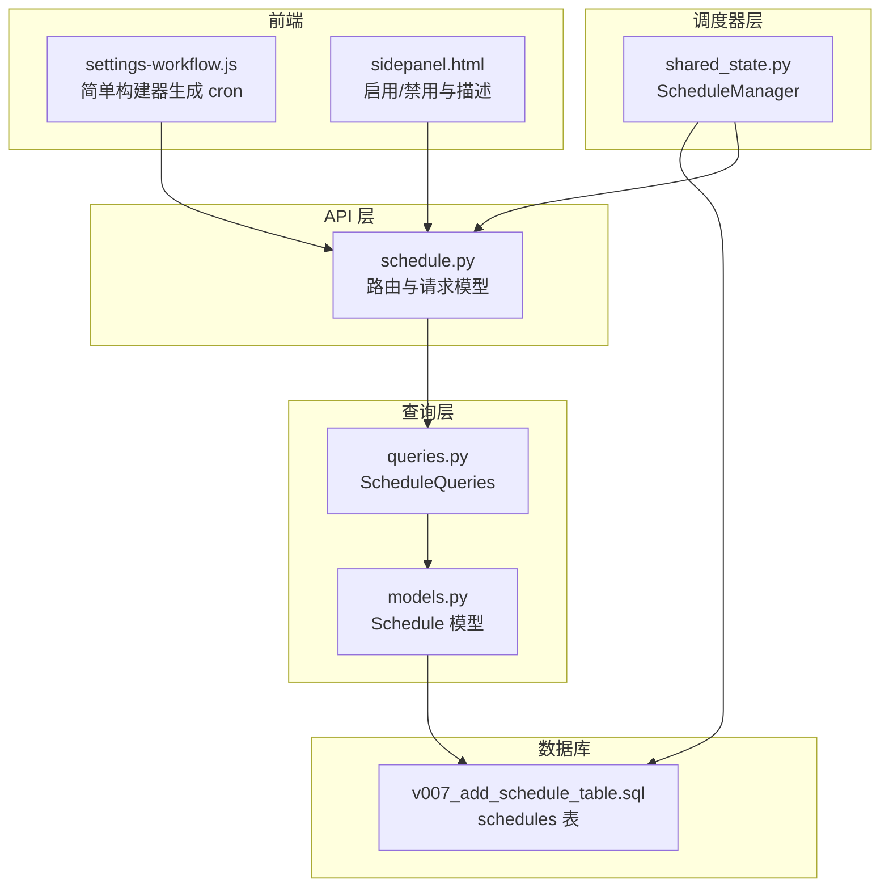
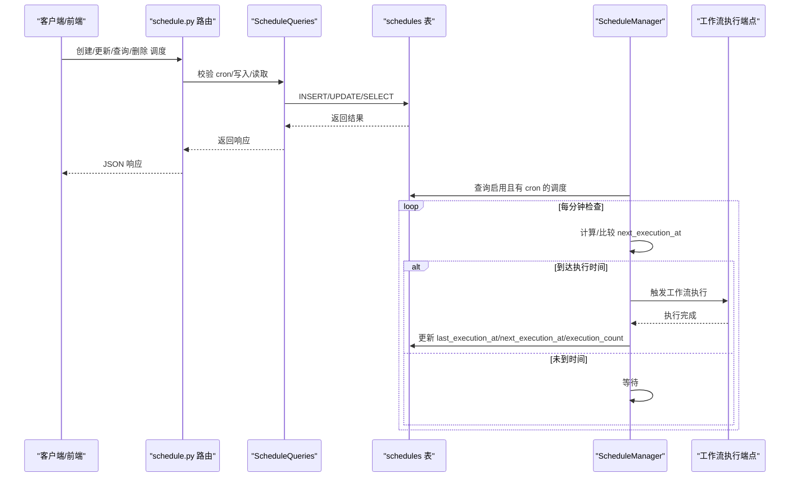
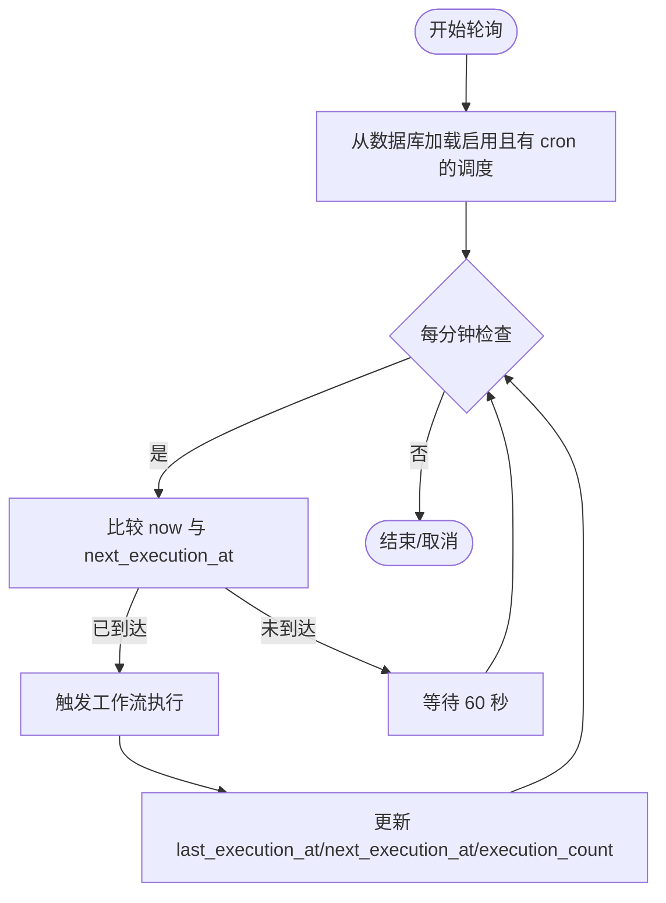
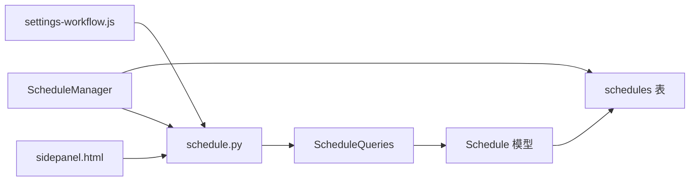

# 任务调度

<cite>
**本文引用的文件**
- [schedule.py](file://vibe_surf/backend/api/schedule.py)
- [v007_add_schedule_table.sql](file://vibe_surf/backend/database/migrations/v007_add_schedule_table.sql)
- [models.py](file://vibe_surf/backend/database/models.py)
- [queries.py](file://vibe_surf/backend/database/queries.py)
- [shared_state.py](file://vibe_surf/backend/shared_state.py)
- [main.py](file://vibe_surf/backend/main.py)
- [settings-workflow.js](file://vibe_surf/chrome_extension/scripts/settings-workflow.js)
- [sidepanel.html](file://vibe_surf/chrome_extension/sidepanel.html)
</cite>

## 目录
1. [简介](#简介)
2. [项目结构](#项目结构)
3. [核心组件](#核心组件)
4. [架构总览](#架构总览)
5. [详细组件分析](#详细组件分析)
6. [依赖分析](#依赖分析)
7. [性能考虑](#性能考虑)
8. [故障排查指南](#故障排查指南)
9. [结论](#结论)
10. [附录](#附录)

## 简介
本文件系统化文档化 VibeSurf 的任务调度系统，围绕 schedule.py 中的任务调度 API 设计展开，覆盖以下主题：
- 调度 API 的端点与参数模型（一次性任务、定时任务、启用/禁用）
- 数据库调度表的模式设计与索引策略
- 迁移脚本 v007 如何定义调度数据结构
- 调度器工作原理：任务队列管理、执行时间计算、并发控制
- 配置示例：一次性任务、定时任务、基于事件触发的任务
- 任务依赖关系的实现机制与顺序保障
- 故障恢复策略：失败后的自动重试与状态持久化
- 性能特征与高负载优化建议

## 项目结构
调度系统由三层组成：
- API 层：FastAPI 路由，负责接收请求、校验参数、调用查询层并返回响应
- 查询层：封装对 Schedule 表的增删改查操作，负责计算下一次执行时间与校验 cron 表达式
- 调度器层：后台运行的 ScheduleManager，周期检查并触发工作流执行，更新执行统计

图表来源
- [schedule.py](file://vibe_surf/backend/api/schedule.py#L1-L331)
- [queries.py](file://vibe_surf/backend/database/queries.py#L1432-L1599)
- [models.py](file://vibe_surf/backend/database/models.py#L258-L289)
- [v007_add_schedule_table.sql](file://vibe_surf/backend/database/migrations/v007_add_schedule_table.sql#L1-L29)
- [shared_state.py](file://vibe_surf/backend/shared_state.py#L740-L1111)
- [settings-workflow.js](file://vibe_surf/chrome_extension/scripts/settings-workflow.js#L2234-L2358)
- [sidepanel.html](file://vibe_surf/chrome_extension/sidepanel.html#L874-L901)

章节来源
- [schedule.py](file://vibe_surf/backend/api/schedule.py#L1-L331)
- [queries.py](file://vibe_surf/backend/database/queries.py#L1432-L1599)
- [models.py](file://vibe_surf/backend/database/models.py#L258-L289)
- [v007_add_schedule_table.sql](file://vibe_surf/backend/database/migrations/v007_add_schedule_table.sql#L1-L29)
- [shared_state.py](file://vibe_surf/backend/shared_state.py#L740-L1111)
- [settings-workflow.js](file://vibe_surf/chrome_extension/scripts/settings-workflow.js#L2234-L2358)
- [sidepanel.html](file://vibe_surf/chrome_extension/sidepanel.html#L874-L901)

## 核心组件
- 调度 API（schedule.py）：提供创建、查询、更新、删除调度的接口；支持 cron 表达式校验与唯一性约束（每 flow_id 仅一个调度）
- 调度查询（queries.py）：封装 create/update/list/get 等数据库操作；在创建/更新时计算 next_execution_at 并校验 cron 表达式
- 调度模型（models.py）：定义 schedules 表的字段与索引；包含执行统计与时间戳
- 调度器（shared_state.py）：后台循环检查，命中条件后通过本地 HTTP 客户端触发工作流执行，并更新执行统计
- 迁移（v007）：创建 schedules 表及索引，使用触发器维护 updated_at
- 前端（settings-workflow.js、sidepanel.html）：提供简单构建器生成 cron 表达式，支持启用/禁用与描述

章节来源
- [schedule.py](file://vibe_surf/backend/api/schedule.py#L1-L331)
- [queries.py](file://vibe_surf/backend/database/queries.py#L1432-L1599)
- [models.py](file://vibe_surf/backend/database/models.py#L258-L289)
- [v007_add_schedule_table.sql](file://vibe_surf/backend/database/migrations/v007_add_schedule_table.sql#L1-L29)
- [shared_state.py](file://vibe_surf/backend/shared_state.py#L740-L1111)
- [settings-workflow.js](file://vibe_surf/chrome_extension/scripts/settings-workflow.js#L2234-L2358)
- [sidepanel.html](file://vibe_surf/chrome_extension/sidepanel.html#L874-L901)

## 架构总览
调度系统采用“API + 查询 + 调度器”的分层设计，数据持久化于 SQLite（默认），通过 cron 表达式驱动周期性执行。调度器以分钟级轮询检查，命中即触发工作流执行并通过 HTTP 接口调用。

图表来源
- [schedule.py](file://vibe_surf/backend/api/schedule.py#L77-L319)
- [queries.py](file://vibe_surf/backend/database/queries.py#L1432-L1599)
- [shared_state.py](file://vibe_surf/backend/shared_state.py#L863-L1081)

## 详细组件分析

### API 设计与端点
- GET /api/schedule：列出所有调度，返回包含执行统计与时间戳的结构
- POST /api/schedule：创建新调度，支持 cron_expression、is_enabled、description；若 cron 存在则计算 next_execution_at
- GET /api/schedule/{flow_id}：按 flow_id 获取单个调度
- PUT /api/schedule/{flow_id}：更新调度，支持修改 cron/is_enabled/description；更新时重新计算 next_execution_at
- DELETE /api/schedule/{flow_id}：删除调度

参数模型与响应模型：
- 请求体：ScheduleCreate/ScheduleUpdate
- 响应体：ScheduleResponse（包含 id、flow_id、cron_expression、is_enabled、description、last_execution_at、next_execution_at、execution_count、created_at、updated_at）

章节来源
- [schedule.py](file://vibe_surf/backend/api/schedule.py#L28-L51)
- [schedule.py](file://vibe_surf/backend/api/schedule.py#L77-L319)

### 数据库模式与迁移
- 表名：schedules
- 字段：
  - id：主键
  - flow_id：唯一，一对一绑定某个工作流
  - cron_expression：可空（禁用定时）
  - is_enabled：布尔，默认启用
  - description：文本描述
  - last_execution_at：上次执行时间
  - next_execution_at：下次执行时间
  - execution_count：执行次数，默认 0
  - created_at/updated_at：时间戳
- 索引：
  - idx_schedules_flow_id
  - idx_schedules_enabled
  - idx_schedules_next_execution
  - idx_schedules_cron
- 触发器：after update schedules 自动更新 updated_at

章节来源
- [v007_add_schedule_table.sql](file://vibe_surf/backend/database/migrations/v007_add_schedule_table.sql#L1-L29)
- [models.py](file://vibe_surf/backend/database/models.py#L258-L289)

### 查询层逻辑
- create_schedule：当提供 cron_expression 时，使用 croniter 计算 next_execution_at；否则为 None
- update_schedule/update_schedule_by_flow_id：若更新了 cron_expression，则重新计算 next_execution_at；否则保持原值
- list_schedules：可按启用状态过滤
- get_schedule/get_schedule_by_flow_id：按 id 或 flow_id 查询
- 共享状态中的 ScheduleQueries 方法用于调度器内部刷新与更新

章节来源
- [queries.py](file://vibe_surf/backend/database/queries.py#L1432-L1599)

### 调度器工作原理
- 启动与停止：通过 shared_state 初始化并启动 ScheduleManager；应用关闭时停止
- 加载策略：从数据库加载启用且存在 cron_expression 的调度，计算过期的 next_execution_at 并回写
- 检查循环：每分钟检查一次，比较 now 与 next_execution_at；若到达时间则触发执行
- 执行策略：通过 httpx 异步调用本地工作流执行端点（/api/v1/build/{flow_id}/flow），成功后更新执行统计
- 统计更新：更新 last_execution_at、next_execution_at、execution_count，并同步本地缓存

图表来源
- [shared_state.py](file://vibe_surf/backend/shared_state.py#L863-L1081)

章节来源
- [shared_state.py](file://vibe_surf/backend/shared_state.py#L740-L1111)

### 前端配置与 cron 生成
- settings-workflow.js 提供简单构建器，根据选择的调度类型（每 X 分钟、每 X 小时、每日、每周、每月）生成标准 cron 表达式
- sidepanel.html 提供启用/禁用开关与描述输入框，便于用户直观配置

章节来源
- [settings-workflow.js](file://vibe_surf/chrome_extension/scripts/settings-workflow.js#L2234-L2358)
- [sidepanel.html](file://vibe_surf/chrome_extension/sidepanel.html#L874-L901)

### 任务依赖关系与顺序保障
- 当前调度系统不直接支持“任务依赖”语义。依赖关系通常通过工作流层面实现（例如在工作流中串行多个节点或使用条件分支）。调度器仅保证按 cron 时间触发工作流，不保证跨工作流的依赖顺序。
- 若需要跨工作流的依赖，建议在工作流内部通过节点顺序或条件判断实现，或在外部编排系统中统一管理。

章节来源
- [schedule.py](file://vibe_surf/backend/api/schedule.py#L108-L148)
- [shared_state.py](file://vibe_surf/backend/shared_state.py#L932-L961)

## 依赖分析
- API 依赖查询层（ScheduleQueries）进行数据库操作
- 查询层依赖模型（Schedule）与 SQLAlchemy ORM
- 调度器依赖数据库连接与 croniter 计算时间
- 前端通过 API 与调度 API 交互，生成 cron 表达式并提交

图表来源
- [schedule.py](file://vibe_surf/backend/api/schedule.py#L1-L331)
- [queries.py](file://vibe_surf/backend/database/queries.py#L1432-L1599)
- [models.py](file://vibe_surf/backend/database/models.py#L258-L289)
- [shared_state.py](file://vibe_surf/backend/shared_state.py#L740-L1111)
- [settings-workflow.js](file://vibe_surf/chrome_extension/scripts/settings-workflow.js#L2234-L2358)
- [sidepanel.html](file://vibe_surf/chrome_extension/sidepanel.html#L874-L901)

## 性能考虑
- 数据库索引：已为 flow_id、is_enabled、next_execution_at、cron_expression 建立索引，有利于快速筛选启用且即将执行的调度
- 轮询间隔：默认 60 秒，平衡精度与 CPU 开销；可根据业务需求调整
- 执行频率：cron 表达式决定触发频率，建议避免过于密集的调度以减少并发压力
- 并发控制：调度器每次仅做检查与触发，实际工作流执行通过异步 HTTP 调用，避免阻塞调度循环
- 高负载建议：
  - 使用更高效的数据库（如 PostgreSQL）替代 SQLite
  - 对高频 cron（如每分钟）场景，考虑引入消息队列或外部调度器（如 Celery）替代内置轮询
  - 在调度器中增加限流与去重逻辑，防止同一 flow_id 短时间内重复触发
  - 对 next_execution_at 的计算与更新进行批量处理，减少频繁写入

[本节为通用指导，无需代码引用]

## 故障排查指南
- cron 表达式无效：API 层与查询层均会校验 cron 表达式，错误时返回 400；请检查表达式格式
- 重复调度：每个 flow_id 仅允许一个调度；创建时若已存在会返回 409
- 调度未执行：
  - 检查 is_enabled 是否为真
  - 检查 next_execution_at 是否已过期，调度器会在重载时自动修正
  - 查看调度器日志，确认是否触发了工作流执行端点
- 执行统计异常：
  - 确认 updated_at 触发器是否生效
  - 检查 execution_count 是否递增

章节来源
- [schedule.py](file://vibe_surf/backend/api/schedule.py#L112-L148)
- [queries.py](file://vibe_surf/backend/database/queries.py#L1432-L1599)
- [shared_state.py](file://vibe_surf/backend/shared_state.py#L863-L1081)

## 结论
VibeSurf 的任务调度系统以简洁的 API 和查询层为核心，配合后台调度器实现基于 cron 的周期性触发。其优势在于：
- 易用性强：前端简单构建器生成 cron，API 参数清晰
- 可靠性强：数据库持久化、索引优化、触发器维护时间戳
- 可扩展性：调度器可扩展为外部队列或分布式调度方案

对于复杂依赖关系，建议在工作流层面实现，或结合外部编排系统统一管理。

[本节为总结，无需代码引用]

## 附录

### 配置示例（概念性说明）
- 一次性任务：将 cron_expression 留空或设置为 None，is_enabled 设为 False；通过 API 删除该调度即可视为“一次性”
- 定时任务：使用 settings-workflow.js 的简单构建器生成 cron 表达式，保存后 is_enabled 设为 True
- 基于事件触发的任务：当前调度系统不直接支持事件驱动；可在工作流内部加入条件节点或外部事件监听器，再由调度器定期检查并触发

章节来源
- [schedule.py](file://vibe_surf/backend/api/schedule.py#L108-L148)
- [settings-workflow.js](file://vibe_surf/chrome_extension/scripts/settings-workflow.js#L2234-L2358)
- [sidepanel.html](file://vibe_surf/chrome_extension/sidepanel.html#L874-L901)