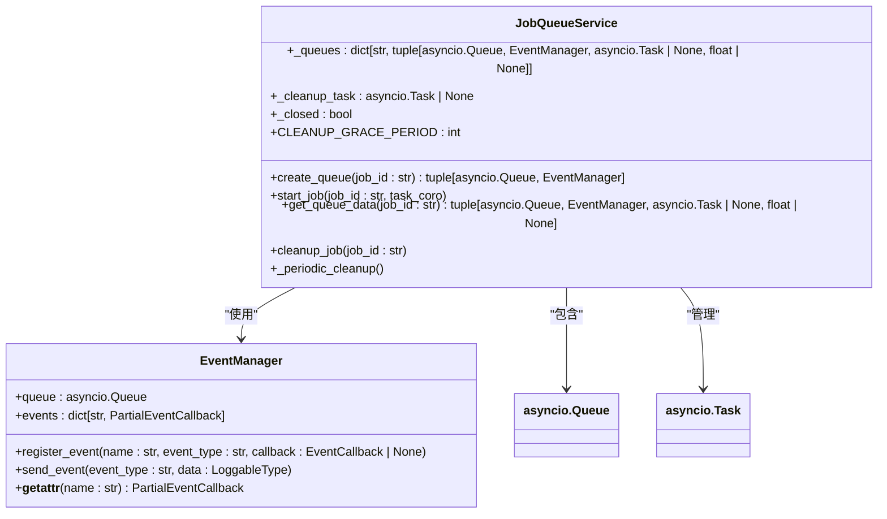
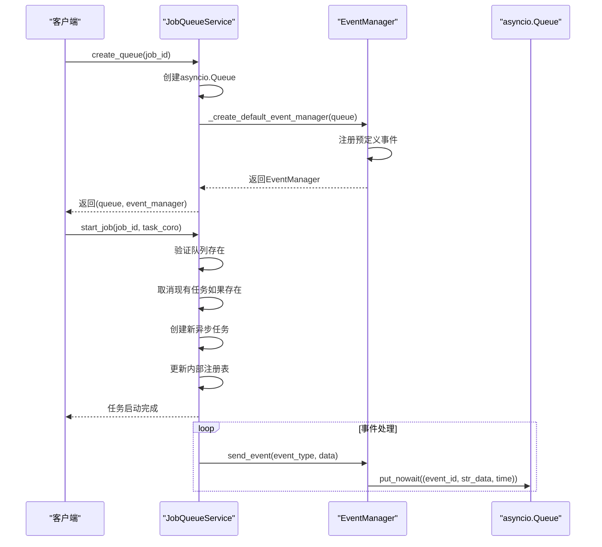
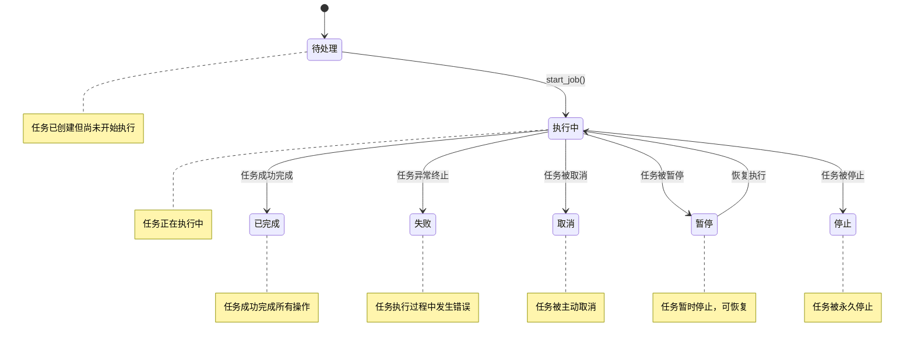
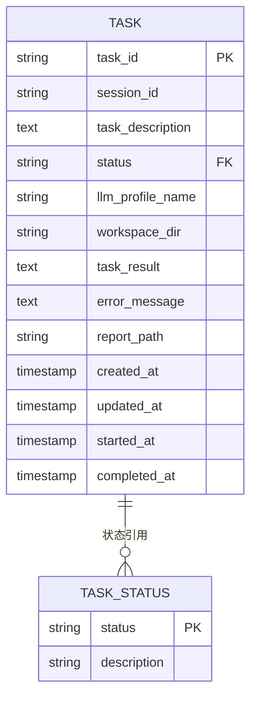
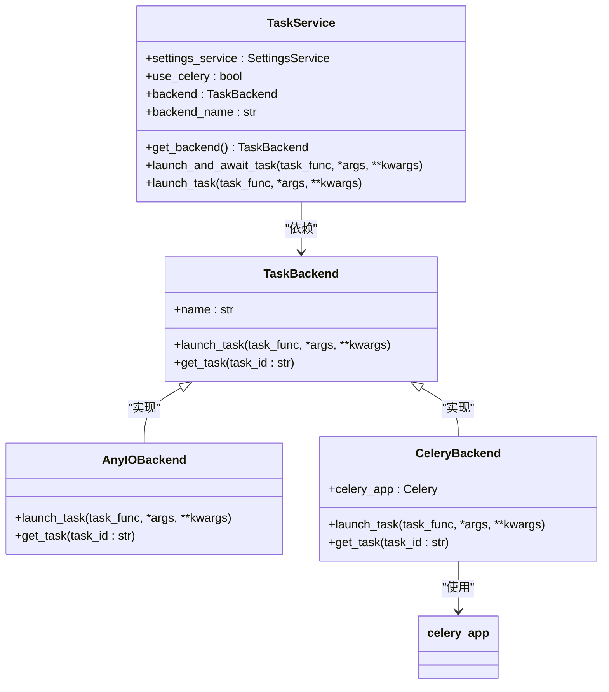
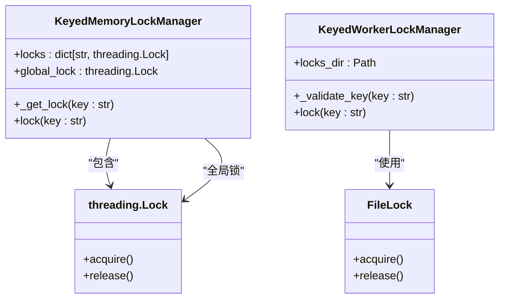
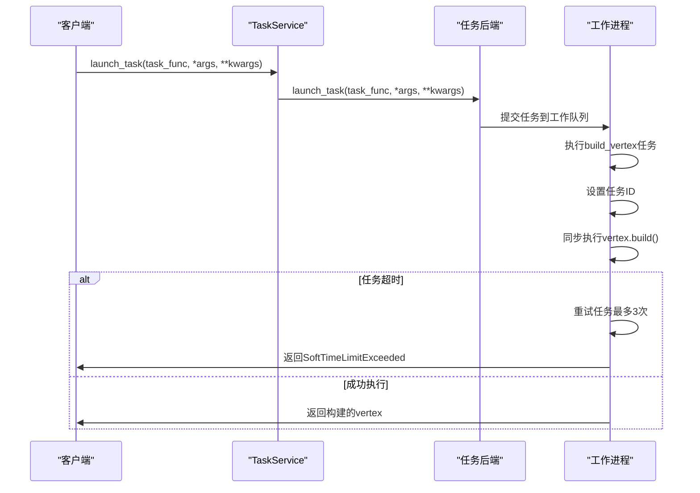
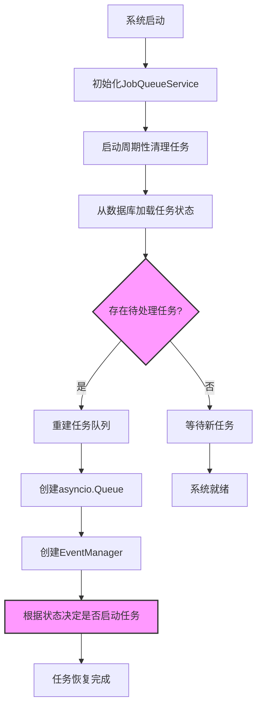
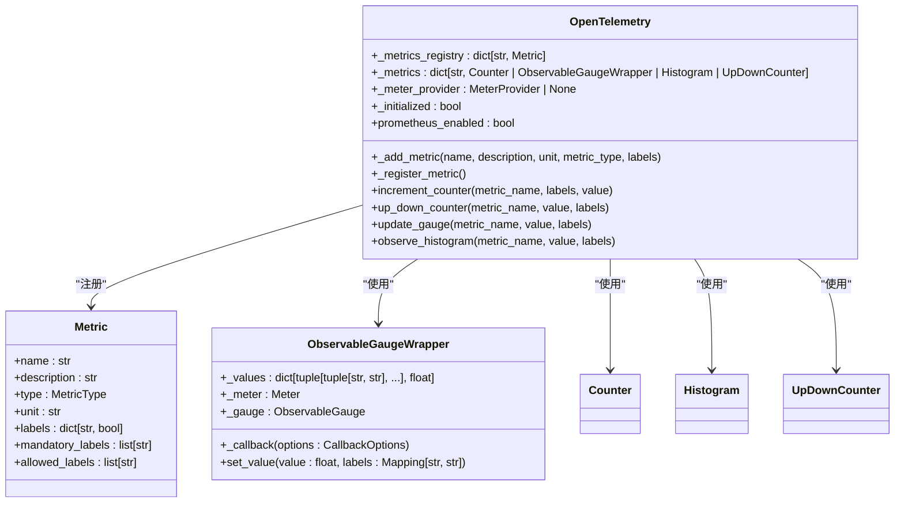
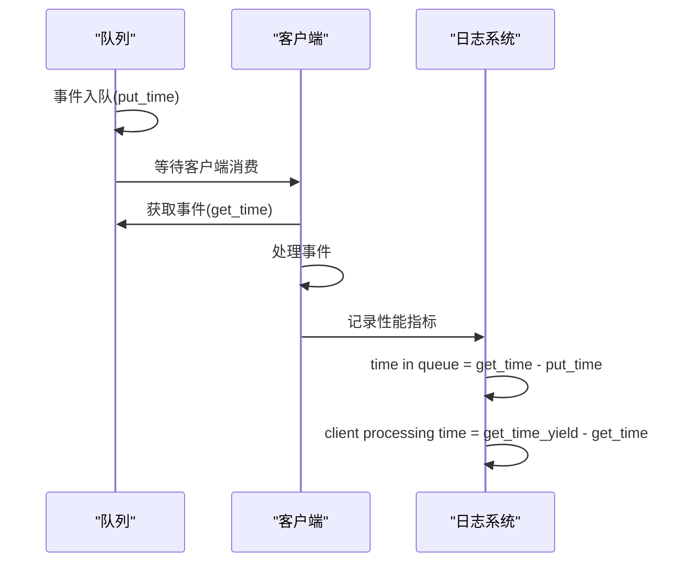

# 执行队列

<cite>
**本文档中引用的文件**   
- [service.py](file://vibe_surf/langflow/services/job_queue/service.py)
- [models.py](file://vibe_surf/backend/database/models.py)
- [concurrency.py](file://vibe_surf/langflow/utils/concurrency.py)
- [event_manager.py](file://vibe_surf/langflow/events/event_manager.py)
- [worker.py](file://vibe_surf/langflow/worker.py)
- [v003_fix_task_status_case.sql](file://vibe_surf/backend/database/migrations/v003_fix_task_status_case.sql)
- [opentelemetry.py](file://vibe_surf/langflow/services/telemetry/opentelemetry.py)
</cite>

## 目录
1. [简介](#简介)
2. [内存数据结构设计](#内存数据结构设计)
3. [任务状态机实现](#任务状态机实现)
4. [并发执行控制策略](#并发执行控制策略)
5. [队列持久化与崩溃恢复](#队列持久化与崩溃恢复)
6. [监控指标说明](#监控指标说明)
7. [结论](#结论)

## 简介
VibeSurf的执行队列管理系统是一个基于异步架构的高性能任务调度系统，旨在管理任务的生命周期、执行状态和资源分配。该系统通过内存数据结构和数据库持久化相结合的方式，确保任务在高并发场景下的稳定执行，并提供完善的监控和恢复机制。

**Section sources**
- [service.py](file://vibe_surf/langflow/services/job_queue/service.py#L1-L329)
- [models.py](file://vibe_surf/backend/database/models.py#L1-L289)

## 内存数据结构设计

### 任务队列内存结构
VibeSurf的执行队列管理系统采用`JobQueueService`类来管理任务队列，其核心数据结构是一个字典，将任务ID映射到包含多个组件的元组：



**Diagram sources **
- [service.py](file://vibe_surf/langflow/services/job_queue/service.py#L35-L40)
- [event_manager.py](file://vibe_surf/langflow/events/event_manager.py#L30-L33)

该数据结构包含以下关键组件：
- **asyncio.Queue**: 用于处理任务或消息的异步队列实例
- **EventManager**: 与队列关联的事件管理器，用于事件处理
- **asyncio.Task**: 处理任务的异步任务（如果存在）
- **清理时间戳**: 标记任务清理的时间（如果存在）

每个任务通过唯一的`job_id`进行标识，系统通过`_queues`字典维护所有活动任务的状态。

**Section sources**
- [service.py](file://vibe_surf/langflow/services/job_queue/service.py#L35-L40)

### 事件管理机制
系统通过`EventManager`类实现事件驱动的通信机制，允许组件之间通过预定义的事件类型进行通信。事件管理器注册了多种预定义事件，包括：
- `on_token`: 令牌事件
- `on_vertices_sorted`: 节点排序事件
- `on_error`: 错误事件
- `on_end`: 结束事件
- `on_message`: 消息添加事件
- `on_remove_message`: 消息移除事件
- `on_end_vertex`: 节点结束事件
- `on_build_start`: 构建开始事件
- `on_build_end`: 构建结束事件

这些事件通过异步队列进行传输，确保了系统的响应性和可扩展性。



**Diagram sources **
- [event_manager.py](file://vibe_surf/langflow/events/event_manager.py#L314-L327)
- [service.py](file://vibe_surf/langflow/services/job_queue/service.py#L124-L150)

## 任务状态机实现

### 任务状态定义
系统通过`TaskStatus`枚举定义了任务的完整生命周期状态：



**Diagram sources **
- [models.py](file://vibe_surf/backend/database/models.py#L17-L23)
- [v003_fix_task_status_case.sql](file://vibe_surf/backend/database/migrations/v003_fix_task_status_case.sql#L6-L11)

### 状态转换逻辑
任务状态的转换遵循严格的规则和流程：

1. **待处理 → 执行中**: 当调用`start_job()`方法时，系统验证队列存在并启动新的异步任务
2. **执行中 → 已完成**: 当任务协程正常完成且无异常时，状态自动转换
3. **执行中 → 失败**: 当任务协程抛出异常且任务完成时，状态标记为失败
4. **执行中 → 取消**: 当现有任务被取消时（通过`task.cancel()`），状态标记为取消
5. **执行中 → 暂停**: 系统支持暂停功能，允许任务暂时停止
6. **暂停 → 执行中**: 暂停的任务可以被恢复继续执行
7. **执行中 → 停止**: 任务被主动停止，进入终止状态

状态转换的实现通过`JobQueueService`的`_periodic_cleanup()`方法监控任务状态：

```mermaid
flowchart TD
A[开始周期性清理] --> B{遍历所有任务队列}
B --> C[获取任务状态]
C --> D{任务已取消或失败?}
D --> |是| E{已有清理时间戳?}
D --> |否| F[继续下一个任务]
E --> |否| G[设置清理时间戳]
E --> |是| H{超过清理宽限期?}
H --> |否| I[等待下一个周期]
H --> |是| J[执行cleanup_job()]
G --> K[标记为待清理]
J --> L[取消任务]
L --> M[清除队列项]
M --> N[从注册表移除]
N --> O[资源释放完成]
style D fill:#f9f,stroke:#333,stroke-width:2px
style H fill:#f9f,stroke:#333,stroke-width:2px
```

**Diagram sources **
- [service.py](file://vibe_surf/langflow/services/job_queue/service.py#L286-L302)
- [service.py](file://vibe_surf/langflow/services/job_queue/service.py#L210-L251)

### 状态持久化机制
任务状态不仅在内存中维护，还通过数据库进行持久化存储。`Task`模型定义了与状态相关的字段：



**Diagram sources **
- [models.py](file://vibe_surf/backend/database/models.py#L94-L136)

状态持久化的关键特性包括：
- **状态枚举**: 使用`Enum(TaskStatus, values_callable=lambda obj: [e.value for e in obj])`确保类型安全
- **默认值**: 新任务默认状态为`PENDING`
- **时间戳**: 记录`created_at`、`updated_at`、`started_at`和`completed_at`等关键时间点
- **大小写一致性**: 通过数据库迁移脚本确保状态值统一为小写

**Section sources**
- [models.py](file://vibe_surf/backend/database/models.py#L106)
- [v003_fix_task_status_case.sql](file://vibe_surf/backend/database/migrations/v003_fix_task_status_case.sql#L1-L11)

## 并发执行控制策略

### 工作线程池管理
VibeSurf系统采用灵活的任务后端管理机制，支持不同的并发执行策略：



**Diagram sources **
- [service.py](file://vibe_surf/langflow/services/task/service.py#L14-L40)
- [base.py](file://vibe_surf/langflow/services/task/backends/base.py#L6-L14)
- [celery.py](file://vibe_surf/langflow/services/task/backends/celery.py#L13-L28)

系统默认使用`AnyIOBackend`进行任务调度，但支持通过配置切换到`CeleryBackend`以实现分布式任务处理。`TaskService`负责管理后端选择和任务调度。

### 资源隔离机制
系统通过多种机制确保并发执行时的资源隔离和安全性：

1. **内存锁管理器**: `KeyedMemoryLockManager`使用线程锁确保内存资源的线程安全访问
2. **工作锁管理器**: `KeyedWorkerLockManager`使用文件锁确保跨工作进程的资源访问安全
3. **异步队列隔离**: 每个任务拥有独立的`asyncio.Queue`，避免任务间的数据竞争



**Diagram sources **
- [concurrency.py](file://vibe_surf/langflow/utils/concurrency.py#L10-L31)
- [concurrency.py](file://vibe_surf/langflow/utils/concurrency.py#L33-L60)

### 任务分片与负载均衡
系统通过以下策略实现高并发场景下的稳定性能：

1. **任务分片**: 将大型任务分解为可并行处理的小型子任务
2. **优先级队列**: 根据任务类型和紧急程度分配不同的处理优先级
3. **资源配额**: 为不同类型的任务设置资源使用上限
4. **动态调度**: 根据系统负载动态调整任务执行策略

虽然具体的分片算法未在代码中明确实现，但系统架构支持通过`build_vertex`等Celery任务进行分布式处理：



**Diagram sources **
- [worker.py](file://vibe_surf/langflow/worker.py#L19-L31)
- [service.py](file://vibe_surf/langflow/services/task/service.py#L38-L40)

## 队列持久化与崩溃恢复

### 持久化机制
系统通过数据库持久化确保任务状态在系统重启后能够正确恢复：

1. **任务状态持久化**: 所有任务状态变更都会同步到数据库
2. **结果持久化**: 任务执行结果、错误信息和报告路径都存储在数据库中
3. **会话跟踪**: 通过`session_id`关联任务与用户会话
4. **时间戳记录**: 详细记录任务的创建、更新、开始和完成时间

### 崩溃恢复流程
系统重启后的恢复流程如下：

1. **服务启动**: `JobQueueService`启动并初始化周期性清理任务
2. **状态同步**: 从数据库加载所有活动任务的状态
3. **资源重建**: 为每个活动任务重建`asyncio.Queue`和`EventManager`
4. **任务恢复**: 根据任务状态决定是否重新启动执行



**Diagram sources **
- [service.py](file://vibe_surf/langflow/services/job_queue/service.py#L88-L96)
- [service.py](file://vibe_surf/langflow/services/job_queue/service.py#L98-L119)

## 监控指标说明

### 监控系统架构
VibeSurf使用OpenTelemetry框架实现全面的监控和指标收集：



**Diagram sources **
- [opentelemetry.py](file://vibe_surf/langflow/services/telemetry/opentelemetry.py#L108-L112)

### 关键监控指标
系统收集以下关键性能指标：

| 指标名称 | 类型 | 单位 | 描述 | 标签 |
|---------|------|------|------|------|
| 队列长度 | ObservableGauge | 无 | 当前队列中的任务数量 | flow_id |
| 处理延迟 | Histogram | 毫秒 | 任务从入队到开始处理的时间 | flow_id, task_type |
| 吞吐量 | Counter | 次/分钟 | 单位时间内完成的任务数量 | flow_id, status |
| 任务执行时间 | Histogram | 秒 | 任务执行的总时间 | flow_id, task_type |
| 错误率 | Counter | 次/分钟 | 单位时间内失败的任务数量 | flow_id, error_type |
| 资源使用率 | ObservableGauge | 百分比 | CPU和内存使用率 | resource_type |

这些指标通过Prometheus导出器暴露，支持与其他监控系统的集成。

**Section sources**
- [opentelemetry.py](file://vibe_surf/langflow/services/telemetry/opentelemetry.py#L129-L142)

### 性能监控实现
系统通过详细的日志记录和性能分析确保高并发场景下的稳定性能：

1. **队列时间监控**: 记录事件在队列中的等待时间
2. **客户端处理时间**: 记录客户端处理事件的时间
3. **任务执行时间**: 详细记录任务的开始和完成时间
4. **资源使用监控**: 监控内存和CPU使用情况



**Diagram sources **
- [endpoints.py](file://vibe_surf/langflow/api/v1/endpoints.py#L217-L224)

## 结论
VibeSurf的执行队列管理系统通过精心设计的内存数据结构、完善的任务状态机、高效的并发控制策略和可靠的持久化机制，实现了高性能、高可用的任务调度能力。系统采用异步架构，支持任务的生命周期管理、资源隔离和故障恢复，同时提供全面的监控指标，确保在高并发场景下的稳定性能。

核心优势包括：
- **内存效率**: 使用轻量级的`asyncio.Queue`和`EventManager`组合，减少内存开销
- **状态一致性**: 通过数据库持久化和状态枚举确保任务状态的一致性
- **并发安全**: 通过内存锁和文件锁实现多层级的资源隔离
- **可恢复性**: 支持系统重启后的状态恢复和任务续接
- **可观测性**: 集成OpenTelemetry框架，提供全面的监控和指标收集

该系统架构既满足了实时任务处理的需求，又保证了系统的可靠性和可维护性，为VibeSurf平台的稳定运行提供了坚实的基础。