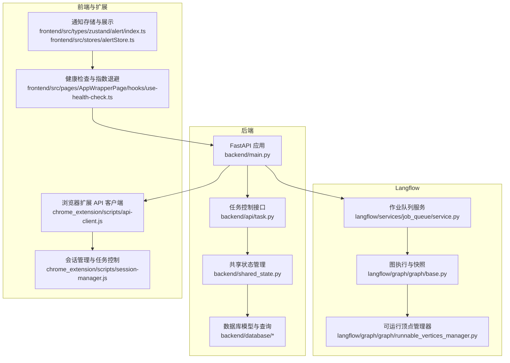
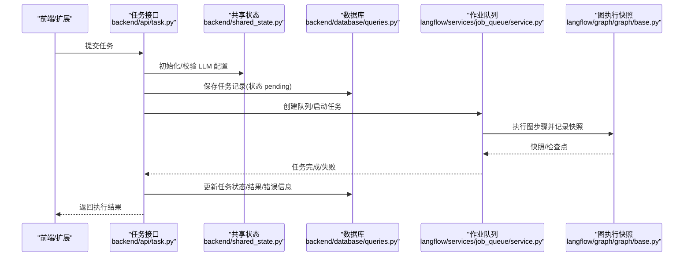
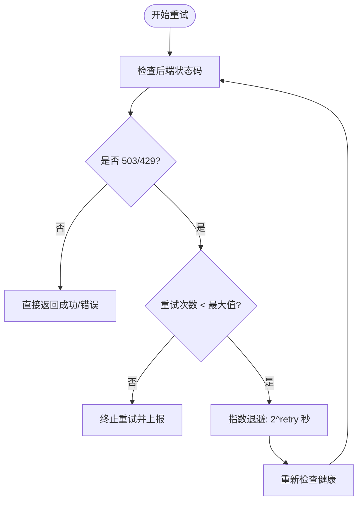
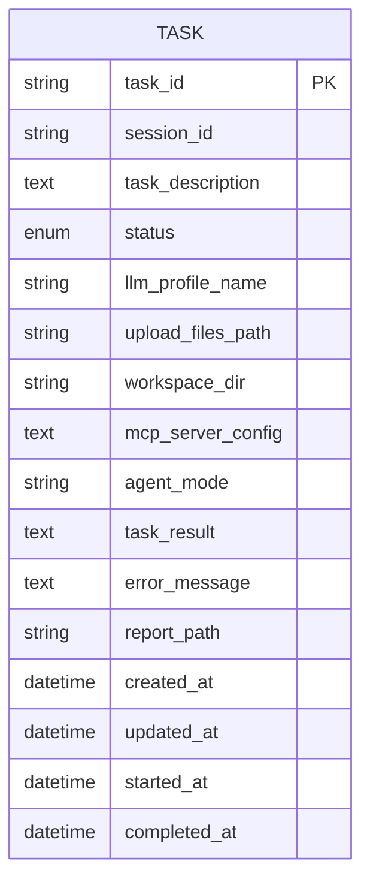
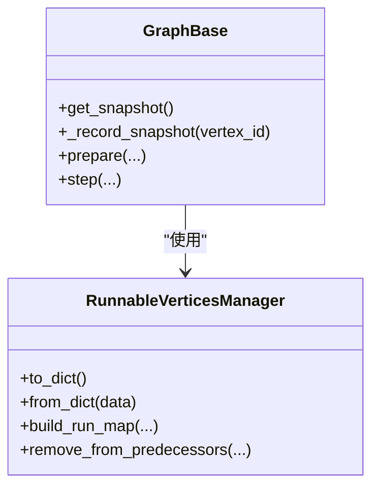
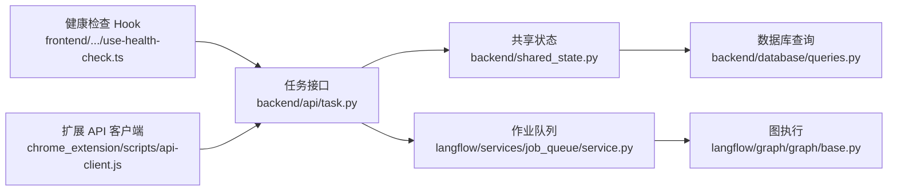

# 故障恢复

<cite>
**本文引用的文件**
- [backend/main.py](file://vibe_surf/backend/main.py)
- [backend/shared_state.py](file://vibe_surf/backend/shared_state.py)
- [backend/api/task.py](file://vibe_surf/backend/api/task.py)
- [backend/database/models.py](file://vibe_surf/backend/database/models.py)
- [backend/database/queries.py](file://vibe_surf/backend/database/queries.py)
- [backend/database/manager.py](file://vibe_surf/backend/database/manager.py)
- [langflow/services/job_queue/service.py](file://vibe_surf/langflow/services/job_queue/service.py)
- [langflow/graph/graph/base.py](file://vibe_surf/langflow/graph/graph/base.py)
- [langflow/graph/graph/runnable_vertices_manager.py](file://vibe_surf/langflow/graph/graph/runnable_vertices_manager.py)
- [chrome_extension/scripts/api-client.js](file://vibe_surf/chrome_extension/scripts/api-client.js)
- [chrome_extension/scripts/session-manager.js](file://vibe_surf/chrome_extension/scripts/session-manager.js)
- [frontend/src/pages/AppWrapperPage/hooks/use-health-check.ts](file://vibe_surf/frontend/src/pages/AppWrapperPage/hooks/use-health-check.ts)
- [frontend/src/types/zustand/alert/index.ts](file://vibe_surf/frontend/src/types/zustand/alert/index.ts)
- [frontend/src/stores/alertStore.ts](file://vibe_surf/frontend/src/stores/alertStore.ts)
- [backend/api/schedule.py](file://vibe_surf/backend/api/schedule.py)
- [backend/database/migrations/v003_fix_task_status_case.sql](file://vibe_surf/backend/database/migrations/v003_fix_task_status_case.sql)
</cite>

## 目录
1. [简介](#简介)
2. [项目结构](#项目结构)
3. [核心组件](#核心组件)
4. [架构总览](#架构总览)
5. [详细组件分析](#详细组件分析)
6. [依赖关系分析](#依赖关系分析)
7. [性能考量](#性能考量)
8. [故障排查指南](#故障排查指南)
9. [结论](#结论)
10. [附录：配置示例与最佳实践](#附录配置示例与最佳实践)

## 简介
本章节系统化梳理 VibeSurf 的故障恢复机制，覆盖以下关键能力：
- 任务失败后的自动重试策略（含指数退避与最大重试次数）
- 任务状态持久化到数据库，确保崩溃后可恢复执行上下文
- 死信队列处理机制（隔离反复失败的任务）
- 任务快照与检查点（支持长时间运行任务断点续传）
- 分布式场景下的故障检测与领导者选举（调度器高可用）

## 项目结构
从故障恢复视角，相关模块主要分布在后端 API、共享状态、数据库层、Langflow 作业队列与前端健康检查等部分。下图给出与故障恢复直接相关的模块关系概览。

图表来源
- [backend/main.py](file://vibe_surf/backend/main.py#L327-L482)
- [backend/api/task.py](file://vibe_surf/backend/api/task.py#L1-L379)
- [backend/shared_state.py](file://vibe_surf/backend/shared_state.py#L118-L233)
- [backend/database/models.py](file://vibe_surf/backend/database/models.py#L94-L136)
- [backend/database/queries.py](file://vibe_surf/backend/database/queries.py#L441-L753)
- [langflow/services/job_queue/service.py](file://vibe_surf/langflow/services/job_queue/service.py#L1-L329)
- [langflow/graph/graph/base.py](file://vibe_surf/langflow/graph/graph/base.py#L1406-L1426)
- [langflow/graph/graph/runnable_vertices_manager.py](file://vibe_surf/langflow/graph/graph/runnable_vertices_manager.py#L1-L30)
- [chrome_extension/scripts/api-client.js](file://vibe_surf/chrome_extension/scripts/api-client.js#L43-L136)
- [chrome_extension/scripts/session-manager.js](file://vibe_surf/chrome_extension/scripts/session-manager.js#L326-L407)
- [frontend/src/pages/AppWrapperPage/hooks/use-health-check.ts](file://vibe_surf/frontend/src/pages/AppWrapperPage/hooks/use-health-check.ts#L1-L56)
- [frontend/src/types/zustand/alert/index.ts](file://vibe_surf/frontend/src/types/zustand/alert/index.ts#L1-L20)
- [frontend/src/stores/alertStore.ts](file://vibe_surf/frontend/src/stores/alertStore.ts#L1-L107)

章节来源
- [backend/main.py](file://vibe_surf/backend/main.py#L327-L482)
- [backend/api/task.py](file://vibe_surf/backend/api/task.py#L1-L379)
- [backend/shared_state.py](file://vibe_surf/backend/shared_state.py#L118-L233)
- [backend/database/models.py](file://vibe_surf/backend/database/models.py#L94-L136)
- [backend/database/queries.py](file://vibe_surf/backend/database/queries.py#L441-L753)
- [langflow/services/job_queue/service.py](file://vibe_surf/langflow/services/job_queue/service.py#L1-L329)
- [langflow/graph/graph/base.py](file://vibe_surf/langflow/graph/graph/base.py#L1406-L1426)
- [langflow/graph/graph/runnable_vertices_manager.py](file://vibe_surf/langflow/graph/graph/runnable_vertices_manager.py#L1-L30)
- [chrome_extension/scripts/api-client.js](file://vibe_surf/chrome_extension/scripts/api-client.js#L43-L136)
- [chrome_extension/scripts/session-manager.js](file://vibe_surf/chrome_extension/scripts/session-manager.js#L326-L407)
- [frontend/src/pages/AppWrapperPage/hooks/use-health-check.ts](file://vibe_surf/frontend/src/pages/AppWrapperPage/hooks/use-health-check.ts#L1-L56)
- [frontend/src/types/zustand/alert/index.ts](file://vibe_surf/frontend/src/types/zustand/alert/index.ts#L1-L20)
- [frontend/src/stores/alertStore.ts](file://vibe_surf/frontend/src/stores/alertStore.ts#L1-L107)

## 核心组件
- 后端任务生命周期与状态持久化：通过任务提交、暂停/恢复/停止接口与共享状态，结合数据库查询更新，实现任务状态在失败或崩溃后可恢复。
- Langflow 作业队列与清理：为每个作业创建独立队列与事件管理器，支持任务取消、清理与“宽限期”延迟回收，避免资源泄漏。
- 图执行快照与检查点：在图执行过程中记录快照与调用顺序，支持断点续跑与回放。
- 前端健康检查与指数退避：对后端健康检查进行指数退避重试，提升弱网络环境下的稳定性。
- 浏览器扩展与任务控制：前端通过扩展与后端交互，实现暂停/恢复/停止，并在异常时发出通知。

章节来源
- [backend/api/task.py](file://vibe_surf/backend/api/task.py#L197-L303)
- [backend/shared_state.py](file://vibe_surf/backend/shared_state.py#L118-L233)
- [backend/database/queries.py](file://vibe_surf/backend/database/queries.py#L441-L753)
- [langflow/services/job_queue/service.py](file://vibe_surf/langflow/services/job_queue/service.py#L1-L329)
- [langflow/graph/graph/base.py](file://vibe_surf/langflow/graph/graph/base.py#L1406-L1426)
- [frontend/src/pages/AppWrapperPage/hooks/use-health-check.ts](file://vibe_surf/frontend/src/pages/AppWrapperPage/hooks/use-health-check.ts#L1-L56)
- [chrome_extension/scripts/session-manager.js](file://vibe_surf/chrome_extension/scripts/session-manager.js#L326-L407)

## 架构总览
下图展示从任务提交到执行、持久化、清理与恢复的关键路径。

图表来源
- [backend/api/task.py](file://vibe_surf/backend/api/task.py#L43-L146)
- [backend/shared_state.py](file://vibe_surf/backend/shared_state.py#L118-L233)
- [backend/database/queries.py](file://vibe_surf/backend/database/queries.py#L441-L753)
- [langflow/services/job_queue/service.py](file://vibe_surf/langflow/services/job_queue/service.py#L124-L185)
- [langflow/graph/graph/base.py](file://vibe_surf/langflow/graph/graph/base.py#L1406-L1426)

## 详细组件分析

### 组件A：任务失败后的自动重试策略（指数退避与最大重试次数）
- 后端健康检查的指数退避：当后端返回 503/429 等繁忙状态时，前端按 2^retry 秒进行指数退避，最多重试 N 次（由配置项控制），避免雪崩效应。
- 扩展侧请求重试：浏览器扩展的 API 客户端对非 4xx 错误进行有限次重试，并在特定错误类型（如 LLM 连接失败）时不重试，避免无效轮询。
- 作业队列清理与宽限期：Langflow 作业队列在任务被取消或失败后标记清理时间戳，经过固定宽限期（默认 300 秒）再回收资源，便于观察与恢复。

图表来源
- [frontend/src/pages/AppWrapperPage/hooks/use-health-check.ts](file://vibe_surf/frontend/src/pages/AppWrapperPage/hooks/use-health-check.ts#L1-L56)
- [chrome_extension/scripts/api-client.js](file://vibe_surf/chrome_extension/scripts/api-client.js#L43-L136)
- [langflow/services/job_queue/service.py](file://vibe_surf/langflow/services/job_queue/service.py#L253-L303)

章节来源
- [frontend/src/pages/AppWrapperPage/hooks/use-health-check.ts](file://vibe_surf/frontend/src/pages/AppWrapperPage/hooks/use-health-check.ts#L1-L56)
- [chrome_extension/scripts/api-client.js](file://vibe_surf/chrome_extension/scripts/api-client.js#L43-L136)
- [langflow/services/job_queue/service.py](file://vibe_surf/langflow/services/job_queue/service.py#L253-L303)

### 组件B：任务状态持久化到数据库（崩溃后恢复执行上下文）
- 任务状态枚举与字段：数据库模型定义了任务状态（pending/running/paused/completed/failed/stopped）以及时间戳字段，保证状态一致性。
- 提交阶段：提交任务时写入初始状态 pending，并持久化任务描述、上传文件路径、工作空间目录、MCP 配置、代理模式等。
- 执行阶段：后台任务执行中更新状态为 running；完成后根据成功/失败分别写入结果、报告路径或错误信息；失败时也持久化错误详情。
- 查询与统计：提供按会话、LLM 配置、最近任务等查询接口，便于审计与恢复。

图表来源
- [backend/database/models.py](file://vibe_surf/backend/database/models.py#L94-L136)
- [backend/database/queries.py](file://vibe_surf/backend/database/queries.py#L441-L753)
- [backend/database/migrations/v003_fix_task_status_case.sql](file://vibe_surf/backend/database/migrations/v003_fix_task_status_case.sql#L1-L11)

章节来源
- [backend/database/models.py](file://vibe_surf/backend/database/models.py#L94-L136)
- [backend/database/queries.py](file://vibe_surf/backend/database/queries.py#L441-L753)
- [backend/database/migrations/v003_fix_task_status_case.sql](file://vibe_surf/backend/database/migrations/v003_fix_task_status_case.sql#L1-L11)
- [backend/api/task.py](file://vibe_surf/backend/api/task.py#L43-L146)
- [backend/shared_state.py](file://vibe_surf/backend/shared_state.py#L118-L233)

### 组件C：死信队列处理机制（隔离反复失败的任务）
- 作业队列清理策略：Langflow 作业队列在任务失败或取消后，不立即释放资源，而是标记清理时间戳；超过宽限期（默认 300 秒）才真正回收，从而将反复失败的任务隔离在“待清理”状态，避免影响其他作业。
- 适用场景：当某个作业因外部依赖不稳定导致反复失败，系统不会立刻中断其资源，允许运维介入或自动重试策略生效后再回收。

章节来源
- [langflow/services/job_queue/service.py](file://vibe_surf/langflow/services/job_queue/service.py#L253-L303)

### 组件D：任务快照与检查点（断点续传）
- 快照记录：图执行在准备阶段与每一步执行后记录快照，包含运行管理器状态、运行队列、层级结构、激活顶点等，同时记录调用顺序，便于断点续跑。
- 可运行顶点管理：维护前驱/后继映射、已运行集合、循环顶点集合等，确保在复杂拓扑中正确推进与回溯。
- 结合数据库：快照与检查点可与数据库中的任务状态配合使用，实现长时间运行任务的断点续传与恢复。

图表来源
- [langflow/graph/graph/base.py](file://vibe_surf/langflow/graph/graph/base.py#L1406-L1426)
- [langflow/graph/graph/runnable_vertices_manager.py](file://vibe_surf/langflow/graph/graph/runnable_vertices_manager.py#L1-L30)

章节来源
- [langflow/graph/graph/base.py](file://vibe_surf/langflow/graph/graph/base.py#L1406-L1426)
- [langflow/graph/graph/runnable_vertices_manager.py](file://vibe_surf/langflow/graph/graph/runnable_vertices_manager.py#L1-L30)

### 组件E：分布式场景下的故障检测与领导者选举（调度器高可用）
- 故障检测：后端提供健康检查端点与浏览器连接监控任务，当浏览器连接断开或健康检查异常时触发优雅关闭流程，避免僵尸进程。
- 调度器高可用：后端启动时初始化调度管理器并启动后台任务；在关闭时统一停止调度器与清理后台任务，确保多实例部署下的状态一致与资源回收。
- 注意：当前仓库未发现显式的“领导者选举”实现代码，建议在分布式部署时引入外部协调服务（如 etcd/consul 或数据库锁）以实现领导者选举与故障转移。

章节来源
- [backend/main.py](file://vibe_surf/backend/main.py#L327-L482)
- [backend/api/schedule.py](file://vibe_surf/backend/api/schedule.py#L77-L319)

## 依赖关系分析
- 任务接口依赖共享状态与数据库查询，后者负责状态持久化与统计。
- 作业队列服务为 Langflow 图执行提供异步队列与事件管理，失败/取消任务进入清理流程。
- 前端健康检查与扩展 API 客户端共同构成对外部服务的弹性重试与降级策略。
- 数据库迁移脚本确保任务状态枚举大小写一致，避免历史数据与新逻辑不兼容。

图表来源
- [backend/api/task.py](file://vibe_surf/backend/api/task.py#L1-L379)
- [backend/shared_state.py](file://vibe_surf/backend/shared_state.py#L118-L233)
- [backend/database/queries.py](file://vibe_surf/backend/database/queries.py#L441-L753)
- [langflow/services/job_queue/service.py](file://vibe_surf/langflow/services/job_queue/service.py#L1-L329)
- [langflow/graph/graph/base.py](file://vibe_surf/langflow/graph/graph/base.py#L1406-L1426)
- [frontend/src/pages/AppWrapperPage/hooks/use-health-check.ts](file://vibe_surf/frontend/src/pages/AppWrapperPage/hooks/use-health-check.ts#L1-L56)
- [chrome_extension/scripts/api-client.js](file://vibe_surf/chrome_extension/scripts/api-client.js#L43-L136)

章节来源
- [backend/api/task.py](file://vibe_surf/backend/api/task.py#L1-L379)
- [backend/shared_state.py](file://vibe_surf/backend/shared_state.py#L118-L233)
- [backend/database/queries.py](file://vibe_surf/backend/database/queries.py#L441-L753)
- [langflow/services/job_queue/service.py](file://vibe_surf/langflow/services/job_queue/service.py#L1-L329)
- [langflow/graph/graph/base.py](file://vibe_surf/langflow/graph/graph/base.py#L1406-L1426)
- [frontend/src/pages/AppWrapperPage/hooks/use-health-check.ts](file://vibe_surf/frontend/src/pages/AppWrapperPage/hooks/use-health-check.ts#L1-L56)
- [chrome_extension/scripts/api-client.js](file://vibe_surf/chrome_extension/scripts/api-client.js#L43-L136)

## 性能考量
- 异步队列与事件驱动：Langflow 作业队列采用 asyncio 队列与事件管理器，减少阻塞，提高并发吞吐。
- 清理宽限期：300 秒宽限期避免频繁创建/销毁资源带来的抖动，适合长耗时任务的稳定运行。
- 数据库索引与迁移：为任务状态、会话、LLM 配置等建立索引，配合迁移脚本保证状态一致性与查询效率。
- 前端指数退避：避免在服务繁忙时产生大量重试请求，降低后端压力。

[本节为通用指导，无需列出具体文件来源]

## 故障排查指南
- 任务状态异常：检查数据库中任务状态是否与共享状态一致，确认提交/更新流程是否成功写入。
- 任务未恢复：若出现崩溃或重启，确认共享状态中的活动任务信息与数据库记录是否匹配；必要时手动清理或重试。
- 作业队列资源泄漏：关注失败/取消任务是否按宽限期回收；如未回收，检查清理逻辑与日志。
- 健康检查失败：前端指数退避是否生效；后端健康检查端点是否可达；浏览器连接监控是否触发关闭流程。
- 通知与告警：前端通知存储与展示组件可用于收集与展示错误/通知信息，便于定位问题。

章节来源
- [backend/database/queries.py](file://vibe_surf/backend/database/queries.py#L441-L753)
- [backend/shared_state.py](file://vibe_surf/backend/shared_state.py#L118-L233)
- [langflow/services/job_queue/service.py](file://vibe_surf/langflow/services/job_queue/service.py#L253-L303)
- [frontend/src/pages/AppWrapperPage/hooks/use-health-check.ts](file://vibe_surf/frontend/src/pages/AppWrapperPage/hooks/use-health-check.ts#L1-L56)
- [frontend/src/types/zustand/alert/index.ts](file://vibe_surf/frontend/src/types/zustand/alert/index.ts#L1-L20)
- [frontend/src/stores/alertStore.ts](file://vibe_surf/frontend/src/stores/alertStore.ts#L1-L107)

## 结论
VibeSurf 在单任务执行模型下，通过任务状态持久化、Langflow 作业队列清理与宽限期、图执行快照与检查点、前端健康检查指数退避等机制，构建了较为完善的故障恢复体系。对于分布式场景，建议补充领导者选举与故障转移方案，以进一步提升调度器的高可用性。

[本节为总结性内容，无需列出具体文件来源]

## 附录：配置示例与最佳实践

- 自动重试与指数退避
  - 前端健康检查指数退避：参考路径 [use-health-check.ts](file://vibe_surf/frontend/src/pages/AppWrapperPage/hooks/use-health-check.ts#L1-L56)，可调整最大重试次数与退避参数。
  - 扩展 API 请求重试：参考路径 [api-client.js](file://vibe_surf/chrome_extension/scripts/api-client.js#L43-L136)，可配置重试次数与等待间隔。
  - 作业队列宽限期：参考路径 [job_queue/service.py](file://vibe_surf/langflow/services/job_queue/service.py#L253-L303)，默认 300 秒，可根据业务需求调整。

- 任务状态持久化
  - 任务状态枚举与字段：参考路径 [models.py](file://vibe_surf/backend/database/models.py#L94-L136)、[queries.py](file://vibe_surf/backend/database/queries.py#L441-L753)。
  - 状态迁移修复：参考路径 [v003_fix_task_status_case.sql](file://vibe_surf/backend/database/migrations/v003_fix_task_status_case.sql#L1-L11)。

- 死信队列与隔离
  - 作业队列清理与宽限期：参考路径 [job_queue/service.py](file://vibe_surf/langflow/services/job_queue/service.py#L253-L303)。

- 快照与检查点
  - 快照记录与调用顺序：参考路径 [graph/base.py](file://vibe_surf/langflow/graph/graph/base.py#L1406-L1426)。
  - 可运行顶点管理：参考路径 [runnable_vertices_manager.py](file://vibe_surf/langflow/graph/graph/runnable_vertices_manager.py#L1-L30)。

- 分布式高可用（建议）
  - 当前未发现显式领导者选举实现，建议引入外部协调服务（如 etcd/consul 或数据库锁）实现领导者选举与故障转移，确保调度器高可用。

[本节为配置与最佳实践汇总，无需列出具体代码片段]