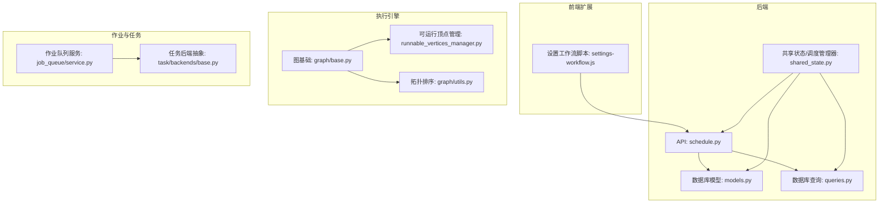
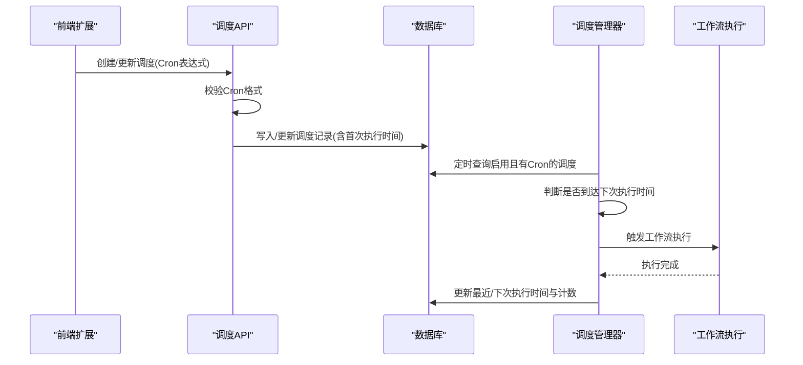
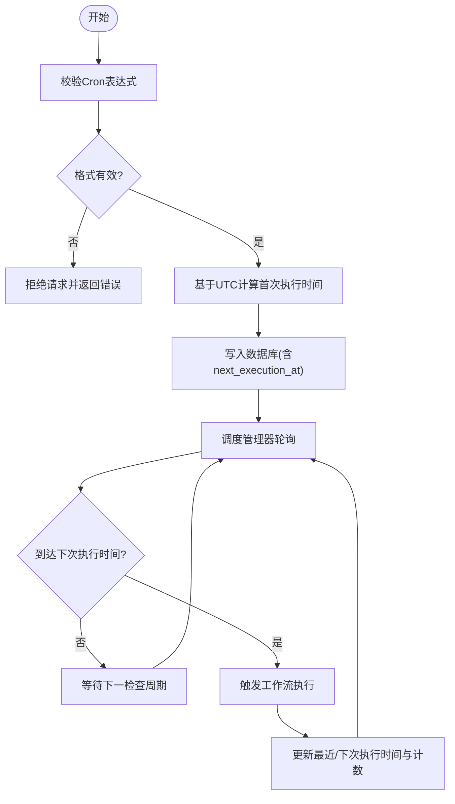
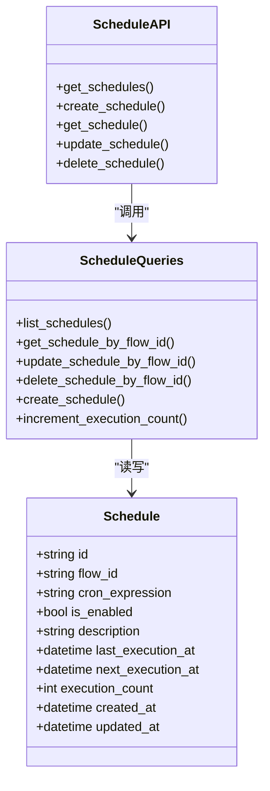
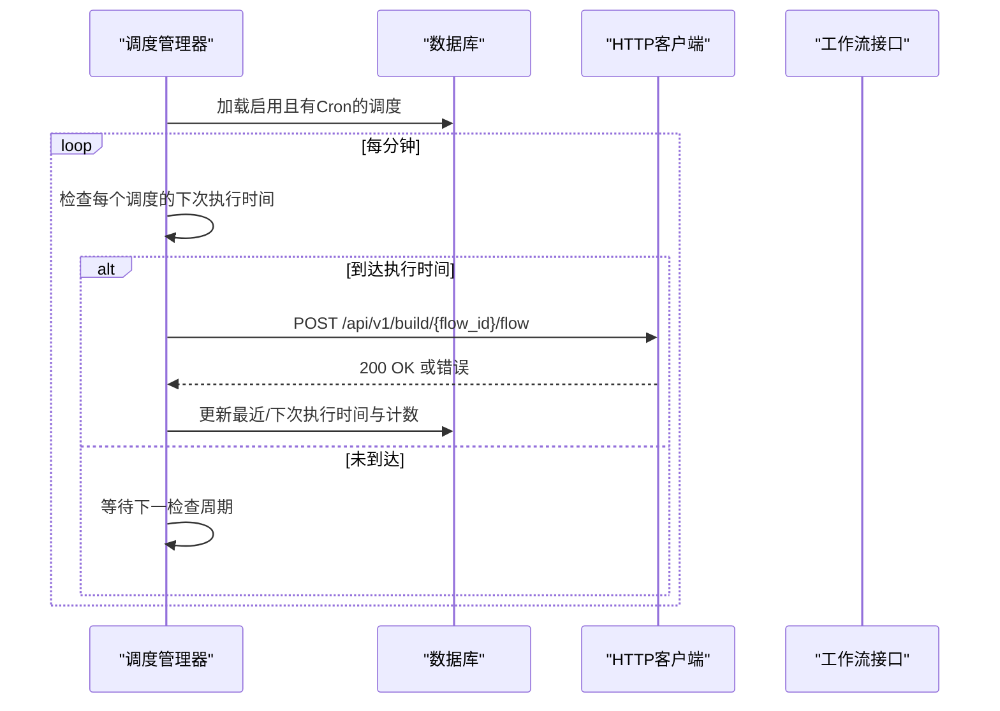
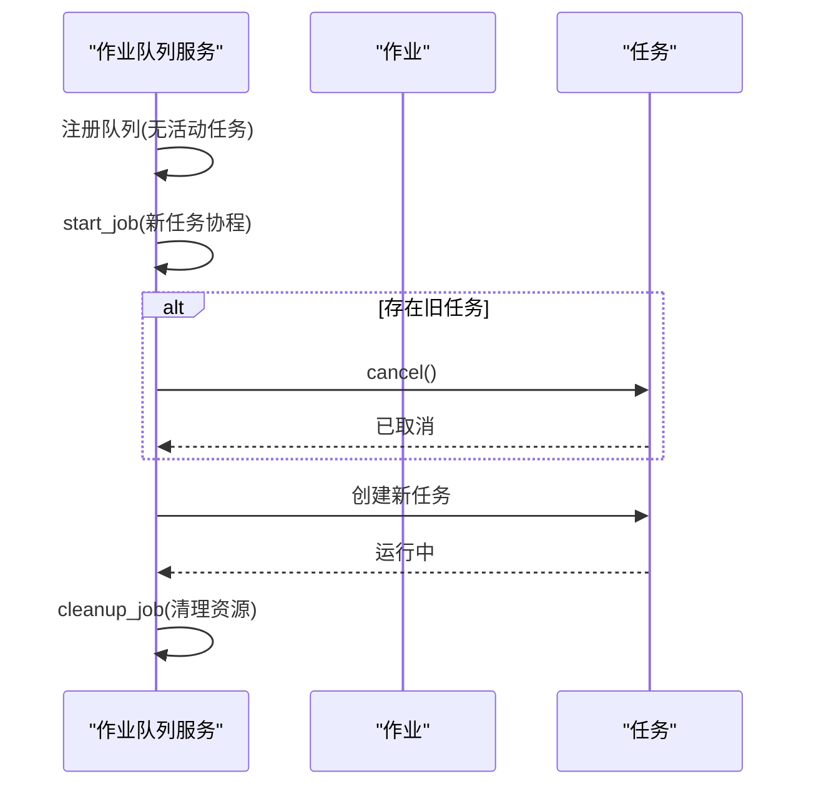
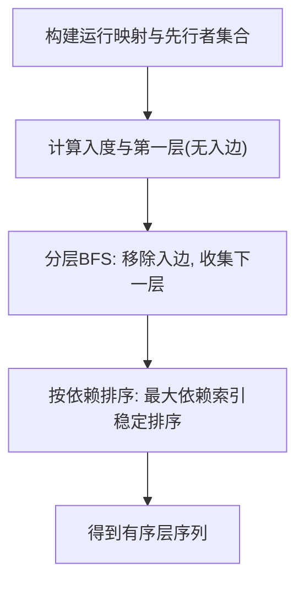
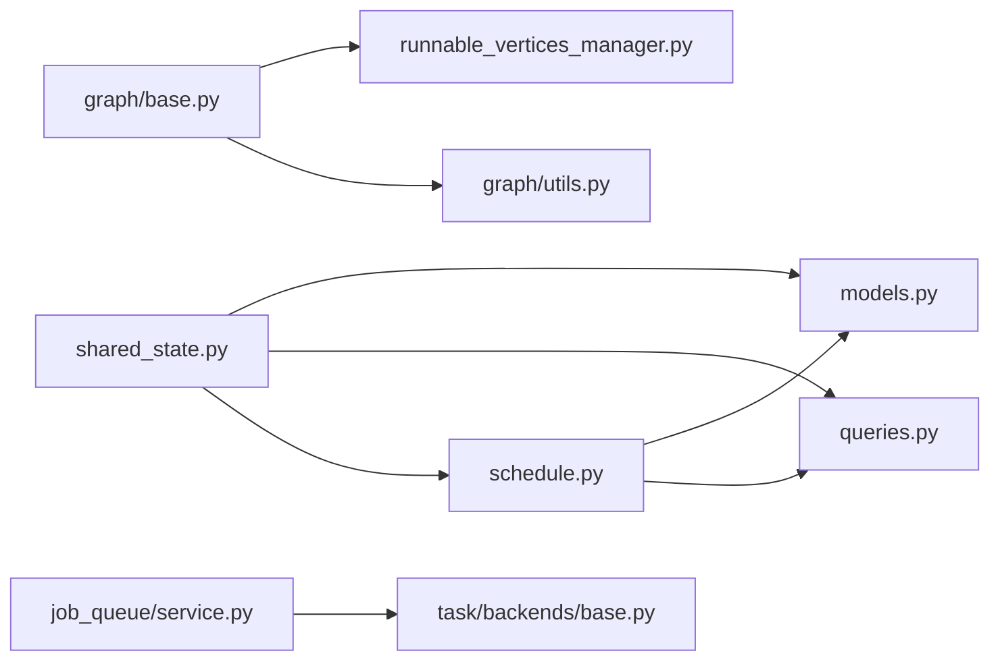

# 调度策略

<cite>
**本文引用的文件**
- [schedule.py](file://vibe_surf/backend/api/schedule.py)
- [models.py](file://vibe_surf/backend/database/models.py)
- [queries.py](file://vibe_surf/backend/database/queries.py)
- [shared_state.py](file://vibe_surf/backend/shared_state.py)
- [settings-workflow.js](file://vibe_surf/chrome_extension/scripts/settings-workflow.js)
- [base.py](file://vibe_surf/langflow/services/task/backends/base.py)
- [service.py](file://vibe_surf/langflow/services/job_queue/service.py)
- [runnable_vertices_manager.py](file://vibe_surf/langflow/graph/graph/runnable_vertices_manager.py)
- [base.py（图）](file://vibe_surf/langflow/graph/graph/base.py)
- [utils.py（图）](file://vibe_surf/langflow/graph/graph/utils.py)
</cite>

## 目录
1. [简介](#简介)
2. [项目结构](#项目结构)
3. [核心组件](#核心组件)
4. [架构总览](#架构总览)
5. [详细组件分析](#详细组件分析)
6. [依赖分析](#依赖分析)
7. [性能考虑](#性能考虑)
8. [故障排查指南](#故障排查指南)
9. [结论](#结论)
10. [附录：配置与使用示例](#附录配置与使用示例)

## 简介
本文件系统化文档化 VibeSurf 的调度策略实现，重点覆盖：
- 一次性任务、周期性任务与基于事件触发任务的调度逻辑
- Cron 表达式解析与执行时间计算算法
- 任务优先级队列与抢占式调度机制
- 任务依赖关系图的构建与拓扑排序算法
- 复杂调度策略配置示例（时间窗口、执行条件、资源约束）
- 调度策略的灵活性与可扩展性设计（插件化）

## 项目结构
围绕调度功能的关键模块分布如下：
- 后端 API 层：提供调度 CRUD 与校验接口
- 数据库层：模型与查询封装
- 共享状态与调度管理器：负责周期性调度的检查与触发
- 前端扩展：提供 Cron 表达式构建与预览
- 图执行引擎：任务依赖图与拓扑排序
- 作业队列与任务后端：异步任务执行与抢占式替换

图表来源
- [schedule.py](file://vibe_surf/backend/api/schedule.py#L1-L331)
- [models.py](file://vibe_surf/backend/database/models.py#L258-L289)
- [queries.py](file://vibe_surf/backend/database/queries.py#L1432-L1468)
- [shared_state.py](file://vibe_surf/backend/shared_state.py#L740-L1111)
- [settings-workflow.js](file://vibe_surf/chrome_extension/scripts/settings-workflow.js#L2234-L2480)
- [base.py（图）](file://vibe_surf/langflow/graph/graph/base.py#L1616-L2154)
- [utils.py（图）](file://vibe_surf/langflow/graph/graph/utils.py#L458-L889)
- [runnable_vertices_manager.py](file://vibe_surf/langflow/graph/graph/runnable_vertices_manager.py#L65-L116)
- [service.py](file://vibe_surf/langflow/services/job_queue/service.py#L127-L227)
- [base.py（任务后端）](file://vibe_surf/langflow/services/task/backends/base.py#L1-L15)

章节来源
- [schedule.py](file://vibe_surf/backend/api/schedule.py#L1-L331)
- [models.py](file://vibe_surf/backend/database/models.py#L258-L289)
- [queries.py](file://vibe_surf/backend/database/queries.py#L1432-L1468)
- [shared_state.py](file://vibe_surf/backend/shared_state.py#L740-L1111)
- [settings-workflow.js](file://vibe_surf/chrome_extension/scripts/settings-workflow.js#L2234-L2480)
- [base.py（图）](file://vibe_surf/langflow/graph/graph/base.py#L1616-L2154)
- [utils.py（图）](file://vibe_surf/langflow/graph/graph/utils.py#L458-L889)
- [runnable_vertices_manager.py](file://vibe_surf/langflow/graph/graph/runnable_vertices_manager.py#L65-L116)
- [service.py](file://vibe_surf/langflow/services/job_queue/service.py#L127-L227)
- [base.py（任务后端）](file://vibe_surf/langflow/services/task/backends/base.py#L1-L15)

## 核心组件
- 调度 API：提供创建、查询、更新、删除调度的 REST 接口，并在创建/更新时校验 Cron 表达式格式，计算首次执行时间并持久化到数据库。
- 调度模型与查询：定义 Schedule 模型及查询操作，包含 Cron 表达式、启用状态、执行计数、最近/下次执行时间等字段。
- 调度管理器：后台循环定时检查，根据 Cron 计算下次执行时间并触发对应工作流；同时维护本地缓存与数据库同步。
- 前端 Cron 构建器：提供简单选择器生成 Cron 表达式，并进行有效性校验与预览。
- 依赖图与拓扑排序：在工作流执行阶段，对节点进行分层拓扑排序，保证依赖满足后再执行。
- 作业队列与任务后端：提供异步队列与任务启动/取消能力，支持抢占式替换当前任务。

章节来源
- [schedule.py](file://vibe_surf/backend/api/schedule.py#L52-L116)
- [models.py](file://vibe_surf/backend/database/models.py#L258-L289)
- [queries.py](file://vibe_surf/backend/database/queries.py#L1432-L1468)
- [shared_state.py](file://vibe_surf/backend/shared_state.py#L740-L1111)
- [settings-workflow.js](file://vibe_surf/chrome_extension/scripts/settings-workflow.js#L2234-L2480)
- [base.py（图）](file://vibe_surf/langflow/graph/graph/base.py#L1616-L2154)
- [utils.py（图）](file://vibe_surf/langflow/graph/graph/utils.py#L458-L889)
- [service.py](file://vibe_surf/langflow/services/job_queue/service.py#L127-L227)
- [base.py（任务后端）](file://vibe_surf/langflow/services/task/backends/base.py#L1-L15)

## 架构总览
调度策略由“配置—校验—持久化—轮询—触发—记录”闭环构成：
- 配置与校验：前端通过简单界面生成 Cron 表达式，后端 API 校验格式并计算首次执行时间。
- 持久化：将 Cron、启用状态、执行计数、最近/下次执行时间写入数据库。
- 轮询与触发：调度管理器每分钟检查一次，若到达下次执行时间则调用后端工作流执行接口。
- 记录与更新：成功触发后更新最近执行时间、下次执行时间与执行计数，并刷新本地缓存。

图表来源
- [schedule.py](file://vibe_surf/backend/api/schedule.py#L108-L148)
- [queries.py](file://vibe_surf/backend/database/queries.py#L1432-L1468)
- [shared_state.py](file://vibe_surf/backend/shared_state.py#L863-L1025)
- [settings-workflow.js](file://vibe_surf/chrome_extension/scripts/settings-workflow.js#L2234-L2480)

## 详细组件分析

### 1) Cron 表达式解析与执行时间计算
- 解析与校验：后端使用 croniter 对 Cron 表达式进行解析，若格式非法则拒绝创建/更新。
- 首次执行时间：创建或更新时，基于当前 UTC 时间计算下一次执行时间并写入数据库。
- 下次执行时间：每次触发后重新计算下一次执行时间并更新数据库与本地缓存。

图表来源
- [schedule.py](file://vibe_surf/backend/api/schedule.py#L52-L116)
- [queries.py](file://vibe_surf/backend/database/queries.py#L1432-L1468)
- [shared_state.py](file://vibe_surf/backend/shared_state.py#L932-L1025)

章节来源
- [schedule.py](file://vibe_surf/backend/api/schedule.py#L52-L116)
- [queries.py](file://vibe_surf/backend/database/queries.py#L1432-L1468)
- [shared_state.py](file://vibe_surf/backend/shared_state.py#L932-L1025)

### 2) 调度 API 与数据库交互
- API 提供创建、查询、更新、删除调度接口；更新时支持仅更新部分字段。
- 查询封装了列表、按 flow_id 查询、按 flow_id 更新、删除等操作。
- 模型 Schedule 包含 Cron 表达式、启用状态、执行计数、最近/下次执行时间等字段。

图表来源
- [models.py](file://vibe_surf/backend/database/models.py#L258-L289)
- [schedule.py](file://vibe_surf/backend/api/schedule.py#L77-L331)
- [queries.py](file://vibe_surf/backend/database/queries.py#L1432-L1468)

章节来源
- [models.py](file://vibe_surf/backend/database/models.py#L258-L289)
- [schedule.py](file://vibe_surf/backend/api/schedule.py#L77-L331)
- [queries.py](file://vibe_surf/backend/database/queries.py#L1432-L1468)

### 3) 调度管理器：轮询、触发与跟踪
- 启动/停止：管理器启动后加载启用且有 Cron 的调度，进入每分钟检查循环。
- 条件判断：检查是否已过上次执行时间、是否达到下次执行时间、是否超过最小间隔。
- 触发执行：通过 HTTP 客户端向后端工作流接口发起触发请求。
- 执行跟踪：成功触发后更新最近执行时间、下次执行时间与执行计数，并刷新本地缓存。

图表来源
- [shared_state.py](file://vibe_surf/backend/shared_state.py#L863-L1025)

章节来源
- [shared_state.py](file://vibe_surf/backend/shared_state.py#L740-L1111)

### 4) 前端 Cron 构建与预览
- 提供多种常见周期（每 X 分钟、每 X 小时、每日、每周、每月）的简单配置，自动生成 Cron 表达式。
- 支持从现有 Cron 反推周期类型与参数，便于编辑。
- 在保存前进行有效性校验，允许禁用但不强制要求 Cron 有效。

章节来源
- [settings-workflow.js](file://vibe_surf/chrome_extension/scripts/settings-workflow.js#L2234-L2480)

### 5) 任务优先级队列与抢占式调度
- 作业队列服务提供队列注册、任务启动、取消与清理能力，支持同一 job_id 的任务被新任务抢占式替换。
- 这为“高优先级任务抢占低优先级任务”的场景提供了基础设施，可在上层业务逻辑中结合队列进行优先级控制。

图表来源
- [service.py](file://vibe_surf/langflow/services/job_queue/service.py#L127-L227)

章节来源
- [service.py](file://vibe_surf/langflow/services/job_queue/service.py#L127-L227)

### 6) 任务依赖关系图与拓扑排序
- 依赖图构建：根据节点的前置依赖建立运行映射与先行者集合。
- 可运行性判定：结合条件排除、环检测与循环顶点特殊处理，确保依赖满足后再执行。
- 拓扑排序：采用分层拓扑排序与按依赖排序，保证同层内按依赖关系稳定执行。

图表来源
- [runnable_vertices_manager.py](file://vibe_surf/langflow/graph/graph/runnable_vertices_manager.py#L65-L116)
- [utils.py（图）](file://vibe_surf/langflow/graph/graph/utils.py#L458-L889)
- [base.py（图）](file://vibe_surf/langflow/graph/graph/base.py#L1616-L2154)

章节来源
- [runnable_vertices_manager.py](file://vibe_surf/langflow/graph/graph/runnable_vertices_manager.py#L65-L116)
- [utils.py（图）](file://vibe_surf/langflow/graph/graph/utils.py#L458-L889)
- [base.py（图）](file://vibe_surf/langflow/graph/graph/base.py#L1616-L2154)

### 7) 基于事件触发的任务
- 前端扩展中存在事件订阅与监控逻辑，用于在工作流执行过程中持续拉取事件并判断完成状态，从而实现“事件驱动”的工作流生命周期管理。
- 该模式可作为“事件触发任务”的前端支撑，配合后端调度形成“Cron 触发 + 事件驱动”的混合调度策略。

章节来源
- [settings-workflow.js](file://vibe_surf/chrome_extension/scripts/settings-workflow.js#L1390-L1690)

## 依赖分析
- 组件耦合
  - 调度 API 依赖数据库模型与查询；调度管理器依赖数据库模型与查询，并通过 HTTP 触发工作流。
  - 图执行引擎与作业队列服务相对独立，但都服务于任务执行与并发控制。
- 外部依赖
  - croniter：用于 Cron 表达式解析与时间计算
  - httpx：用于触发工作流执行
  - asyncio：用于异步任务与队列管理

图表来源
- [schedule.py](file://vibe_surf/backend/api/schedule.py#L1-L331)
- [models.py](file://vibe_surf/backend/database/models.py#L258-L289)
- [queries.py](file://vibe_surf/backend/database/queries.py#L1432-L1468)
- [shared_state.py](file://vibe_surf/backend/shared_state.py#L740-L1111)
- [base.py（图）](file://vibe_surf/langflow/graph/graph/base.py#L1616-L2154)
- [runnable_vertices_manager.py](file://vibe_surf/langflow/graph/graph/runnable_vertices_manager.py#L65-L116)
- [utils.py（图）](file://vibe_surf/langflow/graph/graph/utils.py#L458-L889)
- [service.py](file://vibe_surf/langflow/services/job_queue/service.py#L127-L227)
- [base.py（任务后端）](file://vibe_surf/langflow/services/task/backends/base.py#L1-L15)

## 性能考虑
- Cron 计算与时间转换：统一使用 UTC 存储，避免跨时区问题；本地时区仅用于计算，减少漂移。
- 轮询频率：默认每分钟检查一次，平衡精度与开销；可通过配置调整检查间隔。
- 最小执行间隔：防止短时间内重复触发，降低抖动。
- 数据库更新：批量更新最近/下次执行时间与计数，减少锁竞争。
- 异步执行：使用 asyncio 与异步 HTTP 客户端，提高并发吞吐。

[本节为通用指导，无需列出具体文件来源]

## 故障排查指南
- Cron 表达式无效
  - 现象：创建/更新调度时报错
  - 排查：确认 Cron 表达式格式正确；前端可先预览生成的表达式
  - 参考
    - [schedule.py](file://vibe_surf/backend/api/schedule.py#L112-L148)
    - [settings-workflow.js](file://vibe_surf/chrome_extension/scripts/settings-workflow.js#L2234-L2480)
- 下次执行时间异常
  - 现象：调度未按时触发
  - 排查：检查数据库 next_execution_at 是否正确；查看调度管理器日志；确认最小执行间隔限制
  - 参考
    - [shared_state.py](file://vibe_surf/backend/shared_state.py#L888-L961)
- 触发失败
  - 现象：调度管理器记录错误日志
  - 排查：检查后端工作流接口可用性；确认端口与 URL 配置；查看响应状态码
  - 参考
    - [shared_state.py](file://vibe_surf/backend/shared_state.py#L932-L961)
- 任务抢占
  - 现象：新任务替换旧任务
  - 排查：确认作业队列服务是否正确取消旧任务并启动新任务
  - 参考
    - [service.py](file://vibe_surf/langflow/services/job_queue/service.py#L152-L185)

章节来源
- [schedule.py](file://vibe_surf/backend/api/schedule.py#L112-L148)
- [settings-workflow.js](file://vibe_surf/chrome_extension/scripts/settings-workflow.js#L2234-L2480)
- [shared_state.py](file://vibe_surf/backend/shared_state.py#L888-L961)
- [service.py](file://vibe_surf/langflow/services/job_queue/service.py#L152-L185)

## 结论
VibeSurf 的调度策略以 Cron 为核心，结合后端 API 的校验与持久化、调度管理器的轮询与触发、以及前端的 Cron 构建器，形成了完整的一次性/周期性调度闭环。在执行层面，依赖图与拓扑排序保障了任务按依赖顺序执行；作业队列与任务后端为抢占式调度提供了基础设施。整体设计具备良好的可扩展性，可通过插件化方式接入新的调度规则与执行后端。

[本节为总结，无需列出具体文件来源]

## 附录：配置与使用示例

### A. 配置复杂调度策略
- 时间窗口限制
  - 使用 Cron 表达式限定执行时间段（如仅工作日的 9:00-18:00），并在调度管理器中增加额外的时间窗口判断逻辑。
  - 参考
    - [schedule.py](file://vibe_surf/backend/api/schedule.py#L52-L116)
    - [shared_state.py](file://vibe_surf/backend/shared_state.py#L888-L961)
- 执行条件
  - 在触发前增加前置条件检查（如环境变量、资源可用性），失败则跳过本次执行。
  - 参考
    - [shared_state.py](file://vibe_surf/backend/shared_state.py#L932-L961)
- 资源约束
  - 通过作业队列服务限制同一 job_id 的并发任务数量，必要时进行任务取消与重试。
  - 参考
    - [service.py](file://vibe_surf/langflow/services/job_queue/service.py#L127-L227)

### B. 插件化开发建议
- 自定义调度规则
  - 在调度管理器中扩展条件判断逻辑，支持自定义规则（如节假日白名单、动态权重）。
  - 参考
    - [shared_state.py](file://vibe_surf/backend/shared_state.py#L888-L961)
- 自定义执行后端
  - 实现任务后端抽象接口，适配不同执行环境（如 Celery、Kubernetes Job）。
  - 参考
    - [base.py（任务后端）](file://vibe_surf/langflow/services/task/backends/base.py#L1-L15)

### C. 示例路径参考
- 创建调度（含 Cron 校验与首次执行时间计算）
  - [schedule.py](file://vibe_surf/backend/api/schedule.py#L108-L148)
  - [queries.py](file://vibe_surf/backend/database/queries.py#L1432-L1468)
- 启动调度管理器与轮询
  - [shared_state.py](file://vibe_surf/backend/shared_state.py#L740-L855)
  - [shared_state.py](file://vibe_surf/backend/shared_state.py#L863-L907)
- 触发工作流并更新执行跟踪
  - [shared_state.py](file://vibe_surf/backend/shared_state.py#L932-L1025)
- 依赖图与拓扑排序
  - [runnable_vertices_manager.py](file://vibe_surf/langflow/graph/graph/runnable_vertices_manager.py#L65-L116)
  - [utils.py（图）](file://vibe_surf/langflow/graph/graph/utils.py#L458-L889)
  - [base.py（图）](file://vibe_surf/langflow/graph/graph/base.py#L1616-L2154)
- 作业队列抢占式替换
  - [service.py](file://vibe_surf/langflow/services/job_queue/service.py#L152-L185)