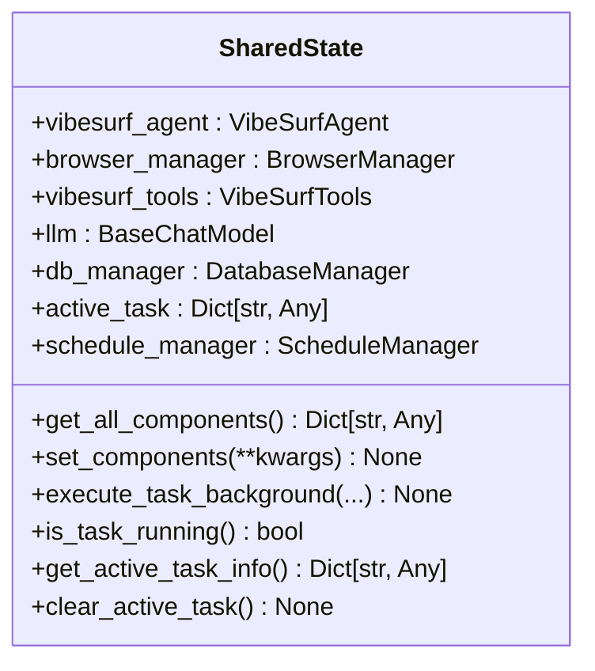
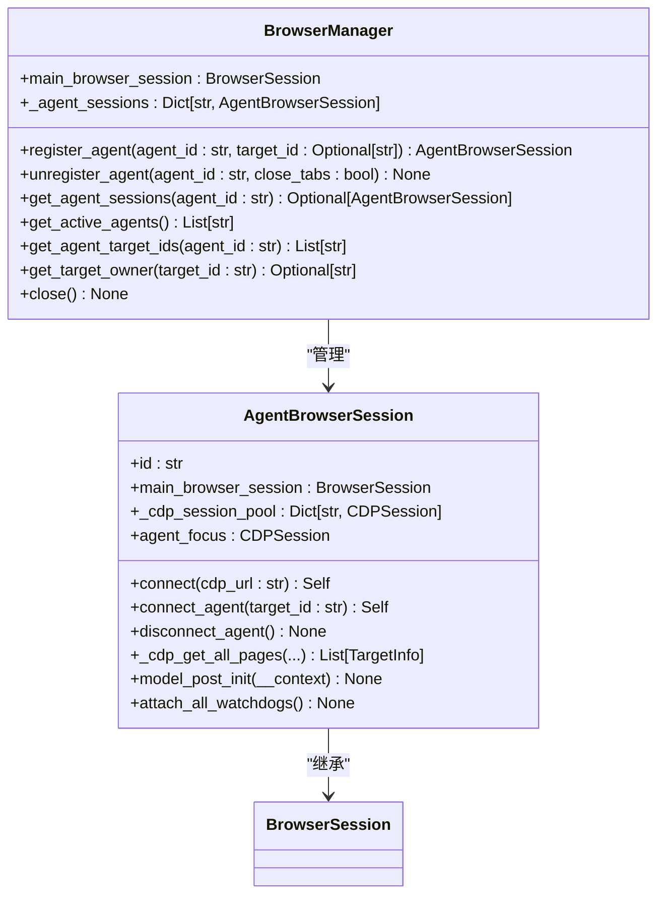
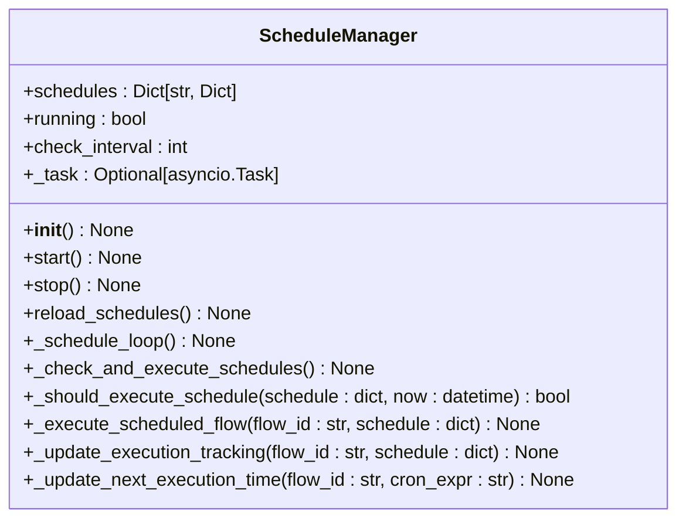

# 多代理系统

<cite>
**本文档引用的文件**
- [shared_state.py](file://vibe_surf/backend/shared_state.py)
- [main.py](file://vibe_surf/backend/main.py)
- [agent.py](file://vibe_surf/backend/api/agent.py)
- [task.py](file://vibe_surf/backend/api/task.py)
- [schedule.py](file://vibe_surf/backend/api/schedule.py)
- [vibe_surf_agent.py](file://vibe_surf/agents/vibe_surf_agent.py)
- [browser_manager.py](file://vibe_surf/browser/browser_manager.py)
- [agent_browser_session.py](file://vibe_surf/browser/agent_browser_session.py)
</cite>

## 目录
1. [简介](#简介)
2. [全局状态管理](#全局状态管理)
3. [代理API端点](#代理api端点)
4. [多标签并行执行](#多标签并行执行)
5. [任务调度系统](#任务调度系统)
6. [配置与资源管理](#配置与资源管理)
7. [故障恢复机制](#故障恢复机制)
8. [系统扩展性与性能调优](#系统扩展性与性能调优)

## 简介
VibeSurf的多代理并行处理系统是一个复杂的架构，旨在通过多个代理的协调工作来执行复杂的浏览器自动化任务。该系统利用全局状态管理、API端点控制、并行执行和任务调度等机制，实现了高效的任务处理和资源管理。本文档详细阐述了该系统的核心组件和工作原理。

**Section sources**
- [main.py](file://vibe_surf/backend/main.py#L1-L794)
- [shared_state.py](file://vibe_surf/backend/shared_state.py#L1-L1111)

## 全局状态管理
VibeSurf系统通过`shared_state.py`模块管理全局状态，实现了多个代理之间的协调与通信。该模块定义了多个全局变量和函数，用于在不同组件之间共享状态信息。

### 全局状态变量
`shared_state.py`模块中定义了以下关键的全局状态变量：

- `vibesurf_agent`: VibeSurf代理实例，负责协调其他代理的执行。
- `browser_manager`: 浏览器管理器实例，负责管理多个浏览器会话。
- `vibesurf_tools`: 工具实例，提供各种功能供代理使用。
- `llm`: 语言模型实例，用于处理自然语言任务。
- `db_manager`: 数据库管理器实例，用于持久化数据。
- `active_task`: 当前活动的任务信息，用于跟踪任务执行状态。
- `schedule_manager`: 调度管理器实例，用于管理定时任务。

### 状态管理函数
该模块提供了多个函数来管理全局状态：

- `get_all_components()`: 获取所有组件的字典表示。
- `set_components(**kwargs)`: 更新全局组件。
- `execute_task_background(...)`: 在后台执行任务，支持LLM配置文件。
- `is_task_running()`: 检查是否有任务正在运行。
- `get_active_task_info()`: 获取当前活动任务的信息。
- `clear_active_task()`: 清除活动任务（在停止时使用）。

这些全局状态变量和函数通过避免循环导入问题，实现了在`main.py`和各个路由器之间的状态共享。



**Diagram sources**
- [shared_state.py](file://vibe_surf/backend/shared_state.py#L1-L1111)

**Section sources**
- [shared_state.py](file://vibe_surf/backend/shared_state.py#L1-L1111)

## 代理API端点
`agent.py`文件定义了代理相关的API端点，主要用于获取系统中的所有技能。

### 获取所有技能
`/agent/get_all_skills`端点用于获取VibeSurf工具注册表中的所有可用技能名称。该端点会过滤出以'skill_'开头的动作，并移除前缀后返回技能名称列表。

```python
@router.get("/get_all_skills", response_model=List[str])
async def get_all_skills():
    """
    获取VibeSurf工具注册表中的所有可用技能名称。
    返回移除'skill_'前缀后的技能名称。
    """
    try:
        from ..shared_state import vibesurf_tools
        if not vibesurf_tools:
            raise HTTPException(status_code=500, detail="VibeSurf tools not initialized")
        
        # 获取注册表中的所有动作名称
        all_actions = vibesurf_tools.registry.registry.actions.keys()
        
        # 过滤出以'skill_'开头的动作并移除前缀
        skill_names = [
            action_name.replace('skill_', '') 
            for action_name in all_actions 
            if action_name.startswith('skill_')
        ]
        return skill_names
        
    except Exception as e:
        raise HTTPException(status_code=500, detail=f"Failed to get skills: {str(e)}")
```

该API端点通过访问`shared_state`中的`vibesurf_tools`实例，获取所有注册的动作，并返回以'skill_'开头的技能名称，为前端提供了可用技能的列表。

**Section sources**
- [agent.py](file://vibe_surf/backend/api/agent.py#L1-L38)

## 多标签并行执行
VibeSurf系统通过`browser_manager.py`和`agent_browser_session.py`实现了多标签并行执行机制，确保了浏览器会话的隔离和资源的有效分配。

### 浏览器会话隔离
`BrowserManager`类负责管理多个代理的浏览器会话。每个代理通过`register_agent`方法注册，获得一个独立的`AgentBrowserSession`实例。



**Diagram sources**
- [browser_manager.py](file://vibe_surf/browser/browser_manager.py#L1-L269)
- [agent_browser_session.py](file://vibe_surf/browser/agent_browser_session.py#L1-L1245)

### 资源分配与性能监控
`BrowserManager`通过以下机制实现资源分配和性能监控：

1. **会话注册与分配**: `register_agent`方法为每个代理创建一个`AgentBrowserSession`，并将其与主浏览器会话关联。
2. **目标分配**: `assign_target_to_agent`方法将特定的浏览器标签页分配给代理，确保每个代理在独立的环境中运行。
3. **资源清理**: `unregister_agent`方法在代理注销时清理相关资源，包括关闭标签页和断开CDP会话。

这些机制确保了多个代理可以并行执行任务，同时保持浏览器会话的隔离和资源的有效管理。

**Section sources**
- [browser_manager.py](file://vibe_surf/browser/browser_manager.py#L1-L269)
- [agent_browser_session.py](file://vibe_surf/browser/agent_browser_session.py#L1-L1245)

## 任务调度系统
VibeSurf的任务调度系统由`schedule.py`和`shared_state.py`中的`ScheduleManager`类实现，负责管理定时任务的执行。

### 调度管理器
`ScheduleManager`类是任务调度系统的核心，负责加载、检查和执行定时任务。



**Diagram sources**
- [shared_state.py](file://vibe_surf/backend/shared_state.py#L740-L1111)

### 调度API端点
`scheduler.py`文件定义了管理调度的API端点：

- `GET /schedule`: 获取所有调度
- `POST /schedule`: 创建新调度
- `GET /schedule/{flow_id}`: 获取特定调度
- `PUT /schedule/{flow_id}`: 更新调度
- `DELETE /schedule/{flow_id}`: 删除调度

这些端点允许用户通过REST API管理定时任务，支持CRUD操作。

### 调度工作流程
调度系统的工作流程如下：

1. **加载调度**: `reload_schedules`方法从数据库加载所有启用的调度。
2. **检查执行**: `_check_and_execute_schedules`方法定期检查是否有调度需要执行。
3. **执行任务**: `_execute_scheduled_flow`方法通过HTTP请求触发相应的流程。
4. **更新跟踪**: `_update_execution_tracking`方法更新数据库中的执行计数和下次执行时间。

这种设计确保了定时任务的可靠执行和状态跟踪。

**Section sources**
- [schedule.py](file://vibe_surf/backend/api/schedule.py#L1-L331)
- [shared_state.py](file://vibe_surf/backend/shared_state.py#L740-L1111)

## 配置与资源管理
VibeSurf系统通过环境变量和配置文件管理代理数量、并发级别和资源限制。

### 配置示例
系统通过`envs.json`文件和环境变量进行配置。关键配置包括：

- `BROWSER_EXECUTION_PATH`: 浏览器执行路径
- `BROWSER_USER_DATA`: 浏览器用户数据目录
- `VIBESURF_EXTENSION`: VibeSurf扩展路径
- `VIBESURF_BACKEND_URL`: 后端URL
- `LLM_MODEL`: 语言模型名称
- `OPENAI_ENDPOINT`: OpenAI端点
- `OPENAI_API_KEY`: OpenAI API密钥

这些配置在`shared_state.py`的`initialize_vibesurf_components`函数中被加载和应用。

### 资源限制
系统通过以下方式管理资源限制：

1. **浏览器会话**: 每个代理拥有独立的浏览器会话，通过`AgentBrowserProfile`配置窗口大小、代理设置等。
2. **并发控制**: 通过`execute_parallel_browser_tasks`函数实现并行任务执行，但受系统资源限制。
3. **内存管理**: 使用`MemorySaver`作为LangGraph的检查点，管理会话状态。

这些配置和资源管理机制确保了系统在不同环境下的稳定运行。

**Section sources**
- [shared_state.py](file://vibe_surf/backend/shared_state.py#L453-L598)

## 故障恢复机制
VibeSurf系统实现了完善的故障恢复机制，确保在代理崩溃后能够自动重启和恢复状态。

### 代理崩溃检测
系统通过`monitor_browser_connection`函数持续监控浏览器连接状态：

```python
async def monitor_browser_connection():
    """后台任务，用于监控浏览器连接"""
    while True:
        try:
            await asyncio.sleep(2)  # 每2秒检查一次

            if shared_state.browser_manager:
                is_connected = await shared_state.browser_manager.check_browser_connected()
                if not is_connected:
                    logger.error("No Available Browser, Exiting...")
                    # 触发优雅关闭
                    import threading
                    import signal
                    import os

                    def trigger_shutdown():
                        try:
                            import time
                            time.sleep(0.5)
                            os.kill(os.getpid(), signal.SIGTERM)
                        except Exception as e:
                            logger.error(f"Error during shutdown trigger: {e}")
                            try:
                                os.kill(os.getpid(), signal.SIGKILL)
                            except:
                                pass

                    shutdown_thread = threading.Thread(target=trigger_shutdown)
                    shutdown_thread.daemon = True
                    shutdown_thread.start()
                    break

        except asyncio.CancelledError:
            logger.info("Browser monitor task cancelled")
            break
        except Exception as e:
            logger.warning(f"Browser monitor error: {e}")
```

### 状态恢复
当系统重启时，通过以下机制恢复状态：

1. **组件初始化**: `initialize_vibesurf_components`函数重新初始化所有组件。
2. **调度管理器**: `initialize_schedule_manager`函数启动调度管理器，重新加载所有调度。
3. **任务状态**: 从数据库恢复任务状态，确保未完成的任务能够继续执行。

这些机制确保了系统在故障后的可靠恢复。

**Section sources**
- [main.py](file://vibe_surf/backend/main.py#L103-L148)
- [shared_state.py](file://vibe_surf/backend/shared_state.py#L453-L598)

## 系统扩展性与性能调优
VibeSurf系统设计考虑了扩展性和性能调优，以应对高负载情况。

### 系统扩展性
系统通过以下方式实现扩展性：

1. **模块化设计**: 各个组件（代理、工具、浏览器管理器）高度解耦，便于独立扩展。
2. **并行执行**: 支持多个代理并行执行任务，提高处理能力。
3. **分布式潜力**: 通过CDP（Chrome DevTools Protocol）连接，系统有潜力扩展到分布式环境。

### 性能调优建议
在高负载情况下，建议采取以下性能调优措施：

1. **资源分配**: 根据系统资源合理配置代理数量和并发级别。
2. **缓存优化**: 利用`MemorySaver`和数据库缓存，减少重复计算。
3. **异步处理**: 充分利用异步I/O，提高系统吞吐量。
4. **监控与调优**: 使用内置的性能监控功能，持续优化系统性能。

这些设计和建议确保了VibeSurf系统在高负载情况下的稳定性和高效性。

**Section sources**
- [vibe_surf_agent.py](file://vibe_surf/agents/vibe_surf_agent.py#L1-L1840)
- [main.py](file://vibe_surf/backend/main.py#L1-L794)