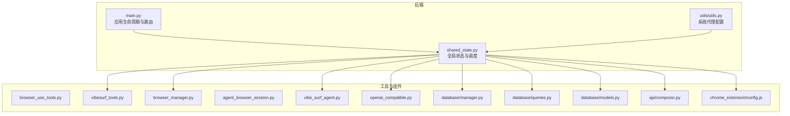
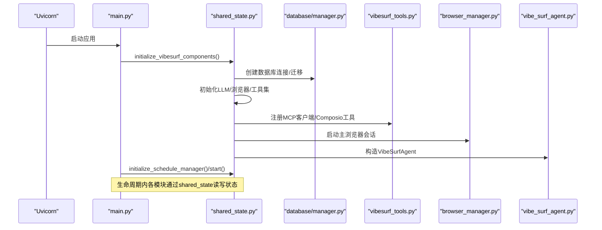
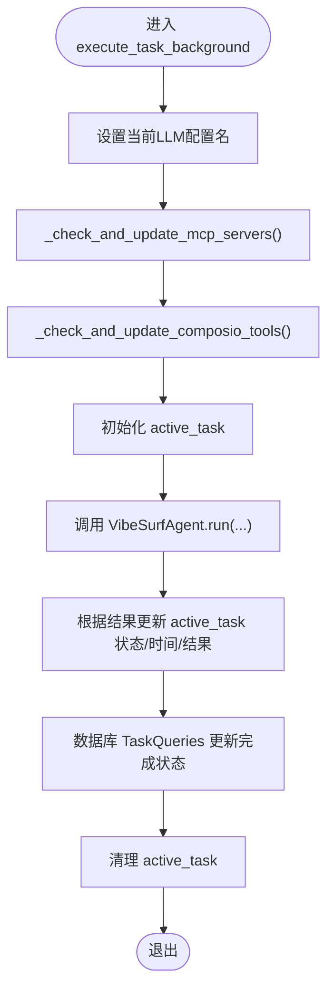
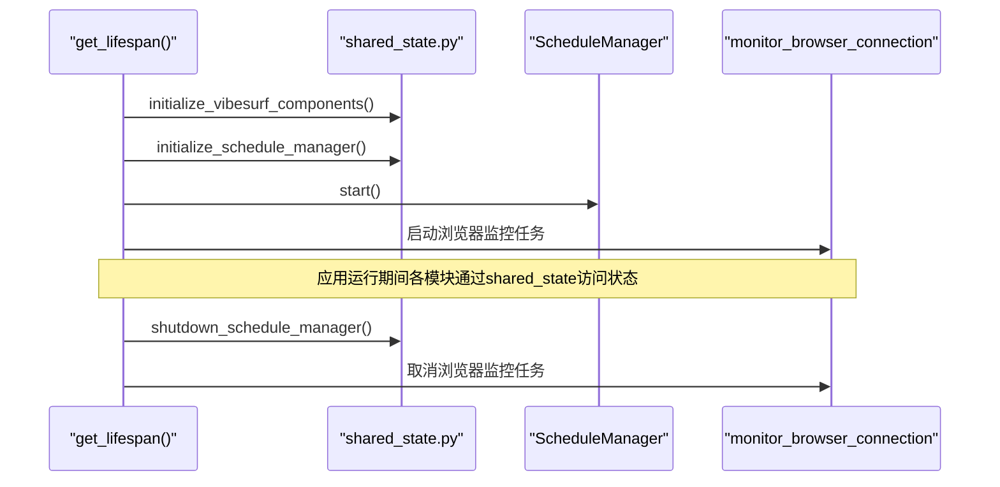
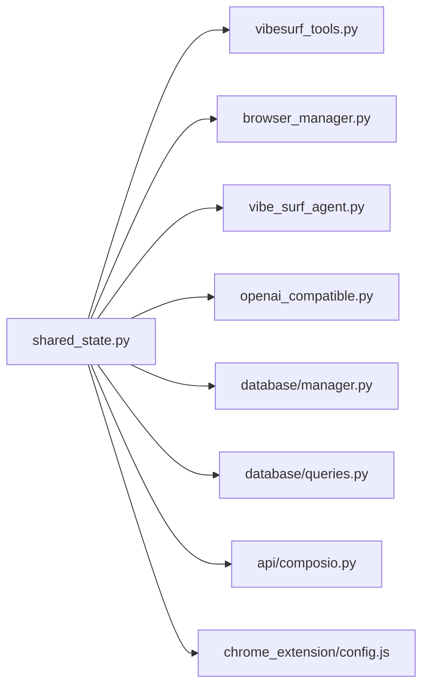

# 状态共享

<cite>
**本文引用的文件**
- [shared_state.py](file://vibe_surf/backend/shared_state.py)
- [main.py](file://vibe_surf/backend/main.py)
- [utils.py（后端）](file://vibe_surf/backend/utils/utils.py)
- [browser_use_tools.py](file://vibe_surf/tools/browser_use_tools.py)
- [vibesurf_tools.py](file://vibe_surf/tools/vibesurf_tools.py)
- [browser_manager.py](file://vibe_surf/browser/browser_manager.py)
- [agent_browser_session.py](file://vibe_surf/browser/agent_browser_session.py)
- [vibe_surf_agent.py](file://vibe_surf/agents/vibe_surf_agent.py)
- [openai_compatible.py](file://vibe_surf/llm/openai_compatible.py)
- [database/manager.py](file://vibe_surf/backend/database/manager.py)
- [database/queries.py](file://vibe_surf/backend/database/queries.py)
- [database/models.py](file://vibe_surf/backend/database/models.py)
- [api/composio.py](file://vibe_surf/backend/api/composio.py)
- [chrome_extension/config.js](file://vibe_surf/chrome_extension/config.js)
</cite>

## 目录
1. [简介](#简介)
2. [项目结构](#项目结构)
3. [核心组件](#核心组件)
4. [架构总览](#架构总览)
5. [详细组件分析](#详细组件分析)
6. [依赖关系分析](#依赖关系分析)
7. [性能与可扩展性](#性能与可扩展性)
8. [故障排查指南](#故障排查指南)
9. [结论](#结论)

## 简介
本文件系统性文档化 VibeSurf 的状态共享机制，重点围绕 backend/shared_state.py 中的全局状态管理器展开，解释其如何在应用生命周期内为多模块提供统一的状态存储、访问控制与变更通知；同时说明该状态在 main.py 启动流程中的初始化与使用方式，以及在多代理系统中的关键作用（如协调代理间通信、共享上下文信息与同步执行状态）。文档还覆盖了工具函数对状态操作的支持（序列化、验证与转换）、一致性保障（线程安全与并发控制）、持久化策略（数据库与本地配置文件），并给出安全读写共享状态的实践建议与性能考量。

## 项目结构
VibeSurf 的状态共享主要集中在后端模块中：
- 全局状态定义与管理：backend/shared_state.py
- 应用启动与生命周期：backend/main.py
- 工具函数支持：backend/utils/utils.py
- 组件集成：tools/*、browser/*、agents/*、llm/*、database/*

图表来源
- [shared_state.py](file://vibe_surf/backend/shared_state.py#L1-L120)
- [main.py](file://vibe_surf/backend/main.py#L327-L482)
- [utils.py（后端）](file://vibe_surf/backend/utils/utils.py#L1-L42)
- [browser_use_tools.py](file://vibe_surf/tools/browser_use_tools.py)
- [vibesurf_tools.py](file://vibe_surf/tools/vibesurf_tools.py)
- [browser_manager.py](file://vibe_surf/browser/browser_manager.py)
- [agent_browser_session.py](file://vibe_surf/browser/agent_browser_session.py)
- [vibe_surf_agent.py](file://vibe_surf/agents/vibe_surf_agent.py)
- [openai_compatible.py](file://vibe_surf/llm/openai_compatible.py)
- [database/manager.py](file://vibe_surf/backend/database/manager.py)
- [database/queries.py](file://vibe_surf/backend/database/queries.py)
- [database/models.py](file://vibe_surf/backend/database/models.py)
- [api/composio.py](file://vibe_surf/backend/api/composio.py)
- [chrome_extension/config.js](file://vibe_surf/chrome_extension/config.js)

章节来源
- [shared_state.py](file://vibe_surf/backend/shared_state.py#L1-L120)
- [main.py](file://vibe_surf/backend/main.py#L327-L482)

## 核心组件
- 全局状态变量：包含 VibeSurfAgent、BrowserManager、VibeSurfTools、LLM 实例、数据库管理器、当前 LLM 配置名、Composio 实例、计划任务管理器、环境变量字典、活动任务等。
- 状态访问接口：提供 get_all_components、set_components、get_envs、update_envs 等方法，用于读取与更新全局状态。
- 任务执行与状态跟踪：execute_task_background 负责单任务异步执行，维护 active_task 字段并在开始/结束时更新数据库与状态。
- MCP 与 Composio 动态配置：通过 _check_and_update_mcp_servers 与 _check_and_update_composio_tools 在运行时检测数据库变化并动态更新工具集。
- 计划任务管理器：ScheduleManager 提供周期性任务的加载、检查与执行，支持 cron 表达式与最小间隔控制。
- 初始化流程：initialize_vibesurf_components 从环境变量与数据库加载配置，初始化 LLM、浏览器会话、工具集与数据库表结构，并持久化 envs.json。

章节来源
- [shared_state.py](file://vibe_surf/backend/shared_state.py#L37-L117)
- [shared_state.py](file://vibe_surf/backend/shared_state.py#L118-L233)
- [shared_state.py](file://vibe_surf/backend/shared_state.py#L255-L386)
- [shared_state.py](file://vibe_surf/backend/shared_state.py#L388-L452)
- [shared_state.py](file://vibe_surf/backend/shared_state.py#L453-L602)
- [shared_state.py](file://vibe_surf/backend/shared_state.py#L604-L682)
- [shared_state.py](file://vibe_surf/backend/shared_state.py#L684-L712)
- [shared_state.py](file://vibe_surf/backend/shared_state.py#L740-L874)
- [shared_state.py](file://vibe_surf/backend/shared_state.py#L875-L1111)

## 架构总览
下图展示了状态共享在应用生命周期中的关键交互路径：main.py 在 lifespan 中调用 shared_state.initialize_vibesurf_components 完成全局组件初始化；随后通过 ScheduleManager.start 启动计划任务；各路由与后台任务通过 shared_state 获取全局状态并进行读写。

图表来源
- [main.py](file://vibe_surf/backend/main.py#L327-L482)
- [shared_state.py](file://vibe_surf/backend/shared_state.py#L453-L602)
- [shared_state.py](file://vibe_surf/backend/shared_state.py#L740-L874)

## 详细组件分析

### 全局状态管理器（shared_state.py）
- 状态存储
  - 全局变量集中保存核心组件实例与配置，如 vibesurf_agent、browser_manager、vibesurf_tools、llm、db_manager、current_llm_profile_name、composio_instance、schedule_manager、envs、active_mcp_server、active_task 等。
  - 提供 get_all_components 与 set_components 以统一读取/更新状态，避免循环导入问题。
- 访问控制
  - 通过 get_envs/update_envs 提供受控的环境变量读写，自动同步到 os.environ 并持久化到 envs.json。
  - 通过 is_task_running/get_active_task_info/clear_active_task 对活动任务进行统一管理。
- 变更通知
  - 通过数据库查询与更新（TaskQueries、McpProfileQueries、ComposioToolkitQueries）在任务执行前后更新数据库记录，实现跨进程/跨模块可见的状态变更。
  - 计划任务管理器在 reload_schedules/_schedule_loop 中定期检查并触发任务，形成“状态变更→计划检查→执行”的闭环。
- 初始化与生命周期
  - initialize_vibesurf_components 负责从环境变量与数据库加载配置，初始化 LLM、浏览器、工具集与数据库表结构，并持久化 envs.json。
  - initialize_schedule_manager/shutdown_schedule_manager 提供调度器的启动与关闭。
- 动态配置更新
  - _check_and_update_mcp_servers 与 _check_and_update_composio_tools 检测数据库中的 MCP 与 Composio 配置变化，动态更新工具集并记录日志。
- 执行与持久化
  - execute_task_background 在任务开始前设置 active_task，执行完成后根据结果更新数据库与状态，并在 finally 清理 active_task。

图表来源
- [shared_state.py](file://vibe_surf/backend/shared_state.py#L118-L233)
- [shared_state.py](file://vibe_surf/backend/shared_state.py#L255-L386)
- [shared_state.py](file://vibe_surf/backend/shared_state.py#L388-L452)

章节来源
- [shared_state.py](file://vibe_surf/backend/shared_state.py#L37-L117)
- [shared_state.py](file://vibe_surf/backend/shared_state.py#L118-L233)
- [shared_state.py](file://vibe_surf/backend/shared_state.py#L255-L386)
- [shared_state.py](file://vibe_surf/backend/shared_state.py#L388-L452)
- [shared_state.py](file://vibe_surf/backend/shared_state.py#L453-L602)
- [shared_state.py](file://vibe_surf/backend/shared_state.py#L604-L682)
- [shared_state.py](file://vibe_surf/backend/shared_state.py#L684-L712)
- [shared_state.py](file://vibe_surf/backend/shared_state.py#L740-L1111)

### 应用生命周期与初始化（main.py）
- 生命周期钩子
  - get_lifespan 在应用启动时调用 initialize_langflow_in_background 与 initialize_vibesurf_components，随后启动浏览器监控与计划任务管理器。
  - 在应用关闭时，依次停止计划任务、取消后台任务、清理 Langflow 服务与浏览器/数据库资源。
- 状态读取
  - /api/status 路由通过 shared_state.get_active_task_info 返回系统状态，便于前端或外部监控查看当前活动任务。
- 浏览器监控
  - monitor_browser_connection 定期检查浏览器连接状态，若断开则触发优雅关闭流程。

图表来源
- [main.py](file://vibe_surf/backend/main.py#L327-L482)
- [shared_state.py](file://vibe_surf/backend/shared_state.py#L1083-L1111)

章节来源
- [main.py](file://vibe_surf/backend/main.py#L327-L482)
- [main.py](file://vibe_surf/backend/main.py#L671-L694)

### 工具函数支持（utils.py（后端））
- 系统代理配置
  - configure_system_proxies 读取系统代理并通过 HTTP_PROXY/HTTPS_PROXY/no_proxy 设置环境变量，确保网络请求遵循系统代理策略。
- 状态相关工具
  - get_envs/update_envs 提供受控的环境变量读写与持久化，避免直接修改 os.environ 导致的不一致。

章节来源
- [utils.py（后端）](file://vibe_surf/backend/utils/utils.py#L1-L42)
- [shared_state.py](file://vibe_surf/backend/shared_state.py#L684-L712)

### 多代理系统中的状态共享
- 协调代理间通信
  - 共享状态中的 BrowserManager 与 VibeSurfAgent 作为全局入口，其他模块通过 shared_state 获取实例，避免重复创建与状态漂移。
- 共享上下文信息
  - envs 字典统一存放工作空间、浏览器路径、扩展路径、后端 URL 等上下文信息，update_envs 会同步到 os.environ 并持久化到 envs.json。
- 同步执行状态
  - active_task 字段在任务执行前后被严格更新，结合数据库 TaskQueries 的更新，确保跨模块可见的执行状态一致性。

章节来源
- [shared_state.py](file://vibe_surf/backend/shared_state.py#L37-L117)
- [shared_state.py](file://vibe_surf/backend/shared_state.py#L118-L233)
- [shared_state.py](file://vibe_surf/backend/shared_state.py#L684-L712)

### 安全读写共享状态示例（路径指引）
- 读取全局组件
  - 使用 get_all_components 获取所有组件快照，避免直接访问全局变量导致的竞争风险。
  - 示例路径：[get_all_components](file://vibe_surf/backend/shared_state.py#L62-L82)
- 更新全局组件
  - 使用 set_components 按需更新指定组件，确保原子性与一致性。
  - 示例路径：[set_components](file://vibe_surf/backend/shared_state.py#L85-L117)
- 读取/更新环境变量
  - 使用 get_envs 获取副本，使用 update_envs 原子性更新并持久化。
  - 示例路径：[get_envs](file://vibe_surf/backend/shared_state.py#L684-L688)、[update_envs](file://vibe_surf/backend/shared_state.py#L690-L712)
- 任务状态读取
  - 使用 is_task_running/get_active_task_info/clear_active_task 管理活动任务。
  - 示例路径：[is_task_running](file://vibe_surf/backend/shared_state.py#L235-L241)、[get_active_task_info](file://vibe_surf/backend/shared_state.py#L243-L247)、[clear_active_task](file://vibe_surf/backend/shared_state.py#L249-L253)

章节来源
- [shared_state.py](file://vibe_surf/backend/shared_state.py#L62-L117)
- [shared_state.py](file://vibe_surf/backend/shared_state.py#L235-L253)
- [shared_state.py](file://vibe_surf/backend/shared_state.py#L684-L712)

### 状态一致性与并发控制
- 线程安全与并发
  - 全局状态变量为进程内共享，未使用显式锁保护。建议在需要跨协程/线程访问时采用 asyncio.Lock 或 threading.Lock 进行加锁。
  - 计划任务管理器内部使用 asyncio 事件循环与异步任务，避免阻塞主线程。
- 数据库一致性
  - execute_task_background 在任务完成后通过 TaskQueries 更新数据库，使用事务提交确保失败回滚。
  - ScheduleManager 在 reload_schedules/_update_execution_tracking 中使用 SQLAlchemy ORM 与事务，保证调度状态的一致性。
- 环境变量一致性
  - update_envs 同步更新 os.environ 与 envs.json，避免部分模块读取旧值。

章节来源
- [shared_state.py](file://vibe_surf/backend/shared_state.py#L118-L233)
- [shared_state.py](file://vibe_surf/backend/shared_state.py#L875-L1111)
- [shared_state.py](file://vibe_surf/backend/shared_state.py#L690-L712)

### 状态持久化策略
- 环境变量持久化
  - initialize_vibesurf_components 在初始化后将 envs 写入 envs.json；update_envs 在更新后也持久化到 envs.json，确保重启后恢复。
  - 示例路径：[initialize_vibesurf_components 写入 envs.json](file://vibe_surf/backend/shared_state.py#L589-L596)、[update_envs 写入 envs.json](file://vibe_surf/backend/shared_state.py#L702-L705)
- 数据库持久化
  - execute_task_background 与 ScheduleManager 在任务执行与调度更新时均通过数据库查询/更新持久化状态。
  - 示例路径：[TaskQueries.update_task_completion](file://vibe_surf/backend/shared_state.py#L188-L201)、[ScheduleManager.reload_schedules](file://vibe_surf/backend/shared_state.py#L770-L856)

章节来源
- [shared_state.py](file://vibe_surf/backend/shared_state.py#L589-L596)
- [shared_state.py](file://vibe_surf/backend/shared_state.py#L702-L705)
- [shared_state.py](file://vibe_surf/backend/shared_state.py#L188-L201)
- [shared_state.py](file://vibe_surf/backend/shared_state.py#L770-L856)

## 依赖关系分析
- 组件耦合
  - shared_state 与 tools、browser、agents、llm、database 等模块存在双向依赖：前者提供全局状态，后者通过 shared_state 获取实例。
  - 通过延迟导入与字符串化类型注解减少循环导入风险。
- 外部依赖
  - Composio、LangchainProvider、SQLAlchemy、croniter、httpx 等第三方库参与动态配置与调度执行。
- 接口契约
  - VibeSurfTools、BrowserManager、VibeSurfAgent、DatabaseManager 等组件通过共享状态暴露统一接口，便于替换与扩展。

图表来源
- [shared_state.py](file://vibe_surf/backend/shared_state.py#L1-L120)
- [vibesurf_tools.py](file://vibe_surf/tools/vibesurf_tools.py)
- [browser_manager.py](file://vibe_surf/browser/browser_manager.py)
- [vibe_surf_agent.py](file://vibe_surf/agents/vibe_surf_agent.py)
- [openai_compatible.py](file://vibe_surf/llm/openai_compatible.py)
- [database/manager.py](file://vibe_surf/backend/database/manager.py)
- [database/queries.py](file://vibe_surf/backend/database/queries.py)
- [api/composio.py](file://vibe_surf/backend/api/composio.py)
- [chrome_extension/config.js](file://vibe_surf/chrome_extension/config.js)

章节来源
- [shared_state.py](file://vibe_surf/backend/shared_state.py#L1-L120)

## 性能与可扩展性
- 性能影响
  - 全局状态访问为内存读写，开销极低；但频繁的数据库更新（任务状态、调度状态）可能成为瓶颈，建议批量更新与异步提交。
  - 计划任务检查间隔默认 60 秒，可根据场景调整以平衡实时性与 CPU 开销。
- 扩展性考虑
  - 当前实现为单进程内共享状态；若需多进程/多实例部署，应引入分布式缓存（如 Redis）与分布式锁，或采用数据库中心化的状态存储。
  - 对于高并发任务，建议在 execute_task_background 中增加队列与限流控制，避免资源争用。

[本节为通用指导，无需具体文件分析]

## 故障排查指南
- 任务状态异常
  - 若任务长时间处于 running，检查 active_task 是否被正确清理；确认 execute_task_background 的 finally 分支是否执行。
  - 参考路径：[execute_task_background finally 清理](file://vibe_surf/backend/shared_state.py#L230-L233)
- 计划任务未执行
  - 检查 ScheduleManager.reload_schedules 是否成功加载数据库中的 enabled schedules；确认 cron 表达式有效且 next_execution_at 正确更新。
  - 参考路径：[reload_schedules](file://vibe_surf/backend/shared_state.py#L770-L856)、[_update_execution_tracking](file://vibe_surf/backend/shared_state.py#L962-L1022)
- 环境变量不同步
  - 确认 update_envs 是否被调用并成功写入 envs.json；检查 os.environ 是否被正确设置。
  - 参考路径：[update_envs](file://vibe_surf/backend/shared_state.py#L690-L712)
- 浏览器连接中断
  - monitor_browser_connection 会在断连时触发优雅关闭；检查浏览器会话与扩展配置。
  - 参考路径：[monitor_browser_connection](file://vibe_surf/backend/main.py#L103-L149)

章节来源
- [shared_state.py](file://vibe_surf/backend/shared_state.py#L230-L233)
- [shared_state.py](file://vibe_surf/backend/shared_state.py#L770-L856)
- [shared_state.py](file://vibe_surf/backend/shared_state.py#L962-L1022)
- [shared_state.py](file://vibe_surf/backend/shared_state.py#L690-L712)
- [main.py](file://vibe_surf/backend/main.py#L103-L149)

## 结论
VibeSurf 的状态共享通过 backend/shared_state.py 提供了统一的全局状态管理：在应用启动阶段完成组件初始化与配置持久化，在运行阶段通过任务执行、动态配置更新与计划任务管理实现状态的持续演进。配合 main.py 的生命周期钩子与工具函数，系统实现了对多代理系统的协调与上下文共享。为确保一致性与可扩展性，建议在高并发场景引入分布式状态与锁机制，并优化数据库更新策略以提升整体性能。