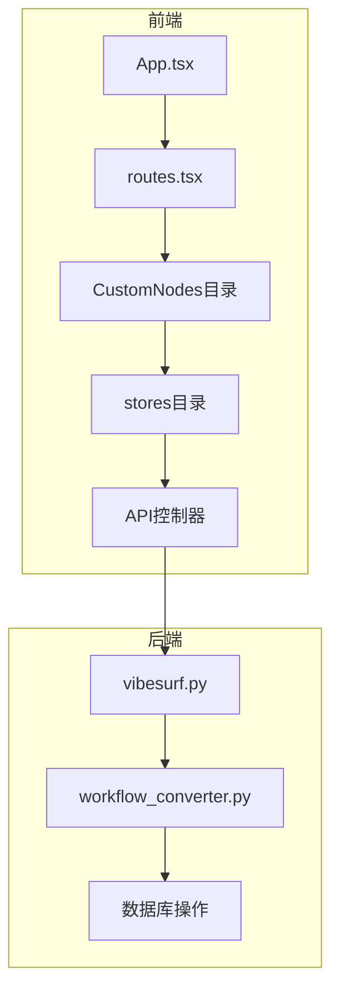
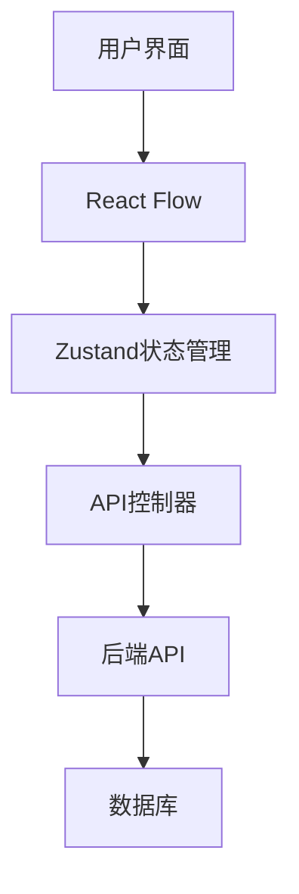
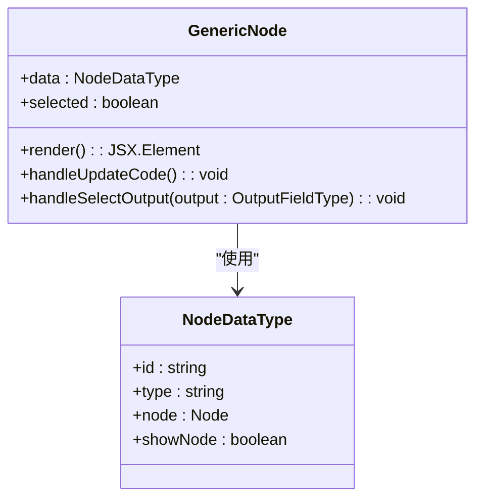
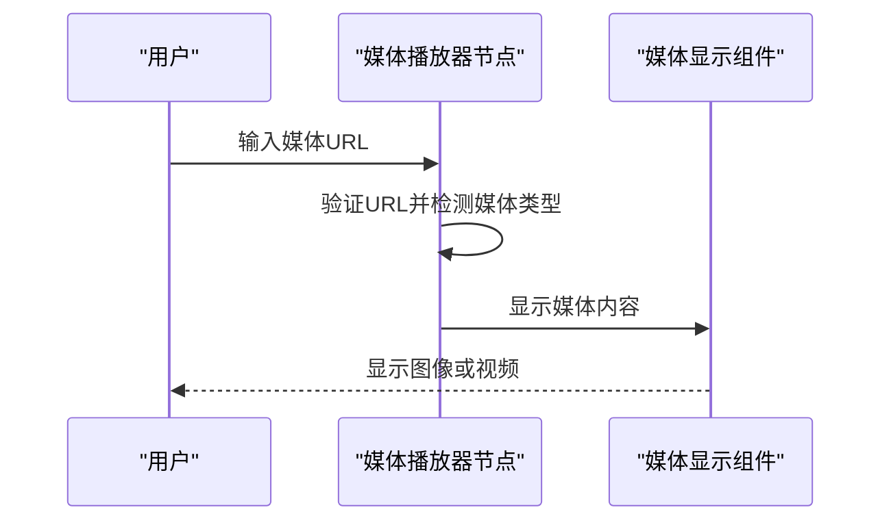
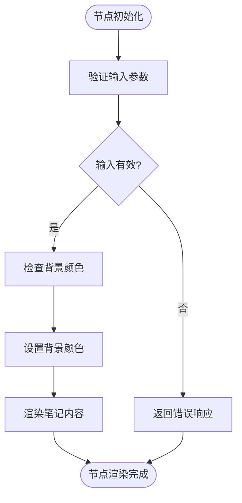
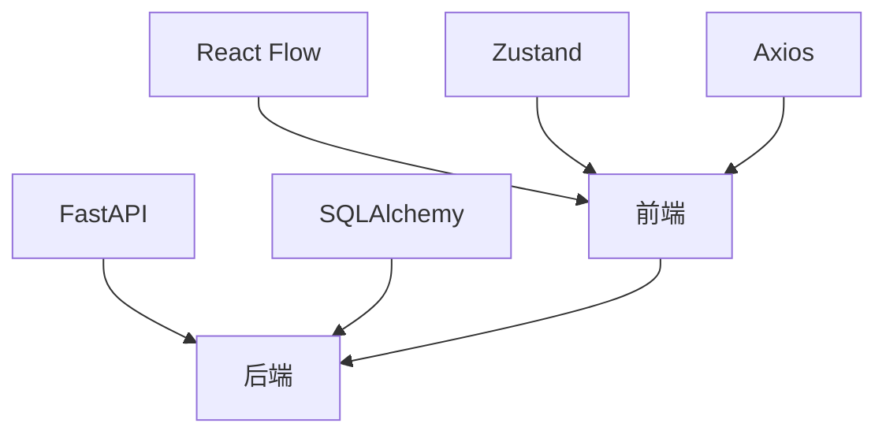

# 可视化工作流编辑器

<cite>
**本文档引用的文件**   
- [App.tsx](file://vibe_surf/frontend/src/App.tsx)
- [flow_constants.tsx](file://vibe_surf/frontend/src/flow_constants.tsx)
- [routes.tsx](file://vibe_surf/frontend/src/routes.tsx)
- [GenericNode/index.tsx](file://vibe_surf/frontend/src/CustomNodes/GenericNode/index.tsx)
- [MediaPlayerNode/index.tsx](file://vibe_surf/frontend/src/CustomNodes/MediaPlayerNode/index.tsx)
- [NoteNode/index.tsx](file://vibe_surf/frontend/src/CustomNodes/NoteNode/index.tsx)
- [flowStore.ts](file://vibe_surf/frontend/src/stores/flowStore.ts)
- [API/index.ts](file://vibe_surf/frontend/src/controllers/API/index.ts)
- [workflow_converter.py](file://vibe_surf/backend/utils/workflow_converter.py)
- [vibesurf.py](file://vibe_surf/backend/api/vibesurf.py)
</cite>

## 目录
1. [简介](#简介)
2. [项目结构](#项目结构)
3. [核心组件](#核心组件)
4. [架构概述](#架构概述)
5. [详细组件分析](#详细组件分析)
6. [依赖分析](#依赖分析)
7. [性能考虑](#性能考虑)
8. [故障排除指南](#故障排除指南)
9. [结论](#结论)

## 简介
可视化工作流编辑器是一个基于React Flow库构建的拖放式界面，允许用户通过图形化方式创建和管理复杂的工作流。该编辑器支持节点创建、连接、布局和交互功能，为用户提供直观的工作流设计体验。编辑器集成了多种自定义节点类型，包括通用节点、媒体播放器节点和笔记节点，每种节点都有其独特的功能和外观。工作流的序列化和反序列化功能确保了工作流数据的持久化存储，同时与后端API的通信实现了工作流的保存和加载。此外，编辑器还提供了自定义节点开发指南，帮助开发者扩展编辑器功能。

## 项目结构
可视化工作流编辑器的项目结构清晰，主要分为前端和后端两大部分。前端部分位于`vibe_surf/frontend`目录下，包含React组件、自定义节点、API控制器和状态管理。后端部分位于`vibe_surf/backend`目录下，负责处理API请求、数据库操作和工作流转换。前端使用React Flow库实现拖放式界面，通过Zustand进行状态管理，确保了应用的高效和响应性。

**图源**
- [App.tsx](file://vibe_surf/frontend/src/App.tsx#L1-L23)
- [routes.tsx](file://vibe_surf/frontend/src/routes.tsx#L1-L211)
- [GenericNode/index.tsx](file://vibe_surf/frontend/src/CustomNodes/GenericNode/index.tsx#L1-L750)
- [flowStore.ts](file://vibe_surf/frontend/src/stores/flowStore.ts#L1-L1101)
- [API/index.ts](file://vibe_surf/frontend/src/controllers/API/index.ts#L1-L304)

## 核心组件
可视化工作流编辑器的核心组件包括通用节点、媒体播放器节点和笔记节点。这些节点通过React Flow库实现拖放式界面，支持用户创建、连接和管理复杂的工作流。每个节点都有其独特的props、状态管理和渲染逻辑，确保了功能的灵活性和可扩展性。

**节源**
- [GenericNode/index.tsx](file://vibe_surf/frontend/src/CustomNodes/GenericNode/index.tsx#L1-L750)
- [MediaPlayerNode/index.tsx](file://vibe_surf/frontend/src/CustomNodes/MediaPlayerNode/index.tsx#L1-L234)
- [NoteNode/index.tsx](file://vibe_surf/frontend/src/CustomNodes/NoteNode/index.tsx#L1-L172)

## 架构概述
可视化工作流编辑器的架构基于React Flow库，通过Zustand进行状态管理，确保了应用的高效和响应性。前端部分负责用户界面的渲染和交互，后端部分处理API请求和数据持久化。编辑器支持工作流的序列化和反序列化，通过与后端API的通信实现工作流的保存和加载。

**图源**
- [App.tsx](file://vibe_surf/frontend/src/App.tsx#L1-L23)
- [flowStore.ts](file://vibe_surf/frontend/src/stores/flowStore.ts#L1-L1101)
- [API/index.ts](file://vibe_surf/frontend/src/controllers/API/index.ts#L1-L304)

## 详细组件分析
### 通用节点分析
通用节点是可视化工作流编辑器中最基本的节点类型，支持用户自定义输入和输出参数。节点的props包括`data`和`selected`，分别表示节点的数据和选中状态。状态管理通过Zustand实现，确保了节点状态的高效更新。渲染逻辑通过React组件实现，支持动态更新节点内容。

#### 对象导向组件

**图源**
- [GenericNode/index.tsx](file://vibe_surf/frontend/src/CustomNodes/GenericNode/index.tsx#L1-L750)

### 媒体播放器节点分析
媒体播放器节点支持用户通过URL输入图像或视频，并在工作流中显示。节点的props包括`data`和`selected`，分别表示节点的数据和选中状态。状态管理通过Zustand实现，确保了节点状态的高效更新。渲染逻辑通过React组件实现，支持动态更新媒体内容。

#### API/服务组件

**图源**
- [MediaPlayerNode/index.tsx](file://vibe_surf/frontend/src/CustomNodes/MediaPlayerNode/index.tsx#L1-L234)

### 笔记节点分析
笔记节点支持用户在工作流中添加文本笔记，支持Markdown格式。节点的props包括`data`和`selected`，分别表示节点的数据和选中状态。状态管理通过Zustand实现，确保了节点状态的高效更新。渲染逻辑通过React组件实现，支持动态更新笔记内容。

#### 复杂逻辑组件

**图源**
- [NoteNode/index.tsx](file://vibe_surf/frontend/src/CustomNodes/NoteNode/index.tsx#L1-L172)

## 依赖分析
可视化工作流编辑器的依赖关系清晰，前端部分依赖React Flow库实现拖放式界面，依赖Zustand进行状态管理，依赖Axios进行API通信。后端部分依赖FastAPI框架处理API请求，依赖SQLAlchemy进行数据库操作。这些依赖确保了编辑器的高效和可扩展性。

**图源**
- [package.json](file://vibe_surf/frontend/package.json#L1-L100)
- [pyproject.toml](file://pyproject.toml#L1-L50)

## 性能考虑
可视化工作流编辑器在性能优化方面采取了多种措施，包括虚拟滚动、节点懒加载和渲染优化。虚拟滚动确保了大量节点的高效渲染，节点懒加载减少了初始加载时间，渲染优化通过React的memo和useCallback钩子减少了不必要的重新渲染。这些优化措施确保了编辑器在处理复杂工作流时的流畅性。

## 故障排除指南
### 无效连接验证
编辑器通过`isValidConnection`函数验证节点之间的连接，确保连接的有效性。如果连接无效，编辑器会显示错误提示，帮助用户修正连接。

**节源**
- [reactflowUtils.ts](file://vibe_surf/frontend/src/utils/reactflowUtils.ts#L371-L408)

### 错误状态可视化
编辑器通过`flowBuildStatus`状态管理错误状态，确保错误信息的及时显示。当工作流构建失败时，编辑器会更新节点的构建状态，显示错误信息。

**节源**
- [flowStore.ts](file://vibe_surf/frontend/src/stores/flowStore.ts#L113-L116)

## 结论
可视化工作流编辑器通过React Flow库和Zustand状态管理，提供了一个高效、响应式的拖放式界面。编辑器支持多种自定义节点类型，通过与后端API的通信实现了工作流的持久化存储。性能优化措施确保了编辑器在处理复杂工作流时的流畅性，故障排除指南帮助用户快速解决常见问题。总体而言，该编辑器为用户提供了一个强大且易用的工作流设计工具。