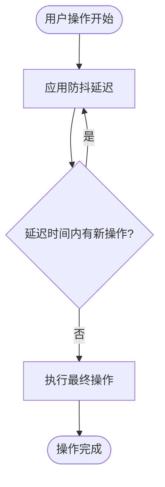
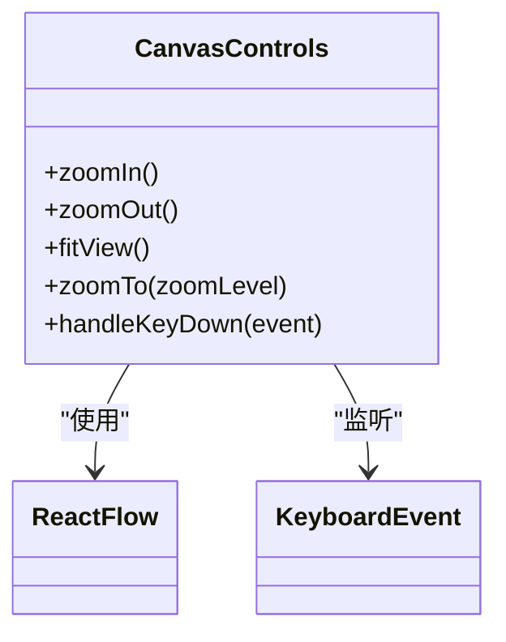
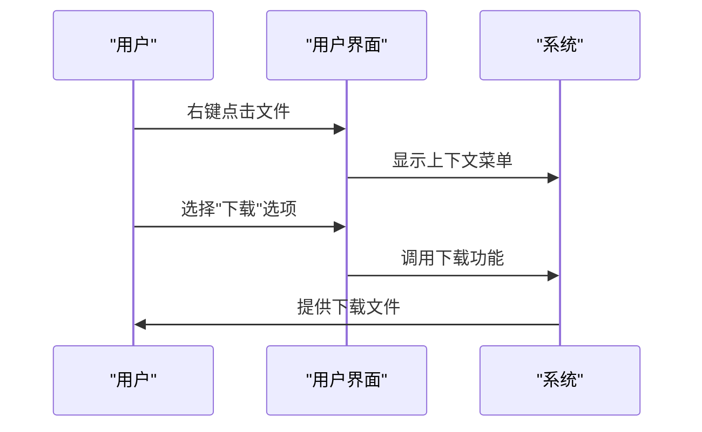
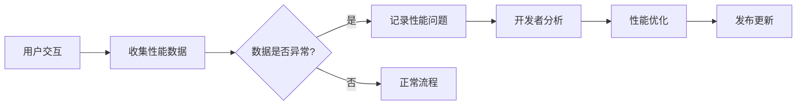

# 性能优化与用户体验

<cite>
**本文档引用的文件**
- [use-debounce.ts](file://vibe_surf/frontend/src/hooks/use-debounce.ts)
- [CanvasControlsDropdown.tsx](file://vibe_surf/frontend/src/components/core/canvasControlsComponent/CanvasControlsDropdown.tsx)
- [flowStore.ts](file://vibe_surf/frontend/src/stores/flowStore.ts)
- [reportWebVitals.ts](file://vibe_surf/frontend/src/reportWebVitals.ts)
- [settings-workflow.js](file://vibe_surf/chrome_extension/scripts/settings-workflow.js)
- [buildUtils.ts](file://vibe_surf/frontend/src/utils/buildUtils.ts)
- [use-shortcuts.ts](file://vibe_surf/frontend/src/pages/FlowPage/components/nodeToolbarComponent/hooks/use-shortcuts.ts)
- [constants.ts](file://vibe_surf/frontend/src/constants/constants.ts)
- [DragWrapComponent.tsx](file://vibe_surf/frontend/src/pages/MainPage/pages/filesPage/components/dragWrapComponent/index.tsx)
- [filesContextMenuComponent.tsx](file://vibe_surf/frontend/src/modals/fileManagerModal/components/filesContextMenuComponent/index.tsx)
</cite>

## 目录
1. [性能优化策略](#性能优化策略)
2. [画布控制功能](#画布控制功能)
3. [用户交互优化](#用户交互优化)
4. [性能监控与调试](#性能监控与调试)

## 性能优化策略

可视化工作流编辑器通过多种技术手段优化性能，确保在处理复杂工作流时仍能保持流畅的用户体验。核心优化策略包括防抖（debounce）和节流技术，用于减少频繁的状态更新。

防抖技术在 `use-debounce.ts` 文件中实现，通过 `lodash` 库的 `debounce` 函数包装回调函数，延迟执行直到在指定延迟时间内没有再次被调用。这种机制有效减少了因频繁输入或状态变化导致的重复计算和渲染，提升了响应速度。防抖在处理用户输入、搜索操作和自动保存等场景中特别有效。

**Diagram sources**
- [use-debounce.ts](file://vibe_surf/frontend/src/hooks/use-debounce.ts#L1-L13)

**Section sources**
- [use-debounce.ts](file://vibe_surf/frontend/src/hooks/use-debounce.ts#L1-L13)

## 画布控制功能

画布控制组件提供了完整的缩放、平移和居中功能，帮助用户高效管理大型工作流。这些功能通过 `CanvasControlsDropdown.tsx` 组件实现，集成在画布的控制面板中。

用户可以通过以下方式操作画布：
- **缩放**：使用 `+` 和 `-` 键盘快捷键或点击控制面板中的缩放按钮进行放大缩小
- **居中**：点击“Zoom To Fit”按钮或使用 `1` 快捷键，使所有节点适配到视图中
- **重置**：使用 `0` 快捷键将缩放级别重置为100%

这些控制功能通过监听键盘事件和鼠标交互实现，确保用户能够快速定位和查看工作流的不同部分。

**Diagram sources**
- [CanvasControlsDropdown.tsx](file://vibe_surf/frontend/src/components/core/canvasControlsComponent/CanvasControlsDropdown.tsx#L1-L145)

**Section sources**
- [CanvasControlsDropdown.tsx](file://vibe_surf/frontend/src/components/core/canvasControlsComponent/CanvasControlsDropdown.tsx#L1-L145)

## 用户交互优化

系统通过多种方式优化用户交互体验，包括快捷键支持、拖拽体验优化和上下文菜单集成。

### 快捷键支持

系统实现了丰富的键盘快捷键，定义在 `constants.ts` 文件中。这些快捷键覆盖了创建、保存、复制、删除等常用操作，显著提升了工作效率。例如：
- `mod+s`：保存更改
- `mod+c`：复制
- `mod+v`：粘贴
- `backspace`：删除
- `mod+z`：撤销
- `mod+y`：重做

快捷键通过 `use-shortcuts.ts` 钩子进行管理和监听，确保在不同上下文中正确响应。

### 拖拽体验优化

拖拽功能在 `DragWrapComponent.tsx` 中实现，提供了直观的文件和组件拖拽体验。当用户拖拽文件到指定区域时，界面会显示半透明效果，清晰指示可放置区域。系统还处理了拖拽过程中的各种事件，包括 `dragOver`、`dragEnter`、`dragLeave` 和 `drop`，确保交互流畅自然。

### 上下文菜单集成

右键菜单功能在 `filesContextMenuComponent.tsx` 中实现，为文件操作提供了便捷的入口。用户可以通过右键点击文件来执行下载、重命名、复制和删除等操作，无需通过复杂的导航路径。

**Diagram sources**
- [use-shortcuts.ts](file://vibe_surf/frontend/src/pages/FlowPage/components/nodeToolbarComponent/hooks/use-shortcuts.ts#L1-L47)
- [constants.ts](file://vibe_surf/frontend/src/constants/constants.ts#L801-L937)
- [DragWrapComponent.tsx](file://vibe_surf/frontend/src/pages/MainPage/pages/filesPage/components/dragWrapComponent/index.tsx#L1-L90)
- [filesContextMenuComponent.tsx](file://vibe_surf/frontend/src/modals/fileManagerModal/components/filesContextMenuComponent/index.tsx#L1-L42)

**Section sources**
- [use-shortcuts.ts](file://vibe_surf/frontend/src/pages/FlowPage/components/nodeToolbarComponent/hooks/use-shortcuts.ts#L1-L47)
- [constants.ts](file://vibe_surf/frontend/src/constants/constants.ts#L801-L937)
- [DragWrapComponent.tsx](file://vibe_surf/frontend/src/pages/MainPage/pages/filesPage/components/dragWrapComponent/index.tsx#L1-L90)
- [filesContextMenuComponent.tsx](file://vibe_surf/frontend/src/modals/fileManagerModal/components/filesContextMenuComponent/index.tsx#L1-L42)

## 性能监控与调试

系统集成了性能监控和调试工具，帮助开发者识别和解决性能瓶颈。`reportWebVitals.ts` 文件实现了 Web Vitals 监控，跟踪关键性能指标：

- **CLS** (Cumulative Layout Shift)：累积布局偏移，衡量页面稳定性
- **FID** (First Input Delay)：首次输入延迟，衡量响应性
- **FCP** (First Contentful Paint)：首次内容绘制，衡量加载速度
- **LCP** (Largest Contentful Paint)：最大内容绘制，衡量加载性能
- **TTFB** (Time to First Byte)：首字节时间，衡量网络性能

这些指标通过 `web-vitals` 库收集，并可用于分析应用性能，识别需要优化的区域。

**Diagram sources**
- [reportWebVitals.ts](file://vibe_surf/frontend/src/reportWebVitals.ts#L1-L15)

**Section sources**
- [reportWebVitals.ts](file://vibe_surf/frontend/src/reportWebVitals.ts#L1-L15)