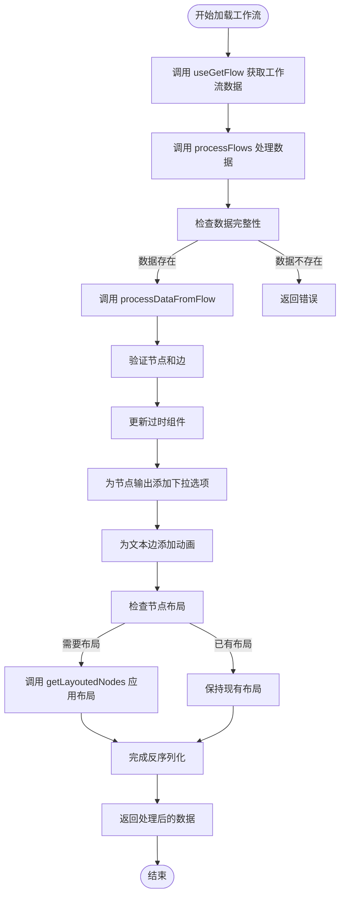
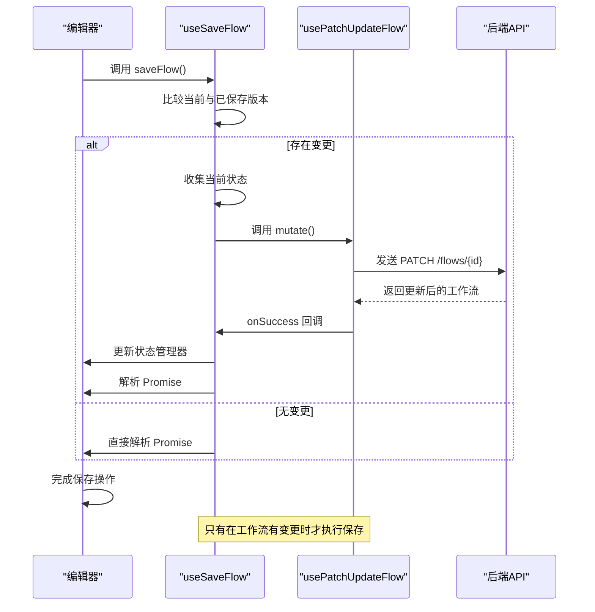
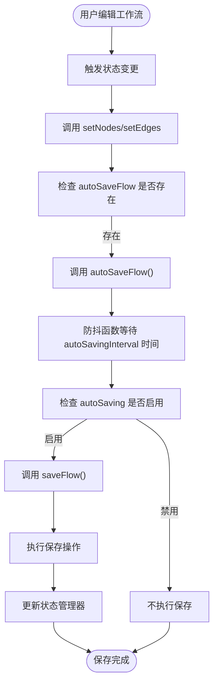
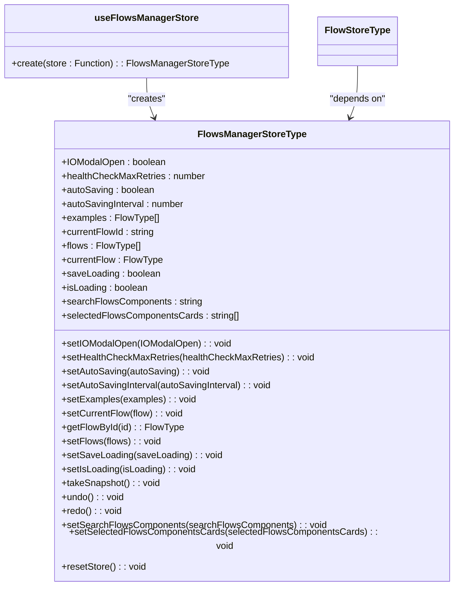

# 状态管理与序列化

<cite>
**本文档中引用的文件**   
- [flowStore.ts](file://vibe_surf/frontend/src/stores/flowStore.ts)
- [flowsManagerStore.ts](file://vibe_surf/frontend/src/stores/flowsManagerStore.ts)
- [use-save-flow.ts](file://vibe_surf/frontend/src/hooks/flows/use-save-flow.ts)
- [use-autosave-flow.ts](file://vibe_surf/frontend/src/hooks/flows/use-autosave-flow.ts)
- [use-get-flow.ts](file://vibe_surf/frontend/src/controllers/API/queries/flows/use-get-flow.ts)
- [use-patch-update-flow.ts](file://vibe_surf/frontend/src/controllers/API/queries/flows/use-patch-update-flow.ts)
- [reactflowUtils.ts](file://vibe_surf/frontend/src/utils/reactflowUtils.ts)
</cite>

## 目录
1. [简介](#简介)
2. [状态管理机制](#状态管理机制)
3. [序列化与反序列化](#序列化与反序列化)
4. [API通信机制](#api通信机制)
5. [自动保存与版本控制](#自动保存与版本控制)
6. [高级功能实现](#高级功能实现)

## 简介
本文档详细说明了可视化工作流编辑器的状态管理与序列化机制。系统使用Zustand作为全局状态管理解决方案，通过`flowStore.ts`文件管理编辑器的全局状态，包括节点、边、选中状态和画布变换等核心元素。工作流的序列化过程将React Flow的内部表示转换为可持久化的JSON格式，并在加载时进行反序列化恢复。编辑器通过API控制器与后端通信，实现工作流的保存（POST /flows）和加载（GET /flows/{id}）功能。系统还实现了自动保存、版本控制和冲突处理等高级功能，确保用户数据的安全性和一致性。

## 状态管理机制

可视化工作流编辑器使用Zustand库在`flowStore.ts`文件中实现全局状态管理。该状态管理机制负责维护编辑器的所有核心状态，包括节点、边、选中状态和画布变换等。`useFlowStore`是创建状态管理的核心函数，它定义了编辑器所需的所有状态变量和操作方法。

状态管理器维护了多个关键状态属性：`nodes`数组存储所有节点对象，`edges`数组存储所有连接边，`reactFlowInstance`保存React Flow实例以访问画布功能，`flowState`用于存储工作流的当前状态。此外，还管理着`isBuilding`标志来跟踪构建过程，`componentsToUpdate`数组用于标识需要更新的组件，以及`positionDictionary`用于管理节点位置。

状态管理器提供了丰富的操作方法来处理状态变更。`onNodesChange`和`onEdgesChange`方法处理节点和边的变更，使用React Flow提供的`applyNodeChanges`和`applyEdgeChanges`函数来应用变更。`setNodes`和`setEdges`方法不仅更新状态，还会在变更后触发当前工作流的更新和自动保存。`setNode`方法允许更新特定节点，同时会清理相关的边并触发自动保存。

```mermaid
classDiagram
class FlowStoreType {
+playgroundPage : boolean
+positionDictionary : object
+isPositionAvailable(position) : boolean
+fitViewNode(nodeId) : void
+autoSaveFlow : function
+componentsToUpdate : ComponentsToUpdateType[]
+setComponentsToUpdate(change) : void
+updateComponentsToUpdate(nodes) : void
+onFlowPage : boolean
+flowState : object
+flowBuildStatus : object
+nodes : AllNodeType[]
+edges : EdgeType[]
+isBuilding : boolean
+isPending : boolean
+reactFlowInstance : object
+lastCopiedSelection : object
+flowPool : object
+setFlowPool(flowPool) : void
+updateToolMode(nodeId, toolMode) : void
+updateFreezeStatus(nodeIds, freeze) : void
+addDataToFlowPool(data, nodeId) : void
+getNodePosition(nodeId) : Position
+updateFlowPool(nodeId, data, buildId) : void
+CleanFlowPool() : void
+setPending(isPending) : void
+resetFlow(flow) : void
+setIsBuilding(isBuilding) : void
+setFlowState(flowState) : void
+setReactFlowInstance(newState) : void
+onNodesChange(changes) : void
+onEdgesChange(changes) : void
+setNodes(change) : void
+setEdges(change) : void
+setNode(id, change, isUserChange, callback) : void
+getNode(id) : AllNodeType
+deleteNode(nodeId) : void
+deleteEdge(edgeId) : void
+paste(selection, position) : void
+setLastCopiedSelection(newSelection, isCrop) : void
+cleanFlow() : void
+setFilterEdge(newState) : void
+getFilterEdge : EdgeType[]
+setFilterComponent(newState) : void
+getFilterComponent : string
+onConnect(connection) : void
+unselectAll() : void
+pastBuildFlowParams : object
+buildInfo : object
+setBuildInfo(buildInfo) : void
+buildFlow(params) : Promise
+getFlow() : object
+updateEdgesRunningByNodes(ids, running) : void
+clearEdgesRunningByNodes() : Promise
+updateVerticesBuild(vertices) : void
+verticesBuild : object
+addToVerticesBuild(vertices) : void
+removeFromVerticesBuild(vertices) : void
+updateBuildStatus(nodeIdList, status) : void
+revertBuiltStatusFromBuilding() : void
+currentFlow : FlowType
+setCurrentFlow(flow) : void
+updateCurrentFlow(params) : void
+buildController : AbortController
+setBuildController(controller) : void
+handleDragging : object
+setHandleDragging(handleDragging) : void
+filterType : string
+setFilterType(filterType) : void
+currentBuildingNodeId : string
+setCurrentBuildingNodeId(nodeIds) : void
+resetFlowState() : void
+dismissedNodes : string[]
+addDismissedNodes(dismissedNodes) : void
+removeDismissedNodes(dismissedNodes) : void
+dismissedNodesLegacy : string[]
+addDismissedNodesLegacy(dismissedNodes) : void
+helperLineEnabled : boolean
+setHelperLineEnabled(helperLineEnabled) : void
+setNewChatOnPlayground(newChat) : void
+newChatOnPlayground : boolean
}
class useFlowStore {
+create(store : Function) : FlowStoreType
}
useFlowStore --> FlowStoreType : "creates"
```

**图源**
- [flowStore.ts](file://vibe_surf/frontend/src/stores/flowStore.ts#L61-L1100)

**节源**
- [flowStore.ts](file://vibe_surf/frontend/src/stores/flowStore.ts#L61-L1100)

## 序列化与反序列化

工作流的序列化机制负责将React Flow的内部表示转换为可持久化的JSON格式，以便存储和传输。反序列化过程则将存储的JSON数据恢复为编辑器可用的内部状态。这一过程主要通过`reactflowUtils.ts`文件中的工具函数实现。

序列化过程在保存工作流时自动触发。系统使用`customStringify`函数对工作流数据进行序列化，该函数基于`JSON.stringify`但包含自定义处理逻辑，确保特殊对象和函数能够正确序列化。当调用`saveFlow`时，系统会收集当前画布的状态，包括节点、边和视口信息，并将其组合成一个完整的`FlowType`对象。

反序列化过程在加载工作流时执行，主要由`useGetFlow`查询处理。`processFlows`函数是反序列化的核心，它接收从后端获取的原始数据并进行处理。该函数首先检查数据完整性，然后调用`processDataFromFlow`对流程数据进行预处理。处理过程包括：验证节点和边的连接性、更新过时的组件、为节点输出添加下拉选项、为文本类型边添加动画效果，以及在必要时为节点添加布局。

**图源**
- [reactflowUtils.ts](file://vibe_surf/frontend/src/utils/reactflowUtils.ts#L509-L561)
- [use-get-flow.ts](file://vibe_surf/frontend/src/controllers/API/queries/flows/use-get-flow.ts#L21-L28)

**节源**
- [reactflowUtils.ts](file://vibe_surf/frontend/src/utils/reactflowUtils.ts#L509-L561)
- [use-get-flow.ts](file://vibe_surf/frontend/src/controllers/API/queries/flows/use-get-flow.ts#L21-L28)

## API通信机制

编辑器通过API控制器与后端通信，实现工作流的保存和加载功能。系统使用React Query的`useMutation`和`useQuery`钩子来管理API调用，确保请求的高效性和状态的一致性。主要的API端点包括POST /flows用于保存工作流和GET /flows/{id}用于加载特定工作流。

工作流保存机制由`use-save-flow.ts`文件实现。`useSaveFlow`钩子封装了保存逻辑，它首先比较当前工作流与已保存版本的差异，只有在存在变更时才执行保存操作。保存过程通过`usePatchUpdateFlow`突变发送PATCH请求到后端。请求体包含工作流的ID、名称、数据（节点、边和视口信息）、描述、文件夹ID、端点名称和锁定状态等属性。

**图源**
- [use-save-flow.ts](file://vibe_surf/frontend/src/hooks/flows/use-save-flow.ts#L19-L128)
- [use-patch-update-flow.ts](file://vibe_surf/frontend/src/controllers/API/queries/flows/use-patch-update-flow.ts)

**节源**
- [use-save-flow.ts](file://vibe_surf/frontend/src/hooks/flows/use-save-flow.ts#L19-L128)

## 自动保存与版本控制

系统实现了自动保存功能，确保用户的工作进度不会丢失。自动保存机制由`use-autosave-flow.ts`文件实现，它结合了防抖技术来优化性能并减少不必要的API调用。`useAutoSaveFlow`钩子创建了一个防抖函数，该函数在用户停止编辑一段时间后自动触发保存操作。

自动保存的配置由`flowsManagerStore.ts`中的状态管理。`autoSaving`布尔值控制自动保存是否启用，`autoSavingInterval`数值设置自动保存的时间间隔（默认为500毫秒）。当`autoSaveFlow`函数被调用时，它会检查`autoSaving`标志，只有在启用状态下才会调用`saveFlow`执行实际保存。

**图源**
- [use-autosave-flow.ts](file://vibe_surf/frontend/src/hooks/flows/use-autosave-flow.ts#L13-L17)
- [flowsManagerStore.ts](file://vibe_surf/frontend/src/stores/flowsManagerStore.ts#L27-L31)

**节源**
- [use-autosave-flow.ts](file://vibe_surf/frontend/src/hooks/flows/use-autosave-flow.ts#L6-L20)
- [flowsManagerStore.ts](file://vibe_surf/frontend/src/stores/flowsManagerStore.ts#L27-L31)

## 高级功能实现

系统实现了多个高级功能来提升用户体验和数据安全性。版本控制机制通过`addVersionToDuplicates`函数实现，当用户创建同名工作流时，系统会自动添加版本号后缀（如"工作流 (1)"），避免命名冲突。冲突处理主要通过状态比较实现，在保存前使用`customStringify`比较当前工作流与服务器版本，只有在存在差异时才执行保存操作。

撤销重做功能由`flowsManagerStore.ts`中的`past`和`future`对象实现。`takeSnapshot`方法在状态变更时创建快照并存储到历史记录中，`undo`和`redo`方法则分别从过去和未来的历史记录中恢复状态。历史记录的大小受`maxHistorySize`限制（默认100步），超出限制的旧记录会被自动清除。

工作流锁定机制通过`currentFlow`对象的`locked`属性实现。当工作流被锁定时，某些编辑操作（如粘贴）会被阻止，确保关键工作流的完整性。用户界面状态管理通过多个专用状态存储实现，如`alertStore`管理通知和错误，`darkStore`管理主题模式，`tweaksStore`管理组件调整参数等。

**图源**
- [flowsManagerStore.ts](file://vibe_surf/frontend/src/stores/flowsManagerStore.ts#L19-L142)

**节源**
- [flowsManagerStore.ts](file://vibe_surf/frontend/src/stores/flowsManagerStore.ts#L19-L142)