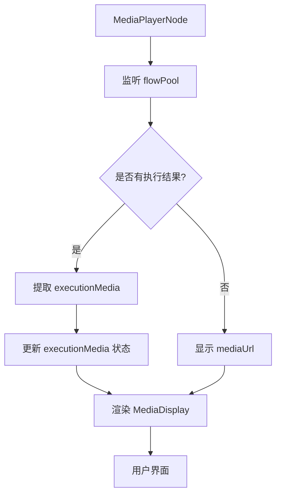
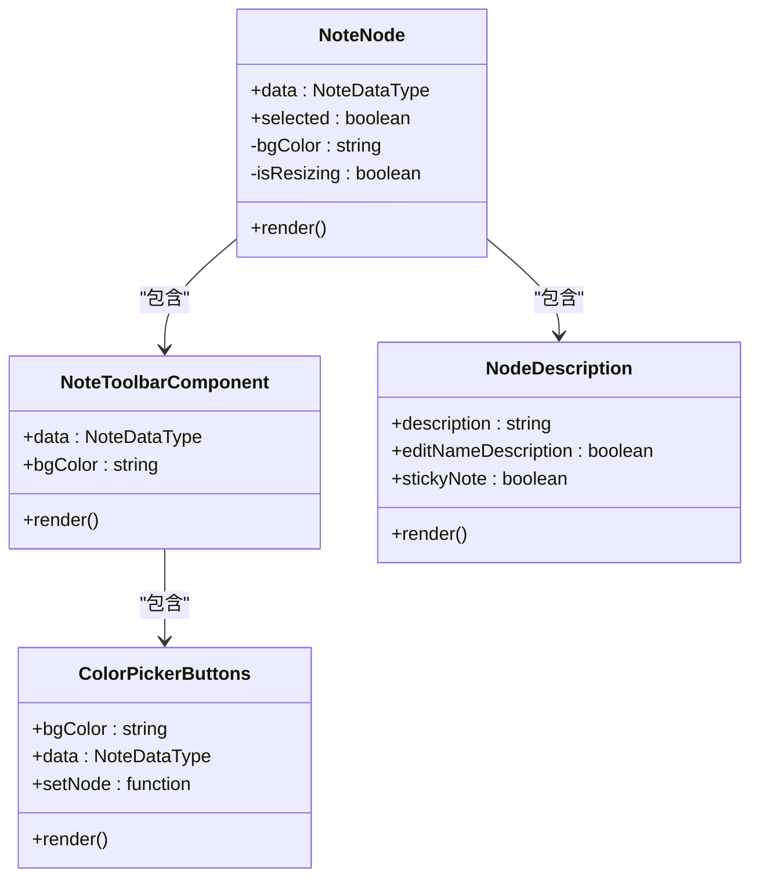
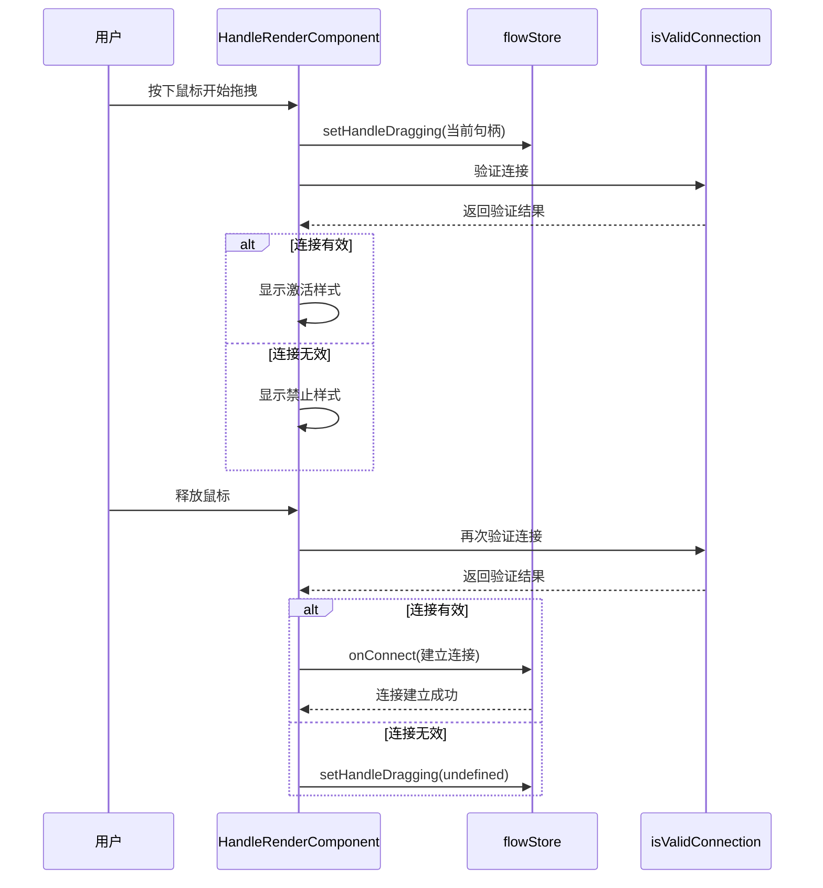

# 节点类型与实现

<cite>
**本文档引用的文件**   
- [GenericNode/index.tsx](file://vibe_surf/frontend/src/CustomNodes/GenericNode/index.tsx)
- [MediaPlayerNode/index.tsx](file://vibe_surf/frontend/src/CustomNodes/MediaPlayerNode/index.tsx)
- [NoteNode/index.tsx](file://vibe_surf/frontend/src/CustomNodes/NoteNode/index.tsx)
- [RenderInputParameters/index.tsx](file://vibe_surf/frontend/src/CustomNodes/GenericNode/components/RenderInputParameters/index.tsx)
- [handleRenderComponent/index.tsx](file://vibe_surf/frontend/src/CustomNodes/GenericNode/components/handleRenderComponent/index.tsx)
- [NoteToolbarComponent/index.tsx](file://vibe_surf/frontend/src/CustomNodes/NoteNode/NoteToolbarComponent/index.tsx)
- [styleUtils.ts](file://vibe_surf/frontend/src/utils/styleUtils.ts)
</cite>

## 目录
1. [介绍](#介绍)
2. [通用节点 (GenericNode)](#通用节点-genericnode)
3. [媒体播放节点 (MediaPlayerNode)](#媒体播放节点-mediaplayernode)
4. [笔记节点 (NoteNode)](#笔记节点-notenode)
5. [连接端口与句柄实现](#连接端口与句柄实现)
6. [状态管理与交互行为](#状态管理与交互行为)
7. [样式与主题定制](#样式与主题定制)
8. [节点扩展与自定义](#节点扩展与自定义)

## 介绍
本文档详细分析了可视化工作流编辑器中的三类核心节点实现：通用节点（GenericNode）、媒体播放节点（MediaPlayerNode）和笔记节点（NoteNode）。这些节点构成了工作流编辑器的基础构建块，每种节点都具有独特的组件结构、属性定义、状态管理和渲染逻辑。文档将深入探讨它们的输入输出端口配置、连接机制、内部交互行为以及样式定制方法，为开发者提供全面的实现参考。

## 通用节点 (GenericNode)

通用节点是工作流编辑器中最基础和最复杂的节点类型，它作为其他所有功能节点的模板和基类。该节点通过高度模块化的组件结构，实现了对各种不同类型组件的统一渲染和管理。

GenericNode 组件接收 `NodeDataType` 类型的 `data` 属性，其中包含了节点的显示名称、图标、模板定义、输入输出参数等核心信息。其状态管理机制围绕 `selected`（选中状态）、`showHiddenOutputs`（隐藏输出显示状态）和 `editNameDescription`（名称/描述编辑模式）等关键状态展开。组件通过 `useFlowStore` 和 `useTypesStore` 等 Zustand 状态管理钩子，与全局应用状态进行深度集成，确保节点状态与工作流状态的实时同步。

在渲染逻辑上，GenericNode 采用条件渲染策略，根据 `showNode` 属性决定是显示精简模式还是完整模式。在完整模式下，它会渲染节点图标、名称、描述、输入参数和输出端口。输入参数的渲染由 `RenderInputParameters` 组件负责，该组件会根据模板定义动态生成相应的输入控件。输出端口则通过 `NodeOutputs` 组件进行渲染，并支持通过 `Handle` 组件实现连接。

**节点来源**
- [GenericNode/index.tsx](file://vibe_surf/frontend/src/CustomNodes/GenericNode/index.tsx#L70-L747)

## 媒体播放节点 (MediaPlayerNode)

媒体播放节点是一个专门用于展示图像和视频内容的节点，它允许用户通过输入 URL 来预览媒体资源，同时也能够显示工作流执行后产生的媒体输出结果。

MediaPlayerNode 组件的核心属性是 `data`，其类型为 `MediaPlayerDataType`，继承自 `NodeDataType`。该节点的关键状态包括 `mediaUrl`（用户输入的媒体 URL）、`executionMedia`（执行结果中的媒体数据）和 `isResizing`（调整大小状态）。状态管理上，它通过 `useFlowStore` 监听 `flowPool` 状态的变化，当工作流执行完成时，自动从执行历史中提取最新的媒体输出并更新 `executionMedia` 状态，从而实现执行结果的实时预览。

该节点的渲染逻辑分为两个主要区域：URL 输入区和媒体显示区。用户可以在输入框中输入图像或视频的 URL，组件会通过 `detectMediaType` 函数自动判断媒体类型。媒体显示区会优先显示 `executionMedia`（执行结果），如果不存在，则显示用户输入的 `mediaUrl`。节点还集成了 `NodeResizer` 组件，允许用户通过拖拽来调整节点的大小，其尺寸变化会通过 `debouncedResize` 函数防抖后，更新到全局的 `flowStore` 中。

**节点来源**
- [MediaPlayerNode/index.tsx](file://vibe_surf/frontend/src/CustomNodes/MediaPlayerNode/index.tsx#L17-L232)

## 笔记节点 (NoteNode)

笔记节点是一个用于记录和展示文本信息的富文本编辑器节点，它支持 Markdown 语法，并提供了颜色选择和工具栏等交互功能。

NoteNode 组件的属性 `data` 同样为 `NodeDataType` 类型。其状态管理机制较为简洁，主要包含 `isResizing`（调整大小状态）和 `editNameDescription`（编辑模式）等状态。节点的背景颜色由 `data.node?.template.backgroundColor` 决定，并通过 `COLOR_OPTIONS` 常量映射到具体的 CSS 颜色值。与 MediaPlayerNode 类似，它也使用 `NodeResizer` 来支持节点尺寸调整。

该节点的渲染逻辑以 `NodeDescription` 组件为核心，提供了一个功能完整的 Markdown 编辑器。当节点被选中时，会渲染一个 `NoteToolbarComponent`，其中包含一个颜色选择器（`ColorPickerButtons`）和一个更多操作菜单。颜色选择器允许用户更改笔记的背景色，其选择结果会通过 `setNode` 函数更新到节点的模板数据中。更多操作菜单则提供了复制、粘贴、删除等常用功能。整个节点的样式会根据背景色动态调整，确保在不同颜色主题下都有良好的可读性。

**节点来源**
- [NoteNode/index.tsx](file://vibe_surf/frontend/src/CustomNodes/NoteNode/index.tsx#L22-L169)
- [NoteToolbarComponent/index.tsx](file://vibe_surf/frontend/src/CustomNodes/NoteNode/NoteToolbarComponent/index.tsx#L22-L166)

## 连接端口与句柄实现

工作流编辑器中的节点连接是通过 React Flow 库的 `Handle` 组件实现的。每个节点的输入和输出端口都被渲染为一个 `Handle`，它定义了连接的类型（source 或 target）、位置（Position）和唯一标识符（id）。

在 `GenericNode` 中，输入端口由 `RenderInputParameters` 组件生成。该组件会遍历节点模板中的所有输入字段，为每个字段创建一个 `NodeInputField`。`NodeInputField` 组件内部使用 `HandleRenderComponent` 来渲染实际的 `Handle`。`HandleRenderComponent` 是一个高度封装的组件，它不仅负责渲染视觉上的句柄圆点，还处理了连接过程中的所有交互逻辑，包括鼠标悬停、拖拽连接、连接验证和连接建立。

`HandleRenderComponent` 通过 `isValidConnection` 函数来验证连接的有效性，确保只有类型匹配的端口才能连接。当用户开始拖拽一个句柄时，组件会通过 `setHandleDragging` 更新全局状态，并实时计算当前连接是否有效。如果有效，句柄会显示为激活状态（通常伴有发光动画）；如果无效，则显示为禁止状态。连接建立后，`onConnect` 回调会被触发，新的边（edge）会被添加到 `flowStore` 中。

**节点来源**
- [handleRenderComponent/index.tsx](file://vibe_surf/frontend/src/CustomNodes/GenericNode/components/handleRenderComponent/index.tsx#L153-L458)
- [RenderInputParameters/index.tsx](file://vibe_surf/frontend/src/CustomNodes/GenericNode/components/RenderInputParameters/index.tsx#L88-L124)

## 状态管理与交互行为

节点的状态管理主要依赖于 Zustand 状态管理库。`useFlowStore` 是核心的状态存储，它维护了工作流中所有节点、边、当前选中项、执行历史（flowPool）等全局状态。各个节点组件通过 `useFlowStore` 的 `useShallow` 选择器来订阅自己关心的状态片段，从而实现高效的、细粒度的状态更新。

例如，`GenericNode` 通过 `useFlowStore` 获取 `edges`、`setNode`、`deleteNode` 和 `takeSnapshot` 等函数，用于管理节点间的连接、更新节点数据、删除节点和创建操作快照。`MediaPlayerNode` 和 `NoteNode` 则通过监听 `flowPool` 的变化来响应工作流的执行结果。

节点的交互行为丰富多样。`GenericNode` 的工具栏提供了更新、删除、编辑名称/描述等操作。`NoteNode` 的工具栏则提供了颜色选择和复制/删除等操作。这些交互行为通常通过 `useCallback` 进行优化，并在回调函数中调用 `flowStore` 提供的更新函数来修改状态。此外，节点还利用 `useHotkeys` 钩子实现了快捷键支持，例如通过快捷键快速更新节点代码。

**节点来源**
- [GenericNode/index.tsx](file://vibe_surf/frontend/src/CustomNodes/GenericNode/index.tsx#L86-L96)
- [MediaPlayerNode/index.tsx](file://vibe_surf/frontend/src/CustomNodes/MediaPlayerNode/index.tsx#L26-L28)
- [NoteNode/index.tsx](file://vibe_surf/frontend/src/CustomNodes/NoteNode/index.tsx#L35-L37)

## 样式与主题定制

节点的样式定制主要通过 Tailwind CSS 和动态 CSS 类名注入来实现。项目使用 `cn` 工具函数来组合和条件化地应用 CSS 类名。例如，在 `GenericNode` 中，节点的宽度会根据 `showNode` 状态动态切换为 `w-80` 或 `w-48`。

主题适配通过 `styleUtils.ts` 文件中的常量和函数来管理。`nodeColors` 和 `nodeColorsName` 对象定义了不同节点类型（如 models, chains, agents）对应的颜色值和颜色名称。`COLOR_OPTIONS` 常量则为 `NoteNode` 提供了预设的背景色选项。`getNodeInputColors` 等辅助函数会根据节点模板中的类型信息，从 `nodeColors` 中查找并返回相应的颜色，从而实现端口颜色的动态匹配。

此外，节点还支持通过 `className` 属性注入自定义 CSS 类名，允许开发者在不修改核心组件的情况下，对节点的外观进行深度定制。例如，`NodeDescription` 组件就接受 `inputClassName` 和 `mdClassName` 等属性，用于分别定制输入框和 Markdown 预览区域的样式。

**节点来源**
- [styleUtils.ts](file://vibe_surf/frontend/src/utils/styleUtils.ts#L85-L188)
- [GenericNode/index.tsx](file://vibe_surf/frontend/src/CustomNodes/GenericNode/index.tsx#L549-L552)
- [NoteNode/index.tsx](file://vibe_surf/frontend/src/CustomNodes/NoteNode/index.tsx#L114-L115)

## 节点扩展与自定义

扩展现有节点类型或创建全新的节点变体，主要通过继承和组合现有组件来实现。开发者可以创建一个新的 `.tsx` 文件，导入 `GenericNode` 或其他基础节点作为模板。

要创建一个全新的节点，首先需要定义其数据结构（可以扩展 `NodeDataType`），然后创建一个 React 组件。该组件应接收 `data` 和 `selected` 作为 props。在组件内部，可以复用 `NodeResizer` 实现尺寸调整，复用 `MediaDisplay` 组件来展示媒体内容，或者直接使用 `Handle` 组件来定义连接端口。

对于需要复杂交互的节点，可以参考 `NoteNode` 的模式，创建一个独立的工具栏组件（如 `NoteToolbarComponent`），并在主节点组件中根据选中状态有条件地渲染它。通过 `useFlowStore`，新节点可以轻松地与全局状态进行交互，例如读取执行结果、更新自身数据或触发工作流操作。

总之，该工作流编辑器的节点系统设计具有高度的模块化和可扩展性，通过组合现有的 UI 组件和状态管理逻辑，开发者可以高效地创建出功能丰富、交互流畅的自定义节点。

**节点来源**
- [GenericNode/index.tsx](file://vibe_surf/frontend/src/CustomNodes/GenericNode/index.tsx)
- [MediaPlayerNode/index.tsx](file://vibe_surf/frontend/src/CustomNodes/MediaPlayerNode/index.tsx)
- [NoteNode/index.tsx](file://vibe_surf/frontend/src/CustomNodes/NoteNode/index.tsx)