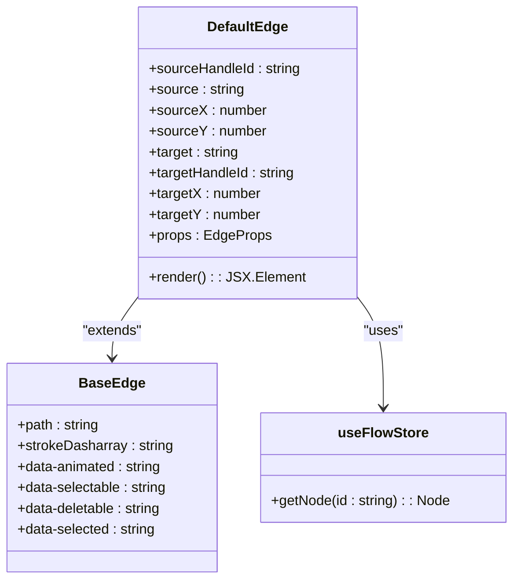
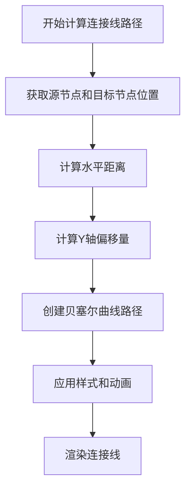
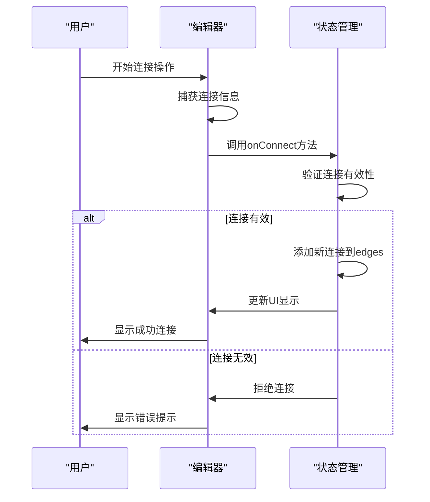
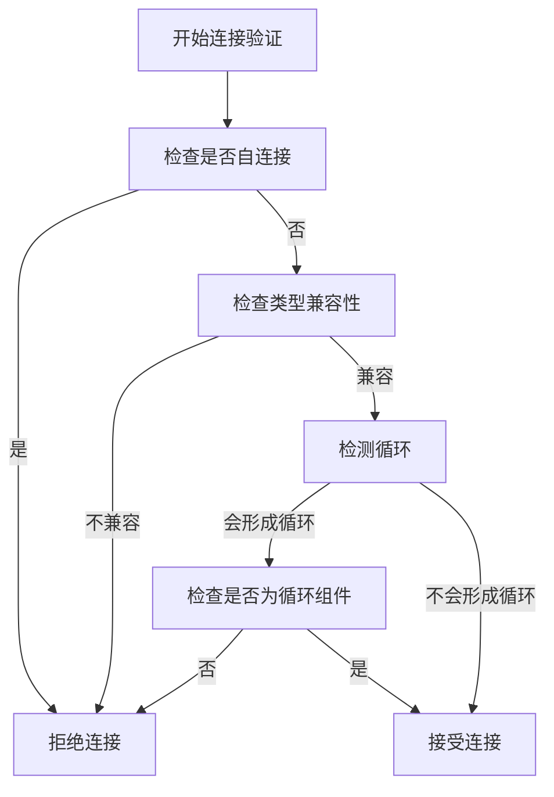
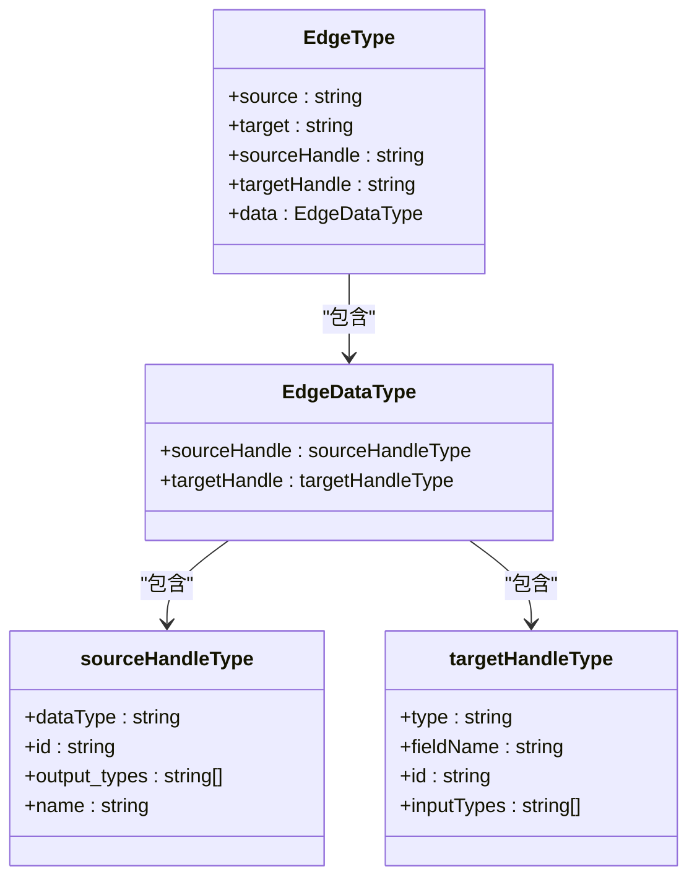
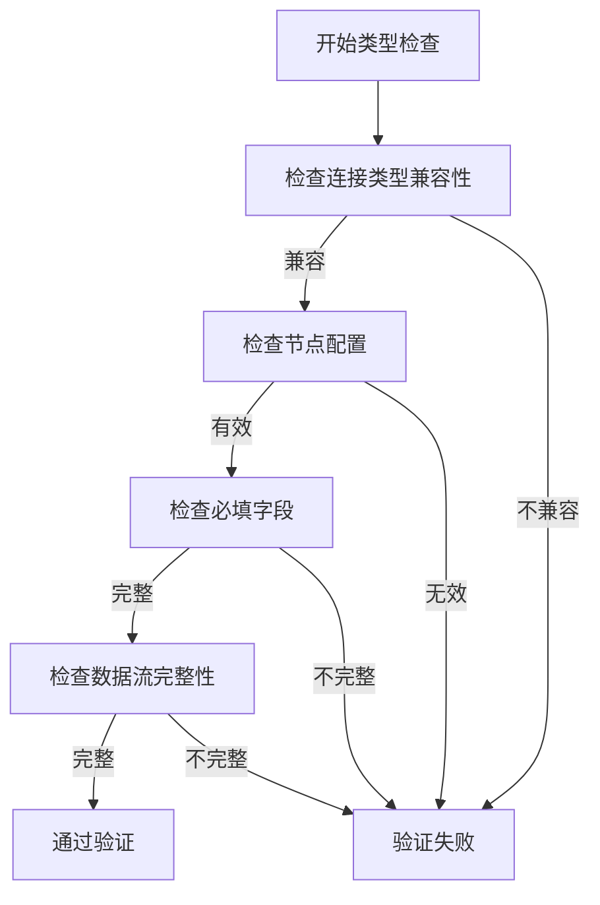
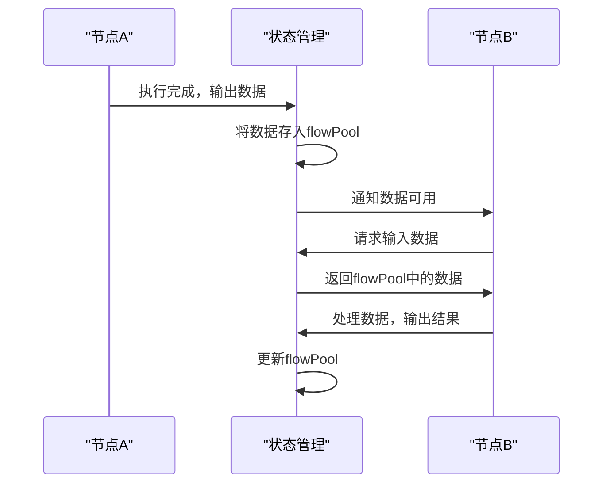
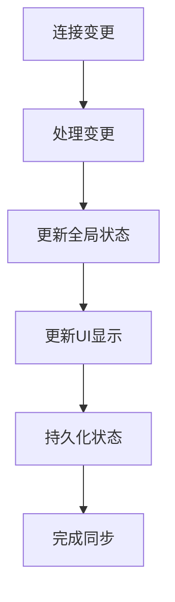
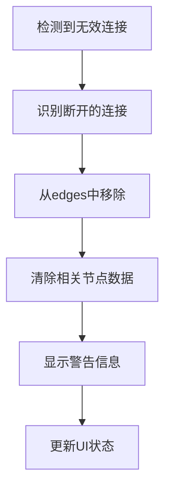

# 连接与数据流

<cite>
**本文档中引用的文件**   
- [index.tsx](file://vibe_surf/frontend/src/CustomEdges/index.tsx)
- [flowStore.ts](file://vibe_surf/frontend/src/stores/flowStore.ts)
- [reactflowUtils.ts](file://vibe_surf/frontend/src/utils/reactflowUtils.ts)
- [constants.ts](file://vibe_surf/frontend/src/constants/constants.ts)
- [flow/index.ts](file://vibe_surf/frontend/src/types/flow/index.ts)
- [zustand/flow/index.ts](file://vibe_surf/frontend/src/types/zustand/flow/index.ts)
</cite>

## 目录
1. [连接机制概述](#连接机制概述)
2. [自定义边实现](#自定义边实现)
3. [连接创建与验证](#连接创建与验证)
4. [数据流管理](#数据流管理)
5. [连接状态同步](#连接状态同步)
6. [错误处理](#错误处理)

## 连接机制概述

可视化工作流编辑器中的连接机制是整个系统的核心，负责管理节点间的连接和数据流。系统通过React Flow库实现可视化编辑功能，并在此基础上扩展了自定义的连接机制。连接机制不仅处理视觉上的连接线，还负责数据类型验证、连接有效性检查和运行时状态管理。

连接机制的主要功能包括：
- 管理节点间的连接创建、修改和删除
- 验证连接的有效性，防止无效连接
- 管理连接的数据流和类型检查
- 维护连接的运行时状态
- 处理连接相关的错误和异常情况

系统通过zustand状态管理库维护全局的连接状态，确保连接信息在不同组件间保持同步。连接数据存储在edges数组中，每个连接对象包含源节点、目标节点、连接句柄和自定义数据等信息。

**Section sources**
- [flowStore.ts](file://vibe_surf/frontend/src/stores/flowStore.ts#L114-L115)
- [flow/index.ts](file://vibe_surf/frontend/src/types/flow/index.ts#L89-L94)

## 自定义边实现

自定义边的实现位于`CustomEdges/index.tsx`文件中，通过扩展React Flow的BaseEdge组件来实现特定的视觉效果和交互逻辑。自定义边不仅提供视觉上的连接线，还包含动画效果和样式控制。



**Diagram sources**
- [index.tsx](file://vibe_surf/frontend/src/CustomEdges/index.tsx#L10-L77)

自定义边的核心功能包括：

### 样式与布局计算
自定义边根据源节点和目标节点的位置动态计算贝塞尔曲线路径。通过调整控制点的距离和Y轴偏移量，实现平滑的连接线效果。代码中使用了复杂的数学计算来确定曲线的形状，确保连接线在不同节点位置下都能保持良好的视觉效果。



**Diagram sources**
- [index.tsx](file://vibe_surf/frontend/src/CustomEdges/index.tsx#L28-L53)

### 动画与交互逻辑
自定义边支持多种动画效果，通过`animated`属性控制连接线的动画状态。当连接处于运行状态时，连接线会显示动画效果，提示用户该连接正在传输数据。此外，连接线还支持选择、删除等交互操作，通过`selectable`和`deletable`属性进行控制。

连接线的样式根据目标句柄的类型动态调整。如果目标句柄包含`output_types`属性，则连接线显示为虚线样式，否则显示为实线。这种视觉区分帮助用户快速识别不同类型的连接。

**Section sources**
- [index.tsx](file://vibe_surf/frontend/src/CustomEdges/index.tsx#L68-L74)
- [flowStore.ts](file://vibe_surf/frontend/src/stores/flowStore.ts#L913-L925)

## 连接创建与验证

连接的创建和验证是确保工作流正确性的关键环节。系统通过严格的验证机制防止无效连接的创建，确保数据流的正确性和完整性。

### 连接创建流程
连接创建通过`onConnect`方法处理，该方法在用户完成连接操作时被调用。系统首先验证连接的有效性，然后将新连接添加到边集合中。



**Diagram sources**
- [flowStore.ts](file://vibe_surf/frontend/src/stores/flowStore.ts#L578-L618)

### 连接验证机制
连接验证通过`isValidConnection`函数实现，该函数检查多个条件确保连接的有效性：

1. **防止自连接**：检查源节点和目标节点是否相同，防止节点自我连接
2. **类型兼容性检查**：验证源节点输出类型与目标节点输入类型是否兼容
3. **循环检测**：检测连接是否会形成循环，防止无限循环
4. **特殊组件处理**：对循环组件等特殊情况进行特殊处理



**Diagram sources**
- [reactflowUtils.ts](file://vibe_surf/frontend/src/utils/reactflowUtils.ts#L371-L471)

### 防止无效连接
系统通过多种机制防止无效连接的创建：

- **相同类型端口限制**：通过类型检查确保源节点输出类型与目标节点输入类型匹配
- **循环连接检测**：使用深度优先搜索算法检测潜在的循环连接
- **高级字段保护**：自动清除高级字段的连接，防止意外连接
- **隐藏字段保护**：过滤隐藏字段的连接，确保连接只在可见字段间建立

系统还定义了输入和输出类型集合，用于识别特殊的输入输出组件，确保工作流的完整性。

```mermaid
classDiagram
class validateEdge {
+e : EdgeType
+nodes : AllNodeType[]
+edges : EdgeType[]
+validateEdge() : Array<string>
}
class validateNodes {
+nodes : AllNodeType[]
+edges : EdgeType[]
+validateNodes() : Array<{id : string, errors : Array<string>}>
}
class validateNode {
+node : AllNodeType
+edges : EdgeType[]
+validateNode() : Array<string>
}
validateEdge --> validateNodes : "调用"
validateNodes --> validateNode : "调用"
```

**Diagram sources**
- [reactflowUtils.ts](file://vibe_surf/frontend/src/utils/reactflowUtils.ts#L711-L723)
- [constants.ts](file://vibe_surf/frontend/src/constants/constants.ts#L678-L696)

**Section sources**
- [reactflowUtils.ts](file://vibe_surf/frontend/src/utils/reactflowUtils.ts#L371-L471)
- [constants.ts](file://vibe_surf/frontend/src/constants/constants.ts#L678-L696)

## 数据流管理

数据流管理是工作流编辑器的核心功能，负责节点间数据的传递、格式定义和运行时验证。系统通过严格的类型系统和数据验证机制确保数据流的正确性和可靠性。

### 数据格式定义
系统通过类型定义文件明确数据流的结构和格式。关键的数据类型包括：

- **EdgeType**: 定义连接的基本结构，包含源节点、目标节点和连接数据
- **EdgeDataType**: 定义连接的自定义数据，包含源句柄和目标句柄信息
- **sourceHandleType**: 定义源句柄的数据结构，包含数据类型、ID和输出类型
- **targetHandleType**: 定义目标句柄的数据结构，包含输入类型、字段名和ID



**Diagram sources**
- [flow/index.ts](file://vibe_surf/frontend/src/types/flow/index.ts#L89-L131)

### 类型检查与运行时验证
系统在运行时执行严格的类型检查，确保数据流的正确性。类型检查包括：

- **静态类型检查**：在连接创建时验证类型兼容性
- **动态类型检查**：在数据传递时验证实际数据类型
- **运行时验证**：在工作流执行时验证节点配置和连接状态

类型检查通过`validateEdge`和`validateNodes`函数实现，这些函数在工作流构建时被调用，确保所有连接和节点都符合预期。



**Diagram sources**
- [reactflowUtils.ts](file://vibe_surf/frontend/src/utils/reactflowUtils.ts#L626-L723)

### 数据传递机制
数据传递通过flowPool机制实现，这是一个全局的状态存储，用于管理节点间传递的数据。每个节点的输出数据存储在flowPool中，后续节点可以从flowPool中读取所需的数据。



**Diagram sources**
- [flowStore.ts](file://vibe_surf/frontend/src/stores/flowStore.ts#L168-L205)

**Section sources**
- [flow/index.ts](file://vibe_surf/frontend/src/types/flow/index.ts#L89-L131)
- [zustand/flow/index.ts](file://vibe_surf/frontend/src/types/zustand/flow/index.ts#L51-L53)

## 连接状态同步

连接状态同步确保工作流编辑器中的连接状态与全局工作流状态保持一致。系统通过状态管理机制实时更新连接状态，反映工作流的当前执行情况。

### 状态管理机制
系统使用zustand作为状态管理库，维护全局的连接状态。关键状态包括：

- **edges**: 存储所有连接对象的数组
- **flowBuildStatus**: 存储每个节点的构建状态
- **verticesBuild**: 存储构建过程中的顶点信息
- **flowPool**: 存储节点间传递的数据

状态更新通过一系列setter方法实现，确保状态变更的可追踪性和一致性。

```mermaid
classDiagram
class FlowStoreType {
+edges : EdgeType[]
+flowBuildStatus : { [key : string] : { status : BuildStatus, timestamp? : string } }
+verticesBuild : { verticesIds : string[], verticesLayers : VertexLayerElementType[][], runId? : string, verticesToRun : string[] } | null
+flowPool : { [key : string] : Array<VertexBuildTypeAPI> }
+setEdges() : void
+updateBuildStatus() : void
+updateVerticesBuild() : void
+updateFlowPool() : void
}
class EdgeType {
+animated : boolean
+className : string
+selected : boolean
}
FlowStoreType --> EdgeType : "包含"
```

**Diagram sources**
- [zustand/flow/index.ts](file://vibe_surf/frontend/src/types/zustand/flow/index.ts#L127-L135)
- [flow/index.ts](file://vibe_surf/frontend/src/types/flow/index.ts#L89-L94)

### 状态同步流程
状态同步通过以下流程实现：

1. **连接变更监听**：监听连接的创建、修改和删除操作
2. **状态更新**：调用相应的setter方法更新全局状态
3. **UI更新**：触发UI重新渲染，反映最新的连接状态
4. **持久化**：在必要时将状态保存到持久化存储



**Diagram sources**
- [flowStore.ts](file://vibe_surf/frontend/src/stores/flowStore.ts#L271-L305)

### 运行时状态管理
系统在工作流执行期间动态更新连接状态，反映当前的执行情况。运行时状态包括：

- **运行中状态**：通过`updateEdgesRunningByNodes`方法标记正在运行的连接
- **构建状态**：通过`updateBuildStatus`方法更新节点的构建状态
- **错误状态**：在发生错误时更新连接状态，显示错误信息

这些状态更新确保用户能够实时了解工作流的执行情况，及时发现和解决问题。

**Section sources**
- [flowStore.ts](file://vibe_surf/frontend/src/stores/flowStore.ts#L912-L927)
- [zustand/flow/index.ts](file://vibe_surf/frontend/src/types/zustand/flow/index.ts#L284-L285)

## 错误处理

错误处理机制确保系统在遇到问题时能够优雅地处理，并向用户提供清晰的反馈。系统通过多层次的错误处理策略，覆盖连接相关的各种异常情况。

### 连接断开处理
当连接断开或无效时，系统执行数据回滚并显示错误提示。主要处理流程包括：

- **检测断开连接**：通过`detectBrokenEdgesEdges`函数检测无效连接
- **清理连接**：通过`cleanEdges`函数移除无效连接
- **显示警告**：通过`BROKEN_EDGES_WARNING`常量显示警告信息
- **数据回滚**：清除受影响节点的数据，防止错误传播



**Diagram sources**
- [reactflowUtils.ts](file://vibe_surf/frontend/src/utils/reactflowUtils.ts#L239-L359)

### 错误提示机制
系统通过多种方式向用户提示错误：

- **连接创建错误**：在连接创建时显示即时错误提示
- **工作流构建错误**：在构建工作流时显示详细的错误列表
- **运行时错误**：在执行过程中显示错误信息和建议

错误信息通过状态管理传递到UI组件，确保错误提示的一致性和及时性。

```mermaid
classDiagram
class useAlertStore {
+setErrorData(title : string, list : string[]) : void
+setNoticeData(title : string) : void
+addNotificationToHistory(title : string, type : string, list : string[]) : void
}
class flowStore {
+buildInfo : { error? : string[], success? : boolean } | null
+setBuildInfo() : void
}
flowStore --> useAlertStore : "使用"
```

**Diagram sources**
- [flowStore.ts](file://vibe_surf/frontend/src/stores/flowStore.ts#L633-L635)
- [flowStore.ts](file://vibe_surf/frontend/src/stores/flowStore.ts#L848-L868)

### 常见错误场景
系统处理以下常见错误场景：

- **无效连接**：源节点输出类型与目标节点输入类型不匹配
- **循环连接**：连接形成无限循环
- **必填字段缺失**：节点的必填字段未设置
- **高级字段连接**：不允许连接的高级字段被连接
- **隐藏字段连接**：隐藏字段被意外连接

每种错误场景都有相应的验证函数和错误处理逻辑，确保系统能够准确识别和处理各种问题。

**Section sources**
- [reactflowUtils.ts](file://vibe_surf/frontend/src/utils/reactflowUtils.ts#L239-L359)
- [flowStore.ts](file://vibe_surf/frontend/src/stores/flowStore.ts#L848-L868)