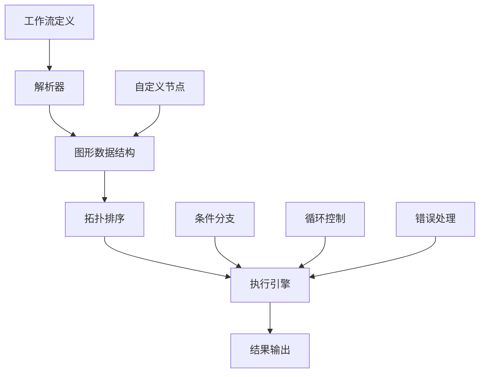
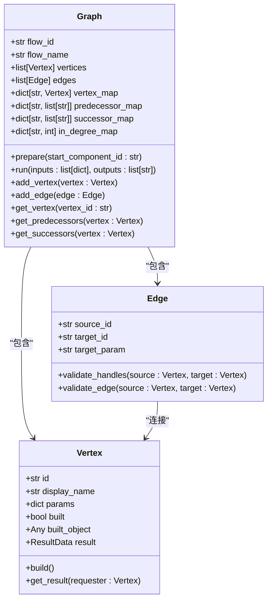
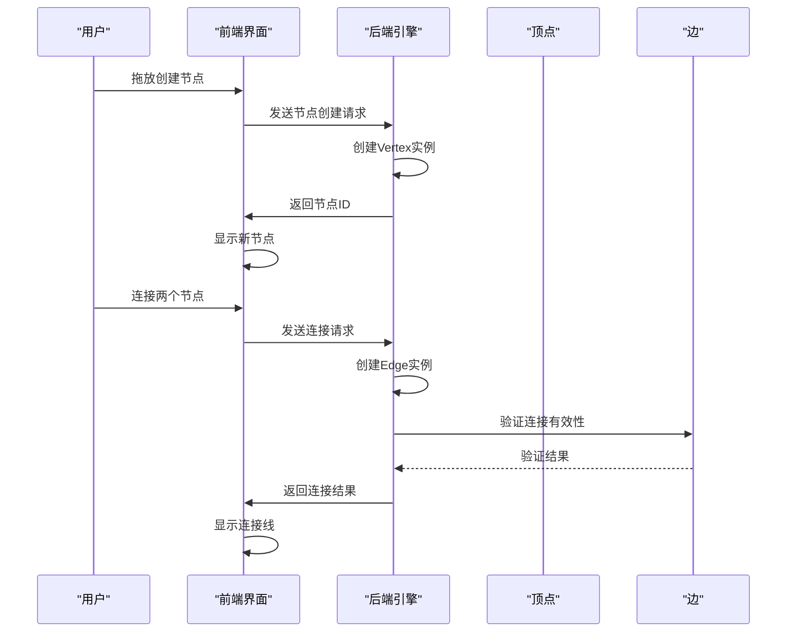
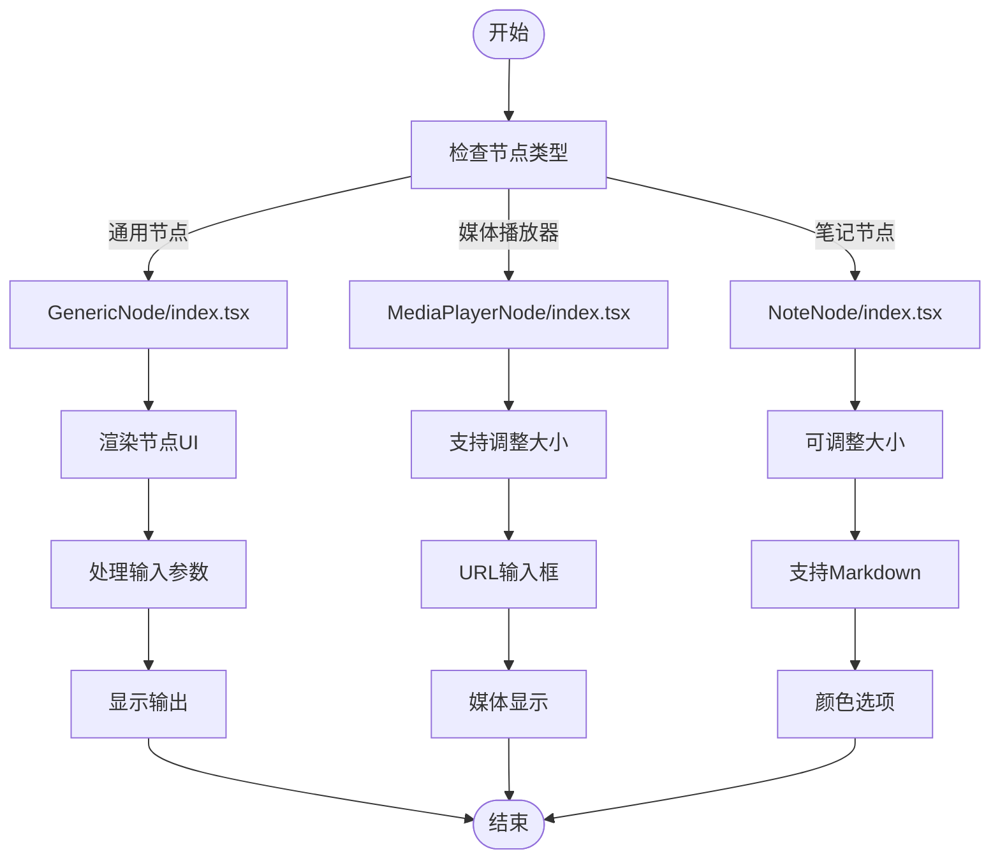
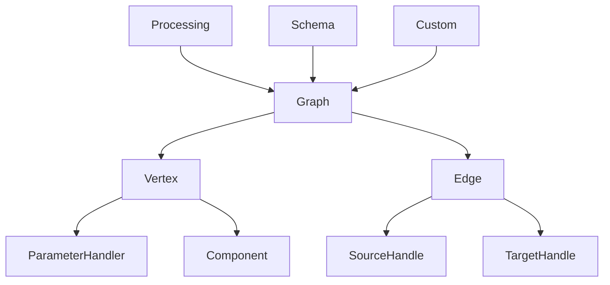

# 工作流引擎

<cite>
**本文档引用的文件**   
- [main.py](file://vibe_surf/langflow/main.py)
- [process.py](file://vibe_surf/langflow/processing/process.py)
- [base.py](file://vibe_surf/langflow/graph/graph/base.py)
- [vertex/base.py](file://vibe_surf/langflow/graph/vertex/base.py)
- [edge/base.py](file://vibe_surf/langflow/graph/edge/base.py)
- [graph.py](file://vibe_surf/langflow/schema/graph.py)
- [GenericNode/index.tsx](file://vibe_surf/frontend/src/CustomNodes/GenericNode/index.tsx)
- [MediaPlayerNode/index.tsx](file://vibe_surf/frontend/src/CustomNodes/MediaPlayerNode/index.tsx)
- [NoteNode/index.tsx](file://vibe_surf/frontend/src/CustomNodes/NoteNode/index.tsx)
- [schema.py](file://vibe_surf/langflow/custom/schema.py)
</cite>

## 目录
1. [引言](#引言)
2. [项目结构](#项目结构)
3. [核心组件](#核心组件)
4. [架构概述](#架构概述)
5. [详细组件分析](#详细组件分析)
6. [依赖分析](#依赖分析)
7. [性能考虑](#性能考虑)
8. [故障排除指南](#故障排除指南)
9. [结论](#结论)

## 引言
VibeSurf的工作流引擎是一个强大的可视化编程系统，允许用户通过拖放式和对话式界面创建复杂的工作流。该引擎基于图形化编程范式，将各种功能组件连接成有向无环图（DAG），实现数据的流动和处理。工作流引擎支持条件分支、循环和错误处理等高级功能，同时提供了版本控制和共享机制，便于团队协作。本文档将全面解析工作流引擎的创建、执行、自定义节点实现以及性能优化策略。

## 项目结构
VibeSurf项目的工作流引擎主要位于`langflow/`目录下，其核心架构由多个相互关联的模块组成。前端自定义节点实现位于`frontend/src/CustomNodes/`目录中，为用户提供直观的交互界面。工作流引擎的核心功能包括图形解析、节点执行、数据流管理等，这些功能分布在不同的模块中协同工作。

```mermaid
graph TD
subgraph "前端界面"
CustomNodes["CustomNodes/"]
GenericNode["GenericNode/"]
MediaPlayerNode["MediaPlayerNode/"]
NoteNode["NoteNode/"]
end
subgraph "工作流引擎"
langflow["langflow/"]
graph["graph/"]
vertex["vertex/"]
edge["edge/"]
processing["processing/"]
schema["schema/"]
custom["custom/"]
end
CustomNodes --> langflow
langflow --> graph
graph --> vertex
graph --> edge
processing --> graph
schema --> graph
custom --> langflow
```

**图源**
- [GenericNode/index.tsx](file://vibe_surf/frontend/src/CustomNodes/GenericNode/index.tsx)
- [MediaPlayerNode/index.tsx](file://vibe_surf/frontend/src/CustomNodes/MediaPlayerNode/index.tsx)
- [NoteNode/index.tsx](file://vibe_surf/frontend/src/CustomNodes/NoteNode/index.tsx)
- [main.py](file://vibe_surf/langflow/main.py)
- [base.py](file://vibe_surf/langflow/graph/graph/base.py)

**节源**
- [main.py](file://vibe_surf/langflow/main.py#L1-L551)
- [GenericNode/index.tsx](file://vibe_surf/frontend/src/CustomNodes/GenericNode/index.tsx#L1-L750)

## 核心组件
工作流引擎的核心组件包括图形管理器（Graph）、顶点（Vertex）和边（Edge）。图形管理器负责整体工作流的组织和执行，顶点代表工作流中的各个功能节点，边则定义了数据在节点间的流动路径。这些组件共同构成了一个完整的可视化编程环境，支持复杂的业务逻辑实现。

**节源**
- [base.py](file://vibe_surf/langflow/graph/graph/base.py#L56-L800)
- [vertex/base.py](file://vibe_surf/langflow/graph/vertex/base.py#L45-L800)
- [edge/base.py](file://vibe_surf/langflow/graph/edge/base.py#L13-L278)

## 架构概述
工作流引擎采用分层架构设计，从底层的数据结构到上层的执行逻辑，各层职责分明。引擎首先解析工作流定义，构建图形数据结构，然后通过拓扑排序确定节点执行顺序，最后逐个执行节点并处理数据流。这种架构确保了工作流的高效执行和良好的可扩展性。



**图源**
- [base.py](file://vibe_surf/langflow/graph/graph/base.py#L485-L488)
- [process.py](file://vibe_surf/langflow/processing/process.py#L26-L62)
- [vertex/base.py](file://vibe_surf/langflow/graph/vertex/base.py#L373-L374)

## 详细组件分析

### 图形管理器分析
图形管理器是工作流引擎的核心，负责管理整个工作流的生命周期。它维护着节点和边的集合，提供节点添加、删除、连接等操作接口，并负责工作流的执行调度。

#### 类图


**图源**
- [base.py](file://vibe_surf/langflow/graph/graph/base.py#L56-L800)

### 顶点与边分析
顶点和边是构成工作流的基本元素。顶点代表具体的功能组件，如数据处理、API调用等；边则定义了数据在顶点间的传递路径，确保工作流的逻辑正确性。

#### 序列图


**图源**
- [vertex/base.py](file://vibe_surf/langflow/graph/vertex/base.py#L45-L800)
- [edge/base.py](file://vibe_surf/langflow/graph/edge/base.py#L13-L278)

### 自定义节点实现
前端的自定义节点实现了丰富的用户交互功能，包括通用节点、媒体播放器节点和笔记节点。这些节点通过React组件实现，提供了直观的配置界面和实时预览功能。

#### 流程图


**图源**
- [GenericNode/index.tsx](file://vibe_surf/frontend/src/CustomNodes/GenericNode/index.tsx#L1-L750)
- [MediaPlayerNode/index.tsx](file://vibe_surf/frontend/src/CustomNodes/MediaPlayerNode/index.tsx#L1-L234)
- [NoteNode/index.tsx](file://vibe_surf/frontend/src/CustomNodes/NoteNode/index.tsx#L1-L172)

**节源**
- [GenericNode/index.tsx](file://vibe_surf/frontend/src/CustomNodes/GenericNode/index.tsx#L1-L750)
- [MediaPlayerNode/index.tsx](file://vibe_surf/frontend/src/CustomNodes/MediaPlayerNode/index.tsx#L1-L234)
- [NoteNode/index.tsx](file://vibe_surf/frontend/src/CustomNodes/NoteNode/index.tsx#L1-L172)

## 依赖分析
工作流引擎的各个组件之间存在紧密的依赖关系。图形管理器依赖于顶点和边的实现，而顶点的执行又依赖于边的连接关系。这种依赖结构确保了工作流的正确执行和数据的有序流动。



**图源**
- [base.py](file://vibe_surf/langflow/graph/graph/base.py#L56-L800)
- [vertex/base.py](file://vibe_surf/langflow/graph/vertex/base.py#L45-L800)
- [edge/base.py](file://vibe_surf/langflow/graph/edge/base.py#L13-L278)

**节源**
- [base.py](file://vibe_surf/langflow/graph/graph/base.py#L56-L800)
- [vertex/base.py](file://vibe_surf/langflow/graph/vertex/base.py#L45-L800)
- [edge/base.py](file://vibe_surf/langflow/graph/edge/base.py#L13-L278)

## 性能考虑
工作流引擎在设计时充分考虑了性能优化。通过懒加载机制减少初始加载时间，使用缓存策略避免重复计算，支持并行执行提高处理效率。此外，引擎还提供了详细的性能监控和调试工具，帮助开发者优化工作流性能。

**节源**
- [main.py](file://vibe_surf/langflow/main.py#L165-L167)
- [process.py](file://vibe_surf/langflow/processing/process.py#L26-L62)
- [vertex/base.py](file://vibe_surf/langflow/graph/vertex/base.py#L373-L374)

## 故障排除指南
当工作流执行出现问题时，可以按照以下步骤进行排查：首先检查节点配置是否正确，然后验证边的连接是否有效，最后查看执行日志获取详细错误信息。对于复杂问题，可以使用调试模式逐步执行工作流，定位问题根源。

**节源**
- [base.py](file://vibe_surf/langflow/graph/graph/base.py#L771-L773)
- [vertex/base.py](file://vibe_surf/langflow/graph/vertex/base.py#L647-L650)
- [process.py](file://vibe_surf/langflow/processing/process.py#L124-L137)

## 结论
VibeSurf的工作流引擎提供了一个强大而灵活的可视化编程平台。通过拖放式和对话式界面，用户可以轻松创建复杂的工作流，实现各种业务逻辑。引擎的模块化设计和丰富的功能特性，使其能够满足不同场景下的需求。未来，可以通过引入更多优化策略和扩展功能，进一步提升工作流引擎的性能和易用性。