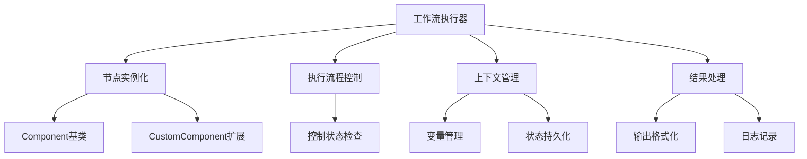
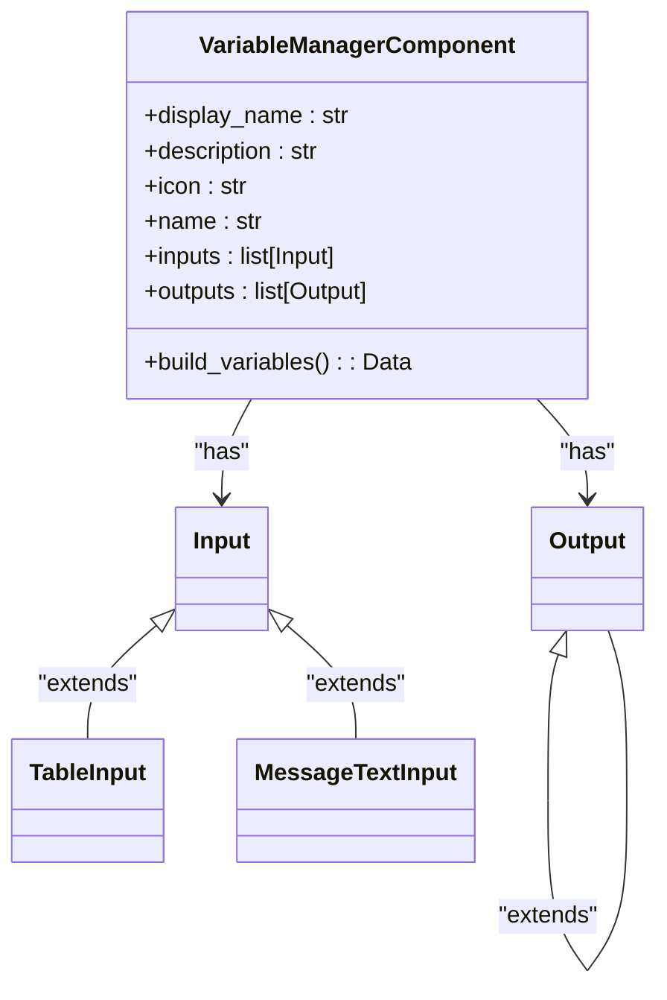
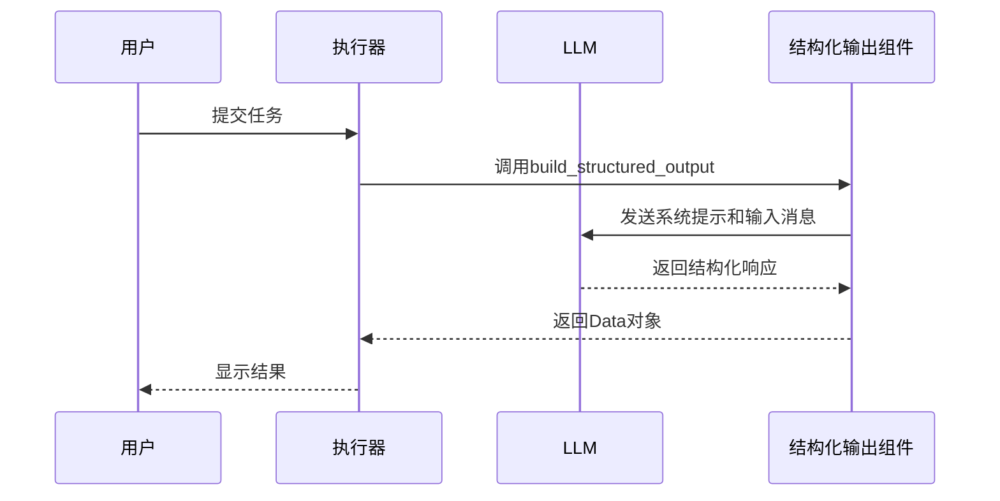
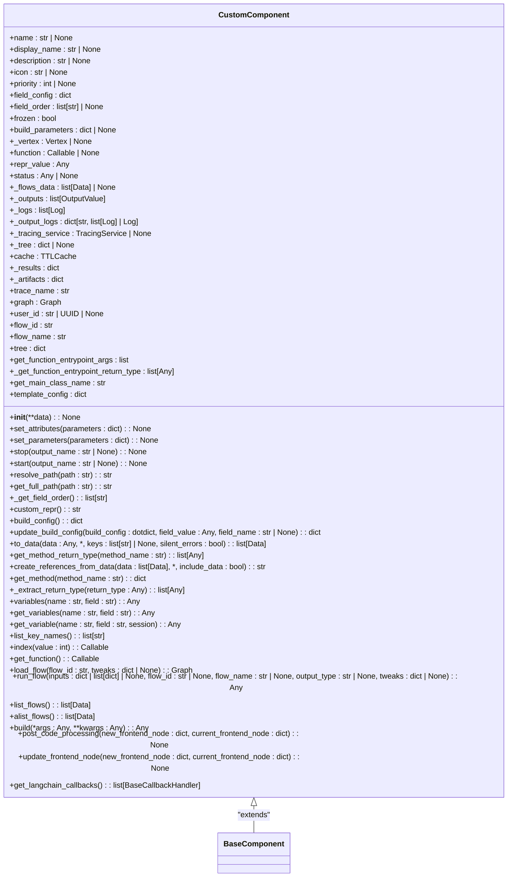
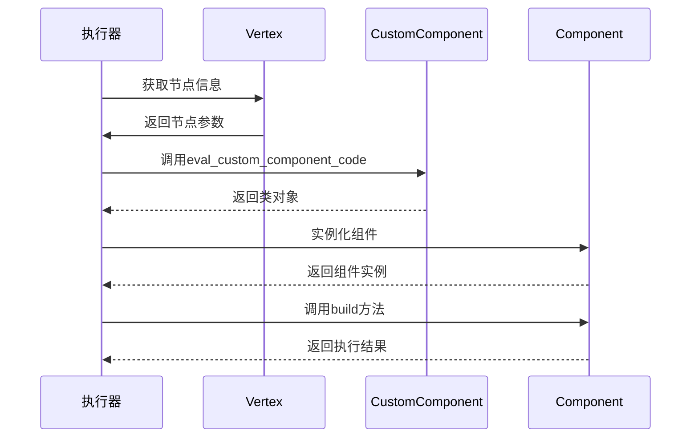

# 工作流执行器

<cite>
**本文档引用的文件**   
- [variable_manager.py](file://vibe_surf/workflows/VibeSurf/variable_manager.py)
- [advanced_search.py](file://vibe_surf/workflows/VibeSurf/advanced_search.py)
- [structured_output.py](file://vibe_surf/workflows/VibeSurf/structured_output.py)
- [select_dataframe.py](file://vibe_surf/workflows/VibeSurf/select_dataframe.py)
- [vibesurf_agent.py](file://vibe_surf/workflows/VibeSurf/vibesurf_agent.py)
- [custom_component.py](file://vibe_surf/langflow/custom/custom_component/custom_component.py)
- [base_component.py](file://vibe_surf/langflow/custom/custom_component/base_component.py)
- [loading.py](file://vibe_surf/langflow/interface/initialize/loading.py)
</cite>

## 目录
1. [引言](#引言)
2. [执行器核心架构](#执行器核心架构)
3. [节点执行机制](#节点执行机制)
4. [执行上下文管理](#执行上下文管理)
5. [输入输出转换与数据验证](#输入输出转换与数据验证)
6. [扩展机制与自定义组件](#扩展机制与自定义组件)
7. [性能监控与调试工具](#性能监控与调试工具)
8. [结论](#结论)

## 引言

工作流执行器是VibeSurf平台的核心组件，负责实例化和执行各种类型的节点，包括LLM节点、工具节点和逻辑节点。执行器通过统一的接口管理执行上下文，处理节点间的输入输出转换，并提供扩展机制支持自定义组件和插件的集成。本文档深入分析工作流执行器的核心实现，详细描述其工作原理和关键特性。

## 执行器核心架构

工作流执行器基于组件化架构设计，通过`Component`基类和`CustomComponent`扩展类实现节点的统一管理。执行器的核心功能包括节点实例化、执行流程控制、上下文管理和结果处理。

**图表来源**
- [custom_component.py](file://vibe_surf/langflow/custom/custom_component/custom_component.py#L36-L553)
- [base_component.py](file://vibe_surf/langflow/custom/custom_component/base_component.py#L27-L119)

## 节点执行机制

工作流执行器通过`build`方法实现节点的执行。每个节点类型都有特定的执行逻辑，执行器根据节点类型调用相应的执行方法。

### LLM节点执行

LLM节点通过`VibeSurfAgentComponent`类实现，负责与语言模型交互并执行任务。执行器通过`run_vibesurf_agent`方法启动LLM节点的执行流程。

**节点来源**
- [vibesurf_agent.py](file://vibe_surf/workflows/VibeSurf/vibesurf_agent.py#L24-L114)

### 工具节点执行

工具节点通过`AdvancedSearchComponent`等类实现，负责执行特定的工具功能。执行器通过`run_advanced_search`等方法启动工具节点的执行流程。

**节点来源**
- [advanced_search.py](file://vibe_surf/workflows/VibeSurf/advanced_search.py#L18-L115)

### 逻辑节点执行

逻辑节点通过`SelectDataComponent`等类实现，负责数据选择和处理。执行器通过`select_data`等方法启动逻辑节点的执行流程。

**节点来源**
- [select_dataframe.py](file://vibe_surf/workflows/VibeSurf/select_dataframe.py#L8-L45)

## 执行上下文管理

执行器通过`VariableManagerComponent`类实现执行上下文的管理，包括变量传递、状态持久化和作用域控制。

### 变量管理

变量管理器通过`build_variables`方法实现变量的创建和更新。支持多种数据类型，包括字符串、整数、浮点数、布尔值、字典和列表。

**图表来源**
- [variable_manager.py](file://vibe_surf/workflows/VibeSurf/variable_manager.py#L18-L141)

### 状态持久化

执行器通过`flowPool`机制实现执行状态的持久化。每个节点的执行结果都会被记录在`flowPool`中，供后续节点使用。

**节点来源**
- [GenericNode/index.tsx](file://vibe_surf/frontend/src/CustomNodes/GenericNode/index.tsx#L367-L381)
- [MediaPlayerNode/index.tsx](file://vibe_surf/frontend/src/CustomNodes/MediaPlayerNode/index.tsx#L68-L83)

## 输入输出转换与数据验证

执行器通过`structured_output.py`文件中的`VibeSurfStructuredOutputComponent`类实现输入输出转换和数据验证。

### 输入输出转换

结构化输出组件通过`build_structured_output`方法实现输入输出转换。支持从非结构化文本中提取结构化数据。

**图表来源**
- [structured_output.py](file://vibe_surf/workflows/VibeSurf/structured_output.py#L24-L154)

### 数据验证

执行器通过Pydantic模型实现数据验证。在执行前对输入数据进行类型检查和格式验证，确保数据的完整性和正确性。

**节点来源**
- [structured_output.py](file://vibe_surf/workflows/VibeSurf/structured_output.py#L130-L135)

## 扩展机制与自定义组件

执行器通过`CustomComponent`基类和`loading.py`中的实例化机制支持自定义组件的集成。

### 自定义组件实现

自定义组件通过继承`CustomComponent`基类实现。组件需要定义`build`方法来实现核心功能。

**图表来源**
- [custom_component.py](file://vibe_surf/langflow/custom/custom_component/custom_component.py#L36-L553)

### 组件实例化

执行器通过`loading.py`文件中的`instantiate_class`和`get_instance_results`函数实现组件的实例化和执行。

**图表来源**
- [loading.py](file://vibe_surf/langflow/interface/initialize/loading.py#L24-L201)

## 性能监控与调试工具

执行器提供多种性能监控和调试工具，帮助开发者诊断和优化工作流执行。

### 执行时间跟踪

执行器通过`log_agent_activity`函数记录每个步骤的执行时间，便于性能分析。

**节点来源**
- [vibe_surf_agent.py](file://vibe_surf/agents/vibe_surf_agent.py#L289-L295)

### 内存使用分析

执行器通过`TTLCache`机制管理内存使用，避免内存泄漏。

**节点来源**
- [custom_component.py](file://vibe_surf/langflow/custom/custom_component/custom_component.py#L97-L99)

### 异常诊断

执行器通过详细的日志记录和异常处理机制，帮助开发者快速定位和解决问题。

**节点来源**
- [vibe_surf_agent.py](file://vibe_surf/agents/vibe_surf_agent.py#L292-L296)

## 结论

工作流执行器通过组件化架构设计，实现了灵活、可扩展的节点执行机制。执行器不仅支持多种类型的节点执行，还提供了完善的上下文管理、数据验证和扩展机制。通过性能监控和调试工具，开发者可以轻松地优化和维护复杂的工作流。执行器的设计体现了模块化、可扩展和易维护的原则，为VibeSurf平台的稳定运行提供了坚实的基础。