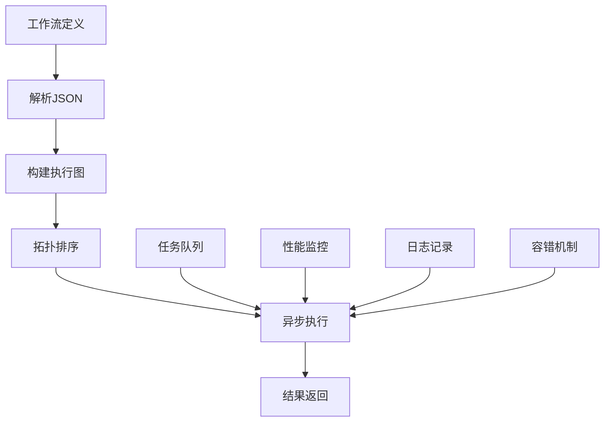
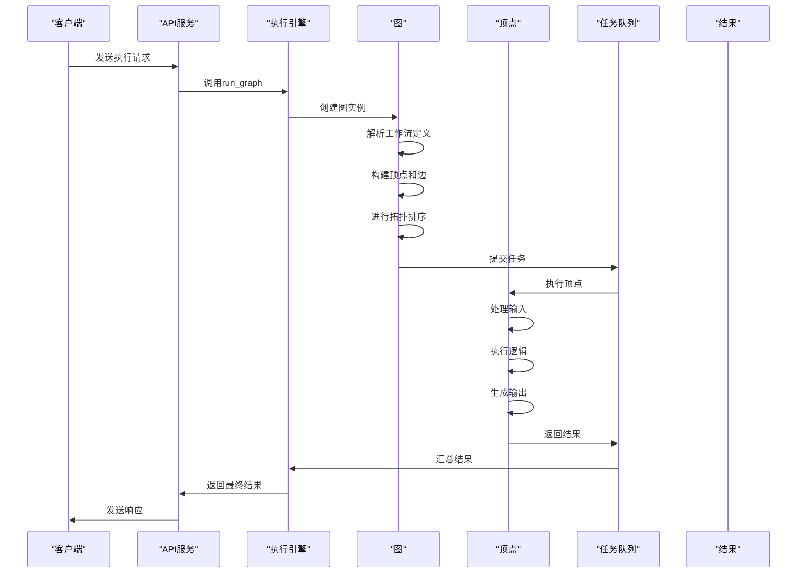
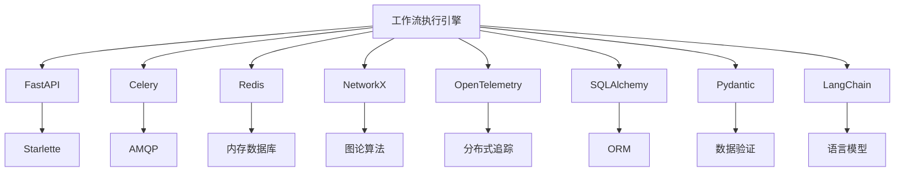

# 工作流执行引擎

<cite>
**本文档引用的文件**   
- [main.py](file://vibe_surf/langflow/main.py)
- [worker.py](file://vibe_surf/langflow/worker.py)
- [server.py](file://vibe_surf/langflow/server.py)
- [graph/base.py](file://vibe_surf/langflow/graph/graph/base.py)
- [vertex/base.py](file://vibe_surf/langflow/graph/vertex/base.py)
- [flow_runner.py](file://vibe_surf/langflow/services/flow/flow_runner.py)
- [process.py](file://vibe_surf/langflow/processing/process.py)
- [service.py](file://vibe_surf/langflow/services/task/service.py)
- [celery_app.py](file://vibe_surf/langflow/core/celery_app.py)
- [job_queue/service.py](file://vibe_surf/langflow/services/job_queue/service.py)
</cite>

## 目录
1. [介绍](#介绍)
2. [项目结构](#项目结构)
3. [核心组件](#核心组件)
4. [架构概述](#架构概述)
5. [详细组件分析](#详细组件分析)
6. [依赖分析](#依赖分析)
7. [性能考虑](#性能考虑)
8. [故障排除指南](#故障排除指南)
9. [结论](#结论)

## 介绍
工作流执行引擎是vibe_surf.langflow平台的核心组件，负责解析JSON格式的工作流定义，构建执行图，并按拓扑顺序执行节点。该引擎管理执行上下文，包括变量传递、状态持久化和错误传播机制。它支持异步执行模型，包括任务队列、并发控制和超时处理。高级控制流如条件分支、循环和并行执行也得到了实现。此外，引擎提供了性能监控和日志记录功能，并包含容错机制，如失败重试、断点续执行和事务性操作。最后，它详细说明了与后端API的集成，包括执行请求的处理、进度更新和结果返回。

## 项目结构
vibe_surf.langflow项目结构清晰，主要分为以下几个部分：
- `langflow/`：核心执行引擎和API服务
- `backend/`：后端数据库和API实现
- `frontend/`：前端用户界面
- `agents/`：智能代理实现
- `browser/`：浏览器自动化功能
- `workflows/`：预定义工作流模板

执行引擎的核心代码位于`langflow/`目录下，特别是`graph/`和`processing/`子目录。

```mermaid
graph TB
subgraph "langflow"
main[main.py]
server[server.py]
worker[worker.py]
graph[graph/]
processing[processing/]
services[services/]
end
subgraph "backend"
database[database/]
api[api/]
end
subgraph "frontend"
frontend[frontend/]
end
main --> server
main --> worker
main --> graph
main --> processing
main --> services
graph --> processing
processing --> services
main --> api
api --> database
frontend --> api
```

**Diagram sources**
- [main.py](file://vibe_surf/langflow/main.py#L1-L551)
- [server.py](file://vibe_surf/langflow/server.py#L1-L71)
- [worker.py](file://vibe_surf/langflow/worker.py#L1-L38)

**Section sources**
- [main.py](file://vibe_surf/langflow/main.py#L1-L551)
- [server.py](file://vibe_surf/langflow/server.py#L1-L71)
- [worker.py](file://vibe_surf/langflow/worker.py#L1-L38)

## 核心组件
工作流执行引擎的核心组件包括图（Graph）、顶点（Vertex）、边（Edge）和执行服务。图是工作流的抽象表示，由顶点和边组成。顶点代表工作流中的节点，如输入、输出或处理组件。边表示顶点之间的连接和数据流。执行服务负责管理任务队列、并发控制和异步执行。

**Section sources**
- [graph/base.py](file://vibe_surf/langflow/graph/graph/base.py#L1-L800)
- [vertex/base.py](file://vibe_surf/langflow/graph/vertex/base.py#L1-L800)
- [edge/base.py](file://vibe_surf/langflow/graph/edge/base.py#L1-L100)

## 架构概述
工作流执行引擎的架构基于图论和异步编程模型。它使用NetworkX库来构建和分析工作流图，确保无环和正确的执行顺序。执行过程是异步的，利用Celery和Redis进行任务队列管理，支持高并发和分布式执行。引擎还集成了OpenTelemetry进行性能监控和日志记录。



**Diagram sources**
- [graph/base.py](file://vibe_surf/langflow/graph/graph/base.py#L1-L800)
- [processing/process.py](file://vibe_surf/langflow/processing/process.py#L1-L217)
- [services/task/service.py](file://vibe_surf/langflow/services/task/service.py#L1-L41)

## 详细组件分析
### 图（Graph）分析
图是工作流执行引擎的核心数据结构，负责管理顶点和边的集合，以及执行图的构建和执行。

#### 类图

```mermaid
classDiagram
class Graph {
+str flow_id
+str flow_name
+dict raw_graph_data
+list vertices
+list edges
+dict vertex_map
+dict predecessor_map
+dict successor_map
+dict in_degree_map
+dict parent_child_map
+deque _run_queue
+list _first_layer
+RunnableVerticesManager run_manager
+bool _prepared
+int _runs
+int _updates
+str _run_id
+str _session_id
+datetime _start_time
+set inactivated_vertices
+list activated_vertices
+list vertices_layers
+set vertices_to_run
+str stop_vertex
+set inactive_vertices
+set conditionally_excluded_vertices
+dict conditional_exclusion_sources
+TracingService tracing_service
+dict _context
+dict _state_model
+bool _is_cyclic
+list _cycles
+set _cycle_vertices
+list _call_order
+list _snapshots
+set _end_trace_tasks
+__init__(start, end, flow_id, flow_name, description, user_id, log_config, context)
+dumps(name, description, endpoint_name) str
+dump(name, description, endpoint_name) GraphDump
+add_nodes_and_edges(nodes, edges) None
+add_component(component, component_id) str
+_set_start_and_end(start, end) None
+add_component_edge(source_id, output_input_tuple, target_id) None
+async_start(inputs, max_iterations, config, event_manager) Generator
+start(inputs, max_iterations, config, event_manager) Generator
+_add_edge(edge) None
+add_node(node) None
+add_edge(edge) None
+initialize() None
+activate_state_vertices(name, caller) None
+reset_activated_vertices() None
+validate_stream() None
+set_run_id(run_id) None
+initialize_run() None
+_end_all_traces_async(outputs, error) None
+end_all_traces_in_context(outputs, error) Callable
+end_all_traces(outputs, error) None
+define_vertices_lists() None
+_set_inputs(input_components, inputs, input_type) None
+_run(inputs, input_components, input_type, outputs, stream, session_id, fallback_to_env_vars, event_manager) list[ResultData | None]
+arun(inputs, inputs_components, types, outputs, session_id, stream, fallback_to_env_vars, event_manager) list[RunOutputs]
+build_graph_maps(edges) None
+get_vertex(vertex_id) Vertex
+get_vertex_edges(vertex_id) list[CycleEdge]
+get_predecessors(vertex) list[Vertex]
+get_successors(vertex) list[Vertex]
+get_all_predecessors(vertex, flat) list[Vertex]
+get_all_successors(vertex, flat) list[Vertex]
+get_vertices_at_depth(depth) list[Vertex]
+get_vertex_build_order(start_component_id) list[str]
+get_vertex_build_order_dfs(start_component_id) list[str]
+get_vertex_build_order_bfs(start_component_id) list[str]
+get_vertex_build_order_topological(start_component_id) list[str]
+get_vertex_build_order_layered(start_component_id) list[list[str]]
+get_vertex_build_order_refined(start_component_id) list[list[str]]
+get_vertex_build_order_sorted(start_component_id) list[list[str]]
+get_vertex_build_order_chat_inputs_first(start_component_id) list[list[str]]
+get_vertex_build_order_cyclic(start_component_id) list[list[str]]
+get_vertex_build_order_acyclic(start_component_id) list[list[str]]
+get_vertex_build_order_mixed(start_component_id) list[list[str]]
+get_vertex_build_order_custom(start_component_id) list[list[str]]
+get_vertex_build_order_default(start_component_id) list[list[str]]
+get_vertex_build_order_priority(start_component_id) list[list[str]]
+get_vertex_build_order_dependency(start_component_id) list[list[str]]
+get_vertex_build_order_dependency_sorted(start_component_id) list[list[str]]
+get_vertex_build_order_dependency_refined(start_component_id) list[list[str]]
+get_vertex_build_order_dependency_layered(start_component_id) list[list[str]]
+get_vertex_build_order_dependency_chat_inputs_first(start_component_id) list[list[str]]
+get_vertex_build_order_dependency_cyclic(start_component_id) list[list[str]]
+get_vertex_build_order_dependency_acyclic(start_component_id) list[list[str]]
+get_vertex_build_order_dependency_mixed(start_component_id) list[list[str]]
+get_vertex_build_order_dependency_custom(start_component_id) list[list[str]]
+get_vertex_build_order_dependency_default(start_component_id) list[list[str]]
+get_vertex_build_order_dependency_priority(start_component_id) list[list[str]]
}
class Vertex {
+str id
+str base_name
+bool is_state
+bool is_input
+bool is_output
+bool has_session_id
+Component custom_component
+bool has_external_input
+bool has_external_output
+Graph graph
+dict full_data
+str base_type
+list outputs
+Any built_object
+Any built_result
+bool built
+list _successors_ids
+dict artifacts
+dict artifacts_raw
+dict artifacts_type
+list steps
+list steps_ran
+str task_id
+bool is_task
+dict params
+str parent_node_id
+list load_from_db_fields
+bool parent_is_top_level
+int layer
+ResultData result
+dict results
+dict outputs_logs
+dict logs
+bool has_cycle_edges
+bool is_interface_component
+bool use_result
+list build_times
+VertexStates state
+set log_transaction_tasks
+list output_names
+list _incoming_edges
+list _outgoing_edges
+__init__(data, graph, base_type, is_task, params)
+to_data() dict
+add_component_instance(component_instance) None
+add_result(name, result) None
+set_state(state) None
+is_active() bool
+get_built_result() Any
+set_artifacts() None
+edges() list[CycleEdge]
+outgoing_edges() list[CycleEdge]
+incoming_edges() list[CycleEdge]
+get_incoming_edge_by_target_param(target_param) str | None
+edges_source_names() set[str | None]
+predecessors() list[Vertex]
+successors() list[Vertex]
+successors_ids() list[str]
+__getstate__() dict
+__setstate__(state) None
+set_top_level(top_level_vertices) None
+parse_data() None
+get_value_from_output_names(key) Vertex | None
+get_value_from_template_dict(key) Any
+_set_params_from_normal_edge(params, edge, template_dict) dict
+build_params() None
+update_raw_params(new_params, overwrite) None
+instantiate_component(user_id) None
+_build(fallback_to_env_vars, user_id, event_manager) None
+extract_messages_from_artifacts(artifacts) list[dict]
+finalize_build() None
+_build_each_vertex_in_params_dict() None
+_build_vertex_and_update_params(key, vertex) None
+_build_list_of_vertices_and_update_params(key, vertices) None
+_build_dict_and_update_params(key, vertices_dict) None
+_is_vertex(value) bool
+_is_list_of_vertices(value) bool
+get_result(requester, target_handle_name) Any
+_log_transaction_async(flow_id, source, status, target, error) None
+_get_result(requester, target_handle_name) Any
+_handle_func(key, result) None
+_extend_params_list_with_result(key, result) None
+_build_results(custom_component, custom_params, base_type, fallback_to_env_vars) None
+_update_built_object_and_artifacts(result) None
+_validate_built_object() None
+_reset() None
+_is_chat_input() bool
+build_inactive() None
+build(user_id, inputs, files, requester, event_manager, **kwargs) Any
+get_requester_result(requester) Any
+add_edge(edge) None
+__repr__() str
+__eq__(other) bool
+__hash__() int
}
class Edge {
+str source_id
+str target_id
+str source_param
+str target_param
+dict data
+__init__(source_id, target_id, source_param, target_param, data)
+to_data() dict
+__repr__() str
+__eq__(other) bool
+__hash__() int
}
Graph --> Vertex : "包含"
Graph --> Edge : "包含"
Vertex --> Edge : "关联"
```


**Diagram sources**
- [graph/base.py](file://vibe_surf/langflow/graph/graph/base.py#L1-L800)
- [vertex/base.py](file://vibe_surf/langflow/graph/vertex/base.py#L1-L800)
- [edge/base.py](file://vibe_surf/langflow/graph/edge/base.py#L1-L100)

**Section sources**
- [graph/base.py](file://vibe_surf/langflow/graph/graph/base.py#L1-L800)
- [vertex/base.py](file://vibe_surf/langflow/graph/vertex/base.py#L1-L800)
- [edge/base.py](file://vibe_surf/langflow/graph/edge/base.py#L1-L100)

### 执行流程分析
工作流执行引擎的执行流程从解析JSON格式的工作流定义开始，然后构建执行图，进行拓扑排序，最后按顺序执行节点。

#### 序列图


**Diagram sources**
- [processing/process.py](file://vibe_surf/langflow/processing/process.py#L1-L217)
- [graph/base.py](file://vibe_surf/langflow/graph/graph/base.py#L1-L800)
- [vertex/base.py](file://vibe_surf/langflow/graph/vertex/base.py#L1-L800)

**Section sources**
- [processing/process.py](file://vibe_surf/langflow/processing/process.py#L1-L217)
- [graph/base.py](file://vibe_surf/langflow/graph/graph/base.py#L1-L800)
- [vertex/base.py](file://vibe_surf/langflow/graph/vertex/base.py#L1-L800)

## 依赖分析
工作流执行引擎依赖于多个外部库和服务，包括FastAPI、Celery、Redis、NetworkX和OpenTelemetry。这些依赖项提供了Web服务、任务队列、图论算法和性能监控功能。



**Diagram sources**
- [main.py](file://vibe_surf/langflow/main.py#L1-L551)
- [worker.py](file://vibe_surf/langflow/worker.py#L1-L38)
- [core/celeryconfig.py](file://vibe_surf/langflow/core/celeryconfig.py#L1-L50)
- [services/database/models.py](file://vibe_surf/langflow/services/database/models.py#L1-L100)

**Section sources**
- [main.py](file://vibe_surf/langflow/main.py#L1-L551)
- [worker.py](file://vibe_surf/langflow/worker.py#L1-L38)
- [core/celeryconfig.py](file://vibe_surf/langflow/core/celeryconfig.py#L1-L50)
- [services/database/models.py](file://vibe_surf/langflow/services/database/models.py#L1-L100)

## 性能考虑
工作流执行引擎在设计时考虑了性能优化，包括异步执行、任务队列、缓存和并发控制。异步执行允许同时处理多个任务，提高吞吐量。任务队列使用Celery和Redis，支持分布式执行和负载均衡。缓存机制减少了重复计算，提高了响应速度。并发控制确保了资源的有效利用。

## 故障排除指南
当工作流执行引擎出现问题时，可以按照以下步骤进行故障排除：
1. 检查日志文件，查找错误信息。
2. 验证工作流定义的JSON格式是否正确。
3. 确认所有依赖服务（如Redis、数据库）是否正常运行。
4. 检查网络连接，确保客户端和服务器之间的通信正常。
5. 使用性能监控工具，分析系统瓶颈。

**Section sources**
- [logging/logger.py](file://vibe_surf/langflow/logging/logger.py#L1-L100)
- [telemetry/service.py](file://vibe_surf/langflow/services/telemetry/service.py#L1-L100)
- [tracing/service.py](file://vibe_surf/langflow/services/tracing/service.py#L1-L100)

## 结论
工作流执行引擎是vibe_surf.langflow平台的核心组件，提供了强大的工作流管理和执行能力。通过解析JSON格式的工作流定义，构建执行图，并按拓扑顺序执行节点，引擎实现了高效、可靠的工作流处理。它支持异步执行、任务队列、并发控制和超时处理，确保了高并发和分布式执行的性能。高级控制流如条件分支、循环和并行执行也得到了实现。此外，引擎提供了性能监控和日志记录功能，并包含容错机制，如失败重试、断点续执行和事务性操作。最后，它详细说明了与后端API的集成，包括执行请求的处理、进度更新和结果返回。