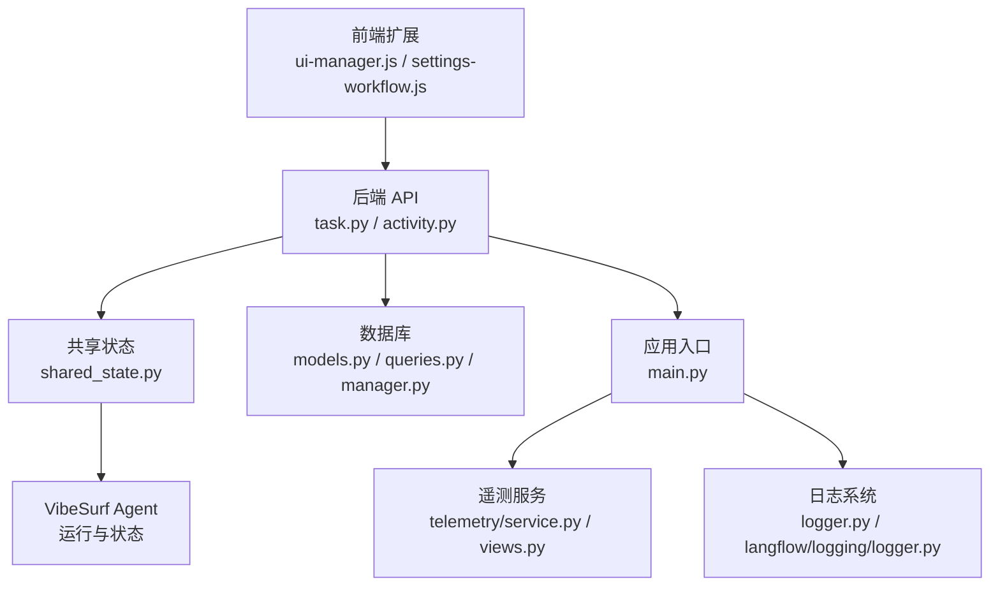
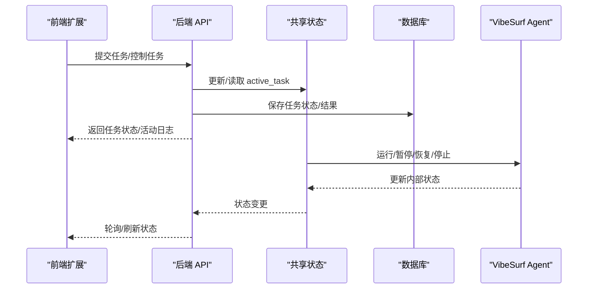
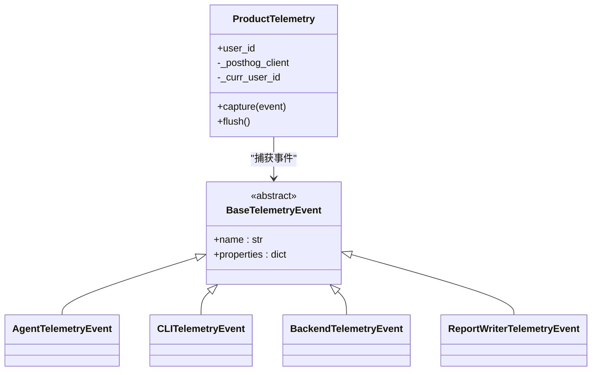
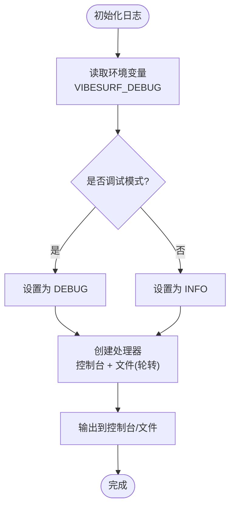
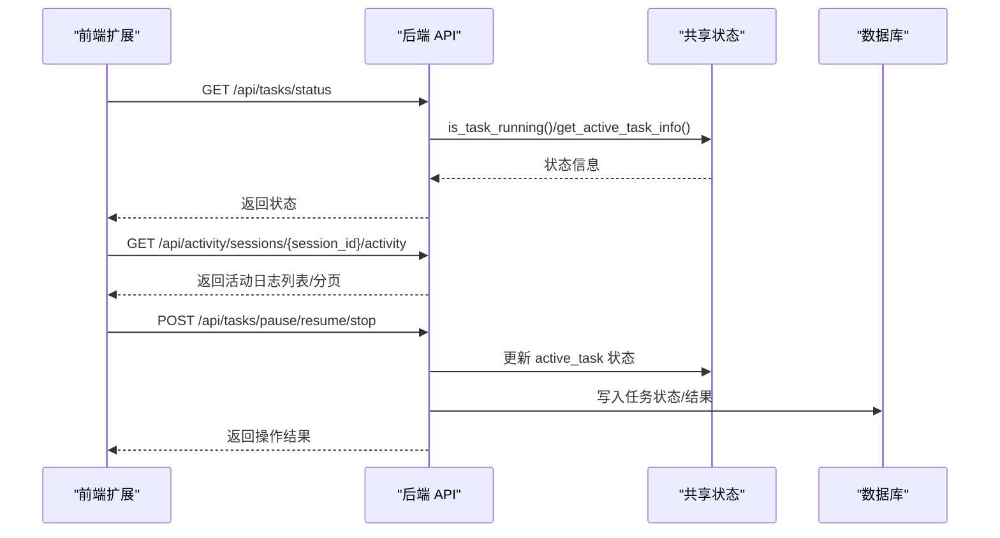
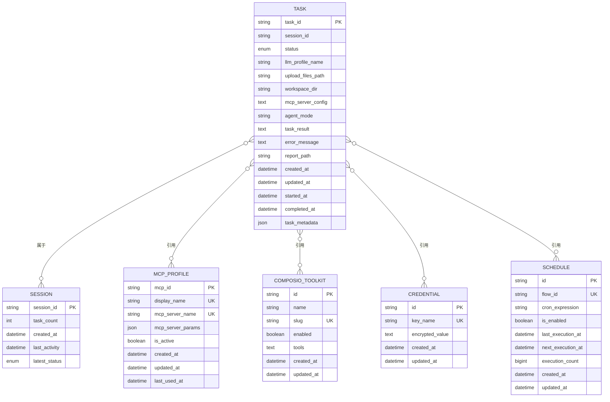
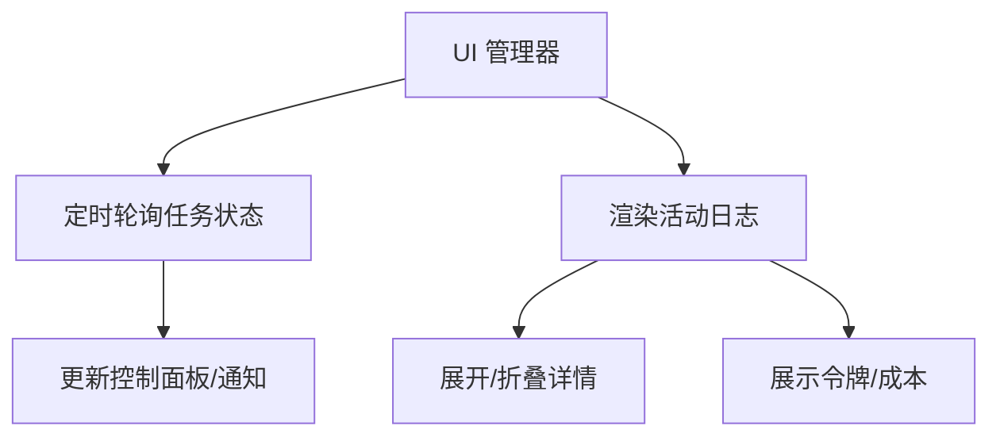
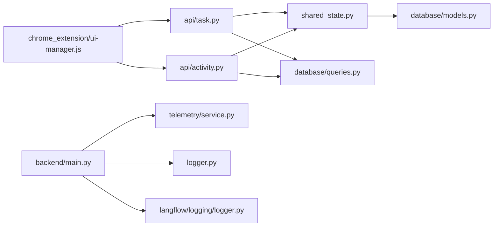

# 工作流监控器

<cite>
**本文引用的文件**
- [vibe_surf/telemetry/service.py](file://vibe_surf/telemetry/service.py)
- [vibe_surf/telemetry/views.py](file://vibe_surf/telemetry/views.py)
- [vibe_surf/backend/api/activity.py](file://vibe_surf/backend/api/activity.py)
- [vibe_surf/backend/api/task.py](file://vibe_surf/backend/api/task.py)
- [vibe_surf/backend/shared_state.py](file://vibe_surf/backend/shared_state.py)
- [vibe_surf/backend/database/models.py](file://vibe_surf/backend/database/models.py)
- [vibe_surf/backend/database/queries.py](file://vibe_surf/backend/database/queries.py)
- [vibe_surf/backend/database/manager.py](file://vibe_surf/backend/database/manager.py)
- [vibe_surf/backend/main.py](file://vibe_surf/backend/main.py)
- [vibe_surf/logger.py](file://vibe_surf/logger.py)
- [vibe_surf/langflow/logging/logger.py](file://vibe_surf/langflow/logging/logger.py)
- [vibe_surf/chrome_extension/scripts/ui-manager.js](file://vibe_surf/chrome_extension/scripts/ui-manager.js)
- [vibe_surf/chrome_extension/scripts/settings-workflow.js](file://vibe_surf/chrome_extension/scripts/settings-workflow.js)
- [vibe_surf/frontend/src/customization/utils/analytics.ts](file://vibe_surf/frontend/src/customization/utils/analytics.ts)
</cite>

## 目录
1. [简介](#简介)
2. [项目结构](#项目结构)
3. [核心组件](#核心组件)
4. [架构总览](#架构总览)
5. [详细组件分析](#详细组件分析)
6. [依赖关系分析](#依赖关系分析)
7. [性能与可扩展性](#性能与可扩展性)
8. [故障排查指南](#故障排查指南)
9. [结论](#结论)
10. [附录：监控数据导出与集成](#附录监控数据导出与集成)

## 简介
本文件系统化文档化“工作流监控器”的功能与实现，覆盖以下方面：
- 指标采集与记录：执行时间、资源使用、错误信息等
- 日志系统：日志级别、格式化、存储策略
- 实时进度更新与状态跟踪：后端状态接口与前端可视化联动
- 数据分析：性能瓶颈识别、错误模式分析、执行模式优化建议
- 导出与集成：监控数据导出、与第三方监控系统对接

## 项目结构
工作流监控器由多层组成：
- 前端扩展（Chrome 扩展）：负责实时日志渲染与用户交互
- 后端 API：提供任务状态、活动日志、会话历史等查询接口
- 共享状态与后台任务：维护当前任务状态、浏览器连接监控、计划任务管理
- 数据库：持久化任务、会话、配置与调度信息
- 日志与遥测：统一日志输出与匿名化遥测事件上报

图表来源
- [vibe_surf/backend/api/task.py](file://vibe_surf/backend/api/task.py#L1-L379)
- [vibe_surf/backend/api/activity.py](file://vibe_surf/backend/api/activity.py#L1-L246)
- [vibe_surf/backend/shared_state.py](file://vibe_surf/backend/shared_state.py#L1-L800)
- [vibe_surf/backend/database/models.py](file://vibe_surf/backend/database/models.py#L1-L289)
- [vibe_surf/backend/database/queries.py](file://vibe_surf/backend/database/queries.py#L1-L800)
- [vibe_surf/backend/database/manager.py](file://vibe_surf/backend/database/manager.py#L1-L319)
- [vibe_surf/backend/main.py](file://vibe_surf/backend/main.py#L1-L794)
- [vibe_surf/telemetry/service.py](file://vibe_surf/telemetry/service.py#L1-L114)
- [vibe_surf/telemetry/views.py](file://vibe_surf/telemetry/views.py#L1-L189)
- [vibe_surf/logger.py](file://vibe_surf/logger.py#L1-L99)
- [vibe_surf/langflow/logging/logger.py](file://vibe_surf/langflow/logging/logger.py#L1-L308)
- [vibe_surf/chrome_extension/scripts/ui-manager.js](file://vibe_surf/chrome_extension/scripts/ui-manager.js#L455-L1527)
- [vibe_surf/chrome_extension/scripts/settings-workflow.js](file://vibe_surf/chrome_extension/scripts/settings-workflow.js#L1943-L2165)

章节来源
- [vibe_surf/backend/main.py](file://vibe_surf/backend/main.py#L1-L794)
- [vibe_surf/backend/api/task.py](file://vibe_surf/backend/api/task.py#L1-L379)
- [vibe_surf/backend/api/activity.py](file://vibe_surf/backend/api/activity.py#L1-L246)
- [vibe_surf/backend/shared_state.py](file://vibe_surf/backend/shared_state.py#L1-L800)
- [vibe_surf/backend/database/models.py](file://vibe_surf/backend/database/models.py#L1-L289)
- [vibe_surf/backend/database/queries.py](file://vibe_surf/backend/database/queries.py#L1-L800)
- [vibe_surf/backend/database/manager.py](file://vibe_surf/backend/database/manager.py#L1-L319)
- [vibe_surf/telemetry/service.py](file://vibe_surf/telemetry/service.py#L1-L114)
- [vibe_surf/telemetry/views.py](file://vibe_surf/telemetry/views.py#L1-L189)
- [vibe_surf/logger.py](file://vibe_surf/logger.py#L1-L99)
- [vibe_surf/langflow/logging/logger.py](file://vibe_surf/langflow/logging/logger.py#L1-L308)
- [vibe_surf/chrome_extension/scripts/ui-manager.js](file://vibe_surf/chrome_extension/scripts/ui-manager.js#L455-L1527)
- [vibe_surf/chrome_extension/scripts/settings-workflow.js](file://vibe_surf/chrome_extension/scripts/settings-workflow.js#L1943-L2165)

## 核心组件
- 遥测服务（匿名化）：通过 PostHog 上报事件，包含用户标识、环境信息、事件类型与属性
- 日志系统：统一控制台与文件日志，支持按日期轮转与调试级别
- 任务与活动 API：提供任务提交、暂停/恢复/停止、状态查询、会话活动日志获取
- 共享状态与后台任务：维护当前任务状态、浏览器连接监控、计划任务管理
- 数据库模型与查询：任务、会话、配置、调度等实体与查询操作
- 前端扩展：实时渲染日志、任务状态监控与 UI 更新

章节来源
- [vibe_surf/telemetry/service.py](file://vibe_surf/telemetry/service.py#L1-L114)
- [vibe_surf/telemetry/views.py](file://vibe_surf/telemetry/views.py#L1-L189)
- [vibe_surf/logger.py](file://vibe_surf/logger.py#L1-L99)
- [vibe_surf/backend/api/task.py](file://vibe_surf/backend/api/task.py#L1-L379)
- [vibe_surf/backend/api/activity.py](file://vibe_surf/backend/api/activity.py#L1-L246)
- [vibe_surf/backend/shared_state.py](file://vibe_surf/backend/shared_state.py#L1-L800)
- [vibe_surf/backend/database/models.py](file://vibe_surf/backend/database/models.py#L1-L289)
- [vibe_surf/backend/database/queries.py](file://vibe_surf/backend/database/queries.py#L1-L800)
- [vibe_surf/chrome_extension/scripts/ui-manager.js](file://vibe_surf/chrome_extension/scripts/ui-manager.js#L455-L1527)

## 架构总览
后端以 FastAPI 应用为中心，通过共享状态与数据库协调任务生命周期；前端扩展通过 API 获取实时状态并渲染日志。

图表来源
- [vibe_surf/backend/api/task.py](file://vibe_surf/backend/api/task.py#L1-L379)
- [vibe_surf/backend/api/activity.py](file://vibe_surf/backend/api/activity.py#L1-L246)
- [vibe_surf/backend/shared_state.py](file://vibe_surf/backend/shared_state.py#L1-L800)
- [vibe_surf/backend/database/queries.py](file://vibe_surf/backend/database/queries.py#L1-L800)
- [vibe_surf/chrome_extension/scripts/ui-manager.js](file://vibe_surf/chrome_extension/scripts/ui-manager.js#L455-L1527)

## 详细组件分析

### 遥测与匿名化事件上报
- 产品遥测服务封装了 PostHog 客户端，支持禁用、用户标识生成、事件捕获与队列刷新
- 事件基类定义了通用属性与 Docker 环境标记，具体事件类型覆盖代理、CLI、后端、报告生成等场景
- 后端在启动/关闭时上报事件，并在异常时记录堆栈摘要

图表来源
- [vibe_surf/telemetry/service.py](file://vibe_surf/telemetry/service.py#L1-L114)
- [vibe_surf/telemetry/views.py](file://vibe_surf/telemetry/views.py#L1-L189)
- [vibe_surf/backend/main.py](file://vibe_surf/backend/main.py#L327-L482)

章节来源
- [vibe_surf/telemetry/service.py](file://vibe_surf/telemetry/service.py#L1-L114)
- [vibe_surf/telemetry/views.py](file://vibe_surf/telemetry/views.py#L1-L189)
- [vibe_surf/backend/main.py](file://vibe_surf/backend/main.py#L327-L482)

### 日志系统与格式化
- 统一日志配置：根据环境变量决定日志级别，同时输出到控制台与按日期轮转的文件
- 结构化日志（Langflow）：支持多种渲染器与日志缓冲，便于检索与导出
- 后端与扩展日志：后端模块使用统一 logger，扩展侧对日志进行增强渲染

图表来源
- [vibe_surf/logger.py](file://vibe_surf/logger.py#L1-L99)
- [vibe_surf/langflow/logging/logger.py](file://vibe_surf/langflow/logging/logger.py#L1-L308)

章节来源
- [vibe_surf/logger.py](file://vibe_surf/logger.py#L1-L99)
- [vibe_surf/langflow/logging/logger.py](file://vibe_surf/langflow/logging/logger.py#L1-L308)

### 实时进度更新与状态跟踪
- 任务状态接口：快速检查是否有活动任务、提交任务、暂停/恢复/停止、追加新任务、获取详细状态
- 活动日志接口：按会话获取活动日志、最新日志、单条日志索引
- 共享状态：维护 active_task 字典，记录任务 ID、会话 ID、状态、开始/结束时间、结果与错误
- 前端 UI：定时轮询任务状态，根据状态切换控制面板、通知与最小可见时长

图表来源
- [vibe_surf/backend/api/task.py](file://vibe_surf/backend/api/task.py#L1-L379)
- [vibe_surf/backend/api/activity.py](file://vibe_surf/backend/api/activity.py#L1-L246)
- [vibe_surf/backend/shared_state.py](file://vibe_surf/backend/shared_state.py#L1-L800)
- [vibe_surf/chrome_extension/scripts/ui-manager.js](file://vibe_surf/chrome_extension/scripts/ui-manager.js#L455-L1527)

章节来源
- [vibe_surf/backend/api/task.py](file://vibe_surf/backend/api/task.py#L1-L379)
- [vibe_surf/backend/api/activity.py](file://vibe_surf/backend/api/activity.py#L1-L246)
- [vibe_surf/backend/shared_state.py](file://vibe_surf/backend/shared_state.py#L1-L800)
- [vibe_surf/chrome_extension/scripts/ui-manager.js](file://vibe_surf/chrome_extension/scripts/ui-manager.js#L455-L1527)

### 数据持久化与查询
- 数据库模型：任务、会话、上传文件、MCP 配置、Composio 工具集、凭据、调度等
- 查询操作：保存任务、更新状态、获取最近任务/会话、统计状态分布、删除任务等
- 数据库管理：SQLite/异步引擎、迁移管理、会话工厂、表创建与关闭

图表来源
- [vibe_surf/backend/database/models.py](file://vibe_surf/backend/database/models.py#L1-L289)
- [vibe_surf/backend/database/queries.py](file://vibe_surf/backend/database/queries.py#L1-L800)
- [vibe_surf/backend/database/manager.py](file://vibe_surf/backend/database/manager.py#L1-L319)

章节来源
- [vibe_surf/backend/database/models.py](file://vibe_surf/backend/database/models.py#L1-L289)
- [vibe_surf/backend/database/queries.py](file://vibe_surf/backend/database/queries.py#L1-L800)
- [vibe_surf/backend/database/manager.py](file://vibe_surf/backend/database/manager.py#L1-L319)

### 前端可视化与交互
- 日志渲染：增强日志条目，支持展开详情、相对时间显示、分类图标
- 任务状态监控：每 500ms 轮询任务状态，动态更新控制面板与通知
- 令牌与成本展示：在消息元数据中显示总 token 数与成本

图表来源
- [vibe_surf/chrome_extension/scripts/ui-manager.js](file://vibe_surf/chrome_extension/scripts/ui-manager.js#L455-L1527)
- [vibe_surf/chrome_extension/scripts/settings-workflow.js](file://vibe_surf/chrome_extension/scripts/settings-workflow.js#L1943-L2165)

章节来源
- [vibe_surf/chrome_extension/scripts/ui-manager.js](file://vibe_surf/chrome_extension/scripts/ui-manager.js#L455-L1527)
- [vibe_surf/chrome_extension/scripts/settings-workflow.js](file://vibe_surf/chrome_extension/scripts/settings-workflow.js#L1943-L2165)

## 依赖关系分析
- 组件耦合
  - API 层依赖共享状态与数据库查询；共享状态依赖 Agent 与工具集；数据库层提供模型与查询
  - 遥测与日志作为横切关注点被多个模块复用
- 外部依赖
  - PostHog（遥测）、SQLite/异步 SQLAlchemy（数据库）、FastAPI（API）、结构化日志（structlog）
- 可能的循环依赖
  - 通过共享状态模块集中管理全局对象，避免直接导入导致循环

图表来源
- [vibe_surf/backend/api/task.py](file://vibe_surf/backend/api/task.py#L1-L379)
- [vibe_surf/backend/api/activity.py](file://vibe_surf/backend/api/activity.py#L1-L246)
- [vibe_surf/backend/shared_state.py](file://vibe_surf/backend/shared_state.py#L1-L800)
- [vibe_surf/backend/database/queries.py](file://vibe_surf/backend/database/queries.py#L1-L800)
- [vibe_surf/backend/database/models.py](file://vibe_surf/backend/database/models.py#L1-L289)
- [vibe_surf/backend/main.py](file://vibe_surf/backend/main.py#L1-L794)
- [vibe_surf/telemetry/service.py](file://vibe_surf/telemetry/service.py#L1-L114)
- [vibe_surf/logger.py](file://vibe_surf/logger.py#L1-L99)
- [vibe_surf/langflow/logging/logger.py](file://vibe_surf/langflow/logging/logger.py#L1-L308)
- [vibe_surf/chrome_extension/scripts/ui-manager.js](file://vibe_surf/chrome_extension/scripts/ui-manager.js#L455-L1527)

## 性能与可扩展性
- 日志轮转与大小限制：避免日志文件无限增长，提升磁盘与 IO 性能
- 异步数据库与连接池：SQLite 使用静态池，其他数据库使用连接池参数优化吞吐
- 任务状态缓存：共享状态中的 active_task 减少频繁查询数据库
- 前端轮询频率：500ms 的轮询在保证实时性的同时降低请求压力
- 遥测事件：仅上报必要字段，避免大体积负载

[本节为通用指导，无需特定文件引用]

## 故障排查指南
- 浏览器连接监控：若浏览器断开，后端触发优雅关闭流程
- 异常处理：API 层捕获未处理异常并返回标准错误响应
- 数据库初始化失败：检查数据库 URL、迁移版本与权限
- 日志无法写入：确认工作空间目录存在且有写权限

章节来源
- [vibe_surf/backend/main.py](file://vibe_surf/backend/main.py#L103-L148)
- [vibe_surf/backend/main.py](file://vibe_surf/backend/main.py#L696-L724)
- [vibe_surf/backend/database/manager.py](file://vibe_surf/backend/database/manager.py#L1-L319)
- [vibe_surf/logger.py](file://vibe_surf/logger.py#L1-L99)

## 结论
工作流监控器通过“遥测 + 日志 + API + 共享状态 + 数据库 + 前端扩展”的组合，实现了从任务生命周期到前端可视化的完整闭环。其设计强调：
- 实时性：任务状态与活动日志的低延迟获取
- 可观测性：统一日志与匿名化遥测事件
- 可维护性：清晰的模块边界与依赖关系
- 可扩展性：异步数据库、结构化日志与可插拔的遥测后端

[本节为总结，无需特定文件引用]

## 附录：监控数据导出与集成

### 指标采集与记录
- 执行时间：任务开始/结束时间、状态变更时间戳
- 资源使用：前端扩展侧展示 token 与成本，后端可通过外部指标系统（如 Prometheus/OpenTelemetry）扩展
- 错误信息：异常堆栈摘要、错误消息、状态码与上下文

章节来源
- [vibe_surf/backend/database/models.py](file://vibe_surf/backend/database/models.py#L94-L137)
- [vibe_surf/backend/database/queries.py](file://vibe_surf/backend/database/queries.py#L441-L754)
- [vibe_surf/backend/shared_state.py](file://vibe_surf/backend/shared_state.py#L118-L233)
- [vibe_surf/chrome_extension/scripts/ui-manager.js](file://vibe_surf/chrome_extension/scripts/ui-manager.js#L1814-L1828)

### 日志系统架构与策略
- 日志级别：由环境变量控制，调试模式下输出更详细信息
- 格式化：控制台与文件采用一致的时间戳与模块名格式
- 存储策略：按日期轮转，保留多份备份，避免单文件过大

章节来源
- [vibe_surf/logger.py](file://vibe_surf/logger.py#L1-L99)
- [vibe_surf/langflow/logging/logger.py](file://vibe_surf/langflow/logging/logger.py#L1-L308)

### 实时进度与状态跟踪
- 后端接口：任务状态、活动日志、会话历史
- 前端联动：定时轮询、UI 状态切换、日志增强渲染

章节来源
- [vibe_surf/backend/api/task.py](file://vibe_surf/backend/api/task.py#L1-L379)
- [vibe_surf/backend/api/activity.py](file://vibe_surf/backend/api/activity.py#L1-L246)
- [vibe_surf/chrome_extension/scripts/ui-manager.js](file://vibe_surf/chrome_extension/scripts/ui-manager.js#L455-L1527)

### 数据分析与优化建议
- 性能瓶颈识别：结合任务耗时、状态分布与活动日志定位慢步骤
- 错误模式分析：聚合异常堆栈摘要，识别重复错误与失败路径
- 执行模式优化：基于任务统计与会话历史，建议调整 LLM 配置、工具集与并发策略

章节来源
- [vibe_surf/backend/database/queries.py](file://vibe_surf/backend/database/queries.py#L737-L754)
- [vibe_surf/backend/api/activity.py](file://vibe_surf/backend/api/activity.py#L1-L246)
- [vibe_surf/backend/shared_state.py](file://vibe_surf/backend/shared_state.py#L1-L800)

### 导出与第三方监控系统集成
- 导出方式
  - 任务与会话历史：通过 API 获取 JSON 数据，用于离线分析或报表
  - 日志导出：从工作空间 logs 目录导出当日日志文件
  - 遥测事件：通过 PostHog 控制台查看与导出事件数据
- 第三方集成
  - 结构化日志：Langflow 日志配置支持 JSON 渲染器，便于接入 ELK/Splunk
  - 指标系统：可扩展 OpenTelemetry 或 Prometheus 抓取后端指标
  - 前端埋点：前端 analytics 工具可扩展为自定义埋点 SDK

章节来源
- [vibe_surf/backend/api/activity.py](file://vibe_surf/backend/api/activity.py#L1-L246)
- [vibe_surf/backend/main.py](file://vibe_surf/backend/main.py#L1-L794)
- [vibe_surf/langflow/logging/logger.py](file://vibe_surf/langflow/logging/logger.py#L1-L308)
- [vibe_surf/frontend/src/customization/utils/analytics.ts](file://vibe_surf/frontend/src/customization/utils/analytics.ts#L1-L24)