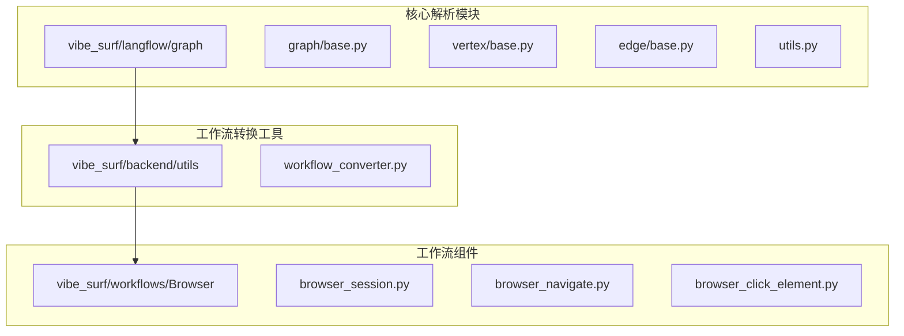
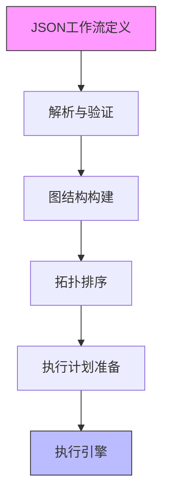
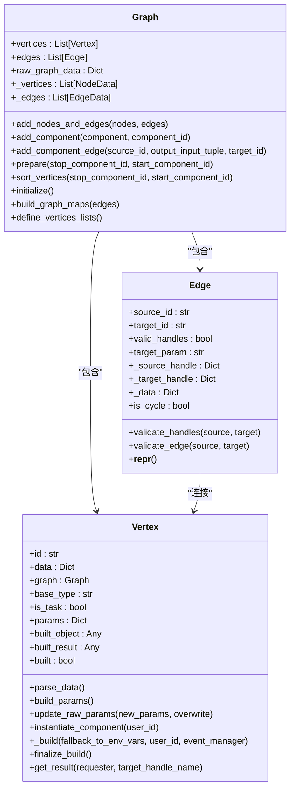
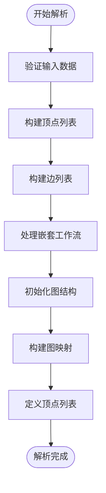
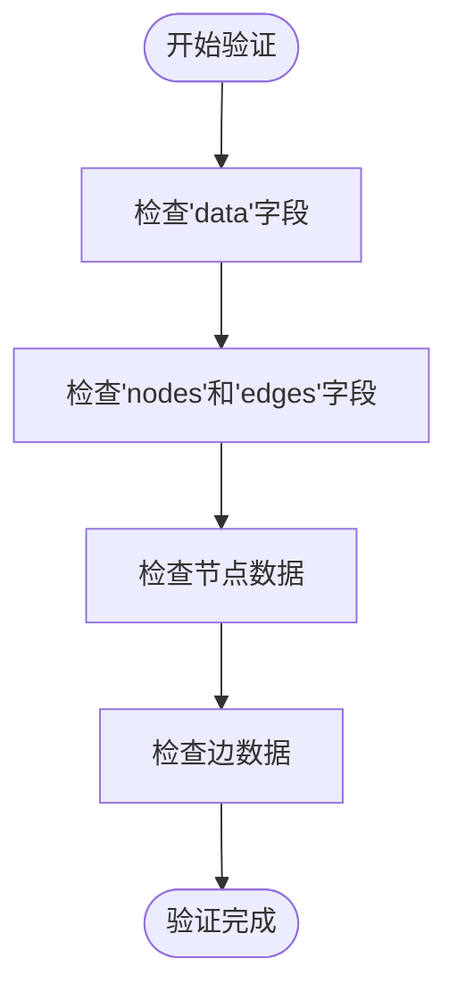
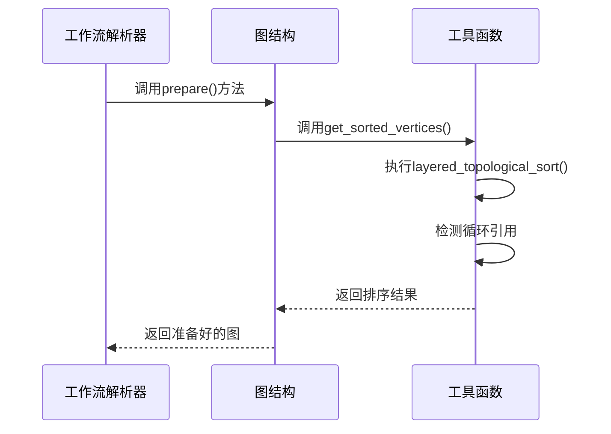
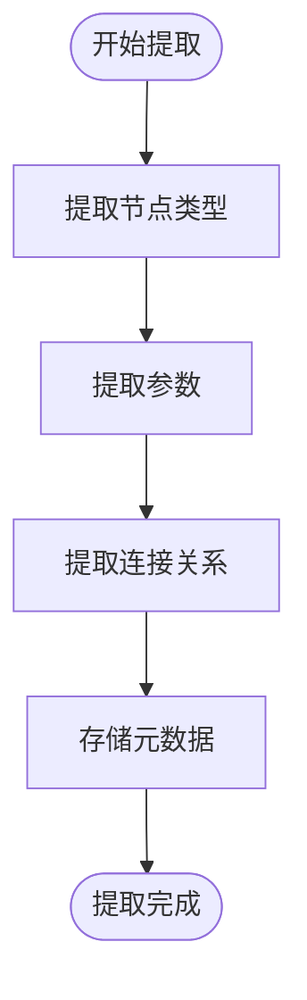
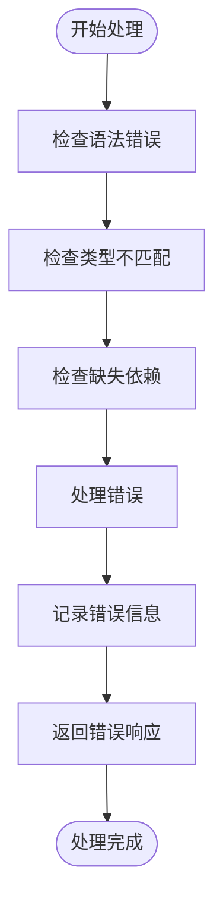
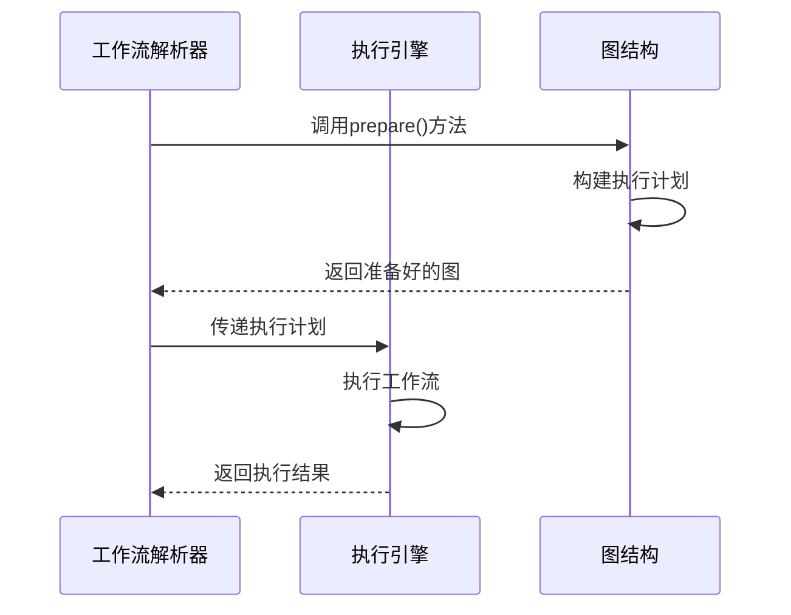
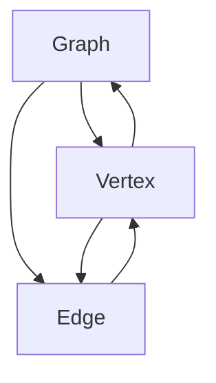

# 工作流解析器

<cite>
**本文档引用的文件**
- [workflow_converter.py](file://vibe_surf/backend/utils/workflow_converter.py)
- [base.py](file://vibe_surf/langflow/graph/graph/base.py)
- [vertex/base.py](file://vibe_surf/langflow/graph/vertex/base.py)
- [edge/base.py](file://vibe_surf/langflow/graph/edge/base.py)
- [utils.py](file://vibe_surf/langflow/graph/graph/utils.py)
</cite>

## 目录
1. [简介](#简介)
2. [项目结构](#项目结构)
3. [核心组件](#核心组件)
4. [架构概述](#架构概述)
5. [详细组件分析](#详细组件分析)
6. [依赖分析](#依赖分析)
7. [性能考虑](#性能考虑)
8. [故障排除指南](#故障排除指南)
9. [结论](#结论)
10. [附录](#附录)（如有必要）

## 简介
工作流解析器是VibeSurf系统的核心组件，负责将JSON格式的工作流定义转换为内部图结构。该解析器实现了完整的验证机制，确保工作流的完整性和正确性，同时处理循环引用和无效连接等复杂情况。解析器从工作流定义中提取元数据，包括节点类型、参数和连接关系，并为后续执行阶段准备执行计划。本文档详细说明了工作流解析器的实现细节，包括其解析过程、验证机制、错误处理策略以及与执行引擎的接口设计。

## 项目结构
项目结构显示了工作流解析器相关的文件分布在多个目录中。核心解析逻辑位于`vibe_surf/langflow/graph`目录下，而工作流转换工具位于`vibe_surf/backend/utils`目录。浏览器相关的工作流组件则位于`vibe_surf/workflows/Browser`目录。

**图源**
- [base.py](file://vibe_surf/langflow/graph/graph/base.py)
- [workflow_converter.py](file://vibe_surf/backend/utils/workflow_converter.py)
- [browser_session.py](file://vibe_surf/workflows/Browser/browser_session.py)

**节源**
- [workflow_converter.py](file://vibe_surf/backend/utils/workflow_converter.py)
- [base.py](file://vibe_surf/langflow/graph/graph/base.py)

## 核心组件
工作流解析器的核心组件包括图结构（Graph）、顶点（Vertex）和边（Edge）三个主要类。图结构负责管理整个工作流的拓扑结构，顶点代表工作流中的各个节点，边则表示节点之间的连接关系。解析器通过这些组件将JSON格式的工作流定义转换为可执行的内部图结构。

**节源**
- [base.py](file://vibe_surf/langflow/graph/graph/base.py)
- [vertex/base.py](file://vibe_surf/langflow/graph/vertex/base.py)
- [edge/base.py](file://vibe_surf/langflow/graph/edge/base.py)

## 架构概述
工作流解析器采用分层架构设计，从JSON解析到内部图结构构建，再到执行计划准备，每个阶段都有明确的职责划分。解析器首先验证工作流定义的完整性，然后构建图结构，最后进行拓扑排序以确定执行顺序。

**图源**
- [base.py](file://vibe_surf/langflow/graph/graph/base.py)
- [utils.py](file://vibe_surf/langflow/graph/graph/utils.py)

## 详细组件分析
### 图结构分析
图结构是工作流解析器的核心，负责管理所有顶点和边的集合，并提供图遍历、拓扑排序等基本操作。

#### 类图

**图源**
- [base.py](file://vibe_surf/langflow/graph/graph/base.py)
- [vertex/base.py](file://vibe_surf/langflow/graph/vertex/base.py)
- [edge/base.py](file://vibe_surf/langflow/graph/edge/base.py)

#### 解析过程
工作流解析器的解析过程从`add_nodes_and_edges`方法开始，该方法接收JSON格式的节点和边数据，将其转换为内部图结构。

**图源**
- [base.py](file://vibe_surf/langflow/graph/graph/base.py)

**节源**
- [base.py](file://vibe_surf/langflow/graph/graph/base.py)

### 验证机制分析
工作流解析器实现了多层次的验证机制，确保工作流的完整性和正确性。

#### 完整性验证
解析器首先验证工作流定义的基本完整性，确保必要的字段存在。

**图源**
- [base.py](file://vibe_surf/langflow/graph/graph/base.py)

#### 循环引用处理
解析器使用拓扑排序算法检测和处理循环引用，确保工作流可以正确执行。

**图源**
- [base.py](file://vibe_surf/langflow/graph/graph/base.py)
- [utils.py](file://vibe_surf/langflow/graph/graph/utils.py)

**节源**
- [base.py](file://vibe_surf/langflow/graph/graph/base.py)
- [utils.py](file://vibe_surf/langflow/graph/graph/utils.py)

### 元数据提取分析
解析器从工作流定义中提取各种元数据，包括节点类型、参数和连接关系。

#### 元数据提取流程

**图源**
- [vertex/base.py](file://vibe_surf/langflow/graph/vertex/base.py)

**节源**
- [vertex/base.py](file://vibe_surf/langflow/graph/vertex/base.py)

### 错误处理机制分析
工作流解析器实现了完善的错误处理机制，能够处理各种异常情况。

#### 错误处理流程

**图源**
- [base.py](file://vibe_surf/langflow/graph/graph/base.py)
- [vertex/base.py](file://vibe_surf/langflow/graph/vertex/base.py)
- [edge/base.py](file://vibe_surf/langflow/graph/edge/base.py)

**节源**
- [base.py](file://vibe_surf/langflow/graph/graph/base.py)
- [vertex/base.py](file://vibe_surf/langflow/graph/vertex/base.py)
- [edge/base.py](file://vibe_surf/langflow/graph/edge/base.py)

### 与执行引擎的接口设计
工作流解析器与执行引擎通过标准化的接口进行交互，为后续执行阶段准备执行计划。

#### 接口交互流程

**图源**
- [base.py](file://vibe_surf/langflow/graph/graph/base.py)

**节源**
- [base.py](file://vibe_surf/langflow/graph/graph/base.py)

## 依赖分析
工作流解析器的组件之间存在明确的依赖关系。图结构依赖于顶点和边，而顶点和边又依赖于图结构来维护它们之间的关系。

**图源**
- [base.py](file://vibe_surf/langflow/graph/graph/base.py)
- [vertex/base.py](file://vibe_surf/langflow/graph/vertex/base.py)
- [edge/base.py](file://vibe_surf/langflow/graph/edge/base.py)

**节源**
- [base.py](file://vibe_surf/langflow/graph/graph/base.py)
- [vertex/base.py](file://vibe_surf/langflow/graph/vertex/base.py)
- [edge/base.py](file://vibe_surf/langflow/graph/edge/base.py)

## 性能考虑
工作流解析器在设计时考虑了性能优化，特别是在处理大型工作流时。解析器使用了缓存机制来避免重复计算，并采用了高效的图遍历算法。

## 故障排除指南
当工作流解析失败时，可以按照以下步骤进行故障排除：
1. 检查JSON格式是否正确
2. 验证节点和边的定义是否完整
3. 检查是否存在循环引用
4. 确认所有依赖项都已正确配置

**节源**
- [base.py](file://vibe_surf/langflow/graph/graph/base.py)
- [vertex/base.py](file://vibe_surf/langflow/graph/vertex/base.py)
- [edge/base.py](file://vibe_surf/langflow/graph/edge/base.py)

## 结论
工作流解析器是VibeSurf系统的关键组件，它成功地将JSON格式的工作流定义转换为可执行的内部图结构。通过完善的验证机制、错误处理策略和与执行引擎的标准化接口，解析器确保了工作流的可靠执行。未来的工作可以进一步优化解析性能，并扩展支持更多类型的工作流定义。