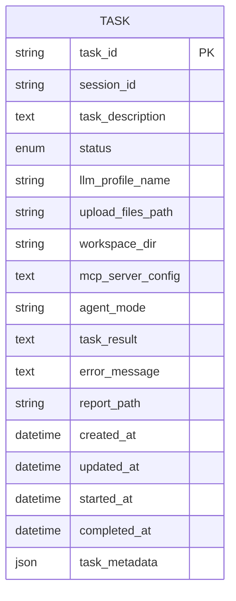
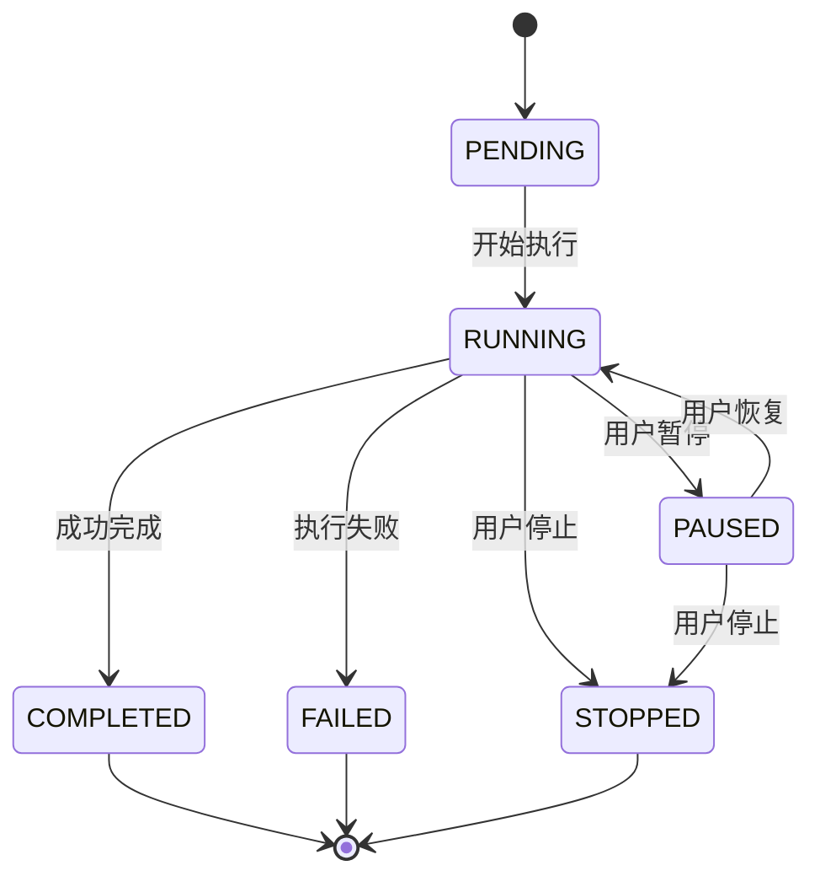
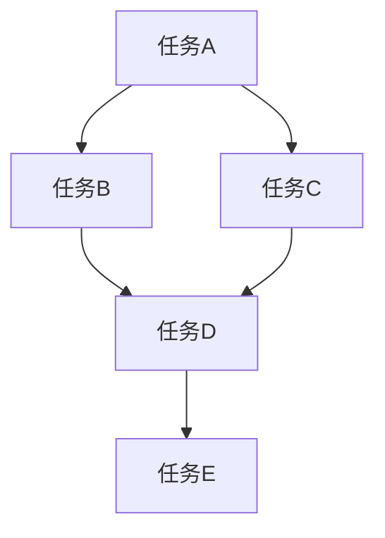
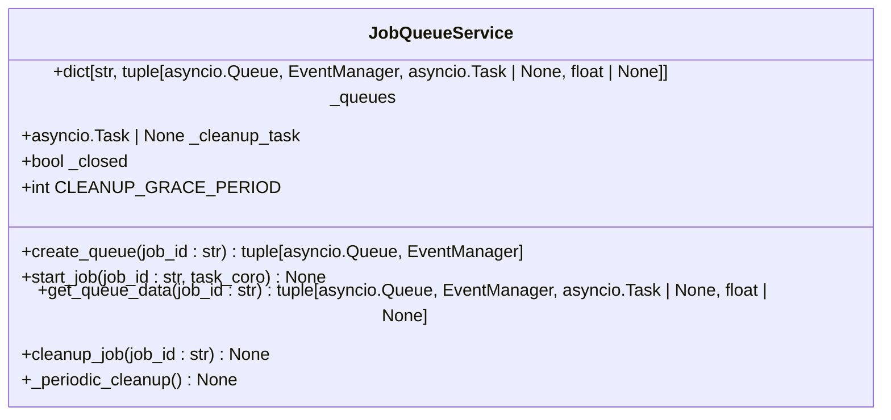
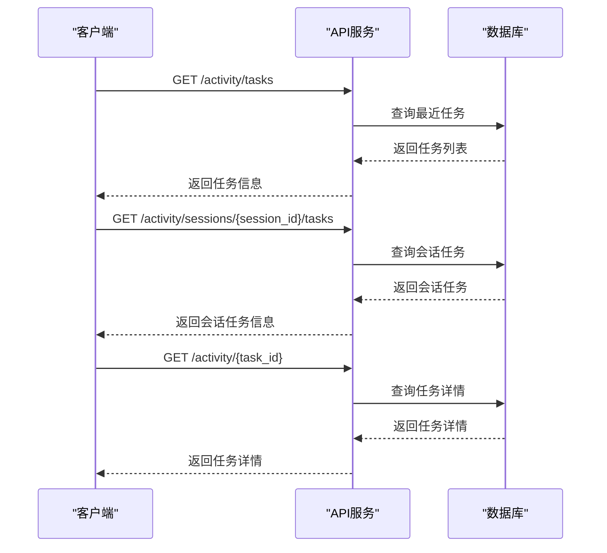
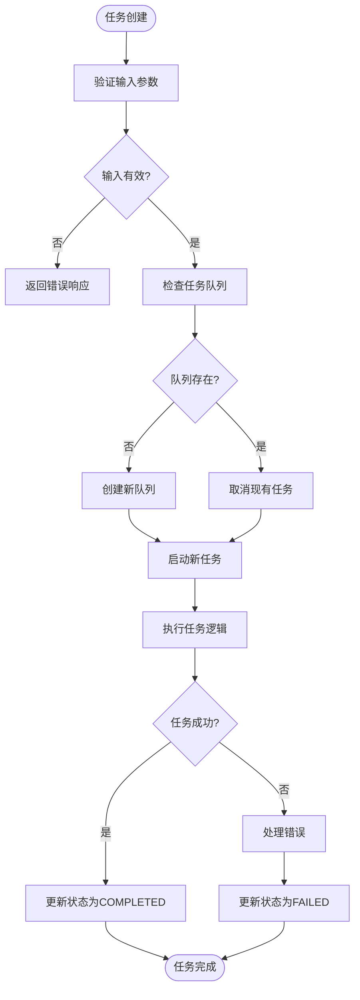

# 任务管理

<cite>
**本文档引用的文件**   
- [task.py](file://vibe_surf/backend/api/task.py)
- [models.py](file://vibe_surf/backend/database/models.py)
- [queries.py](file://vibe_surf/backend/database/queries.py)
- [base.py](file://vibe_surf/langflow/graph/graph/base.py)
- [utils.py](file://vibe_surf/langflow/graph/graph/utils.py)
- [service.py](file://vibe_surf/langflow/services/job_queue/service.py)
- [anyio.py](file://vibe_surf/langflow/services/task/backends/anyio.py)
- [activity.py](file://vibe_surf/backend/api/activity.py)
- [api-client.js](file://vibe_surf/chrome_extension/scripts/api-client.js)
- [ui-manager.js](file://vibe_surf/chrome_extension/scripts/ui-manager.js)
</cite>

## 目录
1. [任务创建与元数据结构](#任务创建与元数据结构)
2. [任务状态管理与生命周期](#任务状态管理与生命周期)
3. [任务依赖关系与拓扑排序](#任务依赖关系与拓扑排序)
4. [任务队列与优先级调度](#任务队列与优先级调度)
5. [任务监控与查询接口](#任务监控与查询接口)
6. [任务执行流程](#任务执行流程)

## 任务创建与元数据结构

任务管理系统的核心是`Task`模型，它定义了任务的元数据结构。每个任务都包含一个唯一的任务ID、会话ID、任务描述、LLM配置、文件上传路径、工作空间目录、MCP服务器配置、代理模式、任务结果、错误消息、报告路径以及各种时间戳和附加元数据。



**图源**
- [models.py](file://vibe_surf/backend/database/models.py#L94-L136)

**任务元数据结构包括：**
- **任务ID (task_id)**: 任务的唯一标识符，使用UUID生成。
- **会话ID (session_id)**: 关联任务到特定用户会话。
- **任务描述 (task_description)**: 任务的文本描述。
- **状态 (status)**: 任务当前状态，包括pending、running、paused、completed、failed、stopped。
- **LLM配置 (llm_profile_name)**: 引用LLM配置文件的名称。
- **输入输出数据**: 通过`upload_files_path`和`workspace_dir`管理输入文件和工作空间。
- **执行日志**: 通过`task_result`、`error_message`和`report_path`记录执行结果和日志。
- **时间戳**: 记录任务的创建、更新、开始和完成时间。

**节源**
- [models.py](file://vibe_surf/backend/database/models.py#L94-L136)

## 任务状态管理与生命周期

任务状态管理是任务调度器的核心功能，确保任务按照预定义的生命周期进行转换。系统定义了六种状态：PENDING（待处理）、RUNNING（运行中）、PAUSED（已暂停）、COMPLETED（已完成）、FAILED（失败）和STOPPED（已停止）。



**图源**
- [models.py](file://vibe_surf/backend/database/models.py#L17-L24)
- [queries.py](file://vibe_surf/backend/database/queries.py#L614-L647)

状态转换由`TaskQueries.update_task_status`方法管理，该方法根据新状态自动更新`started_at`和`completed_at`时间戳。当状态变为"running"时，`started_at`被设置为当前时间；当状态变为"completed"、"failed"或"stopped"时，`completed_at`被设置为当前时间。

任务的生命周期从PENDING状态开始，当任务被调度执行时进入RUNNING状态。在运行过程中，任务可以被用户暂停（PAUSED）或停止（STOPPED），也可以因错误而失败（FAILED），或成功完成（COMPLETED）。

**节源**
- [models.py](file://vibe_surf/backend/database/models.py#L17-L24)
- [queries.py](file://vibe_surf/backend/database/queries.py#L614-L647)

## 任务依赖关系与拓扑排序

任务调度器使用有向无环图（DAG）来表示任务之间的依赖关系，并通过拓扑排序算法确定任务的执行顺序，确保前置任务完成后才执行后续任务。



**图源**
- [base.py](file://vibe_surf/langflow/graph/graph/base.py)
- [utils.py](file://vibe_surf/langflow/graph/graph/utils.py)

系统使用`layered_topological_sort`函数实现分层拓扑排序算法。该算法首先计算每个顶点的入度，然后将入度为0的顶点加入队列。算法逐层处理顶点，每处理一个顶点就将其所有后继顶点的入度减1，当后继顶点的入度变为0时将其加入下一层的处理队列。

```python
def layered_topological_sort(
    vertices_ids: set[str],
    in_degree_map: dict[str, int],
    successor_map: dict[str, list[str]],
    predecessor_map: dict[str, list[str]],
    start_id: str | None = None,
    cycle_vertices: set[str] | None = None,
    is_input_vertex: Callable[[str], bool] | None = None,
    *,
    is_cyclic: bool = False,
) -> list[list[str]]:
    # 初始化入度为0的顶点队列
    queue = deque(
        vertex_id
        for vertex_id in vertices_ids
        if in_degree_map[vertex_id] == 0
    )
    
    layers: list[list[str]] = []
    visited = set()
    cycle_counts = dict.fromkeys(vertices_ids, 0)
    current_layer = 0
    
    # 逐层处理顶点
    while queue:
        layers.append([])
        layer_size = len(queue)
        for _ in range(layer_size):
            vertex_id = queue.popleft()
            if vertex_id not in visited or (is_cyclic and cycle_counts[vertex_id] < MAX_CYCLE_APPEARANCES):
                if vertex_id not in visited:
                    visited.add(vertex_id)
                cycle_counts[vertex_id] += 1
                layers[current_layer].append(vertex_id)
            
            # 更新后继顶点的入度
            for neighbor in successor_map[vertex_id]:
                if neighbor not in vertices_ids:
                    continue
                in_degree_map[neighbor] -= 1
                if in_degree_map[neighbor] == 0:
                    queue.append(neighbor)
        
        current_layer += 1
    
    return [layer for layer in layers if layer]
```

该算法还支持循环图的处理，通过`MAX_CYCLE_APPEARANCES`限制循环顶点的最大出现次数，防止无限循环。

**节源**
- [utils.py](file://vibe_surf/langflow/graph/graph/utils.py#L461-L602)

## 任务队列与优先级调度

任务队列系统使用`JobQueueService`来管理任务的入队和出队机制，确保任务按照优先级和依赖关系进行调度。



**图源**
- [service.py](file://vibe_surf/langflow/services/job_queue/service.py)

`JobQueueService`为每个任务创建一个独立的异步队列和事件管理器。任务通过`create_queue`方法创建队列，通过`start_job`方法启动异步任务。系统还实现了周期性清理机制，自动清理已完成或取消的任务。

任务优先级调度策略通过`PRIORITY_LIST_OF_INPUTS`实现，优先处理特定类型的任务：

```python
PRIORITY_LIST_OF_INPUTS = ["webhook", "chat"]

def find_start_component_id(vertices, *, is_webhook: bool = False):
    """根据输入类型的优先级列表查找组件ID。"""
    priority_inputs = ["webhook"] if is_webhook else PRIORITY_LIST_OF_INPUTS
    
    for input_type_str in priority_inputs:
        component_id = next((vertex_id for vertex_id in vertices if input_type_str in vertex_id.lower()), None)
        if component_id:
            return component_id
    return None
```

该策略确保Webhook和聊天任务优先于其他类型的任务执行。

**节源**
- [service.py](file://vibe_surf/langflow/services/job_queue/service.py)
- [utils.py](file://vibe_surf/langflow/graph/graph/utils.py#L12-L30)

## 任务监控与查询接口

系统提供了丰富的任务监控和查询接口，允许用户获取任务执行进度和结果。

### 任务状态查询接口



**图源**
- [activity.py](file://vibe_surf/backend/api/activity.py)
- [queries.py](file://vibe_surf/backend/database/queries.py)

### 任务状态监控接口

前端通过`api-client.js`和`ui-manager.js`实现任务状态的实时监控：

```javascript
// 检查任务状态
async checkTaskRunning() {
    try {
        const status = await this.getTaskStatus();
        
        const hasActiveTask = status.has_active_task;
        const activeTask = status.active_task;
        
        if (!hasActiveTask || !activeTask) {
            return { isRunning: false, taskInfo: null };
        }
        
        // 检查任务是否处于"运行中"状态
        const runningStates = ['running', 'submitted', 'paused'];
        const taskStatus = activeTask.status || '';
        const isRunning = runningStates.includes(taskStatus.toLowerCase());
        
        return {
            isRunning,
            taskInfo: hasActiveTask ? activeTask : null
        };
    } catch (error) {
        console.error('[API] Failed to check task status:', error);
        return { isRunning: false, taskInfo: null };
    }
}

// 启动任务状态监控
startTaskStatusMonitoring() {
    // 每500ms检查一次任务状态
    this.taskStatusInterval = setInterval(() => {
        this.checkTaskStatus();
    }, 500);
}
```

这些接口允许用户通过HTTP请求获取任务列表、会话任务和特定任务的详细信息，包括任务ID、状态、结果、错误消息和时间戳。

**节源**
- [activity.py](file://vibe_surf/backend/api/activity.py)
- [api-client.js](file://vibe_surf/chrome_extension/scripts/api-client.js)
- [ui-manager.js](file://vibe_surf/chrome_extension/scripts/ui-manager.js)

## 任务执行流程

任务执行流程从任务创建开始，经过调度、执行到最终完成或失败的完整生命周期。



**图源**
- [base.py](file://vibe_surf/langflow/graph/graph/base.py#L708-L790)
- [service.py](file://vibe_surf/langflow/services/job_queue/service.py#L152-L184)

任务执行流程的关键步骤包括：
1. **任务创建**: 通过`TaskQueries.save_task`创建任务记录
2. **队列管理**: 使用`JobQueueService`管理任务队列
3. **任务启动**: 通过`start_job`方法启动异步任务
4. **依赖解析**: 使用拓扑排序确定任务执行顺序
5. **状态更新**: 在执行过程中更新任务状态
6. **结果存储**: 将执行结果存储到数据库
7. **资源清理**: 完成后清理任务队列和相关资源

该流程确保了任务的可靠执行和状态管理，为用户提供完整的任务生命周期管理。

**节源**
- [base.py](file://vibe_surf/langflow/graph/graph/base.py#L708-L790)
- [service.py](file://vibe_surf/langflow/services/job_queue/service.py#L152-L184)