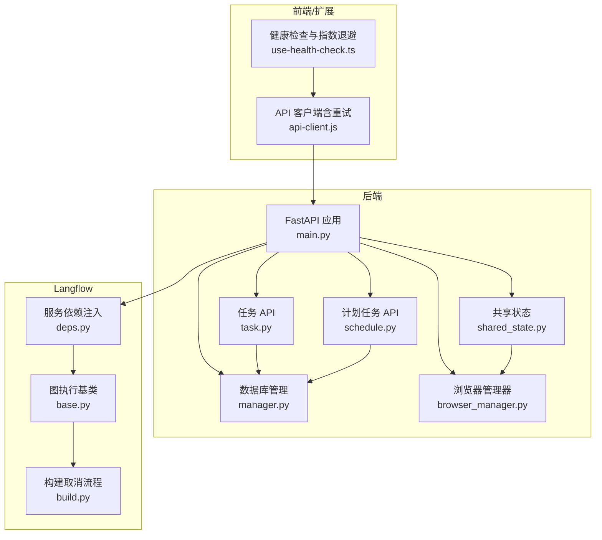
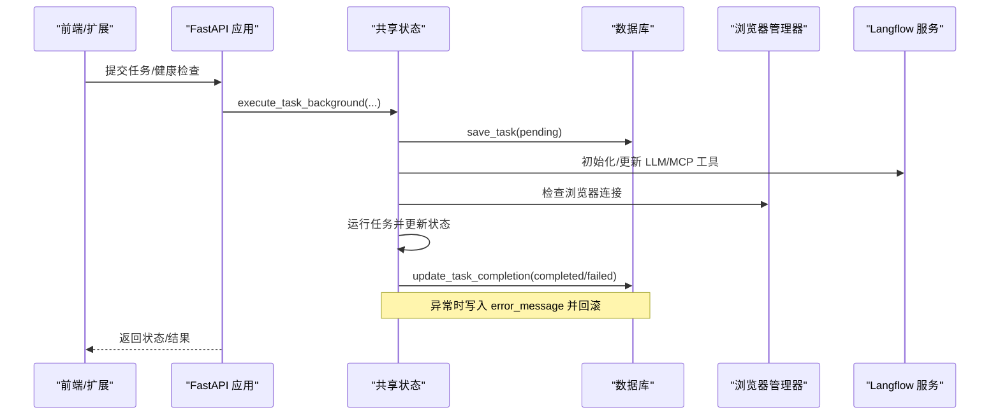
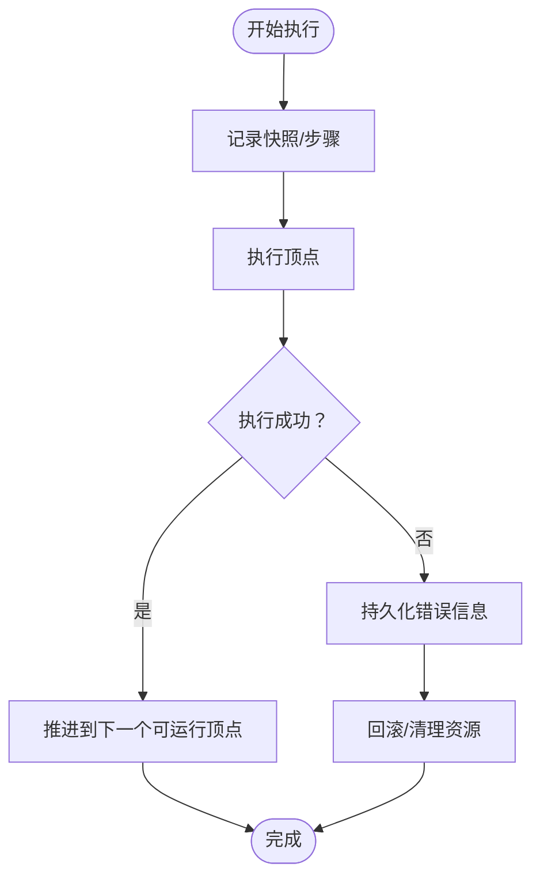
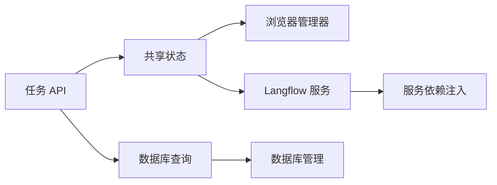

# 容错处理

<cite>
**本文引用的文件**
- [main.py](file://vibe_surf/backend/main.py)
- [shared_state.py](file://vibe_surf/backend/shared_state.py)
- [browser_manager.py](file://vibe_surf/browser/browser_manager.py)
- [models.py](file://vibe_surf/backend/database/models.py)
- [queries.py](file://vibe_surf/backend/database/queries.py)
- [manager.py](file://vibe_surf/backend/database/manager.py)
- [task.py](file://vibe_surf/backend/api/task.py)
- [schedule.py](file://vibe_surf/backend/api/schedule.py)
- [deps.py](file://vibe_surf/langflow/services/deps.py)
- [logger.py](file://vibe_surf/logger.py)
- [api-client.js](file://vibe_surf/chrome_extension/scripts/api-client.js)
- [use-health-check.ts](file://vibe_surf/frontend/src/pages/AppWrapperPage/hooks/use-health-check.ts)
- [build.py](file://vibe_surf/langflow/api/build.py)
- [base.py](file://vibe_surf/langflow/graph/graph/base.py)
</cite>

## 目录
1. [简介](#简介)
2. [项目结构与总体设计](#项目结构与总体设计)
3. [核心组件与容错职责](#核心组件与容错职责)
4. [架构总览](#架构总览)
5. [详细组件分析](#详细组件分析)
6. [依赖关系分析](#依赖关系分析)
7. [性能与可靠性考量](#性能与可靠性考量)
8. [故障排查指南](#故障排查指南)
9. [结论](#结论)

## 简介
本文件聚焦于工作流调度器的容错处理机制，围绕以下目标展开：
- 任务失败检测：异常捕获、超时监控、健康检查
- 失败任务重试策略：重试次数、退避算法、条件重试
- 断点续执行与状态持久化：如何保存与恢复任务执行状态
- 任务回滚与错误传播：确保工作流整体一致性
- 错误日志与告警：最佳实践与配置建议

## 项目结构与总体设计
后端采用 FastAPI 提供统一 API，并通过共享状态模块协调单任务执行；数据库层负责任务状态持久化；浏览器管理器负责浏览器连接健康检查；前端通过扩展脚本进行请求级重试与超时控制；Langflow 层提供图执行的快照与回放能力。

图表来源
- [main.py](file://vibe_surf/backend/main.py#L543-L731)
- [shared_state.py](file://vibe_surf/backend/shared_state.py#L118-L233)
- [browser_manager.py](file://vibe_surf/browser/browser_manager.py#L187-L202)
- [manager.py](file://vibe_surf/backend/database/manager.py#L148-L240)
- [task.py](file://vibe_surf/backend/api/task.py#L43-L146)
- [schedule.py](file://vibe_surf/backend/api/schedule.py#L108-L149)
- [deps.py](file://vibe_surf/langflow/services/deps.py#L156-L190)
- [base.py](file://vibe_surf/langflow/graph/graph/base.py#L1406-L1444)
- [build.py](file://vibe_surf/langflow/api/build.py#L515-L557)
- [api-client.js](file://vibe_surf/chrome_extension/scripts/api-client.js#L43-L136)
- [use-health-check.ts](file://vibe_surf/frontend/src/pages/AppWrapperPage/hooks/use-health-check.ts#L1-L56)

章节来源
- [main.py](file://vibe_surf/backend/main.py#L543-L731)
- [shared_state.py](file://vibe_surf/backend/shared_state.py#L118-L233)
- [browser_manager.py](file://vibe_surf/browser/browser_manager.py#L187-L202)
- [manager.py](file://vibe_surf/backend/database/manager.py#L148-L240)
- [task.py](file://vibe_surf/backend/api/task.py#L43-L146)
- [schedule.py](file://vibe_surf/backend/api/schedule.py#L108-L149)
- [deps.py](file://vibe_surf/langflow/services/deps.py#L156-L190)
- [base.py](file://vibe_surf/langflow/graph/graph/base.py#L1406-L1444)
- [build.py](file://vibe_surf/langflow/api/build.py#L515-L557)
- [api-client.js](file://vibe_surf/chrome_extension/scripts/api-client.js#L43-L136)
- [use-health-check.ts](file://vibe_surf/frontend/src/pages/AppWrapperPage/hooks/use-health-check.ts#L1-L56)

## 核心组件与容错职责
- 任务提交与执行控制：单任务模式下提交、暂停、恢复、停止、新增指令；失败时更新数据库状态并清理全局活动任务标记。
- 数据库持久化：任务状态、结果、错误信息、报告路径等字段，支持查询与统计。
- 浏览器健康检查：后台监控浏览器连接，异常时触发优雅关闭。
- 前端/扩展重试与超时：扩展脚本内置重试与超时，前端健康检查使用指数退避。
- Langflow 图执行：支持快照与逐步执行，便于断点续跑与回滚。
- 服务依赖与会话管理：数据库会话自动提交/回滚，异常时回滚并记录。

章节来源
- [task.py](file://vibe_surf/backend/api/task.py#L43-L146)
- [queries.py](file://vibe_surf/backend/database/queries.py#L441-L754)
- [models.py](file://vibe_surf/backend/database/models.py#L94-L137)
- [browser_manager.py](file://vibe_surf/browser/browser_manager.py#L187-L202)
- [api-client.js](file://vibe_surf/chrome_extension/scripts/api-client.js#L43-L136)
- [use-health-check.ts](file://vibe_surf/frontend/src/pages/AppWrapperPage/hooks/use-health-check.ts#L1-L56)
- [base.py](file://vibe_surf/langflow/graph/graph/base.py#L1406-L1444)
- [deps.py](file://vibe_surf/langflow/services/deps.py#L156-L190)

## 架构总览
后端启动时初始化 Langflow 服务、数据库、浏览器管理器与计划任务管理器；任务执行通过共享状态函数在后台任务中运行，期间持续更新数据库状态；浏览器连接由独立后台任务监控；前端/扩展负责请求级重试与健康检查。

图表来源
- [main.py](file://vibe_surf/backend/main.py#L327-L482)
- [shared_state.py](file://vibe_surf/backend/shared_state.py#L118-L233)
- [task.py](file://vibe_surf/backend/api/task.py#L43-L146)
- [queries.py](file://vibe_surf/backend/database/queries.py#L441-L754)
- [browser_manager.py](file://vibe_surf/browser/browser_manager.py#L187-L202)
- [deps.py](file://vibe_surf/langflow/services/deps.py#L156-L190)

## 详细组件分析

### 任务失败检测与健康检查
- 异常捕获与状态更新
  - 任务执行函数在 try/except 中捕获异常，将状态置为 failed 并写入错误信息与完成时间，同时持久化到数据库。
  - 任务提交接口在 LLM 连通性测试失败时返回明确错误码与消息，避免无效任务进入执行队列。
- 超时监控
  - 扩展脚本对 fetch 请求设置超时信号，配合重试与错误分类（客户端错误不重试、LLM 连接失败不重试）。
  - 健康检查钩子使用指数退避重试，避免瞬时拥塞导致的误判。
- 健康检查
  - 后端提供 /health 接口；浏览器管理器提供 check_browser_connected 方法，定期轮询目标数量以判断可用性。
  - 后台任务在浏览器断开时触发优雅关闭，避免僵尸进程。

章节来源
- [shared_state.py](file://vibe_surf/backend/shared_state.py#L118-L233)
- [task.py](file://vibe_surf/backend/api/task.py#L147-L195)
- [api-client.js](file://vibe_surf/chrome_extension/scripts/api-client.js#L43-L136)
- [use-health-check.ts](file://vibe_surf/frontend/src/pages/AppWrapperPage/hooks/use-health-check.ts#L1-L56)
- [browser_manager.py](file://vibe_surf/browser/browser_manager.py#L187-L202)
- [main.py](file://vibe_surf/backend/main.py#L649-L659)

### 失败任务的重试策略
- 前端/扩展侧
  - 扩展脚本内置重试循环，区分客户端错误与服务端错误，对 LLM 连接失败等特定错误不重试，避免无意义尝试。
  - 对最后尝试不进行额外等待，直接抛出最后一次错误。
- 后端侧
  - 当前未见显式“任务级重试”实现；失败时通过数据库记录错误并清理活动任务，后续可结合计划任务或外部调度器实现条件重试。
- 指数退避
  - 健康检查使用 2^N 秒退避，避免雪崩效应。

章节来源
- [api-client.js](file://vibe_surf/chrome_extension/scripts/api-client.js#L43-L136)
- [use-health-check.ts](file://vibe_surf/frontend/src/pages/AppWrapperPage/hooks/use-health-check.ts#L1-L56)
- [task.py](file://vibe_surf/backend/api/task.py#L147-L195)

### 断点续执行与状态持久化
- 快照与逐步执行
  - Langflow 图执行基类提供快照记录与逐步执行（step），支持在顶点执行前后记录运行状态，便于断点续跑。
- 任务状态持久化
  - 数据库模型包含任务状态、结果、错误信息、报告路径、开始/完成时间等字段；查询层提供保存、更新、统计等操作。
- 全局活动任务
  - 共享状态维护 active_task 字典，任务开始/结束时更新，便于前端与 API 查询当前执行状态。

图表来源
- [base.py](file://vibe_surf/langflow/graph/graph/base.py#L1406-L1444)
- [queries.py](file://vibe_surf/backend/database/queries.py#L441-L754)
- [models.py](file://vibe_surf/backend/database/models.py#L94-L137)
- [shared_state.py](file://vibe_surf/backend/shared_state.py#L118-L233)

章节来源
- [base.py](file://vibe_surf/langflow/graph/graph/base.py#L1406-L1444)
- [queries.py](file://vibe_surf/backend/database/queries.py#L441-L754)
- [models.py](file://vibe_surf/backend/database/models.py#L94-L137)
- [shared_state.py](file://vibe_surf/backend/shared_state.py#L118-L233)

### 任务回滚与错误传播
- 回滚机制
  - 数据库会话作用域内发生异常时自动回滚并记录日志，保证事务一致性。
  - Langflow 构建取消流程在清理作业后验证任务是否被取消，否则返回失败。
- 错误传播
  - 任务执行失败时，错误信息写入数据库并返回给调用方；浏览器断连时触发优雅关闭，避免资源泄漏。
  - 前端健康检查对 503/429 等“繁忙”状态采用指数退避重试，减少对系统的二次压力。

章节来源
- [deps.py](file://vibe_surf/langflow/services/deps.py#L156-L190)
- [build.py](file://vibe_surf/langflow/api/build.py#L515-L557)
- [main.py](file://vibe_surf/backend/main.py#L327-L482)

### 计划任务与一致性保障
- 计划任务管理
  - 计划任务 API 支持创建、更新、删除与查询；每次变更后刷新内存中的计划表，确保执行一致性。
- 与任务执行的衔接
  - 计划任务可作为外部触发器，结合任务状态与错误日志进行一致性校验与补偿。

章节来源
- [schedule.py](file://vibe_surf/backend/api/schedule.py#L108-L149)
- [shared_state.py](file://vibe_surf/backend/shared_state.py#L740-L806)

## 依赖关系分析
- 组件耦合
  - 任务 API 依赖共享状态与数据库查询；共享状态依赖浏览器管理器与 Langflow 服务；浏览器管理器依赖浏览器会话。
- 循环依赖规避
  - 共享状态通过函数与全局变量传递，避免模块间循环导入；数据库会话通过依赖注入工厂提供。
- 外部依赖
  - Langflow 服务依赖注入与图执行框架；前端扩展脚本依赖 fetch 的 AbortSignal 超时。

图表来源
- [task.py](file://vibe_surf/backend/api/task.py#L43-L146)
- [shared_state.py](file://vibe_surf/backend/shared_state.py#L118-L233)
- [browser_manager.py](file://vibe_surf/browser/browser_manager.py#L187-L202)
- [deps.py](file://vibe_surf/langflow/services/deps.py#L156-L190)
- [manager.py](file://vibe_surf/backend/database/manager.py#L148-L240)

章节来源
- [task.py](file://vibe_surf/backend/api/task.py#L43-L146)
- [shared_state.py](file://vibe_surf/backend/shared_state.py#L118-L233)
- [browser_manager.py](file://vibe_surf/browser/browser_manager.py#L187-L202)
- [deps.py](file://vibe_surf/langflow/services/deps.py#L156-L190)
- [manager.py](file://vibe_surf/backend/database/manager.py#L148-L240)

## 性能与可靠性考量
- 会话与事务
  - 数据库会话自动提交/回滚，异常时回滚并记录日志，避免脏数据。
- 超时与重试
  - 扩展脚本与健康检查均采用超时与指数退避，降低瞬时拥塞影响。
- 资源清理
  - 后台任务在优雅关闭时取消所有后台任务并清理 Langflow 服务与浏览器资源，防止资源泄漏。

章节来源
- [deps.py](file://vibe_surf/langflow/services/deps.py#L156-L190)
- [api-client.js](file://vibe_surf/chrome_extension/scripts/api-client.js#L43-L136)
- [use-health-check.ts](file://vibe_surf/frontend/src/pages/AppWrapperPage/hooks/use-health-check.ts#L1-L56)
- [main.py](file://vibe_surf/backend/main.py#L327-L482)

## 故障排查指南
- 常见问题定位
  - 任务状态异常：检查数据库任务表状态与错误信息字段，确认是否已写入 error_message。
  - 浏览器不可用：查看浏览器管理器健康检查日志，确认连接目标数量是否大于零。
  - 前端请求失败：检查扩展脚本重试与超时配置，区分客户端错误与服务端错误。
- 日志与告警
  - 后端日志按日期轮转，建议开启调试模式以获取更详细上下文。
  - 可结合 Sentry 集成（已在应用中注册）进行错误聚合与告警。

章节来源
- [queries.py](file://vibe_surf/backend/database/queries.py#L441-L754)
- [browser_manager.py](file://vibe_surf/browser/browser_manager.py#L187-L202)
- [api-client.js](file://vibe_surf/chrome_extension/scripts/api-client.js#L43-L136)
- [logger.py](file://vibe_surf/logger.py#L1-L99)
- [main.py](file://vibe_surf/backend/main.py#L85-L101)

## 结论
该工作流调度器在任务失败检测、健康检查、错误传播与资源清理方面具备较为完善的机制；在断点续执行与任务级重试方面，可通过 Langflow 快照与计划任务/外部调度器进一步增强。建议在生产环境中启用 Sentry、完善日志轮转与告警策略，并结合指数退避与超时控制提升整体稳定性。