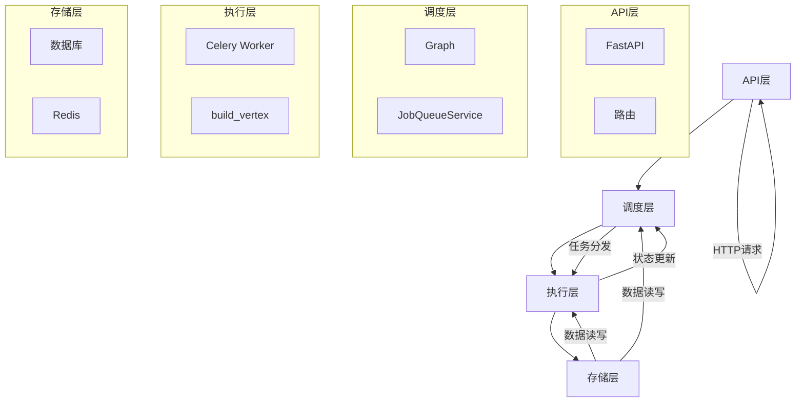
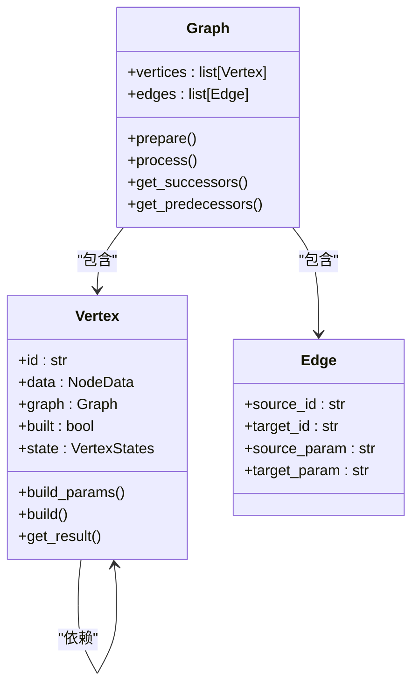
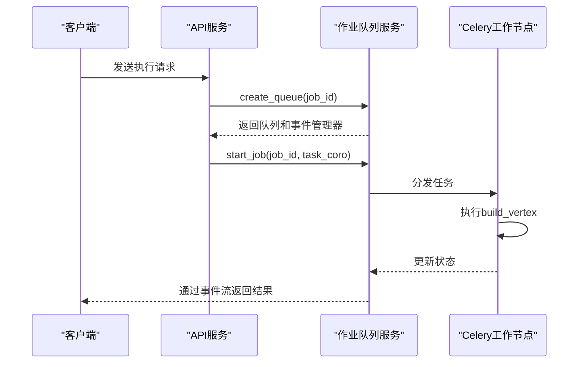
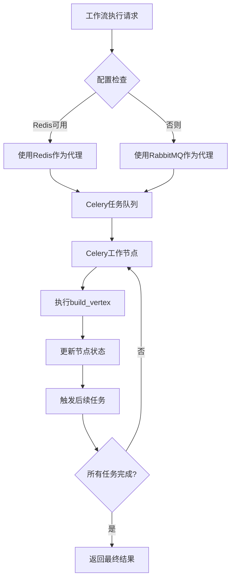
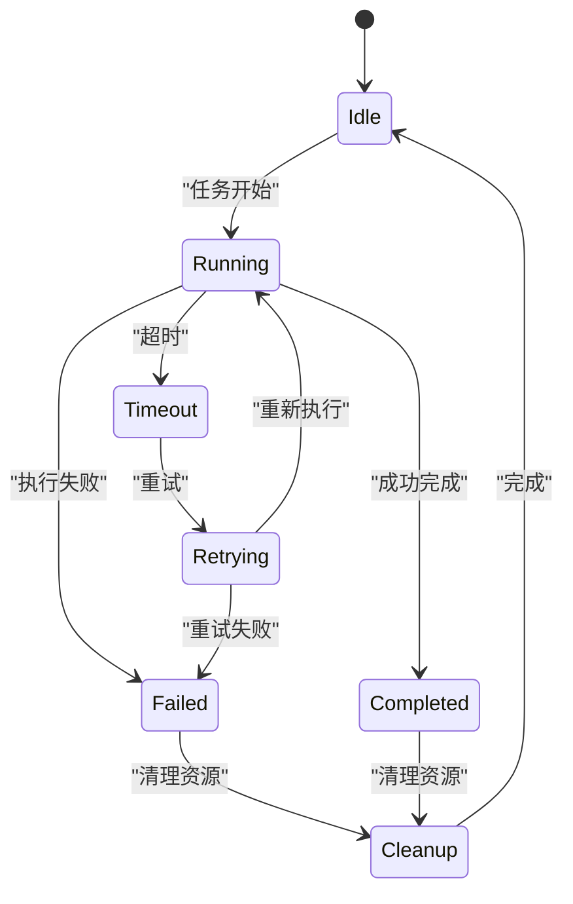
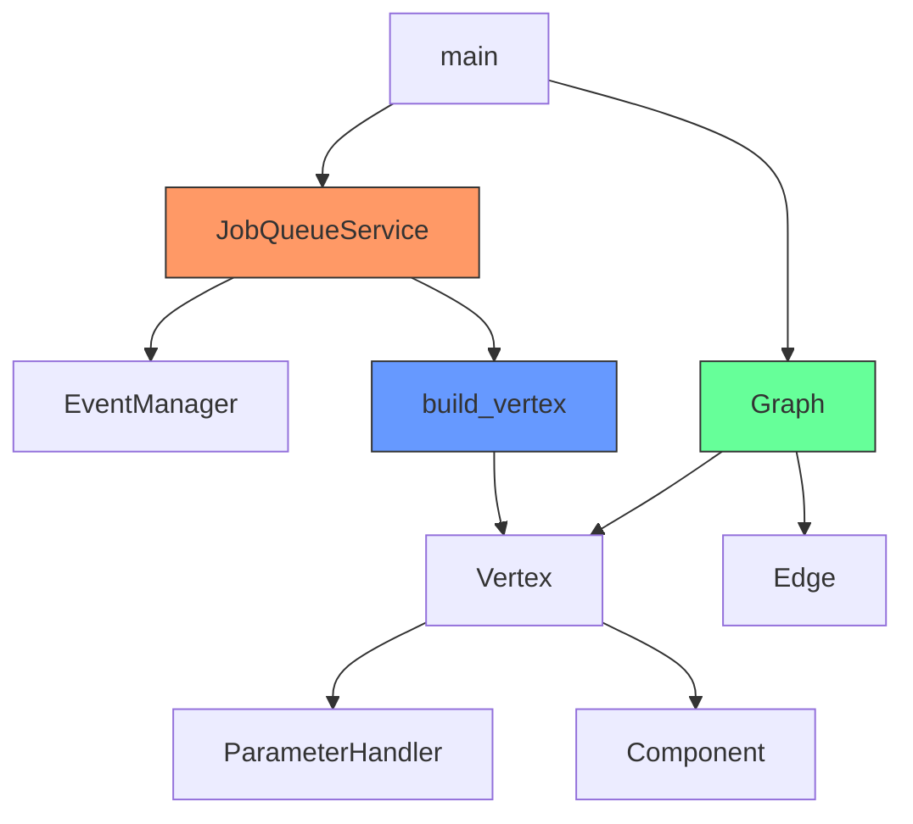

# 工作流调度器

<cite>
**本文档引用的文件**   
- [main.py](file://vibe_surf/backend/main.py)
- [celery_app.py](file://vibe_surf/langflow/core/celery_app.py)
- [celeryconfig.py](file://vibe_surf/langflow/core/celeryconfig.py)
- [worker.py](file://vibe_surf/langflow/worker.py)
- [base.py](file://vibe_surf/langflow/graph/vertex/base.py)
- [service.py](file://vibe_surf/langflow/services/job_queue/service.py)
- [base.py](file://vibe_surf/langflow/graph/graph/base.py)
- [deps.py](file://vibe_surf/langflow/services/deps.py)
</cite>

## 目录
1. [引言](#引言)
2. [项目结构](#项目结构)
3. [核心组件](#核心组件)
4. [架构概述](#架构概述)
5. [详细组件分析](#详细组件分析)
6. [依赖关系分析](#依赖关系分析)
7. [性能考虑](#性能考虑)
8. [故障排除指南](#故障排除指南)
9. [结论](#结论)

## 引言
本文档全面文档化了工作流调度器的架构和实现。该调度器基于Langflow框架构建，采用异步执行模型，通过Celery任务队列实现分布式处理。调度器能够根据执行图的拓扑结构确定节点执行顺序，处理复杂的依赖关系，并支持并行执行。它集成了强大的容错机制，包括任务超时处理、失败重试策略和断点续执行支持。此外，调度器提供了丰富的性能优化配置选项，如批量处理、预取策略和负载均衡。

## 项目结构
该项目是一个复杂的后端服务，主要由VibeSurf和Langflow两个核心模块组成。VibeSurf模块作为主应用，负责初始化和协调各个服务。Langflow模块则提供了核心的图形化工作流引擎和调度功能。系统通过FastAPI提供RESTful API，并利用Celery和Redis/RabbitMQ实现异步任务队列。

```mermaid
graph TD
subgraph "VibeSurf Backend"
main[main.py]
shared_state[shared_state.py]
api[api/]
end
subgraph "Langflow Core"
core[core/]
graph[graph/]
services[services/]
worker[worker.py]
end
subgraph "Frontend"
frontend[frontend/]
end
main --> core
core --> graph
core --> services
core --> worker
graph --> base[base.py]
services --> job_queue[job_queue/]
main --> frontend
style main fill:#f9f,stroke:#333
style core fill:#bbf,stroke:#333
style graph fill:#bbf,stroke:#333
style services fill:#bbf,stroke:#333
```

**Diagram sources**
- [main.py](file://vibe_surf/backend/main.py#L1-L794)
- [base.py](file://vibe_surf/langflow/graph/graph/base.py#L1-L2243)

**Section sources**
- [main.py](file://vibe_surf/backend/main.py#L1-L794)
- [base.py](file://vibe_surf/langflow/graph/graph/base.py#L1-L2243)

## 核心组件
工作流调度器的核心组件包括图（Graph）、节点（Vertex）、边（Edge）和作业队列服务（JobQueueService）。图结构用于表示工作流的拓扑关系，节点代表可执行的任务单元，边定义了节点间的依赖关系。作业队列服务负责管理每个工作流实例的异步任务队列和事件处理。

**Section sources**
- [base.py](file://vibe_surf/langflow/graph/graph/base.py#L56-L2243)
- [service.py](file://vibe_surf/langflow/services/job_queue/service.py#L1-L302)

## 架构概述
工作流调度器采用分层架构，从上到下分为API层、调度层、执行层和存储层。API层通过FastAPI暴露REST接口，接收工作流执行请求。调度层负责解析工作流图、确定执行顺序并管理执行状态。执行层利用Celery将任务分发到工作节点进行异步处理。存储层则使用数据库和缓存服务持久化工作流状态和结果。



**Diagram sources**
- [main.py](file://vibe_surf/backend/main.py#L1-L794)
- [service.py](file://vibe_surf/langflow/services/job_queue/service.py#L1-L302)
- [worker.py](file://vibe_surf/langflow/worker.py#L1-L38)

## 详细组件分析

### 节点执行与依赖管理
调度器通过分析工作流图的拓扑结构来确定节点的执行顺序。每个节点（Vertex）在执行前会检查其所有前置节点是否已完成，确保依赖关系得到满足。对于并行执行的节点，调度器会同时启动多个任务。



**Diagram sources**
- [base.py](file://vibe_surf/langflow/graph/vertex/base.py#L45-L800)
- [base.py](file://vibe_surf/langflow/graph/graph/base.py#L56-L2243)

### 任务队列与并发控制
作业队列服务（JobQueueService）是调度器的核心组件之一，负责管理每个工作流实例的异步任务队列。它为每个作业创建独立的asyncio.Queue，并关联一个EventManager来处理事件。



**Diagram sources**
- [service.py](file://vibe_surf/langflow/services/job_queue/service.py#L1-L302)
- [worker.py](file://vibe_surf/langflow/worker.py#L1-L38)

### Celery集成与异步执行
调度器通过Celery实现异步执行和分布式处理。核心的`build_vertex`任务被定义为Celery任务，可以在多个工作节点上并行执行。Celery配置支持Redis或RabbitMQ作为消息代理。



**Diagram sources**
- [celery_app.py](file://vibe_surf/langflow/core/celery_app.py#L1-L12)
- [celeryconfig.py](file://vibe_surf/langflow/core/celeryconfig.py#L1-L19)
- [worker.py](file://vibe_surf/langflow/worker.py#L1-L38)

### 容错机制
调度器实现了多层次的容错机制。对于任务超时，`build_vertex`任务配置了软时间限制，超时后会自动重试。系统还实现了周期性清理机制，自动清理已完成或失败的作业队列。



**Diagram sources**
- [worker.py](file://vibe_surf/langflow/worker.py#L1-L38)
- [service.py](file://vibe_surf/langflow/services/job_queue/service.py#L1-L302)

**Section sources**
- [worker.py](file://vibe_surf/langflow/worker.py#L1-L38)
- [service.py](file://vibe_surf/langflow/services/job_queue/service.py#L1-L302)

## 依赖关系分析
工作流调度器的组件间存在复杂的依赖关系。`JobQueueService`依赖于`EventManager`来处理事件，而`Graph`的执行依赖于`Vertex`的构建。Celery任务系统与核心调度逻辑通过`build_vertex`函数进行集成。



**Diagram sources**
- [service.py](file://vibe_surf/langflow/services/job_queue/service.py#L1-L302)
- [base.py](file://vibe_surf/langflow/graph/graph/base.py#L56-L2243)
- [base.py](file://vibe_surf/langflow/graph/vertex/base.py#L45-L800)
- [worker.py](file://vibe_surf/langflow/worker.py#L1-L38)

## 性能考虑
调度器提供了多种性能优化选项。通过配置`max_iterations`可以限制循环执行的最大次数，防止无限循环。作业队列服务实现了优雅的资源清理机制，避免内存泄漏。系统支持批量处理和预取策略，可以显著提高吞吐量。

**Section sources**
- [base.py](file://vibe_surf/langflow/graph/graph/base.py#L334-L466)
- [service.py](file://vibe_surf/langflow/services/job_queue/service.py#L1-L302)

## 故障排除指南
当遇到调度器问题时，首先检查Celery工作节点是否正常运行。查看Redis或RabbitMQ的连接状态，确保消息代理可用。对于执行失败的任务，检查`build_vertex`任务的日志，确认是否有超时或依赖缺失的问题。使用`get_system_status`端点可以获取当前系统状态。

**Section sources**
- [main.py](file://vibe_surf/backend/main.py#L672-L693)
- [worker.py](file://vibe_surf/langflow/worker.py#L1-L38)

## 结论
工作流调度器是一个功能强大且架构复杂的系统，它成功地将图形化工作流引擎与分布式任务队列相结合。通过精心设计的图结构和节点依赖管理，调度器能够高效地处理复杂的执行逻辑。其与Celery的深度集成确保了系统的可扩展性和可靠性。未来可以进一步优化并行执行策略，增加更精细的资源配额管理功能。