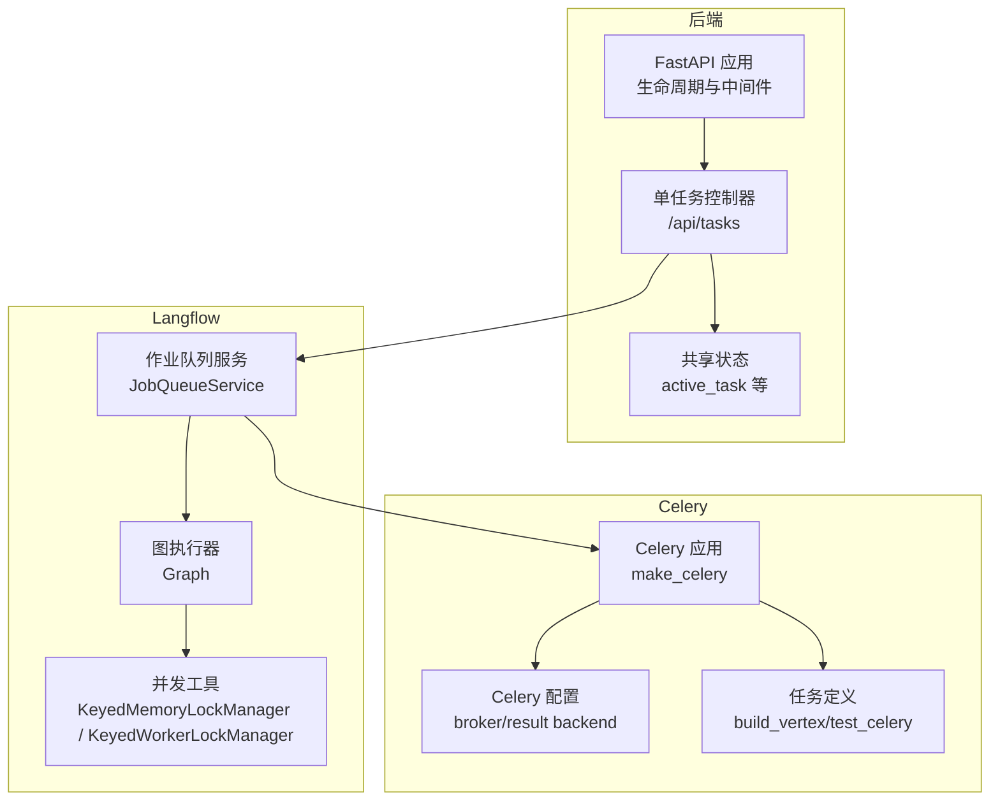
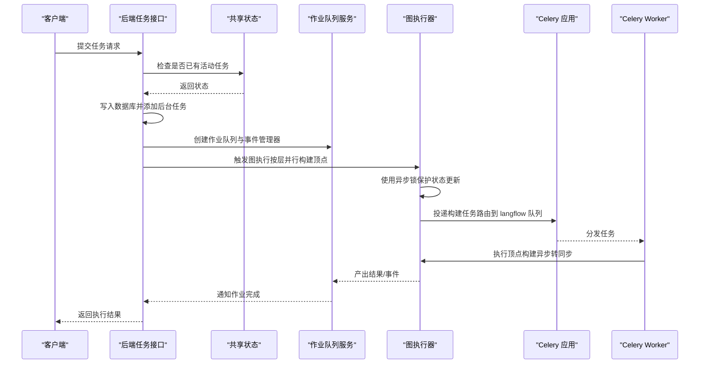
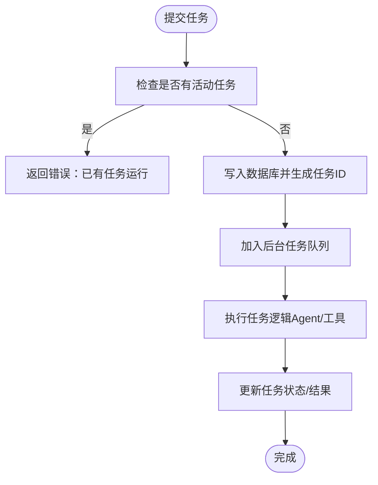
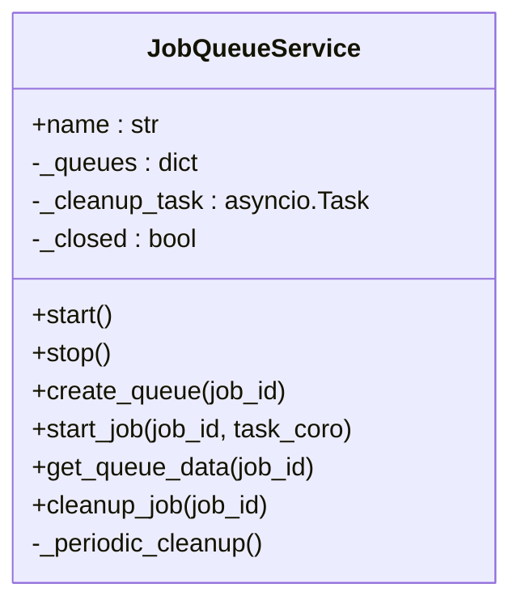
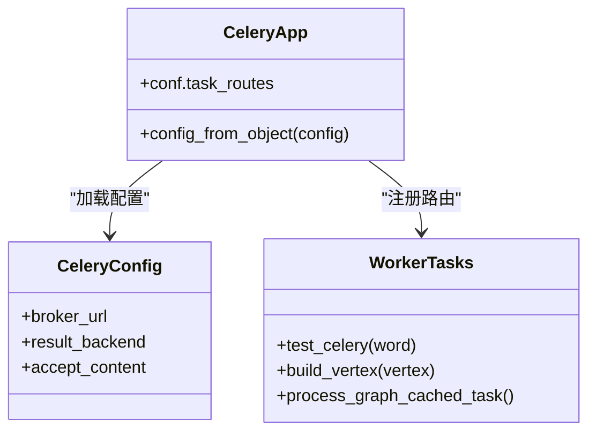
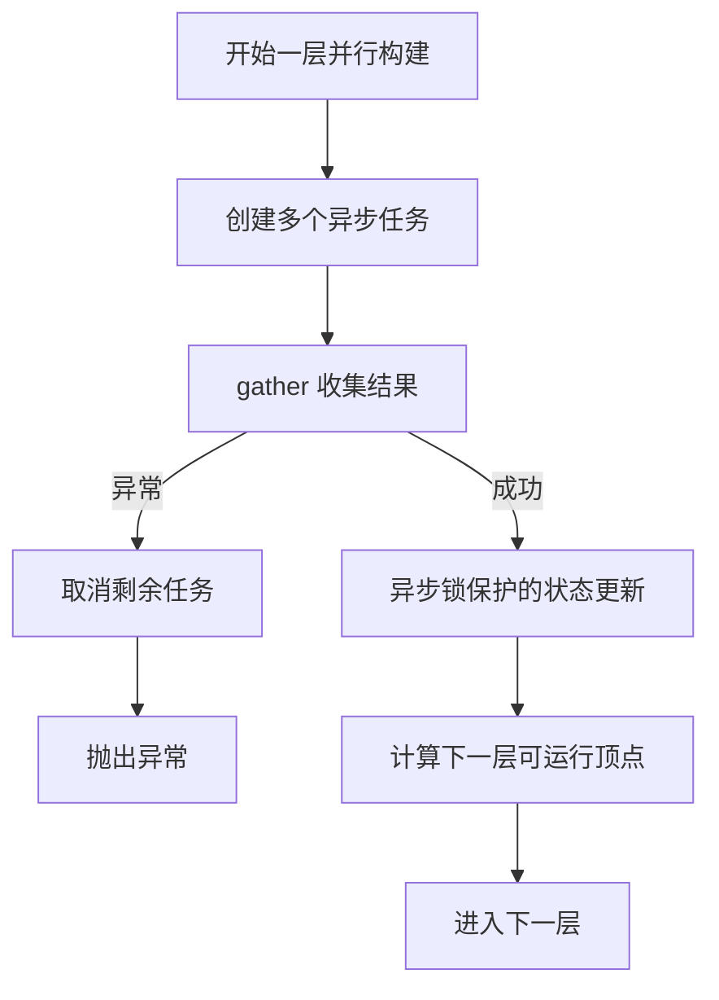
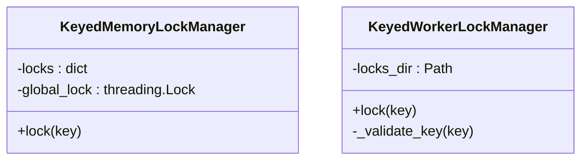
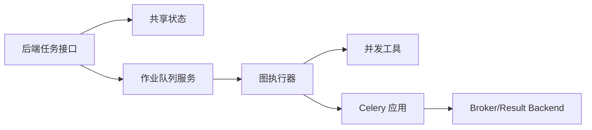

# 并发控制

<cite>
**本文引用的文件列表**
- [vibe_surf/backend/main.py](file://vibe_surf/backend/main.py)
- [vibe_surf/backend/shared_state.py](file://vibe_surf/backend/shared_state.py)
- [vibe_surf/backend/api/task.py](file://vibe_surf/backend/api/task.py)
- [vibe_surf/langflow/core/celery_app.py](file://vibe_surf/langflow/core/celery_app.py)
- [vibe_surf/langflow/core/celeryconfig.py](file://vibe_surf/langflow/core/celeryconfig.py)
- [vibe_surf/langflow/worker.py](file://vibe_surf/langflow/worker.py)
- [vibe_surf/langflow/utils/concurrency.py](file://vibe_surf/langflow/utils/concurrency.py)
- [vibe_surf/langflow/services/job_queue/service.py](file://vibe_surf/langflow/services/job_queue/service.py)
- [vibe_surf/langflow/services/deps.py](file://vibe_surf/langflow/services/deps.py)
- [vibe_surf/langflow/graph/graph/base.py](file://vibe_surf/langflow/graph/graph/base.py)
</cite>

## 目录
1. [引言](#引言)
2. [项目结构与并发控制相关模块](#项目结构与并发控制相关模块)
3. [核心组件与并发模型](#核心组件与并发模型)
4. [架构总览](#架构总览)
5. [关键组件深度解析](#关键组件深度解析)
6. [依赖关系与耦合分析](#依赖关系与耦合分析)
7. [性能与调优建议](#性能与调优建议)
8. [故障排查指南](#故障排查指南)
9. [结论](#结论)

## 引言
本文件聚焦于工作流调度器的并发控制机制，系统性梳理后端单任务执行模式与异步/分布式任务执行之间的协同方式，重点解释：
- 如何通过 Celery 的 worker 池管理并行任务执行（启动、监控、资源分配）
- 并发执行的同步机制（锁管理、资源争用处理、临界区保护）
- 最大并发数、任务预取数、超时等配置项对性能的影响与调优
- 分布式环境下的并发策略（任务分片、负载均衡、故障转移）
- 面向生产的性能调优实践与常见问题定位

## 项目结构与并发控制相关模块
- 后端入口与生命周期管理：FastAPI 应用在生命周期内初始化 Langflow 服务、浏览器会话、计划任务等，并在关闭时进行优雅清理。
- 单任务执行控制器：后端提供单任务提交接口，确保同一时刻仅有一个任务运行，避免资源竞争。
- Langflow 异步作业队列：为每个作业创建独立队列与事件管理器，支持后台任务的启动、取消与周期性清理。
- Celery 分布式任务执行：定义 Celery 应用、路由与配置，提供任务装饰器与超时重试策略。
- 并发工具：内存级键控锁与基于文件锁的跨进程/跨节点锁，用于保护共享资源。
- 图执行与并行：图执行器在每层并行构建顶点，使用异步锁保护状态更新，异常时取消后续任务。

图表来源
- [vibe_surf/backend/main.py](file://vibe_surf/backend/main.py#L543-L731)
- [vibe_surf/backend/api/task.py](file://vibe_surf/backend/api/task.py#L1-L200)
- [vibe_surf/backend/shared_state.py](file://vibe_surf/backend/shared_state.py#L118-L234)
- [vibe_surf/langflow/services/job_queue/service.py](file://vibe_surf/langflow/services/job_queue/service.py#L1-L120)
- [vibe_surf/langflow/graph/graph/base.py](file://vibe_surf/langflow/graph/graph/base.py#L1600-L1799)
- [vibe_surf/langflow/utils/concurrency.py](file://vibe_surf/langflow/utils/concurrency.py#L1-L61)
- [vibe_surf/langflow/core/celery_app.py](file://vibe_surf/langflow/core/celery_app.py#L1-L12)
- [vibe_surf/langflow/core/celeryconfig.py](file://vibe_surf/langflow/core/celeryconfig.py#L1-L19)
- [vibe_surf/langflow/worker.py](file://vibe_surf/langflow/worker.py#L1-L38)

章节来源
- [vibe_surf/backend/main.py](file://vibe_surf/backend/main.py#L543-L731)
- [vibe_surf/backend/api/task.py](file://vibe_surf/backend/api/task.py#L1-L200)
- [vibe_surf/backend/shared_state.py](file://vibe_surf/backend/shared_state.py#L118-L234)
- [vibe_surf/langflow/services/job_queue/service.py](file://vibe_surf/langflow/services/job_queue/service.py#L1-L120)
- [vibe_surf/langflow/graph/graph/base.py](file://vibe_surf/langflow/graph/graph/base.py#L1600-L1799)
- [vibe_surf/langflow/utils/concurrency.py](file://vibe_surf/langflow/utils/concurrency.py#L1-L61)
- [vibe_surf/langflow/core/celery_app.py](file://vibe_surf/langflow/core/celery_app.py#L1-L12)
- [vibe_surf/langflow/core/celeryconfig.py](file://vibe_surf/langflow/core/celeryconfig.py#L1-L19)
- [vibe_surf/langflow/worker.py](file://vibe_surf/langflow/worker.py#L1-L38)

## 核心组件与并发模型
- 单任务执行模型：后端提供单任务提交接口，内部通过共享状态记录当前活动任务，若已有任务运行则拒绝新任务，避免资源争用。
- 异步作业队列：为每个作业创建独立队列与事件管理器，支持启动任务、取消任务、周期性清理，保证资源回收与幂等。
- Celery 分布式执行：通过 Celery 应用与配置连接消息中间件，定义任务路由到专用队列，支持软超时与重试。
- 图执行并行：每层顶点构建以异步任务并行执行，使用异步锁保护状态更新，异常时取消剩余任务，确保一致性。
- 锁与临界区：内存级键控锁用于进程内隔离；文件级键控锁用于跨进程/跨节点资源互斥；图执行中使用异步锁保护状态变更。

章节来源
- [vibe_surf/backend/api/task.py](file://vibe_surf/backend/api/task.py#L34-L146)
- [vibe_surf/backend/shared_state.py](file://vibe_surf/backend/shared_state.py#L118-L234)
- [vibe_surf/langflow/services/job_queue/service.py](file://vibe_surf/langflow/services/job_queue/service.py#L124-L209)
- [vibe_surf/langflow/graph/graph/base.py](file://vibe_surf/langflow/graph/graph/base.py#L1600-L1799)
- [vibe_surf/langflow/utils/concurrency.py](file://vibe_surf/langflow/utils/concurrency.py#L1-L61)
- [vibe_surf/langflow/core/celery_app.py](file://vibe_surf/langflow/core/celery_app.py#L1-L12)
- [vibe_surf/langflow/worker.py](file://vibe_surf/langflow/worker.py#L1-L38)

## 架构总览
下图展示从 API 提交到 Celery 执行再到图构建的完整流程，以及并发控制的关键节点。

图表来源
- [vibe_surf/backend/api/task.py](file://vibe_surf/backend/api/task.py#L43-L146)
- [vibe_surf/backend/shared_state.py](file://vibe_surf/backend/shared_state.py#L118-L234)
- [vibe_surf/langflow/services/job_queue/service.py](file://vibe_surf/langflow/services/job_queue/service.py#L124-L209)
- [vibe_surf/langflow/graph/graph/base.py](file://vibe_surf/langflow/graph/graph/base.py#L1600-L1799)
- [vibe_surf/langflow/core/celery_app.py](file://vibe_surf/langflow/core/celery_app.py#L1-L12)
- [vibe_surf/langflow/worker.py](file://vibe_surf/langflow/worker.py#L1-L38)

## 关键组件深度解析

### 组件一：后端单任务执行与共享状态
- 单任务提交接口在提交前检查共享状态中的活动任务，若存在则拒绝新任务，从而避免资源争用。
- 共享状态维护当前任务信息、浏览器会话、计划任务等，提供查询与清理能力。
- 生命周期内启动浏览器监控、Langflow 初始化、计划任务等后台任务，并在关闭时统一清理。

图表来源
- [vibe_surf/backend/api/task.py](file://vibe_surf/backend/api/task.py#L43-L146)
- [vibe_surf/backend/shared_state.py](file://vibe_surf/backend/shared_state.py#L118-L234)

章节来源
- [vibe_surf/backend/api/task.py](file://vibe_surf/backend/api/task.py#L34-L146)
- [vibe_surf/backend/shared_state.py](file://vibe_surf/backend/shared_state.py#L118-L234)

### 组件二：Langflow 作业队列服务（并发隔离与清理）
- 为每个作业创建独立队列与事件管理器，支持启动任务、取消任务、清理作业。
- 周期性清理：标记任务完成后等待“宽限期”再真正释放资源，避免竞态与数据丢失。
- 通过服务工厂注册与依赖注入获取队列服务，贯穿图执行与任务生命周期。

图表来源
- [vibe_surf/langflow/services/job_queue/service.py](file://vibe_surf/langflow/services/job_queue/service.py#L1-L120)

章节来源
- [vibe_surf/langflow/services/job_queue/service.py](file://vibe_surf/langflow/services/job_queue/service.py#L124-L209)
- [vibe_surf/langflow/services/job_queue/service.py](file://vibe_surf/langflow/services/job_queue/service.py#L210-L329)
- [vibe_surf/langflow/services/deps.py](file://vibe_surf/langflow/services/deps.py#L255-L260)

### 组件三：Celery 分布式任务执行（worker 池与路由）
- Celery 应用通过配置对象加载 broker/result backend，支持 Redis 或 RabbitMQ。
- 定义任务路由将特定任务投递到专用队列，便于 worker 池隔离与扩展。
- 任务装饰器支持软超时与重试，保障稳定性。

图表来源
- [vibe_surf/langflow/core/celery_app.py](file://vibe_surf/langflow/core/celery_app.py#L1-L12)
- [vibe_surf/langflow/core/celeryconfig.py](file://vibe_surf/langflow/core/celeryconfig.py#L1-L19)
- [vibe_surf/langflow/worker.py](file://vibe_surf/langflow/worker.py#L1-L38)

章节来源
- [vibe_surf/langflow/core/celery_app.py](file://vibe_surf/langflow/core/celery_app.py#L1-L12)
- [vibe_surf/langflow/core/celeryconfig.py](file://vibe_surf/langflow/core/celeryconfig.py#L1-L19)
- [vibe_surf/langflow/worker.py](file://vibe_surf/langflow/worker.py#L1-L38)

### 组件四：图执行并行与临界区保护
- 每层顶点构建以异步任务并行执行，使用异步锁保护状态更新，避免竞态。
- 异常时取消剩余任务，确保一致性；成功结果用于推进下一层可运行顶点集合。
- 顶点构建任务绑定软超时与重试，失败时触发重试或终止。

图表来源
- [vibe_surf/langflow/graph/graph/base.py](file://vibe_surf/langflow/graph/graph/base.py#L1600-L1799)
- [vibe_surf/langflow/worker.py](file://vibe_surf/langflow/worker.py#L19-L31)

章节来源
- [vibe_surf/langflow/graph/graph/base.py](file://vibe_surf/langflow/graph/graph/base.py#L1600-L1799)
- [vibe_surf/langflow/worker.py](file://vibe_surf/langflow/worker.py#L19-L31)

### 组件五：锁管理与资源争用处理
- 内存级键控锁：为不同键提供独立线程锁，适合进程内隔离。
- 文件级键控锁：基于文件锁实现跨进程/跨节点互斥，键名校验防止非法字符。
- 图执行使用异步锁保护状态变更，避免并发修改导致的不一致。

图表来源
- [vibe_surf/langflow/utils/concurrency.py](file://vibe_surf/langflow/utils/concurrency.py#L1-L61)

章节来源
- [vibe_surf/langflow/utils/concurrency.py](file://vibe_surf/langflow/utils/concurrency.py#L1-L61)
- [vibe_surf/langflow/graph/graph/base.py](file://vibe_surf/langflow/graph/graph/base.py#L1647-L1678)

## 依赖关系与耦合分析
- 后端 API 依赖共享状态与数据库会话，负责单任务串行化与状态上报。
- 作业队列服务通过依赖注入获取，为图执行提供隔离的队列与事件通道。
- 图执行器与并发工具解耦，通过异步锁与键控锁实现细粒度同步。
- Celery 作为外部系统，通过路由与配置与应用解耦，便于横向扩展。

图表来源
- [vibe_surf/backend/api/task.py](file://vibe_surf/backend/api/task.py#L1-L200)
- [vibe_surf/backend/shared_state.py](file://vibe_surf/backend/shared_state.py#L118-L234)
- [vibe_surf/langflow/services/job_queue/service.py](file://vibe_surf/langflow/services/job_queue/service.py#L1-L120)
- [vibe_surf/langflow/graph/graph/base.py](file://vibe_surf/langflow/graph/graph/base.py#L1600-L1799)
- [vibe_surf/langflow/utils/concurrency.py](file://vibe_surf/langflow/utils/concurrency.py#L1-L61)
- [vibe_surf/langflow/core/celery_app.py](file://vibe_surf/langflow/core/celery_app.py#L1-L12)

章节来源
- [vibe_surf/backend/api/task.py](file://vibe_surf/backend/api/task.py#L1-L200)
- [vibe_surf/backend/shared_state.py](file://vibe_surf/backend/shared_state.py#L118-L234)
- [vibe_surf/langflow/services/job_queue/service.py](file://vibe_surf/langflow/services/job_queue/service.py#L1-L120)
- [vibe_surf/langflow/graph/graph/base.py](file://vibe_surf/langflow/graph/graph/base.py#L1600-L1799)
- [vibe_surf/langflow/utils/concurrency.py](file://vibe_surf/langflow/utils/concurrency.py#L1-L61)
- [vibe_surf/langflow/core/celery_app.py](file://vibe_surf/langflow/core/celery_app.py#L1-L12)

## 性能与调优建议
- 最大并发数
  - Celery worker 数量应与 CPU/IO 资源匹配，避免过度上下文切换。
  - 通过队列路由将 CPU 密集型与 IO 密集型任务分离，提升吞吐。
- 任务预取数
  - 适当降低预取数可减少长任务占用 worker 时间，提高公平性；但过低会增加调度开销。
- 超时与重试
  - 为易卡顿任务设置软超时与指数退避重试，避免 worker 阻塞。
- 资源隔离
  - 使用内存级与文件级键控锁隔离共享资源，避免热点竞争。
- 清理策略
  - 为作业队列设置合理的宽限期，平衡资源回收与竞态风险。
- 图执行并行度
  - 每层并行构建顶点时，结合异步锁与异常取消策略，确保整体吞吐与一致性。

[本节为通用指导，无需列出具体文件来源]

## 故障排查指南
- 任务无法提交
  - 检查共享状态中是否存在活动任务；若存在，需先结束当前任务。
- Celery 任务未执行
  - 校验 broker/result backend 地址与认证；确认任务路由正确指向目标队列。
- 任务超时或卡死
  - 检查软超时与重试配置；观察 worker 日志与队列积压情况。
- 资源争用或死锁
  - 排查键控锁使用是否覆盖所有共享资源；确认锁粒度与持有时间。
- 图执行异常传播
  - 关注 gather 结果与异常取消行为，定位失败顶点并查看日志。

章节来源
- [vibe_surf/backend/api/task.py](file://vibe_surf/backend/api/task.py#L34-L146)
- [vibe_surf/langflow/core/celeryconfig.py](file://vibe_surf/langflow/core/celeryconfig.py#L1-L19)
- [vibe_surf/langflow/worker.py](file://vibe_surf/langflow/worker.py#L19-L31)
- [vibe_surf/langflow/graph/graph/base.py](file://vibe_surf/langflow/graph/graph/base.py#L1720-L1774)
- [vibe_surf/langflow/utils/concurrency.py](file://vibe_surf/langflow/utils/concurrency.py#L1-L61)

## 结论
该系统采用“单任务提交 + 异步作业队列 + Celery 分布式执行”的组合方案，在保证单任务串行化的同时，利用队列与锁机制实现多作业隔离与临界区保护。通过合理的并发配置与清理策略，可在复杂工作流场景下获得稳定且可扩展的执行能力。建议在生产环境中持续监控 worker 利用率、队列延迟与异常分布，动态调整并发参数与资源分配，以达到最佳性能与可靠性平衡。