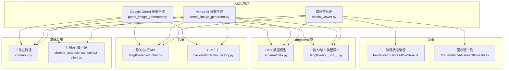
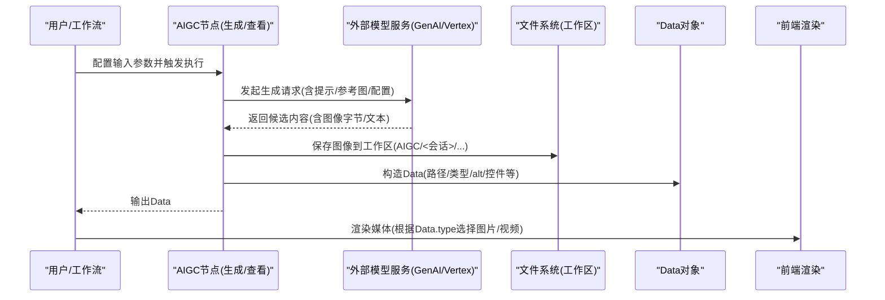
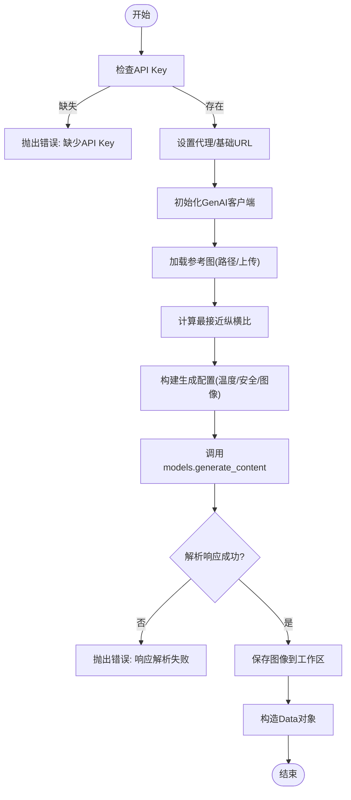
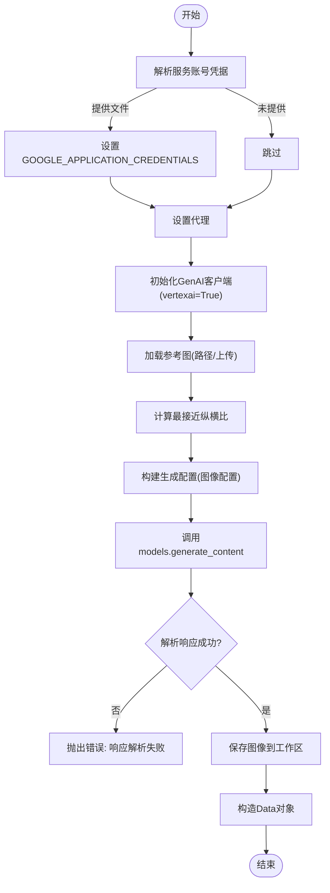
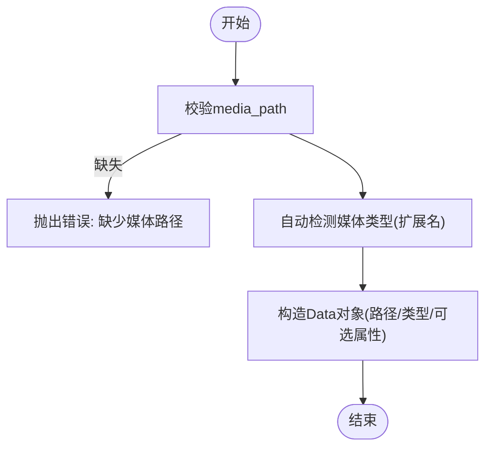
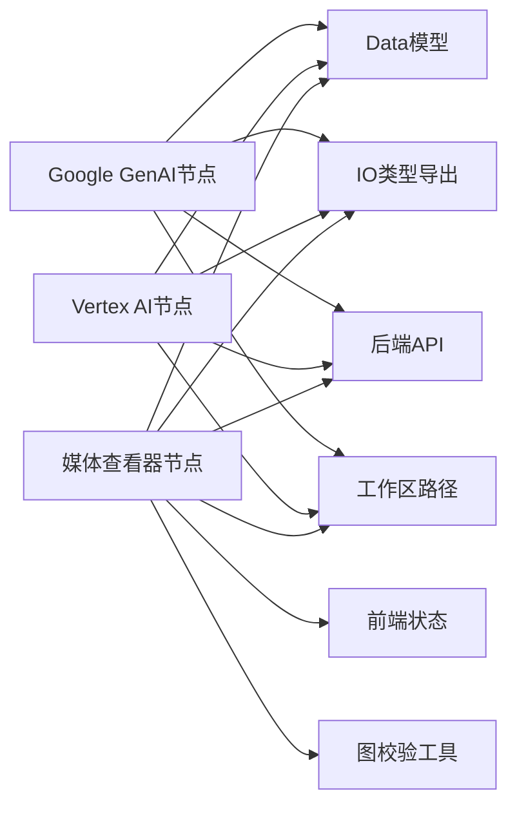

# AIGC生成节点

<cite>
**本文引用的文件**
- [genai_image_generator.py](file://vibe_surf/workflows/AIGC/genai_image_generator.py)
- [media_viewer.py](file://vibe_surf/workflows/AIGC/media_viewer.py)
- [vertex_image_generator.py](file://vibe_surf/workflows/AIGC/vertex_image_generator.py)
- [data.py](file://vibe_surf/langflow/schema/data.py)
- [llm_factory.py](file://vibe_surf/backend/utils/llm_factory.py)
- [common.py](file://vibe_surf/common.py)
- [__init__.py（IO）](file://vibe_surf/langflow/io/__init__.py)
- [chat.py（后端API）](file://vibe_surf/langflow/api/v1/chat.py)
- [flowStore.ts（前端状态）](file://vibe_surf/frontend/src/stores/flowStore.ts)
- [reactflowUtils.ts（前端校验）](file://vibe_surf/frontend/src/utils/reactflowUtils.ts)
- [api-client.js（扩展客户端）](file://vibe_surf/chrome_extension/scripts/api-client.js)
</cite>

## 目录
1. [简介](#简介)
2. [项目结构](#项目结构)
3. [核心组件](#核心组件)
4. [架构总览](#架构总览)
5. [详细组件分析](#详细组件分析)
6. [依赖关系分析](#依赖关系分析)
7. [性能考虑](#性能考虑)
8. [故障排查指南](#故障排查指南)
9. [结论](#结论)
10. [附录](#附录)

## 简介
本文件系统性地文档化AIGC工作流中的三类节点：图像生成（Google GenAI）、媒体查看（Media Viewer）与顶点图像生成（Vertex AI）。重点说明各节点的输入参数、输出结果、执行逻辑、错误处理、性能优化策略，以及与LLM的多模态协同方式。同时给出节点间数据流关系与最佳实践，帮助用户构建稳定高效的AIGC工作流。

## 项目结构
AIGC相关节点位于工作流目录下，采用Langflow自定义组件模式，统一通过输入/输出接口与Langflow运行时交互；媒体查看节点负责渲染本地或远端媒体资源；LLM工厂模块提供多供应商模型实例创建能力，支撑多模态内容生成与后续处理。

图表来源
- [genai_image_generator.py](file://vibe_surf/workflows/AIGC/genai_image_generator.py#L1-L285)
- [media_viewer.py](file://vibe_surf/workflows/AIGC/media_viewer.py#L1-L127)
- [vertex_image_generator.py](file://vibe_surf/workflows/AIGC/vertex_image_generator.py#L1-L260)
- [data.py](file://vibe_surf/langflow/schema/data.py#L1-L307)
- [llm_factory.py](file://vibe_surf/backend/utils/llm_factory.py#L1-L275)
- [common.py](file://vibe_surf/common.py#L1-L36)
- [__init__.py（IO）](file://vibe_surf/langflow/io/__init__.py#L1-L64)
- [chat.py（后端API）](file://vibe_surf/langflow/api/v1/chat.py#L357-L367)
- [flowStore.ts（前端状态）](file://vibe_surf/frontend/src/stores/flowStore.ts#L674-L719)
- [reactflowUtils.ts（前端校验）](file://vibe_surf/frontend/src/utils/reactflowUtils.ts#L687-L743)
- [api-client.js（扩展客户端）](file://vibe_surf/chrome_extension/scripts/api-client.js#L313-L367)

章节来源
- [genai_image_generator.py](file://vibe_surf/workflows/AIGC/genai_image_generator.py#L1-L285)
- [media_viewer.py](file://vibe_surf/workflows/AIGC/media_viewer.py#L1-L127)
- [vertex_image_generator.py](file://vibe_surf/workflows/AIGC/vertex_image_generator.py#L1-L260)
- [data.py](file://vibe_surf/langflow/schema/data.py#L1-L307)
- [llm_factory.py](file://vibe_surf/backend/utils/llm_factory.py#L1-L275)
- [common.py](file://vibe_surf/common.py#L1-L36)
- [__init__.py（IO）](file://vibe_surf/langflow/io/__init__.py#L1-L64)
- [chat.py（后端API）](file://vibe_surf/langflow/api/v1/chat.py#L357-L367)
- [flowStore.ts（前端状态）](file://vibe_surf/frontend/src/stores/flowStore.ts#L674-L719)
- [reactflowUtils.ts（前端校验）](file://vibe_surf/frontend/src/utils/reactflowUtils.ts#L687-L743)
- [api-client.js（扩展客户端）](file://vibe_surf/chrome_extension/scripts/api-client.js#L313-L367)

## 核心组件
- Google GenAI 图像生成节点：支持API Key直连与Vertex AI模式，可选参考图、纵横比与分辨率配置，返回Data对象承载媒体路径与元信息。
- Vertex AI 图像生成节点：基于服务账号凭据与项目/区域配置，直接调用Vertex AI，返回Data对象承载媒体路径与元信息。
- 媒体查看器节点：自动识别图片/视频类型，封装展示控制（播放、循环、控件显示），返回Data对象供前端渲染。

章节来源
- [genai_image_generator.py](file://vibe_surf/workflows/AIGC/genai_image_generator.py#L1-L285)
- [vertex_image_generator.py](file://vibe_surf/workflows/AIGC/vertex_image_generator.py#L1-L260)
- [media_viewer.py](file://vibe_surf/workflows/AIGC/media_viewer.py#L1-L127)
- [data.py](file://vibe_surf/langflow/schema/data.py#L1-L307)

## 架构总览
AIGC节点在Langflow中作为“组件”存在，遵循统一的输入/输出声明与执行方法。节点执行时：
- 读取输入参数（文本提示、可选参考图、代理、基础URL、纵横比、分辨率等）
- 调用外部模型服务（Google GenAI/Vertex AI）
- 解析响应，提取图像字节
- 写入工作区目录，生成唯一文件名
- 返回Data对象，包含媒体路径、类型、可选属性（alt、控件、自动播放、循环）

图表来源
- [genai_image_generator.py](file://vibe_surf/workflows/AIGC/genai_image_generator.py#L97-L284)
- [vertex_image_generator.py](file://vibe_surf/workflows/AIGC/vertex_image_generator.py#L96-L259)
- [media_viewer.py](file://vibe_surf/workflows/AIGC/media_viewer.py#L91-L123)
- [data.py](file://vibe_surf/langflow/schema/data.py#L1-L307)
- [common.py](file://vibe_surf/common.py#L1-L36)

## 详细组件分析

### Google GenAI 图像生成节点
- 输入参数
  - api_key：必填，用于直连GenAI
  - use_vertex：布尔，是否以Vertex模式调用
  - prompt：必填，文本提示
  - image_file/image_path：可选，参考图（二选一）
  - model_name：模型名称（如gemini-3-pro-image-preview等）
  - proxy/base_url：可选，代理与自定义基础URL
  - aspect_ratio/resolution：可选，纵横比与分辨率
- 执行逻辑
  - 处理代理与基础URL
  - 初始化GenAI客户端（vertexai开关）
  - 解析参考图（路径或上传文件），计算最接近的纵横比
  - 组装生成配置（温度、top_p、安全设置、图像配置）
  - 调用models.generate_content，解析候选内容提取图像字节
  - 写入工作区，构造Data对象并返回
- 输出结果
  - Data对象，包含路径、类型为image、可选alt、控件显示等
- 错误处理
  - 缺少API Key、导入失败、响应解析异常、无图像生成等情况抛出明确错误
- 性能优化
  - 使用环境变量设置代理，避免重复初始化
  - 仅在需要时启用流式，当前简化为一次性生成
  - 通过最小化纵横比匹配减少不必要的重算

图表来源
- [genai_image_generator.py](file://vibe_surf/workflows/AIGC/genai_image_generator.py#L97-L284)

章节来源
- [genai_image_generator.py](file://vibe_surf/workflows/AIGC/genai_image_generator.py#L1-L285)
- [data.py](file://vibe_surf/langflow/schema/data.py#L1-L307)
- [common.py](file://vibe_surf/common.py#L1-L36)

### Vertex AI 图像生成节点
- 输入参数
  - credentials：可选，服务账号JSON文件路径
  - prompt：必填，文本提示
  - image_file/image_path：可选，参考图
  - project/location：可选，项目与区域
  - proxy：可选，代理
  - model_name、aspect_ratio、resolution：可选
- 执行逻辑
  - 解析凭据（显式文件优先，否则回退环境变量）
  - 设置代理
  - 初始化GenAI客户端（vertexai=True，指定project/location）
  - 参考图处理与纵横比计算
  - 构建生成配置（图像配置含输出mime类型）
  - 调用models.generate_content，解析候选内容提取图像字节
  - 写入工作区，构造Data对象并返回
- 输出结果
  - Data对象，包含路径、类型为image、可选alt、控件显示等
- 错误处理
  - 缺少必要依赖、认证失败、响应解析异常、无图像生成等情况抛出明确错误

图表来源
- [vertex_image_generator.py](file://vibe_surf/workflows/AIGC/vertex_image_generator.py#L96-L259)

章节来源
- [vertex_image_generator.py](file://vibe_surf/workflows/AIGC/vertex_image_generator.py#L1-L260)
- [data.py](file://vibe_surf/langflow/schema/data.py#L1-L307)
- [common.py](file://vibe_surf/common.py#L1-L36)

### 媒体查看器节点
- 输入参数
  - media_path：必填，本地路径或URL
  - alt_text：可选，替代文本
  - show_controls：可选，是否显示控件
  - auto_play/loop：可选，视频自动播放与循环
- 执行逻辑
  - 自动检测媒体类型（依据扩展名）
  - 构造Data对象，包含路径、类型、可选属性
  - 返回Data对象供前端渲染
- 输出结果
  - Data对象，包含路径、类型（image/video）、控件与播放设置等
- 错误处理
  - 路径为空或无法识别类型时抛出错误并更新状态

图表来源
- [media_viewer.py](file://vibe_surf/workflows/AIGC/media_viewer.py#L91-L123)

章节来源
- [media_viewer.py](file://vibe_surf/workflows/AIGC/media_viewer.py#L1-L127)
- [data.py](file://vibe_surf/langflow/schema/data.py#L1-L307)

### 与LLM的多模态协同
- LLM工厂
  - 支持多种提供商（OpenAI、Anthropic、Google、Azure OpenAI、Groq、Ollama、OpenRouter、DeepSeek、AWS Bedrock、Anthropic Bedrock、Qwen、Kimi、LM Studio等）
  - 根据配置动态创建对应Chat模型实例，支持温度、最大token、top_p、频率惩罚、种子等参数
  - 提供配置校验与参数清单查询
- 多模态内容生成
  - AIGC节点返回Data对象，其中包含text与data字段，前端可据此渲染消息或媒体
  - 当Data包含文件路径时，前端可将其作为多模态内容的一部分进行展示
- 工作流集成
  - LLM节点可先产出文本描述或指令，再由AIGC节点生成图像，最后由媒体查看器节点渲染
  - 文件上传与下载可通过扩展API客户端完成，便于在工作流中传递媒体文件

章节来源
- [llm_factory.py](file://vibe_surf/backend/utils/llm_factory.py#L1-L275)
- [data.py](file://vibe_surf/langflow/schema/data.py#L1-L307)
- [api-client.js（扩展客户端）](file://vibe_surf/chrome_extension/scripts/api-client.js#L313-L367)

## 依赖关系分析
- 组件依赖
  - 三个AIGC节点均继承自Langflow组件基类，使用统一的输入/输出声明与Data对象返回
  - 通过Langflow IO类型导出，确保参数类型与高级选项一致
- 运行时依赖
  - 后端API在组件构建/执行失败时返回错误输出，前端据此更新构建状态
  - 前端对节点/边进行校验，防止环路与不完整连接
- 基础设施依赖
  - 工作区路径统一由common模块提供，确保跨平台一致性
  - 媒体查看器依赖Data对象的类型字段决定渲染行为

图表来源
- [genai_image_generator.py](file://vibe_surf/workflows/AIGC/genai_image_generator.py#L1-L285)
- [vertex_image_generator.py](file://vibe_surf/workflows/AIGC/vertex_image_generator.py#L1-L260)
- [media_viewer.py](file://vibe_surf/workflows/AIGC/media_viewer.py#L1-L127)
- [data.py](file://vibe_surf/langflow/schema/data.py#L1-L307)
- [__init__.py（IO）](file://vibe_surf/langflow/io/__init__.py#L1-L64)
- [chat.py（后端API）](file://vibe_surf/langflow/api/v1/chat.py#L357-L367)
- [flowStore.ts（前端状态）](file://vibe_surf/frontend/src/stores/flowStore.ts#L674-L719)
- [reactflowUtils.ts（前端校验）](file://vibe_surf/frontend/src/utils/reactflowUtils.ts#L687-L743)
- [common.py](file://vibe_surf/common.py#L1-L36)

章节来源
- [genai_image_generator.py](file://vibe_surf/workflows/AIGC/genai_image_generator.py#L1-L285)
- [vertex_image_generator.py](file://vibe_surf/workflows/AIGC/vertex_image_generator.py#L1-L260)
- [media_viewer.py](file://vibe_surf/workflows/AIGC/media_viewer.py#L1-L127)
- [data.py](file://vibe_surf/langflow/schema/data.py#L1-L307)
- [__init__.py（IO）](file://vibe_surf/langflow/io/__init__.py#L1-L64)
- [chat.py（后端API）](file://vibe_surf/langflow/api/v1/chat.py#L357-L367)
- [flowStore.ts（前端状态）](file://vibe_surf/frontend/src/stores/flowStore.ts#L674-L719)
- [reactflowUtils.ts（前端校验）](file://vibe_surf/frontend/src/utils/reactflowUtils.ts#L687-L743)
- [common.py](file://vibe_surf/common.py#L1-L36)

## 性能考虑
- 代理与网络
  - 在节点执行前设置http/https代理环境变量，减少网络波动影响
  - 可通过base_url自定义API入口，降低跨地域延迟
- 模型与配置
  - 合理设置温度与top_p，平衡创意与稳定性
  - 对于仅图像生成场景，明确响应模态为TEXT/IMAGE，有助于减少无关输出
- 文件I/O
  - 使用唯一文件名与会话目录组织，避免冲突并便于清理
  - 仅在必要时进行参考图尺寸计算，避免重复开销
- 并发与缓存
  - 后端在组件构建失败时清理缓存，避免脏数据影响后续执行
  - 前端对节点/边进行校验，提前发现环路与不完整连接，减少无效执行

[本节为通用指导，无需特定文件引用]

## 故障排查指南
- 常见错误与定位
  - 缺少API Key或凭据：节点会在执行前校验并抛出明确错误
  - 导入失败：缺少google-genai或google-auth依赖时会抛出导入异常
  - 响应解析失败：当候选内容中未找到图像字节时抛出错误
  - 媒体路径缺失：媒体查看器要求提供media_path，否则抛出错误
- 前端与后端联动
  - 后端在组件构建/执行异常时返回错误输出，前端据此更新构建状态并展示错误信息
  - 前端图校验工具会检测环路与不完整连接，避免死循环与无效执行
- 文件上传与下载
  - 可通过扩展API客户端上传/下载文件，便于在工作流中传递媒体资源

章节来源
- [genai_image_generator.py](file://vibe_surf/workflows/AIGC/genai_image_generator.py#L97-L284)
- [vertex_image_generator.py](file://vibe_surf/workflows/AIGC/vertex_image_generator.py#L96-L259)
- [media_viewer.py](file://vibe_surf/workflows/AIGC/media_viewer.py#L91-L123)
- [chat.py（后端API）](file://vibe_surf/langflow/api/v1/chat.py#L357-L367)
- [flowStore.ts（前端状态）](file://vibe_surf/frontend/src/stores/flowStore.ts#L674-L719)
- [reactflowUtils.ts（前端校验）](file://vibe_surf/frontend/src/utils/reactflowUtils.ts#L687-L743)
- [api-client.js（扩展客户端）](file://vibe_surf/chrome_extension/scripts/api-client.js#L313-L367)

## 结论
AIGC生成节点通过统一的组件接口与Data对象，实现了从提示到图像再到渲染的完整链路。结合LLM工厂与多模态Data模型，可灵活构建多模态工作流。通过合理的参数配置、错误处理与前端/后端协同，能够获得稳定且高性能的AIGC体验。

[本节为总结，无需特定文件引用]

## 附录
- 最佳实践
  - 先用LLM生成高质量提示，再交由AIGC节点生成图像
  - 使用参考图时，尽量选择与目标比例相近的源图，减少纵横比调整成本
  - 在生产环境中为节点配置代理与自定义基础URL，提升稳定性
  - 使用会话目录组织生成文件，便于审计与清理
  - 前端在构建阶段开启图校验，尽早发现环路与不完整连接问题

[本节为通用建议，无需特定文件引用]