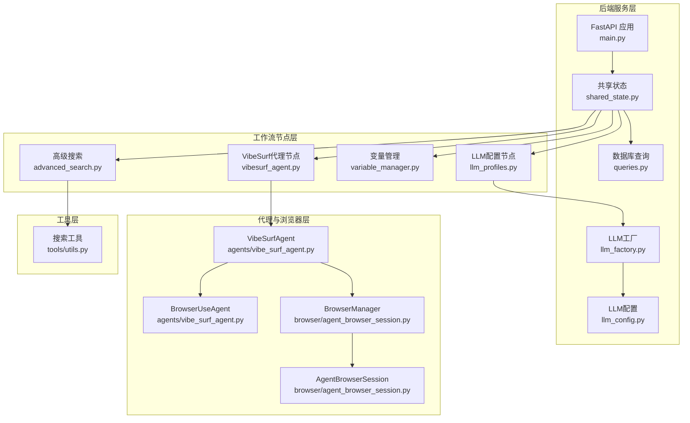
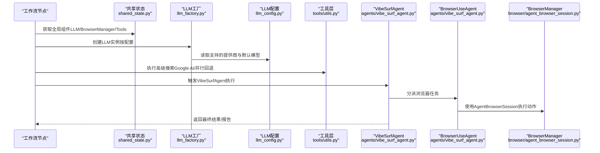
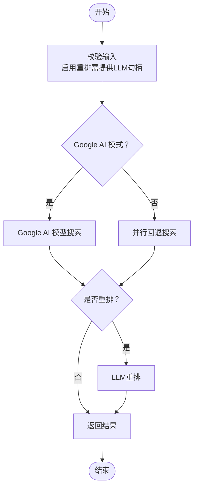
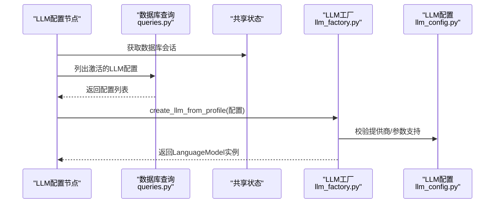
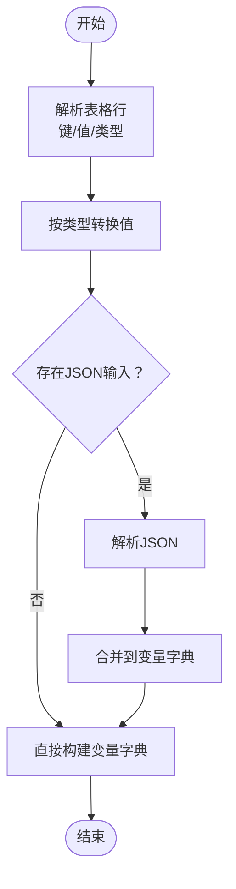
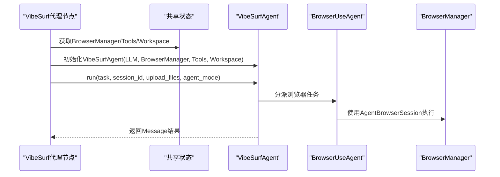
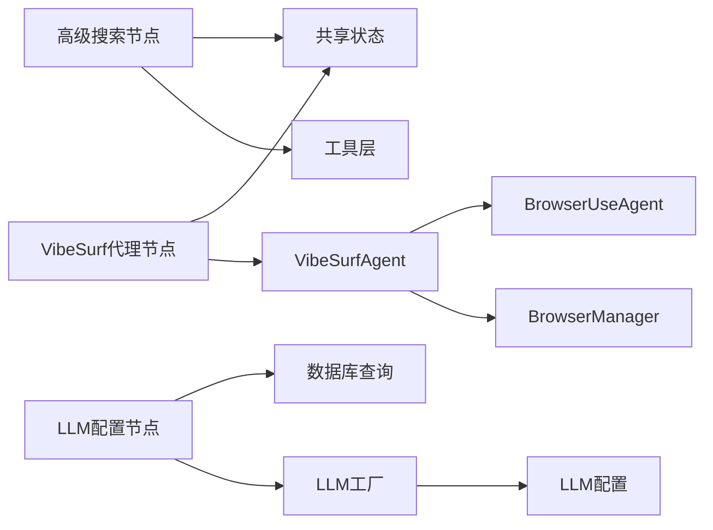

# VibeSurf核心节点

<cite>
**本文引用的文件列表**
- [advanced_search.py](file://vibe_surf/workflows/VibeSurf/advanced_search.py)
- [llm_profiles.py](file://vibe_surf/workflows/VibeSurf/llm_profiles.py)
- [variable_manager.py](file://vibe_surf/workflows/VibeSurf/variable_manager.py)
- [vibesurf_agent.py](file://vibe_surf/workflows/VibeSurf/vibesurf_agent.py)
- [llm_config.py](file://vibe_surf/backend/llm_config.py)
- [llm_factory.py](file://vibe_surf/backend/utils/llm_factory.py)
- [utils.py](file://vibe_surf/tools/utils.py)
- [shared_state.py](file://vibe_surf/backend/shared_state.py)
- [vibesurf_agent.py（后端代理）](file://vibe_surf/agents/vibe_surf_agent.py)
- [agent_browser_session.py](file://vibe_surf/browser/agent_browser_session.py)
- [queries.py](file://vibe_surf/backend/database/queries.py)
- [main.py](file://vibe_surf/backend/main.py)
</cite>

## 目录
1. [简介](#简介)
2. [项目结构](#项目结构)
3. [核心组件](#核心组件)
4. [架构总览](#架构总览)
5. [详细组件分析](#详细组件分析)
6. [依赖关系分析](#依赖关系分析)
7. [性能考量](#性能考量)
8. [故障排查指南](#故障排查指南)
9. [结论](#结论)
10. [附录：高级组合模式](#附录高级组合模式)

## 简介
本文件面向VibeSurf核心工作流节点的系统化文档化，重点覆盖以下能力：
- 高级搜索：支持Google AI模型直搜与并行回退搜索，并可选LLM重排提升结果相关性
- LLM配置管理：从数据库动态加载LLM配置，统一工厂创建与参数校验
- 变量管理：以表格与JSON输入方式构建键值变量字典，支持类型转换与增量更新
- 代理控制：通过VibeSurf Agent节点编排浏览器任务、报告生成与多Agent并行执行，支持暂停/停止/恢复等控制态

这些节点共同支撑VibeSurf的AI自动化能力，与代理系统、LLM集成模块深度耦合，形成“配置-检索-执行-输出”的闭环。

## 项目结构
VibeSurf采用分层架构：
- 后端服务层：FastAPI应用、共享状态、数据库查询、LLM配置与工厂
- 工作流节点层：VibeSurf专属节点（高级搜索、LLM配置、变量管理、代理）
- 代理与浏览器层：VibeSurf Agent、BrowserUseAgent、BrowserManager、AgentBrowserSession
- 搜索工具层：通用工具函数（如Google AI搜索、并行搜索、JS代码生成）

图表来源
- [main.py](file://vibe_surf/backend/main.py#L1-L200)
- [shared_state.py](file://vibe_surf/backend/shared_state.py#L1-L200)
- [llm_config.py](file://vibe_surf/backend/llm_config.py#L1-L226)
- [llm_factory.py](file://vibe_surf/backend/utils/llm_factory.py#L1-L275)
- [advanced_search.py](file://vibe_surf/workflows/VibeSurf/advanced_search.py#L1-L115)
- [llm_profiles.py](file://vibe_surf/workflows/VibeSurf/llm_profiles.py#L1-L104)
- [variable_manager.py](file://vibe_surf/workflows/VibeSurf/variable_manager.py#L1-L141)
- [vibesurf_agent.py](file://vibe_surf/workflows/VibeSurf/vibesurf_agent.py#L1-L114)
- [vibesurf_agent.py（后端代理）](file://vibe_surf/agents/vibe_surf_agent.py#L1-L200)
- [agent_browser_session.py](file://vibe_surf/browser/agent_browser_session.py#L1-L200)
- [utils.py](file://vibe_surf/tools/utils.py#L1-L200)

章节来源
- [main.py](file://vibe_surf/backend/main.py#L1-L200)
- [shared_state.py](file://vibe_surf/backend/shared_state.py#L1-L200)

## 核心组件
- 高级搜索节点：提供“Google AI直搜”与“并行回退搜索”两种模式，支持最大结果数限制与可选LLM重排
- LLM配置节点：动态拉取数据库中的LLM配置，构建可用的LanguageModel句柄
- 变量管理节点：将表格与JSON输入转换为变量字典，支持类型转换与增量合并
- VibeSurf代理节点：封装VibeSurfAgent运行逻辑，对接BrowserUseAgent与报告生成器，支持多种Agent模式

章节来源
- [advanced_search.py](file://vibe_surf/workflows/VibeSurf/advanced_search.py#L1-L115)
- [llm_profiles.py](file://vibe_surf/workflows/VibeSurf/llm_profiles.py#L1-L104)
- [variable_manager.py](file://vibe_surf/workflows/VibeSurf/variable_manager.py#L1-L141)
- [vibesurf_agent.py](file://vibe_surf/workflows/VibeSurf/vibesurf_agent.py#L1-L114)

## 架构总览
VibeSurf核心节点与代理系统的交互路径如下：
- 节点通过共享状态访问全局组件（BrowserManager、VibeSurfTools、LLM实例）
- LLM配置节点经由LLM工厂与配置表驱动LLM实例创建与参数校验
- 高级搜索节点使用工具层实现Google AI直搜或并行回退搜索，并可选LLM重排
- VibeSurf代理节点基于LangGraph状态机编排任务，调度BrowserUseAgent执行浏览器动作与报告生成

图表来源
- [shared_state.py](file://vibe_surf/backend/shared_state.py#L1-L200)
- [llm_factory.py](file://vibe_surf/backend/utils/llm_factory.py#L1-L275)
- [llm_config.py](file://vibe_surf/backend/llm_config.py#L1-L226)
- [utils.py](file://vibe_surf/tools/utils.py#L1-L200)
- [vibesurf_agent.py（后端代理）](file://vibe_surf/agents/vibe_surf_agent.py#L1-L200)
- [agent_browser_session.py](file://vibe_surf/browser/agent_browser_session.py#L1-L200)

## 详细组件分析

### 高级搜索节点（AdvancedSearchComponent）
- 功能要点
  - 支持两种模式：Google AI模型搜索与并行回退搜索
  - 可选LLM重排，提升结果相关性
  - 支持最大结果数限制
- 输入参数
  - 查询文本、是否启用Google AI模式、是否重排、LLM句柄、最大结果数
- 输出
  - Data对象，包含响应文本与来源列表
- 关键流程
  - 参数校验（启用重排时必须提供LLM句柄）
  - 从共享状态获取BrowserManager
  - 根据模式选择直搜或并行回退策略
  - 如启用重排，调用LLM对结果进行重排
- 错误处理
  - 异常捕获并记录日志，返回空Data

图表来源
- [advanced_search.py](file://vibe_surf/workflows/VibeSurf/advanced_search.py#L1-L115)
- [utils.py](file://vibe_surf/tools/utils.py#L357-L740)

章节来源
- [advanced_search.py](file://vibe_surf/workflows/VibeSurf/advanced_search.py#L1-L115)
- [utils.py](file://vibe_surf/tools/utils.py#L357-L740)

### LLM配置节点（LLMProfilesComponent）
- 功能要点
  - 动态加载可用LLM配置，支持默认配置与实时刷新
  - 将数据库中的LLM配置转换为LanguageModel实例
- 输入参数
  - 下拉选择的LLM配置名称
- 输出
  - LanguageModel句柄
- 关键流程
  - 从共享状态获取数据库会话
  - 查询激活且默认的LLM配置
  - 通过LLM工厂创建具体LLM实例
- 错误处理
  - 未找到配置时设置状态并抛出异常

图表来源
- [llm_profiles.py](file://vibe_surf/workflows/VibeSurf/llm_profiles.py#L1-L104)
- [queries.py](file://vibe_surf/backend/database/queries.py#L1-L200)
- [llm_factory.py](file://vibe_surf/backend/utils/llm_factory.py#L1-L275)
- [llm_config.py](file://vibe_surf/backend/llm_config.py#L1-L226)

章节来源
- [llm_profiles.py](file://vibe_surf/workflows/VibeSurf/llm_profiles.py#L1-L104)
- [queries.py](file://vibe_surf/backend/database/queries.py#L1-L200)
- [llm_factory.py](file://vibe_surf/backend/utils/llm_factory.py#L1-L275)
- [llm_config.py](file://vibe_surf/backend/llm_config.py#L1-L226)

### 变量管理节点（VariableManagerComponent）
- 功能要点
  - 表格输入：键、值、描述、类型
  - JSON输入：增量更新现有变量
  - 类型转换：整型、浮点、布尔、字典、列表
- 输出
  - Data对象，包含变量字典
- 关键流程
  - 解析表格行，按类型转换值
  - 解析JSON输入，合并到当前变量集
  - 记录转换错误并继续处理
- 错误处理
  - JSON修复与类型转换异常记录日志

图表来源
- [variable_manager.py](file://vibe_surf/workflows/VibeSurf/variable_manager.py#L1-L141)

章节来源
- [variable_manager.py](file://vibe_surf/workflows/VibeSurf/variable_manager.py#L1-L141)

### VibeSurf代理节点（VibeSurfAgentComponent）
- 功能要点
  - 接收任务、LLM句柄、扩展系统提示、上传文件、Agent模式
  - 初始化VibeSurfAgent并运行
  - 返回消息结果
- 关键流程
  - 从共享状态获取BrowserManager与VibeSurfTools
  - 构造VibeSurfAgent并执行任务
  - 处理异常并抛出
- 控制态
  - 支持会话ID传递，便于跟踪与报告生成

图表来源
- [vibesurf_agent.py](file://vibe_surf/workflows/VibeSurf/vibesurf_agent.py#L1-L114)
- [shared_state.py](file://vibe_surf/backend/shared_state.py#L1-L200)
- [vibesurf_agent.py（后端代理）](file://vibe_surf/agents/vibe_surf_agent.py#L1-L200)
- [agent_browser_session.py](file://vibe_surf/browser/agent_browser_session.py#L1-L200)

章节来源
- [vibesurf_agent.py](file://vibe_surf/workflows/VibeSurf/vibesurf_agent.py#L1-L114)
- [shared_state.py](file://vibe_surf/backend/shared_state.py#L1-L200)
- [vibesurf_agent.py（后端代理）](file://vibe_surf/agents/vibe_surf_agent.py#L1-L200)
- [agent_browser_session.py](file://vibe_surf/browser/agent_browser_session.py#L1-L200)

## 依赖关系分析
- 组件耦合
  - 高级搜索节点依赖共享状态中的BrowserManager与工具层搜索函数
  - LLM配置节点依赖数据库查询与LLM工厂
  - VibeSurf代理节点依赖共享状态中的BrowserManager、Tools与Workspace
- 外部依赖
  - LLM工厂依赖LLM配置表与各提供商SDK
  - 工具层依赖浏览器CDP与第三方搜索接口
- 循环依赖
  - 通过共享状态集中管理全局组件，避免循环导入

图表来源
- [advanced_search.py](file://vibe_surf/workflows/VibeSurf/advanced_search.py#L1-L115)
- [llm_profiles.py](file://vibe_surf/workflows/VibeSurf/llm_profiles.py#L1-L104)
- [vibesurf_agent.py](file://vibe_surf/workflows/VibeSurf/vibesurf_agent.py#L1-L114)
- [shared_state.py](file://vibe_surf/backend/shared_state.py#L1-L200)
- [llm_factory.py](file://vibe_surf/backend/utils/llm_factory.py#L1-L275)
- [llm_config.py](file://vibe_surf/backend/llm_config.py#L1-L226)
- [vibesurf_agent.py（后端代理）](file://vibe_surf/agents/vibe_surf_agent.py#L1-L200)
- [agent_browser_session.py](file://vibe_surf/browser/agent_browser_session.py#L1-L200)

章节来源
- [shared_state.py](file://vibe_surf/backend/shared_state.py#L1-L200)
- [llm_factory.py](file://vibe_surf/backend/utils/llm_factory.py#L1-L275)
- [llm_config.py](file://vibe_surf/backend/llm_config.py#L1-L226)
- [vibesurf_agent.py（后端代理）](file://vibe_surf/agents/vibe_surf_agent.py#L1-L200)
- [agent_browser_session.py](file://vibe_surf/browser/agent_browser_session.py#L1-L200)

## 性能考量
- 搜索性能
  - Google AI直搜：依赖网络请求与页面渲染，建议合理设置最大结果数
  - 并行回退搜索：并发打开多个标签页，注意浏览器资源占用与CDP连接稳定性
- LLM调用
  - 参数校验与默认值设置减少无效调用
  - 重排步骤增加一次LLM调用，建议在结果规模较大时启用
- 浏览器执行
  - 并行BrowserUseAgent任务可显著提升吞吐，但需监控内存与CPU
  - 建议在高负载场景下降低并行度或启用暂停/恢复机制
- 数据库访问
  - LLM配置节点批量查询与缓存，避免频繁I/O

[本节为通用指导，不直接分析具体文件]

## 故障排查指南
- LLM配置问题
  - 确认提供商名称与模型是否受支持；检查API密钥与基础URL配置
  - 若创建失败，查看工厂日志与异常栈
- 搜索失败
  - Google AI直搜可能因页面结构变化导致提取失败；可切换为并行回退搜索
  - 检查浏览器连接状态与CDP会话有效性
- 代理执行异常
  - 查看VibeSurfAgent与BrowserUseAgent的日志与活动记录
  - 检查上传文件路径与权限
- 变量管理
  - JSON输入格式错误时会尝试修复；若仍失败，请检查键名与数据类型

章节来源
- [llm_factory.py](file://vibe_surf/backend/utils/llm_factory.py#L1-L275)
- [utils.py](file://vibe_surf/tools/utils.py#L1-L200)
- [vibesurf_agent.py（后端代理）](file://vibe_surf/agents/vibe_surf_agent.py#L1-L200)
- [variable_manager.py](file://vibe_surf/workflows/VibeSurf/variable_manager.py#L1-L141)

## 结论
VibeSurf核心节点围绕“配置-检索-执行-输出”闭环构建，通过LLM配置管理与高级搜索实现信息获取，借助VibeSurf代理节点实现浏览器自动化与报告生成。共享状态与工具层确保了跨模块协作的稳定性与可维护性。

[本节为总结性内容，不直接分析具体文件]

## 附录：高级组合模式
- 搜索+重排+代理
  - 使用高级搜索节点获取高质量来源，启用LLM重排提升相关性，再交由VibeSurf代理节点执行浏览器任务
- 多Agent并行
  - 在VibeSurf代理节点中启用并行模式，同时调度多个BrowserUseAgent执行不同任务
- 动态LLM切换
  - 通过LLM配置节点动态切换LLM配置，无需重启服务
- 变量注入
  - 使用变量管理节点将外部输入注入到工作流，结合代理节点的系统提示扩展

[本节为概念性内容，不直接分析具体文件]