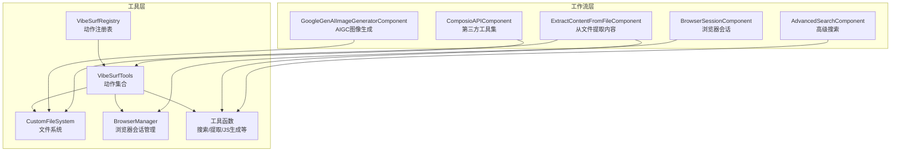
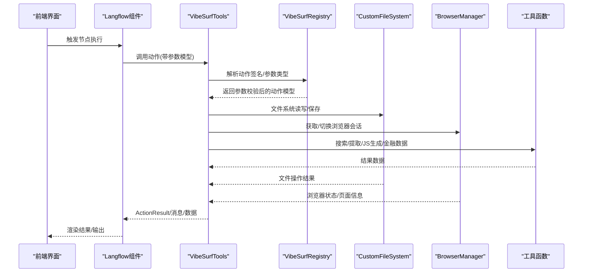
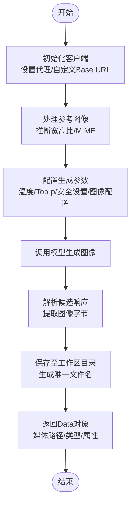
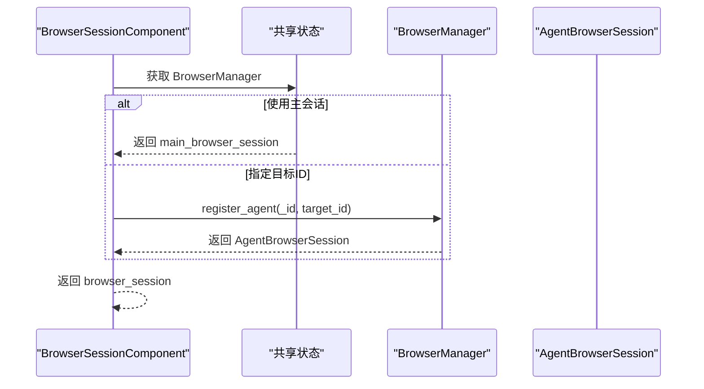
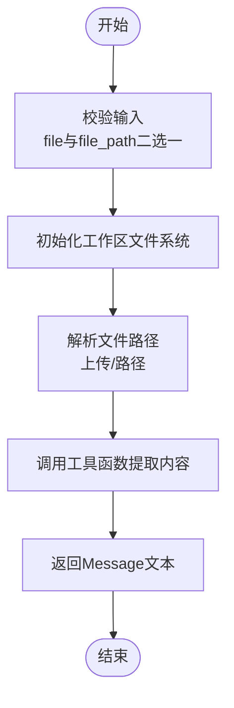
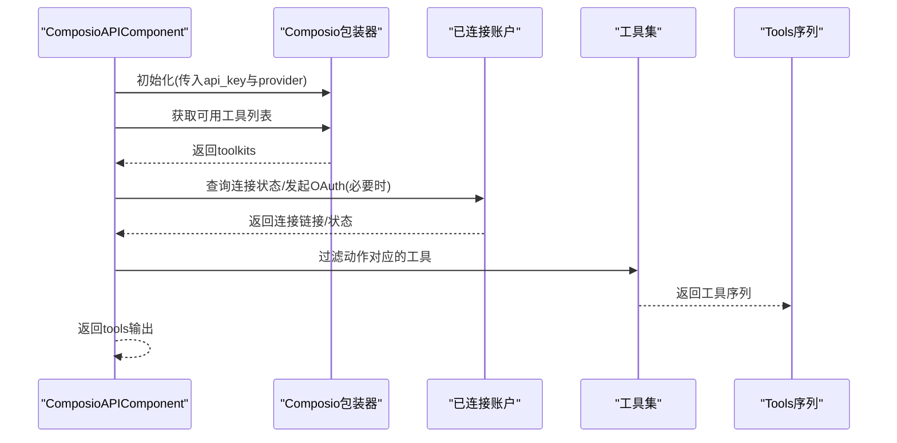
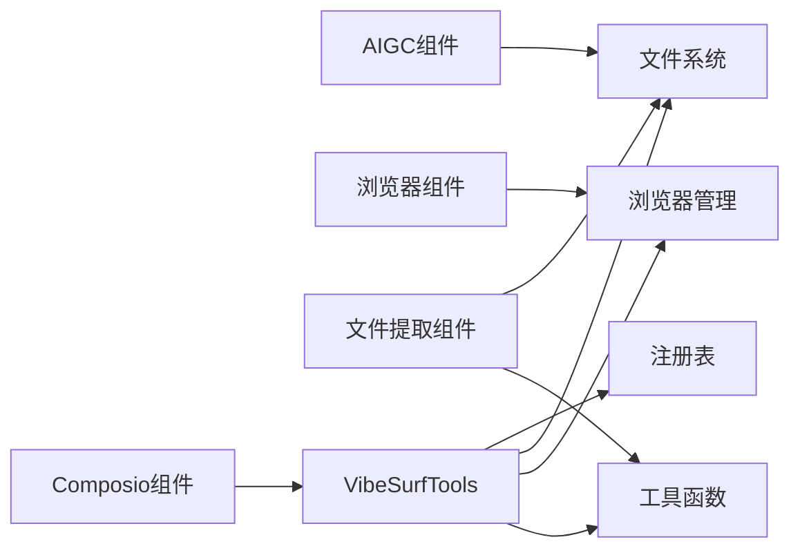

# 工作流节点库

<cite>
**本文引用的文件列表**
- [vibe_surf/tools/vibesurf_tools.py](file://vibe_surf/tools/vibesurf_tools.py)
- [vibe_surf/tools/vibesurf_registry.py](file://vibe_surf/tools/vibesurf_registry.py)
- [vibe_surf/workflows/AIGC/genai_image_generator.py](file://vibe_surf/workflows/AIGC/genai_image_generator.py)
- [vibe_surf/workflows/Browser/browser_session.py](file://vibe_surf/workflows/Browser/browser_session.py)
- [vibe_surf/workflows/FileSystem/extract_content_from_file.py](file://vibe_surf/workflows/FileSystem/extract_content_from_file.py)
- [vibe_surf/workflows/Integrations/composio_api.py](file://vibe_surf/workflows/Integrations/composio_api.py)
- [vibe_surf/workflows/VibeSurf/advanced_search.py](file://vibe_surf/workflows/VibeSurf/advanced_search.py)
- [vibe_surf/tools/utils.py](file://vibe_surf/tools/utils.py)
- [vibe_surf/tools/views.py](file://vibe_surf/tools/views.py)
- [vibe_surf/tools/file_system.py](file://vibe_surf/tools/file_system.py)
- [vibe_surf/browser/browser_manager.py](file://vibe_surf/browser/browser_manager.py)
- [tests/test_tools.py](file://tests/test_tools.py)
- [tests/test_api_tools.py](file://tests/test_api_tools.py)
</cite>

## 目录
1. [简介](#简介)
2. [项目结构](#项目结构)
3. [核心组件](#核心组件)
4. [架构总览](#架构总览)
5. [详细组件分析](#详细组件分析)
6. [依赖关系分析](#依赖关系分析)
7. [性能考量](#性能考量)
8. [故障排查指南](#故障排查指南)
9. [结论](#结论)
10. [附录](#附录)

## 简介
本系统文档围绕“工作流节点库”的设计与实现展开，系统性梳理了预定义工作流节点（AIGC生成、浏览器操作、文件系统操作、第三方集成等）的输入参数、输出结果与执行逻辑，并给出可扩展机制、依赖关系与数据流模式、最佳实践、版本控制与兼容策略以及测试指南。文档面向不同技术背景的读者，既提供高层概览，也包含代码级细节与可视化图示，便于快速理解与落地使用。

## 项目结构
工作流节点库由“工具层”和“工作流层”组成：
- 工具层：通过注册表统一管理动作（actions），支持浏览器会话、文件系统、第三方集成（如 Composio、MCP）、AIGC 生成等能力。
- 工作流层：以 Langflow 组件形式封装具体节点，暴露标准化输入/输出接口，便于在前端可视化编辑器中拖拽编排。

图表来源
- [vibe_surf/tools/vibesurf_registry.py](file://vibe_surf/tools/vibesurf_registry.py#L1-L53)
- [vibe_surf/tools/vibesurf_tools.py](file://vibe_surf/tools/vibesurf_tools.py#L1-L120)
- [vibe_surf/tools/file_system.py](file://vibe_surf/tools/file_system.py#L1-L120)
- [vibe_surf/browser/browser_manager.py](file://vibe_surf/browser/browser_manager.py#L1-L120)
- [vibe_surf/tools/utils.py](file://vibe_surf/tools/utils.py#L1-L120)
- [vibe_surf/workflows/AIGC/genai_image_generator.py](file://vibe_surf/workflows/AIGC/genai_image_generator.py#L1-L120)
- [vibe_surf/workflows/Browser/browser_session.py](file://vibe_surf/workflows/Browser/browser_session.py#L1-L55)
- [vibe_surf/workflows/FileSystem/extract_content_from_file.py](file://vibe_surf/workflows/FileSystem/extract_content_from_file.py#L1-L112)
- [vibe_surf/workflows/Integrations/composio_api.py](file://vibe_surf/workflows/Integrations/composio_api.py#L1-L120)
- [vibe_surf/workflows/VibeSurf/advanced_search.py](file://vibe_surf/workflows/VibeSurf/advanced_search.py#L1-L115)

章节来源
- [vibe_surf/tools/vibesurf_registry.py](file://vibe_surf/tools/vibesurf_registry.py#L1-L53)
- [vibe_surf/tools/vibesurf_tools.py](file://vibe_surf/tools/vibesurf_tools.py#L1-L120)

## 核心组件
- 动作注册表与工具集合
  - 注册表负责解析特殊参数类型（如浏览器会话、LLM、文件系统等），并为动作提供统一的参数模型与调用入口。
  - 工具集合在注册表基础上注册各类动作，涵盖技能型（搜索、抓取、总结、截图、代码生成、金融数据）、第三方集成（Composio、MCP）、网站 API（小红书、微博、抖音、YouTube 等）以及文件系统操作。
- 浏览器会话管理
  - 提供主会话与代理会话的注册、目标页分配、清理与关闭等能力，保障多代理隔离与安全。
- 文件系统
  - 封装读写、复制、移动、重命名、列出目录、保存提取内容等操作，支持多种文件类型与安全路径限制。
- 工作流组件
  - 以 Langflow 组件形式暴露输入/输出，便于在前端可视化构建流程；组件内部调用工具层能力完成具体任务。

章节来源
- [vibe_surf/tools/vibesurf_registry.py](file://vibe_surf/tools/vibesurf_registry.py#L1-L53)
- [vibe_surf/tools/vibesurf_tools.py](file://vibe_surf/tools/vibesurf_tools.py#L1-L120)
- [vibe_surf/browser/browser_manager.py](file://vibe_surf/browser/browser_manager.py#L1-L120)
- [vibe_surf/tools/file_system.py](file://vibe_surf/tools/file_system.py#L1-L120)

## 架构总览
下图展示从“动作注册表”到“工作流组件”的调用链路与数据流。

图表来源
- [vibe_surf/tools/vibesurf_tools.py](file://vibe_surf/tools/vibesurf_tools.py#L1-L120)
- [vibe_surf/tools/vibesurf_registry.py](file://vibe_surf/tools/vibesurf_registry.py#L1-L53)
- [vibe_surf/tools/file_system.py](file://vibe_surf/tools/file_system.py#L1-L120)
- [vibe_surf/browser/browser_manager.py](file://vibe_surf/browser/browser_manager.py#L1-L120)
- [vibe_surf/tools/utils.py](file://vibe_surf/tools/utils.py#L1-L120)

## 详细组件分析

### AIGC 生成类节点
- GoogleGenAIImageGeneratorComponent
  - 输入参数
    - api_key：必填，用于访问 Google Generative AI。
    - use_vertex：是否使用 Vertex AI 客户端。
    - prompt：必填，图像生成提示词。
    - image_file/image_path：可选，参考图像文件或路径。
    - model_name：模型名称选择。
    - proxy/base_url：可选，代理与自定义 Base URL。
    - aspect_ratio/resolution：可选，宽高比与分辨率。
  - 输出结果
    - media_output：返回媒体数据对象，包含路径、类型、可播放/循环等属性。
  - 执行逻辑
    - 初始化客户端（支持代理与自定义 Base URL）。
    - 处理参考图像（自动推断宽高比与 MIME 类型）。
    - 配置生成参数（温度、Top-p、安全设置、图像配置）。
    - 调用模型生成图像，解析候选响应，保存至工作区目录并返回 Data 对象。
  - 关键实现位置
    - [vibe_surf/workflows/AIGC/genai_image_generator.py](file://vibe_surf/workflows/AIGC/genai_image_generator.py#L1-L285)

图表来源
- [vibe_surf/workflows/AIGC/genai_image_generator.py](file://vibe_surf/workflows/AIGC/genai_image_generator.py#L90-L285)

章节来源
- [vibe_surf/workflows/AIGC/genai_image_generator.py](file://vibe_surf/workflows/AIGC/genai_image_generator.py#L1-L285)

### 浏览器操作类节点
- BrowserSessionComponent
  - 输入参数
    - use_main_session：是否使用主会话。
    - target_id：目标标签页 ID（可选）。
  - 输出结果
    - browser_session：返回 AgentBrowserSession 实例。
  - 执行逻辑
    - 从共享状态获取 BrowserManager，按需注册代理会话或直接返回主会话。
    - 支持根据 target_id 切换或创建新标签页。
  - 关键实现位置
    - [vibe_surf/workflows/Browser/browser_session.py](file://vibe_surf/workflows/Browser/browser_session.py#L1-L55)

图表来源
- [vibe_surf/workflows/Browser/browser_session.py](file://vibe_surf/workflows/Browser/browser_session.py#L1-L55)
- [vibe_surf/browser/browser_manager.py](file://vibe_surf/browser/browser_manager.py#L1-L120)

章节来源
- [vibe_surf/workflows/Browser/browser_session.py](file://vibe_surf/workflows/Browser/browser_session.py#L1-L55)
- [vibe_surf/browser/browser_manager.py](file://vibe_surf/browser/browser_manager.py#L1-L120)

### 文件系统操作类节点
- ExtractContentFromFileComponent
  - 输入参数
    - llm：语言模型句柄（必填）。
    - query：查询或指令（必填）。
    - file/file_path：二选一，上传文件或指定路径。
  - 输出结果
    - extracted_content：返回 Message 文本，包含提取结果。
  - 执行逻辑
    - 校验输入（二选一）。
    - 基于会话 ID 初始化工作区文件系统。
    - 调用工具函数进行文件内容提取（支持图片与文本）。
  - 关键实现位置
    - [vibe_surf/workflows/FileSystem/extract_content_from_file.py](file://vibe_surf/workflows/FileSystem/extract_content_from_file.py#L1-L112)

图表来源
- [vibe_surf/workflows/FileSystem/extract_content_from_file.py](file://vibe_surf/workflows/FileSystem/extract_content_from_file.py#L1-L112)
- [vibe_surf/tools/utils.py](file://vibe_surf/tools/utils.py#L1-L120)
- [vibe_surf/tools/file_system.py](file://vibe_surf/tools/file_system.py#L1-L120)

章节来源
- [vibe_surf/workflows/FileSystem/extract_content_from_file.py](file://vibe_surf/workflows/FileSystem/extract_content_from_file.py#L1-L112)
- [vibe_surf/tools/file_system.py](file://vibe_surf/tools/file_system.py#L1-L120)

### 第三方集成类节点
- ComposioAPIComponent
  - 输入参数
    - entity_id：实体 ID（默认 default）。
    - api_key：Composio API Key（必填）。
    - tool_name：工具名称（下拉选项，动态加载）。
    - actions：动作列表（限选一个）。
  - 输出结果
    - tools：返回 LangChain Tool 序列。
  - 执行逻辑
    - 构建 Composio 包装器，检查连接状态与认证配置。
    - 动态更新可用工具列表与动作选项。
    - 根据所选动作过滤并返回对应工具。
  - 关键实现位置
    - [vibe_surf/workflows/Integrations/composio_api.py](file://vibe_surf/workflows/Integrations/composio_api.py#L1-L280)

图表来源
- [vibe_surf/workflows/Integrations/composio_api.py](file://vibe_surf/workflows/Integrations/composio_api.py#L1-L280)

章节来源
- [vibe_surf/workflows/Integrations/composio_api.py](file://vibe_surf/workflows/Integrations/composio_api.py#L1-L280)

### VibeSurf 技能与高级搜索
- AdvancedSearchComponent
  - 输入参数
    - query：搜索关键词（必填）。
    - google_ai_mode：是否使用 Google AI 模式（默认启用）。
    - rerank：是否使用 LLM 重排（需提供 LLM）。
    - llm：LLM 句柄（当 rerank 启用时必填）。
    - max_results：最大返回条数。
  - 输出结果
    - search_results：返回 Data 数据对象，包含搜索结果。
  - 执行逻辑
    - 从共享状态获取 BrowserManager。
    - 根据模式调用 Google AI 模式或回退并行搜索。
    - 如启用重排，则使用 LLM 对结果进行重排。
  - 关键实现位置
    - [vibe_surf/workflows/VibeSurf/advanced_search.py](file://vibe_surf/workflows/VibeSurf/advanced_search.py#L1-L115)

- VibeSurfTools 中的技能动作（部分）
  - 参数模型定义集中在视图模块，包含搜索、抓取、总结、截图、代码生成、金融数据、社交媒体 API 等。
  - 关键实现位置
    - [vibe_surf/tools/views.py](file://vibe_surf/tools/views.py#L1-L200)
    - [vibe_surf/tools/vibesurf_tools.py](file://vibe_surf/tools/vibesurf_tools.py#L100-L220)

章节来源
- [vibe_surf/workflows/VibeSurf/advanced_search.py](file://vibe_surf/workflows/VibeSurf/advanced_search.py#L1-L115)
- [vibe_surf/tools/views.py](file://vibe_surf/tools/views.py#L1-L200)
- [vibe_surf/tools/vibesurf_tools.py](file://vibe_surf/tools/vibesurf_tools.py#L100-L220)

## 依赖关系分析
- 组件耦合与内聚
  - 工具层通过注册表集中管理动作，降低节点对底层实现的直接依赖，提升内聚性与可替换性。
  - 工作流组件仅依赖 Langflow 的输入/输出接口，不直接耦合业务细节。
- 直接与间接依赖
  - 工作流组件依赖工具层（文件系统、浏览器管理、工具函数）。
  - 工具层依赖第三方 SDK（如 Composio、Google GenAI）与浏览器自动化框架。
- 可能的循环依赖
  - 当前结构以工具层为中介，避免了工作流组件之间的直接循环依赖。
- 外部依赖与集成点
  - 浏览器自动化、第三方 API、文件系统、LLM 接口等均作为外部依赖接入。

图表来源
- [vibe_surf/workflows/AIGC/genai_image_generator.py](file://vibe_surf/workflows/AIGC/genai_image_generator.py#L1-L120)
- [vibe_surf/workflows/Browser/browser_session.py](file://vibe_surf/workflows/Browser/browser_session.py#L1-L55)
- [vibe_surf/workflows/FileSystem/extract_content_from_file.py](file://vibe_surf/workflows/FileSystem/extract_content_from_file.py#L1-L112)
- [vibe_surf/workflows/Integrations/composio_api.py](file://vibe_surf/workflows/Integrations/composio_api.py#L1-L120)
- [vibe_surf/tools/vibesurf_tools.py](file://vibe_surf/tools/vibesurf_tools.py#L1-L120)
- [vibe_surf/tools/vibesurf_registry.py](file://vibe_surf/tools/vibesurf_registry.py#L1-L53)
- [vibe_surf/tools/file_system.py](file://vibe_surf/tools/file_system.py#L1-L120)
- [vibe_surf/browser/browser_manager.py](file://vibe_surf/browser/browser_manager.py#L1-L120)
- [vibe_surf/tools/utils.py](file://vibe_surf/tools/utils.py#L1-L120)

章节来源
- [vibe_surf/tools/vibesurf_tools.py](file://vibe_surf/tools/vibesurf_tools.py#L1-L120)
- [vibe_surf/tools/vibesurf_registry.py](file://vibe_surf/tools/vibesurf_registry.py#L1-L53)
- [vibe_surf/tools/file_system.py](file://vibe_surf/tools/file_system.py#L1-L120)
- [vibe_surf/browser/browser_manager.py](file://vibe_surf/browser/browser_manager.py#L1-L120)
- [vibe_surf/tools/utils.py](file://vibe_surf/tools/utils.py#L1-L120)

## 性能考量
- 并发与异步
  - 多数节点采用异步实现，充分利用事件循环与并发 I/O，减少阻塞。
- 资源管理
  - 浏览器会话按代理隔离，避免跨代理干扰；文件系统操作采用线程池执行耗时复制/移动。
- 上下文裁剪
  - 在大页面 HTML 提取时进行上下文裁剪，避免超长上下文导致性能问题。
- 缓存与复用
  - 浏览器状态缓存与 DOM Watchdog 有助于减少重复计算与网络请求。
- I/O 优化
  - PDF 读取限制页数，避免一次性加载过多内容；文件系统路径解析与安全检查减少无效 I/O。

章节来源
- [vibe_surf/tools/utils.py](file://vibe_surf/tools/utils.py#L120-L200)
- [vibe_surf/tools/file_system.py](file://vibe_surf/tools/file_system.py#L120-L220)
- [vibe_surf/browser/browser_manager.py](file://vibe_surf/browser/browser_manager.py#L120-L220)

## 故障排查指南
- 常见错误与定位
  - 文件系统错误：文件不存在、权限不足、非法文件名等，返回明确错误信息。
  - 浏览器连接失败：检查主会话连接状态与目标页有效性。
  - 第三方 API 认证失败：确认 API Key、OAuth 连接状态与工具集可用性。
  - 组件序列化/异步调用错误：确保返回值可 JSON 化且正确 await 异步函数。
- 测试用例参考
  - MCP 与文件系统测试：验证动作参数模型与执行结果。
  - 第三方集成测试：验证 Composio 工具注册与执行。
  - 网站 API 测试：验证各平台 API 客户端功能。
- 关键实现位置
  - [tests/test_tools.py](file://tests/test_tools.py#L1-L251)
  - [tests/test_api_tools.py](file://tests/test_api_tools.py#L1-L142)

章节来源
- [tests/test_tools.py](file://tests/test_tools.py#L1-L251)
- [tests/test_api_tools.py](file://tests/test_api_tools.py#L1-L142)

## 结论
该工作流节点库通过“注册表+工具集合+组件封装”的分层设计，实现了对 AIGC、浏览器、文件系统与第三方集成的统一抽象与扩展。节点具备清晰的输入/输出契约、完善的错误处理与性能优化策略，并提供了可插拔的第三方集成与自定义工具扩展机制。建议在实际使用中遵循输入验证、异步 await、资源清理与日志记录的最佳实践，以确保稳定运行与良好可维护性。

## 附录

### 可扩展性机制
- 自定义工具节点
  - 通过注册表的动作装饰器注册新动作，自动解析参数模型与特殊参数类型。
  - 参考路径：[vibe_surf/tools/vibesurf_registry.py](file://vibe_surf/tools/vibesurf_registry.py#L1-L53)
- 集成新的第三方服务
  - 通过 Composio 或 MCP 客户端将外部工具注册为动作，统一参数模型与调用方式。
  - 参考路径：[vibe_surf/workflows/Integrations/composio_api.py](file://vibe_surf/workflows/Integrations/composio_api.py#L1-L280)
- 节点间依赖与数据流
  - 以 Langflow 组件模板与输出类型声明节点间连接关系，前端校验环路与类型匹配。
  - 参考路径：[vibe_surf/langflow/graph/vertex/base.py](file://vibe_surf/langflow/graph/vertex/base.py#L243-L274)

章节来源
- [vibe_surf/tools/vibesurf_registry.py](file://vibe_surf/tools/vibesurf_registry.py#L1-L53)
- [vibe_surf/workflows/Integrations/composio_api.py](file://vibe_surf/workflows/Integrations/composio_api.py#L1-L280)
- [vibe_surf/langflow/graph/vertex/base.py](file://vibe_surf/langflow/graph/vertex/base.py#L243-L274)

### 版本控制与向后兼容策略
- 组件版本管理
  - 启动时对项目中的组件进行版本更新与边沿升级，保证组件与类型映射一致。
  - 参考路径：[vibe_surf/langflow/initial_setup/setup.py](file://vibe_surf/langflow/initial_setup/setup.py#L924-L943)
- 数据库迁移与约束演进
  - 通过 Alembic 迁移脚本处理唯一性约束变更与重复数据处理，确保降级前的数据一致性。
  - 参考路径：[vibe_surf/langflow/alembic/versions/1cb603706752_modify_uniqueness_constraint_on_file_.py](file://vibe_surf/langflow/alembic/versions/1cb603706752_modify_uniqueness_constraint_on_file_.py#L159-L252)

章节来源
- [vibe_surf/langflow/initial_setup/setup.py](file://vibe_surf/langflow/initial_setup/setup.py#L924-L943)
- [vibe_surf/langflow/alembic/versions/1cb603706752_modify_uniqueness_constraint_on_file_.py](file://vibe_surf/langflow/alembic/versions/1cb603706752_modify_uniqueness_constraint_on_file_.py#L159-L252)

### 节点开发最佳实践
- 错误处理
  - 明确区分业务异常与系统异常，返回可读的错误信息并记录日志。
  - 参考路径：[vibe_surf/tools/file_system.py](file://vibe_surf/tools/file_system.py#L120-L220)
- 输入验证
  - 使用 Pydantic 模型进行参数校验，确保类型与范围约束。
  - 参考路径：[vibe_surf/tools/views.py](file://vibe_surf/tools/views.py#L1-L200)
- 性能优化
  - 控制上下文长度、限制 PDF 读取页数、使用线程池执行耗时 I/O。
  - 参考路径：[vibe_surf/tools/utils.py](file://vibe_surf/tools/utils.py#L120-L200)
- 可测试性
  - 提供独立测试用例覆盖动作执行、第三方集成与文件系统操作。
  - 参考路径：[tests/test_tools.py](file://tests/test_tools.py#L1-L251)，[tests/test_api_tools.py](file://tests/test_api_tools.py#L1-L142)

章节来源
- [vibe_surf/tools/file_system.py](file://vibe_surf/tools/file_system.py#L120-L220)
- [vibe_surf/tools/views.py](file://vibe_surf/tools/views.py#L1-L200)
- [vibe_surf/tools/utils.py](file://vibe_surf/tools/utils.py#L120-L200)
- [tests/test_tools.py](file://tests/test_tools.py#L1-L251)
- [tests/test_api_tools.py](file://tests/test_api_tools.py#L1-L142)