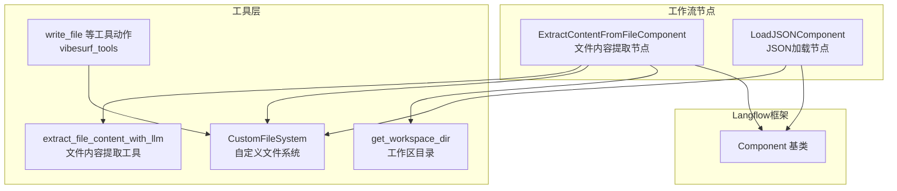
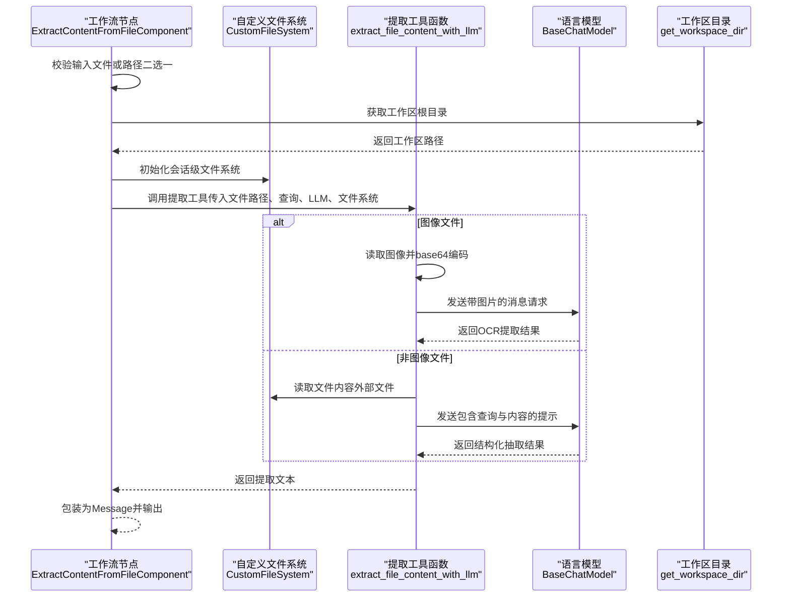
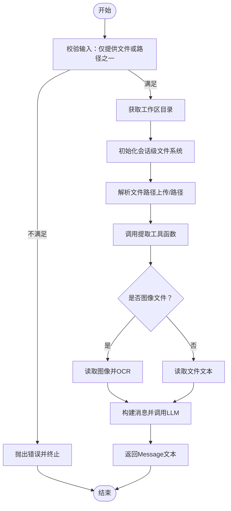
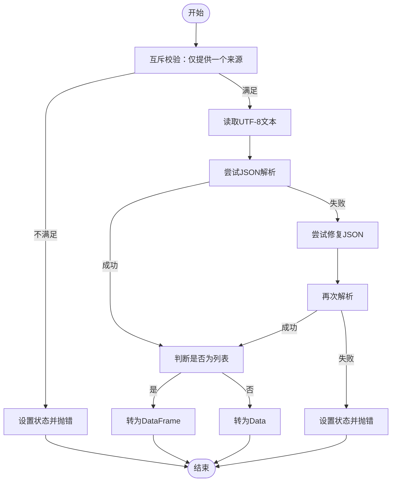
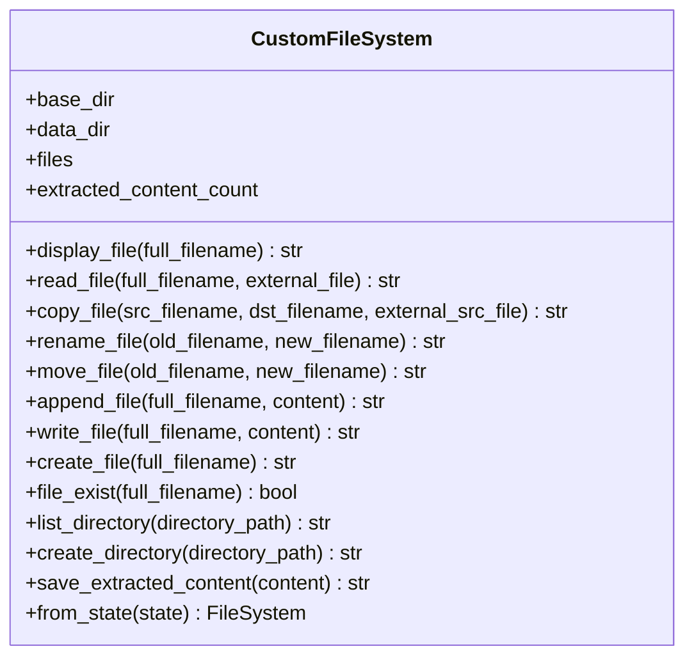
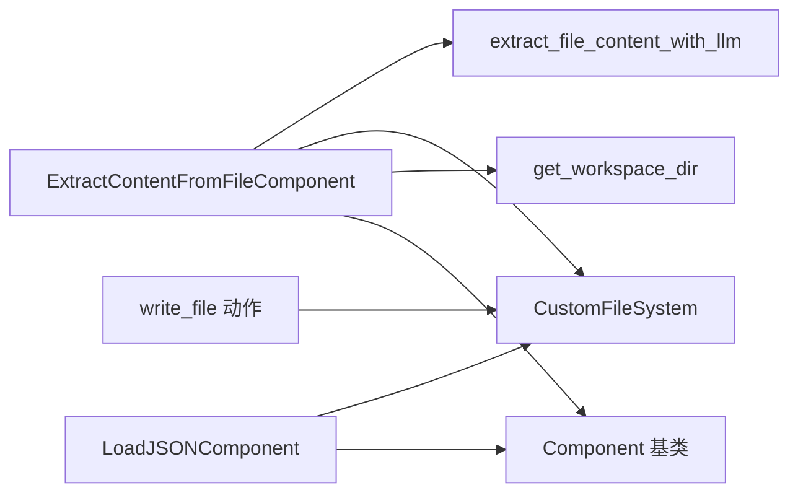

# 文件系统操作节点

<cite>
**本文引用的文件**
- [extract_content_from_file.py](file://vibe_surf/workflows/FileSystem/extract_content_from_file.py)
- [load_json.py](file://vibe_surf/workflows/FileSystem/load_json.py)
- [file_system.py](file://vibe_surf/tools/file_system.py)
- [utils.py](file://vibe_surf/tools/utils.py)
- [common.py](file://vibe_surf/common.py)
- [vibesurf_tools.py](file://vibe_surf/tools/vibesurf_tools.py)
- [component.py](file://vibe_surf/langflow/custom/custom_component/component.py)
</cite>

## 目录
1. [简介](#简介)
2. [项目结构](#项目结构)
3. [核心组件](#核心组件)
4. [架构总览](#架构总览)
5. [详细组件分析](#详细组件分析)
6. [依赖关系分析](#依赖关系分析)
7. [性能考量](#性能考量)
8. [故障排查指南](#故障排查指南)
9. [结论](#结论)
10. [附录](#附录)

## 简介
本文件系统操作节点文档聚焦于两类工作流节点：文件内容提取与JSON数据加载。前者通过LLM对文本或图像文件进行内容抽取；后者负责从文件或字符串中解析并规范化JSON数据，支持修复常见格式问题。文档将深入解析节点的文件路径处理、编码识别、数据解析机制，给出安全访问本地文件系统的最佳实践，解释节点在数据预处理与后处理阶段的作用及与其它数据处理节点的集成方式，并提供错误处理、权限管理与性能优化指导。

## 项目结构
围绕文件系统操作节点的相关模块分布如下：
- 工作流节点（Langflow 组件）
  - 文件内容提取节点：vibe_surf/workflows/FileSystem/extract_content_from_file.py
  - JSON 加载节点：vibe_surf/workflows/FileSystem/load_json.py
- 文件系统工具
  - 自定义文件系统实现：vibe_surf/tools/file_system.py
  - 提取工具函数（LLM 驱动）：vibe_surf/tools/utils.py
  - 工作区目录工具：vibe_surf/common.py
  - 通用工具动作注册（含写文件等）：vibe_surf/tools/vibesurf_tools.py
- 组件基类（Langflow）
  - 组件基类与运行时框架：vibe_surf/langflow/custom/custom_component/component.py

图表来源
- [extract_content_from_file.py](file://vibe_surf/workflows/FileSystem/extract_content_from_file.py#L1-L112)
- [load_json.py](file://vibe_surf/workflows/FileSystem/load_json.py#L1-L137)
- [file_system.py](file://vibe_surf/tools/file_system.py#L1-L438)
- [utils.py](file://vibe_surf/tools/utils.py#L1596-L1683)
- [common.py](file://vibe_surf/common.py#L1-L36)
- [vibesurf_tools.py](file://vibe_surf/tools/vibesurf_tools.py#L1838-L1862)
- [component.py](file://vibe_surf/langflow/custom/custom_component/component.py#L98-L120)

章节来源
- [extract_content_from_file.py](file://vibe_surf/workflows/FileSystem/extract_content_from_file.py#L1-L112)
- [load_json.py](file://vibe_surf/workflows/FileSystem/load_json.py#L1-L137)
- [file_system.py](file://vibe_surf/tools/file_system.py#L1-L438)
- [utils.py](file://vibe_surf/tools/utils.py#L1596-L1683)
- [common.py](file://vibe_surf/common.py#L1-L36)
- [vibesurf_tools.py](file://vibe_surf/tools/vibesurf_tools.py#L1838-L1862)
- [component.py](file://vibe_surf/langflow/custom/custom_component/component.py#L98-L120)

## 核心组件
- 文件内容提取节点（ExtractContentFromFileComponent）
  - 输入：语言模型、查询指令、上传文件或文件路径
  - 输出：Message 文本（提取结果）
  - 关键流程：校验输入、确定会话工作区、初始化自定义文件系统、调用工具函数进行提取
- JSON 加载节点（LoadJSONComponent）
  - 输入：JSON 文件、文件路径、JSON 字符串、是否返回 DataFrame
  - 输出：Data 或 DataFrame
  - 关键流程：互斥选择来源、读取文本、尝试解析、修复并转换为 Data/DataFrame
- 自定义文件系统（CustomFileSystem）
  - 支持 md、txt、json、csv、pdf、py、html、js 等扩展名
  - 提供读取、复制、移动、重命名、创建目录、列出目录、保存提取内容等能力
  - 内置安全检查（路径合法性、越界访问限制）
- 提取工具函数（extract_file_content_with_llm）
  - 判断图像/非图像类型，分别走视觉OCR或文本读取+LLM抽取
  - 对 PDF 进行页数限制读取
- 工具动作（write_file 等）
  - 在受控文件系统内进行写入/追加，支持换行控制

章节来源
- [extract_content_from_file.py](file://vibe_surf/workflows/FileSystem/extract_content_from_file.py#L1-L112)
- [load_json.py](file://vibe_surf/workflows/FileSystem/load_json.py#L1-L137)
- [file_system.py](file://vibe_surf/tools/file_system.py#L1-L438)
- [utils.py](file://vibe_surf/tools/utils.py#L1596-L1683)
- [vibesurf_tools.py](file://vibe_surf/tools/vibesurf_tools.py#L1838-L1862)

## 架构总览
以下序列图展示了“文件内容提取”节点的端到端执行流程。

图表来源
- [extract_content_from_file.py](file://vibe_surf/workflows/FileSystem/extract_content_from_file.py#L59-L107)
- [file_system.py](file://vibe_surf/tools/file_system.py#L89-L125)
- [utils.py](file://vibe_surf/tools/utils.py#L1596-L1683)
- [common.py](file://vibe_surf/common.py#L13-L35)

## 详细组件分析

### 文件内容提取节点（ExtractContentFromFileComponent）
- 输入参数
  - LLM 模型：用于内容抽取
  - 查询/指令：限定抽取范围
  - 文件上传：支持 pdf、md、txt、json、csv、图片等
  - 文件路径：替代上传，高级选项
- 处理逻辑
  - 输入校验：二选一，避免同时提供
  - 会话工作区：基于工作区目录创建工作空间下的 workflows/session_id 子目录
  - 文件系统初始化：使用自定义文件系统实例
  - 路径解析：优先使用上传文件的解析路径，否则直接使用文件路径
  - 调用工具函数进行提取：统一处理图像与文本
- 输出
  - Message 文本，封装提取结果

图表来源
- [extract_content_from_file.py](file://vibe_surf/workflows/FileSystem/extract_content_from_file.py#L59-L107)
- [utils.py](file://vibe_surf/tools/utils.py#L1596-L1683)

章节来源
- [extract_content_from_file.py](file://vibe_surf/workflows/FileSystem/extract_content_from_file.py#L1-L112)

### JSON 数据加载节点（LoadJSONComponent）
- 输入参数
  - JSON 文件或路径（互斥）
  - JSON 字符串
  - 是否返回 DataFrame（列表时）
- 处理逻辑
  - 互斥校验：三者仅能提供其一
  - 读取文本：根据来源定位文件路径并读取UTF-8文本
  - 解析与修复：先尝试标准解析，失败则使用修复库进行修复后再解析
  - 类型判定：若为列表则转为 DataFrame，否则为 Data
- 输出
  - Data 或 DataFrame，状态记录结果

图表来源
- [load_json.py](file://vibe_surf/workflows/FileSystem/load_json.py#L81-L133)

章节来源
- [load_json.py](file://vibe_surf/workflows/FileSystem/load_json.py#L1-L137)

### 自定义文件系统（CustomFileSystem）
- 功能要点
  - 扩展名映射：md、txt、json、csv、pdf、py、html、js
  - 读取策略：文本文件按UTF-8读取；PDF限制页数并拼接文本
  - 安全性：路径合法性校验、越界访问限制、目录遍历保护
  - 文件操作：复制、移动、重命名、写入、追加、创建、列出、创建目录
  - 状态恢复：从序列化状态重建文件系统
- 错误处理
  - 文件不存在、权限不足、非法文件名、路径越界等均返回明确错误信息

图表来源
- [file_system.py](file://vibe_surf/tools/file_system.py#L38-L438)

章节来源
- [file_system.py](file://vibe_surf/tools/file_system.py#L1-L438)

### 提取工具函数（extract_file_content_with_llm）
- 图像文件
  - 读取二进制数据并base64编码
  - 构造含图片的消息，调用LLM进行OCR
- 非图像文件
  - 通过文件系统读取内容
  - 构造提示词，调用LLM进行抽取
- 超时控制与异常包装
  - 异步调用设置超时，捕获异常并抛出可读错误

章节来源
- [utils.py](file://vibe_surf/tools/utils.py#L1596-L1683)

### 工具动作（write_file 等）
- 写入/追加行为
  - 可选前置/后置换行
  - 选择追加或覆盖写入
- 与文件系统的协作
  - 通过自定义文件系统完成实际IO

章节来源
- [vibesurf_tools.py](file://vibe_surf/tools/vibesurf_tools.py#L1838-L1862)

## 依赖关系分析
- 组件基类
  - 两个节点均继承自 Langflow 的 Component 基类，具备输入/输出映射、运行时生命周期管理等能力
- 文件系统与工具函数
  - 节点通过工具函数与文件系统交互，实现跨平台、安全的文件读取与内容抽取
- 工作区目录
  - 会话级工作区目录确保每个会话隔离，避免跨会话污染

图表来源
- [extract_content_from_file.py](file://vibe_surf/workflows/FileSystem/extract_content_from_file.py#L59-L107)
- [load_json.py](file://vibe_surf/workflows/FileSystem/load_json.py#L81-L133)
- [file_system.py](file://vibe_surf/tools/file_system.py#L89-L125)
- [utils.py](file://vibe_surf/tools/utils.py#L1596-L1683)
- [common.py](file://vibe_surf/common.py#L13-L35)
- [vibesurf_tools.py](file://vibe_surf/tools/vibesurf_tools.py#L1838-L1862)
- [component.py](file://vibe_surf/langflow/custom/custom_component/component.py#L98-L120)

章节来源
- [component.py](file://vibe_surf/langflow/custom/custom_component/component.py#L98-L120)

## 性能考量
- PDF 读取限制
  - 默认限制最大页数，避免大文档导致内存与时间开销过高
- 异步与线程池
  - 复制/移动等IO密集操作使用线程池异步执行，降低阻塞
- LLM 调用超时
  - 工具函数对LLM调用设置超时，防止长时间等待
- 编码与解析
  - 文本文件统一以UTF-8读取；JSON解析失败自动尝试修复，减少失败率

章节来源
- [file_system.py](file://vibe_surf/tools/file_system.py#L105-L116)
- [utils.py](file://vibe_surf/tools/utils.py#L1596-L1683)
- [load_json.py](file://vibe_surf/workflows/FileSystem/load_json.py#L110-L116)

## 故障排查指南
- 常见错误与定位
  - 文件不存在：检查路径是否正确、是否在允许范围内
  - 权限不足：确认文件系统目录权限与会话隔离配置
  - 非法文件名：确保扩展名为受支持类型
  - 路径越界：确认相对路径未指向工作区之外
  - JSON 解析失败：确认输入为合法JSON或可被修复
- 日志与状态
  - 节点内部维护状态字段，便于前端展示与调试
- 建议排查步骤
  - 先验证输入来源（文件/路径/字符串）互斥条件
  - 检查工作区目录与会话ID是否正确
  - 使用小样本文件先行测试，逐步扩大规模
  - 对图像OCR与PDF读取分别验证LLM可用性与PDF页数限制

章节来源
- [file_system.py](file://vibe_surf/tools/file_system.py#L119-L125)
- [load_json.py](file://vibe_surf/workflows/FileSystem/load_json.py#L125-L133)
- [extract_content_from_file.py](file://vibe_surf/workflows/FileSystem/extract_content_from_file.py#L109-L112)

## 结论
本文档系统梳理了文件系统操作节点的工作流设计与实现细节，涵盖文件路径处理、编码识别、数据解析机制、安全访问与权限管理、错误处理与性能优化等方面。通过自定义文件系统与LLM驱动的提取工具函数，节点实现了对多类型文件的安全、可控处理，并与Langflow组件框架无缝集成，便于在复杂数据处理流程中作为预处理与后处理的关键环节使用。

## 附录
- 最佳实践清单
  - 明确输入来源：三者仅选其一（JSON文件/路径/字符串）
  - 严格校验路径：优先使用相对路径，避免绝对路径与越界访问
  - 控制文件大小：PDF限制页数，图像OCR注意分辨率与超时
  - 统一编码：文本文件采用UTF-8，避免乱码
  - 容错修复：JSON解析失败时启用修复流程
  - 会话隔离：不同会话使用独立工作区目录，避免冲突
  - 权限最小化：仅授予必要文件系统权限，拒绝越界访问