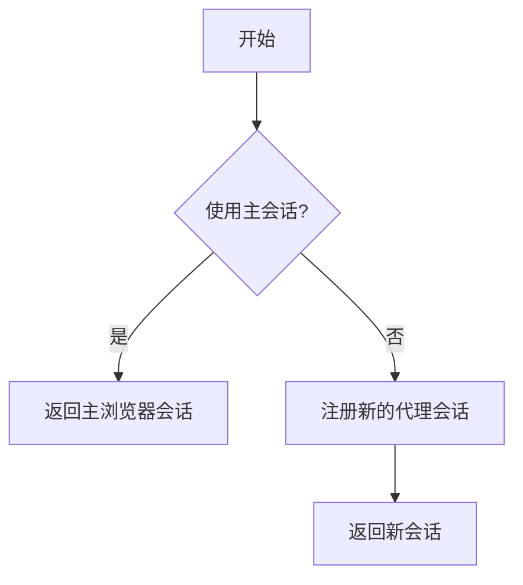
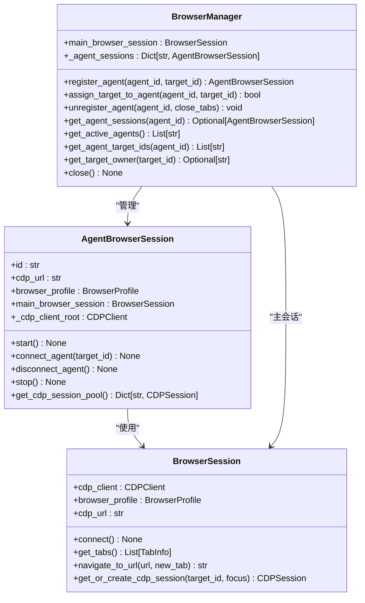
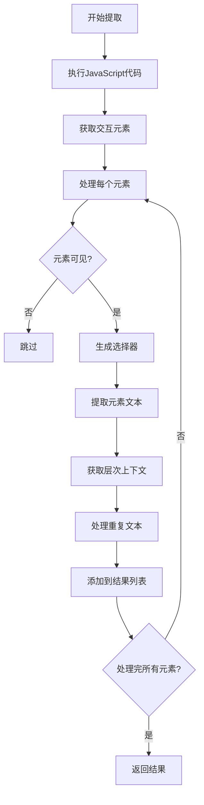
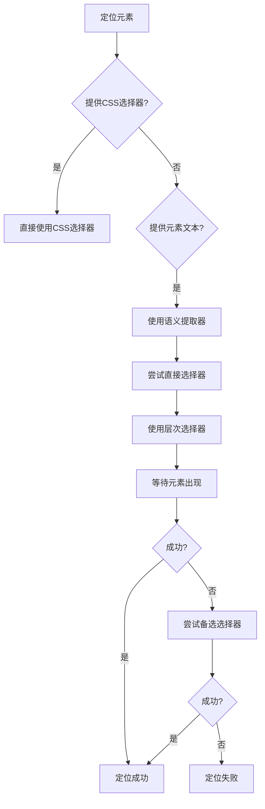
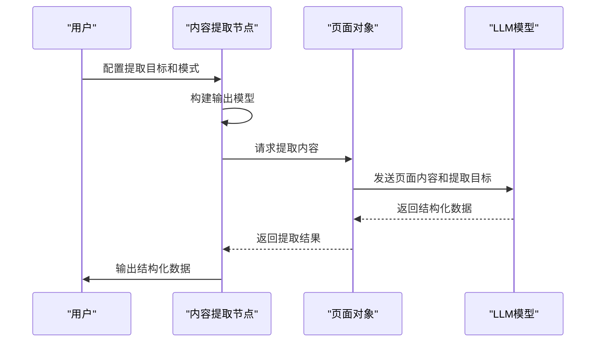
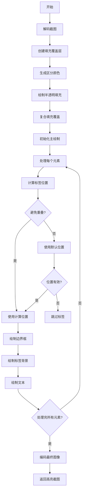
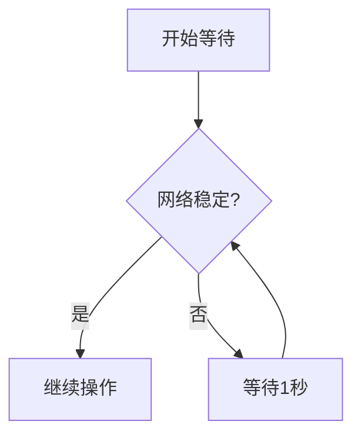
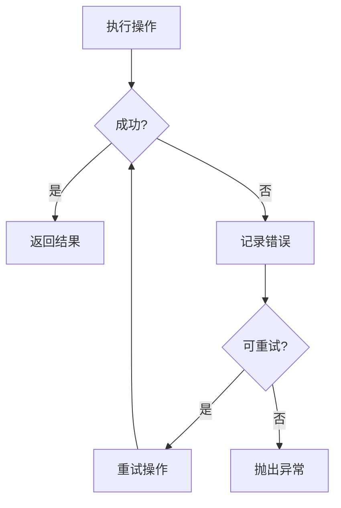

# 浏览器操作节点

<cite>
**本文档引用的文件**   
- [browser_navigate.py](file://vibe_surf/workflows/Browser/browser_navigate.py)
- [browser_input_text.py](file://vibe_surf/workflows/Browser/browser_input_text.py)
- [browser_click_element.py](file://vibe_surf/workflows/Browser/browser_click_element.py)
- [browser_extract_content.py](file://vibe_surf/workflows/Browser/browser_extract_content.py)
- [browser_take_screenshot.py](file://vibe_surf/workflows/Browser/browser_take_screenshot.py)
- [browser_scroll.py](file://vibe_surf/workflows/Browser/browser_scroll.py)
- [browser_hover_element.py](file://vibe_surf/workflows/Browser/browser_hover_element.py)
- [browser_focus_element.py](file://vibe_surf/workflows/Browser/browser_focus_element.py)
- [browser_html_content.py](file://vibe_surf/workflows/Browser/browser_html_content.py)
- [browser_session.py](file://vibe_surf/workflows/Browser/browser_session.py)
- [find_page_element.py](file://vibe_surf/browser/find_page_element.py)
- [page_operations.py](file://vibe_surf/browser/page_operations.py)
- [utils.py](file://vibe_surf/browser/utils.py)
- [browser_manager.py](file://vibe_surf/browser/browser_manager.py)
- [agent_browser_session.py](file://vibe_surf/browser/agent_browser_session.py)
</cite>

## 目录
1. [简介](#简介)
2. [核心功能节点](#核心功能节点)
3. [会话管理与浏览器协调](#会话管理与浏览器协调)
4. [元素定位与交互机制](#元素定位与交互机制)
5. [内容提取与数据处理](#内容提取与数据处理)
6. [性能优化与稳定性](#性能优化与稳定性)
7. [常见问题排查](#常见问题排查)
8. [典型使用场景](#典型使用场景)

## 简介
浏览器操作节点系统提供了一套完整的自动化工作流解决方案，涵盖页面导航、元素交互、内容提取和会话管理等核心功能。该系统通过与浏览器管理器和代理系统的协同工作，确保操作的准确性和稳定性。每个节点都经过精心设计，支持多种参数配置和执行流程，能够满足复杂的自动化需求。

## 核心功能节点

### 页面导航节点
页面导航节点（Navigation）负责将浏览器会话导航到指定的URL地址。该节点接收浏览器会话和目标URL作为输入参数，执行导航操作后返回更新后的浏览器会话。

**节点参数：**
- **浏览器会话**: 由VibeSurf定义的浏览器会话对象
- **URL**: 需要导航到的目标网址

**执行流程：**
1. 接收输入的浏览器会话和URL参数
2. 调用浏览器会话的`navigate_to_url`方法执行导航
3. 等待2秒确保页面加载完成
4. 返回更新后的浏览器会话

**典型应用场景：**
- 自动化测试中的页面跳转
- 数据采集任务的起始页面导航
- 多步骤工作流的页面切换

**节点来源**
- [browser_navigate.py](file://vibe_surf/workflows/Browser/browser_navigate.py#L1-L51)

### 文本输入节点
文本输入节点（Input Text）用于向页面中的指定元素输入文本内容。该节点支持多种元素定位方式，包括文本匹配、CSS选择器、后端节点ID和LLM提示等。

**节点参数：**
- **浏览器会话**: 当前的浏览器会话
- **输入文本**: 需要输入的文本内容
- **清除文本**: 是否在输入前清除原有文本
- **元素文本**: 用于定位目标元素的可见文本
- **元素提示**: 上下文提示信息，帮助区分同名元素
- **CSS选择器**: 直接使用CSS选择器定位元素
- **后端节点ID**: 通过节点ID定位元素
- **元素提示**: 使用LLM模型根据提示定位元素

**执行流程：**
1. 等待网络稳定
2. 根据提供的定位信息查找目标元素
3. 执行文本输入操作
4. 返回更新后的浏览器会话

**节点来源**
- [browser_input_text.py](file://vibe_surf/workflows/Browser/browser_input_text.py#L1-L170)

### 元素点击节点
元素点击节点（Click element）用于模拟用户点击页面中的指定元素。该节点支持多种点击方式，包括左键点击、右键点击和多次点击。

**节点参数：**
- **浏览器会话**: 当前的浏览器会话
- **元素文本**: 用于定位目标元素的可见文本
- **元素提示**: 上下文提示信息
- **CSS选择器**: CSS选择器定位
- **后端节点ID**: 节点ID定位
- **元素提示**: LLM提示定位
- **点击按钮**: 指定点击的鼠标按钮
- **点击次数**: 指定点击次数

**执行流程：**
1. 等待网络稳定
2. 记录当前标签页状态
3. 根据定位信息查找目标元素
4. 执行点击操作
5. 检测是否打开了新标签页并自动切换
6. 返回更新后的浏览器会话

**节点来源**
- [browser_click_element.py](file://vibe_surf/workflows/Browser/browser_click_element.py#L1-L196)

### 内容提取节点
内容提取节点（Extract Content）用于从当前页面提取指定内容。该节点支持结构化输出，可以将提取的内容转换为预定义的数据模型。

**节点参数：**
- **浏览器会话**: 当前的浏览器会话
- **提取目标**: 提取内容的目标描述
- **LLM模型**: 用于内容提取的大型语言模型
- **结构化输出**: 是否启用结构化输出
- **输出模式**: 定义结构化输出的模式

**执行流程：**
1. 根据是否启用结构化输出选择相应的处理方法
2. 调用页面的`extract_content`方法提取内容
3. 将提取结果转换为指定格式
4. 返回提取的内容和更新后的浏览器会话

**节点来源**
- [browser_extract_content.py](file://vibe_surf/workflows/Browser/browser_extract_content.py#L1-L198)

### 截图节点
截图节点（Take Screenshot）用于捕获当前页面的屏幕截图，并支持区域裁剪功能。

**节点参数：**
- **浏览器会话**: 当前的浏览器会话
- **裁剪X1**: 裁剪区域的左边缘（0-1）
- **裁剪Y1**: 裁剪区域的上边缘（0-1）
- **裁剪X2**: 裁剪区域的右边缘（0-1）
- **裁剪Y2**: 裁剪区域的下边缘（0-1）

**执行流程：**
1. 获取当前页面的截图
2. 根据裁剪参数对截图进行裁剪
3. 保存截图到工作目录
4. 返回截图文件路径

**节点来源**
- [browser_take_screenshot.py](file://vibe_surf/workflows/Browser/browser_take_screenshot.py#L1-L128)

### 滚动节点
滚动节点（Scroll）用于控制页面的滚动行为，支持基于坐标的滚动和基于文本的滚动。

**节点参数：**
- **浏览器会话**: 当前的浏览器会话
- **滚动文本**: 需要滚动到的文本内容
- **滚动X**: 滚动起始X坐标（0-1）
- **滚动Y**: 滚动起始Y坐标（0-1）
- **滚动增量X**: X方向滚动增量
- **滚动增量Y**: Y方向滚动增量

**执行流程：**
1. 如果指定了滚动文本，则优先执行文本滚动
2. 否则执行基于坐标的滚动
3. 计算视口尺寸和滚动位置
4. 发送鼠标滚轮事件实现滚动
5. 返回更新后的浏览器会话

**节点来源**
- [browser_scroll.py](file://vibe_surf/workflows/Browser/browser_scroll.py#L1-L100)

### 元素悬停节点
元素悬停节点（Hover element）用于模拟鼠标悬停在指定元素上的行为。

**节点参数：**
- **浏览器会话**: 当前的浏览器会话
- **元素文本**: 用于定位目标元素的可见文本
- **元素提示**: 上下文提示信息
- **CSS选择器**: CSS选择器定位
- **后端节点ID**: 节点ID定位
- **元素提示**: LLM提示定位

**执行流程：**
1. 根据提供的定位信息查找目标元素
2. 执行悬停操作
3. 返回更新后的浏览器会话

**节点来源**
- [browser_hover_element.py](file://vibe_surf/workflows/Browser/browser_hover_element.py#L1-L155)

### 元素聚焦节点
元素聚焦节点（Focus element）用于将焦点设置到指定的页面元素上。

**节点参数：**
- **浏览器会话**: 当前的浏览器会话
- **元素文本**: 用于定位目标元素的可见文本
- **元素提示**: 上下文提示信息
- **CSS选择器**: CSS选择器定位
- **后端节点ID**: 节点ID定位
- **元素提示**: LLM提示定位

**执行流程：**
1. 根据提供的定位信息查找目标元素
2. 执行聚焦操作
3. 返回更新后的浏览器会话

**节点来源**
- [browser_focus_element.py](file://vibe_surf/workflows/Browser/browser_focus_element.py#L1-L154)

### HTML内容获取节点
HTML内容获取节点（Html Content）用于获取当前页面的完整HTML内容并保存到文件。

**节点参数：**
- **浏览器会话**: 当前的浏览器会话

**执行流程：**
1. 调用浏览器会话的`get_html_content`方法获取HTML内容
2. 保存HTML内容到工作目录
3. 返回HTML文件路径

**节点来源**
- [browser_html_content.py](file://vibe_surf/workflows/Browser/browser_html_content.py#L1-L74)

## 会话管理与浏览器协调

### 浏览器会话节点
浏览器会话节点（Browser Session）用于创建和管理浏览器会话，是所有浏览器操作的基础。

**节点参数：**
- **使用主会话**: 是否使用主浏览器会话
- **目标ID**: 指定的标签页ID

**执行流程：**
1. 从共享状态获取浏览器管理器
2. 根据配置决定使用主会话还是注册新的代理会话
3. 返回相应的浏览器会话对象

**节点来源**
- [browser_session.py](file://vibe_surf/workflows/Browser/browser_session.py#L1-L55)

### 浏览器管理器架构
浏览器管理器（BrowserManager）负责管理多个代理的隔离浏览器会话，确保操作的安全性和独立性。

**节点来源**
- [browser_manager.py](file://vibe_surf/browser/browser_manager.py#L1-L269)
- [agent_browser_session.py](file://vibe_surf/browser/agent_browser_session.py)

## 元素定位与交互机制

### 语义元素提取器
语义元素提取器（SemanticExtractor）通过分析页面的DOM结构，建立可见文本与确定性选择器之间的映射关系。

**关键功能：**
- **元素类型识别**: 根据标签、类型和角色确定元素类型
- **文本提取**: 从标签文本、占位符、标题等多个来源提取有意义的文本
- **层次上下文**: 提取父元素、容器和兄弟元素的上下文信息
- **重复处理**: 通过上下文信息区分具有相同文本的多个元素

**节点来源**
- [find_page_element.py](file://vibe_surf/browser/find_page_element.py#L1-L800)

### 元素定位优先级
系统采用多层次的元素定位策略，确保在各种情况下都能准确定位目标元素。

**节点来源**
- [page_operations.py](file://vibe_surf/browser/page_operations.py#L1-L223)

## 内容提取与数据处理

### 结构化内容提取流程
结构化内容提取节点通过LLM模型将非结构化网页内容转换为预定义的数据结构。

**节点来源**
- [browser_extract_content.py](file://vibe_surf/workflows/Browser/browser_extract_content.py#L1-L198)

### 截图高亮处理
截图高亮功能通过在截图上绘制边界框和索引来增强可视化效果。

**节点来源**
- [utils.py](file://vibe_surf/browser/utils.py#L1-L786)

## 性能优化与稳定性

### 网络稳定性检测
系统在关键操作前会等待网络稳定，确保页面加载完成。

**实现方式：**
- 监控网络请求状态
- 设置合理的超时时间
- 在关键操作前自动等待

### 错误处理与重试机制
系统实现了完善的错误处理和重试机制，提高操作的可靠性。

## 常见问题排查

### 元素定位失败
**问题现象：** 系统无法找到指定的页面元素

**可能原因：**
- 页面尚未完全加载
- 元素位于iframe中
- 动态内容未加载完成
- 选择器不匹配

**解决方案：**
1. 确保在操作前等待页面加载完成
2. 检查元素是否位于iframe中，必要时切换上下文
3. 使用更具体的选择器或增加上下文提示
4. 考虑使用LLM提示定位复杂元素

### 网络连接问题
**问题现象：** 浏览器连接失败或中断

**可能原因：**
- 浏览器进程异常终止
- 网络不稳定
- CDP端口被占用

**解决方案：**
1. 检查浏览器进程状态
2. 重启浏览器管理器
3. 验证CDP连接URL
4. 检查防火墙设置

### 内容提取不准确
**问题现象：** 提取的内容与预期不符

**可能原因：**
- LLM模型理解偏差
- 页面结构复杂
- 提取目标描述不清晰

**解决方案：**
1. 优化提取目标的描述
2. 使用结构化输出模式
3. 提供更详细的上下文信息
4. 调整LLM模型参数

## 典型使用场景

### 自动化数据采集
构建一个从电商网站采集产品信息的自动化工作流：

1. **导航节点**: 导航到产品列表页面
2. **滚动节点**: 滚动页面加载更多产品
3. **点击节点**: 点击特定产品进入详情页
4. **内容提取节点**: 提取产品名称、价格、描述等信息
5. **截图节点**: 捕获产品图片
6. **返回节点**: 返回列表页继续下一个产品

### 表单自动填充
实现网站注册表单的自动填充：

1. **导航节点**: 导航到注册页面
2. **输入文本节点**: 填写用户名
3. **输入文本节点**: 填写邮箱
4. **输入文本节点**: 填写密码
5. **点击节点**: 点击注册按钮
6. **内容提取节点**: 验证注册结果

### 网站监控与测试
创建网站功能的自动化测试流程：

1. **导航节点**: 访问网站主页
2. **点击节点**: 测试导航菜单
3. **输入文本节点**: 测试搜索功能
4. **内容提取节点**: 验证搜索结果
5. **截图节点**: 记录关键页面状态
6. **HTML内容节点**: 保存页面源码用于比对