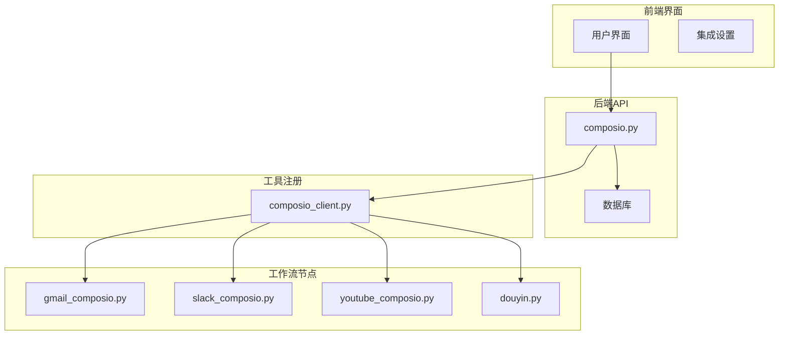
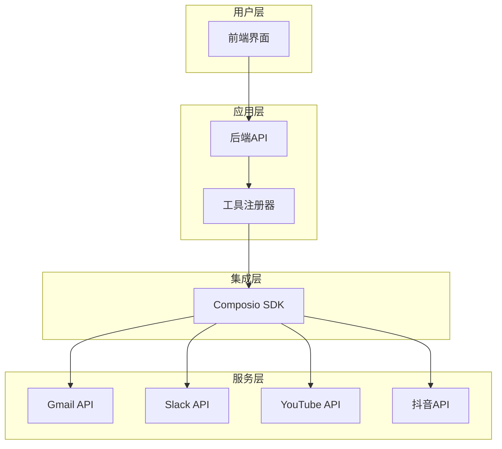
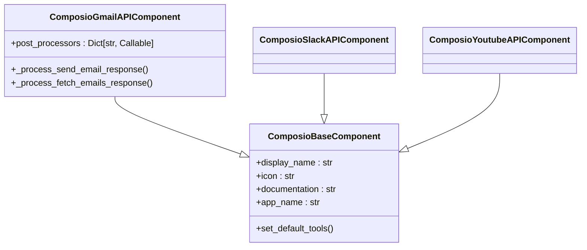
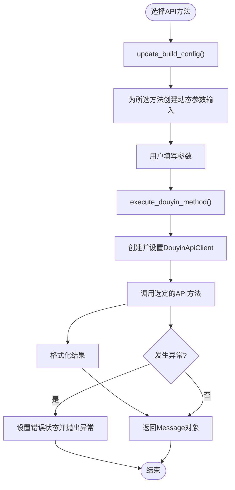
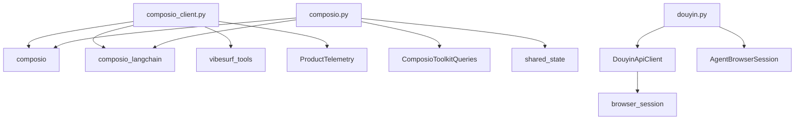

# 第三方集成节点

<cite>
**本文档引用的文件**   
- [composio.py](file://vibe_surf/backend/api/composio.py)
- [composio_client.py](file://vibe_surf/tools/composio_client.py)
- [composio_api.py](file://vibe_surf/workflows/Integrations/composio_api.py)
- [gmail_composio.py](file://vibe_surf/workflows/Integrations/gmail_composio.py)
- [slack_composio.py](file://vibe_surf/workflows/Integrations/slack_composio.py)
- [youtube_composio.py](file://vibe_surf/workflows/Integrations/youtube_composio.py)
- [douyin.py](file://vibe_surf/workflows/Integrations/douyin.py)
- [v005_add_composio_integration.sql](file://vibe_surf/backend/database/migrations/v005_add_composio_integration.sql)
</cite>

## 目录
1. [介绍](#介绍)
2. [项目结构](#项目结构)
3. [核心组件](#核心组件)
4. [架构概述](#架构概述)
5. [详细组件分析](#详细组件分析)
6. [依赖分析](#依赖分析)
7. [性能考虑](#性能考虑)
8. [故障排除指南](#故障排除指南)
9. [结论](#结论)

## 介绍
本文档深入探讨了VibeSurf平台中第三方服务集成类工作流节点的实现，重点覆盖Gmail、Slack、YouTube、抖音等多个平台。文档详细描述了各节点的认证机制、API调用方式、数据格式转换和错误处理策略。同时，解释了Composio集成框架如何统一管理不同服务的连接和权限，并提供创建新集成节点的开发指南，包括配置模板、测试方法和安全性考虑。

## 项目结构
VibeSurf项目的结构清晰地组织了其功能模块，特别是与第三方服务集成相关的部分。核心的集成逻辑主要分布在`vibe_surf/workflows/Integrations/`目录下，每个第三方服务都有对应的Python文件，如`gmail_composio.py`、`slack_composio.py`等。这些文件定义了与特定服务交互的组件。

认证和API密钥管理的核心逻辑位于`vibe_surf/backend/api/composio.py`，它处理Composio API密钥的验证、存储以及与第三方服务的OAuth流程。工具的动态注册和调用机制则在`vibe_surf/tools/composio_client.py`中实现，该文件负责将Composio提供的工具注册为VibeSurf内部可调用的动作。

数据库层面，`vibe_surf/backend/database/migrations/v005_add_composio_integration.sql`迁移脚本创建了`composio_toolkits`表，用于持久化存储已启用的工具包及其状态。

**图表来源**
- [composio.py](file://vibe_surf/backend/api/composio.py)
- [composio_client.py](file://vibe_surf/tools/composio_client.py)
- [gmail_composio.py](file://vibe_surf/workflows/Integrations/gmail_composio.py)
- [slack_composio.py](file://vibe_surf/workflows/Integrations/slack_composio.py)
- [youtube_composio.py](file://vibe_surf/workflows/Integrations/youtube_composio.py)
- [douyin.py](file://vibe_surf/workflows/Integrations/douyin.py)

**章节来源**
- [composio.py](file://vibe_surf/backend/api/composio.py)
- [composio_client.py](file://vibe_surf/tools/composio_client.py)
- [composio_api.py](file://vibe_surf/workflows/Integrations/composio_api.py)

## 核心组件
系统的核心在于`ComposioClient`类和`composio.py` API端点。`ComposioClient`负责将从Composio平台获取的动态工具列表注册为VibeSurf内部的可执行动作。它通过解析工具的JSON Schema来动态创建Pydantic模型，从而实现对工具参数的类型安全和验证。

`composio.py`中的API端点（如`toggle_composio_toolkit`）则管理着整个集成的生命周期，包括API密钥验证、OAuth重定向URL生成、工具包的启用/禁用以及与数据库的同步。这些端点是前端界面与后端集成逻辑之间的桥梁。

**章节来源**
- [composio.py](file://vibe_surf/backend/api/composio.py#L531-L728)
- [composio_client.py](file://vibe_surf/tools/composio_client.py#L60-L117)

## 架构概述
该系统的架构采用分层设计，将用户界面、业务逻辑和数据存储清晰地分离。前端通过API与后端通信，后端利用Composio SDK与第三方服务进行交互。一个关键的设计模式是“工具注册”，它允许系统在运行时动态地发现和集成新的服务，而无需修改核心代码。

**图表来源**
- [composio.py](file://vibe_surf/backend/api/composio.py)
- [composio_client.py](file://vibe_surf/tools/composio_client.py)

## 详细组件分析

### Gmail、Slack和YouTube集成分析
Gmail、Slack和YouTube的集成节点都继承自`ComposioBaseComponent`基类，这确保了它们具有统一的接口和行为。每个节点通过`app_name`属性指定其对应的服务（如"gmail"、"slack"、"youtube"），并定义了`set_default_tools`方法来配置默认可用的工具。

这些节点的实现非常简洁，主要职责是声明其元数据（如显示名称、图标）和默认工具集。实际的API调用和认证逻辑由底层的Composio框架和`composio_client.py`统一处理。这种设计极大地减少了重复代码，并保证了所有基于Composio的服务集成具有一致的安全性和错误处理机制。

#### 对于基于Composio的组件：

**图表来源**
- [gmail_composio.py](file://vibe_surf/workflows/Integrations/gmail_composio.py)
- [slack_composio.py](file://vibe_surf/workflows/Integrations/slack_composio.py)
- [youtube_composio.py](file://vibe_surf/workflows/Integrations/youtube_composio.py)

**章节来源**
- [gmail_composio.py](file://vibe_surf/workflows/Integrations/gmail_composio.py)
- [slack_composio.py](file://vibe_surf/workflows/Integrations/slack_composio.py)
- [youtube_composio.py](file://vibe_surf/workflows/Integrations/youtube_composio.py)

### 抖音（Douyin）集成分析
抖音集成节点（`douyin.py`）采用了与Composio不同的实现方式，它直接通过Web API与抖音服务进行交互，而不是通过Composio中间件。这表明系统支持多种集成模式。

该组件的核心是`DouyinComponent`类，它定义了一个动态的用户界面。用户首先选择一个API方法（如“按关键词搜索视频”），然后系统会根据所选方法动态生成相应的参数输入框。这种动态表单是通过`update_build_config`方法实现的，该方法在用户选择方法后，检查对应方法的函数签名，并为每个参数创建合适的输入控件（文本框、数字输入、下拉框等）。

API调用由`DouyinApiClient`执行，该客户端通过`AgentBrowserSession`与浏览器实例交互，模拟用户行为来获取数据。错误处理策略包括在`execute_douyin_method`方法中使用try-catch块捕获异常，并将错误信息通过组件状态反馈给用户。

#### 对于复杂逻辑组件：

**图表来源**
- [douyin.py](file://vibe_surf/workflows/Integrations/douyin.py)

**章节来源**
- [douyin.py](file://vibe_surf/workflows/Integrations/douyin.py)

## 依赖分析
系统依赖关系清晰，主要依赖于`composio`和`composio_langchain`这两个Python包来实现与第三方服务的连接。`composio.py` API端点依赖于数据库查询模块（`ComposioToolkitQueries`）来持久化工具包状态，并依赖于`shared_state`来管理全局的Composio实例。

`composio_client.py`依赖于`vibe_surf.tools.vibesurf_tools`来注册动作，并依赖于`ProductTelemetry`服务来记录工具调用的遥测数据。`douyin.py`则依赖于`vibe_surf.browser`模块来管理浏览器会话。

**图表来源**
- [composio.py](file://vibe_surf/backend/api/composio.py)
- [composio_client.py](file://vibe_surf/tools/composio_client.py)
- [douyin.py](file://vibe_surf/workflows/Integrations/douyin.py)

**章节来源**
- [composio.py](file://vibe_surf/backend/api/composio.py)
- [composio_client.py](file://vibe_surf/tools/composio_client.py)
- [douyin.py](file://vibe_surf/workflows/Integrations/douyin.py)

## 性能考虑
对于基于Composio的集成，性能开销主要在于API调用的网络延迟。系统通过在数据库中缓存工具列表（`composio_toolkits.tools`字段）来减少对Composio API的频繁调用。`composio_client.py`中的`register_to_tools`方法在注册工具时会检查是否已注册，避免了重复操作。

对于抖音集成，性能瓶颈在于浏览器自动化操作。`DouyinApiClient`的`setup`和`close`方法管理着浏览器资源，确保连接被正确复用和释放。动态参数解析使用`inspect.signature`，这是一个轻量级的运行时操作，对性能影响很小。

## 故障排除指南
常见的集成问题包括API密钥无效、OAuth认证失败和网络超时。

- **API密钥问题**：检查`composio.py`中的`verify_composio_api_key`端点日志，确认密钥是否通过验证。确保密钥已正确存储在数据库的`credentials`表中。
- **OAuth认证失败**：检查`toggle_composio_toolkit`端点的执行流程。确认`auth_url`是否成功生成，并检查前端是否正确处理了重定向。查看Composio SDK的日志以获取更详细的错误信息。
- **工具调用失败**：在`composio_client.py`的`composio_action_wrapper`中，错误会被捕获并记录。检查日志中的`error_msg`以确定具体原因，如参数验证失败或服务端错误。
- **抖音API调用失败**：检查`douyin.py`中`execute_douyin_method`的异常处理。确保`AgentBrowserSession`处于活动状态，并且网络连接正常。

**章节来源**
- [composio.py](file://vibe_surf/backend/api/composio.py)
- [composio_client.py](file://vibe_surf/tools/composio_client.py)
- [douyin.py](file://vibe_surf/workflows/Integrations/douyin.py)

## 结论
VibeSurf平台通过Composio框架和自定义API客户端，实现了对Gmail、Slack、YouTube和抖音等多个第三方服务的灵活集成。Composio提供了一种标准化、安全的方式来管理认证和API调用，极大地简化了集成过程。对于需要特殊处理的服务（如抖音），系统也提供了直接通过Web API集成的途径。整体架构设计良好，具有高内聚、低耦合的特点，便于维护和扩展新的集成节点。