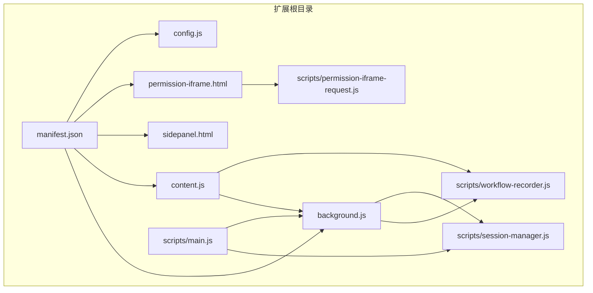
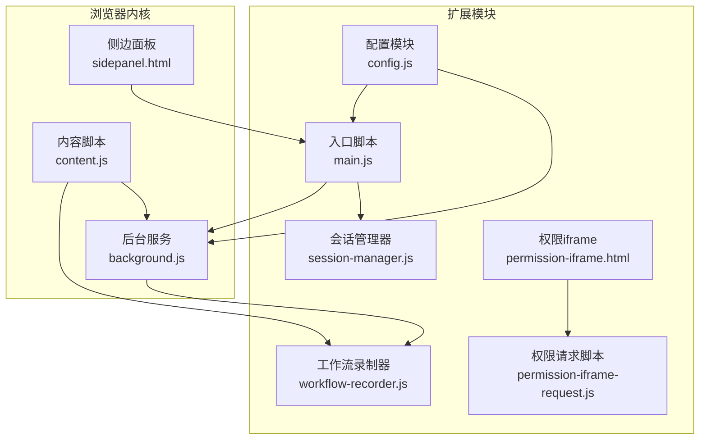
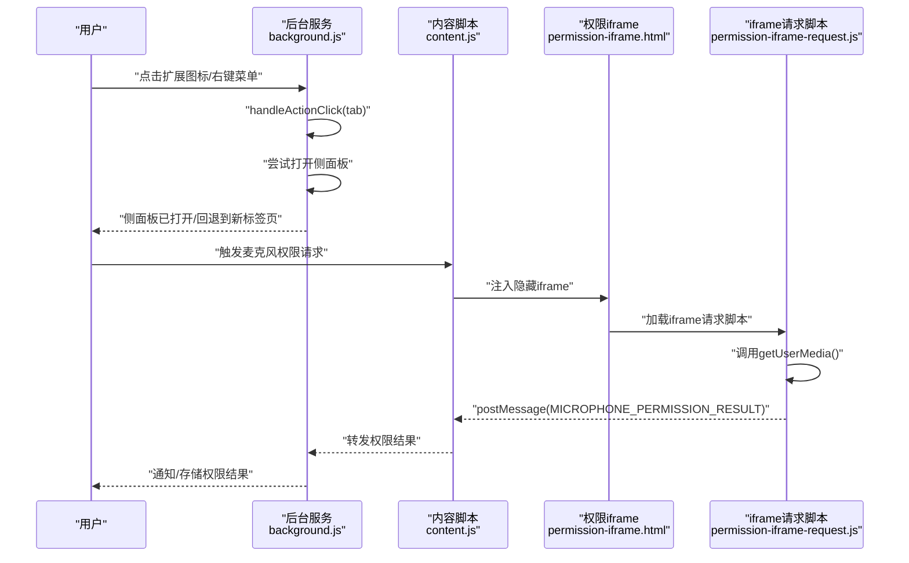
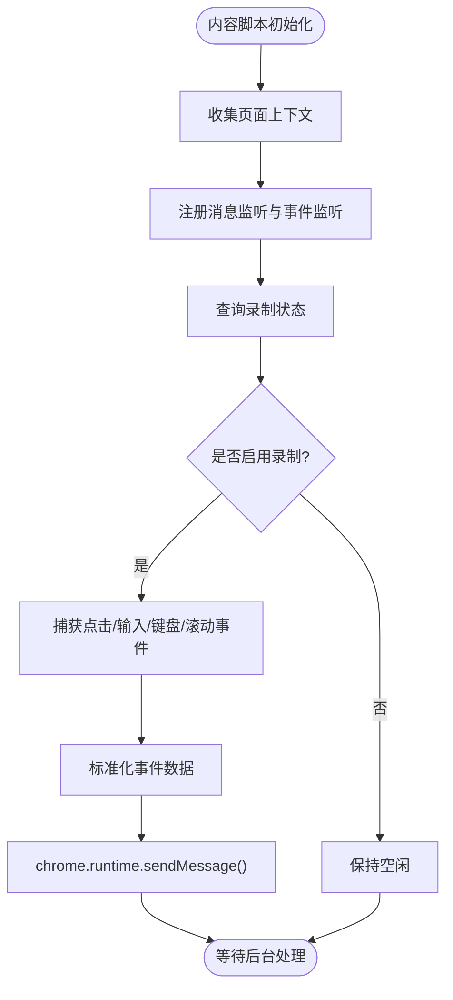
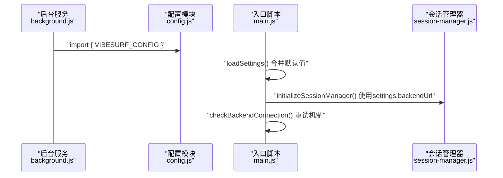
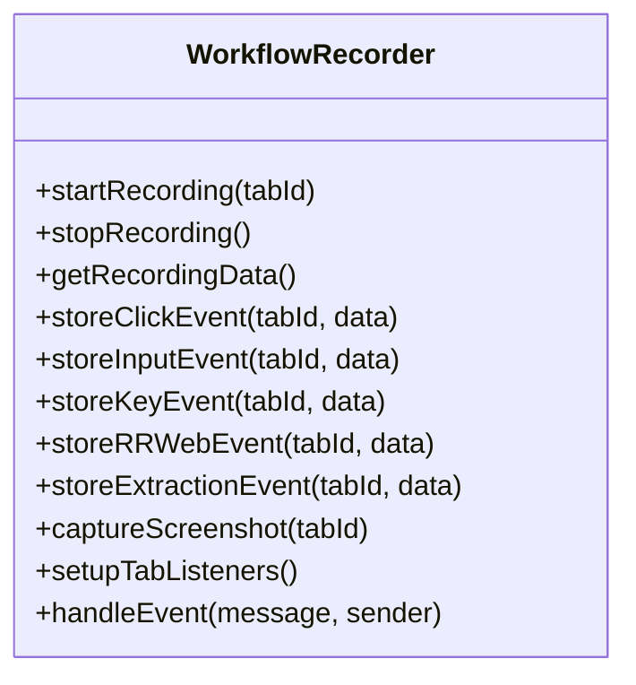
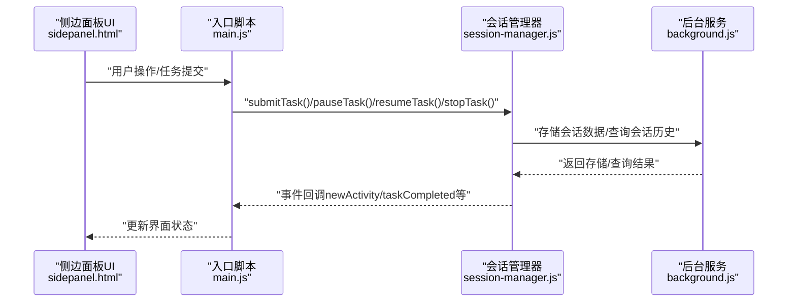
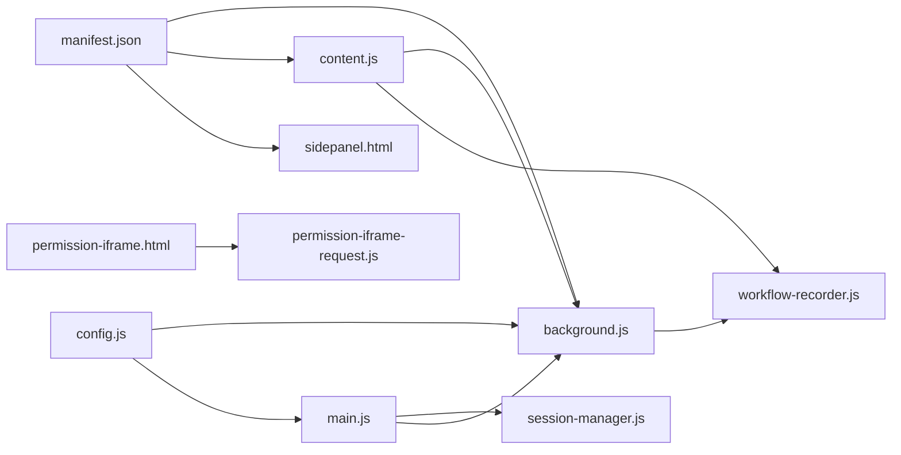

# Chrome扩展架构

<cite>
**本文引用的文件**
- [manifest.json](file://vibe_surf/chrome_extension/manifest.json)
- [background.js](file://vibe_surf/chrome_extension/background.js)
- [content.js](file://vibe_surf/chrome_extension/content.js)
- [config.js](file://vibe_surf/chrome_extension/config.js)
- [workflow-recorder.js](file://vibe_surf/chrome_extension/scripts/workflow-recorder.js)
- [main.js](file://vibe_surf/chrome_extension/scripts/main.js)
- [session-manager.js](file://vibe_surf/chrome_extension/scripts/session-manager.js)
- [sidepanel.html](file://vibe_surf/chrome_extension/sidepanel.html)
- [permission-iframe.html](file://vibe_surf/chrome_extension/permission-iframe.html)
- [permission-iframe-request.js](file://vibe_surf/chrome_extension/scripts/permission-iframe-request.js)
</cite>

## 目录
1. [简介](#简介)
2. [项目结构](#项目结构)
3. [核心组件](#核心组件)
4. [架构总览](#架构总览)
5. [详细组件分析](#详细组件分析)
6. [依赖关系分析](#依赖关系分析)
7. [性能考量](#性能考量)
8. [故障排查指南](#故障排查指南)
9. [结论](#结论)
10. [附录](#附录)

## 简介
本文件面向VibeSurf Chrome扩展的架构文档，系统性阐述manifest.json中的扩展配置（权限、内容脚本注入、后台服务）、background.js如何管理扩展生命周期与跨上下文通信、content.js如何在网页上下文中执行DOM操作与事件捕获、config.js的配置管理与前后端同步策略，并通过多种Mermaid图示展示组件间数据流与控制流。同时给出安全设计建议（CSP与权限最小化）。

## 项目结构
VibeSurf扩展位于vibe_surf/chrome_extension目录下，采用Manifest V3规范，包含：
- 配置文件：manifest.json
- 后台服务：background.js（service worker）
- 内容脚本：content.js（注入到所有页面）
- 配置模块：config.js（全局配置）
- 工作流录制器：scripts/workflow-recorder.js
- 扩展侧面板：sidepanel.html
- 权限请求辅助：permission-iframe.html与permission-iframe-request.js
- 侧面板入口脚本：scripts/main.js（负责UI初始化、会话管理、与后台通信）

图表来源
- [manifest.json](file://vibe_surf/chrome_extension/manifest.json#L1-L70)
- [background.js](file://vibe_surf/chrome_extension/background.js#L1-L120)
- [content.js](file://vibe_surf/chrome_extension/content.js#L1-L120)
- [config.js](file://vibe_surf/chrome_extension/config.js#L1-L56)
- [workflow-recorder.js](file://vibe_surf/chrome_extension/scripts/workflow-recorder.js#L1-L120)
- [main.js](file://vibe_surf/chrome_extension/scripts/main.js#L1-L120)
- [session-manager.js](file://vibe_surf/chrome_extension/scripts/session-manager.js#L1-L120)
- [sidepanel.html](file://vibe_surf/chrome_extension/sidepanel.html#L1-L120)
- [permission-iframe.html](file://vibe_surf/chrome_extension/permission-iframe.html#L1-L38)
- [permission-iframe-request.js](file://vibe_surf/chrome_extension/scripts/permission-iframe-request.js#L1-L120)

章节来源
- [manifest.json](file://vibe_surf/chrome_extension/manifest.json#L1-L70)

## 核心组件
- Manifest配置：定义权限、主机权限、后台服务、内容脚本注入、侧边栏与资源暴露。
- 后台服务（background.js）：生命周期管理、消息路由、跨标签页通信、通知、剪贴板、文件打开、麦克风权限请求、工作流录制器集成。
- 内容脚本（content.js）：页面上下文DOM采集、元素高亮、滚动/点击/输入事件捕获、向后台转发事件、麦克风权限iframe注入与结果回传。
- 配置模块（config.js）：集中式配置（后端地址、通知、UI等），供后台与侧面板共享。
- 工作流录制器（workflow-recorder.js）：事件存储、步骤转换、截图捕获、标签页导航事件处理。
- 侧面板入口（main.js）：应用初始化、设置加载、后端连通性检查与重试、会话管理器初始化、UI管理器初始化、健康检查与错误处理。
- 会话管理器（session-manager.js）：会话生命周期、活动轮询、历史与任务管理、与后台存储交互。
- 权限请求辅助（permission-iframe.html + permission-iframe-request.js）：在受控iframe中请求麦克风权限并通过postMessage回传结果。

章节来源
- [background.js](file://vibe_surf/chrome_extension/background.js#L1-L200)
- [content.js](file://vibe_surf/chrome_extension/content.js#L1-L200)
- [config.js](file://vibe_surf/chrome_extension/config.js#L1-L56)
- [workflow-recorder.js](file://vibe_surf/chrome_extension/scripts/workflow-recorder.js#L1-L120)
- [main.js](file://vibe_surf/chrome_extension/scripts/main.js#L1-L120)
- [session-manager.js](file://vibe_surf/chrome_extension/scripts/session-manager.js#L1-L120)
- [permission-iframe.html](file://vibe_surf/chrome_extension/permission-iframe.html#L1-L38)
- [permission-iframe-request.js](file://vibe_surf/chrome_extension/scripts/permission-iframe-request.js#L1-L120)

## 架构总览
扩展采用“后台服务（service worker）+ 内容脚本 + 侧边面板”的三层架构：
- 后台服务统一调度与持久化，负责权限、通知、剪贴板、文件打开、工作流录制器协调。
- 内容脚本在页面上下文中采集信息与事件，与后台通信。
- 侧边面板通过入口脚本初始化UI、会话管理与后端交互。

图表来源
- [background.js](file://vibe_surf/chrome_extension/background.js#L1-L200)
- [content.js](file://vibe_surf/chrome_extension/content.js#L1-L200)
- [config.js](file://vibe_surf/chrome_extension/config.js#L1-L56)
- [workflow-recorder.js](file://vibe_surf/chrome_extension/scripts/workflow-recorder.js#L1-L120)
- [main.js](file://vibe_surf/chrome_extension/scripts/main.js#L1-L120)
- [session-manager.js](file://vibe_surf/chrome_extension/scripts/session-manager.js#L1-L120)
- [sidepanel.html](file://vibe_surf/chrome_extension/sidepanel.html#L1-L120)
- [permission-iframe.html](file://vibe_surf/chrome_extension/permission-iframe.html#L1-L38)
- [permission-iframe-request.js](file://vibe_surf/chrome_extension/scripts/permission-iframe-request.js#L1-L120)

## 详细组件分析

### Manifest配置（权限、注入与后台服务）
- 权限声明：activeTab、storage、notifications、sidePanel、contextMenus、tabs、clipboardWrite、scripting、downloads。
- 主机权限：支持本地开发环境（localhost/127.0.0.1）与file协议，以及所有URL。
- 后台服务：使用service worker类型，模块化导入config.js与workflow-recorder.js。
- 内容脚本：对所有URL生效，在文档末尾注入，便于DOM可用。
- 侧边栏：默认路径为sidepanel.html。
- Web可访问资源：将sidepanel.html、样式、脚本、config.js、图标暴露给所有URL。

章节来源
- [manifest.json](file://vibe_surf/chrome_extension/manifest.json#L1-L70)

### 后台服务（background.js）职责与流程
- 生命周期：安装/启动时初始化默认设置、显示欢迎通知；标记初始化完成。
- 事件监听：工具栏点击、上下文菜单、消息通道、标签激活/更新。
- 消息处理：统一路由至工作流录制器或内置功能（当前标签、徽章、通知、剪贴板、后端状态、会话数据、文件打开、所有标签、麦克风权限请求等）。
- 侧边栏打开：优先使用sidePanel API，失败则回退到新建标签页打开sidepanel.html，并保存当前标签上下文。
- 剪贴板：通过内容脚本注入执行，避免直接访问限制。
- 文件打开：支持HTTP(S)与file协议，带错误提示与降级方案。
- 微型录音权限：通过内容脚本注入隐藏iframe并在iframe内请求getUserMedia，成功/失败通过postMessage回传至内容脚本，再由内容脚本转发至后台。

图表来源
- [background.js](file://vibe_surf/chrome_extension/background.js#L104-L158)
- [content.js](file://vibe_surf/chrome_extension/content.js#L295-L414)
- [permission-iframe.html](file://vibe_surf/chrome_extension/permission-iframe.html#L1-L38)
- [permission-iframe-request.js](file://vibe_surf/chrome_extension/scripts/permission-iframe-request.js#L1-L120)

章节来源
- [background.js](file://vibe_surf/chrome_extension/background.js#L1-L200)
- [content.js](file://vibe_surf/chrome_extension/content.js#L295-L414)
- [permission-iframe-request.js](file://vibe_surf/chrome_extension/scripts/permission-iframe-request.js#L1-L120)

### 内容脚本（content.js）职责与流程
- 初始化：防重复注入、收集页面上下文、设置消息监听、查询录制状态。
- 页面上下文：记录URL、标题、域名、时间戳、meta、表单/表格/链接/图片/输入数量。
- DOM操作：滚动到元素、高亮元素、点击元素、提取页面文本与链接。
- 事件捕获：点击、输入（含contenteditable）、键盘按键（Enter/Tab/Esc），并携带修饰键信息；滚动事件去抖。
- 录制状态：根据后台查询决定是否启用事件捕获；将事件转为统一格式发送至后台。
- 权限请求：注入隐藏iframe，等待iframe内getUserMedia结果，通过window.postMessage回传至内容脚本，再转发至后台。

图表来源
- [content.js](file://vibe_surf/chrome_extension/content.js#L1-L120)
- [content.js](file://vibe_surf/chrome_extension/content.js#L440-L550)

章节来源
- [content.js](file://vibe_surf/chrome_extension/content.js#L1-L200)
- [content.js](file://vibe_surf/chrome_extension/content.js#L416-L550)

### 配置管理（config.js）与前后端同步
- 配置项：后端地址、API前缀、超时、重试次数/延迟、会话前缀、通知开关、UI主题与行为、社交链接、调试开关。
- 全局暴露：在window/self环境下导出VIBESURF_CONFIG，供后台与侧面板共享。
- 同步策略：后台通过import引入配置；侧面板入口脚本从chrome.storage读取settings并与默认值合并；API客户端基于settings.backendUrl构造请求；后端健康检查与重试逻辑在入口脚本中实现。

图表来源
- [config.js](file://vibe_surf/chrome_extension/config.js#L1-L56)
- [background.js](file://vibe_surf/chrome_extension/background.js#L1-L20)
- [main.js](file://vibe_surf/chrome_extension/scripts/main.js#L66-L120)
- [session-manager.js](file://vibe_surf/chrome_extension/scripts/session-manager.js#L1-L60)

章节来源
- [config.js](file://vibe_surf/chrome_extension/config.js#L1-L56)
- [main.js](file://vibe_surf/chrome_extension/scripts/main.js#L66-L120)
- [session-manager.js](file://vibe_surf/chrome_extension/scripts/session-manager.js#L1-L60)

### 工作流录制器（workflow-recorder.js）
- 职责：事件存储（点击、输入、键盘、RRWeb滚动/导航）、步骤转换（点击/输入/按键/抽取/导航/滚动）、截图捕获、标签页事件监听与清理。
- 数据结构：Map存储每个tab的事件列表、最近用户交互时间戳、初始页面加载集合。
- 事件处理：接收来自内容脚本与后台的消息，按类型分派到对应存储函数；支持合并输入事件以减少冗余；过滤重复导航事件；广播工作流数据更新。
- 截图：通过chrome.tabs.captureVisibleTab捕获PNG数据URL。

图表来源
- [workflow-recorder.js](file://vibe_surf/chrome_extension/scripts/workflow-recorder.js#L1-L120)
- [workflow-recorder.js](file://vibe_surf/chrome_extension/scripts/workflow-recorder.js#L508-L640)

章节来源
- [workflow-recorder.js](file://vibe_surf/chrome_extension/scripts/workflow-recorder.js#L1-L120)
- [workflow-recorder.js](file://vibe_surf/chrome_extension/scripts/workflow-recorder.js#L508-L640)

### 侧面板入口（main.js）与会话管理（session-manager.js）
- main.js：初始化应用、加载设置、非阻塞后端健康检查与重试、初始化会话管理器与UI管理器、全局错误处理、周期性健康检查。
- session-manager.js：会话创建/加载、任务提交/暂停/恢复/停止、活动轮询与同步、历史与任务查询、与后台存储交互、文件上传、事件系统。

图表来源
- [main.js](file://vibe_surf/chrome_extension/scripts/main.js#L1-L120)
- [session-manager.js](file://vibe_surf/chrome_extension/scripts/session-manager.js#L260-L420)
- [background.js](file://vibe_surf/chrome_extension/background.js#L634-L714)

章节来源
- [main.js](file://vibe_surf/chrome_extension/scripts/main.js#L1-L120)
- [session-manager.js](file://vibe_surf/chrome_extension/scripts/session-manager.js#L260-L420)

## 依赖关系分析
- manifest.json声明了后台服务、内容脚本、侧边栏与web可访问资源，确保sidepanel.html、样式、脚本、config.js与图标可被所有URL访问。
- background.js导入config.js与workflow-recorder.js，作为service worker承载核心业务逻辑。
- content.js与background.js通过chrome.runtime消息通道双向通信；content.js还与permission-iframe.html配合完成麦克风权限请求。
- main.js与session-manager.js协作完成会话生命周期管理，并与background.js交互以持久化与查询会话数据。

图表来源
- [manifest.json](file://vibe_surf/chrome_extension/manifest.json#L1-L70)
- [background.js](file://vibe_surf/chrome_extension/background.js#L1-L20)
- [content.js](file://vibe_surf/chrome_extension/content.js#L1-L20)
- [config.js](file://vibe_surf/chrome_extension/config.js#L1-L56)
- [workflow-recorder.js](file://vibe_surf/chrome_extension/scripts/workflow-recorder.js#L1-L120)
- [main.js](file://vibe_surf/chrome_extension/scripts/main.js#L1-L120)
- [session-manager.js](file://vibe_surf/chrome_extension/scripts/session-manager.js#L1-L120)
- [sidepanel.html](file://vibe_surf/chrome_extension/sidepanel.html#L1-L120)
- [permission-iframe.html](file://vibe_surf/chrome_extension/permission-iframe.html#L1-L38)
- [permission-iframe-request.js](file://vibe_surf/chrome_extension/scripts/permission-iframe-request.js#L1-L120)

章节来源
- [manifest.json](file://vibe_surf/chrome_extension/manifest.json#L1-L70)
- [background.js](file://vibe_surf/chrome_extension/background.js#L1-L20)
- [content.js](file://vibe_surf/chrome_extension/content.js#L1-L20)
- [config.js](file://vibe_surf/chrome_extension/config.js#L1-L56)
- [workflow-recorder.js](file://vibe_surf/chrome_extension/scripts/workflow-recorder.js#L1-L120)
- [main.js](file://vibe_surf/chrome_extension/scripts/main.js#L1-L120)
- [session-manager.js](file://vibe_surf/chrome_extension/scripts/session-manager.js#L1-L120)
- [sidepanel.html](file://vibe_surf/chrome_extension/sidepanel.html#L1-L120)
- [permission-iframe.html](file://vibe_surf/chrome_extension/permission-iframe.html#L1-L38)
- [permission-iframe-request.js](file://vibe_surf/chrome_extension/scripts/permission-iframe-request.js#L1-L120)

## 性能考量
- 事件捕获去抖：滚动事件采用去抖降低高频事件带来的消息压力。
- 输入事件合并：短时间内同元素的输入事件合并，减少存储与传输开销。
- 截图捕获：仅在需要时调用chrome.tabs.captureVisibleTab，避免频繁截图。
- 后端健康检查：非阻塞重试与周期性检查，避免UI加载阻塞。
- 存储上限：会话列表最多保留固定数量，超出部分自动清理，避免localStorage膨胀。

章节来源
- [content.js](file://vibe_surf/chrome_extension/content.js#L529-L550)
- [workflow-recorder.js](file://vibe_surf/chrome_extension/scripts/workflow-recorder.js#L271-L318)
- [main.js](file://vibe_surf/chrome_extension/scripts/main.js#L129-L168)
- [background.js](file://vibe_surf/chrome_extension/background.js#L488-L562)

## 故障排查指南
- 侧边栏无法打开：后台handleActionClick会尝试sidePanel.open，失败则回退到新建标签页打开sidepanel.html，并弹出通知提示升级Chrome或右键打开。若仍失败，检查manifest中side_panel配置与chrome版本。
- 剪贴板不可用：后台通过内容脚本注入执行，若目标页面为chrome://或扩展页，则拒绝访问。请在普通网页上使用。
- 文件打开失败：对于file://协议，浏览器安全限制可能阻止直接打开本地文件；可尝试复制路径手动打开或改用HTTP(S)。
- 微型录音权限：iframe内请求getUserMedia，若被拒绝需引导用户允许；错误类型区分NotAllowedError/NotFoundError/NotReadableError/SecurityError并给出用户提示。
- 后端连接问题：入口脚本提供健康检查与重试机制；若多次失败，通知用户确认后端服务运行状态。

章节来源
- [background.js](file://vibe_surf/chrome_extension/background.js#L104-L158)
- [background.js](file://vibe_surf/chrome_extension/background.js#L634-L714)
- [permission-iframe-request.js](file://vibe_surf/chrome_extension/scripts/permission-iframe-request.js#L90-L167)
- [main.js](file://vibe_surf/chrome_extension/scripts/main.js#L108-L168)

## 结论
VibeSurf Chrome扩展通过清晰的三层架构实现了浏览器自动化能力：后台服务统一调度、内容脚本深入页面上下文、侧边面板提供交互入口。配置模块集中管理后端地址与UI行为，工作流录制器负责事件采集与步骤转换，会话管理器保障任务生命周期与数据一致性。通过消息通道与存储接口实现跨上下文通信，结合非阻塞健康检查与错误处理，整体具备良好的稳定性与可维护性。

## 附录
- 安全设计建议
  - 内容安全策略（CSP）：Manifest V3默认CSP较严格，建议在开发阶段使用"unsafe_eval"与"unsafe-inline"仅用于本地开发，生产环境尽量移除。
  - 权限最小化：仅声明必要权限（activeTab、storage、notifications、sidePanel、contextMenus、tabs、clipboardWrite、scripting、downloads），避免过度授权。
  - 资源暴露：web_accessible_resources仅暴露必要资源（sidepanel.html、样式、脚本、config.js、图标），避免泄露内部实现细节。
  - iframe权限：权限iframe仅用于请求媒体设备，完成后立即移除，避免长期驻留。
  - 通知与剪贴板：通知与剪贴板访问均通过后台与内容脚本协作，避免直接在页面上下文访问敏感API。