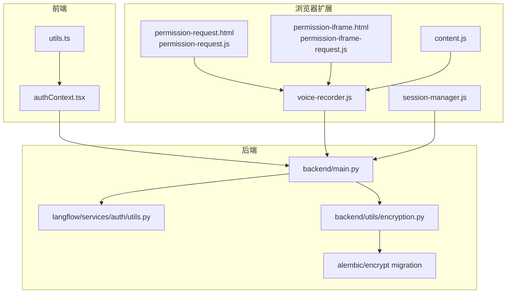
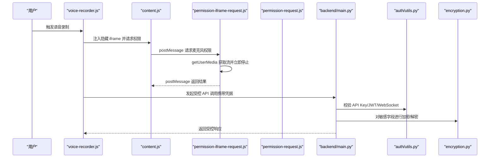
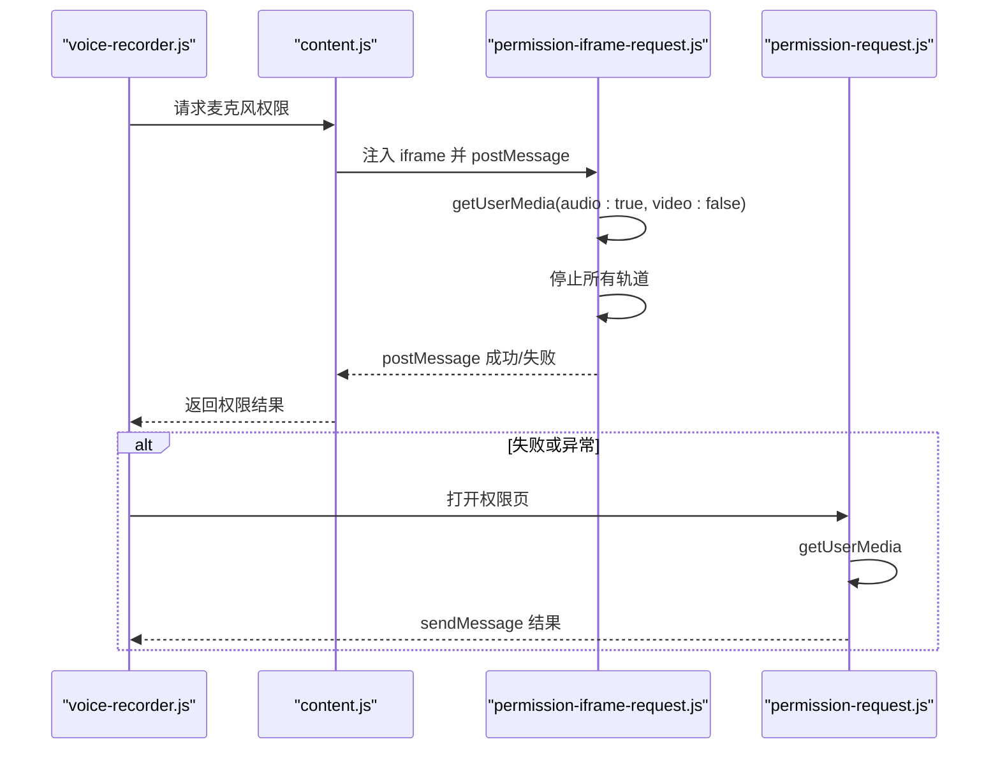
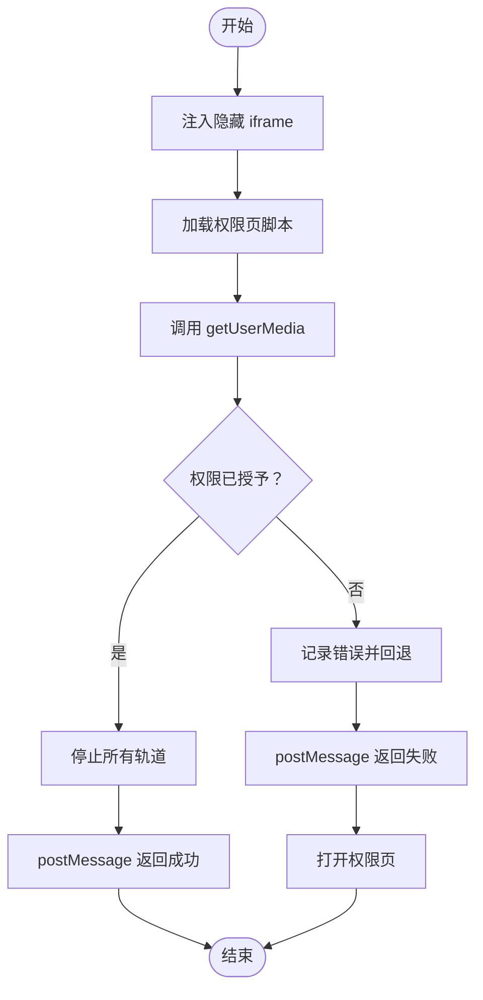
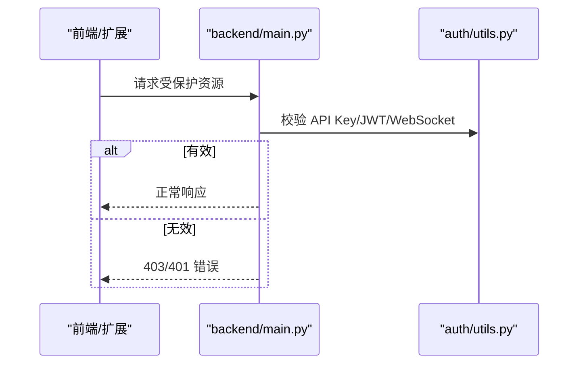
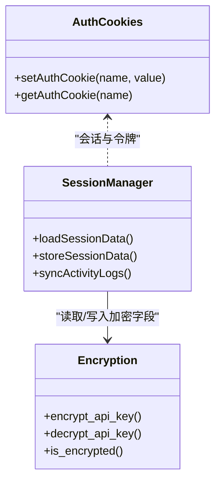
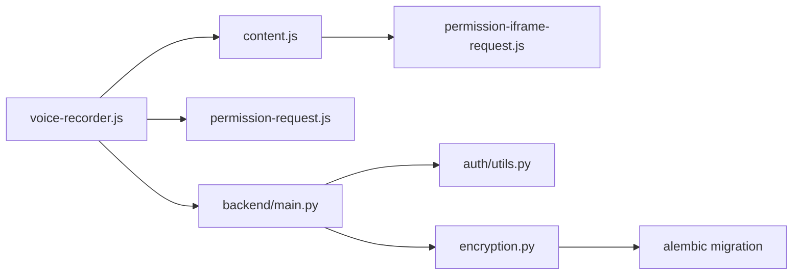

# 安全与权限模型

<cite>
**本文引用的文件**
- [permission-request.html](file://vibe_surf/chrome_extension/permission-request.html)
- [permission-request.js](file://vibe_surf/chrome_extension/scripts/permission-request.js)
- [permission-iframe.html](file://vibe_surf/chrome_extension/permission-iframe.html)
- [permission-iframe-request.js](file://vibe_surf/chrome_extension/scripts/permission-iframe-request.js)
- [content.js](file://vibe_surf/chrome_extension/content.js)
- [voice-recorder.js](file://vibe_surf/chrome_extension/scripts/voice-recorder.js)
- [main.py](file://vibe_surf/backend/main.py)
- [utils.py（认证工具）](file://vibe_surf/langflow/services/auth/utils.py)
- [mcp_encryption.py](file://vibe_surf/langflow/services/auth/mcp_encryption.py)
- [encryption.py（后端加密工具）](file://vibe_surf/backend/utils/encryption.py)
- [0882f9657f22_encrypt_existing_mcp_auth_settings_.py](file://vibe_surf/langflow/alembic/versions/0882f9657f22_encrypt_existing_mcp_auth_settings_.py)
- [session-manager.js](file://vibe_surf/chrome_extension/scripts/session-manager.js)
- [authContext.tsx](file://vibe_surf/frontend/src/contexts/authContext.tsx)
- [utils.ts（前端会话与Cookie工具）](file://vibe_surf/frontend/src/utils/utils.ts)
- [anti_detection.py](file://vibe_surf/workflows/Recruitment/boss_zhipin/anti_detection.py)
- [vibe_surf_prompt.py](file://vibe_surf/agents/prompts/vibe_surf_prompt.py)
</cite>

## 目录
1. [引言](#引言)
2. [项目结构](#项目结构)
3. [核心组件](#核心组件)
4. [架构总览](#架构总览)
5. [详细组件分析](#详细组件分析)
6. [依赖关系分析](#依赖关系分析)
7. [性能与安全特性](#性能与安全特性)
8. [故障排查指南](#故障排查指南)
9. [结论](#结论)
10. [附录](#附录)

## 引言
本文件系统性梳理 VibeSurf 的安全架构与权限管理机制，重点覆盖：
- 渐进式权限请求流程：permission-request.html 与相关脚本如何协同工作
- iframe 沙箱机制在处理敏感权限时的安全优势
- 后端对浏览器 API 调用的验证与审计
- 用户数据保护：会话加密与操作日志脱敏
- 威胁模型分析：XSS、CSRF、权限滥用等
- 安全开发最佳实践与漏洞报告流程

## 项目结构
围绕安全与权限的关键位置如下：
- 浏览器扩展（Chrome Extension）
  - 权限页面与脚本：permission-request.html、permission-request.js
  - 隐藏 iframe 与脚本：permission-iframe.html、permission-iframe-request.js
  - 内容脚本与录音器：content.js、voice-recorder.js
  - 会话管理：session-manager.js
- 后端（FastAPI + Langflow）
  - 入口与中间件：main.py
  - 认证与鉴权：langflow/services/auth/utils.py
  - 加密与迁移：langflow/services/auth/mcp_encryption.py、backend/utils/encryption.py、langflow/alembic/versions/...encrypt*.py
- 前端（React）
  - 认证上下文与 Cookie 策略：frontend/src/contexts/authContext.tsx、frontend/src/utils/utils.ts

图表来源
- [permission-request.html](file://vibe_surf/chrome_extension/permission-request.html#L1-L104)
- [permission-request.js](file://vibe_surf/chrome_extension/scripts/permission-request.js#L1-L118)
- [permission-iframe.html](file://vibe_surf/chrome_extension/permission-iframe.html#L1-L38)
- [permission-iframe-request.js](file://vibe_surf/chrome_extension/scripts/permission-iframe-request.js#L1-L188)
- [content.js](file://vibe_surf/chrome_extension/content.js#L290-L489)
- [voice-recorder.js](file://vibe_surf/chrome_extension/scripts/voice-recorder.js#L100-L299)
- [main.py](file://vibe_surf/backend/main.py#L543-L750)
- [utils.py（认证工具）](file://vibe_surf/langflow/services/auth/utils.py#L51-L170)
- [encryption.py（后端加密工具）](file://vibe_surf/backend/utils/encryption.py#L128-L172)
- [0882f9657f22_encrypt_existing_mcp_auth_settings_.py](file://vibe_surf/langflow/alembic/versions/0882f9657f22_encrypt_existing_mcp_auth_settings_.py#L25-L110)
- [authContext.tsx](file://vibe_surf/frontend/src/contexts/authContext.tsx#L1-L126)
- [utils.ts（前端会话与Cookie工具）](file://vibe_surf/frontend/src/utils/utils.ts#L908-L1033)

章节来源
- [main.py](file://vibe_surf/backend/main.py#L543-L750)

## 核心组件
- 渐进式权限请求链路
  - 新标签页方式：permission-request.html + permission-request.js
  - 隐藏 iframe 方式：permission-iframe.html + permission-iframe-request.js
  - 内容脚本注入与消息桥接：content.js
  - 录音器协调：voice-recorder.js
- 后端安全与审计
  - 中间件与 CORS、边界校验、序列化异常处理
  - 认证与鉴权：API Key/JWT 双通道、WebSocket 鉴权
  - 数据加密与迁移：敏感字段加密、升级/回滚
- 前端安全
  - Cookie 安全属性（secure、sameSite）、会话 ID 编解码与格式化
  - 认证上下文与令牌存储策略

章节来源
- [permission-request.html](file://vibe_surf/chrome_extension/permission-request.html#L1-L104)
- [permission-request.js](file://vibe_surf/chrome_extension/scripts/permission-request.js#L1-L118)
- [permission-iframe.html](file://vibe_surf/chrome_extension/permission-iframe.html#L1-L38)
- [permission-iframe-request.js](file://vibe_surf/chrome_extension/scripts/permission-iframe-request.js#L1-L188)
- [content.js](file://vibe_surf/chrome_extension/content.js#L290-L489)
- [voice-recorder.js](file://vibe_surf/chrome_extension/scripts/voice-recorder.js#L100-L299)
- [main.py](file://vibe_surf/backend/main.py#L543-L750)
- [utils.py（认证工具）](file://vibe_surf/langflow/services/auth/utils.py#L51-L170)
- [encryption.py（后端加密工具）](file://vibe_surf/backend/utils/encryption.py#L128-L172)
- [authContext.tsx](file://vibe_surf/frontend/src/contexts/authContext.tsx#L1-L126)
- [utils.ts（前端会话与Cookie工具）](file://vibe_surf/frontend/src/utils/utils.ts#L908-L1033)

## 架构总览
下图展示从浏览器扩展到后端的整体安全路径，以及关键的权限与数据流。

图表来源
- [voice-recorder.js](file://vibe_surf/chrome_extension/scripts/voice-recorder.js#L100-L299)
- [content.js](file://vibe_surf/chrome_extension/content.js#L290-L489)
- [permission-iframe-request.js](file://vibe_surf/chrome_extension/scripts/permission-iframe-request.js#L1-L188)
- [permission-request.js](file://vibe_surf/chrome_extension/scripts/permission-request.js#L1-L118)
- [main.py](file://vibe_surf/backend/main.py#L543-L750)
- [utils.py（认证工具）](file://vibe_surf/langflow/services/auth/utils.py#L51-L170)
- [encryption.py（后端加密工具）](file://vibe_surf/backend/utils/encryption.py#L128-L172)

## 详细组件分析

### 渐进式权限请求流程（permission-request.html 与相关脚本）
- 设计目标
  - 在最小权限约束下触发浏览器标准权限弹窗，避免扩展直接暴露敏感权限
  - 提供用户明确的“允许/拒绝”反馈，并通过消息或标签页关闭机制降低持久风险
- 关键步骤
  - 新标签页方式：permission-request.html 展示 UI，permission-request.js 调用 getUserMedia，收到流后立即停止，发送结果并通过 runtime.sendMessage 回传，随后自动关闭标签页
  - 隐藏 iframe 方式：permission-iframe.html + permission-iframe-request.js 在隐藏 iframe 中请求权限，成功后通过 postMessage 和可选的 chrome.runtime.sendMessage 通知父窗口与扩展
  - 内容脚本桥接：content.js 注入隐藏 iframe，监听结果，设置超时与清理逻辑；失败时回退到新标签页方式
- 安全要点
  - 权限获取后立即停止媒体轨道，减少隐私泄露窗口
  - 使用 postMessage 与 runtime.sendMessage 双通道，增强跨环境通信鲁棒性
  - 严格超时与错误处理，防止挂起与资源泄漏

图表来源
- [content.js](file://vibe_surf/chrome_extension/content.js#L290-L489)
- [permission-iframe-request.js](file://vibe_surf/chrome_extension/scripts/permission-iframe-request.js#L1-L188)
- [permission-request.js](file://vibe_surf/chrome_extension/scripts/permission-request.js#L1-L118)
- [voice-recorder.js](file://vibe_surf/chrome_extension/scripts/voice-recorder.js#L100-L299)

章节来源
- [permission-request.html](file://vibe_surf/chrome_extension/permission-request.html#L1-L104)
- [permission-request.js](file://vibe_surf/chrome_extension/scripts/permission-request.js#L1-L118)
- [permission-iframe.html](file://vibe_surf/chrome_extension/permission-iframe.html#L1-L38)
- [permission-iframe-request.js](file://vibe_surf/chrome_extension/scripts/permission-iframe-request.js#L1-L188)
- [content.js](file://vibe_surf/chrome_extension/content.js#L290-L489)
- [voice-recorder.js](file://vibe_surf/chrome_extension/scripts/voice-recorder.js#L100-L299)

### iframe 沙箱机制与安全优势
- 机制说明
  - 隐藏 iframe 仅承载权限请求，不渲染可见内容，使用 allow="microphone" 显式声明所需能力
  - 通过 postMessage 与父窗口通信，避免扩展直接持有敏感权限
- 安全优势
  - 最小权限原则：iframe 仅在需要时激活，且权限获取后立即释放
  - 隔离风险：iframe 与主页面隔离，降低 XSS/CSRF 对主页面的影响面
  - 可观测性：统一的消息协议便于审计与调试

图表来源
- [permission-iframe.html](file://vibe_surf/chrome_extension/permission-iframe.html#L1-L38)
- [permission-iframe-request.js](file://vibe_surf/chrome_extension/scripts/permission-iframe-request.js#L1-L188)
- [content.js](file://vibe_surf/chrome_extension/content.js#L290-L489)

章节来源
- [permission-iframe.html](file://vibe_surf/chrome_extension/permission-iframe.html#L1-L38)
- [permission-iframe-request.js](file://vibe_surf/chrome_extension/scripts/permission-iframe-request.js#L1-L188)
- [content.js](file://vibe_surf/chrome_extension/content.js#L290-L489)

### 后端验证与审计（浏览器 API 调用）
- 认证与鉴权
  - 支持 API Key 与 JWT 双通道，WebSocket 同样支持查询参数或头部传递
  - 自动登录与超级用户配置，提供严格的安全检查与错误提示
- 中间件与边界校验
  - CORS 全通配置（需结合部署策略审慎使用）
  - JavaScript MIME 类型中间件，统一 .js 响应类型
  - 文件上传 multipart 边界格式与格式校验，防止畸形请求
- 审计与可观测性
  - Sentry 集成，异常捕获与追踪
  - 健康检查与状态接口，便于运维监控

图表来源
- [main.py](file://vibe_surf/backend/main.py#L543-L750)
- [utils.py（认证工具）](file://vibe_surf/langflow/services/auth/utils.py#L51-L170)

章节来源
- [main.py](file://vibe_surf/backend/main.py#L543-L750)
- [utils.py（认证工具）](file://vibe_surf/langflow/services/auth/utils.py#L51-L170)

### 用户数据保护（会话加密与操作日志脱敏）
- 会话与令牌
  - 前端使用 secure、sameSite="strict" 的 Cookie 存储访问令牌与刷新令牌
  - 会话 ID 编解码与格式化，确保在 URL 传输中的安全性
- 敏感数据保护
  - 后端对敏感字段（如认证设置）进行加密存储，提供升级/回滚迁移
  - 加密工具具备“是否加密”检测，兼容明文与密文场景
- 操作日志
  - 会话管理器支持从数据库加载任务与活动日志，同步至前端
  - 日志中对密码等敏感信息进行脱敏处理（例如输入框值以掩码形式显示）

图表来源
- [session-manager.js](file://vibe_surf/chrome_extension/scripts/session-manager.js#L81-L156)
- [encryption.py（后端加密工具）](file://vibe_surf/backend/utils/encryption.py#L128-L172)
- [authContext.tsx](file://vibe_surf/frontend/src/contexts/authContext.tsx#L1-L126)
- [utils.ts（前端会话与Cookie工具）](file://vibe_surf/frontend/src/utils/utils.ts#L908-L1033)

章节来源
- [session-manager.js](file://vibe_surf/chrome_extension/scripts/session-manager.js#L81-L156)
- [encryption.py（后端加密工具）](file://vibe_surf/backend/utils/encryption.py#L128-L172)
- [authContext.tsx](file://vibe_surf/frontend/src/contexts/authContext.tsx#L1-L126)
- [utils.ts（前端会话与Cookie工具）](file://vibe_surf/frontend/src/utils/utils.ts#L908-L1033)

### 威胁模型与缓解策略
- XSS
  - 前端组件与路由尽量避免内联事件与动态 eval
  - 输入输出严格转义与白名单过滤
- CSRF
  - 后端采用严格的 API Key/JWT 鉴权，WebSocket 同样要求凭据
  - 前端 Cookie 设置 secure 与 sameSite，降低跨站请求风险
- 权限滥用
  - 渐进式权限：仅在用户交互触发时请求，且立即释放
  - iframe 沙箱：最小权限与隔离
  - 代理与审计：统一入口与日志记录，便于追踪异常行为
- 业务风控
  - 工作流层引入反检测策略（频率限制、指纹管理、异常检测），降低被封禁风险

章节来源
- [anti_detection.py](file://vibe_surf/workflows/Recruitment/boss_zhipin/anti_detection.py#L122-L158)
- [anti_detection.py](file://vibe_surf/workflows/Recruitment/boss_zhipin/anti_detection.py#L612-L653)
- [vibe_surf_prompt.py](file://vibe_surf/agents/prompts/vibe_surf_prompt.py#L173-L195)

## 依赖关系分析
- 组件耦合
  - voice-recorder.js 依赖 content.js 注入 iframe 与权限结果
  - content.js 依赖 permission-iframe-request.js 的消息协议
  - 后端依赖认证工具与加密工具，确保敏感数据安全
- 外部依赖
  - Sentry 用于异常监控
  - Alembic 迁移负责敏感字段加密升级

图表来源
- [voice-recorder.js](file://vibe_surf/chrome_extension/scripts/voice-recorder.js#L100-L299)
- [content.js](file://vibe_surf/chrome_extension/content.js#L290-L489)
- [permission-iframe-request.js](file://vibe_surf/chrome_extension/scripts/permission-iframe-request.js#L1-L188)
- [permission-request.js](file://vibe_surf/chrome_extension/scripts/permission-request.js#L1-L118)
- [main.py](file://vibe_surf/backend/main.py#L543-L750)
- [utils.py（认证工具）](file://vibe_surf/langflow/services/auth/utils.py#L51-L170)
- [encryption.py（后端加密工具）](file://vibe_surf/backend/utils/encryption.py#L128-L172)
- [0882f9657f22_encrypt_existing_mcp_auth_settings_.py](file://vibe_surf/langflow/alembic/versions/0882f9657f22_encrypt_existing_mcp_auth_settings_.py#L25-L110)

章节来源
- [main.py](file://vibe_surf/backend/main.py#L543-L750)
- [utils.py（认证工具）](file://vibe_surf/langflow/services/auth/utils.py#L51-L170)
- [encryption.py（后端加密工具）](file://vibe_surf/backend/utils/encryption.py#L128-L172)
- [0882f9657f22_encrypt_existing_mcp_auth_settings_.py](file://vibe_surf/langflow/alembic/versions/0882f9657f22_encrypt_existing_mcp_auth_settings_.py#L25-L110)

## 性能与安全特性
- 性能
  - 权限获取后立即停止媒体轨道，避免持续占用资源
  - iframe 注入与超时控制，防止长时间阻塞
- 安全
  - 最小权限与沙箱隔离
  - 统一的认证与审计入口
  - 敏感字段加密与迁移保障

[本节为通用指导，无需特定文件来源]

## 故障排查指南
- 权限未授予
  - 检查浏览器地址栏权限图标与系统权限设置
  - 查看扩展日志：permission-request.js 与 permission-iframe-request.js 的错误分支
- iframe 注入失败
  - 确认 content.js 注入逻辑与超时处理
  - 检查 postMessage 目标源与消息协议一致性
- 后端鉴权失败
  - 确认 API Key 或 JWT 是否正确传递
  - 检查 WebSocket 凭据传递方式
- 加密相关问题
  - 检查 is_encrypted 判断与迁移脚本执行情况
  - 若出现解密失败，确认密钥配置与字段格式

章节来源
- [permission-request.js](file://vibe_surf/chrome_extension/scripts/permission-request.js#L1-L118)
- [permission-iframe-request.js](file://vibe_surf/chrome_extension/scripts/permission-iframe-request.js#L1-L188)
- [content.js](file://vibe_surf/chrome_extension/content.js#L290-L489)
- [utils.py（认证工具）](file://vibe_surf/langflow/services/auth/utils.py#L51-L170)
- [encryption.py（后端加密工具）](file://vibe_surf/backend/utils/encryption.py#L128-L172)
- [0882f9657f22_encrypt_existing_mcp_auth_settings_.py](file://vibe_surf/langflow/alembic/versions/0882f9657f22_encrypt_existing_mcp_auth_settings_.py#L25-L110)

## 结论
VibeSurf 通过渐进式权限请求与 iframe 沙箱机制，将敏感权限的暴露面降至最低；后端以统一的认证与审计入口强化了 API 安全；前端采用 secure/sameSite Cookie 与会话 ID 编解码策略，配合后端加密与迁移，形成端到端的数据保护闭环。同时，工作流层的反检测策略进一步降低了业务层面的风险。

[本节为总结，无需特定文件来源]

## 附录
- 安全开发最佳实践
  - 严格最小权限原则与沙箱隔离
  - 统一认证与审计入口，避免分散授权
  - 敏感字段加密与密钥轮换
  - 输入校验与输出脱敏
  - 定期安全扫描与渗透测试
- 漏洞报告流程
  - 通过项目渠道提交漏洞详情（含复现步骤、影响范围）
  - 团队评估与修复优先级，发布补丁并致谢
  - 对外披露遵循负责任披露原则

[本节为通用指导，无需特定文件来源]