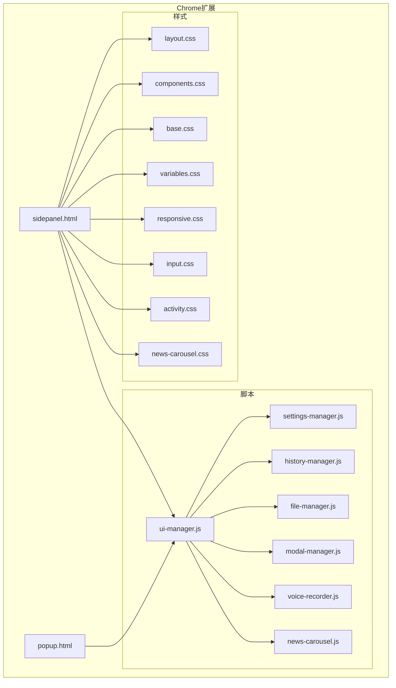
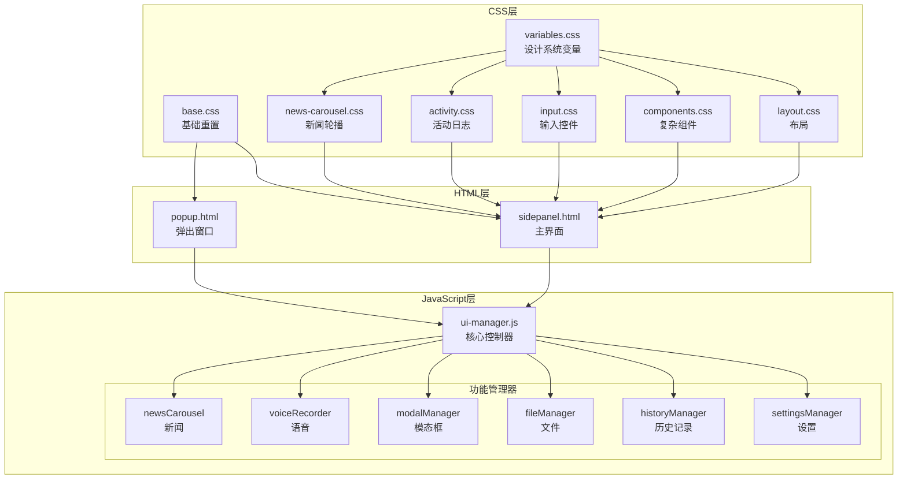
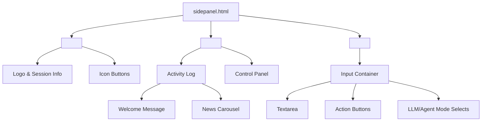
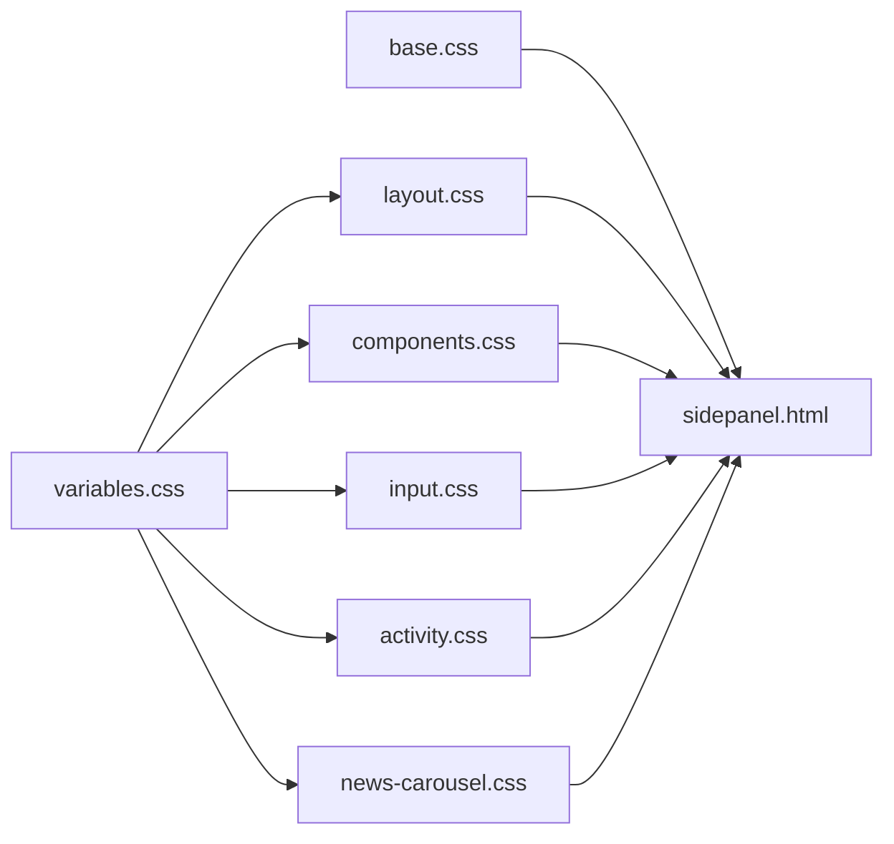
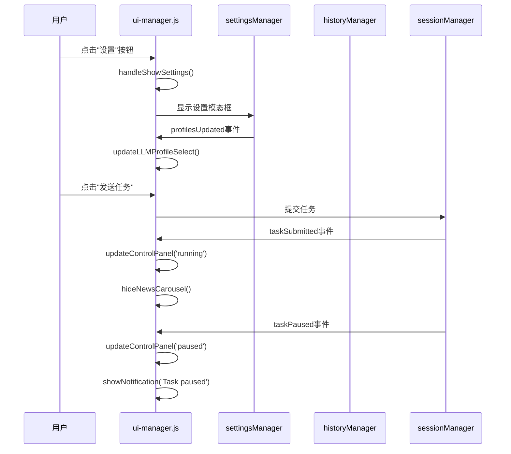
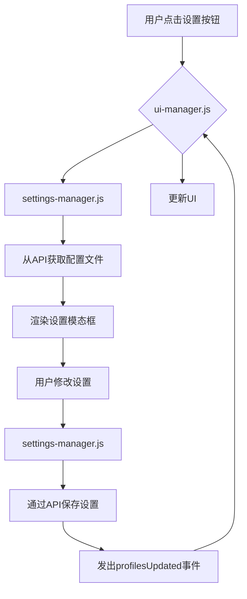
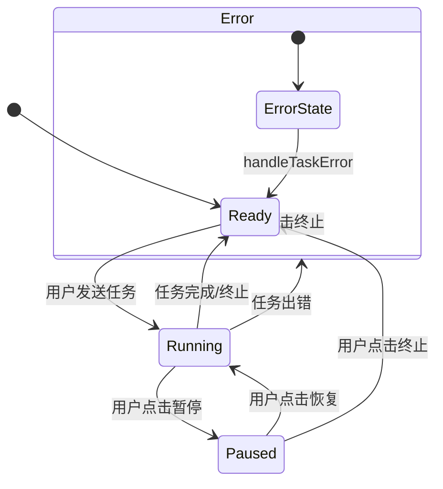
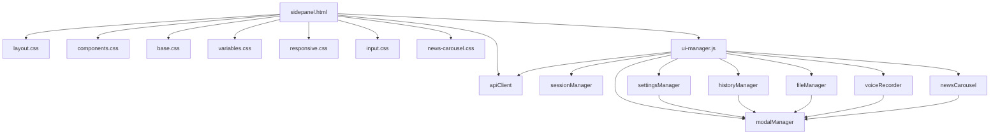

# 扩展UI组件

<cite>
**本文档引用的文件**   
- [sidepanel.html](file://vibe_surf/chrome_extension/sidepanel.html)
- [popup.html](file://vibe_surf/chrome_extension/popup.html)
- [ui-manager.js](file://vibe_surf/chrome_extension/scripts/ui-manager.js)
- [layout.css](file://vibe_surf/chrome_extension/styles/layout.css)
- [components.css](file://vibe_surf/chrome_extension/styles/components.css)
- [base.css](file://vibe_surf/chrome_extension/styles/base.css)
- [variables.css](file://vibe_surf/chrome_extension/styles/variables.css)
- [responsive.css](file://vibe_surf/chrome_extension/styles/responsive.css)
- [input.css](file://vibe_surf/chrome_extension/styles/input.css)
- [activity.css](file://vibe_surf/chrome_extension/styles/activity.css)
- [news-carousel.css](file://vibe_surf/chrome_extension/styles/news-carousel.css)
</cite>

## 目录
1. [介绍](#介绍)
2. [项目结构](#项目结构)
3. [核心组件](#核心组件)
4. [架构概述](#架构概述)
5. [详细组件分析](#详细组件分析)
6. [依赖分析](#依赖分析)
7. [性能考虑](#性能考虑)
8. [故障排除指南](#故障排除指南)
9. [结论](#结论)

## 介绍
本文档详细记录了VibeSurf Chrome扩展的用户界面组件。分析重点包括sidepanel.html和popup.html的HTML结构及其响应式设计，CSS样式表（如layout.css和components.css）如何实现现代化的UI布局和视觉效果，以及ui-manager.js如何动态管理UI状态、处理用户交互和协调不同界面模块。文档涵盖了消息通知、设置面板、工作流记录器等核心UI功能的实现细节，并提供了界面状态转换图和用户操作流程图。同时，文档还包含了可访问性(A11Y)设计和多语言支持的考虑。

## 项目结构
VibeSurf Chrome扩展的用户界面主要由`vibe_surf/chrome_extension`目录下的文件构成。核心UI文件包括`sidepanel.html`和`popup.html`，它们定义了扩展的主要界面结构。样式文件位于`styles`子目录中，采用模块化设计，将不同的样式规则分离到独立的CSS文件中，如`layout.css`负责整体布局，`components.css`负责复杂组件，`input.css`负责输入控件等。JavaScript逻辑由`scripts`目录下的多个模块化脚本文件处理，其中`ui-manager.js`是核心的UI协调器，负责管理整个用户界面的状态和交互。

**Diagram sources**
- [sidepanel.html](file://vibe_surf/chrome_extension/sidepanel.html)
- [popup.html](file://vibe_surf/chrome_extension/popup.html)
- [ui-manager.js](file://vibe_surf/chrome_extension/scripts/ui-manager.js)
- [layout.css](file://vibe_surf/chrome_extension/styles/layout.css)
- [components.css](file://vibe_surf/chrome_extension/styles/components.css)

**Section sources**
- [sidepanel.html](file://vibe_surf/chrome_extension/sidepanel.html)
- [popup.html](file://vibe_surf/chrome_extension/popup.html)
- [ui-manager.js](file://vibe_surf/chrome_extension/scripts/ui-manager.js)

## 核心组件
Chrome扩展的核心UI组件围绕`sidepanel.html`构建，它提供了一个功能丰富的侧边栏面板。该面板采用现代化的布局设计，包含一个固定头部、一个可滚动的活动日志区域和一个位于底部的输入区域。头部包含应用Logo、会话ID和用于访问历史记录、设置和升级的图标按钮。活动日志区域在任务未运行时显示欢迎消息和新闻轮播，在任务运行时则显示交互式日志。输入区域包含一个多行文本框，用于输入任务指令，并配有语音输入、文件附加和发送按钮。此外，通过`ui-manager.js`协调的多个模态窗口（如历史记录、设置、配置文件管理）提供了对扩展功能的深入访问。

**Section sources**
- [sidepanel.html](file://vibe_surf/chrome_extension/sidepanel.html)
- [ui-manager.js](file://vibe_surf/chrome_extension/scripts/ui-manager.js)

## 架构概述
VibeSurf扩展的UI架构采用模块化和分层的设计模式。最底层是CSS样式系统，由`variables.css`定义设计系统变量（颜色、间距、字体等），`base.css`提供重置和基础样式，`layout.css`定义整体容器和布局，而`components.css`、`input.css`等文件则负责特定UI元素的样式。HTML结构（`sidepanel.html`和`popup.html`）构建了用户界面的骨架。JavaScript层由`ui-manager.js`作为核心控制器，它初始化并协调多个专门的管理器（如`settingsManager`、`historyManager`），这些管理器各自负责特定功能模块的UI逻辑和状态管理，实现了关注点分离。

**Diagram sources**
- [sidepanel.html](file://vibe_surf/chrome_extension/sidepanel.html)
- [popup.html](file://vibe_surf/chrome_extension/popup.html)
- [ui-manager.js](file://vibe_surf/chrome_extension/scripts/ui-manager.js)
- [layout.css](file://vibe_surf/chrome_extension/styles/layout.css)
- [components.css](file://vibe_surf/chrome_extension/styles/components.css)
- [base.css](file://vibe_surf/chrome_extension/styles/base.css)
- [variables.css](file://vibe_surf/chrome_extension/styles/variables.css)

## 详细组件分析

### HTML结构与响应式设计
`sidepanel.html`和`popup.html`的HTML结构清晰地划分了UI区域。`sidepanel.html`采用垂直堆叠的Flexbox布局，分为`<header>`、`<main>`和`<footer>`三部分。`<header>`包含Logo和操作按钮，`<main>`包含活动日志和控制面板，`<footer>`包含输入控件。`popup.html`则是一个简单的弹出窗口，用于快速访问侧边栏。响应式设计通过`responsive.css`中的媒体查询实现，确保在不同屏幕尺寸下（如移动设备）都能提供良好的用户体验，例如调整模态框大小、改变按钮布局和优化字体大小。

#### HTML结构图

**Diagram sources**
- [sidepanel.html](file://vibe_surf/chrome_extension/sidepanel.html)

### CSS样式系统
CSS样式系统采用模块化方法，将样式规则分离到不同的文件中。`variables.css`是整个设计系统的基石，定义了如`--primary-color`、`--bg-primary`等CSS变量，确保了主题的一致性。`base.css`提供基础重置和全局样式。`layout.css`使用Flexbox定义了`.vibesurf-container`的整体布局。`components.css`和`input.css`等文件则定义了按钮、模态框、选择器等具体组件的视觉样式和交互效果（如悬停、激活状态）。

#### 样式系统依赖图

**Diagram sources**
- [variables.css](file://vibe_surf/chrome_extension/styles/variables.css)
- [base.css](file://vibe_surf/chrome_extension/styles/base.css)
- [layout.css](file://vibe_surf/chrome_extension/styles/layout.css)
- [components.css](file://vibe_surf/chrome_extension/styles/components.css)
- [input.css](file://vibe_surf/chrome_extension/styles/input.css)
- [activity.css](file://vibe_surf/chrome_extension/styles/activity.css)
- [news-carousel.css](file://vibe_surf/chrome_extension/styles/news-carousel.css)

### ui-manager.js动态管理
`ui-manager.js`是UI逻辑的核心，它通过`VibeSurfUIManager`类实现。该类在构造函数中初始化多个专门的管理器（如`settingsManager`, `historyManager`），并通过`setupManagerEvents`方法监听这些管理器发出的事件（如`profilesUpdated`, `loadSession`），从而协调整个UI的状态。例如，当`settingsManager`通知配置文件已更新时，`ui-manager`会相应地更新LLM选择下拉菜单。它还通过`bindEvents`方法绑定DOM事件（如按钮点击），并通过`setupSessionListeners`监听会话状态变化（如`taskSubmitted`, `taskPaused`），并调用`updateControlPanel`等方法来更新UI。

#### ui-manager.js事件流

**Diagram sources**
- [ui-manager.js](file://vibe_surf/chrome_extension/scripts/ui-manager.js)

### 核心UI功能实现
核心UI功能通过多个模块协同工作实现。**消息通知**由`ui-manager.js`的`showNotification`方法处理，它可能使用`modal-manager.js`创建一个临时的模态框来显示成功或错误信息。**设置面板**由`settings-manager.js`管理，它处理与后端API的通信，并通过事件与`ui-manager`同步状态。**工作流记录器**的功能可能由`workflow-recorder.js`脚本实现，并通过`ui-manager`集成到设置面板中。所有这些功能都遵循一致的设计语言，由CSS变量和组件样式统一控制。

#### 设置面板工作流

**Diagram sources**
- [ui-manager.js](file://vibe_surf/chrome_extension/scripts/ui-manager.js)
- [settings-manager.js](file://vibe_surf/chrome_extension/scripts/settings-manager.js)

### 界面状态转换
UI的状态主要由任务的生命周期驱动。`ui-manager.js`通过`updateControlPanel`方法管理控制面板的状态，该方法根据`sessionManager`提供的任务状态（'ready', 'running', 'paused', 'error'）来显示或隐藏“暂停”、“恢复”和“终止”按钮。`updateUIForTaskStatus`方法则负责禁用或启用输入框、发送按钮和语音输入等控件，以防止在任务运行时进行不一致的操作。

#### 界面状态转换图

**Diagram sources**
- [ui-manager.js](file://vibe_surf/chrome_extension/scripts/ui-manager.js)

### 可访问性与多语言支持
可访问性（A11Y）设计在代码中有所体现，例如使用语义化的HTML标签（`<header>`, `<main>`, `<footer>`）、为图标按钮提供`title`属性作为工具提示，以及在`base.css`中通过`prefers-reduced-motion`媒体查询来减少动画效果。多语言支持目前主要体现在`sidepanel.html`中硬编码的中文文本（如“热点资讯”），但更完善的实现可能需要一个国际化（i18n）库来动态加载不同语言的资源文件。

**Section sources**
- [sidepanel.html](file://vibe_surf/chrome_extension/sidepanel.html)
- [base.css](file://vibe_surf/chrome_extension/styles/base.css)

## 依赖分析
UI组件之间存在清晰的依赖关系。`sidepanel.html`直接依赖于`styles`目录下的所有CSS文件来呈现样式。`ui-manager.js`是核心依赖枢纽，它直接依赖于`sessionManager`和`apiClient`，并初始化和依赖于`settingsManager`、`historyManager`等多个功能管理器。这些功能管理器反过来可能依赖于`modal-manager.js`来创建和管理模态窗口。这种分层依赖结构确保了代码的模块化和可维护性。

**Diagram sources**
- [sidepanel.html](file://vibe_surf/chrome_extension/sidepanel.html)
- [ui-manager.js](file://vibe_surf/chrome_extension/scripts/ui-manager.js)

## 性能考虑
UI的性能考虑主要体现在响应式设计和事件处理上。`responsive.css`确保了在小屏幕设备上的良好性能，避免了不必要的重排和重绘。JavaScript方面，`ui-manager.js`通过集中管理事件监听器（在`bindEvents`中绑定）和使用事件委托来优化性能。此外，新闻轮播等动态内容采用懒加载或按需初始化（在`handleSessionCreated`中初始化）的策略，避免在应用启动时加载所有资源，从而加快了初始加载速度。

## 故障排除指南
当UI出现问题时，可以按照以下步骤进行排查：
1.  **检查网络和API连接**：确认`popup.html`中的状态指示灯是否显示“Connected”。如果显示“Disconnected”，可能是后端服务未运行。
2.  **检查控制台错误**：打开Chrome开发者工具，查看Console标签页是否有JavaScript错误，这通常能直接定位到问题文件和行号。
3.  **验证UI状态**：如果按钮无响应，检查`ui-manager.js`中的`updateUIForTaskStatus`方法，确认当前任务状态是否正确地禁用了相关控件。
4.  **检查样式加载**：如果UI样式错乱，确认`sidepanel.html`中所有`<link rel="stylesheet">`的路径是否正确，CSS文件是否成功加载。
5.  **检查事件绑定**：如果交互无效，检查`ui-manager.js`的`bindEvents`方法，确认事件监听器是否已正确绑定到DOM元素。

**Section sources**
- [popup.html](file://vibe_surf/chrome_extension/popup.html)
- [ui-manager.js](file://vibe_surf/chrome_extension/scripts/ui-manager.js)

## 结论
VibeSurf Chrome扩展的用户界面设计体现了模块化、响应式和可维护性的原则。通过将HTML、CSS和JavaScript逻辑清晰地分离，并采用事件驱动的架构，`ui-manager.js`有效地协调了各个功能模块，为用户提供了一个直观且功能强大的交互界面。其现代化的视觉设计得益于CSS变量和模块化样式表，而对可访问性的考虑则提升了产品的包容性。未来可以进一步完善多语言支持，以服务更广泛的用户群体。