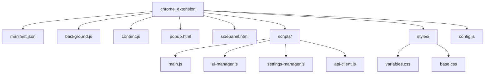
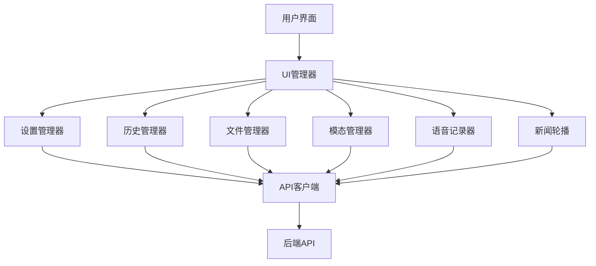
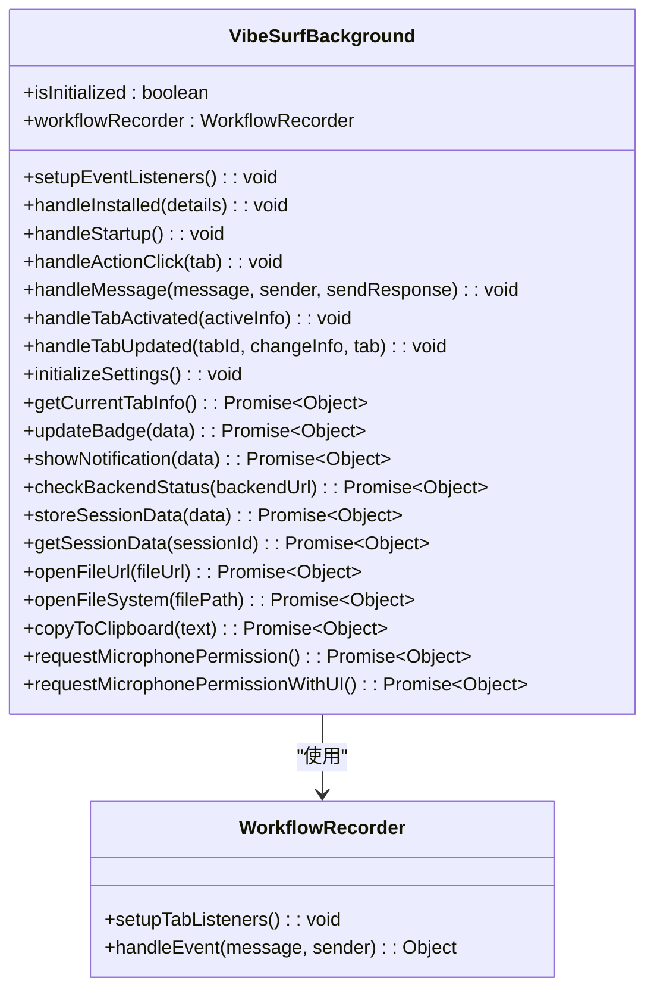
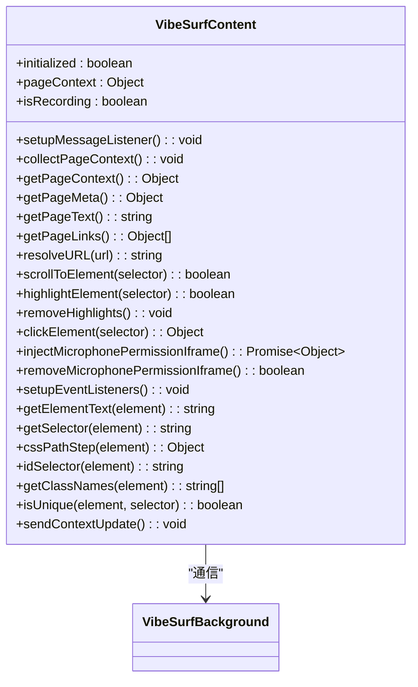
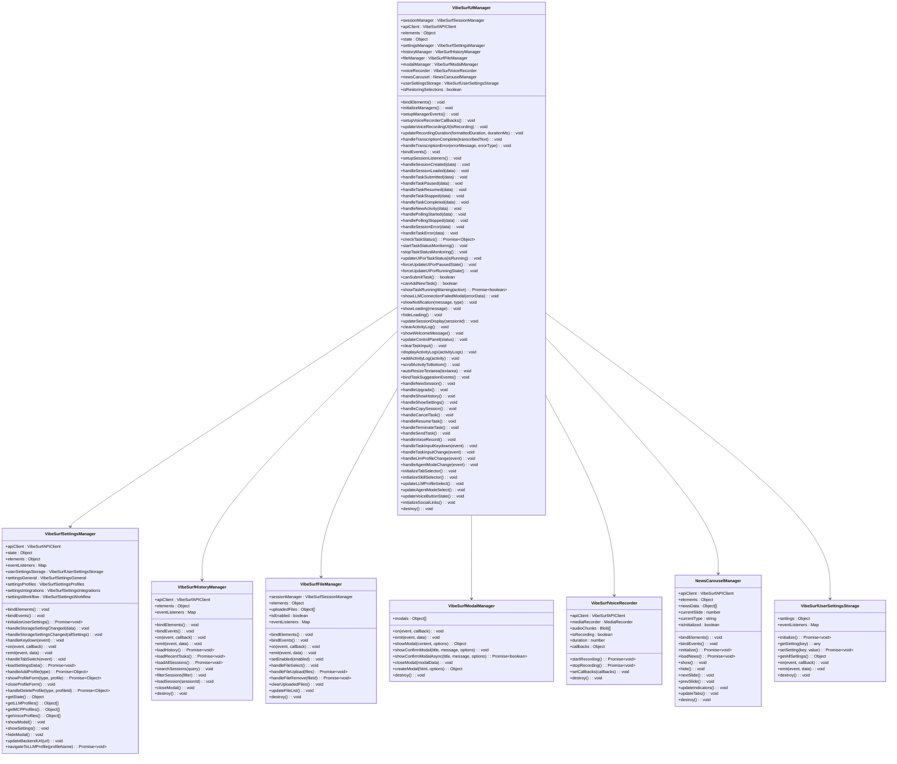
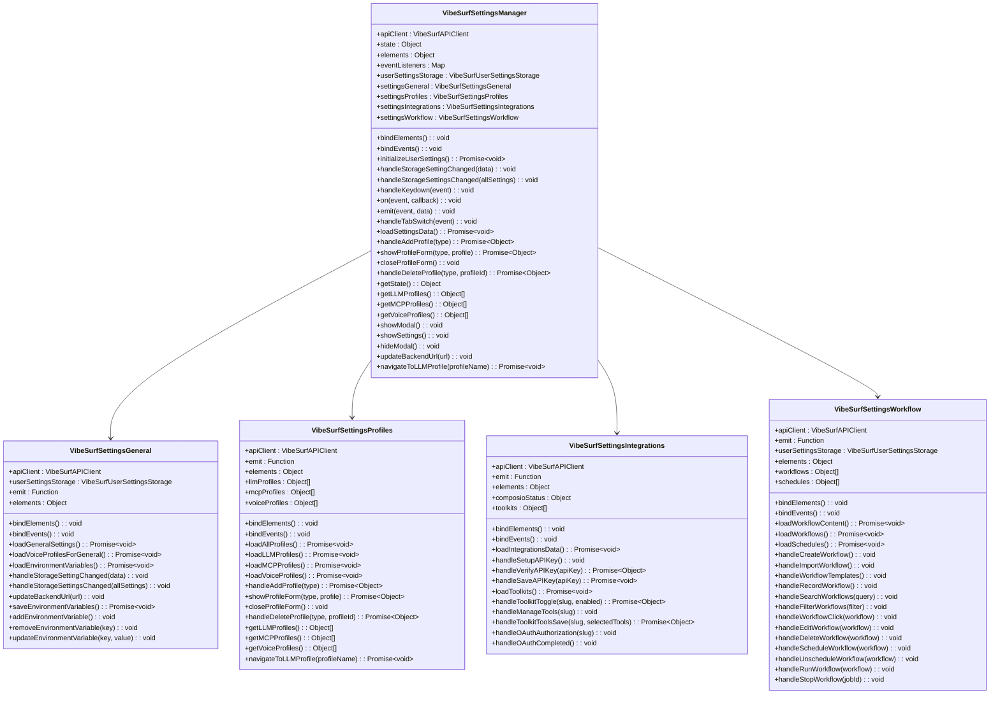
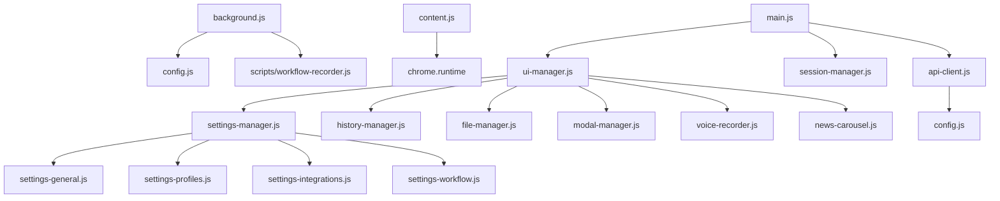

# 扩展开发指南

<cite>
**本文档引用的文件**  
- [manifest.json](file://vibe_surf/chrome_extension/manifest.json)
- [background.js](file://vibe_surf/chrome_extension/background.js)
- [content.js](file://vibe_surf/chrome_extension/content.js)
- [popup.html](file://vibe_surf/chrome_extension/popup.html)
- [sidepanel.html](file://vibe_surf/chrome_extension/sidepanel.html)
- [main.js](file://vibe_surf/chrome_extension/scripts/main.js)
- [ui-manager.js](file://vibe_surf/chrome_extension/scripts/ui-manager.js)
- [settings-manager.js](file://vibe_surf/chrome_extension/scripts/settings-manager.js)
- [api-client.js](file://vibe_surf/chrome_extension/scripts/api-client.js)
- [config.js](file://vibe_surf/chrome_extension/config.js)
- [styles/variables.css](file://vibe_surf/chrome_extension/styles/variables.css)
- [styles/base.css](file://vibe_surf/chrome_extension/styles/base.css)
</cite>

## 目录
1. [简介](#简介)
2. [项目结构](#项目结构)
3. [核心组件](#核心组件)
4. [架构概述](#架构概述)
5. [详细组件分析](#详细组件分析)
6. [依赖分析](#依赖分析)
7. [性能考虑](#性能考虑)
8. [故障排除指南](#故障排除指南)
9. [结论](#结论)

## 简介
VibeSurf 是一个功能强大的 Chrome 扩展，旨在通过 AI 自动化增强浏览体验。该扩展提供侧边栏界面，支持会话管理、任务自动化、语音识别和多种集成。本指南将详细介绍扩展的开发和定制流程，涵盖从环境设置到功能扩展的完整开发周期。

## 项目结构
VibeSurf 扩展的结构遵循 Chrome 扩展的标准模式，包含多个关键目录和文件。核心功能位于 `vibe_surf/chrome_extension` 目录中，该目录包含扩展的主文件、脚本、样式和配置。

**Diagram sources**
- [manifest.json](file://vibe_surf/chrome_extension/manifest.json)
- [background.js](file://vibe_surf/chrome_extension/background.js)
- [content.js](file://vibe_surf/chrome_extension/content.js)
- [popup.html](file://vibe_surf/chrome_extension/popup.html)
- [sidepanel.html](file://vibe_surf/chrome_extension/sidepanel.html)
- [main.js](file://vibe_surf/chrome_extension/scripts/main.js)
- [ui-manager.js](file://vibe_surf/chrome_extension/scripts/ui-manager.js)
- [settings-manager.js](file://vibe_surf/chrome_extension/scripts/settings-manager.js)
- [api-client.js](file://vibe_surf/chrome_extension/scripts/api-client.js)
- [config.js](file://vibe_surf/chrome_extension/config.js)
- [styles/variables.css](file://vibe_surf/chrome_extension/styles/variables.css)
- [styles/base.css](file://vibe_surf/chrome_extension/styles/base.css)

**Section sources**
- [manifest.json](file://vibe_surf/chrome_extension/manifest.json)
- [background.js](file://vibe_surf/chrome_extension/background.js)
- [content.js](file://vibe_surf/chrome_extension/content.js)
- [popup.html](file://vibe_surf/chrome_extension/popup.html)
- [sidepanel.html](file://vibe_surf/chrome_extension/sidepanel.html)

## 核心组件
VibeSurf 扩展的核心组件包括背景脚本、内容脚本、侧边栏界面和模块化 JavaScript 文件。这些组件协同工作，提供无缝的用户体验和强大的功能。

**Section sources**
- [background.js](file://vibe_surf/chrome_extension/background.js)
- [content.js](file://vibe_surf/chrome_extension/content.js)
- [main.js](file://vibe_surf/chrome_extension/scripts/main.js)
- [ui-manager.js](file://vibe_surf/chrome_extension/scripts/ui-manager.js)

## 架构概述
VibeSurf 扩展采用模块化架构，将功能分解为独立的组件，每个组件负责特定的任务。这种设计提高了代码的可维护性和可扩展性。

**Diagram sources**
- [ui-manager.js](file://vibe_surf/chrome_extension/scripts/ui-manager.js)
- [settings-manager.js](file://vibe_surf/chrome_extension/scripts/settings-manager.js)
- [api-client.js](file://vibe_surf/chrome_extension/scripts/api-client.js)

## 详细组件分析
### 背景脚本分析
背景脚本是扩展的主控中心，负责处理扩展的生命周期、侧边栏管理和跨上下文通信。

**Diagram sources**
- [background.js](file://vibe_surf/chrome_extension/background.js)

**Section sources**
- [background.js](file://vibe_surf/chrome_extension/background.js)

### 内容脚本分析
内容脚本在网页上下文中运行，可以与页面内容交互。它负责收集页面上下文、处理用户事件和与背景脚本通信。

**Diagram sources**
- [content.js](file://vibe_surf/chrome_extension/content.js)

**Section sources**
- [content.js](file://vibe_surf/chrome_extension/content.js)

### 主脚本分析
主脚本是扩展的入口点，负责初始化和协调所有组件。

```mermaid
classDiagram
class VibeSurfApp {
+apiClient : VibeSurfAPIClient
+sessionManager : VibeSurfSessionManager
+uiManager : VibeSurfUIManager
+settings : Object
+isInitialized : boolean
+initialize() : Promise~void~
+loadSettings() : Promise~void~
+initializeAPIClient() : void
+checkBackendConnection() : Promise~boolean~
+retryBackendConnection() : void
+initializeSessionManager() : void
+initializeUIManager() : Promise~void~
+setupErrorHandling() : void
+setupHealthChecks() : void
+handleInitializationError(error) : void
+retryInitialization() : Promise~void~
+updateSettings(newSettings) : Promise~void~
+getCurrentTabContext() : Promise~Object~
+destroy() : void
+getStatus() : Object
}
class VibeSurfAPIClient {
+baseURL : string
+apiPrefix : string
+timeout : number
+retryAttempts : number
+retryDelay : number
+request(method, endpoint, options) : Promise~Object~
+get(endpoint, options) : Promise~Object~
+post(endpoint, data, options) : Promise~Object~
+put(endpoint, data, options) : Promise~Object~
+delete(endpoint, options) : Promise~Object~
+healthCheck() : Promise~Object~
+getSystemStatus() : Promise~Object~
+submitTask(taskData) : Promise~Object~
+getTaskStatus() : Promise~Object~
+checkTaskRunning() : Promise~Object~
+pauseTask(reason) : Promise~Object~
+resumeTask(reason) : Promise~Object~
+stopTask(reason) : Promise~Object~
+addNewTask(newTask) : Promise~Object~
+getTaskInfo(taskId) : Promise~Object~
+getSessionTasks(sessionId) : Promise~Object~
+getSessionActivity(sessionId, params) : Promise~Object~
+getLatestActivity(sessionId) : Promise~Object~
+getRecentTasks(limit) : Promise~Object~
+getAllSessions(limit, offset) : Promise~Object~
+pollSessionActivity(sessionId, messageIndex, interval) : Promise~Object~
+uploadFiles(files, sessionId) : Promise~Object~
+listFiles(sessionId, limit, offset) : Promise~Object~
+downloadFile(fileId) : Promise~Object~
+deleteFile(fileId) : Promise~Object~
+getConfigStatus() : Promise~Object~
+getLLMProfiles(activeOnly, limit, offset) : Promise~Object~
+getLLMProfile(profileName) : Promise~Object~
+createLLMProfile(profileData) : Promise~Object~
+updateLLMProfile(profileName, updateData) : Promise~Object~
+deleteLLMProfile(profileName) : Promise~Object~
+setDefaultLLMProfile(profileName) : Promise~Object~
+getMCPProfiles(activeOnly, limit, offset) : Promise~Object~
+getMCPProfile(profileName) : Promise~Object~
+createMCPProfile(profileData) : Promise~Object~
+updateMCPProfile(profileName, updateData) : Promise~Object~
+deleteMCPProfile(profileName) : Promise~Object~
+getLLMProviders() : Promise~Object~
+getLLMProviderModels(providerName) : Promise~Object~
+getVoiceProfiles(activeOnly, voiceModelType, limit, offset) : Promise~Object~
+getVoiceProfile(profileName) : Promise~Object~
+createVoiceProfile(profileData) : Promise~Object~
+updateVoiceProfile(profileName, updateData) : Promise~Object~
+deleteVoiceProfile(profileName) : Promise~Object~
+getVoiceModels(modelType) : Promise~Object~
+transcribeAudio(audioBlob, voiceProfileName) : Promise~Object~
+getASRProfiles(activeOnly) : Promise~Object~
+getEnvironmentVariables() : Promise~Object~
+updateEnvironmentVariables(variables) : Promise~Object~
+getControllerConfig() : Promise~Object~
+updateControllerConfig(configData) : Promise~Object~
+getActiveBrowserTab() : Promise~Object~
+getAllBrowserTabs() : Promise~Object~
+getAllSkills() : Promise~Object~
+delay(ms) : Promise~void~
+setBaseURL(newBaseURL) : void
+generateSessionId(prefix) : Promise~string~
+verifyComposioKey(apiKey) : Promise~Object~
+getComposioToolkits(params) : Promise~Object~
+toggleComposioToolkit(slug, enabled) : Promise~Object~
+getComposioToolkitTools(slug) : Promise~Object~
+updateComposioToolkitTools(slug, selectedTools) : Promise~Object~
+getComposioToolkitConnectionStatus(slug) : Promise~Object~
+getComposioStatus() : Promise~Object~
+verifyVibeSurfKey(apiKey) : Promise~Object~
+getVibeSurfStatus() : Promise~Object~
+deleteVibeSurfKey() : Promise~Object~
+validateVibeSurfKey() : Promise~Object~
+getWorkflows() : Promise~Object~
+runWorkflow(flowId) : Promise~Object~
+cancelWorkflow(jobId) : Promise~Object~
+getWorkflowEvents(jobId) : Promise~Object~
+getWorkflow(flowId) : Promise~Object~
+deleteWorkflow(flowId) : Promise~Object~
+exportWorkflow(flowId) : Promise~Object~
+getSchedules() : Promise~Object~
+createSchedule(scheduleData) : Promise~Object~
+updateSchedule(flowId, scheduleData) : Promise~Object~
+deleteSchedule(flowId) : Promise~Object~
+getSchedule(flowId) : Promise~Object~
+getProjects() : Promise~Object~
+getProjectFlows(projectId, params) : Promise~Object~
+generateUUID() : Promise~Object~
+createWorkflow(workflowData) : Promise~Object~
+importWorkflow(workflowJson) : Promise~Object~
+getVibeSurfVersion() : Promise~Object~
+getExtensionPath() : Promise~Object~
+getNewsSources(newsType) : Promise~Object~
+getNews(sourceId, newsType, count) : Promise~Object~
}
class VibeSurfSessionManager {
+apiClient : VibeSurfAPIClient
+pollingFrequency : number
+isPolling : boolean
+currentSessionId : string
+taskStatus : string
+activityLogs : Object[]
+on(event, callback) : void
+emit(event, data) : void
+createSession() : Promise~Object~
+loadSession(sessionId) : Promise~Object~
+submitTask(taskData) : Promise~Object~
+pauseTask(reason) : Promise~Object~
+resumeTask(reason) : Promise~Object~
+stopTask(reason) : Promise~Object~
+addNewTask(newTask) : Promise~Object~
+getActivityLogs() : Object[]
+getTaskStatus() : string
+isSessionActive() : boolean
+hasActiveTask() : boolean
+getCurrentSessionId() : string
+startPolling() : void
+stopPolling() : void
+destroy() : void
}
class VibeSurfUIManager {
+sessionManager : VibeSurfSessionManager
+apiClient : VibeSurfAPIClient
+elements : Object
+state : Object
+settingsManager : VibeSurfSettingsManager
+historyManager : VibeSurfHistoryManager
+fileManager : VibeSurfFileManager
+modalManager : VibeSurfModalManager
+voiceRecorder : VibeSurfVoiceRecorder
+newsCarousel : NewsCarouselManager
+userSettingsStorage : VibeSurfUserSettingsStorage
+isRestoringSelections : boolean
+bindElements() : void
+initializeManagers() : void
+setupManagerEvents() : void
+setupVoiceRecorderCallbacks() : void
+updateVoiceRecordingUI(isRecording) : void
+updateRecordingDuration(formattedDuration, durationMs) : void
+handleTranscriptionComplete(transcribedText) : void
+handleTranscriptionError(errorMessage, errorType) : void
+bindEvents() : void
+setupSessionListeners() : void
+handleSessionCreated(data) : void
+handleSessionLoaded(data) : void
+handleTaskSubmitted(data) : void
+handleTaskPaused(data) : void
+handleTaskResumed(data) : void
+handleTaskStopped(data) : void
+handleTaskCompleted(data) : void
+handleNewActivity(data) : void
+handlePollingStarted(data) : void
+handlePollingStopped(data) : void
+handleSessionError(data) : void
+handleTaskError(data) : void
+checkTaskStatus() : Promise~Object~
+startTaskStatusMonitoring() : void
+stopTaskStatusMonitoring() : void
+updateUIForTaskStatus(isRunning) : void
+forceUpdateUIForPausedState() : void
+forceUpdateUIForRunningState() : void
+canSubmitTask() : boolean
+canAddNewTask() : boolean
+showTaskRunningWarning(action) : Promise~boolean~
+showLLMConnectionFailedModal(errorData) : void
+showNotification(message, type) : void
+showLoading(message) : void
+hideLoading() : void
+updateSessionDisplay(sessionId) : void
+clearActivityLog() : void
+showWelcomeMessage() : void
+updateControlPanel(status) : void
+clearTaskInput() : void
+displayActivityLogs(activityLogs) : void
+addActivityLog(activity) : void
+scrollActivityToBottom() : void
+autoResizeTextarea(textarea) : void
+bindTaskSuggestionEvents() : void
+handleNewSession() : void
+handleUpgrade() : void
+handleShowHistory() : void
+handleShowSettings() : void
+handleCopySession() : void
+handleCancelTask() : void
+handleResumeTask() : void
+handleTerminateTask() : void
+handleSendTask() : void
+handleVoiceRecord() : void
+handleTaskInputKeydown(event) : void
+handleTaskInputChange(event) : void
+handleLlmProfileChange(event) : void
+handleAgentModeChange(event) : void
+initializeTabSelector() : void
+initializeSkillSelector() : void
+updateLLMProfileSelect() : void
+updateAgentModeSelect() : void
+updateVoiceButtonState() : void
+initializeSocialLinks() : void
+destroy() : void
}
VibeSurfApp --> VibeSurfAPIClient
VibeSurfApp --> VibeSurfSessionManager
VibeSurfApp --> VibeSurfUIManager
```

**Diagram sources**
- [main.js](file://vibe_surf/chrome_extension/scripts/main.js)
- [api-client.js](file://vibe_surf/chrome_extension/scripts/api-client.js)

**Section sources**
- [main.js](file://vibe_surf/chrome_extension/scripts/main.js)

### UI管理器分析
UI管理器负责协调用户界面和会话交互，与专门的模块（如设置、历史、文件和模态）进行协调。

**Diagram sources**
- [ui-manager.js](file://vibe_surf/chrome_extension/scripts/ui-manager.js)

**Section sources**
- [ui-manager.js](file://vibe_surf/chrome_extension/scripts/ui-manager.js)

### 设置管理器分析
设置管理器负责协调设置UI并委派给专门的模块。

**Diagram sources**
- [settings-manager.js](file://vibe_surf/chrome_extension/scripts/settings-manager.js)

**Section sources**
- [settings-manager.js](file://vibe_surf/chrome_extension/scripts/settings-manager.js)

## 依赖分析
VibeSurf 扩展的依赖关系清晰地展示了各个组件之间的相互依赖。

**Diagram sources**
- [background.js](file://vibe_surf/chrome_extension/background.js)
- [content.js](file://vibe_surf/chrome_extension/content.js)
- [main.js](file://vibe_surf/chrome_extension/scripts/main.js)
- [ui-manager.js](file://vibe_surf/chrome_extension/scripts/ui-manager.js)
- [settings-manager.js](file://vibe_surf/chrome_extension/scripts/settings-manager.js)
- [api-client.js](file://vibe_surf/chrome_extension/scripts/api-client.js)
- [config.js](file://vibe_surf/chrome_extension/config.js)

**Section sources**
- [background.js](file://vibe_surf/chrome_extension/background.js)
- [content.js](file://vibe_surf/chrome_extension/content.js)
- [main.js](file://vibe_surf/chrome_extension/scripts/main.js)
- [ui-manager.js](file://vibe_surf/chrome_extension/scripts/ui-manager.js)
- [settings-manager.js](file://vibe_surf/chrome_extension/scripts/settings-manager.js)
- [api-client.js](file://vibe_surf/chrome_extension/scripts/api-client.js)
- [config.js](file://vibe_surf/chrome_extension/config.js)

## 性能考虑
VibeSurf 扩展在设计时考虑了性能优化，确保在各种使用场景下都能提供流畅的用户体验。

**Section sources**
- [background.js](file://vibe_surf/chrome_extension/background.js)
- [content.js](file://vibe_surf/chrome_extension/content.js)
- [main.js](file://vibe_surf/chrome_extension/scripts/main.js)
- [ui-manager.js](file://vibe_surf/chrome_extension/scripts/ui-manager.js)

## 故障排除指南
### 调试技巧
使用 Chrome 开发者工具检查扩展上下文和网络请求是调试 VibeSurf 扩展的关键。

1. **检查扩展上下文**：
   - 打开 Chrome 开发者工具
   - 切换到 "Sources" 面板
   - 在左侧的文件树中找到扩展的文件
   - 设置断点并调试代码

2. **检查网络请求**：
   - 打开 Chrome 开发者工具
   - 切换到 "Network" 面板
   - 观察所有网络请求，特别是与后端 API 的通信
   - 检查请求和响应的详细信息

**Section sources**
- [background.js](file://vibe_surf/chrome_extension/background.js)
- [content.js](file://vibe_surf/chrome_extension/content.js)
- [main.js](file://vibe_surf/chrome_extension/scripts/main.js)
- [ui-manager.js](file://vibe_surf/chrome_extension/scripts/ui-manager.js)
- [api-client.js](file://vibe_surf/chrome_extension/scripts/api-client.js)

## 结论
VibeSurf 扩展是一个功能强大且模块化的 Chrome 扩展，通过 AI 自动化增强了浏览体验。本指南详细介绍了扩展的开发和定制流程，涵盖了从环境设置到功能扩展的完整开发周期。通过理解扩展的架构和组件，开发者可以轻松地添加新功能、自定义 UI 外观和扩展现有 API 客户端以支持新的服务集成。