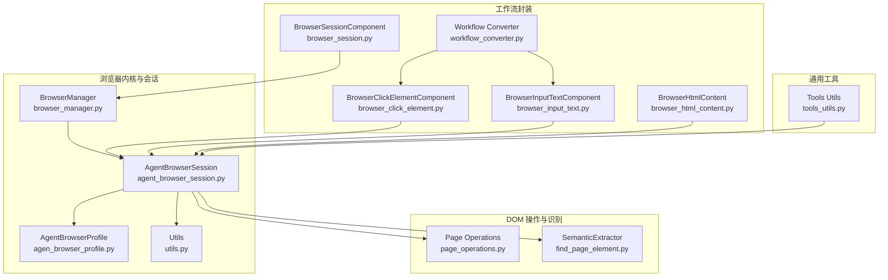
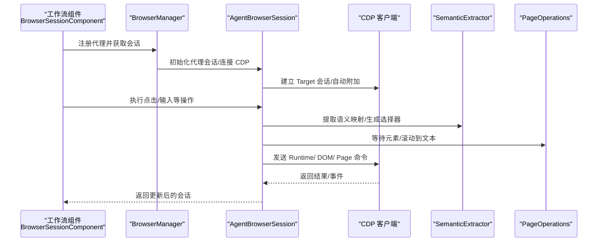
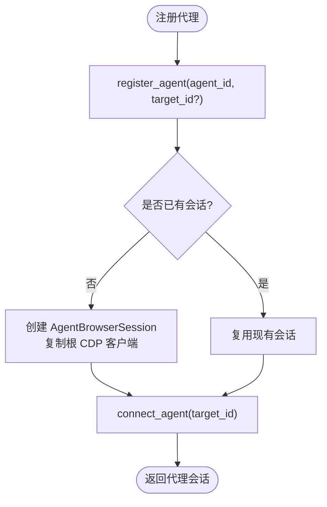
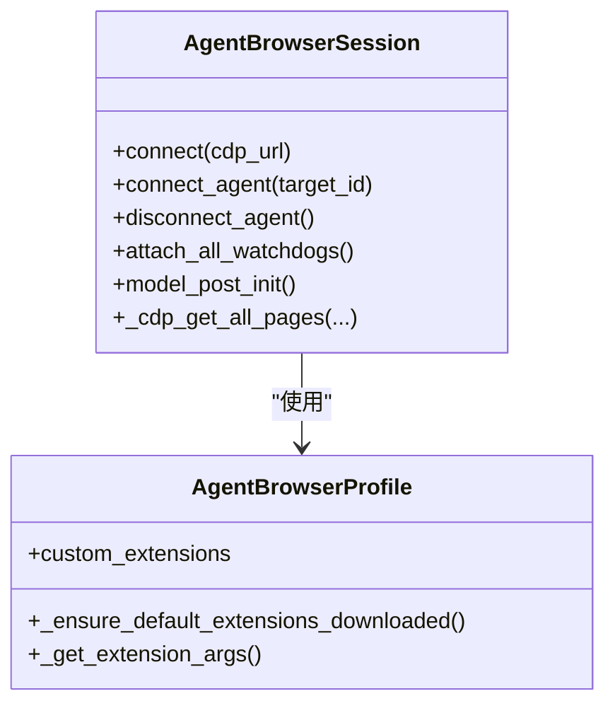
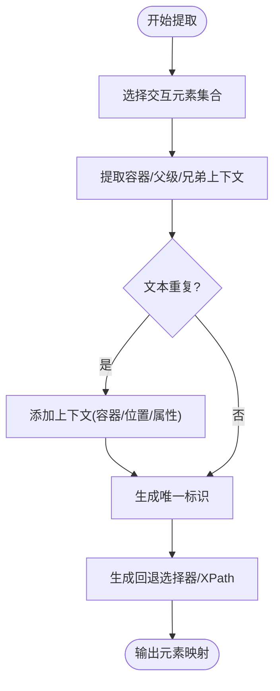
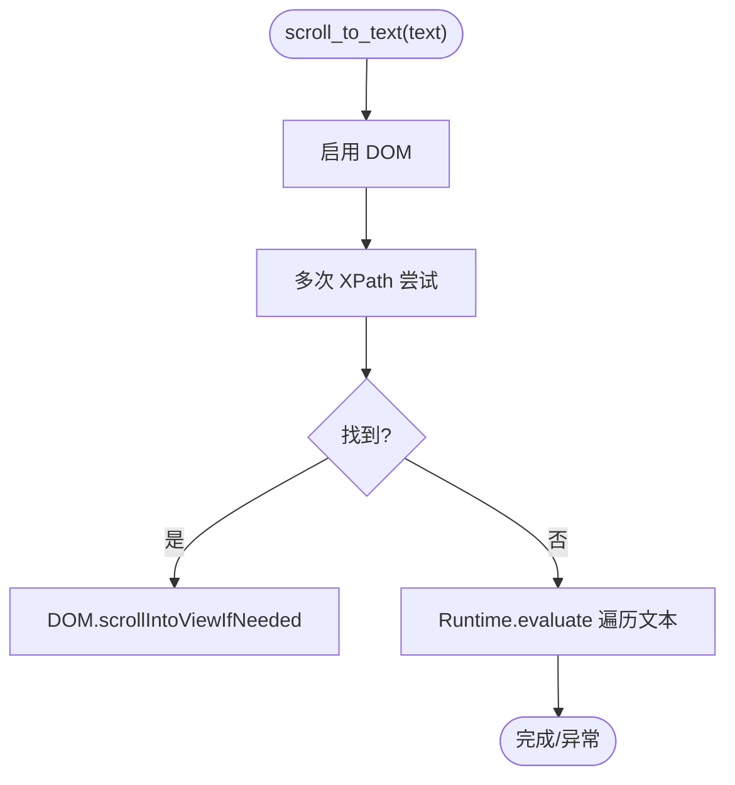
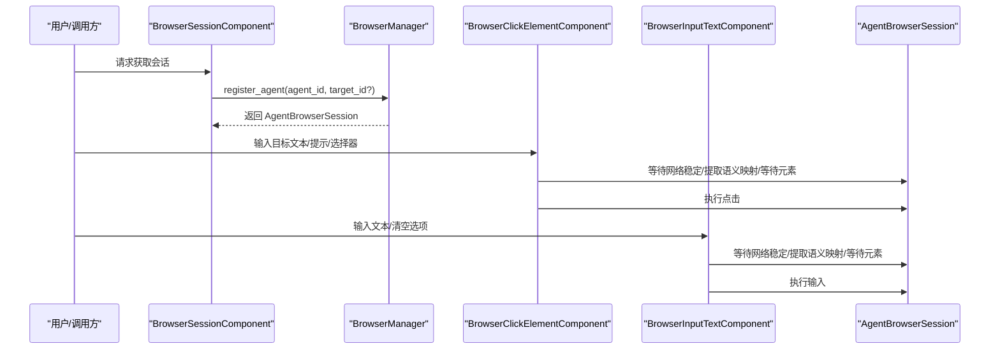
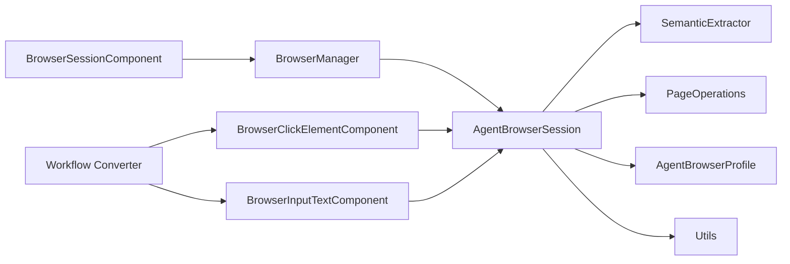

# 浏览器自动化引擎

<cite>
**本文引用的文件**
- [browser_manager.py](file://vibe_surf/browser/browser_manager.py)
- [agent_browser_session.py](file://vibe_surf/browser/agent_browser_session.py)
- [find_page_element.py](file://vibe_surf/browser/find_page_element.py)
- [page_operations.py](file://vibe_surf/browser/page_operations.py)
- [agen_browser_profile.py](file://vibe_surf/browser/agen_browser_profile.py)
- [utils.py](file://vibe_surf/browser/utils.py)
- [browser_session.py](file://vibe_surf/workflows/Browser/browser_session.py)
- [browser_click_element.py](file://vibe_surf/workflows/Browser/browser_click_element.py)
- [browser_input_text.py](file://vibe_surf/workflows/Browser/browser_input_text.py)
- [workflow_converter.py](file://vibe_surf/backend/utils/workflow_converter.py)
- [browser_html_content.py](file://vibe_surf/workflows/Browser/browser_html_content.py)
- [tools_utils.py](file://vibe_surf/tools/utils.py)
</cite>

## 目录
1. [引言](#引言)
2. [项目结构](#项目结构)
3. [核心组件](#核心组件)
4. [架构总览](#架构总览)
5. [详细组件分析](#详细组件分析)
6. [依赖关系分析](#依赖关系分析)
7. [性能考量](#性能考量)
8. [故障排查指南](#故障排查指南)
9. [结论](#结论)
10. [附录](#附录)

## 引言
本技术文档聚焦于浏览器自动化引擎，围绕以下目标展开：
- 深入解析 browser_manager.py 如何管理浏览器实例生命周期与多会话协调
- 说明 agent_browser_session.py 实现的代理级浏览器会话隔离机制
- 详细描述 page_operations.py 提供的核心 DOM 操作方法（元素定位、点击、输入、滚动、导航等）
- 阐述 find_page_element.py 中的智能元素识别算法及其容错机制
- 总结性能优化策略（操作批处理、异步执行、选择器优先策略）
- 提供典型自动化场景的使用路径与参考流程（表单填写、数据抓取、交互式任务）

## 项目结构
浏览器自动化相关代码主要位于 vibe_surf/browser 与 vibe_surf/workflows/Browser 两个目录中：
- 浏览器内核与会话管理：browser_manager.py、agent_browser_session.py、agen_browser_profile.py、utils.py
- DOM 操作与元素识别：page_operations.py、find_page_element.py
- 工作流封装与示例：browser_session.py、browser_click_element.py、browser_input_text.py、browser_html_content.py、workflow_converter.py
- 通用工具与兜底能力：tools_utils.py

图表来源
- [browser_manager.py](file://vibe_surf/browser/browser_manager.py#L1-L269)
- [agent_browser_session.py](file://vibe_surf/browser/agent_browser_session.py#L1-L200)
- [agen_browser_profile.py](file://vibe_surf/browser/agen_browser_profile.py#L1-L137)
- [utils.py](file://vibe_surf/browser/utils.py#L1-L120)
- [page_operations.py](file://vibe_surf/browser/page_operations.py#L1-L223)
- [find_page_element.py](file://vibe_surf/browser/find_page_element.py#L1-L200)
- [browser_session.py](file://vibe_surf/workflows/Browser/browser_session.py#L1-L55)
- [browser_click_element.py](file://vibe_surf/workflows/Browser/browser_click_element.py#L1-L196)
- [browser_input_text.py](file://vibe_surf/workflows/Browser/browser_input_text.py#L1-L170)
- [browser_html_content.py](file://vibe_surf/workflows/Browser/browser_html_content.py#L45-L73)
- [workflow_converter.py](file://vibe_surf/backend/utils/workflow_converter.py#L67-L126)
- [tools_utils.py](file://vibe_surf/tools/utils.py#L169-L184)

章节来源
- [browser_manager.py](file://vibe_surf/browser/browser_manager.py#L1-L269)
- [agent_browser_session.py](file://vibe_surf/browser/agent_browser_session.py#L1-L200)
- [find_page_element.py](file://vibe_surf/browser/find_page_element.py#L1-L200)
- [page_operations.py](file://vibe_surf/browser/page_operations.py#L1-L223)
- [agen_browser_profile.py](file://vibe_surf/browser/agen_browser_profile.py#L1-L137)
- [utils.py](file://vibe_surf/browser/utils.py#L1-L120)
- [browser_session.py](file://vibe_surf/workflows/Browser/browser_session.py#L1-L55)
- [browser_click_element.py](file://vibe_surf/workflows/Browser/browser_click_element.py#L1-L196)
- [browser_input_text.py](file://vibe_surf/workflows/Browser/browser_input_text.py#L1-L170)
- [browser_html_content.py](file://vibe_surf/workflows/Browser/browser_html_content.py#L45-L73)
- [workflow_converter.py](file://vibe_surf/backend/utils/workflow_converter.py#L67-L126)
- [tools_utils.py](file://vibe_surf/tools/utils.py#L169-L184)

## 核心组件
- BrowserManager：集中管理共享主会话与多个代理专属 AgentBrowserSession，负责目标页签分配、安全校验、资源清理与连接状态检查。
- AgentBrowserSession：基于浏览器会话扩展的代理级会话，提供 CDP 连接、页面会话池、事件分发、代理焦点切换、代理专属上下文与扩展加载。
- SemanticExtractor：从页面提取交互元素语义映射，生成稳定的选择器与层级上下文，支持去重与容错。
- PageOperations：提供滚动到文本、等待元素可见、直接选择器尝试等基础 DOM 操作辅助函数。
- AgentBrowserProfile：代理浏览器配置，支持扩展加载、沙箱/安全参数、渲染一致性等。
- 工作流组件：BrowserSessionComponent、BrowserClickElementComponent、BrowserInputTextComponent 等，封装自动化步骤并对接 AgentBrowserSession。

章节来源
- [browser_manager.py](file://vibe_surf/browser/browser_manager.py#L24-L178)
- [agent_browser_session.py](file://vibe_surf/browser/agent_browser_session.py#L51-L170)
- [find_page_element.py](file://vibe_surf/browser/find_page_element.py#L18-L120)
- [page_operations.py](file://vibe_surf/browser/page_operations.py#L1-L120)
- [agen_browser_profile.py](file://vibe_surf/browser/agen_browser_profile.py#L24-L137)
- [browser_session.py](file://vibe_surf/workflows/Browser/browser_session.py#L1-L55)
- [browser_click_element.py](file://vibe_surf/workflows/Browser/browser_click_element.py#L1-L196)
- [browser_input_text.py](file://vibe_surf/workflows/Browser/browser_input_text.py#L1-L170)

## 架构总览
浏览器自动化引擎采用“共享主会话 + 多代理会话”的双层架构：
- 共享主会话负责全局目标页签管理、连接状态维护与跨代理资源回收
- 代理会话为每个 Agent 提供独立的 CDP 会话池与事件上下文，确保会话隔离与安全边界
- DOM 层通过 SemanticExtractor 与 PageOperations 提供稳定的元素定位与交互能力
- 工作流组件以组件化方式编排自动化步骤，统一接入 AgentBrowserSession

图表来源
- [browser_session.py](file://vibe_surf/workflows/Browser/browser_session.py#L42-L55)
- [browser_manager.py](file://vibe_surf/browser/browser_manager.py#L47-L106)
- [agent_browser_session.py](file://vibe_surf/browser/agent_browser_session.py#L171-L245)
- [find_page_element.py](file://vibe_surf/browser/find_page_element.py#L211-L260)
- [page_operations.py](file://vibe_surf/browser/page_operations.py#L175-L223)

## 详细组件分析

### BrowserManager：多代理会话与目标页签管理
- 职责
  - 维护共享主会话与代理会话映射
  - 分配/回收目标页签，进行归属校验与安全控制
  - 生命周期管理：注册、注销、关闭、连接状态检查
  - 获取活动标签与所有标签信息
- 关键点
  - 通过根 CDP 客户端统一管理 Target，避免跨代理误操作
  - 目标页签分配时校验归属，防止越权访问
  - 注销时可选择关闭对应页签，确保资源回收
  - 提供连接健康检查与活动页签检测

图表来源
- [browser_manager.py](file://vibe_surf/browser/browser_manager.py#L47-L106)

章节来源
- [browser_manager.py](file://vibe_surf/browser/browser_manager.py#L24-L178)

### AgentBrowserSession：代理级会话隔离与扩展加载
- 职责
  - CDP 连接与 Target 自动附加
  - 代理焦点切换与 Tab 事件派发
  - 代理专属上下文与扩展加载（默认扩展缓存与参数注入）
  - 会话池管理（按 target_id 维度）
- 关键点
  - 通过 AgentBrowserProfile 控制浏览器启动参数（沙箱、安全、渲染一致性、扩展等）
  - 连接成功后注入欢迎模态与代理认证处理逻辑
  - 事件总线绑定各类浏览器事件处理器，便于 Watchdog 初始化

图表来源
- [agent_browser_session.py](file://vibe_surf/browser/agent_browser_session.py#L51-L170)
- [agen_browser_profile.py](file://vibe_surf/browser/agen_browser_profile.py#L24-L137)

章节来源
- [agent_browser_session.py](file://vibe_surf/browser/agent_browser_session.py#L171-L245)
- [agen_browser_profile.py](file://vibe_surf/browser/agen_browser_profile.py#L24-L137)

### SemanticExtractor：智能元素识别与容错
- 职责
  - 从页面提取交互元素，生成稳定选择器与层级上下文
  - 处理重复文本，通过容器、兄弟节点、DOM 路径等上下文去重
  - 生成回退选择器与 XPath，提升容错性
- 关键点
  - 优先使用语义化属性（role、data-*、aria-*）与标签类型推断控件类型
  - 对日历、下拉、预订等复杂控件生成专用上下文
  - 通过 JavaScript 评估在 CDP 中执行，保证与页面运行环境一致

图表来源
- [find_page_element.py](file://vibe_surf/browser/find_page_element.py#L18-L120)
- [find_page_element.py](file://vibe_surf/browser/find_page_element.py#L211-L260)

章节来源
- [find_page_element.py](file://vibe_surf/browser/find_page_element.py#L18-L120)
- [find_page_element.py](file://vibe_surf/browser/find_page_element.py#L211-L260)

### PageOperations：DOM 操作辅助
- 职责
  - 滚动到文本：优先 DOM 搜索，失败回退 JavaScript 遍历
  - 直接选择器尝试：对纯字母数字 ID/name 进行清洗与变体尝试
  - 等待元素：支持超时轮询与回退选择器链
- 关键点
  - 严格区分 CDP 与 Playwright 的差异，避免 XPath 在 CDP 下不支持的情况
  - 对多匹配选择器进行严格模式提示与降级策略

图表来源
- [page_operations.py](file://vibe_surf/browser/page_operations.py#L9-L98)

章节来源
- [page_operations.py](file://vibe_surf/browser/page_operations.py#L9-L98)
- [page_operations.py](file://vibe_surf/browser/page_operations.py#L100-L173)
- [page_operations.py](file://vibe_surf/browser/page_operations.py#L175-L223)

### 工作流组件：表单填写与交互式任务
- BrowserSessionComponent：从共享状态获取 BrowserManager 并注册/复用代理会话
- BrowserClickElementComponent：根据文本/层级/提示/自定义选择器定位元素并点击，自动处理新标签页
- BrowserInputTextComponent：根据文本/层级/提示/自定义选择器定位输入框并填充，支持清空
- workflow_converter：将外部动作序列转换为工作流图，串联点击/输入/滚动等步骤

图表来源
- [browser_session.py](file://vibe_surf/workflows/Browser/browser_session.py#L42-L55)
- [browser_click_element.py](file://vibe_surf/workflows/Browser/browser_click_element.py#L90-L196)
- [browser_input_text.py](file://vibe_surf/workflows/Browser/browser_input_text.py#L85-L170)
- [workflow_converter.py](file://vibe_surf/backend/utils/workflow_converter.py#L67-L126)

章节来源
- [browser_session.py](file://vibe_surf/workflows/Browser/browser_session.py#L1-L55)
- [browser_click_element.py](file://vibe_surf/workflows/Browser/browser_click_element.py#L1-L196)
- [browser_input_text.py](file://vibe_surf/workflows/Browser/browser_input_text.py#L1-L170)
- [workflow_converter.py](file://vibe_surf/backend/utils/workflow_converter.py#L67-L126)

## 依赖关系分析
- 组件耦合
  - BrowserManager 与 AgentBrowserSession 双向协作：前者提供共享主会话与目标页签，后者提供代理上下文与事件
  - AgentBrowserSession 依赖 SemanticExtractor 与 PageOperations 进行元素定位与等待
  - 工作流组件依赖 AgentBrowserSession 的公共接口（等待网络稳定、获取当前页面、切换焦点等）
- 外部依赖
  - CDP 客户端用于底层通信（Target、Runtime、DOM、Page）
  - 扩展加载通过 AgentBrowserProfile 注入 Chrome 参数
  - 工具类提供截图高亮、字体与颜色等可视化辅助

图表来源
- [browser_manager.py](file://vibe_surf/browser/browser_manager.py#L24-L178)
- [agent_browser_session.py](file://vibe_surf/browser/agent_browser_session.py#L51-L170)
- [find_page_element.py](file://vibe_surf/browser/find_page_element.py#L211-L260)
- [page_operations.py](file://vibe_surf/browser/page_operations.py#L175-L223)
- [browser_session.py](file://vibe_surf/workflows/Browser/browser_session.py#L42-L55)
- [browser_click_element.py](file://vibe_surf/workflows/Browser/browser_click_element.py#L90-L196)
- [browser_input_text.py](file://vibe_surf/workflows/Browser/browser_input_text.py#L85-L170)
- [workflow_converter.py](file://vibe_surf/backend/utils/workflow_converter.py#L67-L126)

章节来源
- [browser_manager.py](file://vibe_surf/browser/browser_manager.py#L24-L178)
- [agent_browser_session.py](file://vibe_surf/browser/agent_browser_session.py#L51-L170)
- [find_page_element.py](file://vibe_surf/browser/find_page_element.py#L211-L260)
- [page_operations.py](file://vibe_surf/browser/page_operations.py#L175-L223)
- [browser_session.py](file://vibe_surf/workflows/Browser/browser_session.py#L42-L55)
- [browser_click_element.py](file://vibe_surf/workflows/Browser/browser_click_element.py#L90-L196)
- [browser_input_text.py](file://vibe_surf/workflows/Browser/browser_input_text.py#L85-L170)
- [workflow_converter.py](file://vibe_surf/backend/utils/workflow_converter.py#L67-L126)

## 性能考量
- 异步执行
  - 所有与浏览器交互的操作均采用异步模式，减少阻塞，提高吞吐
- 选择器优先策略
  - 优先使用直接选择器（ID/name/data-testid 等），失败再回退到层级选择器或 XPath
  - 对多匹配选择器进行严格模式提示，必要时通过 nth-of-type 或 ID 缩小范围
- 操作批处理
  - 在工作流中将多个步骤串联，减少不必要的页面刷新与网络抖动
  - 使用等待网络稳定后再执行下一步，降低重试成本
- 视口与坐标映射
  - 通过设备像素比与视口偏移计算，确保截图高亮与元素定位准确，避免额外重绘
- 扩展加载缓存
  - 默认扩展下载与缓存，避免重复网络开销；仅在需要时动态注入

章节来源
- [page_operations.py](file://vibe_surf/browser/page_operations.py#L100-L173)
- [page_operations.py](file://vibe_surf/browser/page_operations.py#L175-L223)
- [utils.py](file://vibe_surf/browser/utils.py#L666-L786)
- [agen_browser_profile.py](file://vibe_surf/browser/agen_browser_profile.py#L30-L118)

## 故障排查指南
- 连接问题
  - 检查主会话连接状态与 Target 列表，确认 CDP URL 可达
  - 若连接失败，查看根 CDP 客户端初始化日志与异常栈
- 目标页签归属冲突
  - 分配目标页签前校验归属，避免跨代理抢占
  - 注销时可选择关闭对应页签，确保资源回收
- 元素定位失败
  - 优先使用直接选择器；若失败，启用层级选择器与回退 XPath
  - 对重复文本使用容器/兄弟/DOM 路径上下文去重
- 新标签页处理
  - 点击后检测新增标签页，自动激活并切换焦点
- 截图高亮异常
  - 检查设备像素比与视口偏移计算，确保坐标映射正确
  - 字体加载失败时回退至默认字体，避免绘制异常

章节来源
- [browser_manager.py](file://vibe_surf/browser/browser_manager.py#L74-L122)
- [browser_manager.py](file://vibe_surf/browser/browser_manager.py#L168-L202)
- [browser_click_element.py](file://vibe_surf/workflows/Browser/browser_click_element.py#L173-L196)
- [find_page_element.py](file://vibe_surf/browser/find_page_element.py#L166-L210)
- [utils.py](file://vibe_surf/browser/utils.py#L371-L786)

## 结论
该浏览器自动化引擎通过“共享主会话 + 多代理会话”的架构实现了强隔离与高并发；借助 SemanticExtractor 的语义映射与 PageOperations 的稳健等待策略，显著提升了元素定位的鲁棒性；工作流组件将复杂交互拆解为可编排的步骤，便于在真实业务场景中落地。配合异步执行、选择器优先策略与扩展缓存等优化手段，整体具备良好的性能与可维护性。

## 附录
- 典型自动化场景参考路径
  - 表单填写：BrowserInputTextComponent -> AgentBrowserSession -> SemanticExtractor/WaitForElement -> DOM/JS 命令
  - 数据抓取：BrowserHtmlContent -> AgentBrowserSession -> Page.get_html_content -> 文件落盘
  - 交互式任务：BrowserClickElementComponent -> 新标签页检测与焦点切换 -> 重复元素去重 -> 点击执行
- 兜底能力
  - tools_utils 提供通用 JS 能力，适用于复杂页面（Shadow DOM、React/Vue 等）的特殊交互

章节来源
- [browser_input_text.py](file://vibe_surf/workflows/Browser/browser_input_text.py#L85-L170)
- [browser_html_content.py](file://vibe_surf/workflows/Browser/browser_html_content.py#L45-L73)
- [browser_click_element.py](file://vibe_surf/workflows/Browser/browser_click_element.py#L90-L196)
- [tools_utils.py](file://vibe_surf/tools/utils.py#L169-L184)