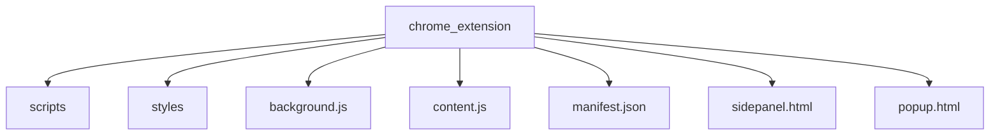
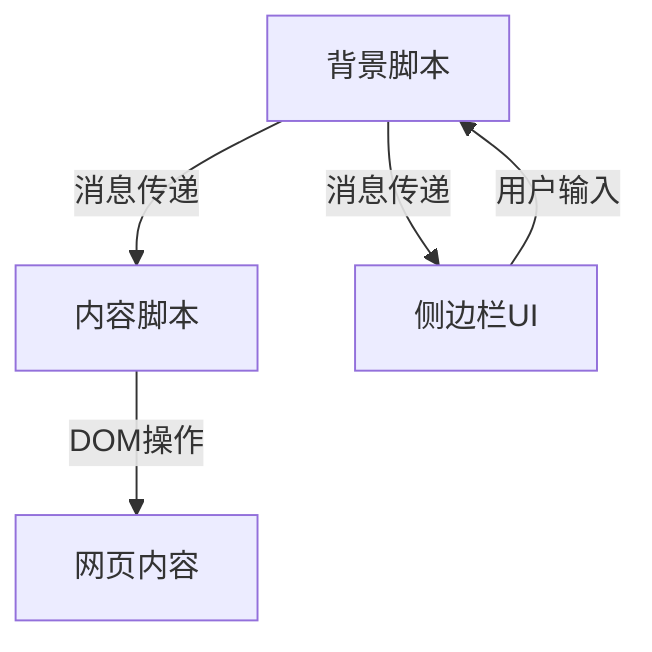
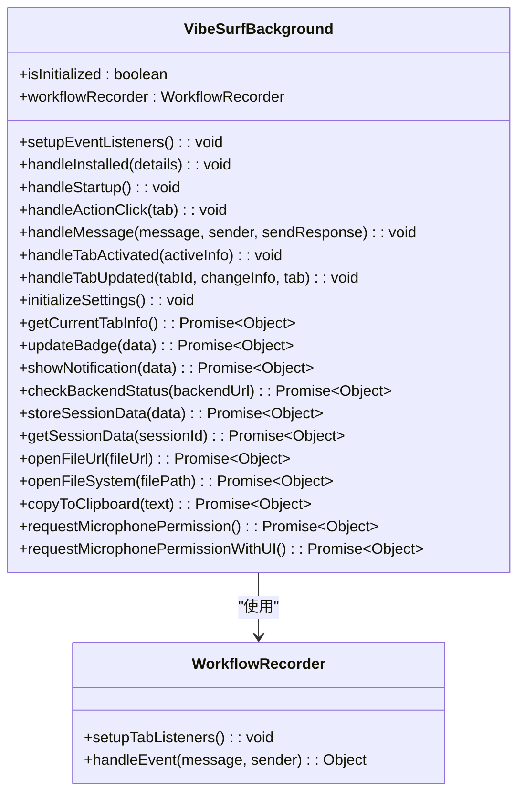
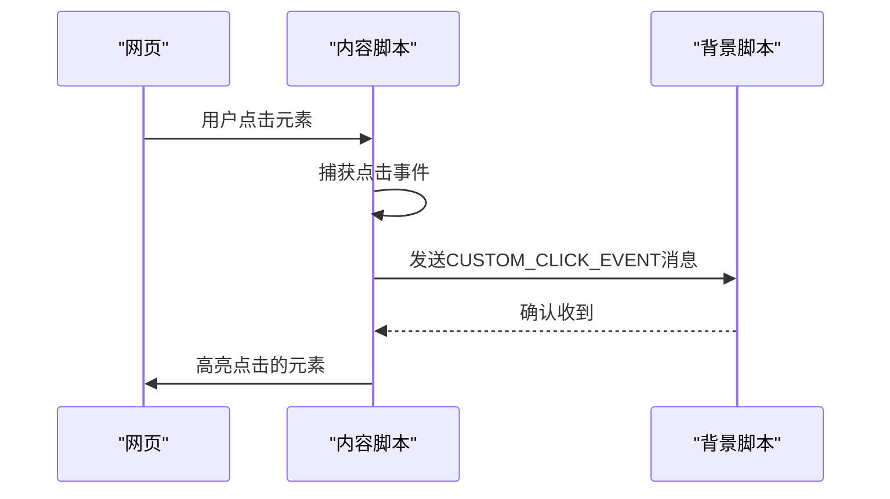
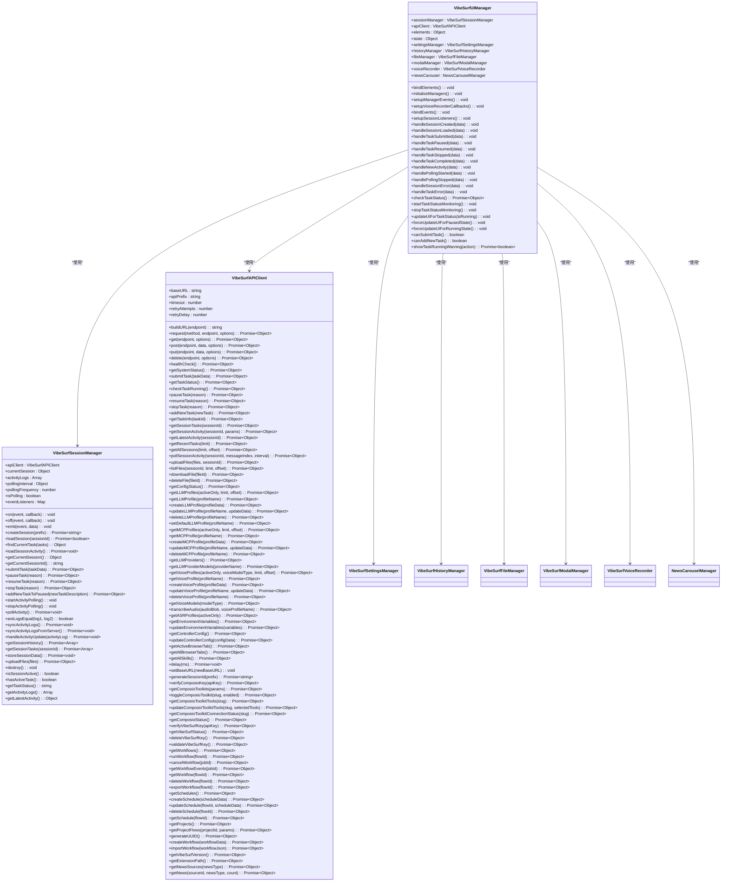
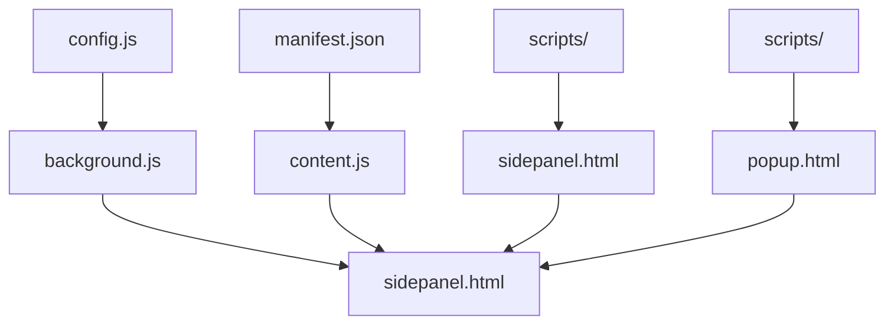

# 浏览器集成

<cite>
**本文档引用的文件**
- [manifest.json](file://vibe_surf/chrome_extension/manifest.json)
- [background.js](file://vibe_surf/chrome_extension/background.js)
- [content.js](file://vibe_surf/chrome_extension/content.js)
- [sidepanel.html](file://vibe_surf/chrome_extension/sidepanel.html)
- [popup.html](file://vibe_surf/chrome_extension/popup.html)
- [main.js](file://vibe_surf/chrome_extension/scripts/main.js)
- [ui-manager.js](file://vibe_surf/chrome_extension/scripts/ui-manager.js)
- [session-manager.js](file://vibe_surf/chrome_extension/scripts/session-manager.js)
- [api-client.js](file://vibe_surf/chrome_extension/scripts/api-client.js)
- [config.js](file://vibe_surf/chrome_extension/config.js)
</cite>

## 目录
1. [介绍](#介绍)
2. [项目结构](#项目结构)
3. [核心组件](#核心组件)
4. [架构概述](#架构概述)
5. [详细组件分析](#详细组件分析)
6. [依赖分析](#依赖分析)
7. [性能考虑](#性能考虑)
8. [故障排除指南](#故障排除指南)
9. [结论](#结论)

## 介绍
VibeSurf Chrome扩展提供了一个强大的浏览器自动化和AI辅助工具，通过集成背景脚本、内容脚本和侧边栏UI，实现了无缝的用户体验。该扩展允许用户通过直观的界面与AI代理交互，执行复杂的浏览任务，如网页导航、DOM操作和数据提取。本文档详细说明了扩展的架构、组件协同工作方式、权限管理机制以及开发和调试指南。

## 项目结构
VibeSurf Chrome扩展的结构围绕`chrome_extension`目录组织，包含核心的UI和逻辑组件。主要结构包括：
- `scripts/`: 包含各种功能的JavaScript模块，如API客户端、文件管理器、历史管理器等。
- `styles/`: 包含CSS样式文件，用于定义扩展的视觉外观。
- `background.js`: 背景脚本，处理扩展的生命周期和跨上下文通信。
- `content.js`: 内容脚本，运行在网页上下文中，与页面内容交互。
- `manifest.json`: 扩展的配置文件，定义权限、脚本和UI元素。
- `sidepanel.html`: 侧边栏的HTML文件，提供主要的用户界面。
- `popup.html`: 弹出窗口的HTML文件，提供快速访问功能。

**Diagram sources**
- [manifest.json](file://vibe_surf/chrome_extension/manifest.json)

**Section sources**
- [manifest.json](file://vibe_surf/chrome_extension/manifest.json)

## 核心组件
VibeSurf Chrome扩展的核心组件包括背景脚本、内容脚本和UI组件。这些组件协同工作，实现浏览器自动化功能。

**Section sources**
- [background.js](file://vibe_surf/chrome_extension/background.js)
- [content.js](file://vibe_surf/chrome_extension/content.js)
- [sidepanel.html](file://vibe_surf/chrome_extension/sidepanel.html)

## 架构概述
VibeSurf Chrome扩展采用模块化架构，通过消息传递机制在不同上下文之间通信。背景脚本作为中心枢纽，管理扩展的生命周期和跨上下文通信。内容脚本注入到网页中，与页面内容交互。侧边栏UI提供用户界面，通过消息传递与背景脚本通信。

**Diagram sources**
- [background.js](file://vibe_surf/chrome_extension/background.js)
- [content.js](file://vibe_surf/chrome_extension/content.js)
- [sidepanel.html](file://vibe_surf/chrome_extension/sidepanel.html)

## 详细组件分析
### 背景脚本分析
背景脚本是VibeSurf扩展的核心，负责管理扩展的生命周期和跨上下文通信。它处理扩展的安装、启动和用户交互事件。

#### 背景脚本类图

**Diagram sources**
- [background.js](file://vibe_surf/chrome_extension/background.js)

### 内容脚本分析
内容脚本运行在网页上下文中，与页面内容交互。它监听用户事件，如点击和输入，并将这些事件传递给背景脚本。

#### 内容脚本序列图

**Diagram sources**
- [content.js](file://vibe_surf/chrome_extension/content.js)

### UI组件分析
UI组件包括侧边栏和弹出窗口，提供用户与扩展交互的界面。侧边栏提供主要功能，如任务输入和会话管理。

#### UI管理器类图

**Diagram sources**
- [ui-manager.js](file://vibe_surf/chrome_extension/scripts/ui-manager.js)
- [session-manager.js](file://vibe_surf/chrome_extension/scripts/session-manager.js)
- [api-client.js](file://vibe_surf/chrome_extension/scripts/api-client.js)

**Section sources**
- [ui-manager.js](file://vibe_surf/chrome_extension/scripts/ui-manager.js)
- [session-manager.js](file://vibe_surf/chrome_extension/scripts/session-manager.js)
- [api-client.js](file://vibe_surf/chrome_extension/scripts/api-client.js)

## 依赖分析
VibeSurf Chrome扩展的组件之间存在紧密的依赖关系。背景脚本依赖于`config.js`中的配置，内容脚本依赖于`manifest.json`中的权限声明，UI组件依赖于`scripts/`目录中的各种功能模块。

**Diagram sources**
- [config.js](file://vibe_surf/chrome_extension/config.js)
- [manifest.json](file://vibe_surf/chrome_extension/manifest.json)
- [scripts/](file://vibe_surf/chrome_extension/scripts/)
- [background.js](file://vibe_surf/chrome_extension/background.js)
- [content.js](file://vibe_surf/chrome_extension/content.js)
- [sidepanel.html](file://vibe_surf/chrome_extension/sidepanel.html)
- [popup.html](file://vibe_surf/chrome_extension/popup.html)

## 性能考虑
VibeSurf Chrome扩展在设计时考虑了性能优化。背景脚本使用服务工作线程，减少了内存占用。内容脚本在`document_end`时注入，确保页面加载完成后再执行。UI组件使用异步加载和缓存机制，提高了响应速度。

## 故障排除指南
### 常见问题
1. **扩展无法加载**: 检查`manifest.json`中的权限声明是否正确。
2. **内容脚本未注入**: 确保`manifest.json`中的`content_scripts`配置正确。
3. **UI组件无法通信**: 检查消息传递机制是否正确实现。

### 调试技巧
1. 使用Chrome开发者工具检查背景脚本和内容脚本的日志。
2. 使用`chrome.runtime.sendMessage`和`chrome.runtime.onMessage`调试消息传递。
3. 检查`manifest.json`中的权限声明是否与实际需求匹配。

**Section sources**
- [background.js](file://vibe_surf/chrome_extension/background.js)
- [content.js](file://vibe_surf/chrome_extension/content.js)
- [manifest.json](file://vibe_surf/chrome_extension/manifest.json)

## 结论
VibeSurf Chrome扩展通过模块化架构和消息传递机制，实现了强大的浏览器自动化功能。背景脚本、内容脚本和UI组件协同工作，提供了无缝的用户体验。通过遵循最佳实践和安全指南，开发者可以自定义和扩展现有功能，满足特定需求。