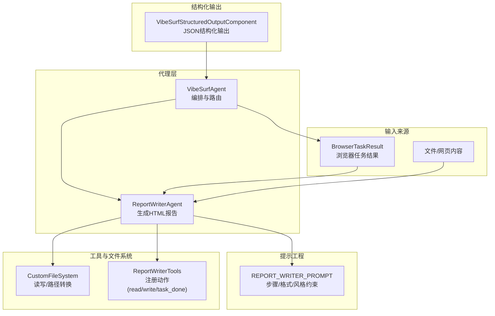
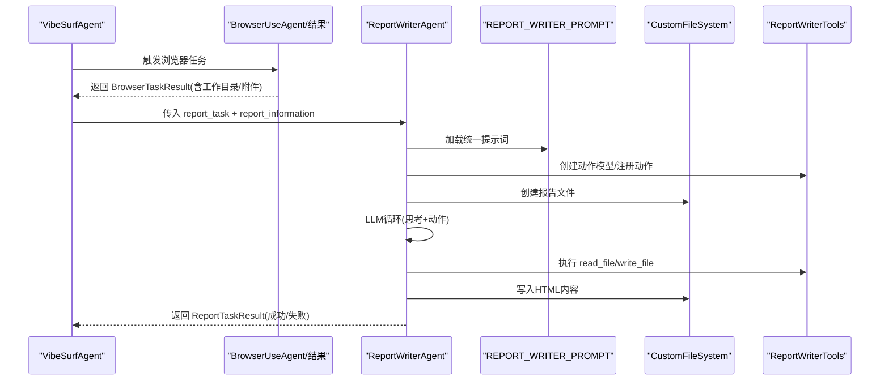
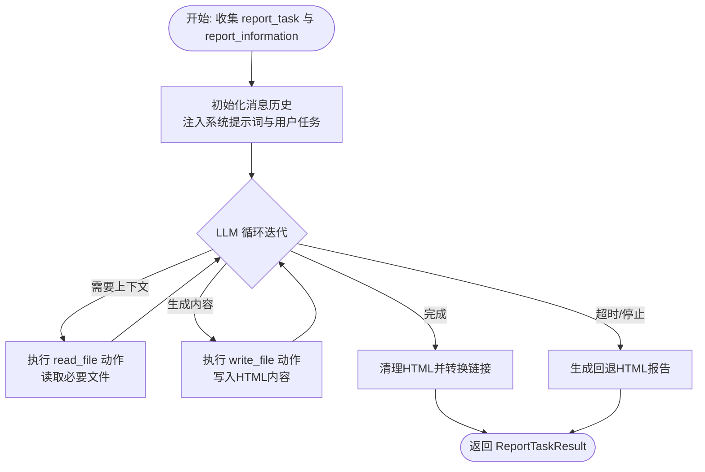
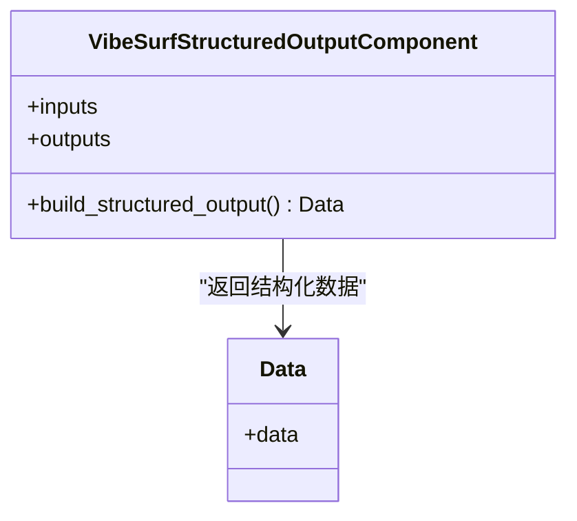
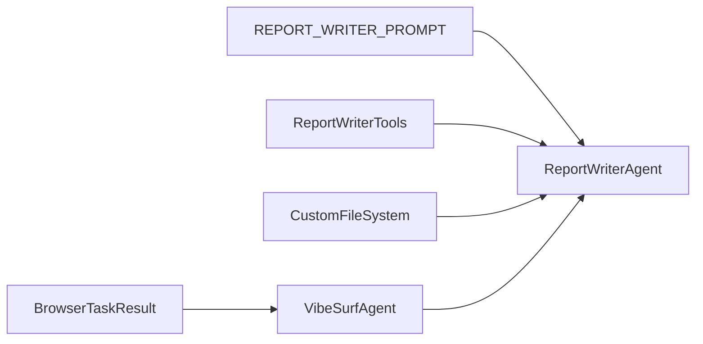

# 内容摘要

<cite>
**本文引用的文件**
- [report_writer_agent.py](file://vibe_surf/agents/report_writer_agent.py)
- [report_writer_prompt.py](file://vibe_surf/agents/prompts/report_writer_prompt.py)
- [structured_output.py](file://vibe_surf/workflows/VibeSurf/structured_output.py)
- [vibesurf_tools.py](file://vibe_surf/tools/vibesurf_tools.py)
- [report_writer_tools.py](file://vibe_surf/tools/report_writer_tools.py)
- [file_system.py](file://vibe_surf/tools/file_system.py)
- [views.py](file://vibe_surf/agents/views.py)
- [vibe_surf_agent.py](file://vibe_surf/agents/vibe_surf_agent.py)
</cite>

## 目录
1. [简介](#简介)
2. [项目结构](#项目结构)
3. [核心组件](#核心组件)
4. [架构总览](#架构总览)
5. [详细组件分析](#详细组件分析)
6. [依赖关系分析](#依赖关系分析)
7. [性能考量](#性能考量)
8. [故障排查指南](#故障排查指南)
9. [结论](#结论)
10. [附录：使用示例与最佳实践](#附录使用示例与最佳实践)

## 简介
本文件系统性地文档化 VibeSurf 的“内容摘要”能力，聚焦于代理如何从多源信息（网页、文件、浏览器任务结果等）中抽取关键要点并生成高质量 HTML 报告。文档覆盖以下方面：
- 代理如何基于统一提示词工程进行信息重要性评估、内容重组与语言优化
- 报告生成器（ReportWriterAgent）的输入处理、摘要策略选择与输出格式化流程
- 提示词工程（report_writer_prompt.py）中的摘要长度控制、风格调整与重点突出机制
- 结构化输出（structured_output.py）如何保障摘要结果的一致性与可解析性
- 实际使用示例：会议纪要生成、文章摘要、报告编写
- 性能优化建议：平衡摘要长度与信息密度、长文档分块策略

## 项目结构
围绕“内容摘要”的关键模块分布如下：
- 代理层：ReportWriterAgent 负责驱动 LLM 执行读取与写入动作，生成 HTML 报告
- 提示工程：report_writer_prompt.py 定义了报告生成的步骤、格式要求与风格约束
- 工具与文件系统：file_system.py 提供安全的文件读写；report_writer_tools.py 注册读取/写入/完成等动作
- 结构化输出：structured_output.py 将 LLM 输出映射为结构化数据模型，保证一致性
- 上层编排：vibe_surf_agent.py 将浏览器任务结果整合为报告输入，并调度 ReportWriterAgent

图表来源
- [report_writer_agent.py](file://vibe_surf/agents/report_writer_agent.py#L1-L120)
- [report_writer_prompt.py](file://vibe_surf/agents/prompts/report_writer_prompt.py#L1-L74)
- [file_system.py](file://vibe_surf/tools/file_system.py#L1-L120)
- [report_writer_tools.py](file://vibe_surf/tools/report_writer_tools.py#L1-L23)
- [structured_output.py](file://vibe_surf/workflows/VibeSurf/structured_output.py#L1-L154)
- [vibe_surf_agent.py](file://vibe_surf/agents/vibe_surf_agent.py#L900-L960)

章节来源
- [report_writer_agent.py](file://vibe_surf/agents/report_writer_agent.py#L1-L120)
- [report_writer_prompt.py](file://vibe_surf/agents/prompts/report_writer_prompt.py#L1-L74)
- [file_system.py](file://vibe_surf/tools/file_system.py#L1-L120)
- [report_writer_tools.py](file://vibe_surf/tools/report_writer_tools.py#L1-L23)
- [structured_output.py](file://vibe_surf/workflows/VibeSurf/structured_output.py#L1-L154)
- [vibe_surf_agent.py](file://vibe_surf/agents/vibe_surf_agent.py#L900-L960)

## 核心组件
- ReportWriterAgent：负责以 LLM 驱动的方式执行“读取文件/生成内容/写入文件/完成任务”的闭环，最终产出专业 HTML 报告
- ReportWriterTools：注册动作模型，包含 read_file、write_file、task_done 等
- CustomFileSystem：封装文件读写、路径规范化、相对路径转绝对 file:// URL 等
- REPORT_WRITER_PROMPT：定义报告生成的步骤、格式要求、风格约束与标题规范
- VibeSurfStructuredOutputComponent：将 LLM 输出映射为结构化 Pydantic 模型，确保可解析性
- VibeSurfAgent：编排浏览器任务结果，将其作为报告输入传递给 ReportWriterAgent

章节来源
- [report_writer_agent.py](file://vibe_surf/agents/report_writer_agent.py#L1-L120)
- [report_writer_tools.py](file://vibe_surf/tools/report_writer_tools.py#L1-L23)
- [file_system.py](file://vibe_surf/tools/file_system.py#L1-L120)
- [report_writer_prompt.py](file://vibe_surf/agents/prompts/report_writer_prompt.py#L1-L74)
- [structured_output.py](file://vibe_surf/workflows/VibeSurf/structured_output.py#L1-L154)
- [vibe_surf_agent.py](file://vibe_surf/agents/vibe_surf_agent.py#L900-L960)

## 架构总览
下图展示了从浏览器任务结果到最终 HTML 报告的端到端流程，以及提示词工程与结构化输出在其中的作用。

图表来源
- [vibe_surf_agent.py](file://vibe_surf/agents/vibe_surf_agent.py#L900-L960)
- [report_writer_agent.py](file://vibe_surf/agents/report_writer_agent.py#L106-L210)
- [report_writer_prompt.py](file://vibe_surf/agents/prompts/report_writer_prompt.py#L1-L74)
- [file_system.py](file://vibe_surf/tools/file_system.py#L268-L303)
- [report_writer_tools.py](file://vibe_surf/tools/report_writer_tools.py#L1-L23)

## 详细组件分析

### ReportWriterAgent：摘要生成与报告输出
- 输入处理
  - 接收 report_task（任务需求/洞察）、report_information（浏览器任务结果等多源信息）
  - 初始化消息历史，注入系统提示词与用户初始任务
- 摘要策略选择
  - 基于统一提示词工程，先分析是否需要读取已有文件以补充上下文
  - 通过动作模型触发 read_file 获取必要文件内容，再进行内容重组与语言优化
- 输出格式化
  - 强制将内容格式化为完整 HTML5 文档（含样式、响应式设计、语义化元素）
  - 自动清理 Markdown 包裹标记，补全缺失的 DOCTYPE/html/head/body 结构
  - 将相对路径自动转换为 file:// 绝对链接，便于本地打开
- 错误与回退
  - 若 LLM 未在限定步数内完成，或异常中断，生成简单回退 HTML 报告
  - 记录 Telemetry 事件，包含模型名称、耗时、成功状态等

图表来源
- [report_writer_agent.py](file://vibe_surf/agents/report_writer_agent.py#L106-L210)
- [report_writer_agent.py](file://vibe_surf/agents/report_writer_agent.py#L210-L316)
- [report_writer_agent.py](file://vibe_surf/agents/report_writer_agent.py#L348-L475)

章节来源
- [report_writer_agent.py](file://vibe_surf/agents/report_writer_agent.py#L106-L210)
- [report_writer_agent.py](file://vibe_surf/agents/report_writer_agent.py#L210-L316)
- [report_writer_agent.py](file://vibe_surf/agents/report_writer_agent.py#L348-L475)

### 提示词工程：摘要长度、风格与重点突出
- 步骤约束
  - 明确“分析任务—判断是否需要文件—生成内容—强制格式化—写入文件—调用完成动作”的顺序
  - 对浏览器任务结果中的 agent_workdir 与重要文件路径进行显式指引，避免路径错误
- 内容与风格
  - 仅聚焦用户明确请求的主题，不包含技术过程说明
  - 使用专业、清晰、引人入胜的风格，按主题分段组织
  - 标题需具体到研究/分析主题，避免通用标题
- 格式要求
  - 必须是完整的 HTML5 文档，嵌入 CSS，响应式与可打印设计
  - 严禁跳过格式化步骤；格式化完成后方可调用完成动作

章节来源
- [report_writer_prompt.py](file://vibe_surf/agents/prompts/report_writer_prompt.py#L1-L74)

### 结构化输出：一致性与可解析性
- 作用
  - 将 LLM 输出直接映射为 Pydantic 模型，确保字段类型、列表/单值、默认值与去重规则一致
  - 适用于从非结构化文本中抽取结构化 JSON，便于后续报告生成与数据消费
- 关键点
  - 通过构建模型与消息队列调用，直接以 output_format 参数约束 LLM 输出
  - 对空 schema 或不支持异步调用的模型进行显式校验与错误抛出

图表来源
- [structured_output.py](file://vibe_surf/workflows/VibeSurf/structured_output.py#L1-L154)

章节来源
- [structured_output.py](file://vibe_surf/workflows/VibeSurf/structured_output.py#L1-L154)

### 文件系统与动作：读取/写入/完成
- CustomFileSystem
  - 统一读写接口，支持 md/txt/json/csv/pdf 等扩展名
  - PDF 最大读取页数限制，避免超长文档导致性能问题
  - 提供路径规范化与 file:// URL 转换，保证报告中资源可访问
- ReportWriterTools
  - 注册动作模型，包含 task_done 动作，用于在报告完成后结束流程

章节来源
- [file_system.py](file://vibe_surf/tools/file_system.py#L89-L119)
- [file_system.py](file://vibe_surf/tools/file_system.py#L268-L303)
- [report_writer_tools.py](file://vibe_surf/tools/report_writer_tools.py#L1-L23)

### 上层编排：从浏览器结果到报告
- VibeSurfAgent 将浏览器任务结果（包含 agent_workdir、重要文件等）打包为 report_information
- 调用 ReportWriterAgent 生成 HTML 报告，并记录 Telemetry 与日志

章节来源
- [vibe_surf_agent.py](file://vibe_surf/agents/vibe_surf_agent.py#L900-L960)

## 依赖关系分析
- ReportWriterAgent 依赖
  - 提示词：REPORT_WRITER_PROMPT
  - 工具：ReportWriterTools（动作模型）
  - 文件系统：CustomFileSystem（读写/路径转换）
  - 输出模型：CustomAgentOutput（与动作模型绑定）
- 浏览器任务结果与文件路径
  - 提示词中明确要求根据 agent_workdir 修正文件路径后再读取
  - 编排侧将 BrowserTaskResult 中的相对路径转换为绝对 file:// URL

图表来源
- [report_writer_agent.py](file://vibe_surf/agents/report_writer_agent.py#L106-L210)
- [report_writer_prompt.py](file://vibe_surf/agents/prompts/report_writer_prompt.py#L1-L74)
- [vibe_surf_agent.py](file://vibe_surf/agents/vibe_surf_agent.py#L900-L960)

章节来源
- [report_writer_agent.py](file://vibe_surf/agents/report_writer_agent.py#L106-L210)
- [report_writer_prompt.py](file://vibe_surf/agents/prompts/report_writer_prompt.py#L1-L74)
- [vibe_surf_agent.py](file://vibe_surf/agents/vibe_surf_agent.py#L900-L960)

## 性能考量
- 摘要长度与信息密度平衡
  - 通过提示词约束“仅聚焦用户明确请求的主题”，减少无关信息，提升密度
  - 对长网页内容，优先使用结构化抽取与表格呈现，避免冗长段落
- 长文档分块策略
  - PDF 默认限制最大读取页数，避免一次性加载过多内容
  - 对超长文本采用智能截断（保留段落/句号边界），并在提示词中强调“仅使用页面提供的信息”
- I/O 与路径处理
  - 统一使用 file:// URL，避免相对路径导致的资源不可达
  - 文件写入前进行 HTML 清理与结构补全，减少二次处理成本

章节来源
- [file_system.py](file://vibe_surf/tools/file_system.py#L105-L116)
- [report_writer_prompt.py](file://vibe_surf/agents/prompts/report_writer_prompt.py#L1-L74)

## 故障排查指南
- 报告未生成或提前结束
  - 检查是否调用了 task_done 动作；提示词要求在格式化完成后才可结束
  - 查看 Telemetry 事件中的成功状态与耗时，定位异常阶段
- 文件路径错误
  - 确认 BrowserTaskResult 中的 agent_workdir 与重要文件路径已正确拼接
  - 使用 file:// URL 进行验证，避免相对路径导致的资源缺失
- LLM 输出不一致
  - 使用结构化输出组件约束输出格式，确保字段类型与列表/单值一致
  - 对空 schema 或不支持异步调用的模型进行显式校验与报错

章节来源
- [report_writer_prompt.py](file://vibe_surf/agents/prompts/report_writer_prompt.py#L1-L74)
- [structured_output.py](file://vibe_surf/workflows/VibeSurf/structured_output.py#L127-L154)
- [report_writer_agent.py](file://vibe_surf/agents/report_writer_agent.py#L268-L316)

## 结论
VibeSurf 的内容摘要能力通过“统一提示词工程 + LLM 驱动的动作模型 + 结构化输出 + 文件系统路径转换”形成闭环：先评估信息重要性、再重组语言风格、最后以专业 HTML 形式交付。该体系既保证了摘要质量与一致性，又具备良好的可扩展性与可维护性。

## 附录：使用示例与最佳实践
- 会议纪要生成
  - 输入：浏览器任务结果（会议页面截图/议程/讨论记录）+ 会议目标
  - 处理：提示词引导按议题分段、列出决策与行动项、生成可打印 HTML
- 文章摘要
  - 输入：网页内容 + 摘要目标（如“提炼核心观点与数据”）
  - 处理：提示词强调“仅使用页面提供的信息”，PDF 限制页数，表格呈现关键数据
- 报告编写
  - 输入：多源浏览器结果 + 数据文件路径
  - 处理：先 read_file 补充上下文，再 write_file 生成完整 HTML，最后 task_done 结束

最佳实践
- 在提示词中明确“摘要长度上限/风格偏好/重点突出方式”
- 对长文档采用分块策略（PDF 页数限制、文本截断边界）
- 使用结构化输出组件确保后续处理的数据一致性
- 严格遵循“格式化步骤必须完成”的约束，避免跳过写入与链接转换

章节来源
- [report_writer_prompt.py](file://vibe_surf/agents/prompts/report_writer_prompt.py#L1-L74)
- [file_system.py](file://vibe_surf/tools/file_system.py#L436-L438)
- [structured_output.py](file://vibe_surf/workflows/VibeSurf/structured_output.py#L127-L154)
- [vibe_surf_agent.py](file://vibe_surf/agents/vibe_surf_agent.py#L900-L960)