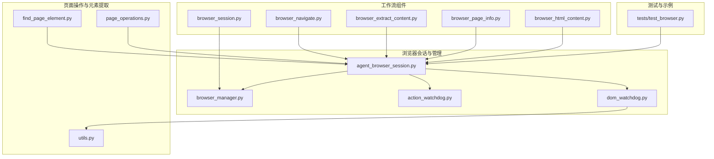
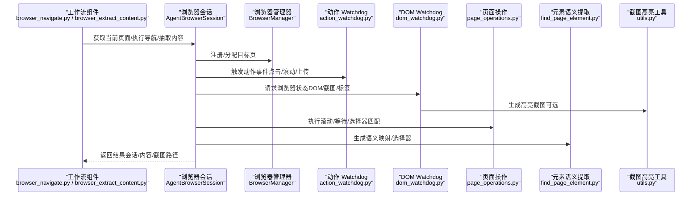
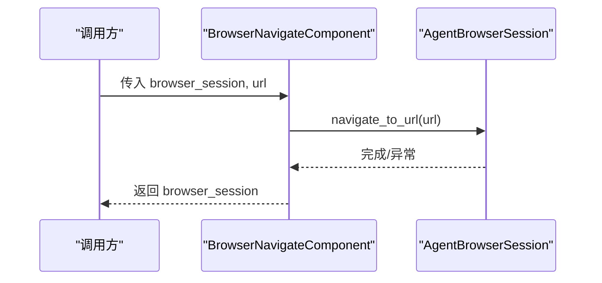
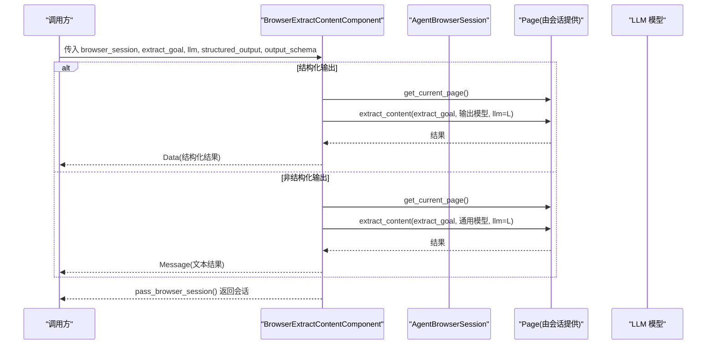
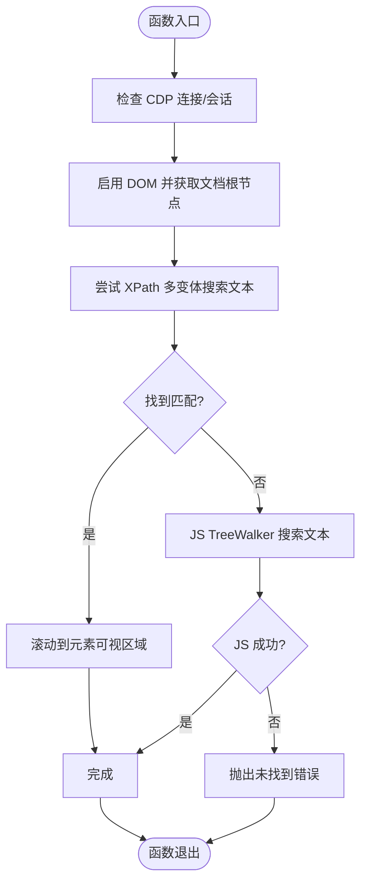
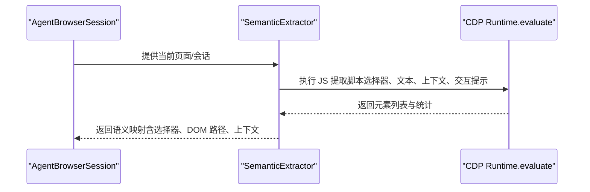
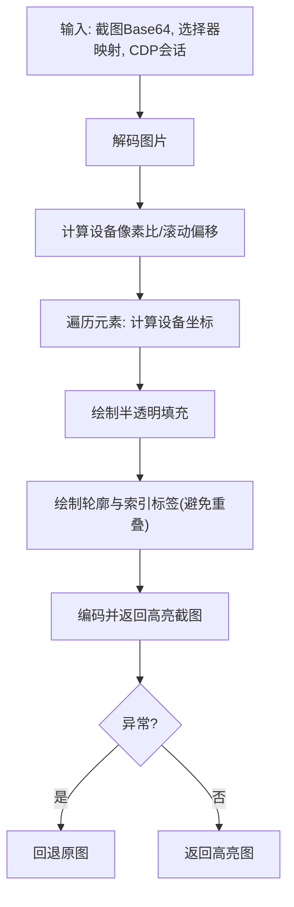
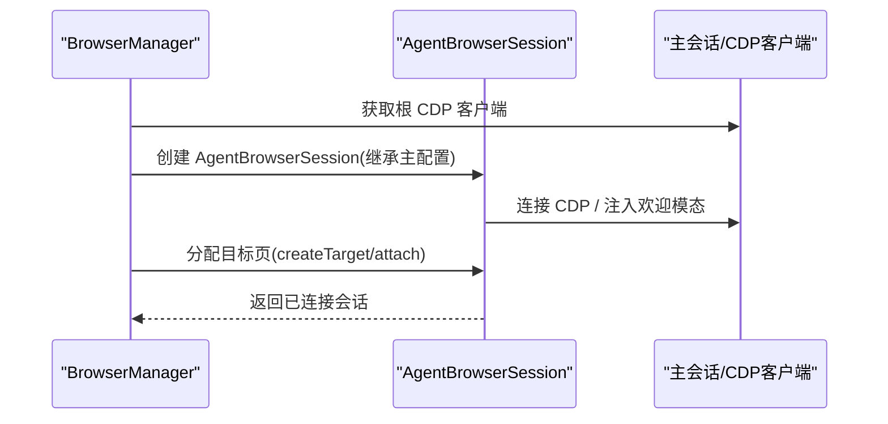
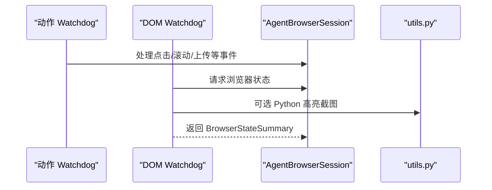
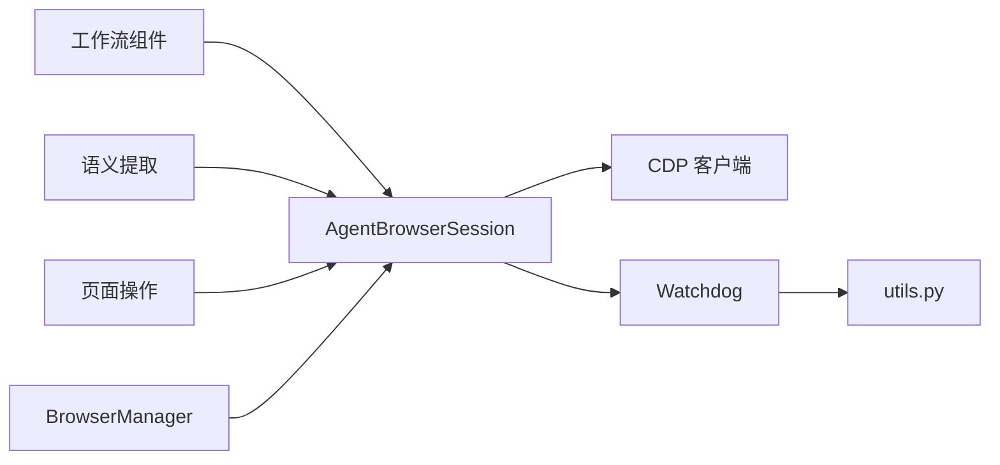

# 智能爬取

<cite>
**本文引用的文件**
- [browser_navigate.py](file://vibe_surf/workflows/Browser/browser_navigate.py)
- [browser_extract_content.py](file://vibe_surf/workflows/Browser/browser_extract_content.py)
- [page_operations.py](file://vibe_surf/browser/page_operations.py)
- [find_page_element.py](file://vibe_surf/browser/find_page_element.py)
- [utils.py](file://vibe_surf/browser/utils.py)
- [agent_browser_session.py](file://vibe_surf/browser/agent_browser_session.py)
- [browser_manager.py](file://vibe_surf/browser/browser_manager.py)
- [action_watchdog.py](file://vibe_surf/browser/watchdogs/action_watchdog.py)
- [dom_watchdog.py](file://vibe_surf/browser/watchdogs/dom_watchdog.py)
- [browser_session.py](file://vibe_surf/workflows/Browser/browser_session.py)
- [browser_page_info.py](file://vibe_surf/workflows/Browser/browser_page_info.py)
- [browser_html_content.py](file://vibe_surf/workflows/Browser/browser_html_content.py)
- [test_browser.py](file://tests/test_browser.py)
- [vibe_surf_prompt.py](file://vibe_surf/agents/prompts/vibe_surf_prompt.py)
- [_generate_news_extraction_js.py](file://vibe_surf/tools/utils.py)
</cite>

## 目录
1. [简介](#简介)
2. [项目结构](#项目结构)
3. [核心组件](#核心组件)
4. [架构总览](#架构总览)
5. [详细组件分析](#详细组件分析)
6. [依赖关系分析](#依赖关系分析)
7. [性能考虑](#性能考虑)
8. [故障排查指南](#故障排查指南)
9. [结论](#结论)
10. [附录](#附录)

## 简介
本文件系统性文档化 VibeSurf 的“智能爬取”能力，聚焦浏览器自动化与内容抽取的端到端流程。重点覆盖：
- 代理如何智能导航网站、识别关键内容并提取结构化数据
- 动态内容处理、反爬虫策略应对与数据清洗
- 浏览器工作流组件：browser_navigate.py 与 browser_extract_content.py 的核心逻辑
- 底层浏览器操作支持：page_operations.py 中的 DOM 查询、元素交互与页面状态检测
- 实际应用场景：电商价格监控、新闻聚合、社交媒体数据分析
- 性能优化：爬取频率、并发控制与错误恢复

## 项目结构
围绕“智能爬取”的关键目录与文件如下：
- 工作流（Langflow 组件）：Browser 目录下的导航、内容抽取、页面信息、HTML 内容等组件
- 浏览器会话与管理：AgentBrowserSession、BrowserManager、Watchdog（动作与 DOM）
- 页面操作与元素语义提取：page_operations.py、find_page_element.py
- 可视化高亮与截图：utils.py 中的高亮截图与设备像素比计算
- 测试与示例：tests/test_browser.py 展示多代理隔离、并发状态抓取、高亮截图等

图表来源
- [browser_navigate.py](file://vibe_surf/workflows/Browser/browser_navigate.py#L1-L51)
- [browser_extract_content.py](file://vibe_surf/workflows/Browser/browser_extract_content.py#L1-L198)
- [browser_session.py](file://vibe_surf/workflows/Browser/browser_session.py#L1-L55)
- [browser_page_info.py](file://vibe_surf/workflows/Browser/browser_page_info.py#L1-L68)
- [browser_html_content.py](file://vibe_surf/workflows/Browser/browser_html_content.py#L1-L74)
- [agent_browser_session.py](file://vibe_surf/browser/agent_browser_session.py#L1-L200)
- [browser_manager.py](file://vibe_surf/browser/browser_manager.py#L1-L120)
- [action_watchdog.py](file://vibe_surf/browser/watchdogs/action_watchdog.py#L1-L109)
- [dom_watchdog.py](file://vibe_surf/browser/watchdogs/dom_watchdog.py#L1-L250)
- [page_operations.py](file://vibe_surf/browser/page_operations.py#L1-L223)
- [find_page_element.py](file://vibe_surf/browser/find_page_element.py#L1-L200)
- [utils.py](file://vibe_surf/browser/utils.py#L666-L786)
- [test_browser.py](file://tests/test_browser.py#L1-L200)

章节来源
- [browser_navigate.py](file://vibe_surf/workflows/Browser/browser_navigate.py#L1-L51)
- [browser_extract_content.py](file://vibe_surf/workflows/Browser/browser_extract_content.py#L1-L198)
- [page_operations.py](file://vibe_surf/browser/page_operations.py#L1-L223)
- [find_page_element.py](file://vibe_surf/browser/find_page_element.py#L1-L200)
- [utils.py](file://vibe_surf/browser/utils.py#L666-L786)
- [agent_browser_session.py](file://vibe_surf/browser/agent_browser_session.py#L1-L200)
- [browser_manager.py](file://vibe_surf/browser/browser_manager.py#L1-L120)
- [action_watchdog.py](file://vibe_surf/browser/watchdogs/action_watchdog.py#L1-L109)
- [dom_watchdog.py](file://vibe_surf/browser/watchdogs/dom_watchdog.py#L1-L250)
- [browser_session.py](file://vibe_surf/workflows/Browser/browser_session.py#L1-L55)
- [browser_page_info.py](file://vibe_surf/workflows/Browser/browser_page_info.py#L1-L68)
- [browser_html_content.py](file://vibe_surf/workflows/Browser/browser_html_content.py#L1-L74)
- [test_browser.py](file://tests/test_browser.py#L1-L200)

## 核心组件
- 导航组件：负责将浏览器会话跳转到指定 URL，并在必要时等待页面稳定
- 内容抽取组件：基于 LLM 与输出模式，从当前页面抽取结构化或非结构化内容
- 页面操作工具：提供滚动定位文本、直接选择器尝试、等待元素可见等底层能力
- 元素语义提取：通过 JS 与 DOM 服务，生成可交互元素的语义映射与选择器
- 截图高亮工具：根据 DOM 选择器映射，对截图进行高亮标注
- 会话与管理：AgentBrowserSession 提供连接、事件派发、目标页管理；BrowserManager 负责多代理隔离与目标分配
- Watchdog：动作 Watchdog 处理点击、滚动、上传等动作；DOM Watchdog 负责 DOM 构建、截图与状态汇总

章节来源
- [browser_navigate.py](file://vibe_surf/workflows/Browser/browser_navigate.py#L1-L51)
- [browser_extract_content.py](file://vibe_surf/workflows/Browser/browser_extract_content.py#L1-L198)
- [page_operations.py](file://vibe_surf/browser/page_operations.py#L1-L223)
- [find_page_element.py](file://vibe_surf/browser/find_page_element.py#L1-L200)
- [utils.py](file://vibe_surf/browser/utils.py#L666-L786)
- [agent_browser_session.py](file://vibe_surf/browser/agent_browser_session.py#L1-L200)
- [browser_manager.py](file://vibe_surf/browser/browser_manager.py#L1-L120)
- [action_watchdog.py](file://vibe_surf/browser/watchdogs/action_watchdog.py#L1-L109)
- [dom_watchdog.py](file://vibe_surf/browser/watchdogs/dom_watchdog.py#L1-L250)

## 架构总览
下图展示从“工作流组件”到“浏览器会话与管理”，再到“页面操作与元素提取”的整体调用链路。

图表来源
- [browser_navigate.py](file://vibe_surf/workflows/Browser/browser_navigate.py#L1-L51)
- [browser_extract_content.py](file://vibe_surf/workflows/Browser/browser_extract_content.py#L1-L198)
- [agent_browser_session.py](file://vibe_surf/browser/agent_browser_session.py#L1-L200)
- [browser_manager.py](file://vibe_surf/browser/browser_manager.py#L1-L120)
- [action_watchdog.py](file://vibe_surf/browser/watchdogs/action_watchdog.py#L1-L109)
- [dom_watchdog.py](file://vibe_surf/browser/watchdogs/dom_watchdog.py#L1-L250)
- [page_operations.py](file://vibe_surf/browser/page_operations.py#L1-L223)
- [find_page_element.py](file://vibe_surf/browser/find_page_element.py#L1-L200)
- [utils.py](file://vibe_surf/browser/utils.py#L666-L786)

## 详细组件分析

### 导航组件：browser_navigate.py
- 输入：浏览器会话、目标 URL
- 行为：调用会话的导航方法跳转到 URL，并短暂等待页面稳定
- 输出：返回更新后的浏览器会话
- 关键点：异常捕获与重新抛出，确保上层能感知失败；最终总是返回会话实例

图表来源
- [browser_navigate.py](file://vibe_surf/workflows/Browser/browser_navigate.py#L1-L51)
- [agent_browser_session.py](file://vibe_surf/browser/agent_browser_session.py#L1-L200)

章节来源
- [browser_navigate.py](file://vibe_surf/workflows/Browser/browser_navigate.py#L1-L51)

### 内容抽取组件：browser_extract_content.py
- 输入：浏览器会话、抽取目标、LLM 模型、是否结构化输出、输出模式表
- 行为：
  - 非结构化模式：构建通用模型，调用页面的 extract_content，返回消息文本
  - 结构化模式：根据输出模式表构建 Pydantic 模型，调用页面的 extract_content，返回 Data 对象
  - 支持动态切换输出类型（前端节点实时刷新）
- 输出：浏览器会话与抽取结果（消息或结构化数据）

图表来源
- [browser_extract_content.py](file://vibe_surf/workflows/Browser/browser_extract_content.py#L1-L198)

章节来源
- [browser_extract_content.py](file://vibe_surf/workflows/Browser/browser_extract_content.py#L1-L198)

### 页面操作与元素交互：page_operations.py
- 文本滚动定位：优先使用 CDP DOM 搜索，失败回退到 JS TreeWalker 滚动到可视位置
- 直接选择器尝试：对输入文本进行清洗与多种常见属性组合尝试，自动判断可见性与唯一性
- 等待元素：轮询 CSS 选择器，支持层级回退与严格模式提示
- 异常处理：记录调试日志，未找到时抛出带详情的运行时错误

图表来源
- [page_operations.py](file://vibe_surf/browser/page_operations.py#L1-L120)

章节来源
- [page_operations.py](file://vibe_surf/browser/page_operations.py#L1-L223)

### 元素语义提取：find_page_element.py
- 作用：从 DOM 中提取可交互元素，生成语义映射（含标签、类型、角色、容器上下文、兄弟上下文、DOM 路径、交互提示等），并生成 CSS/Hierarchical Selector
- 特性：
  - 基于 ARIA 角色与标签推断元素类型（按钮、输入、下拉、单选/复选、链接等）
  - 文本归一化与重复处理（添加上下文、坐标、属性等）
  - JS 侧增强提取（包含日历、下拉、预订等特定 UI 的上下文）
  - 可选保存调试日志到文件

图表来源
- [find_page_element.py](file://vibe_surf/browser/find_page_element.py#L1-L200)
- [find_page_element.py](file://vibe_surf/browser/find_page_element.py#L200-L800)

章节来源
- [find_page_element.py](file://vibe_surf/browser/find_page_element.py#L1-L200)
- [find_page_element.py](file://vibe_surf/browser/find_page_element.py#L200-L800)

### 截图高亮与设备像素比：utils.py
- 高亮截图：将 DOM 选择器映射转换为设备像素坐标，绘制半透明填充与轮廓，并在合适位置放置不重叠的索引标签
- 设备像素比：从 CDP Page.getLayoutMetrics 获取视觉视口与 CSS 视口尺寸，计算 devicePixelRatio 与滚动偏移
- 异常处理：解码/编码失败、合成失败时回退原图

图表来源
- [utils.py](file://vibe_surf/browser/utils.py#L666-L786)

章节来源
- [utils.py](file://vibe_surf/browser/utils.py#L666-L786)

### 会话与管理：agent_browser_session.py 与 browser_manager.py
- AgentBrowserSession：封装 CDP 连接、目标页管理、事件派发、欢迎模态注入、代理安全上下文清理
- BrowserManager：注册/分配目标页、多代理隔离、关闭清理、活跃目标检测、标签页获取

图表来源
- [agent_browser_session.py](file://vibe_surf/browser/agent_browser_session.py#L1-L200)
- [browser_manager.py](file://vibe_surf/browser/browser_manager.py#L1-L120)

章节来源
- [agent_browser_session.py](file://vibe_surf/browser/agent_browser_session.py#L1-L200)
- [browser_manager.py](file://vibe_surf/browser/browser_manager.py#L1-L120)

### Watchdog：动作与 DOM
- 动作 Watchdog：校验会话有效性、打印按钮特殊处理、新标签页检测与切换、验证错误返回
- DOM Watchdog：并发构建 DOM 与截图、Python 侧高亮、页面信息获取、PDF 查看器识别、缓存与最小恢复状态

图表来源
- [action_watchdog.py](file://vibe_surf/browser/watchdogs/action_watchdog.py#L1-L109)
- [dom_watchdog.py](file://vibe_surf/browser/watchdogs/dom_watchdog.py#L1-L250)
- [utils.py](file://vibe_surf/browser/utils.py#L666-L786)

章节来源
- [action_watchdog.py](file://vibe_surf/browser/watchdogs/action_watchdog.py#L1-L109)
- [dom_watchdog.py](file://vibe_surf/browser/watchdogs/dom_watchdog.py#L1-L250)

### 页面信息与 HTML 内容：browser_page_info.py 与 browser_html_content.py
- 页面信息：获取 URL、标题、视口尺寸（通过 CDP Page.getLayoutMetrics）
- HTML 内容：保存当前页面 HTML 到工作区目录，返回文件路径消息

章节来源
- [browser_page_info.py](file://vibe_surf/workflows/Browser/browser_page_info.py#L1-L68)
- [browser_html_content.py](file://vibe_surf/workflows/Browser/browser_html_content.py#L1-L74)

## 依赖关系分析
- 组件耦合
  - 工作流组件依赖 AgentBrowserSession 提供的 get_current_page、navigate_to_url、take_screenshot 等能力
  - DOM Watchdog 依赖 utils.py 的高亮截图工具，形成“状态采集—高亮—缓存”的闭环
  - 语义提取依赖浏览器 JS 与 DOM 服务，输出选择器与上下文，为页面操作提供基础
- 外部依赖
  - CDP 客户端用于直接与浏览器通信（Target、DOM、Runtime、Page）
  - LLM 作为结构化抽取的推理后端
  - 测试依赖 asyncio、aiohttp、Pillow 等库

图表来源
- [agent_browser_session.py](file://vibe_surf/browser/agent_browser_session.py#L1-L200)
- [browser_manager.py](file://vibe_surf/browser/browser_manager.py#L1-L120)
- [dom_watchdog.py](file://vibe_surf/browser/watchdogs/dom_watchdog.py#L1-L250)
- [utils.py](file://vibe_surf/browser/utils.py#L666-L786)
- [find_page_element.py](file://vibe_surf/browser/find_page_element.py#L1-L200)
- [page_operations.py](file://vibe_surf/browser/page_operations.py#L1-L223)

章节来源
- [agent_browser_session.py](file://vibe_surf/browser/agent_browser_session.py#L1-L200)
- [browser_manager.py](file://vibe_surf/browser/browser_manager.py#L1-L120)
- [dom_watchdog.py](file://vibe_surf/browser/watchdogs/dom_watchdog.py#L1-L250)
- [utils.py](file://vibe_surf/browser/utils.py#L666-L786)
- [find_page_element.py](file://vibe_surf/browser/find_page_element.py#L1-L200)
- [page_operations.py](file://vibe_surf/browser/page_operations.py#L1-L223)

## 性能考虑
- 并发与稳定性
  - 多代理并发导航与状态抓取：测试用例展示了三路并发导航与截图、状态获取，建议在生产中按需拆分任务，避免过度竞争
  - DOM 构建与截图并行：DOM Watchdog 在请求浏览器状态时并行构建 DOM 与截图，减少总耗时
- 等待与超时
  - 页面稳定等待：DOM Watchdog 在非无意义页面上等待网络空闲，避免过早抓取
  - 元素等待：page_operations 的等待函数支持超时轮询与层级回退，降低误判概率
- 高亮与截图
  - Python 侧高亮仅在配置开启时进行，且仅在 DOM 与截图均可用时应用，避免不必要的 CPU 开销
  - 设备像素比计算避免坐标错位导致的重绘
- 错误恢复
  - 动作 Watchdog 对新标签页打开进行检测与切换，保证后续操作在正确目标页执行
  - DOM Watchdog 在 DOM 或截图失败时返回最小恢复状态，保障上层继续运行

章节来源
- [test_browser.py](file://tests/test_browser.py#L1-L200)
- [dom_watchdog.py](file://vibe_surf/browser/watchdogs/dom_watchdog.py#L1-L250)
- [page_operations.py](file://vibe_surf/browser/page_operations.py#L1-L223)
- [action_watchdog.py](file://vibe_surf/browser/watchdogs/action_watchdog.py#L1-L109)

## 故障排查指南
- 导航失败
  - 检查 CDP 连接是否建立；确认会话是否已创建目标页
  - 若页面 URL 为非 http/https，DOM Watchdog 会跳过 DOM 构建，需确认目标是否有效
- 元素不可见或选择器不匹配
  - 使用 page_operations 的直接选择器尝试与等待函数，结合语义提取的 Hierarchical Selector
  - 对于多元素匹配，优先缩小选择器范围或使用可见性等待
- 截图高亮异常
  - 确认设备像素比与滚动偏移计算成功；若合成失败，系统会回退原图
- 新标签页未切换
  - 动作 Watchdog 会在点击后检测新标签页并自动切换；若未切换，检查事件派发与会话焦点

章节来源
- [agent_browser_session.py](file://vibe_surf/browser/agent_browser_session.py#L1-L200)
- [action_watchdog.py](file://vibe_surf/browser/watchdogs/action_watchdog.py#L1-L109)
- [dom_watchdog.py](file://vibe_surf/browser/watchdogs/dom_watchdog.py#L1-L250)
- [utils.py](file://vibe_surf/browser/utils.py#L666-L786)
- [page_operations.py](file://vibe_surf/browser/page_operations.py#L1-L223)

## 结论
VibeSurf 的“智能爬取”以 AgentBrowserSession 为核心，结合工作流组件、Watchdog、语义提取与高亮截图，形成了从导航、状态采集到内容抽取的完整链路。通过并发与等待策略、严格的错误恢复与可视化反馈，系统在复杂动态网页场景下具备良好的鲁棒性与可扩展性。针对不同业务场景，可进一步完善输出模式、反爬虫策略与缓存机制。

## 附录

### 实际应用场景与实践建议
- 电商价格监控
  - 导航到商品页，使用语义提取定位价格、库存、评价等关键元素，结合 DOM Watchdog 的稳定等待与高亮截图辅助定位
  - 可配合 LLM 进行结构化抽取，输出统一字段（价格、评分、评论数等）
- 新闻聚合
  - 使用工具层的新闻提取 JS（参考 _generate_news_extraction_js）在搜索结果页批量抽取标题、摘要、链接与发布时间
  - 结合浏览器状态抓取与截图高亮，确保抽取准确性
- 社交媒体数据分析
  - 通过 BrowserManager 为不同账号创建独立会话，避免 Cookie/登录状态冲突
  - 使用语义提取与 DOM Watchdog 的页面信息（URL/标题/视口）辅助定位内容容器
  - 注意平台反爬虫策略，合理设置等待与并发度

章节来源
- [_generate_news_extraction_js.py](file://vibe_surf/tools/utils.py#L1077-L1470)
- [browser_manager.py](file://vibe_surf/browser/browser_manager.py#L1-L120)
- [dom_watchdog.py](file://vibe_surf/browser/watchdogs/dom_watchdog.py#L1-L250)
- [find_page_element.py](file://vibe_surf/browser/find_page_element.py#L1-L200)
- [vibe_surf_prompt.py](file://vibe_surf/agents/prompts/vibe_surf_prompt.py#L123-L137)