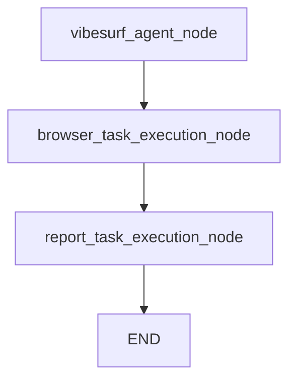
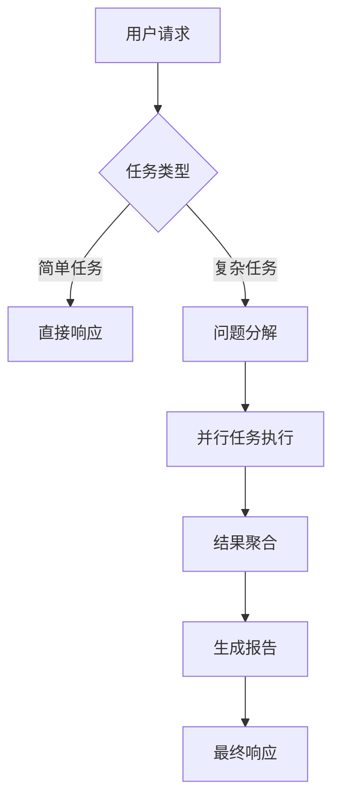
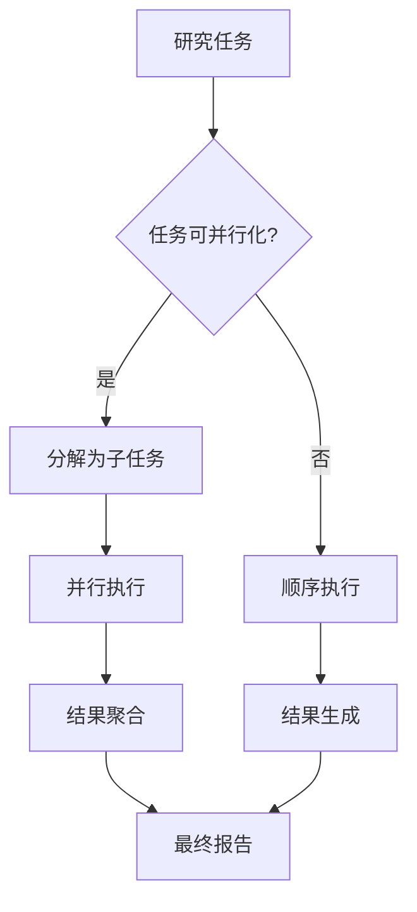

# 深度研究

<cite>
**本文档引用的文件**   
- [vibe_surf_agent.py](file://vibe_surf/agents/vibe_surf_agent.py)
- [vibe_surf_prompt.py](file://vibe_surf/agents/prompts/vibe_surf_prompt.py)
- [vibesurf_tools.py](file://vibe_surf/tools/vibesurf_tools.py)
- [browser_use_agent.py](file://vibe_surf/agents/browser_use_agent.py)
- [report_writer_agent.py](file://vibe_surf/agents/report_writer_agent.py)
</cite>

## 目录
1. [引言](#引言)
2. [深度研究功能概述](#深度研究功能概述)
3. [研究流程控制逻辑](#研究流程控制逻辑)
4. [提示词工程实现](#提示词工程实现)
5. [实际应用案例](#实际应用案例)
6. [性能优化策略](#性能优化策略)
7. [结论](#结论)

## 引言
VibeSurf的深度研究功能是一个先进的AI驱动系统，旨在通过多步骤推理和信息聚合完成复杂的研究任务。该功能利用代理（agent）架构，通过问题分解、信息源选择、跨文档关联和结论生成等步骤，实现对复杂主题的全面探索。本文档将详细阐述VibeSurf的深度研究功能，包括其研究流程控制逻辑、提示词工程实现、实际应用案例以及性能优化策略。

## 深度研究功能概述
VibeSurf的深度研究功能通过一个复杂的代理系统实现，该系统能够执行多步骤推理和信息聚合。核心功能包括问题分解、信息源选择、跨文档关联和结论生成。当用户请求进行深度研究时，系统会遵循以下步骤：
1. **设置详细的TODO列表**：为研究项目创建一个详细的待办事项列表。
2. **进行系统性研究**：按照预定的步骤进行系统性的研究。
3. **生成综合报告**：创建一个全面的报告，总结研究发现。
4. **保持研究可追溯性**：确保研究过程的每一步都可追溯，以保证学术严谨性和来源引用。

该功能通过`skill_deep_research`动作实现，该动作接受一个研究主题作为参数，并触发一系列复杂的操作来完成研究任务。

## 研究流程控制逻辑
VibeSurf的研究流程控制逻辑基于`vibe_surf_agent.py`中的`VibeSurfAgent`类实现。该代理使用一个状态图（`VibeSurfState`）来管理研究过程的各个阶段。研究流程主要包括以下几个关键节点：

### 主要研究节点

**Diagram sources**
- [vibe_surf_agent.py](file://vibe_surf/agents/vibe_surf_agent.py#L346-L352)

### 问题分解与任务协调
`vibesurf_agent_node`是主要的研究节点，负责协调整个研究过程。它通过以下方式实现多步骤推理：
- **问题分解**：将复杂的研究任务分解为多个子任务。
- **工具调用**：协调多个工具调用，如浏览器自动化、文件操作和报告生成。
- **状态管理**：管理研究状态，包括当前步骤、任务进度和结果。

当代理需要执行浏览器任务时，它会路由到`browser_task_execution_node`，该节点负责执行分配给浏览器代理的任务。同样，当需要生成报告时，流程会路由到`report_task_execution_node`。

### 并行任务处理
VibeSurf支持并行任务处理，以提高研究效率。`execute_parallel_browser_tasks`函数实现了这一功能，允许同时执行多个独立的浏览器任务。这通过以下方式实现：
- **任务分配**：将多个任务分配给不同的浏览器代理。
- **资源管理**：优化浏览器会话分配，确保资源高效利用。
- **结果聚合**：收集并聚合来自多个并行任务的结果。

**Section sources**
- [vibe_surf_agent.py](file://vibe_surf/agents/vibe_surf_agent.py#L548-L604)

## 提示词工程实现
VibeSurf的提示词工程在`agents/prompts/vibe_surf_prompt.py`中实现，通过精心设计的系统提示来指导代理的行为。核心提示词包括`VIBESURF_SYSTEM_PROMPT`和`EXTEND_BU_SYSTEM_PROMPT`。

### 研究策略编码
`VIBESURF_SYSTEM_PROMPT`定义了代理的核心架构和能力，包括：
- **智能任务管理**：生成、跟踪和管理复杂的任务层次结构。
- **Python代码执行**：执行数据处理、可视化和文件操作。
- **文件系统管理**：在专用工作区目录中进行文件操作。

提示词中明确编码了研究策略，例如：
- **深度研究模式**：当用户要求进行深度研究时，代理会设置详细的TODO列表，进行系统性研究，并生成综合报告。
- **并行优化**：鼓励将独立任务分解为并行执行，以提高效率。

### 结果格式化要求
提示词还规定了结果的格式化要求：
- **摘要格式**：如果响应是摘要，应使用Markdown格式。
- **文件引用**：显示文件时，应使用`[file_name](file_path)`格式。
- **复杂任务**：提供包含全面信息的详细摘要。

**Diagram sources**
- [vibe_surf_prompt.py](file://vibe_surf/agents/prompts/vibe_surf_prompt.py#L2-L195)

**Section sources**
- [vibe_surf_prompt.py](file://vibe_surf/agents/prompts/vibe_surf_prompt.py#L2-L219)

## 实际应用案例
VibeSurf的深度研究功能在多种实际场景中表现出色，包括学术文献综述、技术趋势分析和商业情报收集。

### 学术文献综述
在学术文献综述中，VibeSurf可以：
1. **搜索相关文献**：使用`skill_search`动作在Google Scholar等学术数据库中搜索相关文献。
2. **提取关键信息**：使用`skill_crawl`动作从文献中提取关键信息，如摘要、方法和结论。
3. **生成综述报告**：使用`report_writer_agent`生成综合的文献综述报告。

### 技术趋势分析
在技术趋势分析中，VibeSurf可以：
1. **收集技术新闻**：使用`skill_search`动作收集最新的技术新闻和趋势。
2. **分析数据**：使用Python代码执行功能分析技术数据，如GitHub趋势或Stack Overflow统计数据。
3. **生成趋势报告**：生成包含图表和分析的HTML报告。

### 商业情报收集
在商业情报收集中，VibeSurf可以：
1. **监控竞争对手**：使用`skill_crawl`动作监控竞争对手的网站和社交媒体。
2. **分析财务数据**：使用`skill_finance`动作获取和分析竞争对手的财务数据。
3. **生成商业报告**：生成包含市场分析和竞争策略的综合报告。

## 性能优化策略
VibeSurf采用多种性能优化策略，以确保研究任务的高效执行。

### 研究深度设置
系统允许设置研究深度，通过`max_steps`参数控制代理的最大执行步数。这有助于防止无限循环和资源浪费。

### 信息可信度评估
VibeSurf通过以下方式评估信息的可信度：
- **来源验证**：优先使用可信的信息源，如学术数据库和官方新闻网站。
- **交叉验证**：通过多个独立来源验证关键信息。

### 结果去重机制
为了防止重复信息，VibeSurf实现了结果去重机制：
- **内容比较**：比较不同来源的内容，识别和去除重复信息。
- **唯一性检查**：确保每个信息点只被记录一次。

### 并行执行优化
并行执行优化是VibeSurf性能提升的关键：
- **任务并行化**：将独立任务分配给多个浏览器代理同时执行。
- **资源分配**：优化浏览器会话和计算资源的分配，确保高效利用。

**Diagram sources**
- [vibe_surf_agent.py](file://vibe_surf/agents/vibe_surf_agent.py#L607-L763)

## 结论
VibeSurf的深度研究功能通过先进的代理架构和精心设计的提示词工程，实现了复杂研究任务的自动化。该功能能够通过多步骤推理和信息聚合，完成从问题分解到结论生成的完整研究流程。通过并行任务处理、信息可信度评估和结果去重机制，VibeSurf确保了研究的高效性和准确性。实际应用案例表明，该功能在学术文献综述、技术趋势分析和商业情报收集中具有广泛的应用前景。