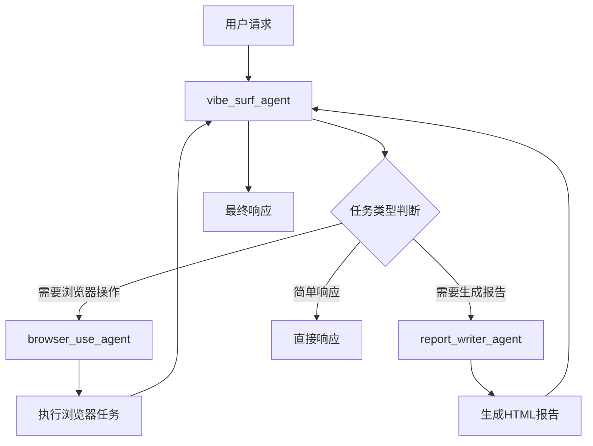
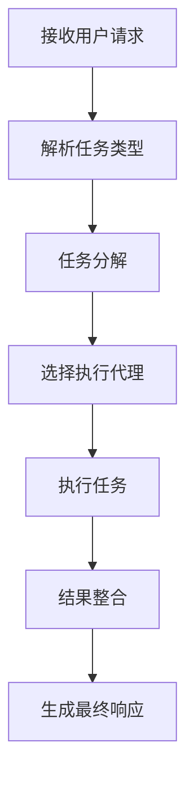
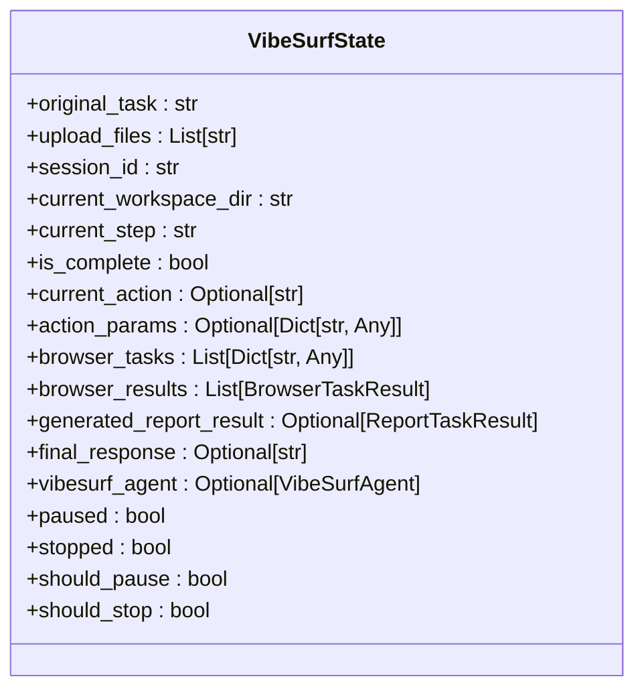
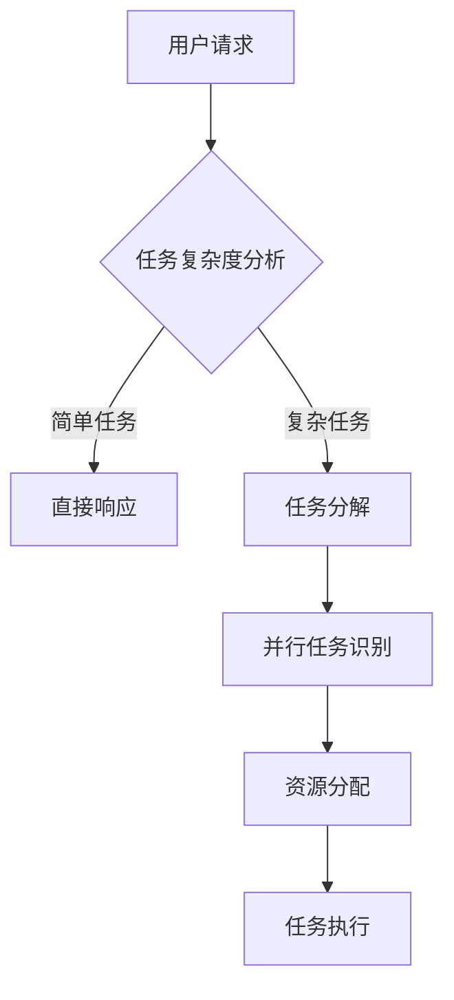
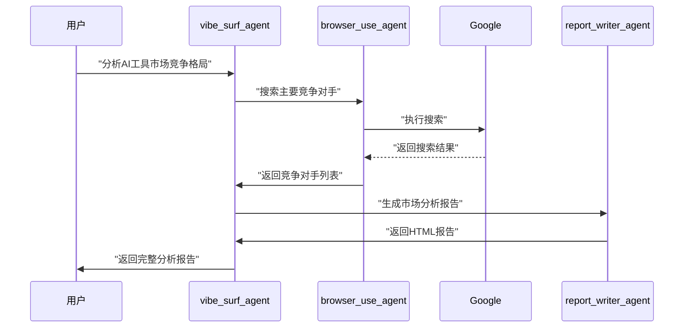
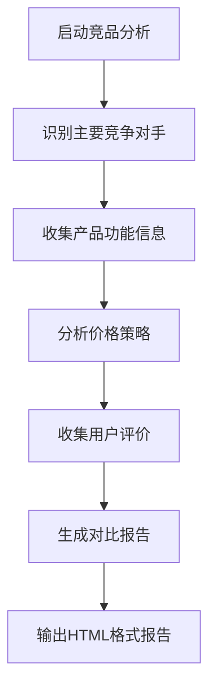
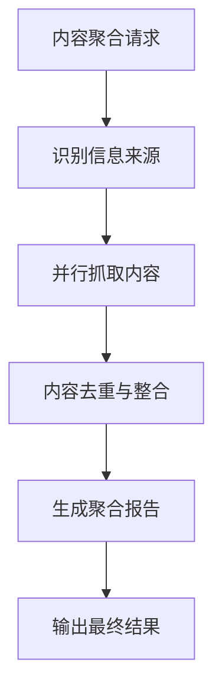
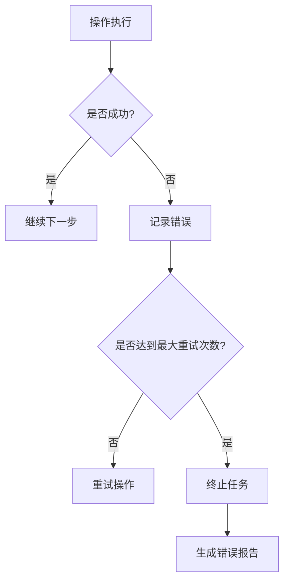

# 高级AI自动化

<cite>
**本文档引用的文件**   
- [vibe_surf_agent.py](file://vibe_surf/agents/vibe_surf_agent.py)
- [vibe_surf_prompt.py](file://vibe_surf/agents/prompts/vibe_surf_prompt.py)
- [report_writer_prompt.py](file://vibe_surf/agents/prompts/report_writer_prompt.py)
- [report_writer_agent.py](file://vibe_surf/agents/report_writer_agent.py)
- [vibesurf_tools.py](file://vibe_surf/tools/vibesurf_tools.py)
- [browser_use_tools.py](file://vibe_surf/tools/browser_use_tools.py)
- [llm_config.py](file://vibe_surf/backend/llm_config.py)
- [views.py](file://vibe_surf/agents/views.py)
</cite>

## 目录
1. [引言](#引言)
2. [核心架构与工作流](#核心架构与工作流)
3. [智能代理核心逻辑](#智能代理核心逻辑)
4. [提示词工程实现](#提示词工程实现)
5. [实际应用场景示例](#实际应用场景示例)
6. [性能优化与错误处理](#性能优化与错误处理)
7. [配置参数与行为调整](#配置参数与行为调整)
8. [结论](#结论)

## 引言
VibeSurf是一个先进的AI自动化框架，旨在通过深度研究、智能爬取和内容摘要等高级功能，实现复杂的网络自动化任务。该系统利用多个智能代理协同工作，能够理解用户意图、规划任务步骤并执行复杂操作。本文档将全面解析VibeSurf的高级AI自动化功能，详细阐述其内部机制和实现方式。

## 核心架构与工作流
VibeSurf的架构基于多代理协同模式，主要由主代理（vibe_surf_agent）、浏览器使用代理（browser_use_agent）和报告撰写代理（report_writer_agent）组成。这些代理通过LangGraph框架进行协调，形成一个高效的工作流。



**Diagram sources**
- [vibe_surf_agent.py](file://vibe_surf/agents/vibe_surf_agent.py#L344-L546)
- [vibe_surf_prompt.py](file://vibe_surf/agents/prompts/vibe_surf_prompt.py#L1-L219)

**Section sources**
- [vibe_surf_agent.py](file://vibe_surf/agents/vibe_surf_agent.py#L1-L800)
- [vibe_surf_prompt.py](file://vibe_surf/agents/prompts/vibe_surf_prompt.py#L1-L219)

## 智能代理核心逻辑
### 任务分解与工具选择
vibe_surf_agent.py是整个系统的核心，负责理解用户意图并规划任务执行步骤。它通过分析用户请求，将复杂任务分解为多个子任务，并选择合适的工具来执行。



**Diagram sources**
- [vibe_surf_agent.py](file://vibe_surf/agents/vibe_surf_agent.py#L344-L546)

**Section sources**
- [vibe_surf_agent.py](file://vibe_surf/agents/vibe_surf_agent.py#L1-L800)

### 结果整合机制
系统通过VibeSurfState类来管理整个工作流的状态，包括原始任务、当前步骤、浏览器任务结果和生成的报告结果等。这种状态管理机制确保了任务执行的连续性和结果的完整性。



**Diagram sources**
- [vibe_surf_agent.py](file://vibe_surf/agents/vibe_surf_agent.py#L94-L130)

**Section sources**
- [vibe_surf_agent.py](file://vibe_surf/agents/vibe_surf_agent.py#L94-L130)

## 提示词工程实现
### 核心提示词设计
VibeSurf的提示词工程是其智能决策能力的关键。系统通过精心设计的提示词引导AI理解任务要求并做出正确决策。

```python
# 核心提示词结构
VIBESURF_SYSTEM_PROMPT = """
# VibeSurf AI浏览器助手

您是VibeSurf代理，一个专业的AI浏览器助手...
"""
```

**Section sources**
- [vibe_surf_prompt.py](file://vibe_surf/agents/prompts/vibe_surf_prompt.py#L1-L219)

### 提示词优化策略
系统通过以下策略优化提示词效果：
1. **明确的任务分类**：区分简单响应、浏览器操作和报告生成等不同类型的任务
2. **并行任务处理**：支持多个独立浏览器任务的同时执行
3. **智能任务分配**：自动识别可并行化的子任务
4. **资源优化**：合理分配浏览器会话资源



**Diagram sources**
- [vibe_surf_prompt.py](file://vibe_surf/agents/prompts/vibe_surf_prompt.py#L1-L219)

**Section sources**
- [vibe_surf_prompt.py](file://vibe_surf/agents/prompts/vibe_surf_prompt.py#L1-L219)

## 实际应用场景示例
### 市场调研
VibeSurf可以自动执行市场调研任务，包括收集竞争对手信息、分析市场趋势和生成调研报告。



**Diagram sources**
- [vibe_surf_agent.py](file://vibe_surf/agents/vibe_surf_agent.py#L344-L546)
- [report_writer_agent.py](file://vibe_surf/agents/report_writer_agent.py#L106-L316)

**Section sources**
- [vibe_surf_agent.py](file://vibe_surf/agents/vibe_surf_agent.py#L344-L546)
- [report_writer_agent.py](file://vibe_surf/agents/report_writer_agent.py#L106-L316)

### 竞品分析
系统能够自动执行竞品分析，包括功能对比、价格分析和用户评价收集。



**Diagram sources**
- [vibesurf_tools.py](file://vibe_surf/tools/vibesurf_tools.py#L100-L225)
- [report_writer_prompt.py](file://vibe_surf/agents/prompts/report_writer_prompt.py#L1-L74)

**Section sources**
- [vibesurf_tools.py](file://vibe_surf/tools/vibesurf_tools.py#L100-L225)
- [report_writer_prompt.py](file://vibe_surf/agents/prompts/report_writer_prompt.py#L1-L74)

### 内容聚合
VibeSurf可以自动从多个来源聚合内容，创建综合性的信息报告。



**Diagram sources**
- [vibesurf_tools.py](file://vibe_surf/tools/vibesurf_tools.py#L100-L225)
- [vibe_surf_agent.py](file://vibe_surf/agents/vibe_surf_agent.py#L548-L604)

**Section sources**
- [vibesurf_tools.py](file://vibe_surf/tools/vibesurf_tools.py#L100-L225)
- [vibe_surf_agent.py](file://vibe_surf/agents/vibe_surf_agent.py#L548-L604)

## 性能优化与错误处理
### 超时与重试机制
系统实现了完善的超时和重试机制，确保任务的稳定执行。

```python
# 超时设置
llm_timeout: int = 90  # LLM调用超时时间（秒）
step_timeout: int = 120  # 每步操作超时时间（秒）

# 重试机制
max_failures: int = 3  # 最大失败次数
```

**Section sources**
- [vibe_surf_agent.py](file://vibe_surf/agents/vibe_surf_agent.py#L76-L83)
- [browser_use_agent.py](file://vibe_surf/agents/browser_use_agent.py#L116-L117)

### 错误处理策略
系统采用分层错误处理策略，确保在出现问题时能够优雅地恢复或终止。



**Diagram sources**
- [vibe_surf_agent.py](file://vibe_surf/agents/vibe_surf_agent.py#L522-L545)
- [browser_use_agent.py](file://vibe_surf/agents/browser_use_agent.py#L721-L727)

**Section sources**
- [vibe_surf_agent.py](file://vibe_surf/agents/vibe_surf_agent.py#L522-L545)
- [browser_use_agent.py](file://vibe_surf/agents/browser_use_agent.py#L721-L727)

## 配置参数与行为调整
### 激进程度调整
通过配置参数可以调整系统的激进程度，平衡执行效率和安全性。

```python
class VibeSurfAgentSettings(BaseModel):
    agent_mode: str = "thinking"  # thinking, no-thinking, flash
    use_vision: bool = True
    max_failures: int = 3
    max_actions_per_step: int = 4
```

**Section sources**
- [views.py](file://vibe_surf/agents/views.py#L59-L76)

### 创造性水平控制
系统支持通过LLM配置调整创造性水平，适应不同任务需求。

```python
# LLM配置
LLM_PROVIDERS = {
    "openai": ["gpt-4o", "gpt-4o-mini", "gpt-4.1", "gpt-4.1-mini"],
    "anthropic": ["claude-opus-4-1-20250805", "claude-sonnet-4-20250514"],
    "google": ["gemini-2.5-pro", "gemini-2.5-flash"],
}
```

**Section sources**
- [llm_config.py](file://vibe_surf/backend/llm_config.py#L8-L81)

## 结论
VibeSurf通过其先进的AI自动化功能，为用户提供了一个强大的网络自动化解决方案。系统通过智能代理协同、精心设计的提示词工程和完善的性能优化机制，能够高效地执行复杂的网络任务。无论是市场调研、竞品分析还是内容聚合，VibeSurf都能提供专业级的自动化服务，显著提升工作效率。