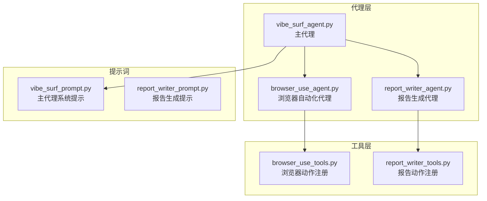
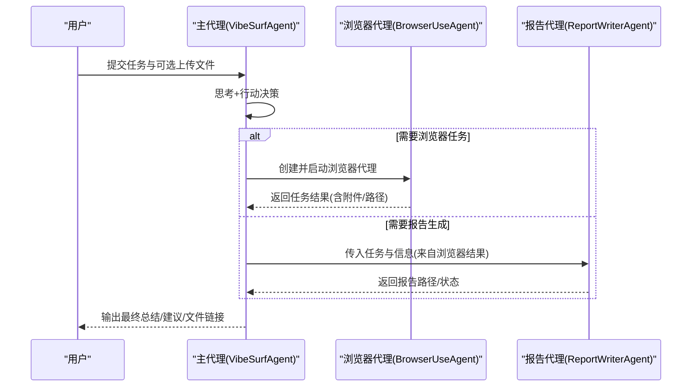
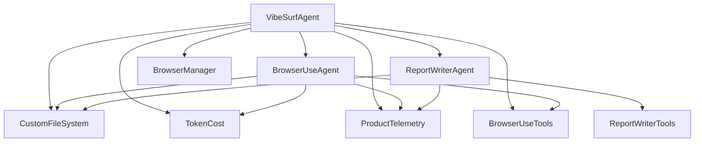

# 代理类型

<cite>
**本文引用的文件**
- [vibe_surf/agents/vibe_surf_agent.py](file://vibe_surf/agents/vibe_surf_agent.py)
- [vibe_surf/agents/browser_use_agent.py](file://vibe_surf/agents/browser_use_agent.py)
- [vibe_surf/agents/report_writer_agent.py](file://vibe_surf/agents/report_writer_agent.py)
- [vibe_surf/agents/prompts/vibe_surf_prompt.py](file://vibe_surf/agents/prompts/vibe_surf_prompt.py)
- [vibe_surf/agents/prompts/report_writer_prompt.py](file://vibe_surf/agents/prompts/report_writer_prompt.py)
- [vibe_surf/agents/views.py](file://vibe_surf/agents/views.py)
- [vibe_surf/tools/browser_use_tools.py](file://vibe_surf/tools/browser_use_tools.py)
- [vibe_surf/tools/report_writer_tools.py](file://vibe_surf/tools/report_writer_tools.py)
</cite>

## 目录
1. [引言](#引言)
2. [项目结构](#项目结构)
3. [核心组件](#核心组件)
4. [架构总览](#架构总览)
5. [详细组件分析](#详细组件分析)
6. [依赖关系分析](#依赖关系分析)
7. [性能考量](#性能考量)
8. [故障排查指南](#故障排查指南)
9. [结论](#结论)

## 引言
本文件系统性阐述 VibeSurf 中的三种核心代理类型：vibe_surf_agent、browser_use_agent 和 report_writer_agent。重点说明：
- 每个代理的设计目的与功能特性
- 适用场景与协作方式
- 初始化流程、关键配置参数与典型使用示例
- 提示词系统（prompts）对代理行为的影响及差异
- 主代理 vibe_surf_agent 如何协调其他代理工作，browser_use_agent 如何实现浏览器自动化，report_writer_agent 如何生成结构化报告

## 项目结构
围绕代理体系的关键目录与文件：
- agents：包含三种代理的实现与提示词
- tools：为代理提供可执行动作集合（浏览器动作、报告写作动作等）
- agents/views.py：定义代理输出模型与通用设置
- agents/prompts：系统提示词模板

图表来源
- [vibe_surf/agents/vibe_surf_agent.py](file://vibe_surf/agents/vibe_surf_agent.py#L997-L1040)
- [vibe_surf/agents/browser_use_agent.py](file://vibe_surf/agents/browser_use_agent.py#L83-L140)
- [vibe_surf/agents/report_writer_agent.py](file://vibe_surf/agents/report_writer_agent.py#L34-L61)
- [vibe_surf/agents/prompts/vibe_surf_prompt.py](file://vibe_surf/agents/prompts/vibe_surf_prompt.py#L1-L219)
- [vibe_surf/agents/prompts/report_writer_prompt.py](file://vibe_surf/agents/prompts/report_writer_prompt.py#L1-L74)
- [vibe_surf/tools/browser_use_tools.py](file://vibe_surf/tools/browser_use_tools.py#L62-L120)
- [vibe_surf/tools/report_writer_tools.py](file://vibe_surf/tools/report_writer_tools.py#L8-L23)

章节来源
- [vibe_surf/agents/vibe_surf_agent.py](file://vibe_surf/agents/vibe_surf_agent.py#L997-L1040)
- [vibe_surf/agents/browser_use_agent.py](file://vibe_surf/agents/browser_use_agent.py#L83-L140)
- [vibe_surf/agents/report_writer_agent.py](file://vibe_surf/agents/report_writer_agent.py#L34-L61)
- [vibe_surf/agents/prompts/vibe_surf_prompt.py](file://vibe_surf/agents/prompts/vibe_surf_prompt.py#L1-L219)
- [vibe_surf/agents/prompts/report_writer_prompt.py](file://vibe_surf/agents/prompts/report_writer_prompt.py#L1-L74)
- [vibe_surf/tools/browser_use_tools.py](file://vibe_surf/tools/browser_use_tools.py#L62-L120)
- [vibe_surf/tools/report_writer_tools.py](file://vibe_surf/tools/report_writer_tools.py#L8-L23)

## 核心组件
- vibe_surf_agent（主代理）
  - 设计目的：作为“监督者”与“编排器”，负责任务分解、路由到子代理、状态管理与控制（暂停/恢复/停止）、会话与日志持久化。
  - 关键能力：思考+行动模式、并发浏览器任务调度、报告生成编排、活动日志与遥测记录。
  - 典型调用：通过 LangGraph 节点在“vibesurf_agent”、“browser_task_execution”、“report_task_execution”之间流转。

- browser_use_agent（浏览器自动化代理）
  - 设计目的：以“思考+行动”模式执行网页自动化任务，支持多动作串联、截图、下载媒体、生成并执行 JS 等。
  - 关键能力：基于 Tools 注册的动作集、消息管理、步骤回调、文件系统集成、CDP 交互、成本统计。
  - 典型调用：由主代理创建并运行，支持单任务串行与多任务并行。

- report_writer_agent（报告生成代理）
  - 设计目的：根据收集的数据与用户需求，生成专业的 HTML 报告；具备 LLM 驱动的迭代式写入与格式化能力。
  - 关键能力：统一的“读取-写入-完成”动作模型、HTML 清洗与链接转换、回退报告生成、步骤回调与遥测。
  - 典型调用：由主代理触发，接收浏览器结果作为输入，最终产出报告文件路径。

章节来源
- [vibe_surf/agents/vibe_surf_agent.py](file://vibe_surf/agents/vibe_surf_agent.py#L345-L544)
- [vibe_surf/agents/browser_use_agent.py](file://vibe_surf/agents/browser_use_agent.py#L83-L140)
- [vibe_surf/agents/report_writer_agent.py](file://vibe_surf/agents/report_writer_agent.py#L34-L61)

## 架构总览
主代理 vibe_surf_agent 使用 LangGraph 定义工作流，节点间条件边路由到浏览器或报告执行节点，完成后回到主代理继续决策。

图表来源
- [vibe_surf/agents/vibe_surf_agent.py](file://vibe_surf/agents/vibe_surf_agent.py#L997-L1040)
- [vibe_surf/agents/vibe_surf_agent.py](file://vibe_surf/agents/vibe_surf_agent.py#L890-L963)
- [vibe_surf/agents/vibe_surf_agent.py](file://vibe_surf/agents/vibe_surf_agent.py#L548-L605)
- [vibe_surf/agents/report_writer_agent.py](file://vibe_surf/agents/report_writer_agent.py#L106-L179)

章节来源
- [vibe_surf/agents/vibe_surf_agent.py](file://vibe_surf/agents/vibe_surf_agent.py#L997-L1040)
- [vibe_surf/agents/vibe_surf_agent.py](file://vibe_surf/agents/vibe_surf_agent.py#L890-L963)
- [vibe_surf/agents/report_writer_agent.py](file://vibe_surf/agents/report_writer_agent.py#L106-L179)

## 详细组件分析

### vibe_surf_agent（主代理）
- 设计目的与职责
  - 作为“监督者”：理解用户意图，拆解复杂任务，决定是否并行执行浏览器任务、是否生成报告。
  - 协调与控制：管理暂停/恢复/停止；跟踪并控制子代理生命周期；维护会话与活动日志。
  - 输出与收尾：汇总结果，生成最终响应，必要时给出后续建议。

- 关键数据结构与状态
  - VibeSurfState：封装当前任务、上传文件、会话 ID、当前步骤、浏览器任务队列与结果、报告生成结果、最终响应等。
  - 控制状态：paused/should_pause/stopped/should_stop，配合控制感知节点包装器实现安全暂停/恢复/停止。

- 工作流节点
  - vibesurf_agent_node：核心决策节点，构建上下文（浏览器标签、历史结果、已生成报告），调用 LLM 输出“思考+行动”，根据动作路由到浏览器或报告节点，或直接结束。
  - browser_task_execution_node：批量创建并运行 BrowserUseAgent，支持单任务串行与多任务并行；收集结果并返回主代理。
  - report_task_execution_node：创建 ReportWriterAgent，传入浏览器结果与任务描述，生成 HTML 报告并返回主代理。

- 初始化与配置
  - 初始化参数：llm、browser_manager、tools、workspace_dir、settings、extend_system_prompt。
  - settings：包含 agent_mode（thinking/no-thinking/flash）、超时、最大失败次数、是否计算成本等。
  - 文件系统：按会话隔离工作空间，支持消息历史与活动日志的加载/保存。

- 典型使用示例（路径引用）
  - 主代理运行入口与会话管理：[run 方法](file://vibe_surf/agents/vibe_surf_agent.py#L1592-L1735)
  - 决策节点实现（思考+行动）：[vibesurf_agent_node 实现](file://vibe_surf/agents/vibe_surf_agent.py#L353-L544)
  - 浏览器任务执行（单/并行）：[browser_task_execution_node 实现](file://vibe_surf/agents/vibe_surf_agent.py#L555-L605)
  - 报告任务执行：[report_task_execution_node 实现](file://vibe_surf/agents/vibe_surf_agent.py#L897-L963)

- 提示词系统
  - 主代理系统提示（VIBESURF_SYSTEM_PROMPT）：定义角色、能力、最佳实践、文件操作规范、深研模式、外部工具发现与使用、认证错误处理、技能命令处理、安全与合规等。
  - 扩展浏览器系统提示（EXTEND_BU_SYSTEM_PROMPT）：强调语言一致性、相对路径、搜索键入、JS 代码生成与执行优先级、视觉输入处理与安全注意事项。

章节来源
- [vibe_surf/agents/vibe_surf_agent.py](file://vibe_surf/agents/vibe_surf_agent.py#L997-L1040)
- [vibe_surf/agents/vibe_surf_agent.py](file://vibe_surf/agents/vibe_surf_agent.py#L345-L544)
- [vibe_surf/agents/vibe_surf_agent.py](file://vibe_surf/agents/vibe_surf_agent.py#L548-L605)
- [vibe_surf/agents/vibe_surf_agent.py](file://vibe_surf/agents/vibe_surf_agent.py#L890-L963)
- [vibe_surf/agents/prompts/vibe_surf_prompt.py](file://vibe_surf/agents/prompts/vibe_surf_prompt.py#L1-L219)
- [vibe_surf/agents/prompts/vibe_surf_prompt.py](file://vibe_surf/agents/prompts/vibe_surf_prompt.py#L198-L219)
- [vibe_surf/agents/views.py](file://vibe_surf/agents/views.py#L58-L73)

### browser_use_agent（浏览器自动化代理）
- 设计目的与职责
  - 以“思考+行动”模式执行网页自动化，支持导航、点击、输入、滚动、截图、下载媒体、生成并执行 JS、搜索等。
  - 与文件系统集成，支持任务完成时附带重要文件路径。

- 关键能力与配置
  - 动作注册：通过 Tools 与自定义动作（如 hover、search、navigate、take_screenshot、download_media、gen_and_execute_js_code）实现。
  - 设置项：use_vision、max_actions_per_step、use_thinking、flash_mode、llm/page_extraction_llm 超时、页面提取模型等。
  - 文件系统：按代理实例隔离目录，支持截图、下载等文件落盘。
  - 步骤回调：用于记录每步思考与动作摘要，便于活动日志可视化。

- 初始化与配置
  - 支持传入 llm、browser_session、tools、file_system_path、task_id、extend_system_message、token_cost_service 等。
  - 可选择 use_thinking 或 flash 模式，控制输出结构与速度。

- 典型使用示例（路径引用）
  - 初始化与系统提示注入：[构造函数](file://vibe_surf/agents/browser_use_agent.py#L83-L140)
  - 动作注册（浏览器导航/截图/下载/JS 生成执行等）：[动作注册](file://vibe_surf/tools/browser_use_tools.py#L146-L210)、[search](file://vibe_surf/tools/browser_use_tools.py#L255-L288)、[navigate](file://vibe_surf/tools/browser_use_tools.py#L290-L310)、[gen_and_execute_js_code](file://vibe_surf/tools/browser_use_tools.py#L311-L347)、[take_screenshot](file://vibe_surf/tools/browser_use_tools.py#L381-L416)、[download_media](file://vibe_surf/tools/browser_use_tools.py#L421-L492)
  - 运行循环与步骤回调：[run](file://vibe_surf/agents/browser_use_agent.py#L658-L799)、[multi_act](file://vibe_surf/agents/browser_use_agent.py#L489-L559)

- 提示词系统
  - 主代理扩展提示（EXTEND_BU_SYSTEM_PROMPT）：强调语言一致性、相对路径、搜索键入、JS 代码生成优先级、视觉输入处理与安全注意事项。

章节来源
- [vibe_surf/agents/browser_use_agent.py](file://vibe_surf/agents/browser_use_agent.py#L83-L140)
- [vibe_surf/agents/browser_use_agent.py](file://vibe_surf/agents/browser_use_agent.py#L489-L559)
- [vibe_surf/agents/browser_use_agent.py](file://vibe_surf/agents/browser_use_agent.py#L658-L799)
- [vibe_surf/tools/browser_use_tools.py](file://vibe_surf/tools/browser_use_tools.py#L146-L210)
- [vibe_surf/tools/browser_use_tools.py](file://vibe_surf/tools/browser_use_tools.py#L255-L288)
- [vibe_surf/tools/browser_use_tools.py](file://vibe_surf/tools/browser_use_tools.py#L290-L310)
- [vibe_surf/tools/browser_use_tools.py](file://vibe_surf/tools/browser_use_tools.py#L311-L347)
- [vibe_surf/tools/browser_use_tools.py](file://vibe_surf/tools/browser_use_tools.py#L381-L416)
- [vibe_surf/tools/browser_use_tools.py](file://vibe_surf/tools/browser_use_tools.py#L421-L492)
- [vibe_surf/agents/prompts/vibe_surf_prompt.py](file://vibe_surf/agents/prompts/vibe_surf_prompt.py#L198-L219)

### report_writer_agent（报告生成代理）
- 设计目的与职责
  - 基于 LLM 的“思考+行动”模式生成专业 HTML 报告，支持读取现有文件、写入报告内容、格式化为完整 HTML 文档。
  - 自动清洗 HTML、转换相对路径为绝对 file:// URL，支持回退报告生成。

- 关键能力与配置
  - 动作模型：通过 ReportWriterTools 注册 read_file、write_file、task_done 等动作。
  - 输出结构：统一的“思考+行动”输出模型，支持 step_callback 记录每步思考与动作。
  - 文件系统：在指定工作空间下创建报告文件，支持 HTML 清洗与链接转换。

- 初始化与配置
  - 接收 llm、workspace_dir、step_callback、use_thinking 参数。
  - 支持 pause/resume/stop 控制，便于与主代理协同。

- 典型使用示例（路径引用）
  - 初始化与动作模型：[构造函数](file://vibe_surf/agents/report_writer_agent.py#L34-L61)
  - 报告生成主循环与动作执行：[generate_report](file://vibe_surf/agents/report_writer_agent.py#L106-L267)
  - HTML 清洗与链接转换：[_finalize_report](file://vibe_surf/agents/report_writer_agent.py#L348-L395)、[_convert_file_links](file://vibe_surf/agents/report_writer_agent.py#L435-L474)
  - 回退报告生成：[_generate_fallback_report](file://vibe_surf/agents/report_writer_agent.py#L476-L581)

- 提示词系统
  - 报告生成提示（REPORT_WRITER_PROMPT）：明确读取-写入-完成的步骤、HTML 结构要求、标题与内容规范、相对路径使用规则等。

章节来源
- [vibe_surf/agents/report_writer_agent.py](file://vibe_surf/agents/report_writer_agent.py#L34-L61)
- [vibe_surf/agents/report_writer_agent.py](file://vibe_surf/agents/report_writer_agent.py#L106-L267)
- [vibe_surf/agents/report_writer_agent.py](file://vibe_surf/agents/report_writer_agent.py#L348-L395)
- [vibe_surf/agents/report_writer_agent.py](file://vibe_surf/agents/report_writer_agent.py#L435-L474)
- [vibe_surf/agents/report_writer_agent.py](file://vibe_surf/agents/report_writer_agent.py#L476-L581)
- [vibe_surf/agents/prompts/report_writer_prompt.py](file://vibe_surf/agents/prompts/report_writer_prompt.py#L1-L74)
- [vibe_surf/tools/report_writer_tools.py](file://vibe_surf/tools/report_writer_tools.py#L8-L23)

## 依赖关系分析
- 组件耦合与协作
  - vibe_surf_agent 依赖：LangGraph 工作流、BrowserManager、VibeSurfTools、CustomFileSystem、TokenCost、ProductTelemetry。
  - browser_use_agent 依赖：browser_use 库的 Agent/Tools/MessageManager/BrowserSession、CustomFileSystem、TokenCost、ProductTelemetry。
  - report_writer_agent 依赖：CustomFileSystem、ReportWriterTools、ProductTelemetry。

- 外部依赖与集成点
  - LLM：通过 BaseChatModel 注入，支持多种模型提供商。
  - 浏览器自动化：基于 browser_use 的 BrowserSession、CDP 交互、DOM 操作。
  - 文件系统：CustomFileSystem 提供工作空间隔离与文件读写。
  - 遥测：ProductTelemetry 记录事件与耗时。

图表来源
- [vibe_surf/agents/vibe_surf_agent.py](file://vibe_surf/agents/vibe_surf_agent.py#L1041-L1083)
- [vibe_surf/agents/browser_use_agent.py](file://vibe_surf/agents/browser_use_agent.py#L83-L140)
- [vibe_surf/agents/report_writer_agent.py](file://vibe_surf/agents/report_writer_agent.py#L34-L61)
- [vibe_surf/tools/browser_use_tools.py](file://vibe_surf/tools/browser_use_tools.py#L62-L120)
- [vibe_surf/tools/report_writer_tools.py](file://vibe_surf/tools/report_writer_tools.py#L8-L23)

章节来源
- [vibe_surf/agents/vibe_surf_agent.py](file://vibe_surf/agents/vibe_surf_agent.py#L1041-L1083)
- [vibe_surf/agents/browser_use_agent.py](file://vibe_surf/agents/browser_use_agent.py#L83-L140)
- [vibe_surf/agents/report_writer_agent.py](file://vibe_surf/agents/report_writer_agent.py#L34-L61)
- [vibe_surf/tools/browser_use_tools.py](file://vibe_surf/tools/browser_use_tools.py#L62-L120)
- [vibe_surf/tools/report_writer_tools.py](file://vibe_surf/tools/report_writer_tools.py#L8-L23)

## 性能考量
- 并发与资源管理
  - 主代理在浏览器任务执行阶段支持并行模式，显著降低多任务总耗时；同时注意浏览器标签分配唯一性，避免冲突。
- 成本与超时
  - 通过 TokenCost 与 llm/page_extraction_llm 的超时配置，平衡质量与成本。
- I/O 与文件系统
  - 代理均使用工作空间隔离，减少跨进程/跨会话干扰；注意相对路径与 file:// URL 的转换，避免无效链接。
- 控制与可观测性
  - 步骤回调与活动日志有助于定位瓶颈；遥测事件可用于评估执行效率与异常。

[本节为通用指导，不直接分析具体文件]

## 故障排查指南
- 常见问题与定位
  - 浏览器动作失败：检查元素定位（索引/xpath/selector）、等待策略、CDP 会话状态；查看 ActionResult 错误信息。
  - 报告生成异常：确认 HTML 清洗与链接转换逻辑；若 LLM 失败，启用回退报告生成。
  - 代理控制无响应：确认 pause/resume/stop 是否正确传播至子代理；检查控制锁与状态标志位。
- 日志与遥测
  - 活动日志包含每步思考与动作摘要；遥测事件记录开始/完成/异常与耗时，便于审计与优化。

章节来源
- [vibe_surf/agents/browser_use_agent.py](file://vibe_surf/agents/browser_use_agent.py#L489-L559)
- [vibe_surf/agents/report_writer_agent.py](file://vibe_surf/agents/report_writer_agent.py#L348-L395)
- [vibe_surf/agents/vibe_surf_agent.py](file://vibe_surf/agents/vibe_surf_agent.py#L1173-L1231)

## 结论
- vibe_surf_agent 作为主代理，承担任务规划、并行调度与控制职责，是系统的核心编排者。
- browser_use_agent 专注于浏览器自动化，提供丰富的动作与稳健的文件系统集成，适合复杂网页任务。
- report_writer_agent 专注结构化报告生成，具备完善的格式化与回退机制，确保交付质量。
- 三者通过统一的“思考+行动”输出模型与提示词系统协同，形成高效、可控、可观测的智能代理体系。

[本节为总结性内容，不直接分析具体文件]