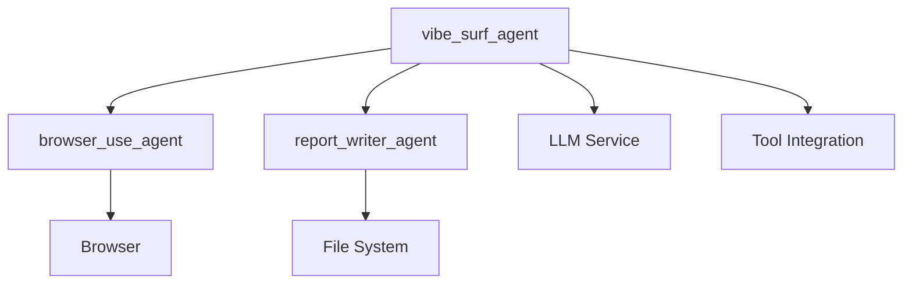
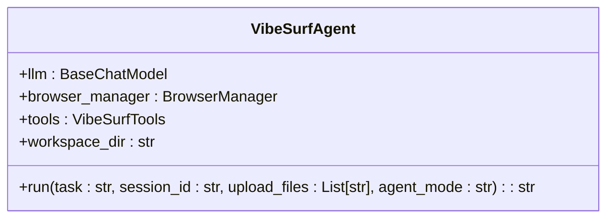
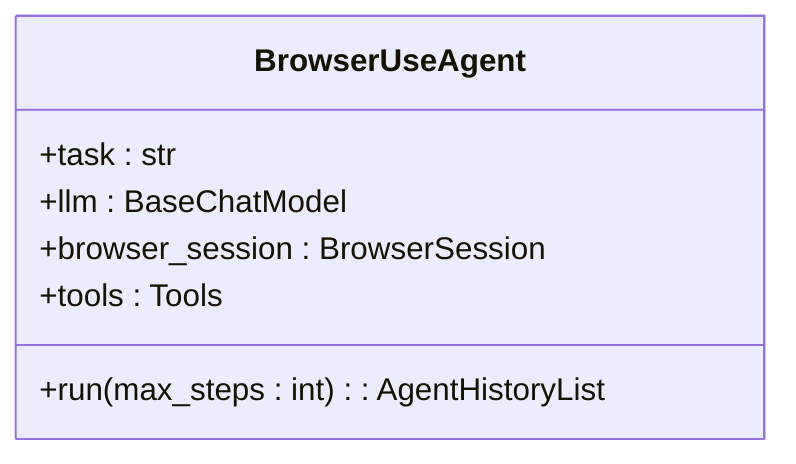
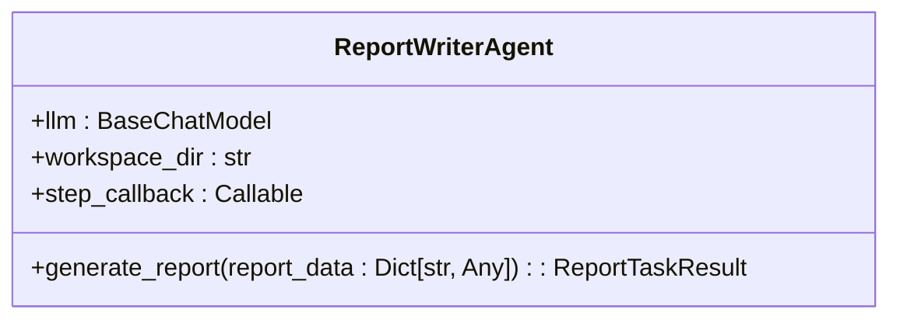
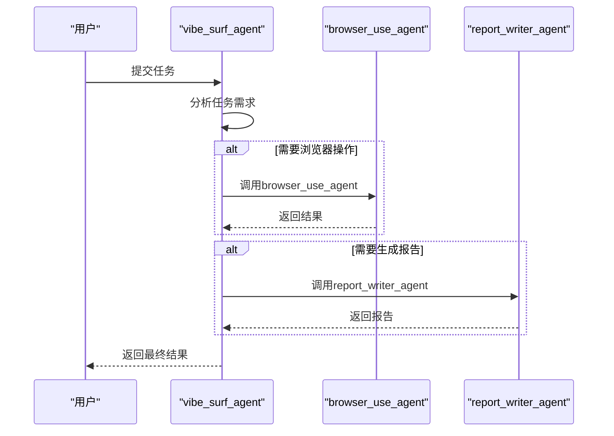
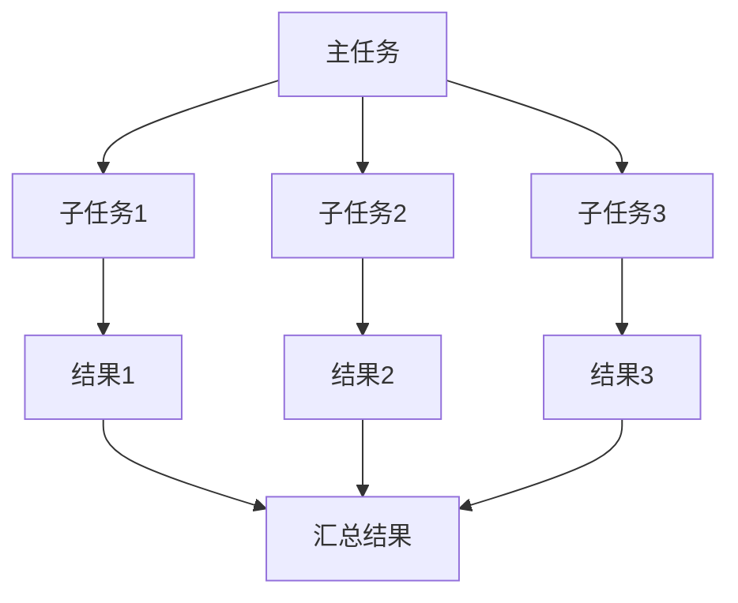
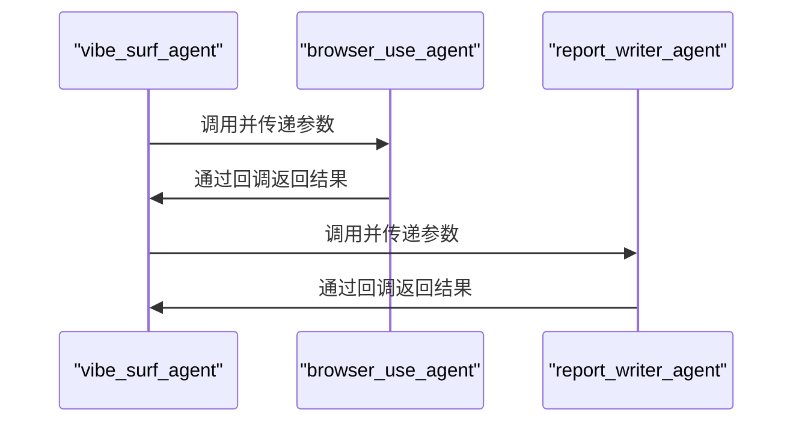
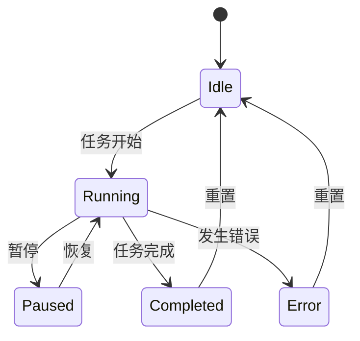
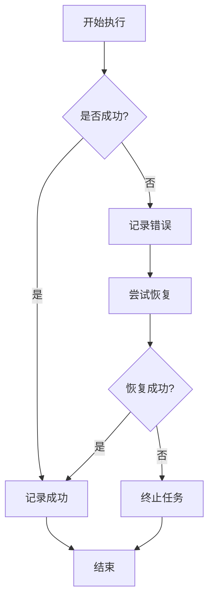

# 代理系统

<cite>
**本文档引用的文件**   
- [vibe_surf_agent.py](file://vibe_surf/agents/vibe_surf_agent.py)
- [browser_use_agent.py](file://vibe_surf/agents/browser_use_agent.py)
- [report_writer_agent.py](file://vibe_surf/agents/report_writer_agent.py)
- [vibe_surf_prompt.py](file://vibe_surf/agents/prompts/vibe_surf_prompt.py)
- [report_writer_prompt.py](file://vibe_surf/agents/prompts/report_writer_prompt.py)
- [browser_use_tools.py](file://vibe_surf/tools/browser_use_tools.py)
- [report_writer_tools.py](file://vibe_surf/tools/report_writer_tools.py)
- [browser_manager.py](file://vibe_surf/browser/browser_manager.py)
- [shared_state.py](file://vibe_surf/backend/shared_state.py)
- [views.py](file://vibe_surf/agents/views.py)
</cite>

## 目录
1. [引言](#引言)
2. [代理系统架构](#代理系统架构)
3. [核心代理类型](#核心代理类型)
4. [任务调度与执行](#任务调度与执行)
5. [多代理并行处理](#多代理并行处理)
6. [代理间通信](#代理间通信)
7. [状态管理与生命周期](#状态管理与生命周期)
8. [性能监控与故障恢复](#性能监控与故障恢复)
9. [结论](#结论)

## 引言

VibeSurf代理系统是一个先进的AI代理框架，旨在通过智能的浏览器自动化、并行处理和报告生成能力来增强用户的生产力。该系统通过多个专门的代理协同工作，实现复杂的任务自动化。核心代理包括vibe_surf_agent、browser_use_agent和report_writer_agent，它们共同构成了一个强大的自动化解决方案。

**Section sources**
- [vibe_surf_agent.py](file://vibe_surf/agents/vibe_surf_agent.py#L1-L1840)
- [browser_use_agent.py](file://vibe_surf/agents/browser_use_agent.py#L1-L820)

## 代理系统架构

VibeSurf代理系统采用分层架构设计，将不同的功能模块分离，以提高系统的可维护性和扩展性。系统的核心是vibe_surf_agent，它作为主控代理，负责协调其他代理的工作。browser_use_agent负责执行具体的浏览器操作，而report_writer_agent则专注于生成高质量的HTML报告。

系统通过LangGraph框架实现工作流的编排，确保各个代理之间的协调和数据流动。这种架构设计使得系统能够灵活地应对各种复杂的任务需求。

**Diagram sources **
- [vibe_surf_agent.py](file://vibe_surf/agents/vibe_surf_agent.py#L1-L1840)
- [browser_use_agent.py](file://vibe_surf/agents/browser_use_agent.py#L1-L820)
- [report_writer_agent.py](file://vibe_surf/agents/report_writer_agent.py#L1-L581)

**Section sources**
- [vibe_surf_agent.py](file://vibe_surf/agents/vibe_surf_agent.py#L1-L1840)
- [browser_use_agent.py](file://vibe_surf/agents/browser_use_agent.py#L1-L820)
- [report_writer_agent.py](file://vibe_surf/agents/report_writer_agent.py#L1-L581)

## 核心代理类型

### vibe_surf_agent

vibe_surf_agent是VibeSurf系统的核心代理，负责整体任务的规划和协调。它接收用户任务，分析任务需求，并决定是否需要调用其他代理来完成任务。vibe_surf_agent通过LangGraph框架管理任务的执行流程，确保任务的高效完成。

**Diagram sources **
- [vibe_surf_agent.py](file://vibe_surf/agents/vibe_surf_agent.py#L1-L1840)

### browser_use_agent

browser_use_agent专门负责执行浏览器相关的任务。它能够自动化地进行网页浏览、数据提取和表单填写等操作。该代理通过与浏览器的深度集成，实现了对网页元素的精确控制。

**Diagram sources **
- [browser_use_agent.py](file://vibe_surf/agents/browser_use_agent.py#L1-L820)

### report_writer_agent

report_writer_agent负责生成专业的HTML报告。它能够读取文件、生成内容，并将结果格式化为美观的HTML文档。该代理特别适用于需要生成详细报告的场景。

**Diagram sources **
- [report_writer_agent.py](file://vibe_surf/agents/report_writer_agent.py#L1-L581)

**Section sources**
- [vibe_surf_agent.py](file://vibe_surf/agents/vibe_surf_agent.py#L1-L1840)
- [browser_use_agent.py](file://vibe_surf/agents/browser_use_agent.py#L1-L820)
- [report_writer_agent.py](file://vibe_surf/agents/report_writer_agent.py#L1-L581)

## 任务调度与执行

VibeSurf代理系统通过vibe_surf_agent实现任务的调度与执行。当接收到用户任务时，vibe_surf_agent会分析任务需求，并决定是否需要调用其他代理来完成任务。任务的执行流程由LangGraph框架管理，确保任务的高效完成。

**Diagram sources **
- [vibe_surf_agent.py](file://vibe_surf/agents/vibe_surf_agent.py#L1-L1840)
- [browser_use_agent.py](file://vibe_surf/agents/browser_use_agent.py#L1-L820)
- [report_writer_agent.py](file://vibe_surf/agents/report_writer_agent.py#L1-L581)

**Section sources**
- [vibe_surf_agent.py](file://vibe_surf/agents/vibe_surf_agent.py#L1-L1840)
- [browser_use_agent.py](file://vibe_surf/agents/browser_use_agent.py#L1-L820)
- [report_writer_agent.py](file://vibe_surf/agents/report_writer_agent.py#L1-L581)

## 多代理并行处理

VibeSurf代理系统支持多代理并行处理，以提高任务执行的效率。当任务包含多个独立的子任务时，vibe_surf_agent可以同时启动多个browser_use_agent实例，每个实例负责一个子任务。这种并行处理机制显著减少了任务的总体执行时间。

**Diagram sources **
- [vibe_surf_agent.py](file://vibe_surf/agents/vibe_surf_agent.py#L1-L1840)
- [browser_use_agent.py](file://vibe_surf/agents/browser_use_agent.py#L1-L820)

**Section sources**
- [vibe_surf_agent.py](file://vibe_surf/agents/vibe_surf_agent.py#L1-L1840)
- [browser_use_agent.py](file://vibe_surf/agents/browser_use_agent.py#L1-L820)

## 代理间通信

VibeSurf代理系统中的各个代理通过共享状态和消息传递机制进行通信。vibe_surf_agent作为主控代理，负责协调其他代理的工作。当需要执行特定任务时，vibe_surf_agent会调用相应的代理，并传递必要的参数。执行结果通过回调函数返回给vibe_surf_agent，以便进行后续处理。

**Diagram sources **
- [vibe_surf_agent.py](file://vibe_surf/agents/vibe_surf_agent.py#L1-L1840)
- [browser_use_agent.py](file://vibe_surf/agents/browser_use_agent.py#L1-L820)
- [report_writer_agent.py](file://vibe_surf/agents/report_writer_agent.py#L1-L581)

**Section sources**
- [vibe_surf_agent.py](file://vibe_surf/agents/vibe_surf_agent.py#L1-L1840)
- [browser_use_agent.py](file://vibe_surf/agents/browser_use_agent.py#L1-L820)
- [report_writer_agent.py](file://vibe_surf/agents/report_writer_agent.py#L1-L581)

## 状态管理与生命周期

VibeSurf代理系统通过状态管理机制跟踪任务的执行进度。每个代理都有自己的状态，包括运行状态、当前操作和错误信息。vibe_surf_agent负责监控所有代理的状态，并根据状态变化做出相应的决策。

**Diagram sources **
- [vibe_surf_agent.py](file://vibe_surf/agents/vibe_surf_agent.py#L1-L1840)
- [browser_use_agent.py](file://vibe_surf/agents/browser_use_agent.py#L1-L820)
- [report_writer_agent.py](file://vibe_surf/agents/report_writer_agent.py#L1-L581)

**Section sources**
- [vibe_surf_agent.py](file://vibe_surf/agents/vibe_surf_agent.py#L1-L1840)
- [browser_use_agent.py](file://vibe_surf/agents/browser_use_agent.py#L1-L820)
- [report_writer_agent.py](file://vibe_surf/agents/report_writer_agent.py#L1-L581)

## 性能监控与故障恢复

VibeSurf代理系统内置了性能监控和故障恢复机制。系统通过telemetry服务收集代理的执行数据，包括执行时间、资源使用情况和错误信息。当代理执行失败时，系统会尝试恢复执行，或根据配置采取相应的措施。

**Diagram sources **
- [vibe_surf_agent.py](file://vibe_surf/agents/vibe_surf_agent.py#L1-L1840)
- [telemetry/service.py](file://vibe_surf/telemetry/service.py#L1-L114)

**Section sources**
- [vibe_surf_agent.py](file://vibe_surf/agents/vibe_surf_agent.py#L1-L1840)
- [telemetry/service.py](file://vibe_surf/telemetry/service.py#L1-L114)

## 结论

VibeSurf代理系统通过其先进的架构设计和强大的功能，为用户提供了一个高效、可靠的自动化解决方案。通过vibe_surf_agent、browser_use_agent和report_writer_agent的协同工作，系统能够处理复杂的任务，实现浏览器自动化、并行处理和报告生成。未来，系统将继续优化性能，增强故障恢复能力，为用户提供更加卓越的体验。

[无来源，因为此部分总结而不分析特定文件]