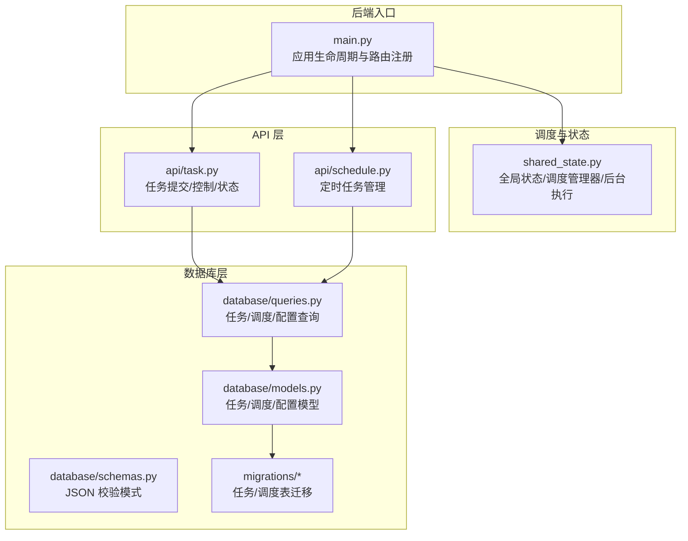
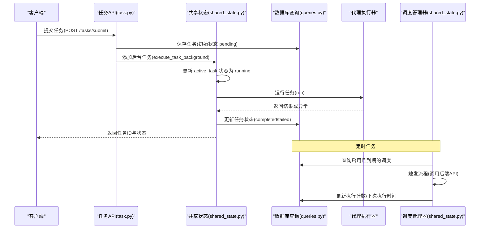
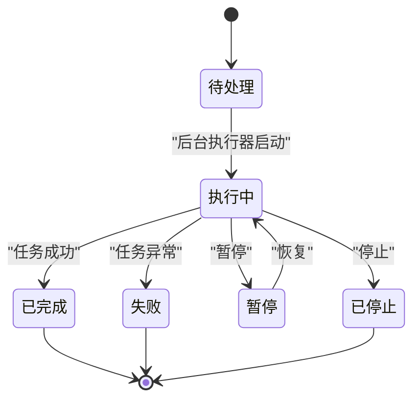
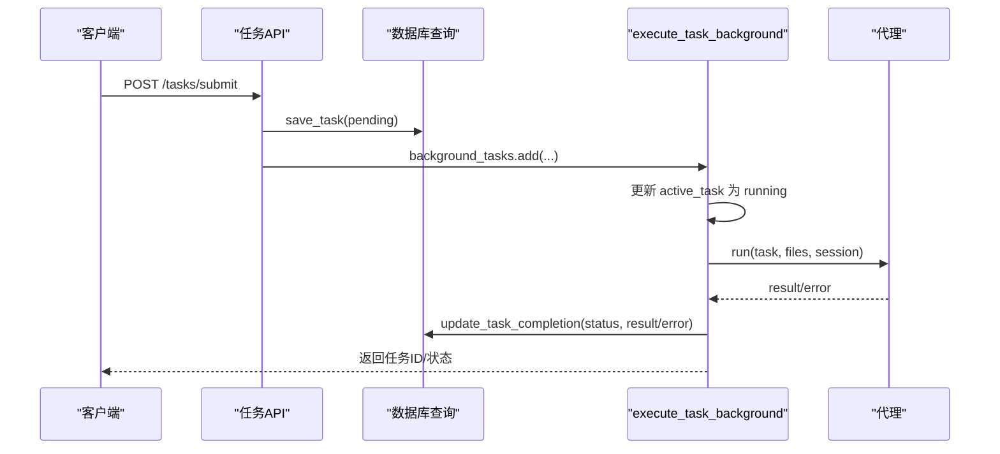
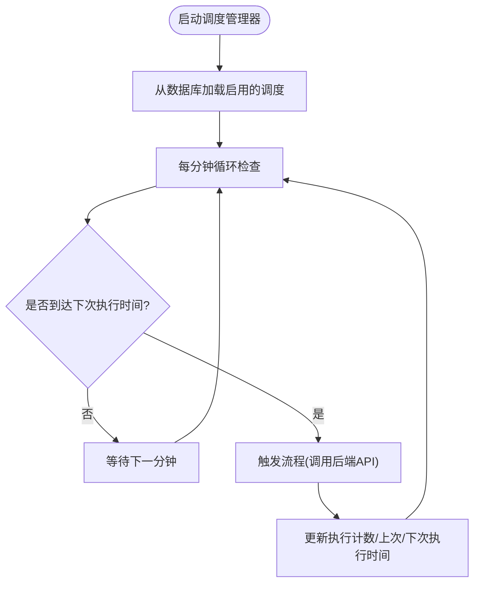
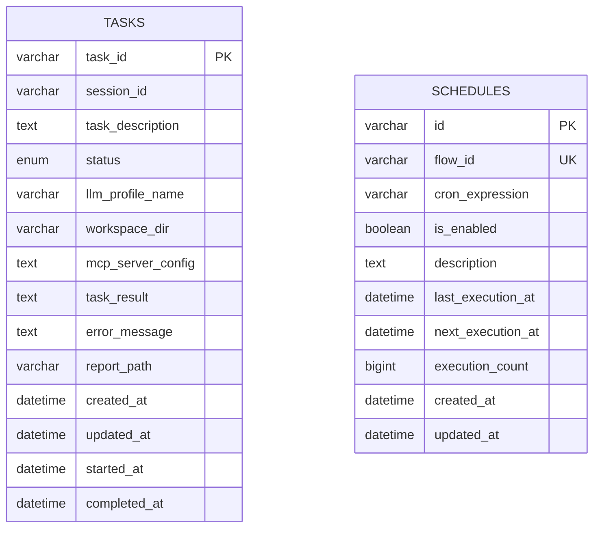
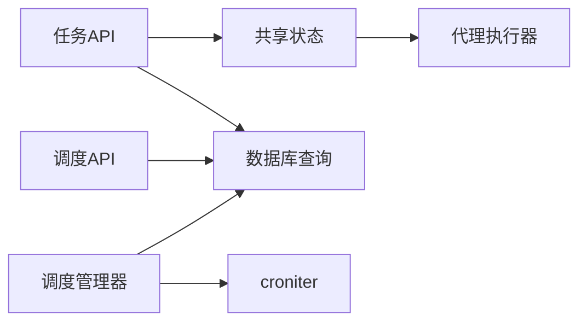

# 任务调度

<cite>
**本文引用的文件**
- [main.py](file://vibe_surf/backend/main.py)
- [shared_state.py](file://vibe_surf/backend/shared_state.py)
- [task.py](file://vibe_surf/backend/api/task.py)
- [schedule.py](file://vibe_surf/backend/api/schedule.py)
- [models.py](file://vibe_surf/backend/database/models.py)
- [schemas.py](file://vibe_surf/backend/database/schemas.py)
- [queries.py](file://vibe_surf/backend/database/queries.py)
- [v007_add_schedule_table.sql](file://vibe_surf/backend/database/migrations/v007_add_schedule_table.sql)
- [v003_fix_task_status_case.sql](file://vibe_surf/backend/database/migrations/v003_fix_task_status_case.sql)
</cite>

## 目录
1. [简介](#简介)
2. [项目结构](#项目结构)
3. [核心组件](#核心组件)
4. [架构总览](#架构总览)
5. [详细组件分析](#详细组件分析)
6. [依赖关系分析](#依赖关系分析)
7. [性能考量](#性能考量)
8. [故障排查指南](#故障排查指南)
9. [结论](#结论)

## 简介
本文件系统性解析 VibeSurf 代理系统的任务调度机制，覆盖任务从创建、分配到执行完成的全生命周期管理；阐述任务调度器如何处理单任务并发执行、任务状态转换与错误重试；分析数据库中任务表与调度表的结构设计及作用；解释定时任务调度的实现方式与 API 使用方法，并给出性能优化建议。

## 项目结构
后端采用 FastAPI 提供 REST API，核心调度逻辑集中在共享状态模块与数据库查询层：
- 后端入口与生命周期：应用启动时初始化组件、浏览器会话、Langflow 服务、调度管理器；关闭时进行资源回收。
- 任务 API：提交任务、暂停/恢复/停止、状态查询。
- 调度 API：创建/更新/删除/查询定时任务。
- 数据库层：定义任务、调度、配置等模型与查询操作，支持迁移与索引优化。

图表来源
- [main.py](file://vibe_surf/backend/main.py#L327-L483)
- [shared_state.py](file://vibe_surf/backend/shared_state.py#L118-L233)
- [task.py](file://vibe_surf/backend/api/task.py#L43-L145)
- [schedule.py](file://vibe_surf/backend/api/schedule.py#L108-L148)
- [models.py](file://vibe_surf/backend/database/models.py#L94-L137)
- [queries.py](file://vibe_surf/backend/database/queries.py#L441-L753)
- [v007_add_schedule_table.sql](file://vibe_surf/backend/database/migrations/v007_add_schedule_table.sql#L1-L29)

章节来源
- [main.py](file://vibe_surf/backend/main.py#L327-L483)
- [shared_state.py](file://vibe_surf/backend/shared_state.py#L118-L233)
- [task.py](file://vibe_surf/backend/api/task.py#L43-L145)
- [schedule.py](file://vibe_surf/backend/api/schedule.py#L108-L148)
- [models.py](file://vibe_surf/backend/database/models.py#L94-L137)
- [queries.py](file://vibe_surf/backend/database/queries.py#L441-L753)
- [v007_add_schedule_table.sql](file://vibe_surf/backend/database/migrations/v007_add_schedule_table.sql#L1-L29)

## 核心组件
- 全局状态与执行器
  - 单任务执行跟踪：active_task 字典记录当前任务状态、开始/结束时间、工作空间、上传文件等。
  - 后台执行函数：execute_task_background 负责任务状态推进、调用代理执行、写回数据库、清理状态。
  - LLM/MCP/Composio 配置动态加载：根据数据库配置更新工具链。
- 任务 API
  - 提交任务：校验是否已有运行中任务，保存初始任务记录，异步后台执行。
  - 控制接口：暂停/恢复/停止，直接委托给代理对象。
  - 状态查询：快速状态与详细状态接口。
- 调度 API
  - 创建/更新/删除/查询定时任务，支持 cron 表达式与启用开关。
  - 后台调度管理器：周期扫描数据库，命中即触发对应流程。
- 数据库模型与查询
  - 任务表：记录任务描述、状态、LLM 配置引用、结果、错误信息、时间戳等。
  - 调度表：记录 flow_id、cron 表达式、启用状态、执行计数与下次执行时间等。
  - 查询封装：提供保存任务、更新状态、获取运行中任务、统计状态数量等常用操作。

章节来源
- [shared_state.py](file://vibe_surf/backend/shared_state.py#L118-L233)
- [task.py](file://vibe_surf/backend/api/task.py#L43-L145)
- [schedule.py](file://vibe_surf/backend/api/schedule.py#L108-L148)
- [models.py](file://vibe_surf/backend/database/models.py#L94-L137)
- [queries.py](file://vibe_surf/backend/database/queries.py#L441-L753)

## 架构总览
下图展示任务从提交到执行完成的关键交互路径，以及调度器对定时任务的触发流程。

图表来源
- [task.py](file://vibe_surf/backend/api/task.py#L43-L145)
- [shared_state.py](file://vibe_surf/backend/shared_state.py#L118-L233)
- [queries.py](file://vibe_surf/backend/database/queries.py#L441-L753)
- [schedule.py](file://vibe_surf/backend/api/schedule.py#L108-L148)
- [shared_state.py](file://vibe_surf/backend/shared_state.py#L740-L1111)

## 详细组件分析

### 任务生命周期与状态机
- 状态枚举与持久化
  - 任务状态包括：待处理(pending)、执行中(running)、暂停(paused)、已完成(completed)、失败(failed)、已停止(stopped)。
  - 数据库迁移确保状态值统一为小写，避免大小写不一致导致的查询问题。
- 状态转换流程
  - 提交任务：保存初始状态为 pending，随后由后台执行器推进到 running。
  - 执行成功：更新为 completed，写入报告路径与结果。
  - 执行失败：更新为 failed，记录错误信息。
  - 暂停/恢复/停止：通过控制接口更新 active_task 状态，停止时清理 active_task。
- 时间戳管理
  - started_at 在首次进入 running 时设置；completed_at 在最终状态变更时设置。
- 错误处理与重试
  - 后台执行器捕获异常，将状态置为 failed 并写回数据库；未显式实现自动重试策略，但可通过外部调度再次触发。

图表来源
- [models.py](file://vibe_surf/backend/database/models.py#L16-L24)
- [v003_fix_task_status_case.sql](file://vibe_surf/backend/database/migrations/v003_fix_task_status_case.sql#L1-L11)
- [shared_state.py](file://vibe_surf/backend/shared_state.py#L118-L233)
- [queries.py](file://vibe_surf/backend/database/queries.py#L614-L734)

章节来源
- [models.py](file://vibe_surf/backend/database/models.py#L16-L24)
- [v003_fix_task_status_case.sql](file://vibe_surf/backend/database/migrations/v003_fix_task_status_case.sql#L1-L11)
- [shared_state.py](file://vibe_surf/backend/shared_state.py#L118-L233)
- [queries.py](file://vibe_surf/backend/database/queries.py#L614-L734)

### 任务提交与后台执行
- 提交流程
  - 校验是否已有运行中任务；若无则加载指定 LLM 配置并测试连通性；生成任务ID；保存初始任务记录；将后台任务加入队列。
- 后台执行
  - 初始化 MCP/Composio 工具链；更新 active_task；调用代理执行；根据结果更新数据库并清理 active_task。
- 并发模型
  - 当前实现为“单任务模式”，is_task_running 仅允许一个任务处于非终止状态。多代理并行需扩展 active_task 结构或引入任务池。

图表来源
- [task.py](file://vibe_surf/backend/api/task.py#L43-L145)
- [shared_state.py](file://vibe_surf/backend/shared_state.py#L118-L233)
- [queries.py](file://vibe_surf/backend/database/queries.py#L441-L753)

章节来源
- [task.py](file://vibe_surf/backend/api/task.py#L43-L145)
- [shared_state.py](file://vibe_surf/backend/shared_state.py#L118-L233)
- [queries.py](file://vibe_surf/backend/database/queries.py#L441-L753)

### 定时任务调度
- API 设计
  - 创建/更新/删除/查询调度；支持 cron 表达式与启用开关；返回包含执行计数、最近/下次执行时间等字段。
- 后台调度器
  - 启动时从数据库加载启用且有 cron 的调度项；每分钟轮询检查；命中后通过 HTTP 调用后端 API 触发对应流程；更新执行计数与下次执行时间。
- 时间计算
  - cron 计算基于本地时区，存储转换为 UTC；过期的 next_execution_at 会在重载时自动修正。

图表来源
- [schedule.py](file://vibe_surf/backend/api/schedule.py#L108-L148)
- [shared_state.py](file://vibe_surf/backend/shared_state.py#L740-L1111)
- [v007_add_schedule_table.sql](file://vibe_surf/backend/database/migrations/v007_add_schedule_table.sql#L1-L29)

章节来源
- [schedule.py](file://vibe_surf/backend/api/schedule.py#L108-L148)
- [shared_state.py](file://vibe_surf/backend/shared_state.py#L740-L1111)
- [v007_add_schedule_table.sql](file://vibe_surf/backend/database/migrations/v007_add_schedule_table.sql#L1-L29)

### 数据库模型与查询
- 任务表(Task)
  - 关键字段：task_id、session_id、task_description、status、llm_profile_name、workspace_dir、mcp_server_config、task_result、error_message、report_path、时间戳等。
  - 索引：按状态、会话、LLM 名称、创建时间建立索引，提升查询效率。
- 调度表(Schedule)
  - 关键字段：flow_id 唯一、cron_expression、is_enabled、last_execution_at、next_execution_at、execution_count、时间戳。
  - 索引：按 flow_id、is_enabled、next_execution_at、cron_expression 建立索引。
- 查询封装
  - 任务查询：保存任务、按会话/LLM/profile 获取、更新状态、统计状态数量、获取运行中任务等。
  - 调度查询：创建/更新/删除/按 flow_id 查询、列出启用的调度、递增执行计数等。

图表来源
- [models.py](file://vibe_surf/backend/database/models.py#L94-L137)
- [models.py](file://vibe_surf/backend/database/models.py#L258-L289)
- [queries.py](file://vibe_surf/backend/database/queries.py#L441-L753)
- [queries.py](file://vibe_surf/backend/database/queries.py#L1432-L1682)

章节来源
- [models.py](file://vibe_surf/backend/database/models.py#L94-L137)
- [models.py](file://vibe_surf/backend/database/models.py#L258-L289)
- [queries.py](file://vibe_surf/backend/database/queries.py#L441-L753)
- [queries.py](file://vibe_surf/backend/database/queries.py#L1432-L1682)

### 任务控制与状态查询
- 控制接口
  - 暂停/恢复/停止：委托给代理对象，同时更新 active_task 状态与原因。
  - 新增任务：在运行中任务上追加新的指令。
- 状态查询
  - 快速状态：返回是否有活动任务与当前任务信息。
  - 详细状态：返回代理内部状态、步骤、进度等。

章节来源
- [task.py](file://vibe_surf/backend/api/task.py#L197-L379)
- [shared_state.py](file://vibe_surf/backend/shared_state.py#L235-L253)

## 依赖关系分析
- 组件耦合
  - 任务 API 依赖数据库查询层与共享状态；调度 API 依赖数据库查询层与调度管理器。
  - 调度管理器依赖数据库模型与 croniter 库；通过 HTTP 调用触发流程。
- 外部依赖
  - 数据库：SQLite/AIOSQLite（默认），支持迁移与索引。
  - 时序与时区：调度使用 croniter，本地时区计算，存储转 UTC。
  - 异步：FastAPI + asyncio，后台任务通过 BackgroundTasks 或自定义协程。

图表来源
- [task.py](file://vibe_surf/backend/api/task.py#L43-L145)
- [schedule.py](file://vibe_surf/backend/api/schedule.py#L108-L148)
- [shared_state.py](file://vibe_surf/backend/shared_state.py#L740-L1111)
- [queries.py](file://vibe_surf/backend/database/queries.py#L1432-L1682)

章节来源
- [task.py](file://vibe_surf/backend/api/task.py#L43-L145)
- [schedule.py](file://vibe_surf/backend/api/schedule.py#L108-L148)
- [shared_state.py](file://vibe_surf/backend/shared_state.py#L740-L1111)
- [queries.py](file://vibe_surf/backend/database/queries.py#L1432-L1682)

## 性能考量
- 数据库索引
  - 任务表按状态、会话、LLM 名称、创建时间建立索引，有助于高频查询与排序。
  - 调度表按 flow_id、is_enabled、next_execution_at、cron_expression 建立索引，提升调度扫描效率。
- 异步与并发
  - 当前为单任务模式，避免了多任务竞争；若需多代理并行，建议：
    - 将 active_task 改为任务池结构，按会话/代理维度隔离。
    - 对任务队列引入优先级队列或分组调度，结合限流与背压。
- I/O 与网络
  - LLM/Composio/MCP 等外部调用应设置超时与重试策略；当前未内置自动重试，可在业务侧补充。
- 日志与可观测性
  - 建议在关键路径增加结构化日志与指标埋点，便于定位瓶颈。

[本节为通用指导，无需特定文件引用]

## 故障排查指南
- 任务无法提交
  - 若已有运行中任务，提交会被拒绝；请先停止或等待当前任务完成。
  - LLM 连接测试失败会导致提交失败；检查 LLM 配置与密钥。
- 任务卡住或状态异常
  - 检查 active_task 是否存在且状态非终止；必要时手动停止任务并清理。
  - 查看数据库中任务状态与时间戳是否正确更新。
- 调度未触发
  - 确认调度已启用且 cron 表达式有效；检查 next_execution_at 是否过期并被自动修正。
  - 查看调度管理器日志与数据库执行计数是否增长。
- 数据库一致性
  - 若状态值出现大小写不一致，可参考迁移脚本修复历史数据。

章节来源
- [task.py](file://vibe_surf/backend/api/task.py#L43-L145)
- [shared_state.py](file://vibe_surf/backend/shared_state.py#L235-L253)
- [schedule.py](file://vibe_surf/backend/api/schedule.py#L108-L148)
- [v003_fix_task_status_case.sql](file://vibe_surf/backend/database/migrations/v003_fix_task_status_case.sql#L1-L11)

## 结论
VibeSurf 的任务调度以“单任务模式”为核心，通过共享状态与数据库查询层实现清晰的状态流转与持久化；定时任务调度通过独立的调度管理器与 cron 表达式实现自动化触发。当前未内置任务优先级与自动重试机制，建议在业务侧补充；未来可扩展为多代理并行模式，配合任务池与优先级队列进一步提升吞吐与稳定性。