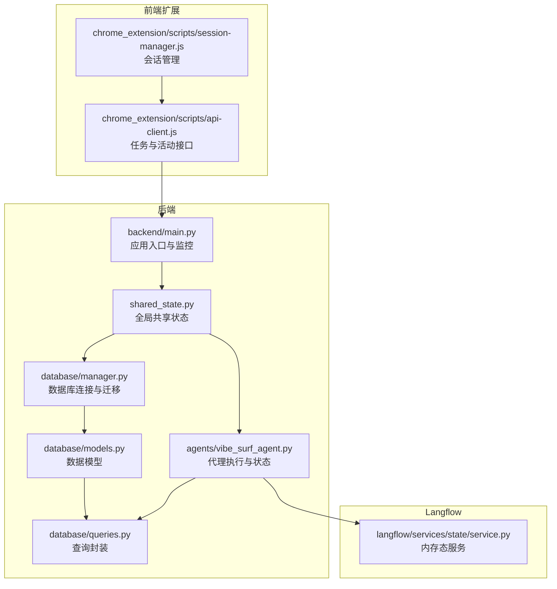
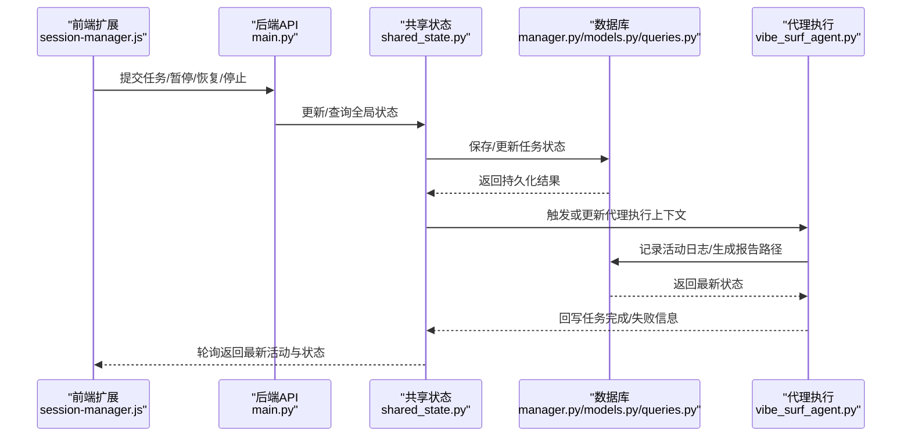
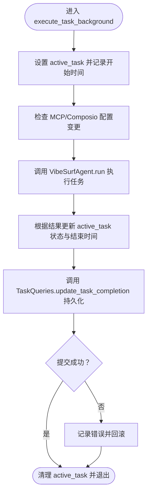
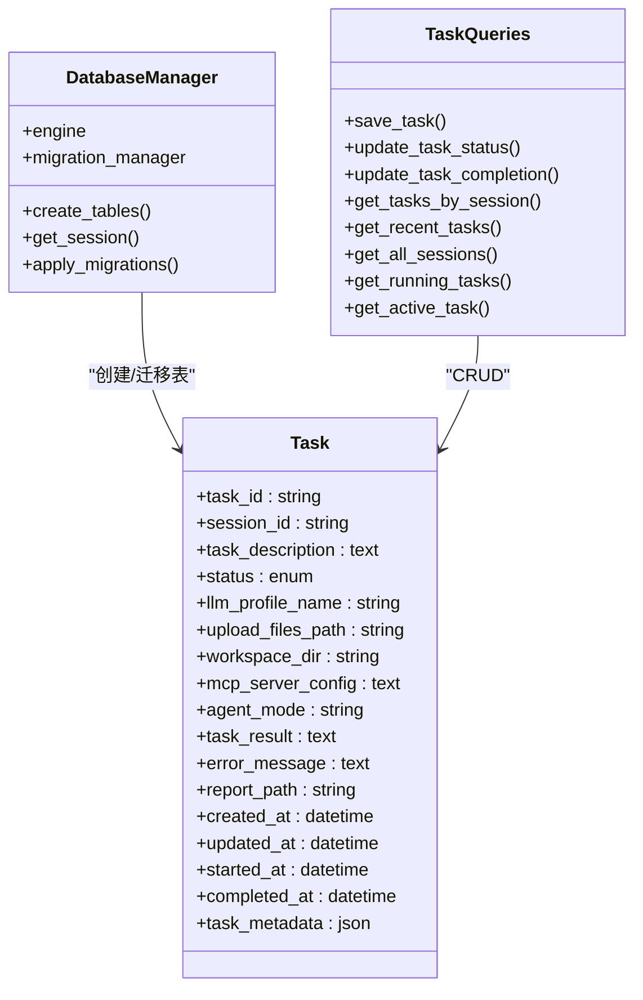
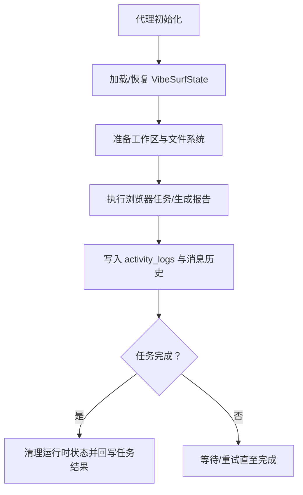
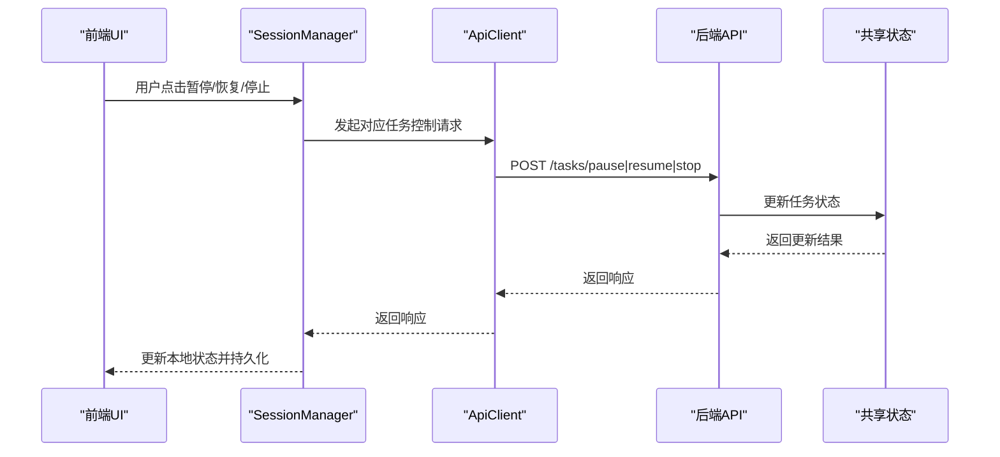
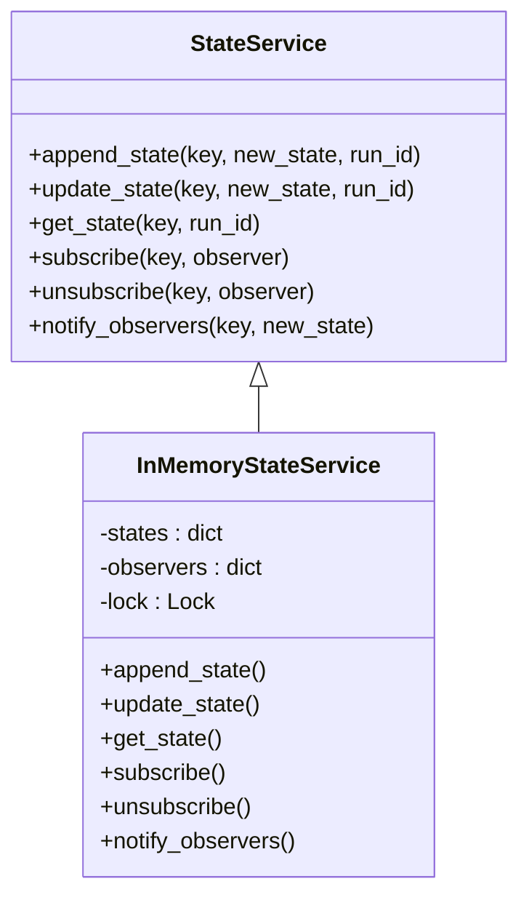
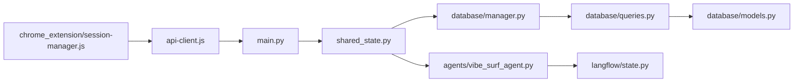

# 状态管理

<cite>
**本文引用的文件**
- [shared_state.py](file://vibe_surf/backend/shared_state.py)
- [models.py](file://vibe_surf/backend/database/models.py)
- [queries.py](file://vibe_surf/backend/database/queries.py)
- [manager.py](file://vibe_surf/backend/database/manager.py)
- [main.py](file://vibe_surf/backend/main.py)
- [vibe_surf_agent.py](file://vibe_surf/agents/vibe_surf_agent.py)
- [session-manager.js](file://vibe_surf/chrome_extension/scripts/session-manager.js)
- [api-client.js](file://vibe_surf/chrome_extension/scripts/api-client.js)
- [state.py](file://vibe_surf/langflow/services/state/service.py)
</cite>

## 目录
1. [简介](#简介)
2. [项目结构](#项目结构)
3. [核心组件](#核心组件)
4. [架构总览](#架构总览)
5. [详细组件分析](#详细组件分析)
6. [依赖关系分析](#依赖关系分析)
7. [性能考量](#性能考量)
8. [故障排查指南](#故障排查指南)
9. [结论](#结论)
10. [附录](#附录)

## 简介
本文件系统性阐述 VibeSurf 代理系统的状态管理架构，重点围绕以下目标展开：
- 解释 shared_state.py 如何实现全局状态共享与跨代理通信
- 描述代理状态数据模型的设计，包括任务状态、会话状态和执行上下文的持久化策略
- 分析状态管理组件与数据库的交互方式，以及如何保证状态一致性
- 说明状态变更的监听机制和事件通知模式
- 提供状态恢复、故障转移和并发访问控制的实现细节与最佳实践

## 项目结构
VibeSurf 的状态管理由后端共享状态模块、数据库模型与查询层、浏览器扩展前端会话管理器、以及 Langflow 内存态服务共同构成。整体以“单任务执行模型”为核心，通过全局共享状态协调组件生命周期与任务执行，同时通过数据库持久化任务与会话状态。

图表来源
- [shared_state.py](file://vibe_surf/backend/shared_state.py#L1-L120)
- [manager.py](file://vibe_surf/backend/database/manager.py#L148-L240)
- [models.py](file://vibe_surf/backend/database/models.py#L94-L137)
- [queries.py](file://vibe_surf/backend/database/queries.py#L441-L520)
- [main.py](file://vibe_surf/backend/main.py#L1-L120)
- [vibe_surf_agent.py](file://vibe_surf/agents/vibe_surf_agent.py#L94-L140)
- [session-manager.js](file://vibe_surf/chrome_extension/scripts/session-manager.js#L52-L120)
- [api-client.js](file://vibe_surf/chrome_extension/scripts/api-client.js#L236-L271)
- [state.py](file://vibe_surf/langflow/services/state/service.py#L1-L68)

章节来源
- [shared_state.py](file://vibe_surf/backend/shared_state.py#L1-L120)
- [manager.py](file://vibe_surf/backend/database/manager.py#L148-L240)
- [models.py](file://vibe_surf/backend/database/models.py#L94-L137)
- [queries.py](file://vibe_surf/backend/database/queries.py#L441-L520)
- [main.py](file://vibe_surf/backend/main.py#L1-L120)
- [vibe_surf_agent.py](file://vibe_surf/agents/vibe_surf_agent.py#L94-L140)
- [session-manager.js](file://vibe_surf/chrome_extension/scripts/session-manager.js#L52-L120)
- [api-client.js](file://vibe_surf/chrome_extension/scripts/api-client.js#L236-L271)
- [state.py](file://vibe_surf/langflow/services/state/service.py#L1-L68)

## 核心组件
- 全局共享状态：集中存放当前运行中的代理实例、浏览器管理器、工具集、LLM 实例、数据库管理器、工作区路径、环境变量、MCP 服务器配置、当前任务等。提供统一的组件获取与更新接口，避免循环导入并支持跨模块通信。
- 数据库层：基于 SQLAlchemy 异步 ORM 的模型与查询封装，提供任务、上传文件、MCP 配置、Composio 工具、凭据、计划任务等表的增删改查与聚合统计。
- 任务执行与状态：单任务执行模型下，通过全局 active_task 字典记录当前任务的运行状态、开始/结束时间、结果与错误信息，并在数据库中同步更新。
- 前端会话管理：浏览器扩展负责创建/加载会话、提交任务、暂停/恢复/停止任务、轮询活动日志并持久化本地状态。
- Langflow 内存态服务：提供轻量级内存态存储与观察者回调，便于流程图节点间的状态传递与事件通知。

章节来源
- [shared_state.py](file://vibe_surf/backend/shared_state.py#L37-L117)
- [models.py](file://vibe_surf/backend/database/models.py#L94-L137)
- [queries.py](file://vibe_surf/backend/database/queries.py#L441-L520)
- [session-manager.js](file://vibe_surf/chrome_extension/scripts/session-manager.js#L52-L120)
- [state.py](file://vibe_surf/langflow/services/state/service.py#L1-L68)

## 架构总览
后端通过共享状态模块协调各子系统；数据库层提供强一致性的任务与会话状态持久化；前端扩展负责用户交互与实时状态反馈；Langflow 内存态服务为流程图节点提供轻量态与观察者模式。

图表来源
- [session-manager.js](file://vibe_surf/chrome_extension/scripts/session-manager.js#L260-L377)
- [api-client.js](file://vibe_surf/chrome_extension/scripts/api-client.js#L236-L271)
- [main.py](file://vibe_surf/backend/main.py#L1-L120)
- [shared_state.py](file://vibe_surf/backend/shared_state.py#L118-L233)
- [manager.py](file://vibe_surf/backend/database/manager.py#L229-L240)
- [models.py](file://vibe_surf/backend/database/models.py#L94-L137)
- [queries.py](file://vibe_surf/backend/database/queries.py#L614-L648)
- [vibe_surf_agent.py](file://vibe_surf/agents/vibe_surf_agent.py#L1784-L1810)

## 详细组件分析

### 共享状态模块（shared_state.py）
- 全局组件与环境变量
  - 维护全局代理、浏览器管理器、工具集、LLM 实例、数据库管理器、工作区路径、浏览器执行路径与用户数据目录、MCP 服务器映射、当前 LLM 配置名、Composio 实例、调度管理器、环境变量字典等。
  - 提供 get_all_components 与 set_components 接口，用于集中获取与更新全局状态，避免循环导入。
- 单任务执行跟踪
  - active_task 字典记录当前任务的 task_id、session_id、状态、开始/结束时间、结果、错误、上传文件列表、MCP 服务器名称列表、工作区目录等。
  - execute_task_background 异步函数负责任务启动、状态更新、结果回写与数据库事务提交/回滚。
- MCP 与 Composio 动态配置
  - _check_and_update_mcp_servers 与 _check_and_update_composio_tools 在任务执行前检查数据库中的配置变化，动态更新工具集与客户端注册，确保工具链与配置保持一致。
- LLM 配置切换
  - _initialize_default_llm 优先从数据库默认 LLM 配置初始化，否则回退到环境变量；update_llm_from_profile 支持按配置名切换 LLM 实例并同步到代理的令牌计费服务。
- 环境变量持久化
  - update_envs 将更新后的 envs 同步写入工作区 envs.json 文件，保证重启后状态可恢复。
- 调度管理器
  - ScheduleManager 负责从数据库加载启用的计划任务，周期性检查并触发定时执行，更新执行次数与下次执行时间，支持最小执行间隔保护与时区处理。

图表来源
- [shared_state.py](file://vibe_surf/backend/shared_state.py#L118-L233)
- [queries.py](file://vibe_surf/backend/database/queries.py#L705-L735)

章节来源
- [shared_state.py](file://vibe_surf/backend/shared_state.py#L37-L117)
- [shared_state.py](file://vibe_surf/backend/shared_state.py#L118-L233)
- [shared_state.py](file://vibe_surf/backend/shared_state.py#L255-L351)
- [shared_state.py](file://vibe_surf/backend/shared_state.py#L388-L452)
- [shared_state.py](file://vibe_surf/backend/shared_state.py#L453-L602)
- [shared_state.py](file://vibe_surf/backend/shared_state.py#L604-L682)
- [shared_state.py](file://vibe_surf/backend/shared_state.py#L684-L712)
- [shared_state.py](file://vibe_surf/backend/shared_state.py#L740-L1111)

### 数据模型与持久化策略（models.py, queries.py, manager.py）
- 任务模型（Task）
  - 关键字段：task_id、session_id、task_description、status（枚举）、llm_profile_name、upload_files_path、workspace_dir、mcp_server_config、agent_mode、task_result、error_message、report_path、created_at/updated_at/started_at/completed_at、task_metadata。
  - 通过 TaskStatus 枚举保证状态值域一致性；索引覆盖常用查询维度（状态、会话、LLM 配置、创建时间）。
- 查询封装（TaskQueries）
  - save_task：支持新建与更新，自动处理 started_at/completed_at 时间戳与 mcp_server_config 序列化。
  - update_task_status/update_task_completion：原子更新任务状态与结果，确保一致性。
  - get_tasks_by_session/get_recent_tasks/get_all_sessions：会话聚合与分页查询。
  - get_running_tasks/get_active_task：单任务模型下的运行中任务检索。
- 数据库管理（DatabaseManager）
  - 异步引擎配置：SQLite 使用 StaticPool，支持迁移；其他数据库使用连接池参数优化生产环境。
  - 迁移管理：DBMigrationManager 通过 PRAGMA user_version 管理版本，按序应用 v001~v007 等迁移脚本。
  - 会话生命周期：get_session 自动提交/回滚/关闭，确保资源安全释放。

图表来源
- [models.py](file://vibe_surf/backend/database/models.py#L94-L137)
- [manager.py](file://vibe_surf/backend/database/manager.py#L148-L240)
- [queries.py](file://vibe_surf/backend/database/queries.py#L441-L520)
- [queries.py](file://vibe_surf/backend/database/queries.py#L614-L648)

章节来源
- [models.py](file://vibe_surf/backend/database/models.py#L94-L137)
- [queries.py](file://vibe_surf/backend/database/queries.py#L441-L520)
- [queries.py](file://vibe_surf/backend/database/queries.py#L614-L648)
- [manager.py](file://vibe_surf/backend/database/manager.py#L148-L240)

### 代理状态与执行上下文（vibe_surf_agent.py）
- 代理状态数据模型（VibeSurfState）
  - 包含原始任务、上传文件、会话 ID、工作区目录、当前步骤、是否完成、当前动作与参数、浏览器任务与结果、生成报告结果、最终响应、代理控制状态（暂停/停止/应暂停/应停止）等。
- 活动日志与持久化
  - 代理在执行过程中维护 activity_logs，并在任务结束时保存消息历史与活动日志到工作区；通过锁确保并发安全。
- 文件系统与工作区
  - 代理使用自定义文件系统，支持从状态恢复或重建，确保任务中断后可定位到正确的执行目录。

图表来源
- [vibe_surf_agent.py](file://vibe_surf/agents/vibe_surf_agent.py#L94-L140)
- [vibe_surf_agent.py](file://vibe_surf/agents/vibe_surf_agent.py#L1784-L1810)

章节来源
- [vibe_surf_agent.py](file://vibe_surf/agents/vibe_surf_agent.py#L94-L140)
- [vibe_surf_agent.py](file://vibe_surf/agents/vibe_surf_agent.py#L1784-L1810)

### 前端会话与任务控制（session-manager.js, api-client.js）
- 会话管理
  - 创建/加载会话、维护当前任务状态、任务历史、活动日志；支持暂停/恢复/停止任务。
- 任务控制
  - 通过 API 客户端发起暂停/恢复/停止请求，前端在收到响应后更新本地状态并持久化。
- 活动轮询
  - 定期轮询最新活动，同步服务端状态，确保 UI 与后端一致。

图表来源
- [session-manager.js](file://vibe_surf/chrome_extension/scripts/session-manager.js#L326-L399)
- [api-client.js](file://vibe_surf/chrome_extension/scripts/api-client.js#L236-L271)
- [main.py](file://vibe_surf/backend/main.py#L1-L120)
- [shared_state.py](file://vibe_surf/backend/shared_state.py#L118-L233)

章节来源
- [session-manager.js](file://vibe_surf/chrome_extension/scripts/session-manager.js#L52-L120)
- [session-manager.js](file://vibe_surf/chrome_extension/scripts/session-manager.js#L260-L377)
- [api-client.js](file://vibe_surf/chrome_extension/scripts/api-client.js#L236-L271)

### Langflow 内存态服务（state.py）
- InMemoryStateService
  - 提供 append_state/update_state/get_state 方法，内部使用线程锁保证并发安全。
  - 支持 subscribe/unsubscribe 与 notify_observers，实现观察者模式，便于流程图节点间状态联动。

图表来源
- [state.py](file://vibe_surf/langflow/services/state/service.py#L1-L68)

章节来源
- [state.py](file://vibe_surf/langflow/services/state/service.py#L1-L68)

## 依赖关系分析
- 组件耦合
  - shared_state.py 作为中枢，被 main.py、agents、前端扩展广泛依赖；通过 get_all_components/set_components 降低直接导入耦合。
  - 数据库层通过 manager.py 与 queries.py 解耦具体模型与查询逻辑，便于扩展与测试。
- 外部依赖
  - 数据库：SQLite/异步 SQLAlchemy；生产环境可切换为 PostgreSQL/MySQL。
  - 第三方集成：Composio、MCP、浏览器自动化、OpenTelemetry/Sentry 等。
- 循环依赖规避
  - 通过延迟导入与集中状态管理，避免模块间相互引用导致的循环导入问题。

图表来源
- [main.py](file://vibe_surf/backend/main.py#L1-L120)
- [shared_state.py](file://vibe_surf/backend/shared_state.py#L1-L120)
- [manager.py](file://vibe_surf/backend/database/manager.py#L148-L240)
- [queries.py](file://vibe_surf/backend/database/queries.py#L441-L520)
- [models.py](file://vibe_surf/backend/database/models.py#L94-L137)
- [vibe_surf_agent.py](file://vibe_surf/agents/vibe_surf_agent.py#L94-L140)
- [session-manager.js](file://vibe_surf/chrome_extension/scripts/session-manager.js#L52-L120)
- [api-client.js](file://vibe_surf/chrome_extension/scripts/api-client.js#L236-L271)
- [state.py](file://vibe_surf/langflow/services/state/service.py#L1-L68)

章节来源
- [main.py](file://vibe_surf/backend/main.py#L1-L120)
- [shared_state.py](file://vibe_surf/backend/shared_state.py#L1-L120)
- [manager.py](file://vibe_surf/backend/database/manager.py#L148-L240)
- [queries.py](file://vibe_surf/backend/database/queries.py#L441-L520)
- [models.py](file://vibe_surf/backend/database/models.py#L94-L137)
- [vibe_surf_agent.py](file://vibe_surf/agents/vibe_surf_agent.py#L94-L140)
- [session-manager.js](file://vibe_surf/chrome_extension/scripts/session-manager.js#L52-L120)
- [api-client.js](file://vibe_surf/chrome_extension/scripts/api-client.js#L236-L271)
- [state.py](file://vibe_surf/langflow/services/state/service.py#L1-L68)

## 性能考量
- 数据库连接与池化
  - SQLite 使用 StaticPool，开发友好；生产建议使用连接池（pool_size/max_overflow/pre_ping/recycle）提升并发能力。
- 查询优化
  - 为 Task/LLMProfile/McpProfile/VoiceProfile/ComposioToolkit/Credentials/Schedules 等表建立索引，加速状态查询与聚合。
- 事务与一致性
  - 任务状态更新采用原子更新与显式 commit/rollback，避免脏读与丢失更新。
- 轮询与最小间隔
  - 前端轮询与调度器检查均设置最小间隔，减少频繁 IO 与网络请求。
- 缓存与内存态
  - Langflow 内存态服务适合轻量状态传递；大体量状态建议结合数据库或外部缓存。

[本节为通用指导，无需特定文件引用]

## 故障排查指南
- 任务状态不一致
  - 检查 execute_task_background 是否正确更新 active_task 并在数据库中持久化；确认 TaskQueries.update_task_status/update_task_completion 的调用与事务提交。
- 数据库迁移失败
  - 查看 DBMigrationManager.apply_migrations 日志，确认迁移脚本顺序与语法；必要时回滚至上一版本或手动修复。
- 浏览器连接异常
  - main.py 中的浏览器监控任务会在断连时触发优雅关闭，检查日志并确认浏览器扩展与后端端口配置。
- MCP/Composio 配置未生效
  - 确认 _check_and_update_mcp_servers/_check_and_update_composio_tools 是否被调用；核对数据库中配置项与共享状态映射。
- 前端状态不同步
  - 检查 session-manager.js 的轮询频率与订阅回调；确认 api-client.js 请求路径与后端路由一致。

章节来源
- [shared_state.py](file://vibe_surf/backend/shared_state.py#L118-L233)
- [queries.py](file://vibe_surf/backend/database/queries.py#L614-L648)
- [manager.py](file://vibe_surf/backend/database/manager.py#L100-L146)
- [main.py](file://vibe_surf/backend/main.py#L103-L148)
- [session-manager.js](file://vibe_surf/chrome_extension/scripts/session-manager.js#L428-L451)
- [api-client.js](file://vibe_surf/chrome_extension/scripts/api-client.js#L236-L271)

## 结论
VibeSurf 的状态管理以“单任务执行模型”为核心，通过共享状态模块集中协调代理、浏览器、工具与数据库，结合数据库模型与查询封装实现强一致的任务与会话状态持久化；前端扩展负责用户交互与实时状态反馈；Langflow 内存态服务提供轻量态与观察者模式。整体设计在保证一致性的同时兼顾了可观测性与可扩展性。

[本节为总结，无需特定文件引用]

## 附录
- 最佳实践
  - 使用 get_all_components/set_components 统一访问与更新全局状态，避免直接导入引发循环依赖。
  - 任务状态更新遵循“先更新共享状态，再持久化数据库”的顺序，确保 UI 与后端一致。
  - 对于高并发场景，合理设置数据库连接池参数与查询索引，避免热点表阻塞。
  - 使用最小执行间隔与指数退避策略，降低调度与轮询压力。
  - 对敏感配置（如 API Key）采用加密存储与解密使用，避免明文泄露。

[本节为通用建议，无需特定文件引用]