# 组件间通信

<cite>
**本文档引用的文件**   
- [main.py](file://vibe_surf/backend/main.py)
- [vibe_surf_agent.py](file://vibe_surf/agents/vibe_surf_agent.py)
- [browser_manager.py](file://vibe_surf/browser/browser_manager.py)
- [service.py](file://vibe_surf/telemetry/service.py)
- [shared_state.py](file://vibe_surf/backend/shared_state.py)
- [task.py](file://vibe_surf/backend/api/task.py)
- [vibesurf_tools.py](file://vibe_surf/tools/vibesurf_tools.py)
- [agent_browser_session.py](file://vibe_surf/browser/agent_browser_session.py)
</cite>

## 目录
1. [引言](#引言)
2. [代理与后端服务的REST API通信](#代理与后端服务的rest-api通信)
3. [代理与浏览器管理组件的交互](#代理与浏览器管理组件的交互)
4. [代理与LLM服务的集成](#代理与llm服务的集成)
5. [遥测服务在通信中的作用](#遥测服务在通信中的作用)
6. [代理与浏览器会话的消息传递协议](#代理与浏览器会话的消息传递协议)
7. [通信错误处理与性能监控](#通信错误处理与性能监控)

## 引言
VibeSurf代理系统是一个复杂的自动化框架，它通过多种机制与其他核心组件进行通信。本系统通过REST API与后端服务交互，调用浏览器管理组件执行自动化操作，并集成LLM服务进行智能决策。同时，系统通过遥测服务监控和记录所有通信活动，确保系统的稳定性和可追溯性。代理与浏览器会话之间通过消息传递协议进行数据交换，实现精确的浏览器控制。

## 代理与后端服务的REST API通信

VibeSurf代理系统通过REST API与后端服务进行通信，实现任务提交、状态监控和控制指令的传递。后端服务基于FastAPI框架构建，提供了标准化的API接口。

### REST API架构
后端API采用模块化设计，通过不同的路由器处理各种请求。`main.py`文件中的`create_app`函数初始化FastAPI应用，并注册多个API路由器，包括任务、文件、活动、配置、浏览器、语音、代理、Composio、调度和VibeSurf等。

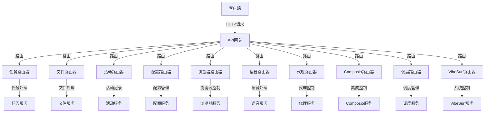

**Diagram sources**
- [main.py](file://vibe_surf/backend/main.py#L38-L47)

**Section sources**
- [main.py](file://vibe_surf/backend/main.py#L38-L47)
- [task.py](file://vibe_surf/backend/api/task.py#L31)

### 任务提交与执行
代理通过`/api/tasks/submit`端点提交新任务。后端服务验证请求后，将任务添加到后台任务队列中异步执行。任务提交请求包含任务描述、LLM配置文件、上传文件路径等信息。

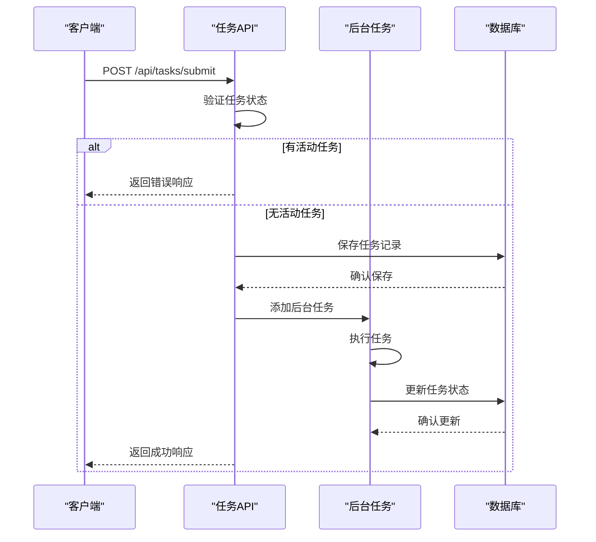

**Diagram sources**
- [task.py](file://vibe_surf/backend/api/task.py#L43-L146)

**Section sources**
- [task.py](file://vibe_surf/backend/api/task.py#L43-L146)
- [shared_state.py](file://vibe_surf/backend/shared_state.py#L118-L233)

### 任务控制与状态监控
系统提供了完整的任务控制功能，包括暂停、恢复、停止和添加新任务。客户端可以通过相应的API端点发送控制指令，代理会根据指令调整任务执行状态。

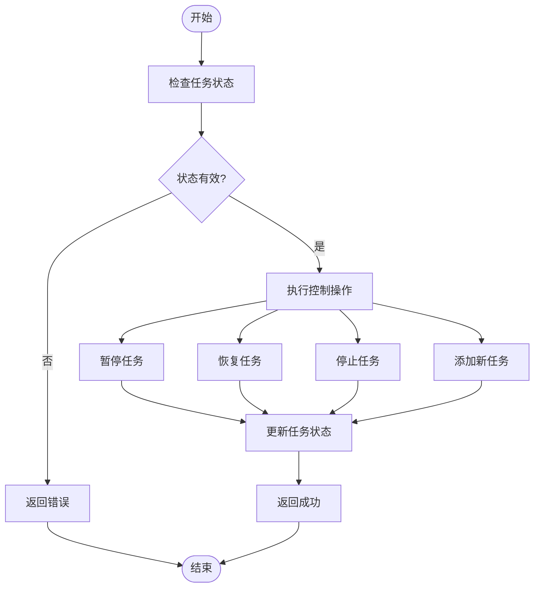

**Diagram sources**
- [task.py](file://vibe_surf/backend/api/task.py#L197-L334)

**Section sources**
- [task.py](file://vibe_surf/backend/api/task.py#L197-L334)
- [vibe_surf_agent.py](file://vibe_surf/agents/vibe_surf_agent.py#L344-L546)

## 代理与浏览器管理组件的交互

VibeSurf代理通过浏览器管理组件与浏览器实例进行交互，实现网页浏览、元素操作和数据提取等自动化功能。

### 浏览器管理架构
浏览器管理组件采用分层架构，`BrowserManager`类负责管理多个`AgentBrowserSession`实例，每个实例对应一个代理的浏览器会话。

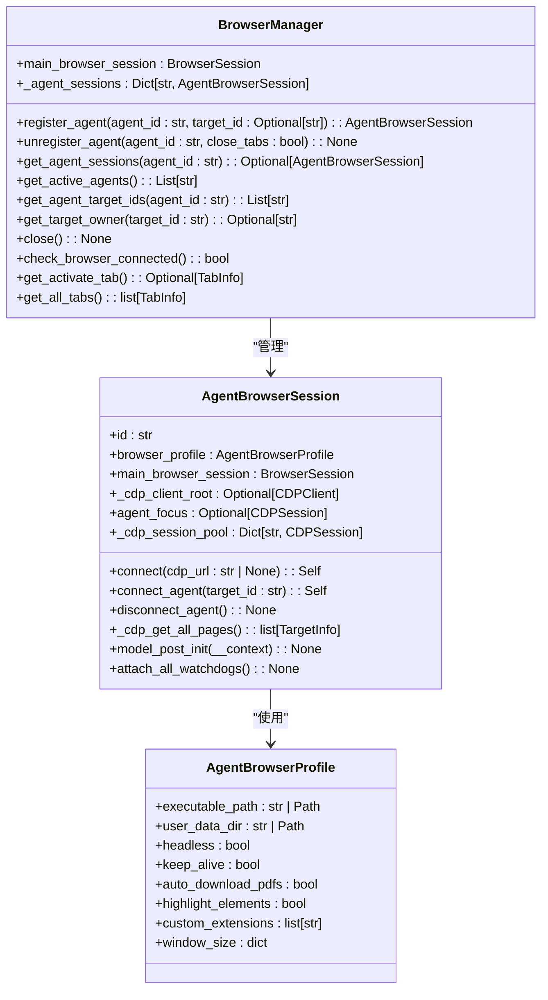

**Diagram sources**
- [browser_manager.py](file://vibe_surf/browser/browser_manager.py#L24-L269)
- [agent_browser_session.py](file://vibe_surf/browser/agent_browser_session.py#L51-L800)

**Section sources**
- [browser_manager.py](file://vibe_surf/browser/browser_manager.py#L24-L269)
- [agent_browser_session.py](file://vibe_surf/browser/agent_browser_session.py#L51-L800)

### 代理会话注册与管理
当代理需要执行浏览器操作时，会通过`BrowserManager`注册一个会话。系统为每个代理创建独立的`AgentBrowserSession`，确保操作的隔离性和安全性。

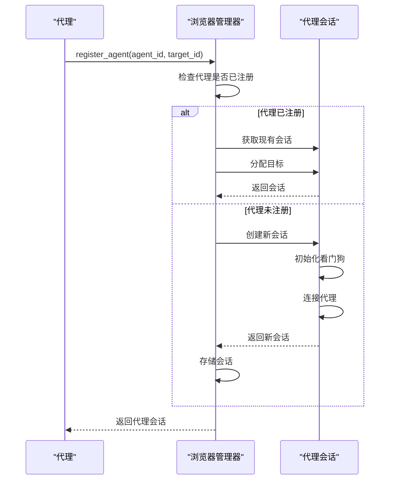

**Diagram sources**
- [browser_manager.py](file://vibe_surf/browser/browser_manager.py#L47-L72)

**Section sources**
- [browser_manager.py](file://vibe_surf/browser/browser_manager.py#L47-L72)
- [agent_browser_session.py](file://vibe_surf/browser/agent_browser_session.py#L696-L711)

## 代理与LLM服务的集成

VibeSurf代理系统深度集成了LLM服务，用于智能决策、任务规划和自然语言处理。

### LLM服务架构
系统通过`VibeSurfAgent`类集成LLM服务，该类封装了与LLM的交互逻辑，包括消息历史管理、提示工程和响应解析。

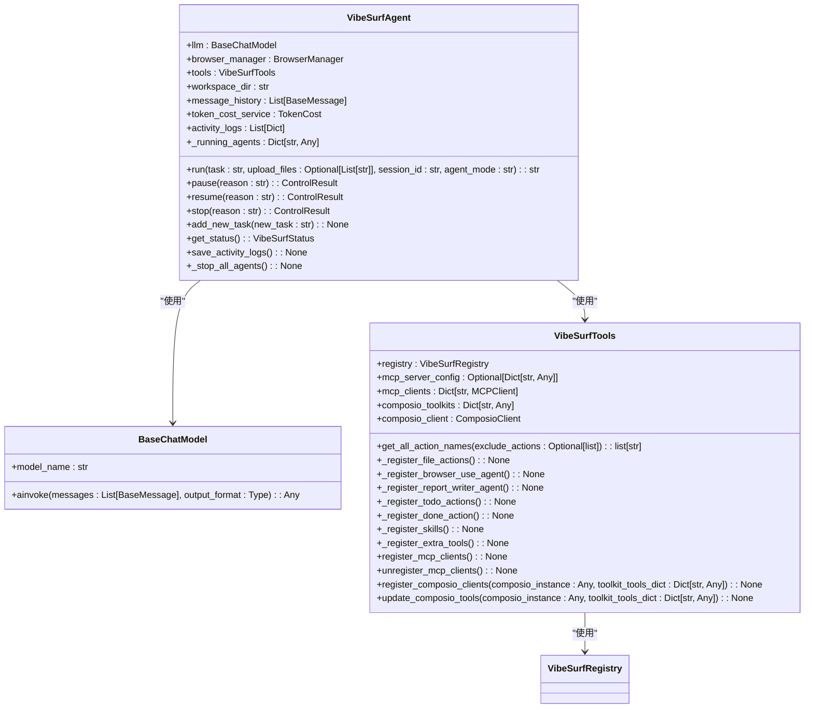

**Diagram sources**
- [vibe_surf_agent.py](file://vibe_surf/agents/vibe_surf_agent.py#L23-L54)
- [vibesurf_tools.py](file://vibe_surf/tools/vibesurf_tools.py#L72-L87)

**Section sources**
- [vibe_surf_agent.py](file://vibe_surf/agents/vibe_surf_agent.py#L23-L54)
- [vibesurf_tools.py](file://vibe_surf/tools/vibesurf_tools.py#L72-L87)

### 智能决策流程
代理使用LLM服务进行智能决策，通过思维链模式分析当前状态，选择合适的操作，并执行任务。

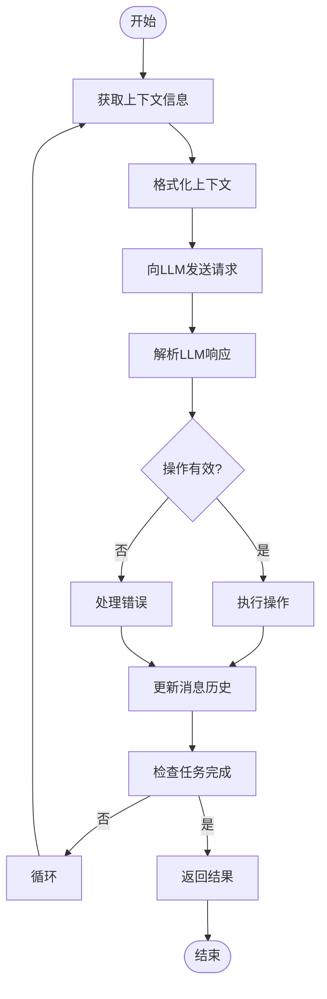

**Diagram sources**
- [vibe_surf_agent.py](file://vibe_surf/agents/vibe_surf_agent.py#L344-L546)

**Section sources**
- [vibe_surf_agent.py](file://vibe_surf/agents/vibe_surf_agent.py#L344-L546)
- [vibesurf_tools.py](file://vibe_surf/tools/vibesurf_tools.py#L100-L800)

## 遥测服务在通信中的作用

遥测服务在VibeSurf系统中扮演着关键角色，负责监控、记录和分析系统通信活动。

### 遥测服务架构
系统使用PostHog作为遥测后端，通过`ProductTelemetry`类封装遥测功能，实现匿名化数据收集和分析。

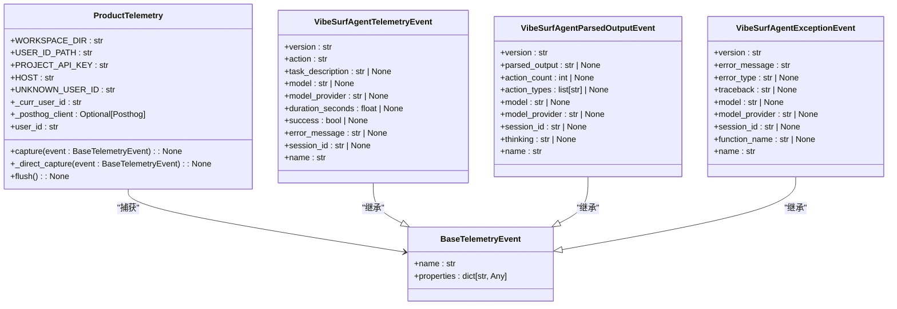

**Diagram sources**
- [service.py](file://vibe_surf/telemetry/service.py#L24-L114)
- [views.py](file://vibe_surf/telemetry/views.py#L9-L189)

**Section sources**
- [service.py](file://vibe_surf/telemetry/service.py#L24-L114)
- [views.py](file://vibe_surf/telemetry/views.py#L9-L189)

### 通信监控与日志记录
遥测服务在代理通信的关键节点捕获事件，包括任务启动、步骤执行和异常情况，为系统优化和故障排查提供数据支持。

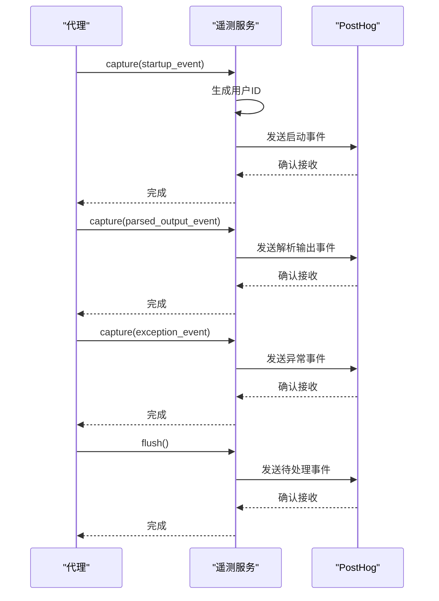

**Diagram sources**
- [service.py](file://vibe_surf/telemetry/service.py#L62-L92)
- [vibe_surf_agent.py](file://vibe_surf/agents/vibe_surf_agent.py#L409-L425)

**Section sources**
- [service.py](file://vibe_surf/telemetry/service.py#L62-L92)
- [vibe_surf_agent.py](file://vibe_surf/agents/vibe_surf_agent.py#L409-L425)

## 代理与浏览器会话的消息传递协议

VibeSurf代理与浏览器会话之间通过Chrome DevTools Protocol (CDP)进行消息传递，实现精确的浏览器控制。

### 消息传递架构
系统使用`cdp-use`库封装CDP通信，通过WebSocket连接与浏览器实例交互，发送命令并接收响应。

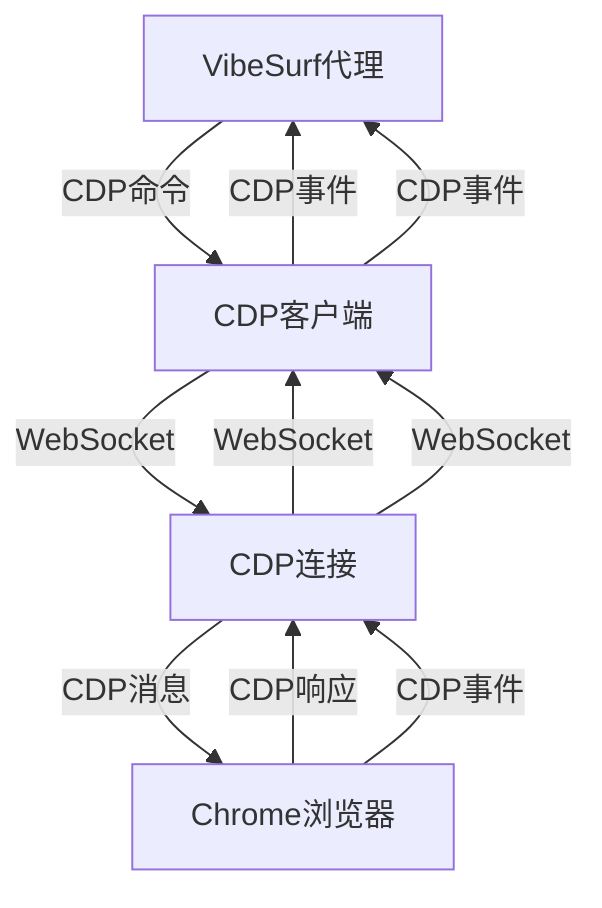

**Diagram sources**
- [agent_browser_session.py](file://vibe_surf/browser/agent_browser_session.py#L171-L694)

**Section sources**
- [agent_browser_session.py](file://vibe_surf/browser/agent_browser_session.py#L171-L694)
- [browser_manager.py](file://vibe_surf/browser/browser_manager.py#L38-L45)

### 数据交换格式
代理与浏览器会话之间交换的数据采用JSON格式，包括命令、参数、响应和事件。

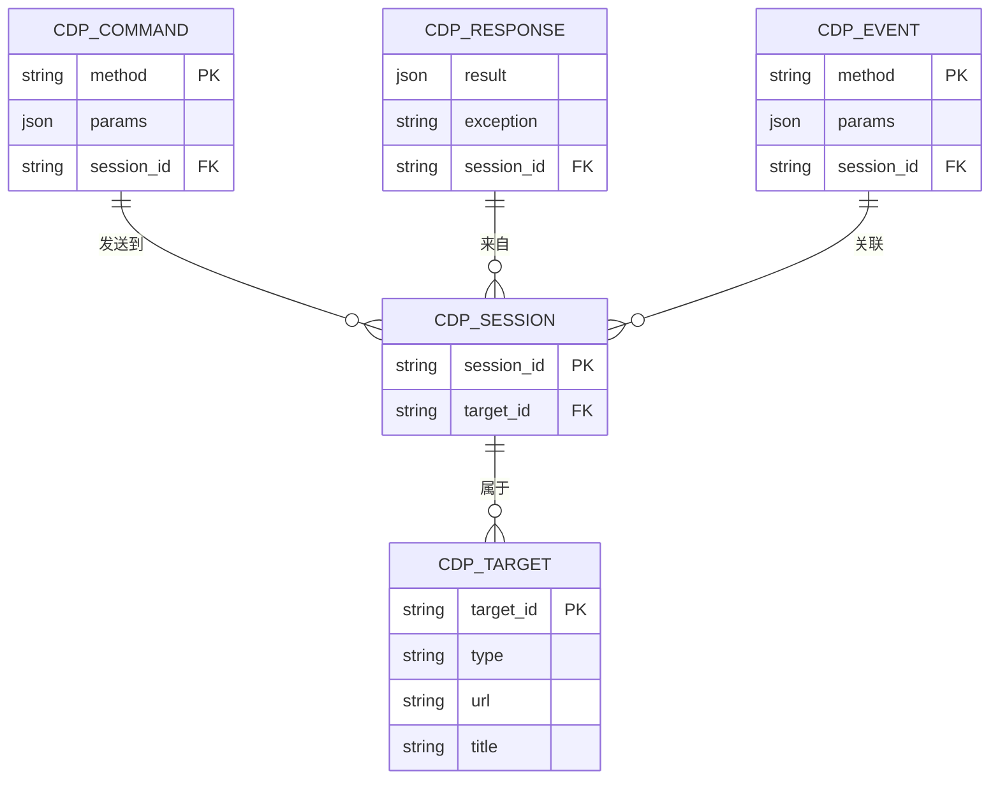

**Diagram sources**
- [agent_browser_session.py](file://vibe_surf/browser/agent_browser_session.py#L204-L211)
- [browser_manager.py](file://vibe_surf/browser/browser_manager.py#L196-L198)

**Section sources**
- [agent_browser_session.py](file://vibe_surf/browser/agent_browser_session.py#L204-L211)
- [browser_manager.py](file://vibe_surf/browser/browser_manager.py#L196-L198)

## 通信错误处理与性能监控

VibeSurf系统实现了全面的通信错误处理和性能监控机制，确保系统的稳定性和可靠性。

### 错误处理机制
系统采用分层错误处理策略，包括异常捕获、重试机制和优雅降级。

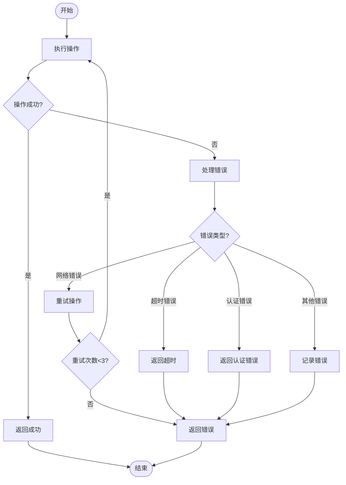

**Diagram sources**
- [vibe_surf_agent.py](file://vibe_surf/agents/vibe_surf_agent.py#L522-L546)
- [vibesurf_tools.py](file://vibe_surf/tools/vibesurf_tools.py#L215-L225)

**Section sources**
- [vibe_surf_agent.py](file://vibe_surf/agents/vibe_surf_agent.py#L522-L546)
- [vibesurf_tools.py](file://vibe_surf/tools/vibesurf_tools.py#L215-L225)

### 超时控制
系统实现了多层次的超时控制，包括LLM调用超时和步骤执行超时。

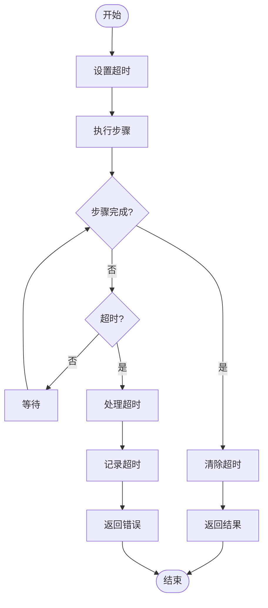

**Diagram sources**
- [vibe_surf_agent.py](file://vibe_surf/agents/vibe_surf_agent.py#L402-L403)
- [views.py](file://vibe_surf/agents/views.py#L71-L72)

**Section sources**
- [vibe_surf_agent.py](file://vibe_surf/agents/vibe_surf_agent.py#L402-L403)
- [views.py](file://vibe_surf/agents/views.py#L71-L72)

### 性能监控
系统通过遥测服务和日志记录监控通信性能，包括响应时间、令牌使用和资源消耗。

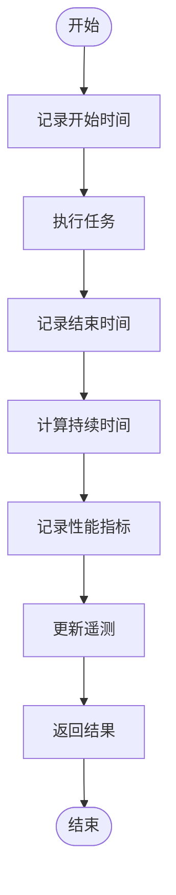

**Diagram sources**
- [service.py](file://vibe_surf/telemetry/service.py#L76-L80)
- [vibe_surf_agent.py](file://vibe_surf/agents/vibe_surf_agent.py#L410-L425)

**Section sources**
- [service.py](file://vibe_surf/telemetry/service.py#L76-L80)
- [vibe_surf_agent.py](file://vibe_surf/agents/vibe_surf_agent.py#L410-L425)