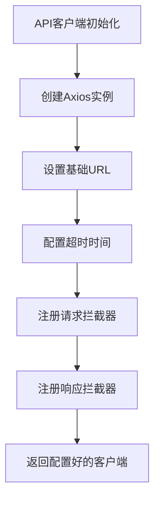
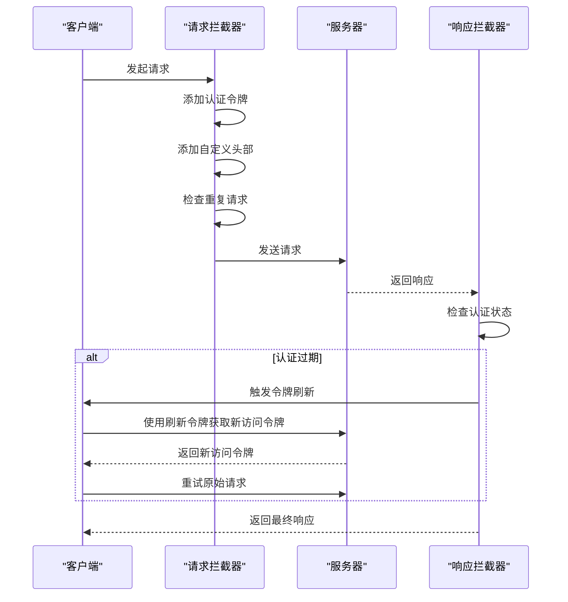
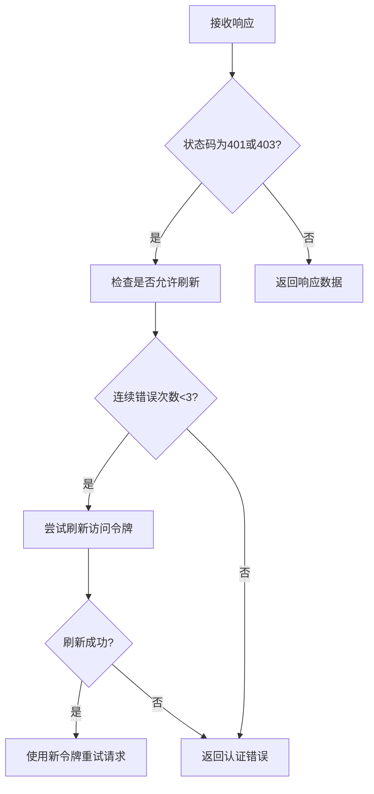
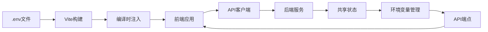

# API客户端配置

<cite>
**本文档中引用的文件**   
- [api.tsx](file://vibe_surf/frontend/src/controllers/API/api.tsx)
- [request-processor.ts](file://vibe_surf/frontend/src/controllers/API/services/request-processor.ts)
- [config-constants.ts](file://vibe_surf/frontend/src/customization/config-constants.ts)
- [constants.ts](file://vibe_surf/frontend/src/constants/constants.ts)
- [api-client.js](file://vibe_surf/chrome_extension/scripts/api-client.js)
- [use-custom-api-headers.ts](file://vibe_surf/frontend/src/customization/hooks/use-custom-api-headers.ts)
- [custom-get-access-token.ts](file://vibe_surf/frontend/src/customization/utils/custom-get-access-token.ts)
- [check-duplicate-requests.ts](file://vibe_surf/frontend/src/controllers/API/helpers/check-duplicate-requests.ts)
- [vite.config.mts](file://vibe_surf/frontend/vite.config.mts)
- [backend/api/config.py](file://vibe_surf/backend/api/config.py)
</cite>

## 目录
1. [简介](#简介)
2. [API客户端初始化](#api客户端初始化)
3. [请求处理器](#请求处理器)
4. [环境变量配置](#环境变量配置)
5. [安全考虑](#安全考虑)
6. [最佳实践](#最佳实践)

## 简介
VibeSurf前端API客户端配置基于Axios库构建，为前端应用与后端服务之间的通信提供了完整的解决方案。该配置系统涵盖了API客户端初始化、请求/响应拦截器、认证令牌管理、错误处理和请求去重等关键功能。通过环境变量和配置文件，系统能够灵活适应开发、测试和生产等不同环境的需求。本文档详细说明了API客户端的配置过程、核心组件的工作原理以及相关的安全考虑和最佳实践。

**Section sources**
- [api.tsx](file://vibe_surf/frontend/src/controllers/API/api.tsx#L21-L24)
- [config-constants.ts](file://vibe_surf/frontend/src/customization/config-constants.ts#L1-L20)

## API客户端初始化
VibeSurf前端API客户端使用Axios库进行初始化，创建了一个全局的Axios实例来处理所有HTTP请求。客户端的初始化过程包括基础URL设置、超时配置以及请求/响应拦截器的注册。

API客户端的基础URL通过`baseURL`常量从`/src/customization/constants.ts`文件中获取，该值在`config-constants.ts`中定义，默认为空字符串，允许通过环境变量进行覆盖。这种设计使得API客户端能够灵活地适应不同的部署环境。

**Diagram sources**
- [api.tsx](file://vibe_surf/frontend/src/controllers/API/api.tsx#L21-L24)
- [config-constants.ts](file://vibe_surf/frontend/src/customization/config-constants.ts#L1-L20)

### 基础URL和超时设置
API客户端的基础URL和超时设置是通过Axios的`create`方法进行配置的。基础URL决定了所有API请求的根路径，而超时设置则控制了请求的最大等待时间，防止请求无限期挂起。

在VibeSurf中，基础URL的配置采用了分层设计：首先从`config-constants.ts`文件中获取默认值，然后可以通过环境变量进行覆盖。这种设计使得开发人员能够在不同环境中使用不同的API端点，例如在开发环境中使用本地服务器，在生产环境中使用云服务。

超时时间的配置同样灵活，可以在运行时通过API配置接口动态调整。`useGetConfig`钩子函数在应用启动时获取后端返回的配置信息，其中包括`frontend_timeout`参数，该参数以秒为单位定义了前端请求的超时时间。获取到配置后，系统会使用`axios.defaults.timeout`更新Axios实例的默认超时设置。

**Section sources**
- [api.tsx](file://vibe_surf/frontend/src/controllers/API/api.tsx#L21-L24)
- [use-get-config.ts](file://vibe_surf/frontend/src/controllers/API/queries/config/use-get-config.ts#L49-L80)
- [config-constants.ts](file://vibe_surf/frontend/src/customization/config-constants.ts#L1-L20)

### 请求/响应拦截器
VibeSurf API客户端配置了请求和响应拦截器，用于在请求发送前和响应接收后执行特定的逻辑处理。这些拦截器是实现认证、错误处理和请求优化的核心机制。

请求拦截器的主要功能包括：
- 从Cookie中获取访问令牌并将其添加到请求头中
- 为当前域的请求添加自定义头部
- 检查并阻止重复请求
- 为请求添加中止信号以支持请求取消

响应拦截器则负责：
- 清除健康检查超时
- 处理认证错误并尝试刷新访问令牌
- 清理构建状态
- 统一错误处理

**Diagram sources**
- [api.tsx](file://vibe_surf/frontend/src/controllers/API/api.tsx#L152-L187)
- [api.tsx](file://vibe_surf/frontend/src/controllers/API/api.tsx#L66-L105)

**Section sources**
- [api.tsx](file://vibe_surf/frontend/src/controllers/API/api.tsx#L152-L187)
- [api.tsx](file://vibe_surf/frontend/src/controllers/API/api.tsx#L66-L105)

## 请求处理器
请求处理器是VibeSurf前端架构中的核心组件，负责统一处理API请求的各个方面，包括认证令牌注入、错误标准化和请求去重。该处理器基于React Query库构建，提供了声明式的数据获取和状态管理功能。

### 认证令牌注入
认证令牌注入是通过`customGetAccessToken`函数和请求拦截器协同完成的。系统首先从Cookie中获取访问令牌，然后在请求发送前将其添加到Authorization头部。

`customGetAccessToken`函数位于`/src/customization/utils/custom-get-access-token.ts`，它使用`react-cookie`库从浏览器Cookie中读取名为`LANGFLOW_ACCESS_TOKEN`的访问令牌。这个函数被设计为可定制的，允许在不同的部署环境中使用不同的令牌获取策略。

在请求拦截器中，系统检查当前请求的URL是否需要认证（通过`isAuthorizedURL`函数判断），如果需要且存在有效的访问令牌，则将Bearer令牌添加到请求头部。这种设计确保了只有需要认证的API端点才会携带认证信息，提高了安全性和效率。

**Section sources**
- [custom-get-access-token.ts](file://vibe_surf/frontend/src/customization/utils/custom-get-access-token.ts#L1-L8)
- [api.tsx](file://vibe_surf/frontend/src/controllers/API/api.tsx#L163-L167)

### 错误标准化
VibeSurf的API客户端实现了全面的错误处理机制，将不同类型的错误统一为标准化的格式，便于前端应用进行一致的错误处理和用户提示。

错误处理主要在响应拦截器中实现，系统会检查响应状态码，识别认证错误（401和403状态码），并根据情况决定是否尝试刷新访问令牌。对于非认证错误，系统直接将错误抛出，由调用方处理。

在令牌刷新机制中，系统实现了防无限循环保护，通过`authenticationErrorCount`状态变量限制连续的认证错误次数。当检测到认证错误时，系统会调用`tryToRenewAccessToken`函数尝试使用刷新令牌获取新的访问令牌。如果刷新成功，系统会使用新的访问令牌重试原始请求；如果刷新失败，则将错误传递给调用方。

**Diagram sources**
- [api.tsx](file://vibe_surf/frontend/src/controllers/API/api.tsx#L71-L105)

**Section sources**
- [api.tsx](file://vibe_surf/frontend/src/controllers/API/api.tsx#L71-L105)
- [use-post-refresh-access.ts](file://vibe_surf/frontend/src/controllers/API/queries/auth/use-post-refresh-access.ts#L1-L38)

### 请求去重
为了优化性能并防止用户因快速连续点击而产生重复请求，VibeSurf实现了请求去重机制。该机制通过`checkDuplicateRequestAndStoreRequest`函数实现，该函数位于`/src/controllers/API/helpers/check-duplicate-requests.ts`。

请求去重机制的工作原理如下：
1. 系统使用`localStorage`存储最近一次请求的相关信息，包括URL、方法、时间和当前页面路径
2. 在发送新请求前，系统检查新请求是否与最近的请求相同
3. 如果请求相同且时间间隔小于300毫秒，则抛出错误阻止请求发送
4. 对于特定的API端点（如登录、健康检查等），系统允许重复请求

系统通过`AUTHORIZED_DUPLICATE_REQUESTS`常量定义了允许重复请求的API端点列表，这些端点通常不需要去重保护。这种设计平衡了用户体验和系统性能，既防止了不必要的重复请求，又确保了关键功能的正常工作。

**Section sources**
- [check-duplicate-requests.ts](file://vibe_surf/frontend/src/controllers/API/helpers/check-duplicate-requests.ts#L1-L31)
- [constants.ts](file://vibe_surf/frontend/src/constants/constants.ts#L783-L790)

## 环境变量配置
VibeSurf通过环境变量和配置文件实现了灵活的环境管理，允许在不同部署环境中使用不同的API端点和配置参数。这种设计支持开发、测试和生产环境的无缝切换。

### 环境变量管理
环境变量管理主要通过前端的`vite.config.mts`文件和后端的API端点实现。在前端构建过程中，Vite会加载`.env`文件中的环境变量，并将其注入到应用中。

`vite.config.mts`文件中的`define`配置将环境变量转换为编译时常量，这些常量在构建时被替换为实际值。例如，`process.env.BACKEND_URL`会被替换为实际的后端URL，这样应用在运行时就不需要再读取环境变量，提高了性能。

后端提供了`/environments`API端点，允许前端获取和更新环境变量。`GET /environments`返回当前的环境变量，而`PUT /environments`允许更新环境变量。这些环境变量存储在共享状态中，影响着应用的运行时行为。

**Diagram sources**
- [vite.config.mts](file://vibe_surf/frontend/vite.config.mts#L45-L58)
- [backend/api/config.py](file://vibe_surf/backend/api/config.py#L691-L730)

**Section sources**
- [vite.config.mts](file://vibe_surf/frontend/vite.config.mts#L45-L58)
- [backend/api/config.py](file://vibe_surf/backend/api/config.py#L691-L730)

### 开发、测试和生产环境配置
VibeSurf通过分层配置系统支持多环境部署。配置优先级从高到低依次为：环境变量、配置文件、默认值。

在开发环境中，系统默认使用`http://localhost:9335`作为后端URL，这是通过`config-constants.ts`文件中的`PROXY_TARGET`常量定义的。开发人员可以通过设置`VITE_PROXY_TARGET`环境变量来覆盖此值。

在生产环境中，后端URL通常通过部署时的环境变量指定。Vite的`loadEnv`函数会自动加载`.env`、`.env.local`等文件中的环境变量，并根据当前模式（development、production等）选择合适的配置。

Chrome扩展中的`VibeSurfAPIClient`类也实现了类似的环境配置机制，它首先检查`window.VIBESURF_CONFIG`对象，然后使用默认值。这种设计使得扩展可以在不同环境中灵活配置后端服务。

**Section sources**
- [config-constants.ts](file://vibe_surf/frontend/src/customization/config-constants.ts#L1-L20)
- [vite.config.mts](file://vibe_surf/frontend/vite.config.mts#L25-L27)
- [api-client.js](file://vibe_surf/chrome_extension/scripts/api-client.js#L7-L8)

## 安全考虑
VibeSurf API客户端配置考虑了多方面的安全因素，包括认证令牌管理、请求安全和错误处理。

### 认证安全
认证安全是API客户端配置的核心。VibeSurf使用Bearer令牌进行认证，访问令牌存储在HTTP-only的Cookie中，防止XSS攻击窃取令牌。系统实现了访问令牌和刷新令牌的双令牌机制，访问令牌有效期较短，刷新令牌用于获取新的访问令牌。

在令牌刷新过程中，系统实现了多种安全措施：
- 限制连续的认证错误次数，防止暴力破解
- 检查刷新令牌的有效性，确保令牌未被篡改
- 验证用户账户状态，确保用户账户处于激活状态

### 请求安全
请求安全通过多种机制保障。首先，系统使用HTTPS协议进行所有API通信，确保数据传输的机密性和完整性。其次，请求拦截器会为每个请求添加适当的头部，包括Content-Type和自定义安全头部。

对于敏感操作，系统实现了请求去重机制，防止用户因误操作而重复提交。同时，系统使用AbortController为每个请求添加中止信号，允许在必要时取消请求，防止资源浪费。

**Section sources**
- [authStore.ts](file://vibe_surf/frontend/src/stores/authStore.ts#L11-L46)
- [api-client.js](file://vibe_surf/chrome_extension/scripts/api-client.js#L46-L48)
- [api.tsx](file://vibe_surf/frontend/src/controllers/API/api.tsx#L180-L182)

## 最佳实践
基于VibeSurf API客户端的配置，以下是一些推荐的最佳实践：

### 配置管理
- 使用环境变量管理不同环境的配置，避免在代码中硬编码敏感信息
- 为环境变量设置合理的默认值，确保应用在缺少配置时仍能正常运行
- 使用分层配置系统，允许通过环境变量覆盖配置文件中的默认值

### 错误处理
- 实现统一的错误处理机制，将不同类型的错误标准化
- 提供清晰的错误信息，帮助用户理解问题并采取相应措施
- 实现错误重试机制，对于临时性错误自动重试

### 性能优化
- 实现请求去重，防止不必要的重复请求
- 使用合理的超时设置，平衡用户体验和系统资源
- 实现缓存机制，减少对后端服务的请求

### 安全性
- 使用HTTPS协议进行所有API通信
- 将敏感信息（如访问令牌）存储在安全的位置（如HTTP-only Cookie）
- 实现适当的认证和授权机制，保护API端点

**Section sources**
- [api.tsx](file://vibe_surf/frontend/src/controllers/API/api.tsx)
- [config-constants.ts](file://vibe_surf/frontend/src/customization/config-constants.ts)
- [vite.config.mts](file://vibe_surf/frontend/vite.config.mts)