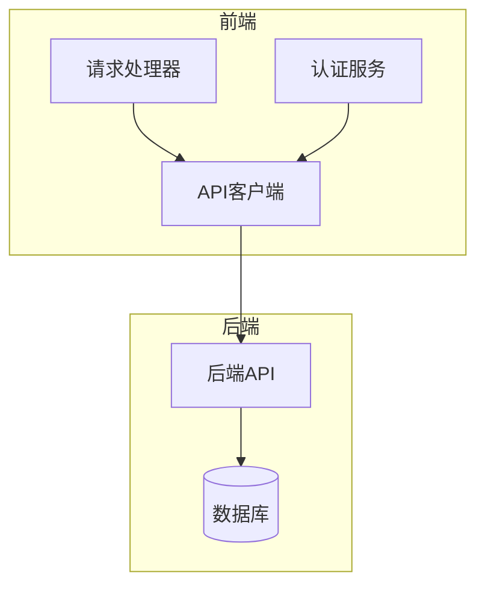
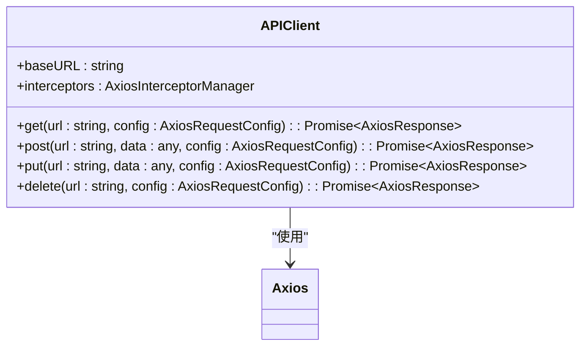
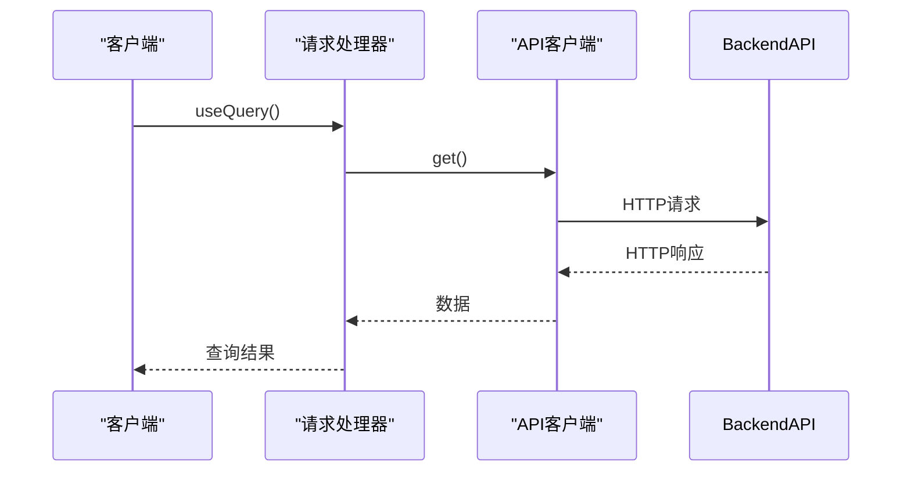
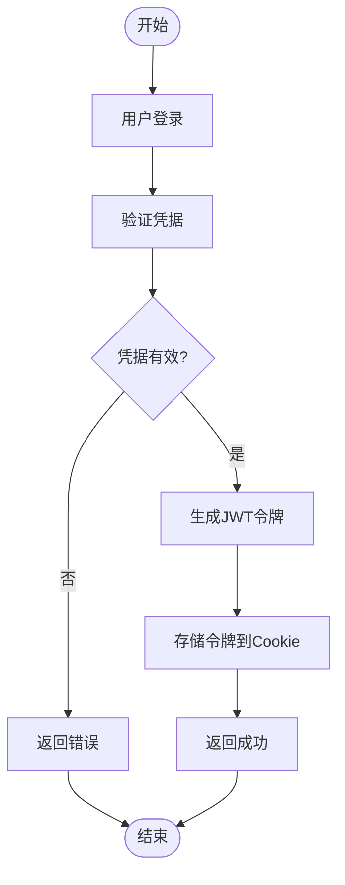
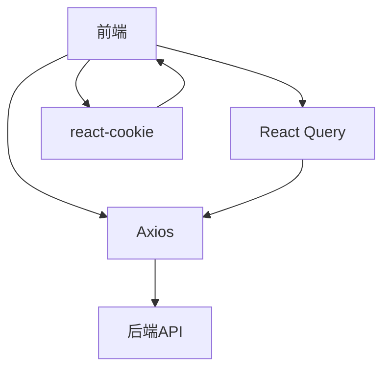

# API集成

<cite>
**本文档引用的文件**   
- [api.tsx](file://vibe_surf/frontend/src/controllers/API/api.tsx)
- [index.ts](file://vibe_surf/frontend/src/controllers/API/index.ts)
- [request-processor.ts](file://vibe_surf/frontend/src/controllers/API/services/request-processor.ts)
- [authContext.tsx](file://vibe_surf/frontend/src/contexts/authContext.tsx)
- [constants.ts](file://vibe_surf/frontend/src/constants/constants.ts)
- [api-client.js](file://vibe_surf/chrome_extension/scripts/api-client.js)
</cite>

## 目录
1. [简介](#简介)
2. [项目结构](#项目结构)
3. [核心组件](#核心组件)
4. [架构概述](#架构概述)
5. [详细组件分析](#详细组件分析)
6. [依赖分析](#依赖分析)
7. [性能考虑](#性能考虑)
8. [故障排除指南](#故障排除指南)
9. [结论](#结论)

## 简介
本文档详细介绍了VibeSurf前端如何通过REST API与后端服务进行通信。文档涵盖了请求封装、错误处理、认证机制和缓存策略等关键方面。我们将深入分析API控制器（如queries、services）的分层架构和代码组织方式，解释如何使用Axios或Fetch API进行数据获取和提交，并描述API响应处理、数据转换和错误提示的完整流程。此外，文档还提供了API调用的最佳实践、性能监控和调试技巧，以及如何扩展新的API端点。

## 项目结构
VibeSurf项目的前端API集成主要位于`vibe_surf/frontend/src/controllers/API`目录下。该目录包含了API客户端、请求处理器、查询和认证服务等关键组件。API客户端使用Axios库进行HTTP请求，而请求处理器则利用React Query进行数据获取和状态管理。认证机制通过JWT令牌和Cookie实现，确保用户会话的安全性。

**图表来源**
- [api.tsx](file://vibe_surf/frontend/src/controllers/API/api.tsx#L1-L374)
- [request-processor.ts](file://vibe_surf/frontend/src/controllers/API/services/request-processor.ts#L1-L55)

**章节来源**
- [api.tsx](file://vibe_surf/frontend/src/controllers/API/api.tsx#L1-L374)
- [index.ts](file://vibe_surf/frontend/src/controllers/API/index.ts#L1-L304)

## 核心组件
VibeSurf前端API集成的核心组件包括API客户端、请求处理器和认证服务。API客户端负责封装所有HTTP请求，使用Axios库进行网络通信。请求处理器利用React Query进行数据获取和状态管理，提供缓存、重试和错误处理等功能。认证服务通过JWT令牌和Cookie管理用户会话，确保API请求的安全性。

**章节来源**
- [api.tsx](file://vibe_surf/frontend/src/controllers/API/api.tsx#L1-L374)
- [request-processor.ts](file://vibe_surf/frontend/src/controllers/API/services/request-processor.ts#L1-L55)
- [authContext.tsx](file://vibe_surf/frontend/src/contexts/authContext.tsx#L1-L126)

## 架构概述
VibeSurf前端API集成采用分层架构，将API客户端、请求处理器和认证服务分离，确保代码的可维护性和可扩展性。API客户端负责与后端API进行通信，请求处理器负责数据获取和状态管理，认证服务负责用户会话管理。这种分层架构使得每个组件的职责清晰，便于开发和维护。

**图表来源**
- [api.tsx](file://vibe_surf/frontend/src/controllers/API/api.tsx#L1-L374)
- [request-processor.ts](file://vibe_surf/frontend/src/controllers/API/services/request-processor.ts#L1-L55)

## 详细组件分析
### API客户端分析
API客户端是VibeSurf前端与后端API通信的核心组件。它使用Axios库进行HTTP请求，封装了所有API调用。API客户端通过拦截器添加认证令牌，处理请求和响应，确保API请求的安全性和一致性。

#### 对象导向组件：

**图表来源**
- [api.tsx](file://vibe_surf/frontend/src/controllers/API/api.tsx#L1-L374)

### 请求处理器分析
请求处理器利用React Query进行数据获取和状态管理。它提供了缓存、重试和错误处理等功能，确保数据获取的高效性和可靠性。请求处理器通过`useQuery`和`useMutation`钩子，简化了数据获取和状态更新的代码。

#### API/服务组件：

**图表来源**
- [request-processor.ts](file://vibe_surf/frontend/src/controllers/API/services/request-processor.ts#L1-L55)

### 认证服务分析
认证服务通过JWT令牌和Cookie管理用户会话。用户登录后，后端返回JWT令牌，前端将其存储在Cookie中。每次API请求时，认证服务通过拦截器将JWT令牌添加到请求头中，确保请求的安全性。

#### 复杂逻辑组件：

**图表来源**
- [authContext.tsx](file://vibe_surf/frontend/src/contexts/authContext.tsx#L1-L126)

**章节来源**
- [authContext.tsx](file://vibe_surf/frontend/src/contexts/authContext.tsx#L1-L126)
- [constants.ts](file://vibe_surf/frontend/src/constants/constants.ts#L1-L1111)

## 依赖分析
VibeSurf前端API集成依赖于多个第三方库，包括Axios、React Query和react-cookie。Axios用于HTTP请求，React Query用于数据获取和状态管理，react-cookie用于Cookie操作。这些依赖库的选择确保了API集成的高效性和可靠性。

**图表来源**
- [api.tsx](file://vibe_surf/frontend/src/controllers/API/api.tsx#L1-L374)
- [request-processor.ts](file://vibe_surf/frontend/src/controllers/API/services/request-processor.ts#L1-L55)

**章节来源**
- [api.tsx](file://vibe_surf/frontend/src/controllers/API/api.tsx#L1-L374)
- [request-processor.ts](file://vibe_surf/frontend/src/controllers/API/services/request-processor.ts#L1-L55)

## 性能考虑
VibeSurf前端API集成在性能方面进行了多项优化。首先，使用React Query的缓存功能，减少重复的API请求。其次，通过请求拦截器添加认证令牌，避免了每次请求都需要手动添加令牌的繁琐操作。最后，利用Axios的拦截器处理错误，确保API请求的稳定性和可靠性。

## 故障排除指南
在使用VibeSurf前端API集成时，可能会遇到一些常见问题。以下是一些故障排除技巧：

1. **认证失败**：检查JWT令牌是否正确存储在Cookie中，确保请求头中包含正确的认证信息。
2. **API请求超时**：检查网络连接是否正常，确保后端API服务正常运行。
3. **数据获取失败**：检查API端点是否正确，确保请求参数符合API文档要求。

**章节来源**
- [api.tsx](file://vibe_surf/frontend/src/controllers/API/api.tsx#L1-L374)
- [authContext.tsx](file://vibe_surf/frontend/src/contexts/authContext.tsx#L1-L126)

## 结论
VibeSurf前端API集成通过分层架构和模块化设计，实现了高效、安全和可靠的API通信。API客户端、请求处理器和认证服务的分离，确保了代码的可维护性和可扩展性。通过使用Axios和React Query等现代前端库，VibeSurf前端API集成在性能和用户体验方面表现出色。未来，可以进一步优化缓存策略和错误处理机制，提升系统的整体性能和稳定性。