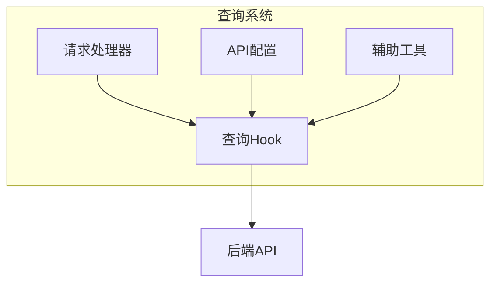
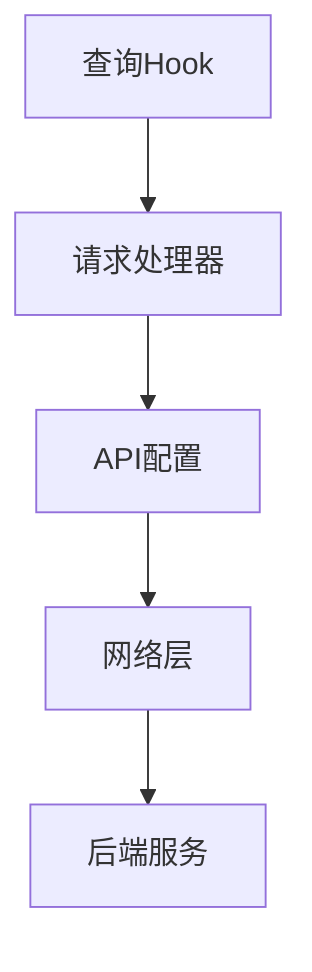
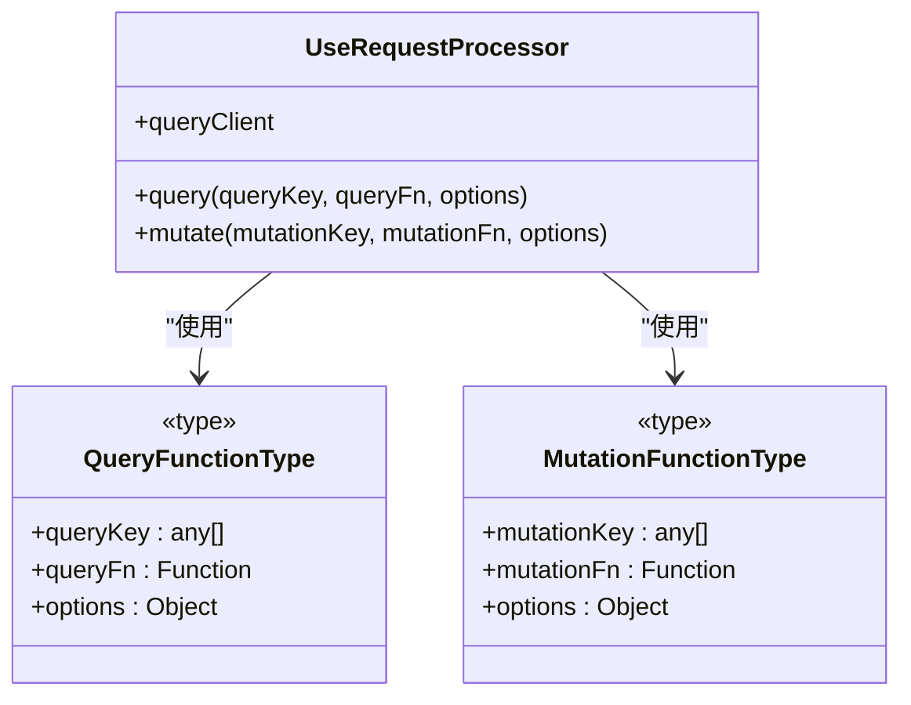
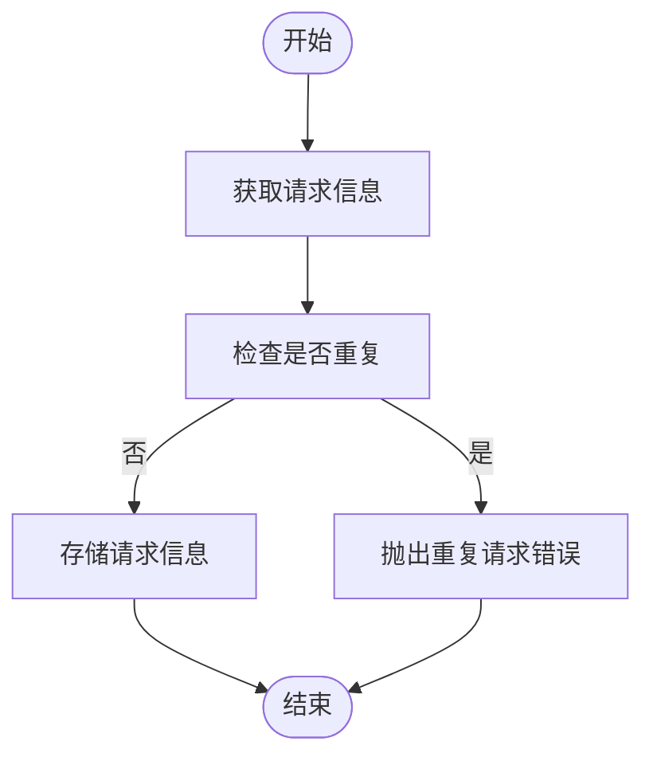
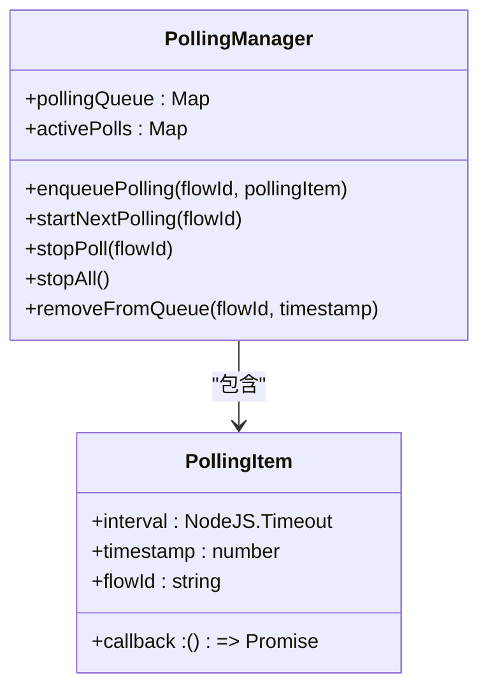
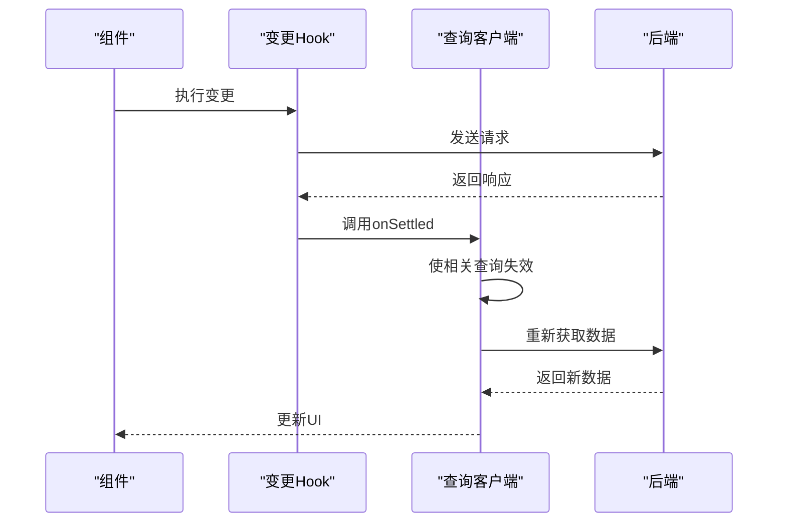
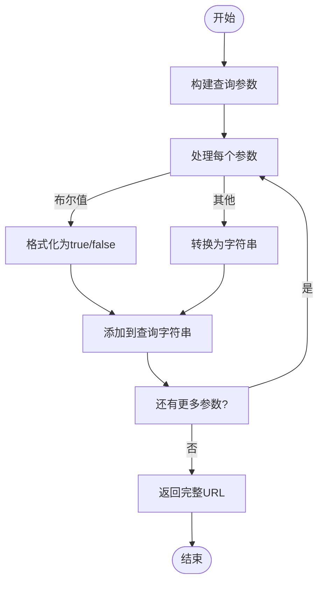
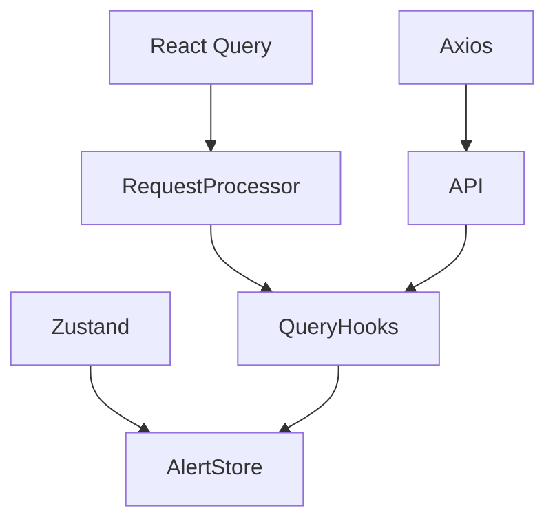

# 数据查询管理

<cite>
**本文档中引用的文件**  
- [use-get-builds.ts](file://vibe_surf/frontend/src/controllers/API/queries/_builds/use-get-builds.ts)
- [request-processor.ts](file://vibe_surf/frontend/src/controllers/API/services/request-processor.ts)
- [constants.ts](file://vibe_surf/frontend/src/controllers/API/helpers/constants.ts)
- [api.tsx](file://vibe_surf/frontend/src/controllers/API/api.tsx)
- [check-duplicate-requests.ts](file://vibe_surf/frontend/src/controllers/API/helpers/check-duplicate-requests.ts)
- [use-get-builds-polling-mutation.ts](file://vibe_surf/frontend/src/controllers/API/queries/_builds/use-get-builds-polling-mutation.ts)
- [use-get-flow.ts](file://vibe_surf/frontend/src/controllers/API/queries/flows/use-get-flow.ts)
- [use-get-refresh-flows-query.ts](file://vibe_surf/frontend/src/controllers/API/queries/flows/use-get-refresh-flows-query.ts)
- [create-query-param-string.ts](file://vibe_surf/frontend/src/controllers/utils/create-query-param-string.ts)
- [alertStore.ts](file://vibe_surf/frontend/src/stores/alertStore.ts)
- [use-custom-primary-loading.ts](file://vibe_surf/frontend/src/customization/hooks/use-custom-primary-loading.ts)
</cite>

## 目录
1. [简介](#简介)
2. [项目结构](#项目结构)
3. [核心组件](#核心组件)
4. [架构概述](#架构概述)
5. [详细组件分析](#详细组件分析)
6. [依赖分析](#依赖分析)
7. [性能考虑](#性能考虑)
8. [故障排除指南](#故障排除指南)
9. [结论](#结论)

## 简介
本文档深入分析VibeSurf前端的数据查询管理系统，重点介绍基于React Query的查询系统架构。文档详细说明了自定义Hook（如useGet、usePost）的设计模式，查询去重机制、轮询策略、缓存管理和数据同步机制。同时，解释了如何通过useGetBuilds、useGetFlows等具体查询Hook实现数据获取，以及如何处理分页、排序和过滤。此外，文档还描述了错误处理、加载状态管理和数据预取的最佳实践。

## 项目结构
VibeSurf前端的数据查询管理系统主要位于`vibe_surf/frontend/src/controllers/API`目录下。该系统基于React Query构建，通过自定义Hook封装了所有数据查询逻辑。核心组件包括查询处理器、API配置、查询Hook和辅助工具。



**图示来源**
- [request-processor.ts](file://vibe_surf/frontend/src/controllers/API/services/request-processor.ts)
- [api.tsx](file://vibe_surf/frontend/src/controllers/API/api.tsx)
- [use-get-builds.ts](file://vibe_surf/frontend/src/controllers/API/queries/_builds/use-get-builds.ts)

**本节来源**
- [use-get-builds.ts](file://vibe_surf/frontend/src/controllers/API/queries/_builds/use-get-builds.ts)
- [request-processor.ts](file://vibe_surf/frontend/src/controllers/API/services/request-processor.ts)

## 核心组件
数据查询管理系统的核心组件包括请求处理器、API配置、查询Hook和辅助工具。请求处理器封装了React Query的useQuery和useMutation，提供了统一的查询和变更接口。API配置定义了所有API端点的URL。查询Hook封装了具体的业务逻辑，提供了类型安全的查询接口。辅助工具提供了查询去重、错误处理等通用功能。

**本节来源**
- [request-processor.ts](file://vibe_surf/frontend/src/controllers/API/services/request-processor.ts)
- [constants.ts](file://vibe_surf/frontend/src/controllers/API/helpers/constants.ts)
- [use-get-builds.ts](file://vibe_surf/frontend/src/controllers/API/queries/_builds/use-get-builds.ts)

## 架构概述
VibeSurf前端的数据查询管理系统采用分层架构，从上到下分为查询Hook层、请求处理器层、API配置层和网络层。查询Hook层提供业务特定的查询接口，请求处理器层封装React Query的通用逻辑，API配置层管理API端点，网络层处理HTTP请求。



**图示来源**
- [request-processor.ts](file://vibe_surf/frontend/src/controllers/API/services/request-processor.ts)
- [api.tsx](file://vibe_surf/frontend/src/controllers/API/api.tsx)

## 详细组件分析

### 请求处理器分析
请求处理器是数据查询系统的核心，它封装了React Query的useQuery和useMutation，提供了统一的查询和变更接口。处理器还实现了重试机制和错误处理。



**图示来源**
- [request-processor.ts](file://vibe_surf/frontend/src/controllers/API/services/request-processor.ts)

**本节来源**
- [request-processor.ts](file://vibe_surf/frontend/src/controllers/API/services/request-processor.ts)

### 查询去重机制
查询去重机制通过localStorage存储最近的请求信息，防止在短时间内发送重复的GET请求。该机制可以有效减少不必要的网络请求，提高系统性能。



**图示来源**
- [check-duplicate-requests.ts](file://vibe_surf/frontend/src/controllers/API/helpers/check-duplicate-requests.ts)

**本节来源**
- [check-duplicate-requests.ts](file://vibe_surf/frontend/src/controllers/API/helpers/check-duplicate-requests.ts)

### 轮询策略
轮询策略通过PollingManager管理，支持定时轮询和条件停止。轮询管理器使用队列机制确保同一资源的多个轮询请求按顺序执行。



**图示来源**
- [use-get-builds-polling-mutation.ts](file://vibe_surf/frontend/src/controllers/API/queries/_builds/use-get-builds-polling-mutation.ts)

**本节来源**
- [use-get-builds-polling-mutation.ts](file://vibe_surf/frontend/src/controllers/API/queries/_builds/use-get-builds-polling-mutation.ts)

### 缓存管理
缓存管理通过React Query的内置机制实现，支持占位数据和窗口焦点时重新获取。查询结果会根据查询键自动缓存，支持手动失效和批量失效。

**本节来源**
- [use-get-builds.ts](file://vibe_surf/frontend/src/controllers/API/queries/_builds/use-get-builds.ts)
- [request-processor.ts](file://vibe_surf/frontend/src/controllers/API/services/request-processor.ts)

### 数据同步机制
数据同步机制通过onSettled回调实现，当变更操作完成时，自动使相关查询失效，触发数据重新获取，确保UI与后端数据保持同步。



**图示来源**
- [request-processor.ts](file://vibe_surf/frontend/src/controllers/API/services/request-processor.ts)
- [use-get-flow.ts](file://vibe_surf/frontend/src/controllers/API/queries/flows/use-get-flow.ts)

**本节来源**
- [request-processor.ts](file://vibe_surf/frontend/src/controllers/API/services/request-processor.ts)
- [use-get-flow.ts](file://vibe_surf/frontend/src/controllers/API/queries/flows/use-get-flow.ts)

### 分页、排序和过滤
分页、排序和过滤通过create-query-param-string工具函数实现，该函数将查询参数转换为URL查询字符串，支持布尔值和字符串值的正确编码。



**图示来源**
- [create-query-param-string.ts](file://vibe_surf/frontend/src/controllers/utils/create-query-param-string.ts)

**本节来源**
- [create-query-param-string.ts](file://vibe_surf/frontend/src/controllers/utils/create-query-param-string.ts)
- [use-get-refresh-flows-query.ts](file://vibe_surf/frontend/src/controllers/API/queries/flows/use-get-refresh-flows-query.ts)

### 错误处理
错误处理通过alertStore实现，支持错误、通知和成功三种消息类型。错误信息会自动添加到通知历史和临时列表中，确保用户不会错过重要信息。

```mermaid
classDiagram
class useAlertStore {
+errorData : {title : string, list : Array<string>}
+noticeData : {title : string, link : string}
+successData : {title : string}
+setErrorData(newState)
+setNoticeData(newState)
+setSuccessData(newState)
+addNotificationToHistory(notification)
+addNotificationToTempList(notification)
}
class AlertItemType {
+id : string
+type : "error" | "notice" | "success"
+title : string
+list? : Array<string>
+link? : string
}
useAlertStore --> AlertItemType : "使用"
```

**图示来源**
- [alertStore.ts](file://vibe_surf/frontend/src/stores/alertStore.ts)

**本节来源**
- [alertStore.ts](file://vibe_surf/frontend/src/stores/alertStore.ts)

### 加载状态管理
加载状态管理通过自定义Hook实现，支持全局加载状态的显示和隐藏。加载状态与查询生命周期紧密集成，确保用户界面的响应性。

**本节来源**
- [use-custom-primary-loading.ts](file://vibe_surf/frontend/src/customization/hooks/use-custom-primary-loading.ts)

### 数据预取
数据预取通过React Query的预取功能实现，可以在用户导航到新页面之前预先获取数据，提高用户体验。预取策略可以根据用户行为和应用状态动态调整。

**本节来源**
- [request-processor.ts](file://vibe_surf/frontend/src/controllers/API/services/request-processor.ts)

## 依赖分析
数据查询管理系统依赖于React Query、Axios和Zustand等核心库。React Query提供查询和变更的抽象，Axios处理HTTP请求，Zustand管理全局状态。系统内部组件之间通过清晰的接口进行通信，降低了耦合度。



**图示来源**
- [request-processor.ts](file://vibe_surf/frontend/src/controllers/API/services/request-processor.ts)
- [api.tsx](file://vibe_surf/frontend/src/controllers/API/api.tsx)
- [alertStore.ts](file://vibe_surf/frontend/src/stores/alertStore.ts)

**本节来源**
- [request-processor.ts](file://vibe_surf/frontend/src/controllers/API/services/request-processor.ts)
- [api.tsx](file://vibe_surf/frontend/src/controllers/API/api.tsx)
- [alertStore.ts](file://vibe_surf/frontend/src/stores/alertStore.ts)

## 性能考虑
数据查询管理系统在设计时充分考虑了性能因素。查询去重机制减少了不必要的网络请求，轮询策略避免了频繁的服务器查询，缓存管理减少了重复的数据获取。重试机制采用指数退避算法，避免了对服务器的过度压力。

## 故障排除指南
当遇到数据查询问题时，可以按照以下步骤进行排查：
1. 检查网络连接是否正常
2. 查看浏览器控制台是否有错误信息
3. 检查查询参数是否正确
4. 验证API端点是否可用
5. 检查认证令牌是否有效

**本节来源**
- [api.tsx](file://vibe_surf/frontend/src/controllers/API/api.tsx)
- [alertStore.ts](file://vibe_surf/frontend/src/stores/alertStore.ts)

## 结论
VibeSurf前端的数据查询管理系统采用现代化的架构设计，基于React Query构建，提供了高效、可靠的数据获取和管理功能。系统通过自定义Hook封装了复杂的查询逻辑，提供了简洁的API接口。查询去重、轮询、缓存和数据同步机制确保了系统的高性能和数据一致性。错误处理和加载状态管理提供了良好的用户体验。整体设计遵循最佳实践，具有良好的可维护性和扩展性。