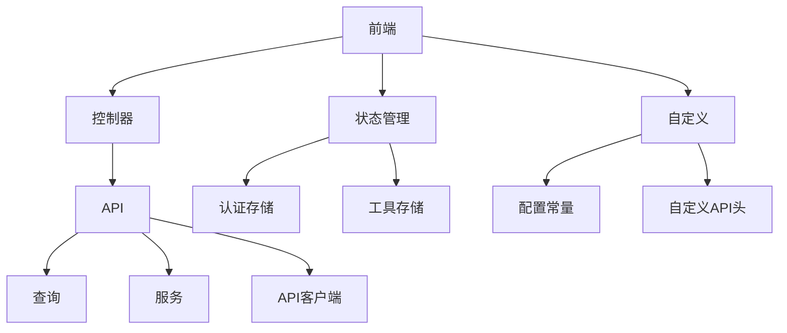
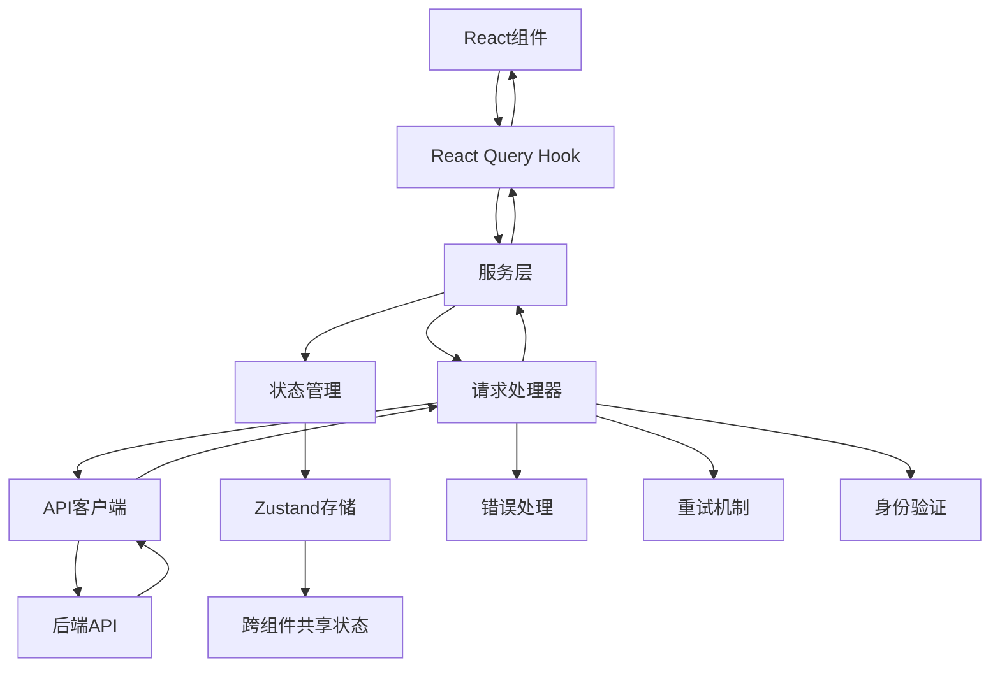
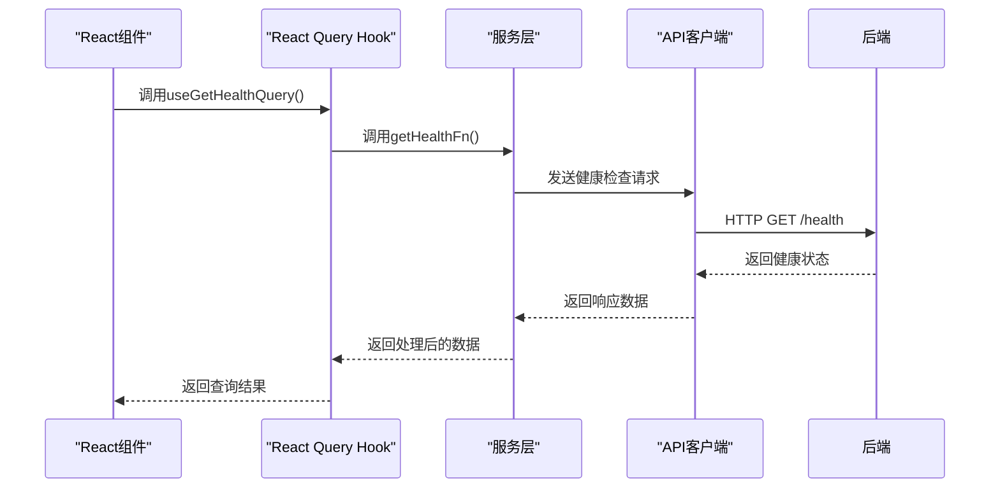
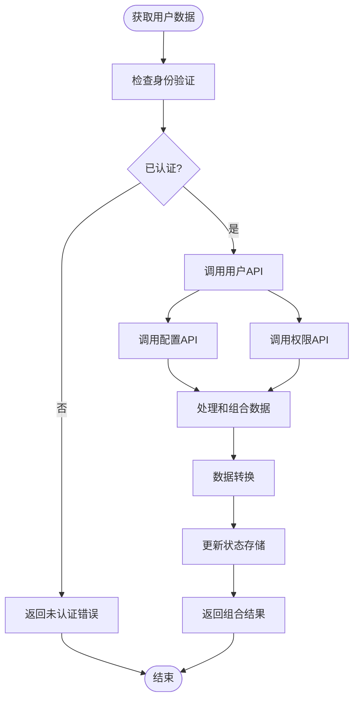
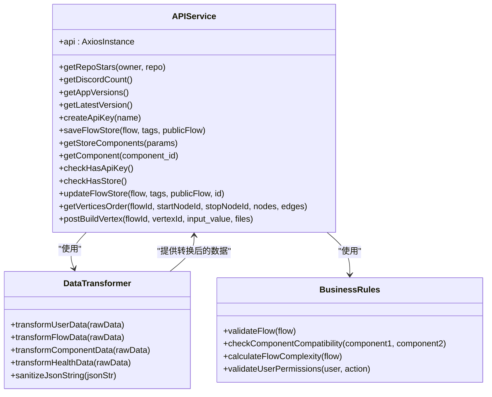
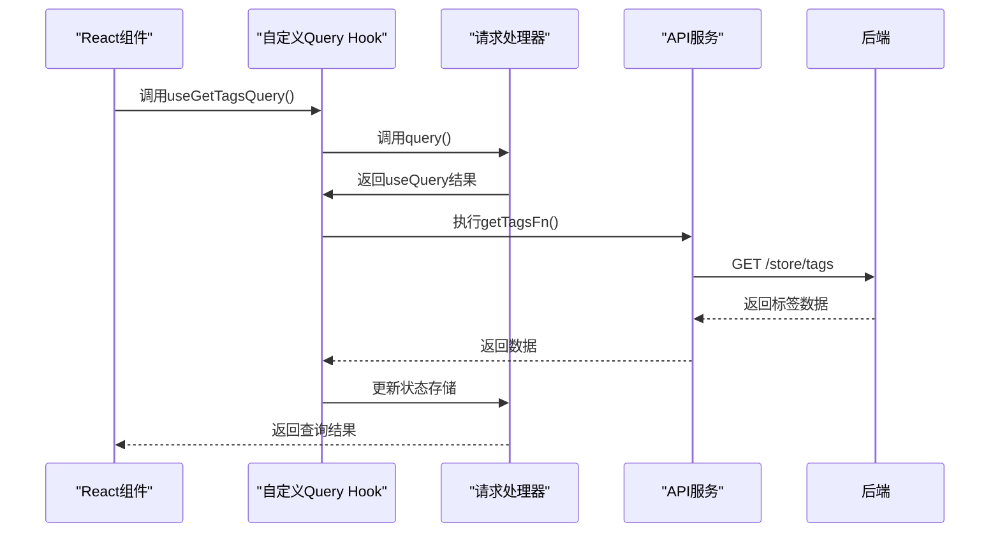
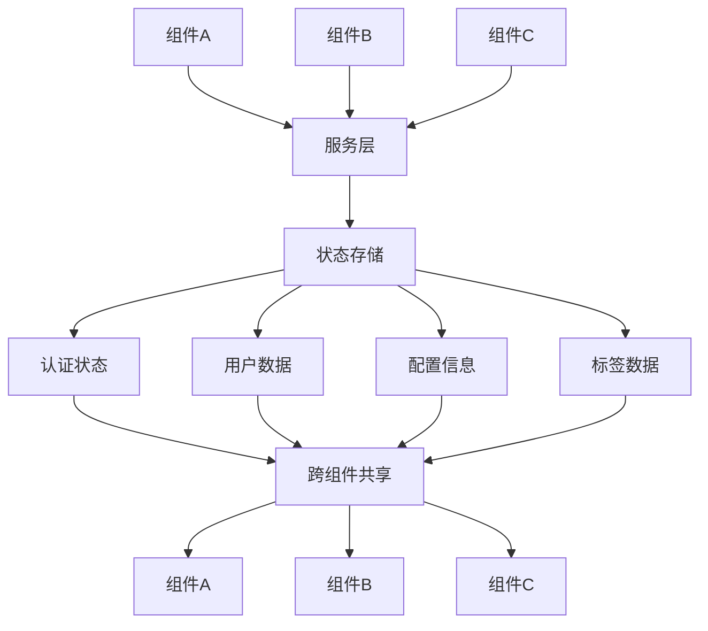
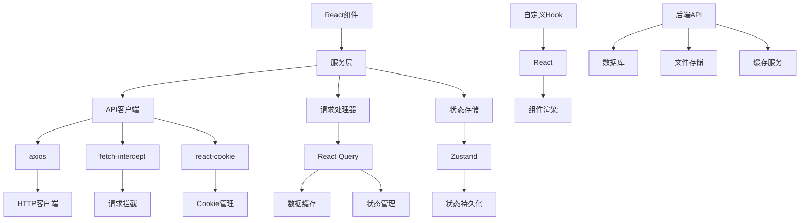

# 服务层封装

<cite>
**本文档引用的文件**   
- [api.tsx](file://vibe_surf/frontend/src/controllers/API/api.tsx)
- [request-processor.ts](file://vibe_surf/frontend/src/controllers/API/services/request-processor.ts)
- [use-get-health.ts](file://vibe_surf/frontend/src/controllers/API/queries/health/use-get-health.ts)
- [use-get-user.ts](file://vibe_surf/frontend/src/controllers/API/queries/auth/use-get-user.ts)
- [use-get-tags.ts](file://vibe_surf/frontend/src/controllers/API/queries/store/use-get-tags.ts)
- [authStore.ts](file://vibe_surf/frontend/src/stores/authStore.ts)
- [utilityStore.ts](file://vibe_surf/frontend/src/stores/utilityStore.ts)
- [index.ts](file://vibe_surf/frontend/src/controllers/API/index.ts)
- [config-constants.ts](file://vibe_surf/frontend/src/customization/config-constants.ts)
- [constants.ts](file://vibe_surf/frontend/src/constants/constants.ts)
</cite>

## 目录
1. [引言](#引言)
2. [项目结构](#项目结构)
3. [核心组件](#核心组件)
4. [架构概述](#架构概述)
5. [详细组件分析](#详细组件分析)
6. [依赖分析](#依赖分析)
7. [性能考虑](#性能考虑)
8. [故障排除指南](#故障排除指南)
9. [结论](#结论)

## 引言
本文档详细介绍了VibeSurf前端服务层的封装设计，重点阐述了服务层与查询层的职责分离原则。文档解释了服务层如何封装复杂的业务逻辑和API调用组合，以及如何协调多个API请求、处理数据转换和实现业务规则。同时，文档还描述了服务层与React Query查询层的集成模式，以及如何通过服务层实现跨组件的数据共享和状态管理，并提供了服务层扩展和测试的最佳实践。

## 项目结构

**图示来源**
- [api.tsx](file://vibe_surf/frontend/src/controllers/API/api.tsx)
- [authStore.ts](file://vibe_surf/frontend/src/stores/authStore.ts)
- [utilityStore.ts](file://vibe_surf/frontend/src/stores/utilityStore.ts)
- [config-constants.ts](file://vibe_surf/frontend/src/customization/config-constants.ts)

**节来源**
- [api.tsx](file://vibe_surf/frontend/src/controllers/API/api.tsx)
- [authStore.ts](file://vibe_surf/frontend/src/stores/authStore.ts)

## 核心组件

VibeSurf前端服务层的核心组件包括API控制器、查询服务、状态管理存储和请求处理器。这些组件共同协作，实现了前端与后端API的高效通信和数据管理。服务层负责封装所有与后端的交互逻辑，包括API调用、错误处理、身份验证和数据转换。

服务层的设计遵循单一职责原则，每个服务组件只负责特定领域的业务逻辑。例如，健康检查服务专门处理系统健康状态的查询，用户服务负责用户相关的操作，而存储服务则管理组件和标签的数据交互。

**节来源**
- [api.tsx](file://vibe_surf/frontend/src/controllers/API/api.tsx)
- [request-processor.ts](file://vibe_surf/frontend/src/controllers/API/services/request-processor.ts)
- [use-get-health.ts](file://vibe_surf/frontend/src/controllers/API/queries/health/use-get-health.ts)

## 架构概述

**图示来源**
- [api.tsx](file://vibe_surf/frontend/src/controllers/API/api.tsx)
- [request-processor.ts](file://vibe_surf/frontend/src/controllers/API/services/request-processor.ts)
- [authStore.ts](file://vibe_surf/frontend/src/stores/authStore.ts)

## 详细组件分析

### 服务层与查询层职责分离

VibeSurf前端实现了清晰的服务层与查询层职责分离。服务层负责封装复杂的业务逻辑和API调用组合，而查询层则专注于数据获取和状态管理。

服务层的主要职责包括：
- 协调多个API请求的执行顺序和依赖关系
- 处理复杂的数据转换和格式化
- 实现业务规则和验证逻辑
- 管理API调用的错误处理和重试策略
- 处理身份验证和授权逻辑

查询层（基于React Query）的主要职责包括：
- 管理数据的获取、缓存和更新
- 处理加载状态和错误状态
- 实现数据的自动刷新和失效策略
- 提供一致的API用于数据获取

**图示来源**
- [use-get-health.ts](file://vibe_surf/frontend/src/controllers/API/queries/health/use-get-health.ts)
- [api.tsx](file://vibe_surf/frontend/src/controllers/API/api.tsx)

#### 服务层API调用组合

服务层通过组合多个API调用来实现复杂的业务功能。例如，在获取用户数据时，服务层不仅调用用户信息API，还会同时获取用户的权限、配置和相关资源信息。

**图示来源**
- [use-get-user.ts](file://vibe_surf/frontend/src/controllers/API/queries/auth/use-get-user.ts)
- [authStore.ts](file://vibe_surf/frontend/src/stores/authStore.ts)

#### 服务层数据转换

服务层负责将API返回的原始数据转换为前端组件所需的格式。这种转换包括数据结构的重组、字段的映射和类型的转换。

**图示来源**
- [index.ts](file://vibe_surf/frontend/src/controllers/API/index.ts)
- [api.tsx](file://vibe_surf/frontend/src/controllers/API/api.tsx)

### 服务层与React Query集成

服务层与React Query的集成通过请求处理器实现，提供了统一的接口用于数据获取和状态管理。

**图示来源**
- [use-get-tags.ts](file://vibe_surf/frontend/src/controllers/API/queries/store/use-get-tags.ts)
- [request-processor.ts](file://vibe_surf/frontend/src/controllers/API/services/request-processor.ts)
- [utilityStore.ts](file://vibe_surf/frontend/src/stores/utilityStore.ts)

#### 跨组件数据共享

服务层通过Zustand状态管理实现跨组件的数据共享，确保应用状态的一致性。

**图示来源**
- [authStore.ts](file://vibe_surf/frontend/src/stores/authStore.ts)
- [utilityStore.ts](file://vibe_surf/frontend/src/stores/utilityStore.ts)
- [use-get-user.ts](file://vibe_surf/frontend/src/controllers/API/queries/auth/use-get-user.ts)

## 依赖分析

**图示来源**
- [api.tsx](file://vibe_surf/frontend/src/controllers/API/api.tsx)
- [request-processor.ts](file://vibe_surf/frontend/src/controllers/API/services/request-processor.ts)
- [authStore.ts](file://vibe_surf/frontend/src/stores/authStore.ts)

## 性能考虑

服务层的设计充分考虑了性能优化，包括：

1. **请求批处理**：将多个相关API调用合并为单个请求，减少网络开销
2. **数据缓存**：利用React Query的缓存机制，避免重复请求
3. **懒加载**：按需加载数据，减少初始加载时间
4. **错误重试**：实现智能重试策略，提高请求成功率
5. **超时处理**：设置合理的请求超时，避免长时间等待

服务层还实现了请求去重机制，防止同一时刻发送重复的API请求，这在用户快速操作时尤为重要。

## 故障排除指南

当服务层出现问题时，可以按照以下步骤进行排查：

1. **检查网络连接**：确保前端能够访问后端API
2. **验证身份认证**：检查访问令牌是否有效
3. **查看请求日志**：使用浏览器开发者工具检查API请求和响应
4. **检查状态存储**：确认Zustand存储中的状态是否正确
5. **验证数据格式**：确保API返回的数据格式符合预期

常见的错误包括：
- 401/403错误：身份认证问题，需要重新登录或检查权限
- 500错误：服务器内部错误，需要检查后端日志
- 网络超时：检查网络连接或增加超时时间
- 数据格式错误：检查API文档，确认数据结构

**节来源**
- [api.tsx](file://vibe_surf/frontend/src/controllers/API/api.tsx)
- [authStore.ts](file://vibe_surf/frontend/src/stores/authStore.ts)

## 结论

VibeSurf前端服务层通过清晰的职责分离、模块化设计和高效的集成模式，实现了复杂业务逻辑的封装和管理。服务层不仅简化了前端组件的开发，还提高了代码的可维护性和可测试性。

通过与React Query和Zustand的深度集成，服务层实现了高效的数据获取、缓存和状态管理，为用户提供流畅的交互体验。未来可以进一步优化服务层，例如引入更智能的缓存策略、实现更精细的错误处理和增加更多的监控指标。