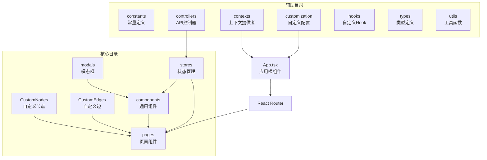
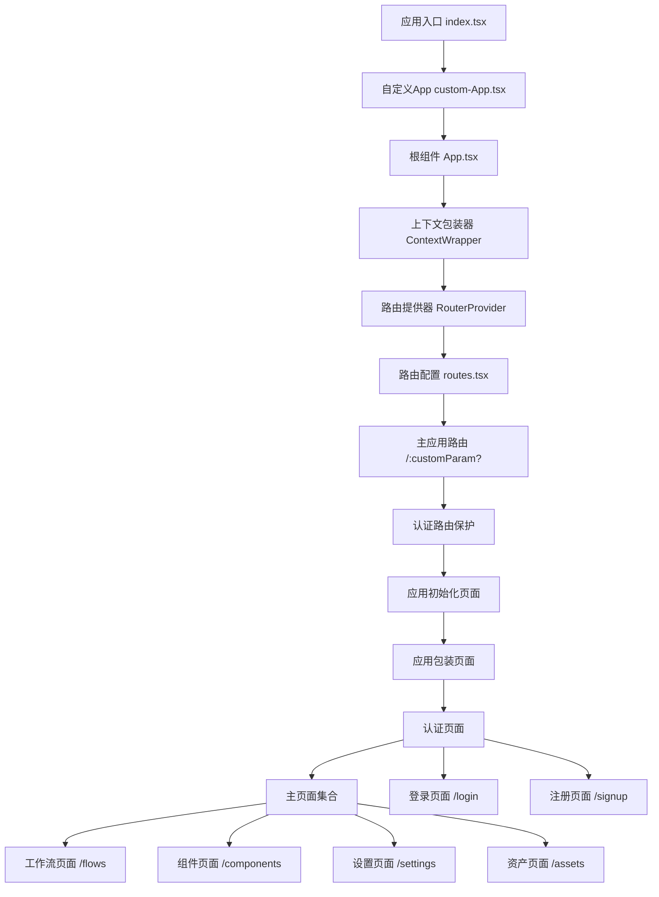
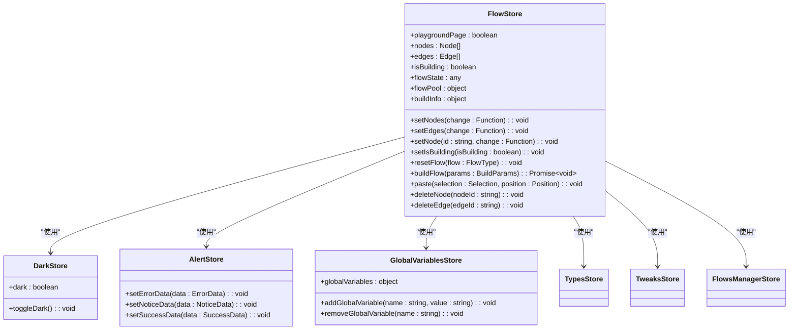
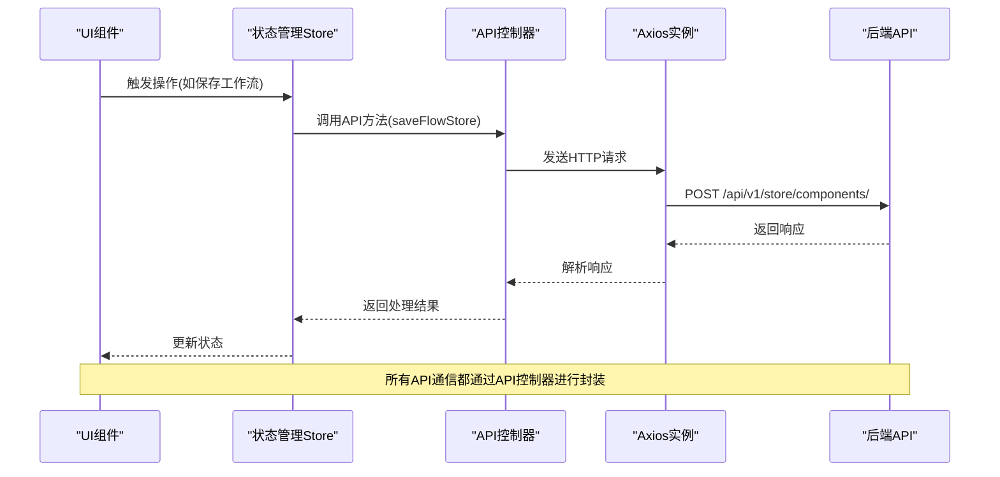
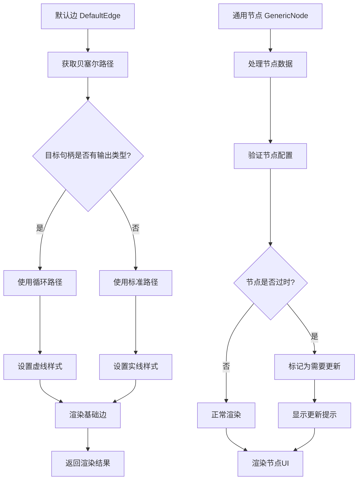
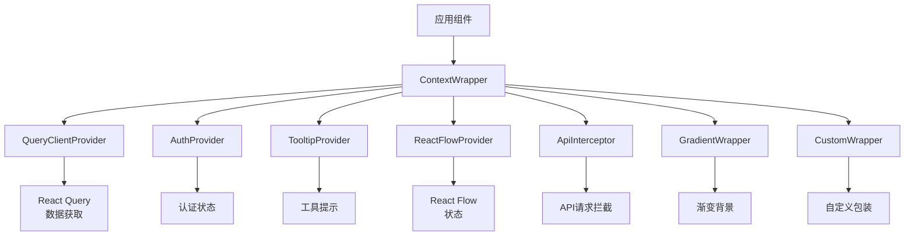
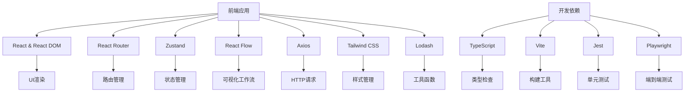
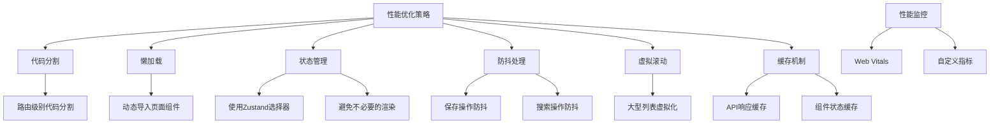
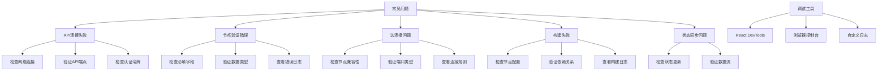

# 前端架构

<cite>
**本文档中引用的文件**  
- [App.tsx](file://vibe_surf/frontend/src/App.tsx)
- [routes.tsx](file://vibe_surf/frontend/src/routes.tsx)
- [index.tsx](file://vibe_surf/frontend/src/index.tsx)
- [package.json](file://vibe_surf/frontend/package.json)
- [tsconfig.json](file://vibe_surf/frontend/tsconfig.json)
- [flowStore.ts](file://vibe_surf/frontend/src/stores/flowStore.ts)
- [CustomEdges/index.tsx](file://vibe_surf/frontend/src/CustomEdges/index.tsx)
- [API/index.ts](file://vibe_surf/frontend/src/controllers/API/index.ts)
- [contexts/index.tsx](file://vibe_surf/frontend/src/contexts/index.tsx)
- [constants.ts](file://vibe_surf/frontend/src/constants/constants.ts)
- [custom-App.tsx](file://vibe_surf/frontend/src/customization/custom-App.tsx)
</cite>

## 目录
1. [简介](#简介)
2. [项目结构](#项目结构)
3. [核心组件](#核心组件)
4. [架构概述](#架构概述)
5. [详细组件分析](#详细组件分析)
6. [依赖分析](#依赖分析)
7. [性能考虑](#性能考虑)
8. [故障排除指南](#故障排除指南)
9. [结论](#结论)

## 简介
VibeSurf前端架构基于React构建，采用现代化的前端技术栈，为用户提供直观的拖放式工作流创建界面。该架构通过REST API与后端服务通信，实现用户交互和UI状态更新。前端应用采用模块化设计，代码组织清晰，包含CustomNodes、CustomEdges、components、modals等目录，分别负责自定义节点、边、通用组件和模态框的实现。系统利用React Flow库实现可视化工作流编辑器，支持对话式工作流等核心功能。

## 项目结构
VibeSurf前端项目采用基于功能的文件组织方式，主要目录包括CustomNodes、CustomEdges、components、modals、pages、stores等。这种结构将相关功能的代码组织在一起，提高了代码的可维护性和可扩展性。



**目录来源**  
- [vibe_surf/frontend/src](file://vibe_surf/frontend/src)

## 核心组件

VibeSurf前端的核心组件包括应用根组件、路由配置、状态管理store和API控制器。这些组件共同构成了前端应用的基础架构。

**核心组件来源**  
- [App.tsx](file://vibe_surf/frontend/src/App.tsx#L1-L23)
- [routes.tsx](file://vibe_surf/frontend/src/routes.tsx#L1-L211)
- [index.tsx](file://vibe_surf/frontend/src/index.tsx#L1-L20)
- [package.json](file://vibe_surf/frontend/package.json#L1-L152)
- [tsconfig.json](file://vibe_surf/frontend/tsconfig.json#L1-L64)

## 架构概述

VibeSurf前端采用现代化的React架构，结合多种前端技术实现复杂的工作流编辑功能。系统架构分为多个层次，包括UI组件层、状态管理层、API通信层和数据模型层。

```mermaid
graph TD
subgraph "UI层"
A[页面组件 Pages]
B[通用组件 Components]
C[自定义节点 CustomNodes]
D[自定义边 CustomEdges]
E[模态框 Modals]
end
subgraph "状态管理层"
F[FlowStore]
G[全局变量Store]
H[暗色模式Store]
I[警报Store]
end
subgraph "API通信层"
J[API控制器]
K[Axios实例]
L[请求拦截器]
end
subgraph "数据模型层"
M[Flow类型]
N[Node类型]
O[Edge类型]
P[API响应类型]
end
A --> F
B --> F
C --> F
D --> F
E --> F
F --> J
G --> F
H --> F
I --> F
J --> K
K --> L
M --> F
N --> F
O --> F
P <-- J
```

**架构来源**  
- [App.tsx](file://vibe_surf/frontend/src/App.tsx#L1-L23)
- [routes.tsx](file://vibe_surf/frontend/src/routes.tsx#L1-L211)
- [flowStore.ts](file://vibe_surf/frontend/src/stores/flowStore.ts#L1-L800)
- [API/index.ts](file://vibe_surf/frontend/src/controllers/API/index.ts#L1-L304)

## 详细组件分析

### 应用入口与路由分析
VibeSurf前端应用的入口点是`index.tsx`文件，它通过ReactDOM将应用渲染到DOM中。应用使用React Router进行路由管理，实现了复杂的嵌套路由结构。



**组件来源**  
- [index.tsx](file://vibe_surf/frontend/src/index.tsx#L1-L20)
- [custom-App.tsx](file://vibe_surf/frontend/src/customization/custom-App.tsx#L1-L6)
- [App.tsx](file://vibe_surf/frontend/src/App.tsx#L1-L23)
- [routes.tsx](file://vibe_surf/frontend/src/routes.tsx#L1-L211)

### 状态管理分析
VibeSurf前端使用Zustand进行状态管理，创建了多个store来管理不同的应用状态。`flowStore`是核心状态管理器，负责管理工作流的节点、边、构建状态等。



**状态管理来源**  
- [flowStore.ts](file://vibe_surf/frontend/src/stores/flowStore.ts#L1-L800)
- [darkStore.ts](file://vibe_surf/frontend/src/stores/darkStore.ts)
- [alertStore.ts](file://vibe_surf/frontend/src/stores/alertStore.ts)
- [globalVariablesStore/globalVariables.ts](file://vibe_surf/frontend/src/stores/globalVariablesStore/globalVariables.ts)

### API通信分析
VibeSurf前端通过API控制器与后端进行通信，使用Axios作为HTTP客户端，实现了RESTful API调用。API通信层封装了所有与后端的交互逻辑。



**API通信来源**  
- [API/index.ts](file://vibe_surf/frontend/src/controllers/API/index.ts#L1-L304)
- [api.ts](file://vibe_surf/frontend/src/controllers/API/api.ts)

### 自定义节点与边分析
VibeSurf前端使用React Flow库实现可视化工作流编辑器，通过自定义节点和边来满足特定的UI需求。CustomNodes目录包含各种类型的节点实现，CustomEdges目录则负责边的渲染和交互。



**自定义节点与边来源**  
- [CustomEdges/index.tsx](file://vibe_surf/frontend/src/CustomEdges/index.tsx#L1-L78)
- [CustomNodes/GenericNode](file://vibe_surf/frontend/src/CustomNodes/GenericNode)

### 上下文管理分析
VibeSurf前端使用React Context来管理全局状态和提供共享功能。ContextWrapper组件将多个上下文提供者组合在一起，为整个应用提供统一的上下文环境。



**上下文管理来源**  
- [contexts/index.tsx](file://vibe_surf/frontend/src/contexts/index.tsx#L1-L32)

## 依赖分析

VibeSurf前端项目依赖多个第三方库来实现其功能，这些依赖在package.json文件中定义。核心依赖包括React、React Router、Zustand、React Flow等。



**依赖来源**  
- [package.json](file://vibe_surf/frontend/package.json#L1-L152)

## 性能考虑

VibeSurf前端在性能优化方面采取了多种策略，包括代码分割、懒加载、状态管理优化和防抖处理等。



**性能优化来源**  
- [flowStore.ts](file://vibe_surf/frontend/src/stores/flowStore.ts#L1-L800)
- [utils](file://vibe_surf/frontend/src/utils)
- [hooks](file://vibe_surf/frontend/src/hooks)

## 故障排除指南

VibeSurf前端包含完善的错误处理和调试机制，帮助开发者快速定位和解决问题。



**故障排除来源**  
- [constants.ts](file://vibe_surf/frontend/src/constants/constants.ts#L1-L800)
- [alerts_constants.tsx](file://vibe_surf/frontend/src/constants/alerts_constants.tsx)
- [flowStore.ts](file://vibe_surf/frontend/src/stores/flowStore.ts#L1-L800)

## 结论
VibeSurf前端架构采用现代化的React技术栈，通过合理的代码组织和架构设计，实现了功能丰富且易于维护的可视化工作流编辑器。系统基于React Flow库构建，结合Zustand状态管理、React Router路由控制和Axios API通信，形成了完整的前端解决方案。代码结构清晰，采用基于功能的组织方式，便于团队协作和持续开发。通过自定义节点、边和上下文管理，系统提供了灵活的扩展能力。性能优化方面采用了代码分割、懒加载和防抖处理等策略，确保了良好的用户体验。整体架构设计合理，为VibeSurf的核心功能提供了坚实的基础。