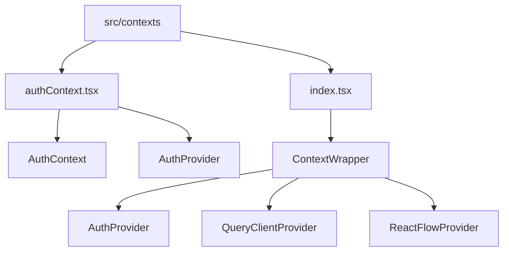
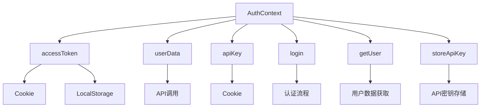
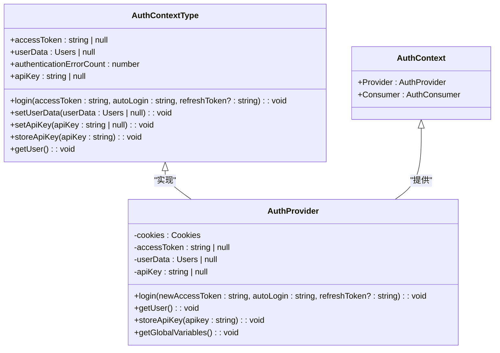
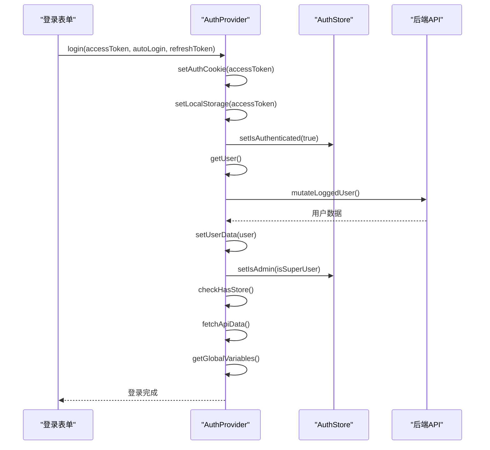
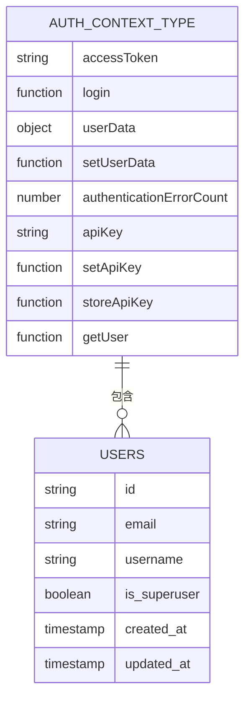
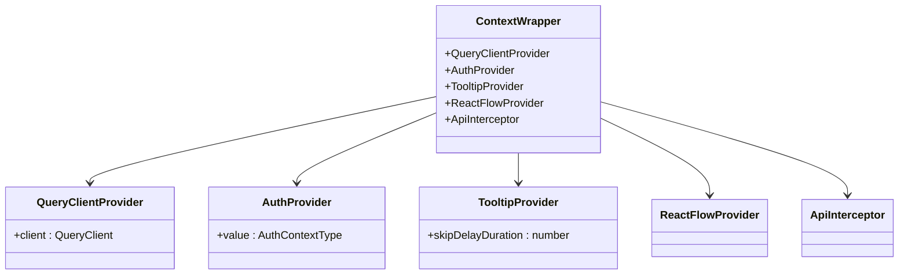

# 上下文管理

<cite>
**本文档中引用的文件**  
- [authContext.tsx](file://vibe_surf/frontend/src/contexts/authContext.tsx)
- [index.tsx](file://vibe_surf/frontend/src/contexts/index.tsx)
- [auth.ts](file://vibe_surf/frontend/src/types/contexts/auth.ts)
- [authStore.ts](file://vibe_surf/frontend/src/stores/authStore.ts)
- [storeStore.ts](file://vibe_surf/frontend/src/stores/storeStore.ts)
- [routes.tsx](file://vibe_surf/frontend/src/routes.tsx)
</cite>

## 目录
1. [项目结构](#项目结构)
2. [核心组件](#核心组件)
3. [架构概述](#架构概述)
4. [详细组件分析](#详细组件分析)
5. [依赖分析](#依赖分析)

## 项目结构

VibeSurf前端的上下文管理主要位于`src/contexts`目录下，通过React Context API实现全局状态管理。核心文件包括`authContext.tsx`和`index.tsx`，分别负责认证上下文的定义和所有上下文的统一包装。



**图示来源**  
- [authContext.tsx](file://vibe_surf/frontend/src/contexts/authContext.tsx)
- [index.tsx](file://vibe_surf/frontend/src/contexts/index.tsx)

**本节来源**  
- [authContext.tsx](file://vibe_surf/frontend/src/contexts/authContext.tsx)
- [index.tsx](file://vibe_surf/frontend/src/contexts/index.tsx)

## 核心组件

VibeSurf前端上下文管理的核心是`AuthContext`，它通过React Context API提供全局认证状态管理。该上下文与Zustand store协同工作，实现了复杂的认证逻辑和状态同步。

**本节来源**  
- [authContext.tsx](file://vibe_surf/frontend/src/contexts/authContext.tsx)
- [authStore.ts](file://vibe_surf/frontend/src/stores/authStore.ts)

## 架构概述

VibeSurf的上下文管理架构采用分层设计，将React Context与Zustand store结合使用。`AuthContext`作为顶层状态管理器，负责提供认证相关的数据和方法，而Zustand store则用于管理更复杂的业务状态。



**图示来源**  
- [authContext.tsx](file://vibe_surf/frontend/src/contexts/authContext.tsx)
- [authStore.ts](file://vibe_surf/frontend/src/stores/authStore.ts)

## 详细组件分析

### AuthContext分析

`AuthContext`是VibeSurf前端认证系统的核心，它通过React Context API提供全局可访问的认证状态和方法。

#### 类图


**图示来源**  
- [authContext.tsx](file://vibe_surf/frontend/src/contexts/authContext.tsx)
- [auth.ts](file://vibe_surf/frontend/src/types/contexts/auth.ts)

#### 认证流程序列图


**图示来源**  
- [authContext.tsx](file://vibe_surf/frontend/src/contexts/authContext.tsx)
- [authStore.ts](file://vibe_surf/frontend/src/stores/authStore.ts)

#### 上下文类型定义


**图示来源**  
- [auth.ts](file://vibe_surf/frontend/src/types/contexts/auth.ts)
- [authContext.tsx](file://vibe_surf/frontend/src/contexts/authContext.tsx)

### ContextWrapper分析

`ContextWrapper`是VibeSurf前端所有上下文的统一包装器，它将多个上下文Provider组合在一起，为整个应用提供统一的上下文环境。

#### ContextWrapper类图


**图示来源**  
- [index.tsx](file://vibe_surf/frontend/src/contexts/index.tsx)
- [authContext.tsx](file://vibe_surf/frontend/src/contexts/authContext.tsx)

**本节来源**  
- [authContext.tsx](file://vibe_surf/frontend/src/contexts/authContext.tsx)
- [index.tsx](file://vibe_surf/frontend/src/contexts/index.tsx)
- [authStore.ts](file://vibe_surf/frontend/src/stores/authStore.ts)
- [storeStore.ts](file://vibe_surf/frontend/src/stores/storeStore.ts)

## 依赖分析

VibeSurf的上下文管理依赖于多个外部库和内部模块，形成了复杂的依赖关系网络。

```mermaid
graph TD
A[React Context] --> B[authContext.tsx]
C[Zustand] --> D[authStore.ts]
C --> E[storeStore.ts]
F[react-cookie] --> B
G[@tanstack/react-query] --> H[index.tsx]
H --> B
I[@xyflow/react] --> H
J[authContext.tsx] --> K[controllers/API/queries]
J --> L[utils/utils]
J --> M[constants/constants]
N[storeStore.ts] --> O[controllers/API]
P[routes.tsx] --> H
```

**图示来源**  
- [authContext.tsx](file://vibe_surf/frontend/src/contexts/authContext.tsx)
- [index.tsx](file://vibe_surf/frontend/src/contexts/index.tsx)
- [authStore.ts](file://vibe_surf/frontend/src/stores/authStore.ts)
- [storeStore.ts](file://vibe_surf/frontend/src/stores/storeStore.ts)
- [routes.tsx](file://vibe_surf/frontend/src/routes.tsx)

**本节来源**  
- [authContext.tsx](file://vibe_surf/frontend/src/contexts/authContext.tsx)
- [index.tsx](file://vibe_surf/frontend/src/contexts/index.tsx)
- [authStore.ts](file://vibe_surf/frontend/src/stores/authStore.ts)
- [storeStore.ts](file://vibe_surf/frontend/src/stores/storeStore.ts)
- [routes.tsx](file://vibe_surf/frontend/src/routes.tsx)