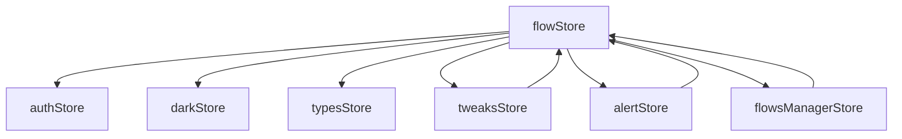

# 状态存储

<cite>
**本文档中引用的文件**  
- [flowStore.ts](file://vibe_surf/frontend/src/stores/flowStore.ts)
- [authStore.ts](file://vibe_surf/frontend/src/stores/authStore.ts)
- [darkStore.ts](file://vibe_surf/frontend/src/stores/darkStore.ts)
- [voiceStore.ts](file://vibe_surf/frontend/src/stores/voiceStore.ts)
- [alertStore.ts](file://vibe_surf/frontend/src/stores/alertStore.ts)
- [typesStore.ts](file://vibe_surf/frontend/src/stores/typesStore.ts)
- [tweaksStore.ts](file://vibe_surf/frontend/src/stores/tweaksStore.ts)
- [flowsManagerStore.ts](file://vibe_surf/frontend/src/stores/flowsManagerStore.ts)
- [index.ts](file://vibe_surf/frontend/src/types/zustand/flow/index.ts)
- [index.ts](file://vibe_surf/frontend/src/types/zustand/auth/index.ts)
- [index.ts](file://vibe_surf/frontend/src/types/zustand/dark/index.ts)
- [index.ts](file://vibe_surf/frontend/src/types/zustand/alert/index.ts)
- [voice.types.ts](file://vibe_surf/frontend/src/types/zustand/voice/voice.types.ts)
</cite>

## 目录
1. [简介](#简介)
2. [核心状态存储](#核心状态存储)
3. [flowStore（工作流状态）](#flowstore工作流状态)
4. [authStore（认证状态）](#authstore认证状态)
5. [darkStore（主题状态）](#darkstore主题状态)
6. [voiceStore（语音状态）](#voicestore语音状态)
7. [alertStore（通知状态）](#alertstore通知状态)
8. [store之间的依赖关系](#store之间的依赖关系)
9. [最佳实践](#最佳实践)
10. [性能优化](#性能优化)

## 简介
VibeSurf前端使用Zustand库实现了一个全面的状态管理系统，用于管理应用程序的各种状态。该系统包含多个专门的store，每个store负责管理特定领域的状态，如工作流、认证、主题、语音和通知等。这些store通过Zustand的create函数创建，提供了状态定义、action方法和持久化配置。store之间通过导入和使用其他store的getState方法来实现依赖关系和数据流。本文档将深入分析这些store的结构和功能，详细说明每个store的state定义、action方法和持久化配置，并提供使用模式和性能优化建议。

## 核心状态存储
VibeSurf前端的状态存储系统基于Zustand库实现，采用模块化设计，将不同的状态管理逻辑分离到独立的store中。每个store都是一个独立的模块，负责管理特定领域的状态。这种设计提高了代码的可维护性和可测试性，同时也使得状态管理更加清晰和直观。核心store包括flowStore（工作流状态）、authStore（认证状态）、darkStore（主题状态）、voiceStore（语音状态）和alertStore（通知状态）等。这些store通过Zustand的create函数创建，提供了状态定义、action方法和持久化配置。store之间通过导入和使用其他store的getState方法来实现依赖关系和数据流。

**Section sources**
- [flowStore.ts](file://vibe_surf/frontend/src/stores/flowStore.ts#L1-L1101)
- [authStore.ts](file://vibe_surf/frontend/src/stores/authStore.ts#L1-L46)
- [darkStore.ts](file://vibe_surf/frontend/src/stores/darkStore.ts#L1-L57)
- [voiceStore.ts](file://vibe_surf/frontend/src/stores/voiceStore.ts#L1-L39)
- [alertStore.ts](file://vibe_surf/frontend/src/stores/alertStore.ts#L1-L108)

## flowStore（工作流状态）
flowStore是VibeSurf前端的核心状态存储之一，负责管理工作流相关的状态。它使用Zustand的create函数创建，定义了工作流的节点、边、构建状态、流程池等state，并提供了相应的action方法来更新这些state。

### state定义
flowStore的state定义在`FlowStoreType`接口中，包含了工作流的各种状态：
- `nodes`: 工作流中的节点数组
- `edges`: 工作流中的边数组
- `flowState`: 当前工作流的状态
- `flowBuildStatus`: 节点的构建状态
- `isBuilding`: 是否正在构建工作流
- `isPending`: 是否处于待处理状态
- `reactFlowInstance`: React Flow实例
- `lastCopiedSelection`: 最后复制的选择
- `flowPool`: 流程池，存储构建结果
- `currentFlow`: 当前工作流
- `componentsToUpdate`: 需要更新的组件列表

### action方法
flowStore提供了丰富的action方法来操作和更新state：
- `setNodes`: 设置节点
- `setEdges`: 设置边
- `setNode`: 设置单个节点
- `getNode`: 获取节点
- `deleteNode`: 删除节点
- `deleteEdge`: 删除边
- `paste`: 粘贴选择
- `setLastCopiedSelection`: 设置最后复制的选择
- `cleanFlow`: 清空工作流
- `onConnect`: 处理连接
- `unselectAll`: 取消选择所有
- `buildFlow`: 构建工作流
- `getFlow`: 获取工作流
- `updateVerticesBuild`: 更新顶点构建状态
- `updateBuildStatus`: 更新构建状态
- `revertBuiltStatusFromBuilding`: 从构建中恢复构建状态
- `setCurrentFlow`: 设置当前工作流
- `updateCurrentFlow`: 更新当前工作流
- `stopBuilding`: 停止构建
- `setBuildController`: 设置构建控制器
- `setHandleDragging`: 设置拖拽句柄
- `setFilterType`: 设置过滤类型
- `setCurrentBuildingNodeId`: 设置当前正在构建的节点ID
- `resetFlowState`: 重置工作流状态
- `addDismissedNodes`: 添加已忽略的节点
- `removeDismissedNodes`: 移除已忽略的节点
- `addDismissedNodesLegacy`: 添加已忽略的旧版节点
- `setHelperLineEnabled`: 设置辅助线启用状态
- `setNewChatOnPlayground`: 设置在游乐场中创建新聊天

### 持久化配置
flowStore通过localStorage实现持久化配置，将一些状态保存在浏览器的localStorage中：
- `dismissedNodes`: 已忽略的节点列表，保存在`dismiss_${flow?.id}`键下
- `dismissedNodesLegacy`: 已忽略的旧版节点列表，保存在`dismiss_legacy_${flow?.id}`键下
- `pastBuildFlowParams`: 上次构建工作流的参数

**Section sources**
- [flowStore.ts](file://vibe_surf/frontend/src/stores/flowStore.ts#L1-L1101)
- [index.ts](file://vibe_surf/frontend/src/types/zustand/flow/index.ts#L1-L297)

## authStore（认证状态）
authStore负责管理用户的认证状态，包括登录状态、访问令牌、用户数据等。

### state定义
authStore的state定义在`AuthStoreType`接口中，包含了认证相关的状态：
- `isAdmin`: 是否为管理员
- `isAuthenticated`: 是否已认证
- `accessToken`: 访问令牌
- `userData`: 用户数据
- `autoLogin`: 自动登录状态
- `apiKey`: API密钥
- `authenticationErrorCount`: 认证错误计数

### action方法
authStore提供了以下action方法来操作和更新state：
- `setIsAdmin`: 设置是否为管理员
- `setIsAuthenticated`: 设置是否已认证
- `setAccessToken`: 设置访问令牌
- `setUserData`: 设置用户数据
- `setAutoLogin`: 设置自动登录状态
- `setApiKey`: 设置API密钥
- `setAuthenticationErrorCount`: 设置认证错误计数
- `logout`: 注销，清除所有认证状态

### 持久化配置
authStore通过cookies实现持久化配置，将访问令牌和API密钥保存在浏览器的cookies中：
- `LANGFLOW_ACCESS_TOKEN`: 访问令牌，保存在cookies中
- `LANGFLOW_API_TOKEN`: API密钥，保存在cookies中

**Section sources**
- [authStore.ts](file://vibe_surf/frontend/src/stores/authStore.ts#L1-L46)
- [index.ts](file://vibe_surf/frontend/src/types/zustand/auth/index.ts#L1-L28)

## darkStore（主题状态）
darkStore负责管理应用程序的主题状态，包括暗色模式、GitHub星标数、版本信息等。

### state定义
darkStore的state定义在`DarkStoreType`接口中，包含了主题相关的状态：
- `dark`: 是否启用暗色模式
- `stars`: GitHub星标数
- `version`: 当前版本
- `latestVersion`: 最新版本
- `discordCount`: Discord成员数

### action方法
darkStore提供了以下action方法来操作和更新state：
- `setDark`: 设置暗色模式状态，并将状态保存到localStorage
- `refreshVersion`: 刷新当前版本
- `refreshLatestVersion`: 刷新最新版本
- `refreshStars`: 刷新GitHub星标数，从API获取并保存到localStorage
- `refreshDiscordCount`: 刷新Discord成员数，从API获取

### 持久化配置
darkStore通过localStorage实现持久化配置，将一些状态保存在浏览器的localStorage中：
- `isDark`: 暗色模式状态，保存在`isDark`键下
- `githubStars`: GitHub星标数，保存在`githubStars`键下
- `githubStarsLastUpdated`: GitHub星标数最后更新时间，保存在`githubStarsLastUpdated`键下

**Section sources**
- [darkStore.ts](file://vibe_surf/frontend/src/stores/darkStore.ts#L1-L57)
- [index.ts](file://vibe_surf/frontend/src/types/zustand/dark/index.ts#L1-L13)

## voiceStore（语音状态）
voiceStore负责管理语音相关的状态，包括语音列表、提供商列表、OpenAI语音等。

### state定义
voiceStore的state定义在`VoiceStoreType`接口中，包含了语音相关的状态：
- `voices`: 语音列表
- `providersList`: 语音提供商列表
- `openaiVoices`: OpenAI语音列表
- `soundDetected`: 是否检测到声音
- `isVoiceAssistantActive`: 语音助手是否激活
- `newSessionCloseVoiceAssistant`: 新会话是否关闭语音助手

### action方法
voiceStore提供了以下action方法来操作和更新state：
- `setVoices`: 设置语音列表
- `setProvidersList`: 设置语音提供商列表
- `setOpenaiVoices`: 设置OpenAI语音列表
- `setSoundDetected`: 设置是否检测到声音
- `setIsVoiceAssistantActive`: 设置语音助手是否激活
- `setNewSessionCloseVoiceAssistant`: 设置新会话是否关闭语音助手

### 持久化配置
voiceStore没有直接的持久化配置，但其状态可能会被其他store或组件使用。

**Section sources**
- [voiceStore.ts](file://vibe_surf/frontend/src/stores/voiceStore.ts#L1-L39)
- [voice.types.ts](file://vibe_surf/frontend/src/types/zustand/voice/voice.types.ts#L1-L41)

## alertStore（通知状态）
alertStore负责管理应用程序的通知状态，包括错误、通知、成功消息等。

### state定义
alertStore的state定义在`AlertStoreType`接口中，包含了通知相关的状态：
- `errorData`: 错误数据
- `noticeData`: 通知数据
- `successData`: 成功数据
- `notificationCenter`: 通知中心是否打开
- `notificationList`: 通知列表
- `tempNotificationList`: 临时通知列表

### action方法
alertStore提供了以下action方法来操作和更新state：
- `setErrorData`: 设置错误数据，并将其添加到通知历史和临时列表中
- `setNoticeData`: 设置通知数据，并将其添加到通知历史和临时列表中
- `setSuccessData`: 设置成功数据，并将其添加到通知历史和临时列表中
- `setNotificationCenter`: 设置通知中心状态
- `clearNotificationList`: 清空通知列表
- `removeFromNotificationList`: 从通知列表中移除指定通知
- `clearTempNotificationList`: 清空临时通知列表
- `removeFromTempNotificationList`: 从临时通知列表中移除指定通知
- `addNotificationToHistory`: 将通知添加到历史列表中
- `addNotificationToTempList`: 将通知添加到临时列表中

### 持久化配置
alertStore没有直接的持久化配置，但其状态可能会被其他store或组件使用。

**Section sources**
- [alertStore.ts](file://vibe_surf/frontend/src/stores/alertStore.ts#L1-L108)
- [index.ts](file://vibe_surf/frontend/src/types/zustand/alert/index.ts#L1-L21)

## store之间的依赖关系
VibeSurf前端的状态存储系统中，各个store之间存在明确的依赖关系。这些依赖关系通过导入和使用其他store的getState方法来实现，确保了状态的一致性和同步性。

### 依赖关系图


### 依赖关系说明
- **flowStore依赖authStore**: flowStore在构建工作流时，可能会使用authStore中的认证信息，如访问令牌。
- **flowStore依赖darkStore**: flowStore在渲染工作流时，可能会使用darkStore中的主题信息，如暗色模式状态。
- **flowStore依赖typesStore**: flowStore在处理节点和边时，可能会使用typesStore中的类型信息，如组件字段。
- **flowStore依赖tweaksStore**: flowStore在初始化工作流时，可能会使用tweaksStore中的调整信息，如节点的默认值。
- **flowStore依赖alertStore**: flowStore在构建工作流时，可能会使用alertStore来显示错误、通知或成功消息。
- **flowStore依赖flowsManagerStore**: flowStore在管理当前工作流时，可能会使用flowsManagerStore中的当前工作流信息。
- **flowsManagerStore依赖flowStore**: flowsManagerStore在重置工作流时，会调用flowStore的resetFlow方法。
- **tweaksStore依赖flowStore**: tweaksStore在更新调整信息时，会调用flowStore的setNodes方法。
- **alertStore依赖flowStore**: alertStore在添加通知到历史列表时，可能会使用flowStore中的当前工作流信息。

这些依赖关系确保了各个store之间的状态同步和一致性，使得应用程序能够正确地响应用户操作和系统事件。

**Diagram sources**
- [flowStore.ts](file://vibe_surf/frontend/src/stores/flowStore.ts#L1-L1101)
- [authStore.ts](file://vibe_surf/frontend/src/stores/authStore.ts#L1-L46)
- [darkStore.ts](file://vibe_surf/frontend/src/stores/darkStore.ts#L1-L57)
- [typesStore.ts](file://vibe_surf/frontend/src/stores/typesStore.ts#L1-L42)
- [tweaksStore.ts](file://vibe_surf/frontend/src/stores/tweaksStore.ts#L1-L80)
- [alertStore.ts](file://vibe_surf/frontend/src/stores/alertStore.ts#L1-L108)
- [flowsManagerStore.ts](file://vibe_surf/frontend/src/stores/flowsManagerStore.ts#L1-L145)

## 最佳实践
在使用VibeSurf前端的状态存储系统时，遵循以下最佳实践可以提高代码的可维护性和性能。

### store创建
- **使用create函数**: 使用Zustand的create函数创建store，确保store的类型安全和可预测性。
- **定义清晰的接口**: 为每个store定义清晰的接口，明确state和action方法的类型。
- **模块化设计**: 将不同的状态管理逻辑分离到独立的store中，提高代码的可维护性和可测试性。

### store订阅
- **选择性订阅**: 只订阅需要的状态，避免不必要的重新渲染。
- **使用useSelector**: 使用Zustand的useSelector钩子来订阅store中的特定状态。
- **避免深层嵌套**: 避免在store中使用深层嵌套的对象，以减少订阅的复杂性。

### store更新
- **批量更新**: 在需要更新多个状态时，使用批量更新方法，减少重新渲染的次数。
- **使用回调函数**: 在更新状态时，使用回调函数来确保状态更新的顺序和一致性。
- **避免直接修改state**: 避免直接修改store中的state，使用action方法来更新state。

### 示例代码
```typescript
// 创建store
const useMyStore = create<MyStoreType>((set, get) => ({
  count: 0,
  increment: () => set({ count: get().count + 1 }),
  decrement: () => set({ count: get().count - 1 }),
}));

// 订阅store
const count = useMyStore(state => state.count);

// 更新store
useMyStore.getState().increment();
```

**Section sources**
- [flowStore.ts](file://vibe_surf/frontend/src/stores/flowStore.ts#L1-L1101)
- [authStore.ts](file://vibe_surf/frontend/src/stores/authStore.ts#L1-L46)
- [darkStore.ts](file://vibe_surf/frontend/src/stores/darkStore.ts#L1-L57)
- [voiceStore.ts](file://vibe_surf/frontend/src/stores/voiceStore.ts#L1-L39)
- [alertStore.ts](file://vibe_surf/frontend/src/stores/alertStore.ts#L1-L108)

## 性能优化
为了提高VibeSurf前端的状态存储系统的性能，可以采取以下优化措施。

### 选择性订阅
- **使用useSelector**: 使用Zustand的useSelector钩子来订阅store中的特定状态，避免不必要的重新渲染。
- **避免订阅整个store**: 避免订阅整个store，只订阅需要的状态。

### 批量更新
- **使用批量更新方法**: 在需要更新多个状态时，使用批量更新方法，减少重新渲染的次数。
- **使用队列微任务**: 在更新状态时，使用queueMicrotask来确保回调函数在状态更新后执行。

### 减少重新渲染
- **使用memo**: 使用React的memo高阶组件来避免不必要的重新渲染。
- **使用useCallback**: 使用React的useCallback钩子来避免不必要的函数创建。

### 示例代码
```typescript
// 选择性订阅
const count = useMyStore(state => state.count);

// 批量更新
useMyStore.setState({
  count: get().count + 1,
  timestamp: Date.now(),
});

// 减少重新渲染
const MyComponent = React.memo(({ count }) => {
  return <div>Count: {count}</div>;
});

const increment = React.useCallback(() => {
  useMyStore.getState().increment();
}, []);
```

**Section sources**
- [flowStore.ts](file://vibe_surf/frontend/src/stores/flowStore.ts#L1-L1101)
- [authStore.ts](file://vibe_surf/frontend/src/stores/authStore.ts#L1-L46)
- [darkStore.ts](file://vibe_surf/frontend/src/stores/darkStore.ts#L1-L57)
- [voiceStore.ts](file://vibe_surf/frontend/src/stores/voiceStore.ts#L1-L39)
- [alertStore.ts](file://vibe_surf/frontend/src/stores/alertStore.ts#L1-L108)