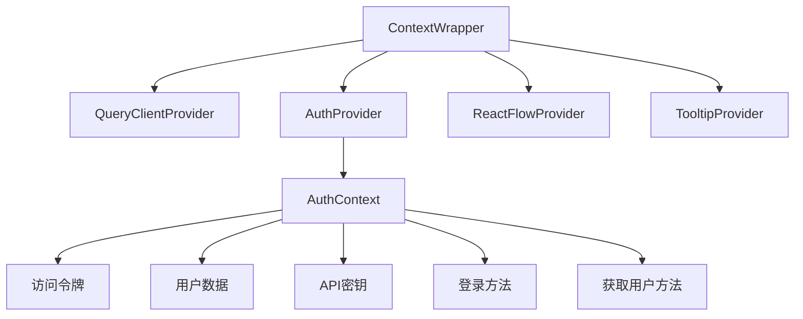
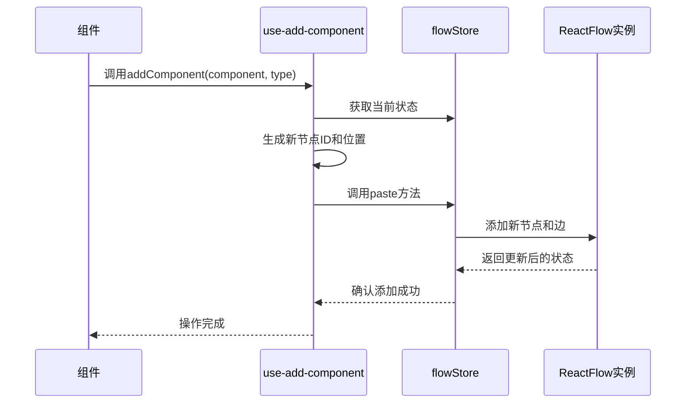
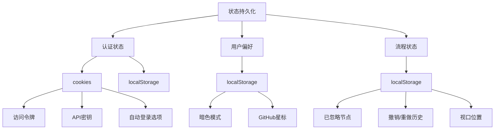

# 状态管理

<cite>
**本文档中引用的文件**  
- [flowStore.ts](file://vibe_surf/frontend/src/stores/flowStore.ts)
- [authStore.ts](file://vibe_surf/frontend/src/stores/authStore.ts)
- [darkStore.ts](file://vibe_surf/frontend/src/stores/darkStore.ts)
- [authContext.tsx](file://vibe_surf/frontend/src/contexts/authContext.tsx)
- [use-add-component.ts](file://vibe_surf/frontend/src/hooks/use-add-component.ts)
- [use-save-flow.ts](file://vibe_surf/frontend/src/hooks/flows/use-save-flow.ts)
- [alertStore.ts](file://vibe_surf/frontend/src/stores/alertStore.ts)
- [flowsManagerStore.ts](file://vibe_surf/frontend/src/stores/flowsManagerStore.ts)
- [index.tsx](file://vibe_surf/frontend/src/contexts/index.tsx)
</cite>

## 目录
1. [简介](#简介)
2. [核心状态存储](#核心状态存储)
3. [React Context应用](#react-context应用)
4. [自定义Hooks](#自定义hooks)
5. [状态持久化机制](#状态持久化机制)
6. [最佳实践与性能优化](#最佳实践与性能优化)
7. [常见问题解决方案](#常见问题解决方案)

## 简介
VibeSurf前端采用Zustand作为核心状态管理方案，结合React Context实现全局状态管理。系统通过多个专用store（如flowStore、authStore、darkStore）分离关注点，确保状态管理的可维护性和可扩展性。状态持久化通过localStorage和sessionStorage实现，确保用户偏好和关键数据在页面刷新后得以保留。

## 核心状态存储

VibeSurf的状态管理基于Zustand创建多个专用store，每个store负责特定领域的状态管理。

**flowStore** 是应用中最复杂的状态存储，负责管理流程编辑器的所有状态，包括节点、边、构建状态、视口信息等。它提供了丰富的操作方法来处理流程图的增删改查、构建、保存等操作。

**authStore** 管理用户认证相关状态，包括认证状态、访问令牌、用户数据等。它与浏览器cookies和localStorage集成，实现持久化的认证状态管理。

**darkStore** 管理应用的主题状态，包括暗色模式开关、GitHub星标数、版本信息等。主题偏好通过localStorage持久化存储。

**alertStore** 管理应用中的通知和警告状态，提供错误、通知和成功消息的显示机制，以及通知中心的历史记录功能。

**flowsManagerStore** 管理流程的全局状态，包括当前流程、流程列表、撤销/重做历史等。它实现了基于时间旅行的撤销/重做功能，支持用户操作的历史回溯。

**Section sources**
- [flowStore.ts](file://vibe_surf/frontend/src/stores/flowStore.ts)
- [authStore.ts](file://vibe_surf/frontend/src/stores/authStore.ts)
- [darkStore.ts](file://vibe_surf/frontend/src/stores/darkStore.ts)
- [alertStore.ts](file://vibe_surf/frontend/src/stores/alertStore.ts)
- [flowsManagerStore.ts](file://vibe_surf/frontend/src/stores/flowsManagerStore.ts)

## React Context应用

VibeSurf使用React Context来提供全局可访问的状态和功能。`AuthContext`是主要的Context实现，通过`AuthProvider`组件为整个应用提供认证相关的状态和方法。

`AuthContext`封装了访问令牌、用户数据、API密钥等认证信息，以及登录、获取用户信息等操作方法。它与`authStore`紧密集成，确保Context状态与Zustand store状态同步。

应用的Context层次结构通过`ContextWrapper`组件组织，将多个Context Provider（包括`QueryClientProvider`、`AuthProvider`、`ReactFlowProvider`等）组合在一起，为子组件提供所需的所有上下文。

**Diagram sources**
- [authContext.tsx](file://vibe_surf/frontend/src/contexts/authContext.tsx)
- [index.tsx](file://vibe_surf/frontend/src/contexts/index.tsx)

**Section sources**
- [authContext.tsx](file://vibe_surf/frontend/src/contexts/authContext.tsx)
- [index.tsx](file://vibe_surf/frontend/src/contexts/index.tsx)

## 自定义Hooks

VibeSurf通过自定义Hooks封装复杂的状态逻辑，提供简洁的API供组件使用。

**use-add-component** Hook封装了添加组件到流程图的逻辑。它处理组件的定位、ID生成、类型映射等细节，使组件能够以简洁的方式添加新节点到流程图中。

**use-save-flow** Hook封装了流程保存的逻辑，处理与后端API的交互、状态更新、错误处理等。它确保流程数据的一致性，并在保存成功后更新相关store的状态。

这些自定义Hooks通过订阅相关store的状态，确保在状态变化时自动更新，并通过回调函数处理异步操作的结果。

**Diagram sources**
- [use-add-component.ts](file://vibe_surf/frontend/src/hooks/use-add-component.ts)
- [use-save-flow.ts](file://vibe_surf/frontend/src/hooks/flows/use-save-flow.ts)
- [flowStore.ts](file://vibe_surf/frontend/src/stores/flowStore.ts)

**Section sources**
- [use-add-component.ts](file://vibe_surf/frontend/src/hooks/use-add-component.ts)
- [use-save-flow.ts](file://vibe_surf/frontend/src/hooks/flows/use-save-flow.ts)

## 状态持久化机制

VibeSurf通过多种机制实现状态持久化，确保用户数据和偏好在页面刷新后得以保留。

对于认证相关状态，系统使用cookies存储访问令牌和API密钥，同时在localStorage中备份这些信息。这种双重存储机制确保了认证状态的可靠性和持久性。

用户偏好如主题设置（暗色模式）通过localStorage持久化存储。`darkStore`在状态变化时自动更新localStorage中的对应值，并在初始化时从localStorage恢复状态。

流程相关的状态如已忽略的节点、撤销/重做历史等也通过localStorage持久化。例如，`flowStore`在用户忽略某个节点时，会将其ID存储在localStorage中，以便在下次加载相同流程时恢复忽略状态。

**Diagram sources**
- [authStore.ts](file://vibe_surf/frontend/src/stores/authStore.ts)
- [darkStore.ts](file://vibe_surf/frontend/src/stores/darkStore.ts)
- [flowStore.ts](file://vibe_surf/frontend/src/stores/flowStore.ts)

**Section sources**
- [authStore.ts](file://vibe_surf/frontend/src/stores/authStore.ts)
- [darkStore.ts](file://vibe_surf/frontend/src/stores/darkStore.ts)
- [flowStore.ts](file://vibe_surf/frontend/src/stores/flowStore.ts)

## 最佳实践与性能优化

VibeSurf的状态管理实现遵循了多项最佳实践和性能优化策略。

首先，通过store分离关注点，将不同领域的状态管理职责分配给专门的store，降低了系统的耦合度，提高了可维护性。

其次，利用Zustand的细粒度订阅机制，组件只订阅其所需的状态片段，避免了不必要的重新渲染。例如，组件可以通过`useFlowStore((state) => state.nodes)`只订阅节点状态，而不受其他状态变化的影响。

在性能优化方面，系统实现了防抖保存机制，通过`flowsManagerStore`中的`autoSavingInterval`配置，避免频繁的保存操作对性能造成影响。

对于复杂的计算，如流程构建的依赖分析，系统采用惰性计算和缓存策略，避免重复计算。`flowStore`中的`buildPositionDictionary`等工具函数帮助优化了节点位置的计算性能。

## 常见问题解决方案

VibeSurf的状态管理系统设计时考虑了多种常见问题的解决方案。

对于状态同步问题，系统通过单一数据源原则确保状态一致性。所有状态更新都通过store的action方法进行，避免了直接修改状态导致的不一致。

在错误处理方面，`alertStore`提供了统一的错误通知机制，确保所有错误都能被正确捕获和显示。系统还实现了错误历史记录功能，帮助用户追踪问题。

对于并发操作问题，系统通过状态版本控制和操作队列机制避免冲突。例如，在流程构建过程中，系统会锁定相关状态，防止其他操作干扰构建过程。

在状态初始化方面，系统实现了优雅的降级处理。当localStorage中的数据损坏或格式不兼容时，系统能够安全地恢复到默认状态，确保应用的可用性。