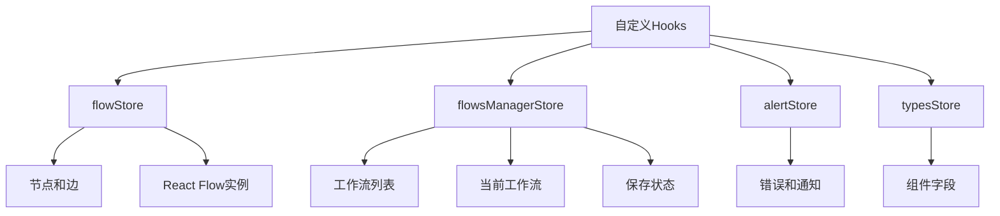
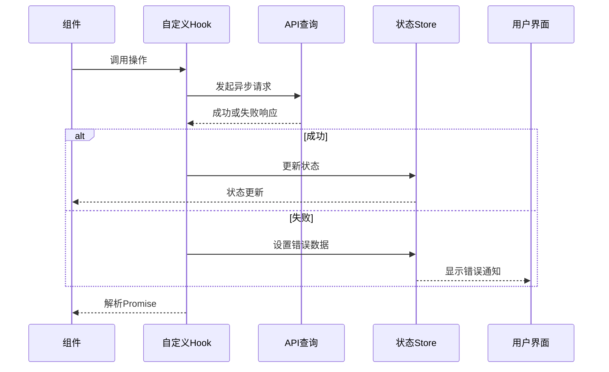
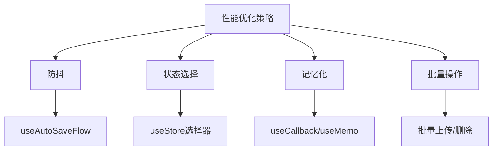

# 自定义Hooks

<cite>
**本文档中引用的文件**  
- [use-save-flow.ts](file://vibe_surf/frontend/src/hooks/flows/use-save-flow.ts)
- [use-add-component.ts](file://vibe_surf/frontend/src/hooks/use-add-component.ts)
- [use-upload-flow.ts](file://vibe_surf/frontend/src/hooks/flows/use-upload-flow.ts)
- [use-delete-flow.ts](file://vibe_surf/frontend/src/hooks/flows/use-delete-flow.ts)
- [use-autosave-flow.ts](file://vibe_surf/frontend/src/hooks/flows/use-autosave-flow.ts)
- [flowStore.ts](file://vibe_surf/frontend/src/stores/flowStore.ts)
- [flowsManagerStore.ts](file://vibe_surf/frontend/src/stores/flowsManagerStore.ts)
- [use-debounce.ts](file://vibe_surf/frontend/src/hooks/use-debounce.ts)
- [reactflowUtils.ts](file://vibe_surf/frontend/src/utils/reactflowUtils.ts)
- [alerts_constants.tsx](file://vibe_surf/frontend/src/constants/alerts_constants.tsx)
- [constants.ts](file://vibe_surf/frontend/src/constants/constants.ts)
</cite>

## 目录
1. [简介](#简介)
2. [核心自定义Hooks分析](#核心自定义hooks分析)
3. [依赖状态管理](#依赖状态管理)
4. [异步与错误处理机制](#异步与错误处理机制)
5. [性能优化与最佳实践](#性能优化与最佳实践)
6. [集成示例](#集成示例)
7. [结论](#结论)

## 简介
VibeSurf前端实现了一套自定义Hooks，用于简化工作流编辑器中的复杂操作。这些Hooks封装了与工作流相关的业务逻辑，包括保存、添加组件、上传、删除和自动保存等功能。通过将这些逻辑抽象为可复用的Hooks，VibeSurf实现了组件逻辑的简化和代码复用性的提高。这些Hooks依赖于Zustand状态管理库中的多个store，协调前端状态与后端API调用，提供了完整的加载状态管理和错误处理机制。

## 核心自定义Hooks分析

### use-save-flow
`use-save-flow` Hook负责工作流的保存操作。它通过比较当前工作流与已保存工作流的差异来决定是否需要执行保存。该Hook依赖于`flowStore`和`flowsManagerStore`中的多个状态，包括当前工作流、节点、边和React Flow实例。当检测到工作流有变更时，它会调用`usePatchUpdateFlow` API查询来更新工作流数据。在保存过程中，Hook会管理加载状态，成功后更新store中的工作流列表和当前工作流，失败时则通过`alertStore`显示错误信息。

**Section sources**
- [use-save-flow.ts](file://vibe_surf/frontend/src/hooks/flows/use-save-flow.ts#L1-L136)

### use-add-component
`use-add-component` Hook用于在画布上添加新的组件节点。它利用`useStoreApi`获取React Flow的内部状态，计算新节点的放置位置（默认居中）。该Hook会生成唯一的节点ID，创建包含组件信息的节点对象，并通过`flowStore`的`paste`方法将节点添加到画布。添加组件时会触发分析跟踪事件，记录用户行为。该Hook使用`useCallback`进行记忆化，避免不必要的重新渲染。

**Section sources**
- [use-add-component.ts](file://vibe_surf/frontend/src/hooks/use-add-component.ts#L1-L81)

### use-upload-flow
`use-upload-flow` Hook处理工作流文件的上传和导入。它首先通过`createFileUpload`工具函数打开文件选择对话框，验证文件类型为JSON。然后使用`getObjectsFromFilelist`读取文件内容，解析出工作流数据。该Hook支持批量上传多个工作流，并能区分组件和普通工作流。上传时，它会将工作流数据添加到画布（指定位置）或通过`use-add-flow`添加到工作流列表中，实现了灵活的导入功能。

**Section sources**
- [use-upload-flow.ts](file://vibe_surf/frontend/src/hooks/flows/use-upload-flow.ts#L1-L101)

### use-delete-flow
`use-delete-flow` Hook提供工作流删除功能。它支持删除单个或多个工作流，通过`useDeleteDeleteFlows` API查询执行删除操作。删除成功后，它会更新`flowsManagerStore`中的工作流列表，并同步更新`typesStore`中的组件字段信息，确保状态一致性。该Hook返回删除操作的Promise和`isDeleting`状态，便于UI显示加载指示器。

**Section sources**
- [use-delete-flow.ts](file://vibe_surf/frontend/src/hooks/flows/use-delete-flow.ts#L1-L52)

### use-autosave-flow
`use-autosave-flow` Hook实现了工作流的自动保存功能。它依赖于`useSaveFlow`和`useDebounce`，根据`flowsManagerStore`中的`autoSaving`和`autoSavingInterval`设置来控制自动保存行为。当自动保存启用时，对工作流的任何更改都会在指定的防抖延迟后触发保存操作。这种设计避免了频繁的保存请求，提高了性能。

**Section sources**
- [use-autosave-flow.ts](file://vibe_surf/frontend/src/hooks/flows/use-autosave-flow.ts#L1-L23)

## 依赖状态管理
VibeSurf的自定义Hooks依赖于多个Zustand store来管理应用状态：

- **flowStore**: 管理当前工作流的节点、边、React Flow实例等画布相关状态
- **flowsManagerStore**: 管理工作流列表、当前工作流、保存加载状态等全局工作流状态
- **alertStore**: 处理错误和通知消息的显示
- **typesStore**: 存储组件类型和字段信息

这些Hooks通过`useStore`选择器订阅特定状态，实现了精确的状态更新，避免了不必要的组件重新渲染。例如，`useSaveFlow`只订阅了`setFlows`、`setErrorData`和`setSaveLoading`等必要状态，而不是整个store。



**Diagram sources**
- [flowStore.ts](file://vibe_surf/frontend/src/stores/flowStore.ts#L61-L800)
- [flowsManagerStore.ts](file://vibe_surf/frontend/src/stores/flowsManagerStore.ts#L19-L145)

## 异步与错误处理机制
所有涉及API调用的Hooks都采用了标准的异步处理模式，使用Promise封装异步操作，便于在组件中使用async/await语法。错误处理通过API查询的`onError`回调实现，将错误信息传递给`alertStore`进行统一的用户界面展示。

例如，`useSaveFlow`在保存失败时会调用`setErrorData`设置错误标题和详细信息列表，这些信息随后会在UI中显示为错误通知。这种集中式的错误处理机制确保了用户体验的一致性。



**Diagram sources**
- [use-save-flow.ts](file://vibe_surf/frontend/src/hooks/flows/use-save-flow.ts#L19-L128)
- [use-delete-flow.ts](file://vibe_surf/frontend/src/hooks/flows/use-delete-flow.ts#L14-L45)

## 性能优化与最佳实践

### 依赖数组管理
所有使用`useCallback`的Hooks都正确管理了依赖数组，确保回调函数仅在依赖项变化时重新创建。例如，`useAddComponent`的依赖数组包括`store`、`paste`和`filterEdge`，这些是回调函数中使用的外部变量。

### 清理函数实现
虽然这些Hooks本身不涉及需要清理的副作用（如定时器或事件监听器），但它们通过返回的函数提供了明确的API边界，符合Hooks的最佳实践。

### 性能优化
- **防抖机制**: `useAutoSaveFlow`使用`useDebounce`避免频繁保存
- **状态选择**: 使用store选择器订阅最小必要状态
- **记忆化**: 使用`useCallback`和`useMemo`避免不必要的重新渲染
- **批量操作**: 在循环中处理多个工作流时，避免在每次迭代中更新状态



**Diagram sources**
- [use-autosave-flow.ts](file://vibe_surf/frontend/src/hooks/flows/use-autosave-flow.ts#L13-L17)
- [use-debounce.ts](file://vibe_surf/frontend/src/hooks/use-debounce.ts#L4-L13)

## 集成示例
这些自定义Hooks在组件中的集成方式简洁直观。例如，在保存按钮组件中：

```typescript
const SaveButton = () => {
  const saveFlow = useSaveFlow();
  const isSaving = useFlowsManagerStore(state => state.saveLoading);
  
  return (
    <button onClick={() => saveFlow()} disabled={isSaving}>
      {isSaving ? '保存中...' : '保存'}
    </button>
  );
};
```

在画布组件中添加组件：

```typescript
const Canvas = () => {
  const addComponent = useAddComponent();
  
  const handleAddComponent = (component) => {
    addComponent(component, 'genericnode');
  };
  
  return (
    <ComponentLibrary onAdd={handleAddComponent} />
  );
};
```

**Section sources**
- [use-save-flow.ts](file://vibe_surf/frontend/src/hooks/flows/use-save-flow.ts#L10-L135)
- [use-add-component.ts](file://vibe_surf/frontend/src/hooks/use-add-component.ts#L11-L79)

## 结论
VibeSurf的自定义Hooks设计体现了良好的前端架构实践。通过将复杂的业务逻辑封装在Hooks中，实现了代码的高复用性和组件的简洁性。这些Hooks有效地管理了异步操作、错误处理和加载状态，提供了流畅的用户体验。依赖Zustand状态管理库，它们实现了高效的状态更新和性能优化。整体设计遵循了React Hooks的最佳实践，包括正确的依赖数组管理、记忆化和关注点分离，为大型前端应用的开发提供了可扩展的解决方案。